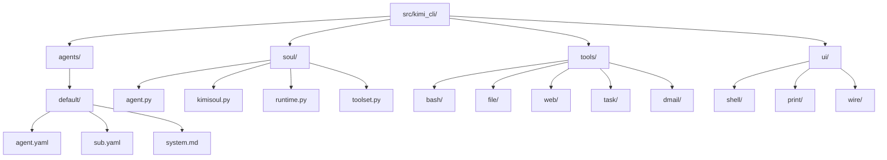
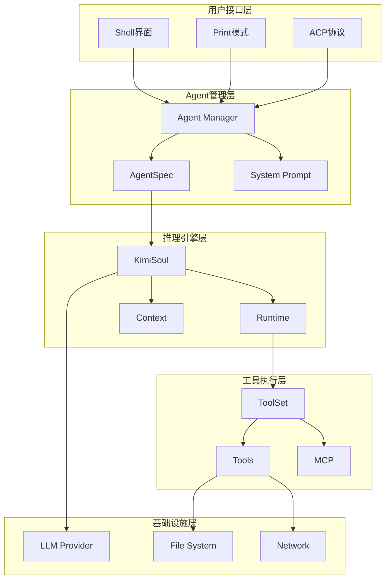
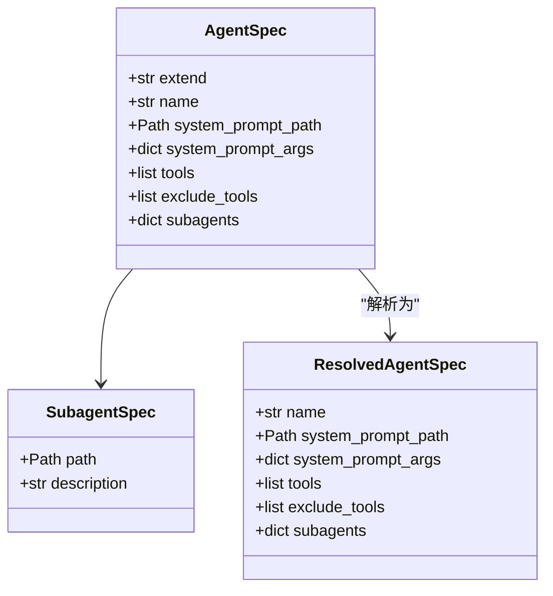
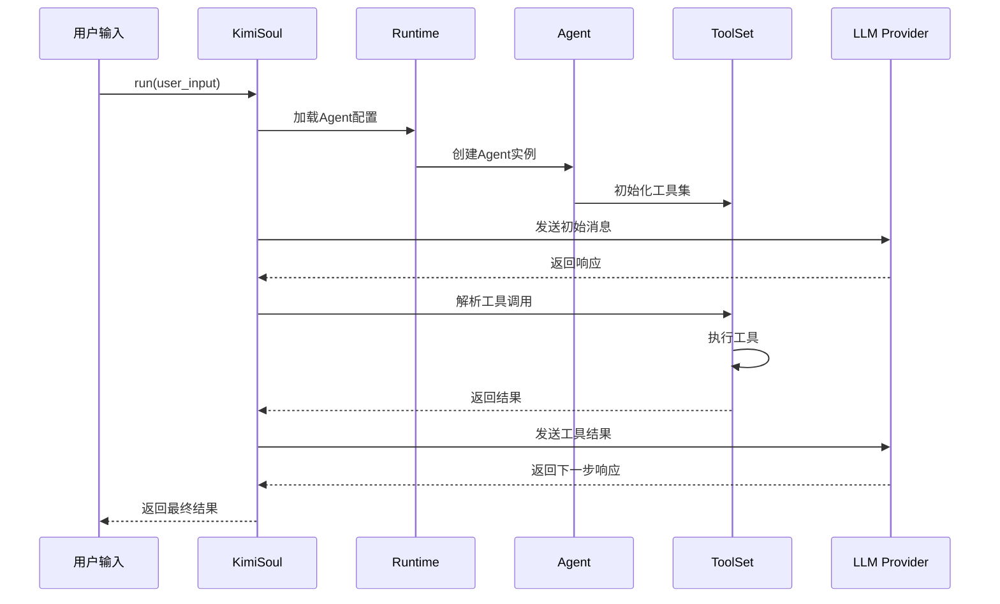
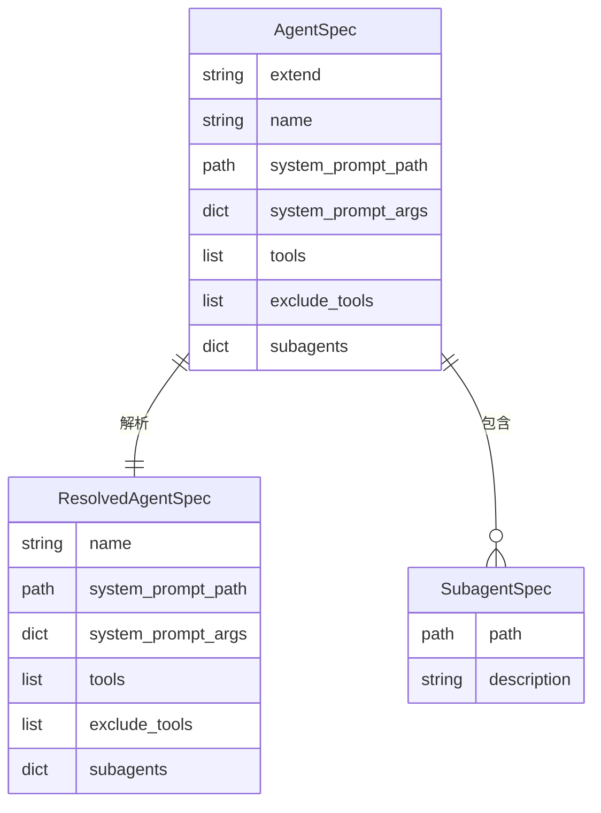
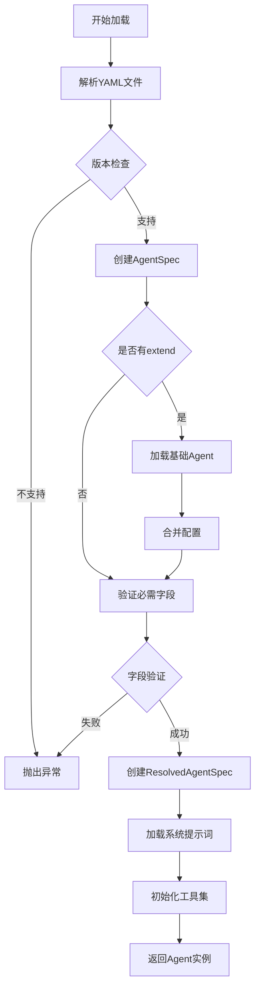
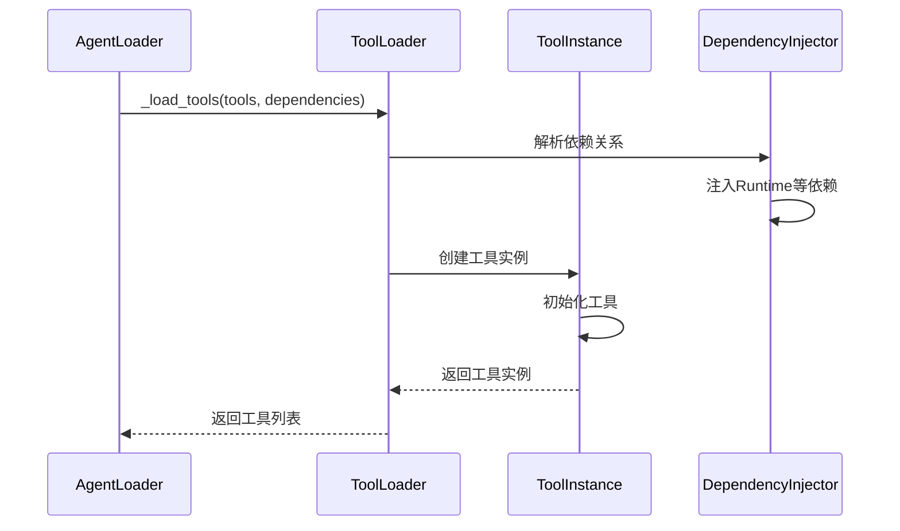
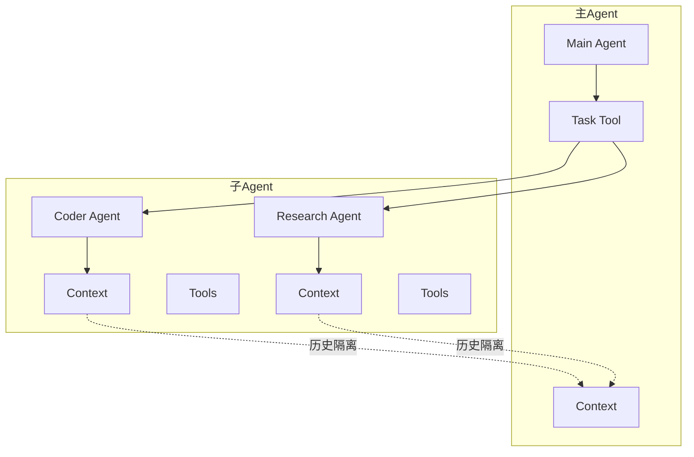
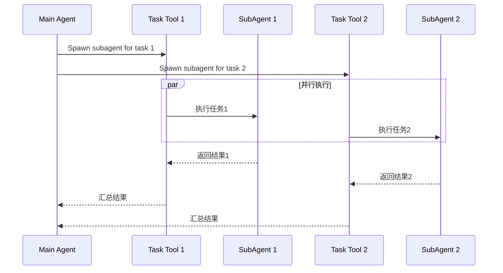

# Agent系统

<cite>
**本文档引用的文件**
- [agentspec.py](file://src/kimi_cli/agentspec.py)
- [agent.yaml](file://src/kimi_cli/agents/default/agent.yaml)
- [sub.yaml](file://src/kimi_cli/agents/default/sub.yaml)
- [system.md](file://src/kimi_cli/agents/default/system.md)
- [agent.py](file://src/kimi_cli/soul/agent.py)
- [runtime.py](file://src/kimi_cli/soul/runtime.py)
- [kimisoul.py](file://src/kimi_cli/soul/kimisoul.py)
- [toolset.py](file://src/kimi_cli/soul/toolset.py)
- [app.py](file://src/kimi_cli/app.py)
- [__init__.py](file://src/kimi_cli/tools/__init__.py)
- [task.md](file://src/kimi_cli/tools/task/task.md)
- [test_default_agent.py](file://tests/test_default_agent.py)
- [test_load_agent.py](file://tests/test_load_agent.py)
- [AGENTS.md](file://AGENTS.md)
</cite>

## 目录
1. [简介](#简介)
2. [项目结构](#项目结构)
3. [核心组件](#核心组件)
4. [架构概览](#架构概览)
5. [详细组件分析](#详细组件分析)
6. [AgentSpec数据模型](#agentspec数据模型)
7. [YAML配置系统](#yaml配置系统)
8. [动态加载机制](#动态加载机制)
9. [子Agent系统](#子agent系统)
10. [最佳实践指南](#最佳实践指南)
11. [故障排除](#故障排除)
12. [总结](#总结)

## 简介

Kimi CLI的Agent系统是一个高度模块化的AI代理框架，作为软件工程任务的核心执行引擎。该系统通过YAML配置文件定义代理行为，支持动态加载、子代理委托和工具集成，为用户提供交互式CLI代理服务。

Agent系统的核心设计理念是：
- **模块化架构**：通过独立的AgentSpec和工具系统实现松耦合设计
- **可扩展性**：支持自定义Agent配置和工具扩展
- **任务委托**：通过子Agent实现上下文隔离和并行多任务处理
- **动态加载**：运行时动态加载Agent配置和工具依赖

## 项目结构

Agent系统的文件组织遵循清晰的分层架构：



**图表来源**
- [agentspec.py](file://src/kimi_cli/agentspec.py#L1-L120)
- [agent.py](file://src/kimi_cli/soul/agent.py#L1-L165)

**章节来源**
- [AGENTS.md](file://AGENTS.md#L46-L59)

## 核心组件

Agent系统由以下核心组件构成：

### AgentSpec模块
负责Agent配置的解析和验证，定义Agent的基本属性和行为规范。

### Soul推理引擎
包含Kimisoul主引擎、运行时环境管理和工具集协调器。

### 工具系统
提供丰富的内置工具集，支持文件操作、网络搜索、命令执行等功能。

### 用户界面层
支持Shell交互式界面、打印模式和ACP协议服务器模式。

**章节来源**
- [agentspec.py](file://src/kimi_cli/agentspec.py#L20-L42)
- [agent.py](file://src/kimi_cli/soul/agent.py#L23-L31)

## 架构概览

Agent系统采用分层架构设计，各层职责明确：



**图表来源**
- [app.py](file://src/kimi_cli/app.py#L25-L102)
- [kimisoul.py](file://src/kimi_cli/soul/kimisoul.py#L57-L86)

## 详细组件分析

### AgentSpec数据模型

AgentSpec是Agent系统的核心数据模型，定义了Agent的完整配置规范：



**图表来源**
- [agentspec.py](file://src/kimi_cli/agentspec.py#L20-L42)

#### 核心字段说明

| 字段名 | 类型 | 必需 | 描述 |
|--------|------|------|------|
| extend | str \| None | 否 | 继承的基础Agent文件路径 |
| name | str \| None | 是 | Agent名称标识符 |
| system_prompt_path | Path \| None | 是 | 系统提示词文件路径 |
| system_prompt_args | dict[str, str] | 否 | 系统提示词参数映射 |
| tools | list[str] \| None | 是 | 可用工具列表 |
| exclude_tools | list[str] \| None | 否 | 排除的工具列表 |
| subagents | dict[str, SubagentSpec] \| None | 否 | 子Agent配置字典 |

**章节来源**
- [agentspec.py](file://src/kimi_cli/agentspec.py#L20-L42)

### Soul推理引擎

Kimisoul是Agent系统的主要推理引擎，负责协调整个Agent生命周期：



**图表来源**
- [kimisoul.py](file://src/kimi_cli/soul/kimisoul.py#L144-L200)
- [agent.py](file://src/kimi_cli/soul/agent.py#L32-L80)

**章节来源**
- [kimisoul.py](file://src/kimi_cli/soul/kimisoul.py#L57-L165)

## AgentSpec数据模型

### 数据结构定义

AgentSpec使用Pydantic进行数据验证和类型安全：



**图表来源**
- [agentspec.py](file://src/kimi_cli/agentspec.py#L20-L42)

### 验证规则

AgentSpec实现了严格的验证规则确保配置完整性：

1. **必需字段验证**：name、system_prompt_path、tools字段必须存在
2. **版本兼容性**：只支持version=1的配置格式
3. **路径解析**：相对路径相对于Agent文件所在目录解析
4. **继承链验证**：递归解析extend链直到基础Agent

**章节来源**
- [agentspec.py](file://src/kimi_cli/agentspec.py#L55-L78)

## YAML配置系统

### 主Agent配置

主Agent通过agent.yaml文件定义核心行为：

```yaml
version: 1
agent:
  name: ""
  system_prompt_path: ./system.md
  system_prompt_args:
    ROLE_ADDITIONAL: ""
  tools:
    - "kimi_cli.tools.task:Task"
    - "kimi_cli.tools.todo:SetTodoList"
    - "kimi_cli.tools.bash:Bash"
    - "kimi_cli.tools.file:ReadFile"
    - "kimi_cli.tools.file:Glob"
    - "kimi_cli.tools.file:Grep"
    - "kimi_cli.tools.file:WriteFile"
    - "kimi_cli.tools.file:StrReplaceFile"
    - "kimi_cli.tools.web:SearchWeb"
    - "kimi_cli.tools.web:FetchURL"
  subagents:
    coder:
      path: ./sub.yaml
      description: "Good at general software engineering tasks."
```

### 系统提示词模板

系统提示词支持变量替换和动态内容：

```markdown
You are Kimi CLI. You are an interactive CLI agent specializing in software engineering tasks.

${ROLE_ADDITIONAL}

# Working Environment
## Operating System
The operating environment is not in a sandbox...

## Working Directory
The current working directory is `${KIMI_WORK_DIR}`...

## Date and Time
The current date and time in ISO format is `${KIMI_NOW}`...
```

### 子Agent配置

子Agent通过继承主Agent配置并定制特定行为：

```yaml
version: 1
agent:
  extend: ./agent.yaml
  system_prompt_args:
    ROLE_ADDITIONAL: |
      You are now running as a subagent. All the `user` messages are sent by the main agent...
  exclude_tools:
    - "kimi_cli.tools.task:Task"
    - "kimi_cli.tools.dmail:SendDMail"
    - "kimi_cli.tools.todo:SetTodoList"
  subagents: # make sure no subagents are provided
```

**章节来源**
- [agent.yaml](file://src/kimi_cli/agents/default/agent.yaml#L1-L25)
- [sub.yaml](file://src/kimi_cli/agents/default/sub.yaml#L1-L12)
- [system.md](file://src/kimi_cli/agents/default/system.md#L1-L73)

## 动态加载机制

### Agent加载流程

Agent系统支持运行时动态加载Agent配置：



**图表来源**
- [agentspec.py](file://src/kimi_cli/agentspec.py#L55-L120)
- [agent.py](file://src/kimi_cli/soul/agent.py#L32-L80)

### 工具加载系统

工具系统支持依赖注入和动态加载：



**图表来源**
- [agent.py](file://src/kimi_cli/soul/agent.py#L100-L141)

**章节来源**
- [agent.py](file://src/kimi_cli/soul/agent.py#L32-L80)

## 子Agent系统

### 任务委托机制

子Agent系统通过Task工具实现任务委托和上下文隔离：



**图表来源**
- [task.md](file://src/kimi_cli/tools/task/task.md#L1-L27)

### 上下文隔离

子Agent拥有独立的上下文历史，确保任务间的隔离：

1. **独立历史文件**：每个子Agent使用单独的历史文件
2. **Fresh Context**：子Agent启动时没有主Agent的历史信息
3. **结果聚合**：子Agent的结果通过Task工具返回给主Agent

### 并行多任务处理

子Agent支持并行执行多个独立任务：



**图表来源**
- [task.md](file://src/kimi_cli/tools/task/task.md#L16-L22)

**章节来源**
- [task.md](file://src/kimi_cli/tools/task/task.md#L1-L27)
- [test_default_agent.py](file://tests/test_default_agent.py#L98-L529)

## 最佳实践指南

### 自定义Agent创建步骤

1. **创建配置文件**
   ```yaml
   version: 1
   agent:
     name: "Custom Agent"
     system_prompt_path: "./custom_system.md"
     tools:
       - "kimi_cli.tools.bash:Bash"
       - "kimi_cli.tools.file:ReadFile"
   ```

2. **定义系统提示词**
   ```
   You are a specialized ${ROLE_TYPE} agent. Your expertise includes...
   
   # Task Guidelines
   - Focus on ${TASK_FOCUS}
   - Use tools efficiently: ${TOOLS_AVAILABLE}
   - Maintain ${QUALITY_STANDARDS}
   ```

3. **配置工具集**
   - 选择合适的工具组合
   - 排除不必要的工具以减少复杂度
   - 考虑工具间的依赖关系

### 配置优化建议

| 配置项 | 建议 | 原因 |
|--------|------|------|
| tools | 精简选择 | 减少上下文负担，提高效率 |
| exclude_tools | 排除危险工具 | 增强安全性 |
| system_prompt_args | 动态参数 | 提高Agent适应性 |
| subagents | 合理拆分 | 实现任务专业化 |

### 安全考虑

1. **文件系统访问限制**：默认限制在工作目录内
2. **工具权限控制**：通过exclude_tools限制危险操作
3. **上下文大小管理**：实现上下文压缩机制
4. **用户确认机制**：重要的操作需要用户确认

**章节来源**
- [AGENTS.md](file://AGENTS.md#L144-L168)

## 故障排除

### 常见问题及解决方案

#### Agent加载失败

**症状**：Agent配置文件无法正确加载
**原因**：YAML语法错误或字段缺失
**解决**：检查YAML格式，确保必需字段完整

#### 工具加载错误

**症状**：工具导入失败或依赖注入错误
**原因**：工具路径错误或依赖缺失
**解决**：验证工具路径，检查依赖安装

#### 子Agent通信问题

**症状**：子Agent无法正常工作或结果丢失
**原因**：上下文文件权限或历史文件损坏
**解决**：检查文件权限，清理历史文件

### 调试技巧

1. **启用详细日志**：设置适当的日志级别
2. **检查配置验证**：使用内置验证机制
3. **监控资源使用**：关注内存和Token使用情况
4. **测试工具功能**：单独测试每个工具

**章节来源**
- [test_load_agent.py](file://tests/test_load_agent.py#L1-L113)

## 总结

Kimi CLI的Agent系统是一个设计精良的AI代理框架，具有以下核心优势：

### 技术特点
- **模块化设计**：清晰的分层架构便于维护和扩展
- **动态加载**：支持运行时配置和工具热插拔
- **任务委托**：通过子Agent实现复杂的多任务处理
- **安全可控**：完善的权限控制和上下文隔离机制

### 应用价值
- **开发效率**：自动化处理重复性软件工程任务
- **学习辅助**：提供实时的代码分析和改进建议
- **协作增强**：支持团队间的知识共享和任务分配

### 发展方向
- **工具生态**：持续扩展工具库覆盖更多开发场景
- **智能调度**：优化子Agent的任务分配和优先级管理
- **性能优化**：改进上下文管理和工具执行效率
- **用户体验**：增强交互界面和结果可视化能力

Agent系统为Kimi CLI提供了强大的AI代理能力，使其能够胜任复杂的软件工程任务，同时保持良好的可扩展性和可维护性。