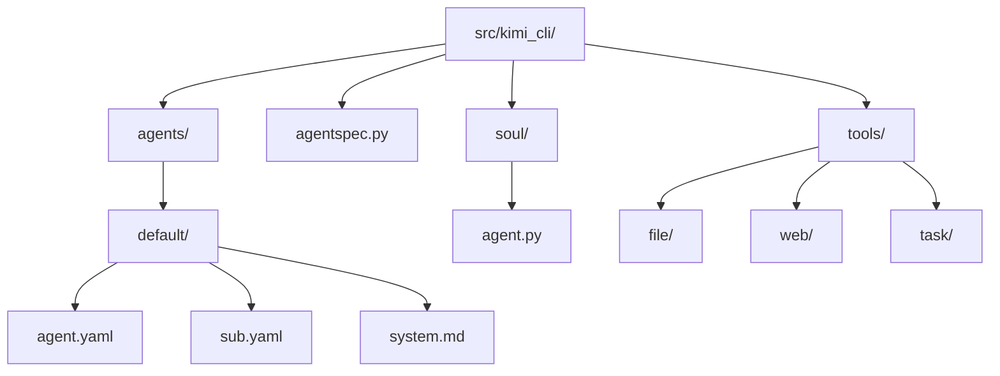
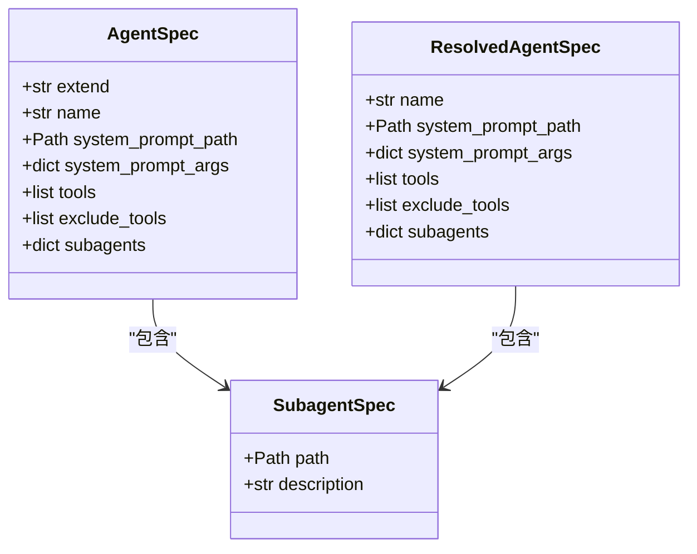
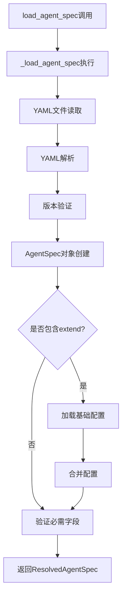
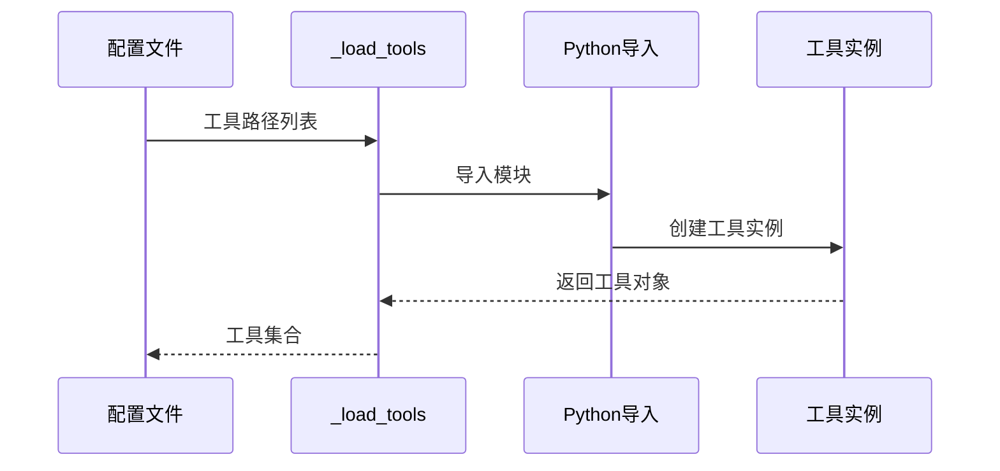
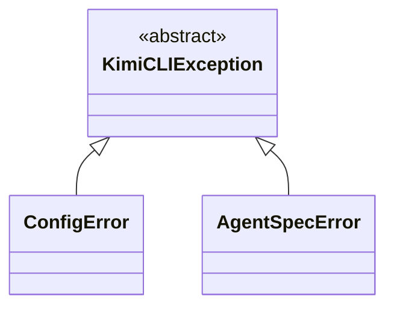

# Agent配置详细文档

<cite>
**本文档引用的文件**
- [agentspec.py](file://src/kimi_cli/agentspec.py)
- [agent.yaml](file://src/kimi_cli/agents/default/agent.yaml)
- [sub.yaml](file://src/kimi_cli/agents/default/sub.yaml)
- [system.md](file://src/kimi_cli/agents/default/system.md)
- [test_agent_spec.py](file://tests/test_agent_spec.py)
- [_load_tools.py](file://src/kimi_cli/soul/agent.py)
- [read.py](file://src/kimi_cli/tools/file/read.py)
- [search.py](file://src/kimi_cli/tools/web/search.py)
- [task.py](file://src/kimi_cli/tools/task/__init__.py)
</cite>

## 目录
1. [简介](#简介)
2. [项目结构概览](#项目结构概览)
3. [AgentSpec数据模型](#agentspec数据模型)
4. [agent.yaml文件结构详解](#agentyaml文件结构详解)
5. [配置加载机制](#配置加载机制)
6. [工具系统](#工具系统)
7. [系统提示词配置](#系统提示词配置)
8. [子Agent系统](#子agent系统)
9. [配置验证与错误处理](#配置验证与错误处理)
10. [常见配置错误排查](#常见配置错误排查)
11. [最佳实践](#最佳实践)
12. [总结](#总结)

## 简介

Kimi CLI的Agent配置系统是一个基于YAML文件的灵活架构，允许用户定义智能代理的行为、能力范围和交互模式。该系统通过`AgentSpec`数据模型和`load_agent_spec`函数实现了强大的配置管理功能，支持配置继承、工具组合和参数化定制。

## 项目结构概览

Agent配置相关的文件主要分布在以下目录结构中：



**图表来源**
- [agentspec.py](file://src/kimi_cli/agentspec.py#L1-L120)
- [agent.yaml](file://src/kimi_cli/agents/default/agent.yaml#L1-L25)

**章节来源**
- [agentspec.py](file://src/kimi_cli/agentspec.py#L1-L120)
- [agent.yaml](file://src/kimi_cli/agents/default/agent.yaml#L1-L25)

## AgentSpec数据模型

`AgentSpec`类是整个Agent配置系统的核心数据模型，基于Pydantic提供了强类型验证和配置管理功能。

### 核心字段定义



**图表来源**
- [agentspec.py](file://src/kimi_cli/agentspec.py#L20-L53)

### 字段详细说明

| 字段名 | 类型 | 必需 | 描述 |
|--------|------|------|------|
| `extend` | `str \| None` | 否 | 要继承的基础Agent配置文件路径，支持"default"关键字 |
| `name` | `str \| None` | 是 | Agent名称，必须指定 |
| `system_prompt_path` | `Path \| None` | 是 | 系统提示词文件路径 |
| `system_prompt_args` | `dict[str, str]` | 否 | 系统提示词参数字典，默认为空 |
| `tools` | `list[str] \| None` | 是 | 工具列表，格式为"module.path:ClassName" |
| `exclude_tools` | `list[str] \| None` | 否 | 要排除的工具列表 |
| `subagents` | `dict[str, SubagentSpec] \| None` | 否 | 子Agent配置字典 |

**章节来源**
- [agentspec.py](file://src/kimi_cli/agentspec.py#L20-L53)

## agent.yaml文件结构详解

### 基础配置结构

标准的agent.yaml文件采用以下结构：

```yaml
version: 1
agent:
  # 配置内容
```

### version字段

- **作用**: 指定配置文件格式版本
- **当前支持版本**: 1
- **验证规则**: 不支持的版本会抛出`AgentSpecError`

### name字段

- **作用**: 定义Agent的唯一标识名称
- **必需性**: 必须提供
- **验证**: `load_agent_spec`函数会检查此字段是否存在

### system_prompt_path字段

- **作用**: 指定系统提示词文件的相对路径
- **解析机制**: 自动转换为绝对路径（相对于配置文件所在目录）
- **示例**: `./system.md`

### system_prompt_args字段

- **作用**: 提供系统提示词的参数替换值
- **用途**: 支持模板化的系统提示词
- **示例**: 
  ```yaml
  system_prompt_args:
    ROLE_ADDITIONAL: "You are a specialized developer assistant"
    CUSTOM_VAR: "value"
  ```

### tools字段

工具列表是Agent能力的核心，采用模块路径加类名的格式：

```yaml
tools:
  - "kimi_cli.tools.task:Task"
  - "kimi_cli.tools.file:ReadFile"
  - "kimi_cli.tools.web:SearchWeb"
  - "kimi_cli.tools.bash:Bash"
```

#### 工具路径格式规范

工具路径遵循Python模块导入格式：`模块路径:类名`

- **模块路径**: Python包路径，从项目根目录开始
- **类名**: 工具类的名称
- **示例**: `kimi_cli.tools.file:ReadFile` 表示从`kimi_cli.tools.file`模块导入`ReadFile`类

### exclude_tools字段

用于从工具列表中排除特定工具：

```yaml
exclude_tools:
  - "kimi_cli.tools.web:SearchWeb"
  - "kimi_cli.tools.bash:Bash"
```

### subagents字段

子Agent配置允许创建专门化的Agent实例：

```yaml
subagents:
  coder:
    path: ./sub.yaml
    description: "Good at general software engineering tasks."
```

**章节来源**
- [agent.yaml](file://src/kimi_cli/agents/default/agent.yaml#L1-L25)
- [sub.yaml](file://src/kimi_cli/agents/default/sub.yaml#L1-L12)

## 配置加载机制

### load_agent_spec函数流程



**图表来源**
- [agentspec.py](file://src/kimi_cli/agentspec.py#L55-L119)

### 配置继承机制

系统支持多层配置继承，通过`extend`字段实现：

1. **默认继承**: 使用`extend: default`继承基础配置
2. **相对路径继承**: 使用相对路径继承其他配置文件
3. **配置合并**: 子配置会覆盖父配置的相应字段

### 参数注入机制

系统提示词参数通过字符串模板进行注入：

```python
# 参数注入示例
system_prompt = template.substitute(builtin_args, **spec_args)
```

**章节来源**
- [agentspec.py](file://src/kimi_cli/agentspec.py#L55-L119)

## 工具系统

### 工具加载流程



**图表来源**
- [_load_tools.py](file://src/kimi_cli/soul/agent.py#L100-L141)

### 工具路径解析

工具路径解析遵循以下步骤：

1. **路径分割**: 使用`:`分隔模块路径和类名
2. **模块导入**: 动态导入指定模块
3. **类查找**: 获取模块中的指定类
4. **依赖注入**: 根据签名自动注入依赖

### 工具验证机制

系统提供多层次的工具验证：

- **存在性检查**: 验证模块和类是否存在
- **签名匹配**: 检查工具构造函数签名
- **依赖验证**: 确保所有必需依赖都已提供

**章节来源**
- [_load_tools.py](file://src/kimi_cli/soul/agent.py#L100-L141)
- [read.py](file://src/kimi_cli/tools/file/read.py#L1-L141)
- [search.py](file://src/kimi_cli/tools/web/search.py#L1-L128)

## 系统提示词配置

### system.md文件结构

系统提示词文件采用Markdown格式，支持变量替换：

```markdown
You are Kimi CLI. ${ROLE_ADDITIONAL}

# Working Environment
## Operating System
The operating environment is not in a sandbox...

${KIMI_WORK_DIR}/AGENTS.md:
---
${KIMI_AGENTS_MD}
---
```

### 变量替换机制

系统支持多种内置变量：

| 变量名 | 描述 | 示例值 |
|--------|------|--------|
| `${ROLE_ADDITIONAL}` | 角色补充信息 | 用户自定义的角色描述 |
| `${KIMI_WORK_DIR}` | 工作目录路径 | `/home/user/project` |
| `${KIMI_NOW}` | 当前时间 | `2024-01-01T12:00:00` |
| `${KIMI_WORK_DIR_LS}` | 目录列表 | `README.md<br/>src/<br/>tests/` |
| `${KIMI_AGENTS_MD}` | AGENTS.md内容 | 项目相关信息 |

### 提示词参数化

通过`system_prompt_args`可以动态定制提示词内容：

```yaml
system_prompt_args:
  ROLE_ADDITIONAL: |
    You are now running as a subagent. All the `user` messages are sent by the main agent...
```

**章节来源**
- [system.md](file://src/kimi_cli/agents/default/system.md#L1-L73)

## 子Agent系统

### 子Agent配置

子Agent通过独立的配置文件实现专门化：

```yaml
# sub.yaml
version: 1
agent:
  extend: ./agent.yaml
  system_prompt_args:
    ROLE_ADDITIONAL: |
      You are now running as a subagent. All the `user` messages are sent by the main agent...
  exclude_tools:
    - "kimi_cli.tools.task:Task"
    - "kimi_cli.tools.dmail:SendDMail"
```

### 子Agent特点

1. **专门化**: 通过排除工具实现功能专一化
2. **隔离性**: 子Agent无法直接访问主Agent上下文
3. **总结要求**: 必须提供完整的任务总结

### Task工具集成

`Task`工具支持启动子Agent：

```python
class Params(BaseModel):
    description: str = Field("简短的任务描述")
    subagent_name: str = Field("要使用的子Agent名称")
    prompt: str = Field("详细的子Agent任务说明")
```

**章节来源**
- [sub.yaml](file://src/kimi_cli/agents/default/sub.yaml#L1-L12)
- [task.py](file://src/kimi_cli/tools/task/__init__.py#L1-L176)

## 配置验证与错误处理

### AgentSpecError异常体系



**图表来源**
- [agentspec.py](file://src/kimi_cli/agentspec.py#L16-L19)

### 验证规则

系统在多个层面进行配置验证：

1. **必需字段检查**
   - `name`字段不能为空
   - `system_prompt_path`不能为空
   - `tools`列表不能为空

2. **格式验证**
   - YAML语法正确性
   - 版本号支持性
   - 工具路径格式

3. **依赖验证**
   - 模块可导入性
   - 类存在性
   - 依赖完整性

### 错误处理策略

- **早期失败**: 在配置加载阶段尽早发现错误
- **详细错误信息**: 提供具体的错误原因和修复建议
- **优雅降级**: 对于可选配置提供默认值

**章节来源**
- [agentspec.py](file://src/kimi_cli/agentspec.py#L55-L78)
- [test_agent_spec.py](file://tests/test_agent_spec.py#L1-L272)

## 常见配置错误排查

### YAML语法错误

**症状**: `AgentSpecError: Invalid YAML in agent spec file`

**排查方法**:
1. 检查缩进是否正确（使用空格而非制表符）
2. 验证引号使用是否正确
3. 确认特殊字符转义

**示例修复**:
```yaml
# 错误
tools: [kimi_cli.tools.file:ReadFile,kimi_cli.tools.web:SearchWeb]

# 正确
tools:
  - "kimi_cli.tools.file:ReadFile"
  - "kimi_cli.tools.web:SearchWeb"
```

### 工具路径无效

**症状**: 工具加载失败或工具不可用

**排查步骤**:
1. 验证模块路径是否正确
2. 检查类名拼写
3. 确认模块可导入

**调试命令**:
```python
# 手动测试工具导入
try:
    import kimi_cli.tools.file
    print("模块导入成功")
except ImportError as e:
    print(f"模块导入失败: {e}")

# 检查类是否存在
cls = getattr(kimi_cli.tools.file, "ReadFile", None)
print(f"类存在: {cls is not None}")
```

### 系统提示词文件缺失

**症状**: `FileNotFoundError`或提示词加载失败

**解决方案**:
1. 确认文件路径相对于配置文件的正确性
2. 检查文件权限
3. 验证文件编码（UTF-8）

### 配置继承问题

**症状**: 继承配置未生效或冲突

**排查要点**:
1. 检查`extend`字段路径
2. 确认基础配置文件存在
3. 验证配置合并逻辑

**章节来源**
- [test_agent_spec.py](file://tests/test_agent_spec.py#L25-L40)

## 最佳实践

### 配置组织

1. **模块化设计**: 将通用配置放在基础文件中
2. **继承层次**: 合理使用配置继承减少重复
3. **参数化**: 充分利用`system_prompt_args`进行定制

### 工具选择

1. **按需加载**: 只包含必要的工具
2. **工具排除**: 排除不需要的功能
3. **子Agent**: 对于复杂任务使用专门化子Agent

### 提示词优化

1. **清晰结构**: 使用明确的标题和分段
2. **变量使用**: 合理使用内置变量
3. **示例提供**: 包含具体的操作示例

### 错误预防

1. **配置验证**: 在部署前验证配置正确性
2. **日志记录**: 启用详细的日志记录
3. **备份配置**: 保留配置文件的备份

## 总结

Kimi CLI的Agent配置系统通过精心设计的数据模型和加载机制，提供了强大而灵活的配置管理能力。核心特性包括：

- **强类型验证**: 基于Pydantic的配置验证
- **配置继承**: 支持多层配置扩展
- **工具组合**: 灵活的工具加载和排除机制
- **参数化定制**: 支持动态提示词配置
- **错误处理**: 完善的错误检测和报告

通过合理使用这些功能，用户可以构建出满足特定需求的智能代理，实现高效的自动化任务处理。