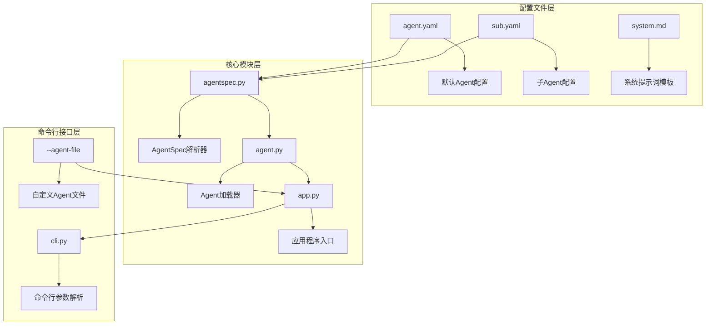
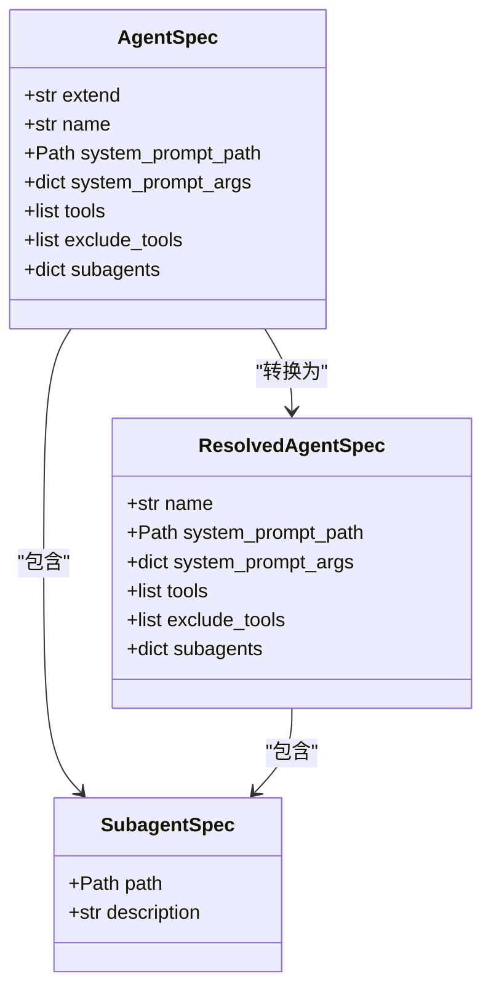
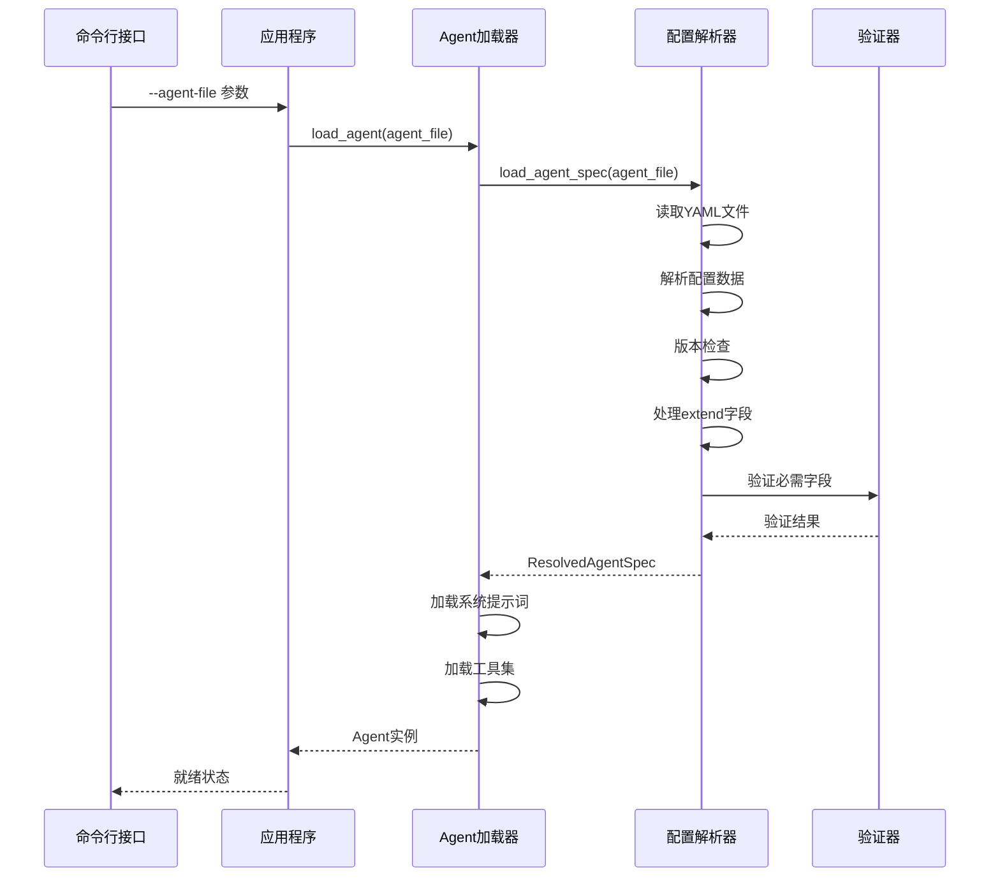
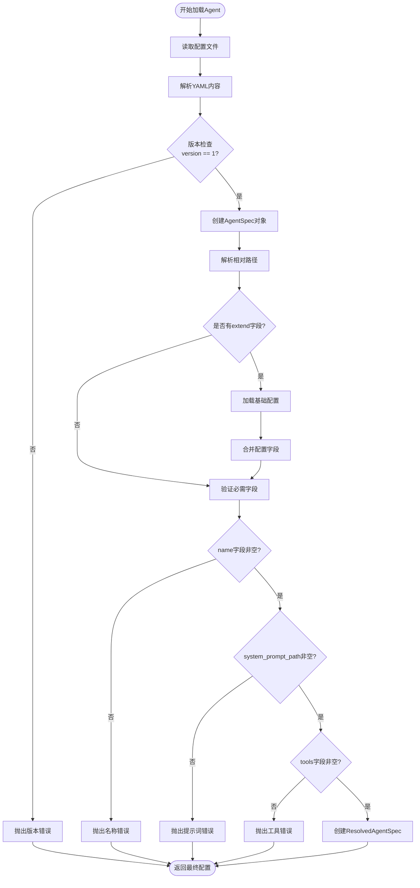
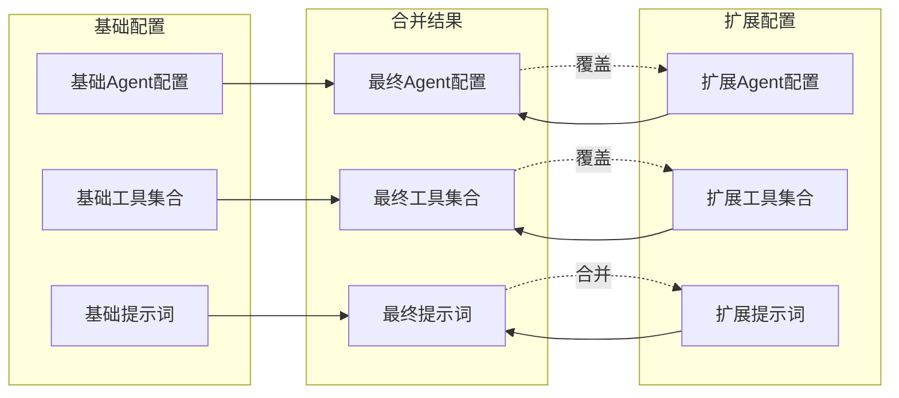
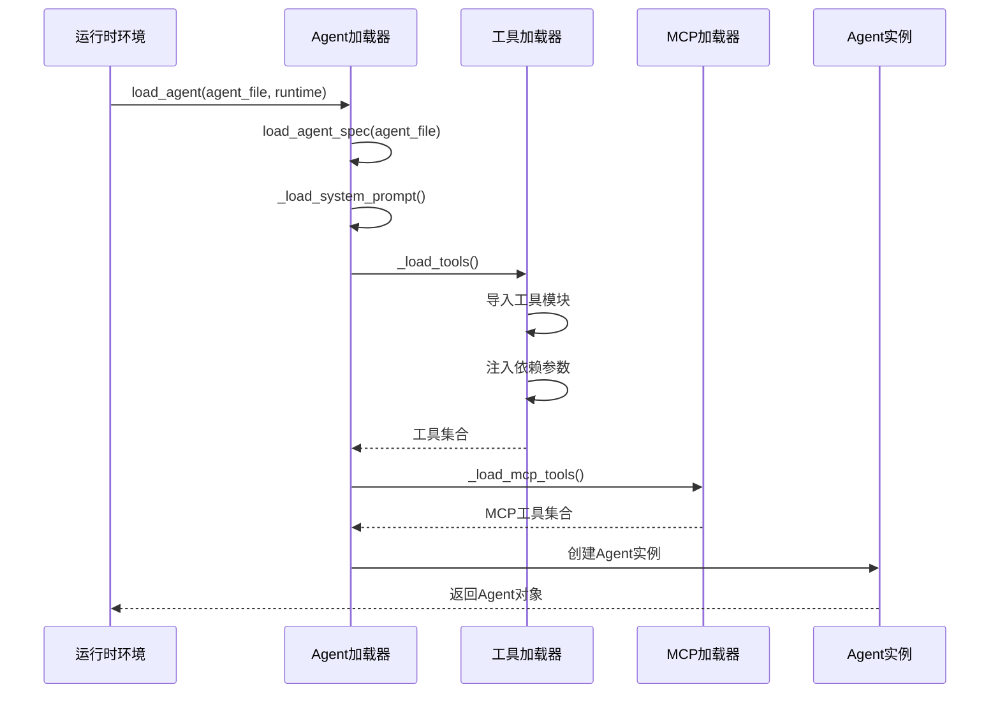
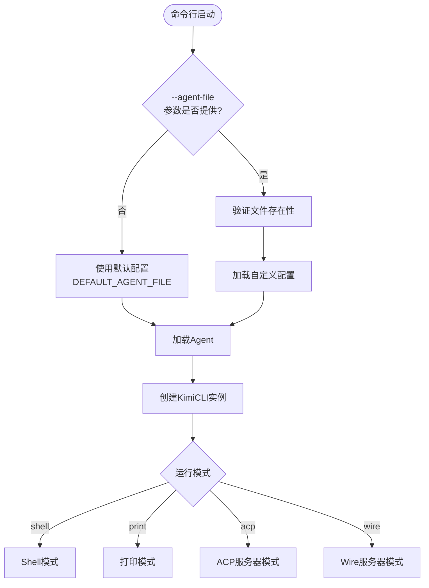
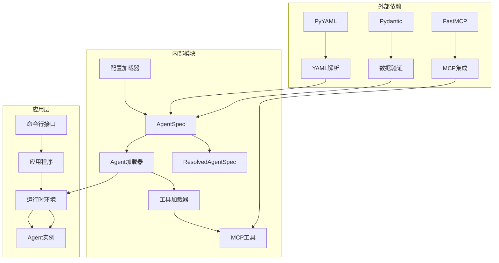

# 动态加载机制

<cite>
**本文档中引用的文件**
- [agentspec.py](file://src/kimi_cli/agentspec.py)
- [app.py](file://src/kimi_cli/app.py)
- [cli.py](file://src/kimi_cli/cli.py)
- [config.py](file://src/kimi_cli/config.py)
- [agent.py](file://src/kimi_cli/soul/agent.py)
- [exception.py](file://src/kimi_cli/exception.py)
- [test_agent_spec.py](file://tests/test_agent_spec.py)
- [test_load_agent.py](file://tests/test_load_agent.py)
- [test_default_agent.py](file://tests/test_default_agent.py)
- [agent.yaml](file://src/kimi_cli/agents/default/agent.yaml)
- [sub.yaml](file://src/kimi_cli/agents/default/sub.yaml)
</cite>

## 目录
1. [简介](#简介)
2. [项目结构概览](#项目结构概览)
3. [核心组件分析](#核心组件分析)
4. [架构概览](#架构概览)
5. [详细组件分析](#详细组件分析)
6. [依赖关系分析](#依赖关系分析)
7. [性能考虑](#性能考虑)
8. [故障排除指南](#故障排除指南)
9. [结论](#结论)

## 简介

Kimi CLI的Agent动态加载与运行时切换机制是一个高度灵活且可扩展的系统，它允许用户在运行时动态加载不同的Agent配置，支持配置继承、版本控制和异常处理。该机制的核心在于`load_agent_spec`函数，它实现了完整的配置文件读取、YAML解析、版本检查和异常处理流程。

该系统的主要特点包括：
- **动态加载**: 支持运行时加载不同配置的Agent
- **配置继承**: 通过extend字段实现配置的继承和覆盖
- **版本控制**: 支持配置文件版本检查和向后兼容
- **异常处理**: 完善的错误处理和验证机制
- **多环境适配**: 支持不同环境下的Agent配置切换

## 项目结构概览

**图表来源**
- [agentspec.py](file://src/kimi_cli/agentspec.py#L1-L120)
- [agent.py](file://src/kimi_cli/soul/agent.py#L1-L165)
- [cli.py](file://src/kimi_cli/cli.py#L1-L358)

**章节来源**
- [agentspec.py](file://src/kimi_cli/agentspec.py#L1-L120)
- [agent.py](file://src/kimi_cli/soul/agent.py#L1-L165)

## 核心组件分析

### AgentSpec数据模型

AgentSpec是整个动态加载系统的核心数据结构，它定义了Agent配置的所有必要字段：

**图表来源**
- [agentspec.py](file://src/kimi_cli/agentspec.py#L20-L53)

### 配置文件结构

Agent配置采用YAML格式，支持以下核心字段：

| 字段名 | 类型 | 描述 | 必需 |
|--------|------|------|------|
| version | int | 配置文件版本号 | 是 |
| agent.name | str | Agent名称 | 是 |
| agent.system_prompt_path | Path | 系统提示词文件路径 | 是 |
| agent.tools | list[str] | 启用的工具列表 | 是 |
| agent.extend | str | 基础配置文件路径 | 否 |
| agent.exclude_tools | list[str] | 排除的工具列表 | 否 |
| agent.subagents | dict | 子Agent配置 | 否 |

**章节来源**
- [agentspec.py](file://src/kimi_cli/agentspec.py#L20-L53)
- [agent.yaml](file://src/kimi_cli/agents/default/agent.yaml#L1-L25)

## 架构概览

**图表来源**
- [cli.py](file://src/kimi_cli/cli.py#L292-L298)
- [app.py](file://src/kimi_cli/app.py#L86-L88)
- [agent.py](file://src/kimi_cli/soul/agent.py#L32-L80)

## 详细组件分析

### load_agent_spec函数深度解析

`load_agent_spec`函数是整个动态加载机制的核心，它实现了完整的配置加载流程：

**图表来源**
- [agentspec.py](file://src/kimi_cli/agentspec.py#L55-L119)

#### 配置继承机制详解

extend字段实现了强大的配置继承机制，支持两种继承方式：

1. **默认继承**: `extend: "default"` 继承内置默认配置
2. **自定义继承**: `extend: "./base.yaml"` 继承自定义基础配置

**图表来源**
- [agentspec.py](file://src/kimi_cli/agentspec.py#L100-L118)

#### 异常处理机制

系统实现了完善的异常处理机制，确保配置错误能够被及时发现和报告：

| 错误类型 | 触发条件 | 处理方式 |
|----------|----------|----------|
| AgentSpecError | 配置验证失败 | 抛出详细错误信息 |
| FileNotFoundError | 配置文件不存在 | 提供文件路径信息 |
| yaml.YAMLError | YAML解析失败 | 显示语法错误位置 |
| ValueError | 字段值无效 | 提供验证失败详情 |

**章节来源**
- [agentspec.py](file://src/kimi_cli/agentspec.py#L55-L119)
- [exception.py](file://src/kimi_cli/exception.py#L16-L19)

### Agent加载流程

**图表来源**
- [agent.py](file://src/kimi_cli/soul/agent.py#L32-L80)

**章节来源**
- [agent.py](file://src/kimi_cli/soul/agent.py#L32-L80)

### 命令行参数支持

系统通过`--agent-file`参数支持自定义Agent配置文件的加载：

**图表来源**
- [cli.py](file://src/kimi_cli/cli.py#L64-L74)
- [app.py](file://src/kimi_cli/app.py#L86-L88)

**章节来源**
- [cli.py](file://src/kimi_cli/cli.py#L64-L74)
- [app.py](file://src/kimi_cli/app.py#L86-L88)

## 依赖关系分析

**图表来源**
- [agentspec.py](file://src/kimi_cli/agentspec.py#L1-L10)
- [agent.py](file://src/kimi_cli/soul/agent.py#L1-L20)

**章节来源**
- [agentspec.py](file://src/kimi_cli/agentspec.py#L1-L10)
- [agent.py](file://src/kimi_cli/soul/agent.py#L1-L20)

## 性能考虑

### 配置缓存策略

虽然当前实现没有显式的配置缓存，但可以通过以下方式优化性能：

1. **延迟加载**: 只在需要时加载工具和提示词
2. **路径解析缓存**: 缓存已解析的文件路径
3. **工具依赖注入**: 一次性注入所有依赖，避免重复查找

### 内存使用优化

- **流式处理**: 对大型配置文件采用流式解析
- **按需加载**: 只加载当前使用的Agent配置
- **垃圾回收**: 及时释放不再使用的配置对象

### 并发处理

- **异步加载**: 使用异步I/O处理配置文件读取
- **并行工具加载**: 同时加载多个独立工具
- **工具依赖管理**: 避免循环依赖导致的死锁

## 故障排除指南

### 常见配置错误

| 错误现象 | 可能原因 | 解决方案 |
|----------|----------|----------|
| AgentSpecError: Agent name is required | name字段缺失 | 在agent.yaml中添加name字段 |
| AgentSpecError: System prompt path is required | system_prompt_path缺失 | 指定有效的系统提示词文件路径 |
| AgentSpecError: Tools are required | tools字段缺失 | 添加至少一个可用工具 |
| Unsupported agent spec version | 版本不支持 | 更新配置文件版本号为1 |

### 调试技巧

1. **启用调试日志**: 使用`--debug`参数查看详细日志
2. **验证配置文件**: 使用YAML验证器检查语法正确性
3. **检查文件路径**: 确保所有相对路径引用正确
4. **测试工具可用性**: 验证工具模块是否可导入

**章节来源**
- [test_agent_spec.py](file://tests/test_agent_spec.py#L15-L40)
- [exception.py](file://src/kimi_cli/exception.py#L16-L19)

## 结论

Kimi CLI的Agent动态加载与运行时切换机制是一个设计精良、功能完备的系统。它通过以下关键特性实现了高度的灵活性和可扩展性：

### 核心优势

1. **配置继承**: 通过extend字段实现优雅的配置继承机制
2. **版本控制**: 完善的版本检查和向后兼容性
3. **异常处理**: 全面的错误检测和用户友好的错误信息
4. **动态加载**: 支持运行时切换不同配置的Agent
5. **模块化设计**: 清晰的职责分离和良好的可维护性

### 应用价值

该机制在实际应用中具有重要价值：

- **多环境适配**: 不同环境可以使用不同的Agent配置
- **A/B测试**: 支持不同配置的并行测试和对比
- **快速迭代**: 开发者可以快速切换和测试新配置
- **个性化定制**: 用户可以根据需求定制专属Agent

### 未来发展方向

1. **配置热重载**: 支持运行时重新加载配置而不重启应用
2. **配置版本管理**: 实现配置的版本控制和回滚功能
3. **可视化配置**: 提供图形化界面进行配置管理
4. **配置模板**: 支持配置模板的创建和复用

这个动态加载机制为Kimi CLI提供了强大的扩展能力，使其能够适应各种复杂的使用场景和需求变化。