# 子Agent支持

<cite>
**本文档中引用的文件**
- [agentspec.py](file://src/kimi_cli/agentspec.py)
- [agent.py](file://src/kimi_cli/soul/agent.py)
- [task/__init__.py](file://src/kimi_cli/tools/task/__init__.py)
- [task.md](file://src/kimi_cli/tools/task/task.md)
- [sub.yaml](file://src/kimi_cli/agents/default/sub.yaml)
- [agent.yaml](file://src/kimi_cli/agents/default/agent.yaml)
- [system.md](file://src/kimi_cli/agents/default/system.md)
- [context.py](file://src/kimi_cli/soul/context.py)
- [toolset.py](file://src/kimi_cli/soul/toolset.py)
- [test_task_subagents.py](file://tests/test_task_subagents.py)
</cite>

## 目录
1. [简介](#简介)
2. [子Agent系统架构](#子agent系统架构)
3. [SubagentSpec数据模型](#subagentspec数据模型)
4. [主Agent子Agent声明机制](#主agent子agent声明机制)
5. [子Agent配置加载过程](#子agent配置加载过程)
6. [Task工具的子Agent调用机制](#task工具的子agent调用机制)
7. [子Agent的优势特性](#子agent的优势特性)
8. [创建自定义子Agent](#创建自定义子agent)
9. [权限隔离与上下文管理](#权限隔离与上下文管理)
10. [最佳实践与使用场景](#最佳实践与使用场景)
11. [故障排除指南](#故障排除指南)
12. [总结](#总结)

## 简介

子Agent系统是Kimia CLI框架中的核心功能之一，它允许主Agent通过专门化的子Agent来处理复杂和专业化的任务。该系统通过模块化的设计理念，实现了任务的专业化分工、上下文隔离、权限控制和并行处理能力。

子Agent系统的核心价值在于：
- **专业化分工**：每个子Agent专注于特定领域的任务执行
- **上下文隔离**：子Agent拥有独立的上下文空间，避免主Agent上下文污染
- **权限控制**：通过工具集限定实现细粒度的权限管理
- **并行处理**：支持多个子Agent同时工作，提高任务处理效率

## 子Agent系统架构

子Agent系统采用分层架构设计，包含配置层、加载层、执行层和管理层四个主要层次。

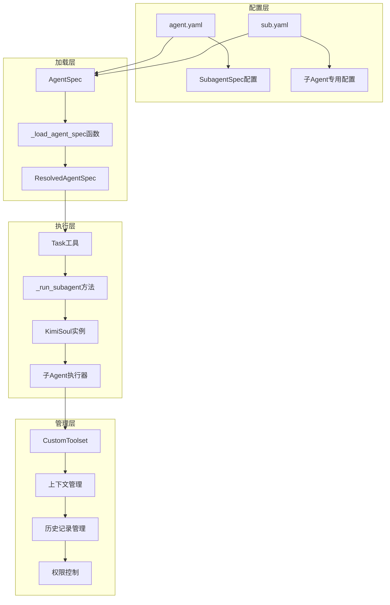

**图表来源**
- [agentspec.py](file://src/kimi_cli/agentspec.py#L20-L119)
- [agent.py](file://src/kimi_cli/soul/agent.py#L32-L165)
- [task/__init__.py](file://src/kimi_cli/tools/task/__init__.py#L67-L175)

**章节来源**
- [agentspec.py](file://src/kimi_cli/agentspec.py#L1-L120)
- [agent.py](file://src/kimi_cli/soul/agent.py#L1-L165)

## SubagentSpec数据模型

SubagentSpec是子Agent配置的核心数据模型，定义了子Agent的基本属性和行为规范。

### 数据模型结构

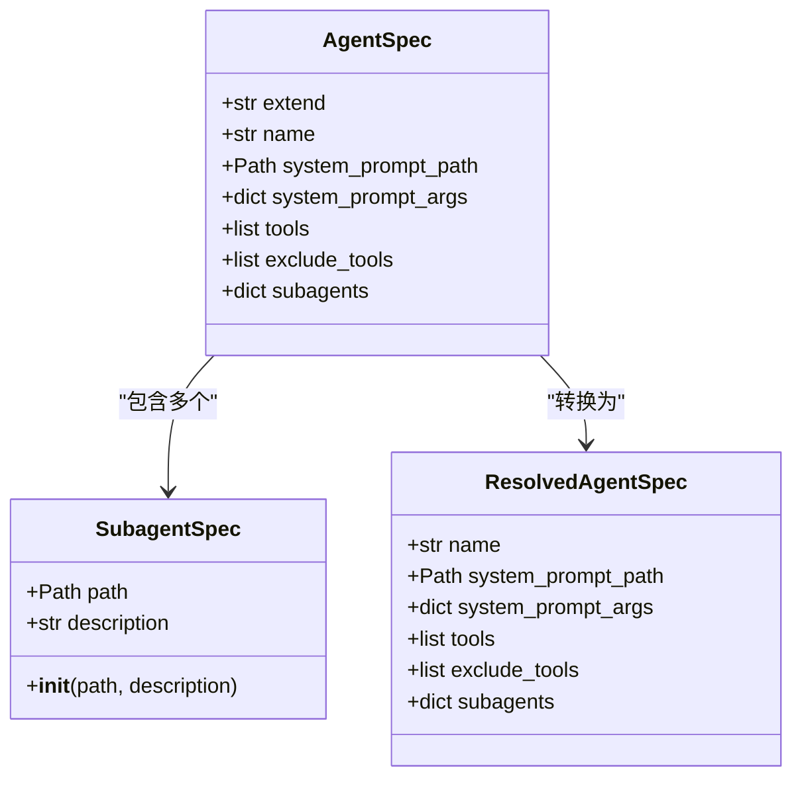

**图表来源**
- [agentspec.py](file://src/kimi_cli/agentspec.py#L36-L41)
- [agentspec.py](file://src/kimi_cli/agentspec.py#L20-L33)

### path字段详解

`path`字段指定了子Agent配置文件的相对路径，具有以下特点：

1. **路径解析机制**：系统会自动将相对路径转换为绝对路径
2. **文件定位**：指向包含子Agent配置的具体YAML文件
3. **继承支持**：支持从父Agent配置文件中继承路径

### description字段详解

`description`字段提供了子Agent的功能描述，用于：
- **用户界面展示**：在可用子Agent列表中显示
- **工具调用指导**：帮助主Agent选择合适的子Agent
- **调试信息**：在日志中提供子Agent功能说明

**章节来源**
- [agentspec.py](file://src/kimi_cli/agentspec.py#L36-L41)

## 主Agent子Agent声明机制

主Agent通过`agent.yaml`文件中的`subagents`字段声明可用的子Agent。

### 声明语法

```yaml
subagents:
  coder:
    path: ./sub.yaml
    description: "Good at general software engineering tasks."
  analyzer:
    path: ./analyzer.yaml
    description: "Specialized in code analysis and review."
```

### 配置继承机制

主Agent可以继承其他Agent的基础配置，并在此基础上添加或修改子Agent配置：

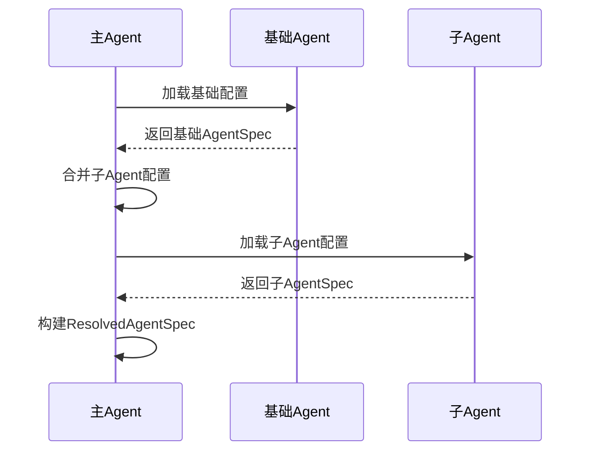

**图表来源**
- [agentspec.py](file://src/kimi_cli/agentspec.py#L81-L119)

**章节来源**
- [agent.yaml](file://src/kimi_cli/agents/default/agent.yaml#L21-L25)
- [agentspec.py](file://src/kimi_cli/agentspec.py#L81-L119)

## 子Agent配置加载过程

子Agent的加载过程涉及配置解析、路径解析、依赖注入和实例化等多个步骤。

### 加载流程图

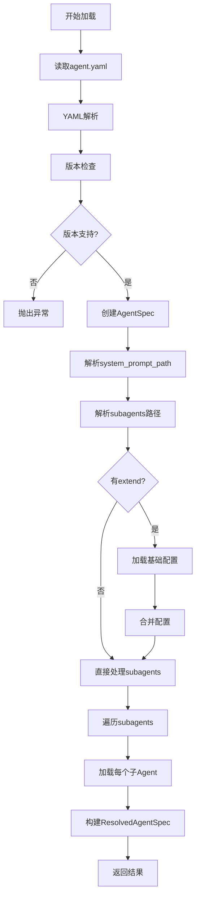

**图表来源**
- [agentspec.py](file://src/kimi_cli/agentspec.py#L81-L119)

### 关键处理逻辑

1. **路径解析**：将相对路径转换为绝对路径
2. **配置合并**：处理extend字段的配置继承
3. **类型验证**：确保配置数据的完整性
4. **错误处理**：提供详细的错误信息

**章节来源**
- [agentspec.py](file://src/kimi_cli/agentspec.py#L81-L119)

## Task工具的子Agent调用机制

Task工具是主Agent调用子Agent的主要接口，提供了完整的子Agent生命周期管理。

### 调用流程

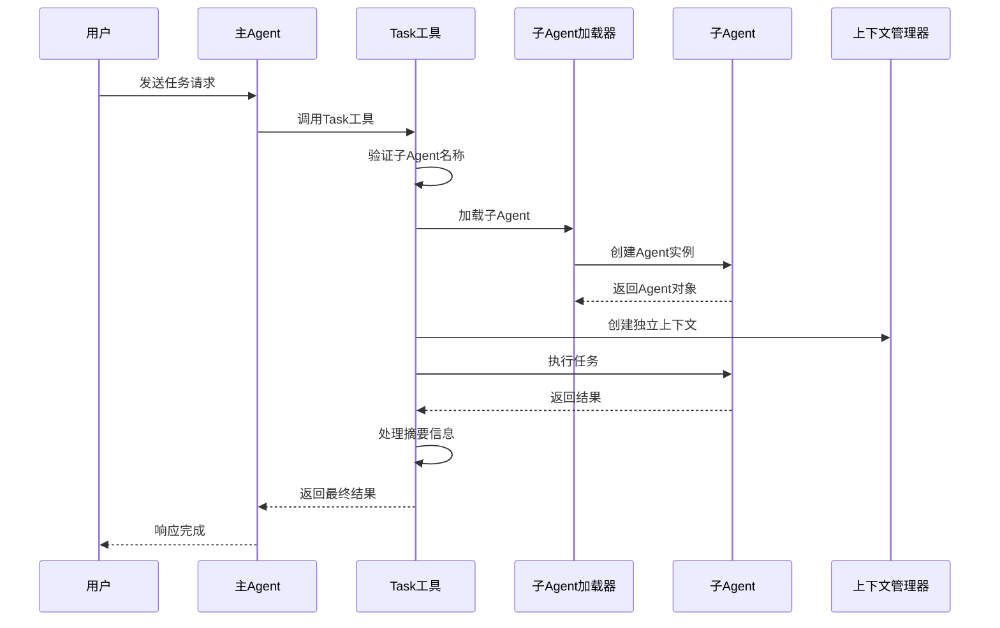

**图表来源**
- [task/__init__.py](file://src/kimi_cli/tools/task/__init__.py#L67-L175)

### 参数结构

Task工具接受以下参数：

| 参数名 | 类型 | 描述 | 必需 |
|--------|------|------|------|
| description | str | 任务简短描述（3-5个词） | 是 |
| subagent_name | str | 使用的子Agent名称 | 是 |
| prompt | str | 子Agent执行任务的详细提示 | 是 |

### 错误处理机制

Task工具实现了完善的错误处理机制：

1. **子Agent不存在**：返回"Subagent not found"错误
2. **执行失败**：捕获异常并返回详细错误信息
3. **超时处理**：达到最大步数限制时提示任务拆分
4. **结果验证**：检查子Agent输出的有效性

**章节来源**
- [task/__init__.py](file://src/kimi_cli/tools/task/__init__.py#L35-L175)
- [task.md](file://src/kimi_cli/tools/task/task.md#L1-L27)

## 子Agent的优势特性

子Agent系统提供了多项关键优势，使其成为复杂任务处理的理想解决方案。

### 上下文隔离

子Agent最重要的特性是上下文隔离，确保主Agent的上下文不会被子Agent的操作所污染。

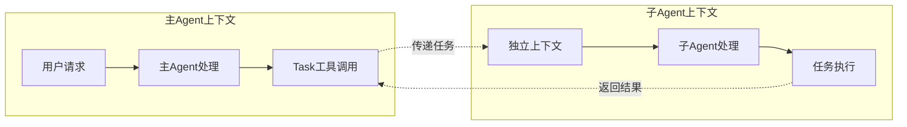

**图表来源**
- [task/__init__.py](file://src/kimi_cli/tools/task/__init__.py#L117-L175)

### 权限控制

通过工具集限定实现细粒度的权限控制：

1. **工具排除**：在子Agent配置中排除不需要的工具
2. **功能限制**：限制子Agent只能访问特定功能
3. **安全隔离**：防止子Agent访问敏感操作

### 并行多任务处理

子Agent支持并行执行多个独立任务：

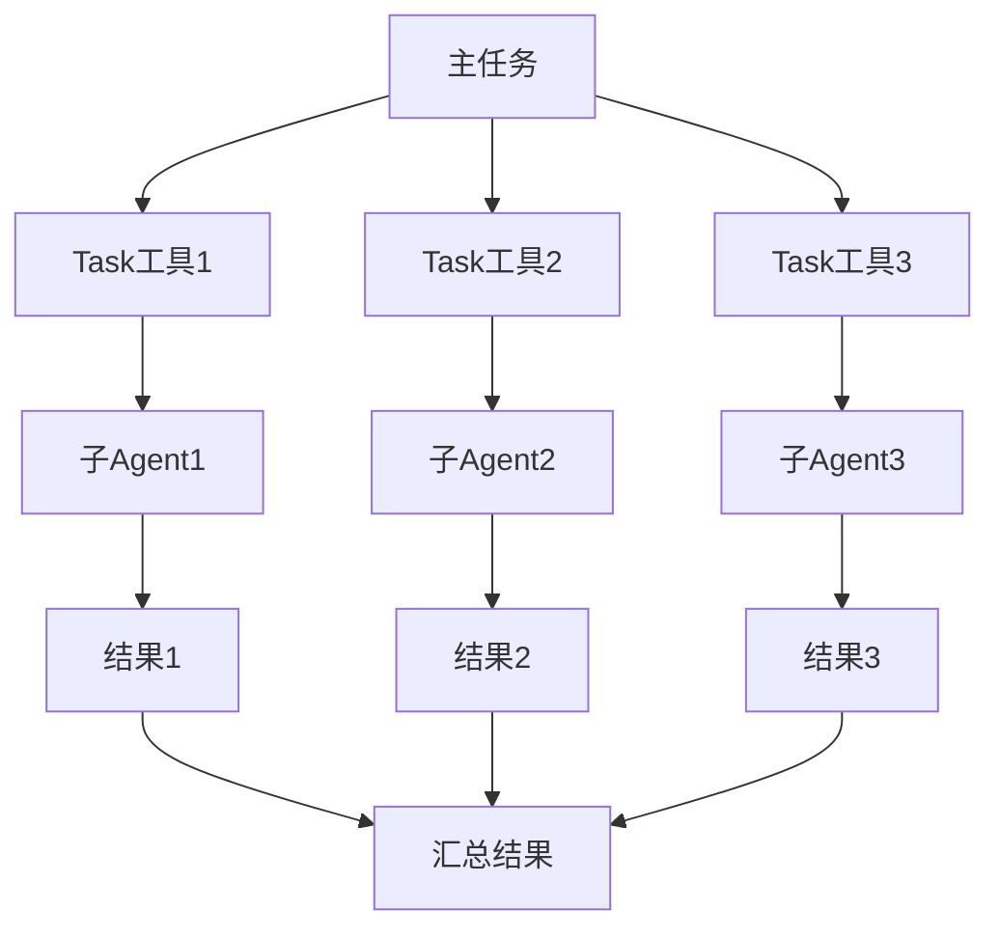

**图表来源**
- [task.md](file://src/kimi_cli/tools/task/task.md#L14-L26)

**章节来源**
- [task.md](file://src/kimi_cli/tools/task/task.md#L1-L27)
- [sub.yaml](file://src/kimi_cli/agents/default/sub.yaml#L7-L11)

## 创建自定义子Agent

创建自定义子Agent需要遵循标准的配置流程，包括配置文件编写、工具集限定和系统提示词设计。

### 配置文件结构

子Agent的配置文件通常包含以下内容：

```yaml
version: 1
agent:
  extend: ../base-agent.yaml
  name: "custom_subagent"
  system_prompt_path: ./system.md
  system_prompt_args:
    ROLE_ADDITIONAL: |
      You are a specialized subagent for custom tasks.
  tools:
    - "kimi_cli.tools.file:ReadFile"
    - "kimi_cli.tools.file:WriteFile"
  exclude_tools:
    - "kimi_cli.tools.bash:Bash"
  subagents: {}
```

### 工具集限定策略

工具集限定是子Agent安全性和专业性的关键：

1. **最小权限原则**：只提供必要的工具
2. **功能分离**：根据任务类型选择工具
3. **安全考虑**：排除危险工具如Bash

### 系统提示词设计

系统提示词应该：
- 明确子Agent的角色和职责
- 提供具体的任务指导
- 包含输出格式要求
- 指定交互模式

### 完整创建流程

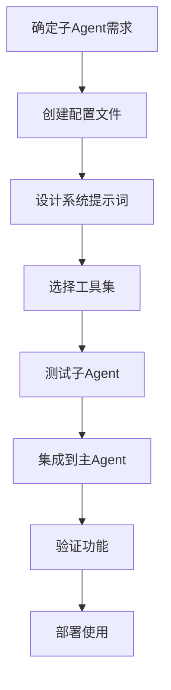

**章节来源**
- [sub.yaml](file://src/kimi_cli/agents/default/sub.yaml#L1-L12)
- [agent.yaml](file://src/kimi_cli/agents/default/agent.yaml#L21-L25)

## 权限隔离与上下文管理

子Agent系统通过多层次的安全机制和上下文管理来确保系统的安全性和稳定性。

### 权限控制机制

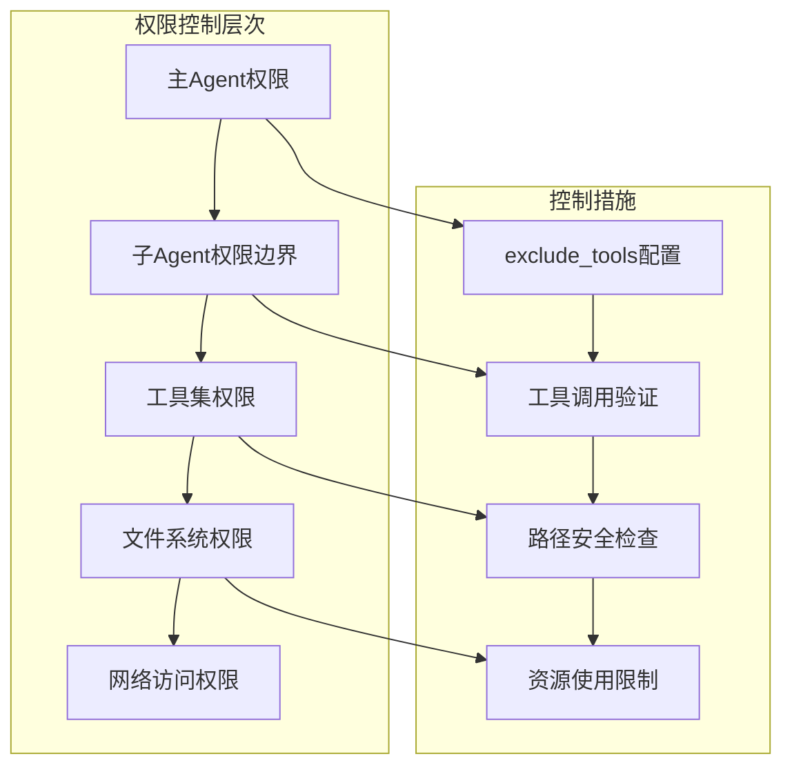

**图表来源**
- [agent.py](file://src/kimi_cli/soul/agent.py#L100-L119)
- [sub.yaml](file://src/kimi_cli/agents/default/sub.yaml#L7-L11)

### 上下文管理

上下文管理确保子Agent的独立性和可追溯性：

1. **独立历史记录**：每个子Agent维护独立的历史文件
2. **状态持久化**：上下文状态保存到磁盘
3. **回滚机制**：支持上下文状态回滚
4. **令牌计数**：跟踪上下文大小限制

### 安全机制

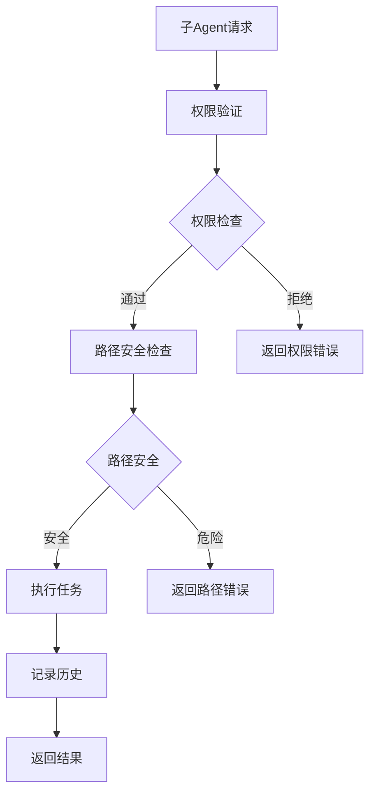

**图表来源**
- [context.py](file://src/kimi_cli/soul/context.py#L16-L145)
- [task/__init__.py](file://src/kimi_cli/tools/task/__init__.py#L141-L175)

**章节来源**
- [context.py](file://src/kimi_cli/soul/context.py#L1-L145)
- [agent.py](file://src/kimi_cli/soul/agent.py#L100-L119)

## 最佳实践与使用场景

子Agent系统适用于多种复杂的任务场景，以下是经过验证的最佳实践。

### 推荐使用场景

1. **代码修复任务**
   - 场景：代码编译失败或功能异常
   - 实践：创建专门的代码修复子Agent，专注于特定类型的错误修复

2. **知识搜索任务**
   - 场景：需要查找特定技术的最新资料
   - 实践：创建网络搜索子Agent，专门负责信息收集和整理

3. **并行任务处理**
   - 场景：需要同时处理多个独立的子任务
   - 实践：使用Task工具启动多个子Agent并行执行

### 任务分解策略

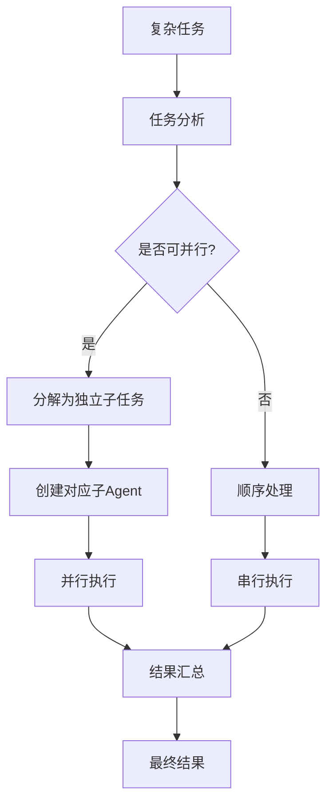

### 性能优化建议

1. **合理拆分任务**：避免单个子Agent处理过于复杂的任务
2. **资源监控**：监控子Agent的资源使用情况
3. **超时设置**：为长时间运行的任务设置合理的超时时间
4. **结果验证**：确保子Agent输出的质量和完整性

### 常见陷阱与避免方法

| 陷阱 | 风险 | 避免方法 |
|------|------|----------|
| 过度依赖子Agent | 性能下降 | 合理规划任务分解粒度 |
| 权限过大 | 安全风险 | 严格遵循最小权限原则 |
| 缺乏错误处理 | 系统不稳定 | 实现完善的错误处理机制 |
| 上下文污染 | 结果不准确 | 确保上下文隔离机制有效 |

**章节来源**
- [task.md](file://src/kimi_cli/tools/task/task.md#L18-L26)
- [test_task_subagents.py](file://tests/test_task_subagents.py#L1-L113)

## 故障排除指南

子Agent系统可能遇到的各种问题及其解决方案。

### 常见问题诊断

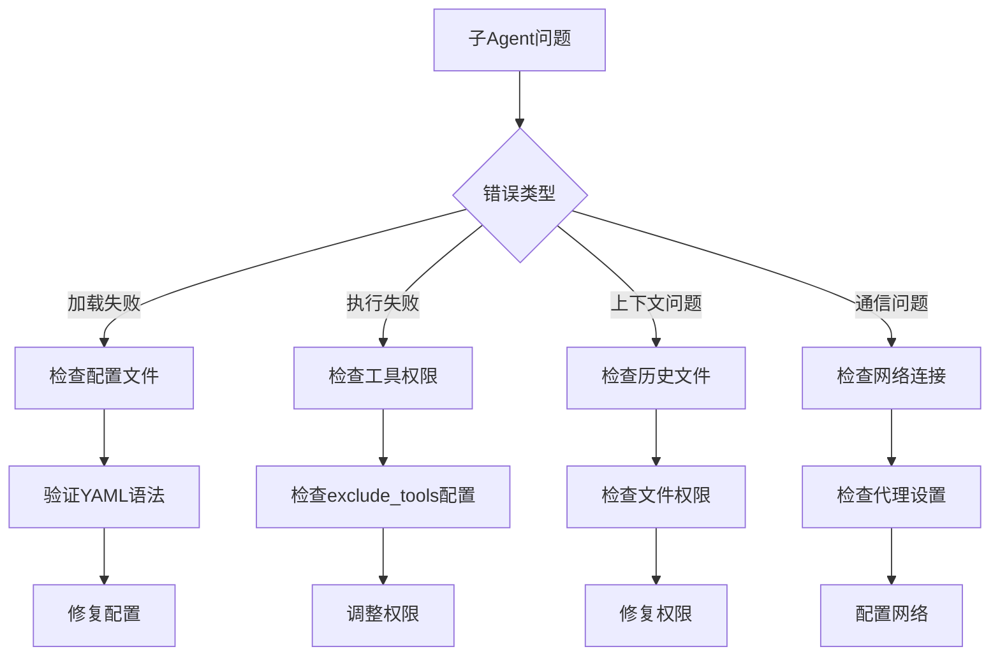

### 错误代码参考

| 错误类型 | 错误消息 | 解决方案 |
|----------|----------|----------|
| 配置错误 | "Agent name is required" | 检查agent.yaml中的name字段 |
| 路径错误 | "Subagent not found" | 验证subagent路径的正确性 |
| 权限错误 | "Permission denied" | 检查工具的权限配置 |
| 超时错误 | "Max steps reached" | 分解任务或增加超时时间 |

### 调试技巧

1. **日志分析**：启用详细日志记录
2. **配置验证**：使用配置验证工具
3. **单元测试**：为子Agent编写单元测试
4. **性能监控**：监控资源使用情况

**章节来源**
- [agentspec.py](file://src/kimi_cli/agentspec.py#L65-L78)
- [task/__init__.py](file://src/kimi_cli/tools/task/__init__.py#L102-L115)

## 总结

子Agent系统是Kimia CLI框架中的重要创新，它通过模块化的设计理念实现了复杂任务的专业化处理。该系统的核心优势包括：

### 技术优势

1. **模块化架构**：清晰的职责分离和可扩展性
2. **安全隔离**：完善的权限控制和上下文隔离机制
3. **并行处理**：支持多子Agent并发执行
4. **灵活配置**：丰富的配置选项和继承机制

### 应用价值

1. **提高效率**：通过专业化分工提升任务处理速度
2. **增强安全性**：细粒度的权限控制降低安全风险
3. **改善体验**：保持主Agent上下文的简洁性
4. **便于维护**：模块化设计简化系统维护

### 发展方向

随着AI技术的发展，子Agent系统将在以下方面继续演进：
- 更智能的任务分配算法
- 更精细的权限控制机制
- 更高效的并行处理能力
- 更完善的监控和调试工具

子Agent系统不仅解决了当前复杂任务处理的需求，也为未来的AI应用发展奠定了坚实的基础。