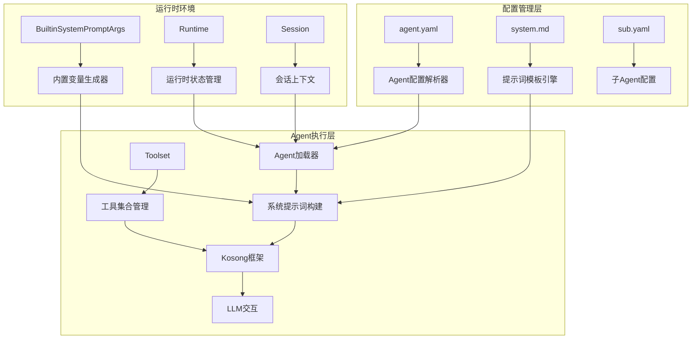
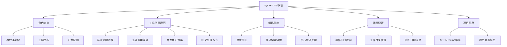
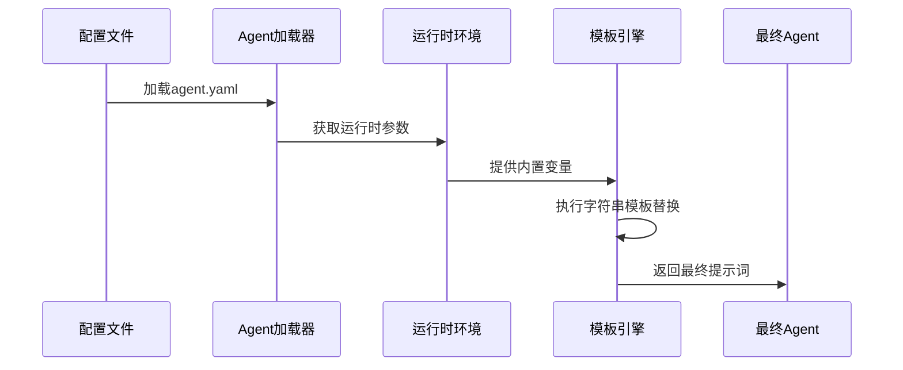
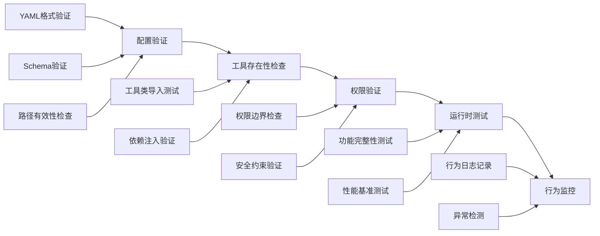
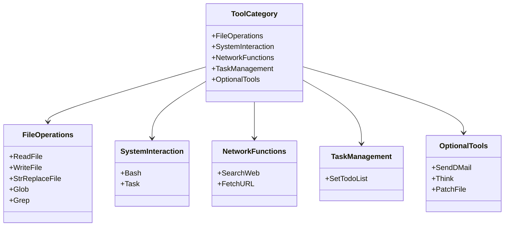
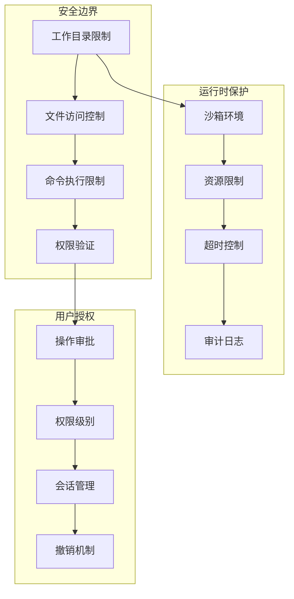

# 提示词模板系统文档

<cite>
**本文档中引用的文件**
- [system.md](file://src/kimi_cli/agents/default/system.md)
- [CLAUDE.md](file://src/kimi_cli/agents/CLAUDE.md)
- [agent.py](file://src/kimi_cli/soul/agent.py)
- [runtime.py](file://src/kimi_cli/soul/runtime.py)
- [agentspec.py](file://src/kimi_cli/agentspec.py)
- [init.md](file://src/kimi_cli/prompts/init.md)
- [compact.md](file://src/kimi_cli/prompts/compact.md)
- [bash.md](file://src/kimi_cli/tools/bash/bash.md)
- [test_default_agent.py](file://tests/test_default_agent.py)
</cite>

## 目录
1. [简介](#简介)
2. [系统架构概览](#系统架构概览)
3. [提示词模板设计](#提示词模板设计)
4. [动态变量注入机制](#动态变量注入机制)
5. [Agent行为一致性保障](#agent行为一致性保障)
6. [工具使用准则](#工具使用准则)
7. [安全约束与权限管理](#安全约束与权限管理)
8. [最佳实践指南](#最佳实践指南)
9. [常见问题与解决方案](#常见问题与解决方案)
10. [总结](#总结)

## 简介

Kimi CLI的提示词模板系统是一个高度灵活且安全的AI代理行为控制系统。该系统通过精心设计的Markdown模板文件定义AI代理的角色、能力和行为边界，同时支持运行时动态变量注入，确保Agent能够根据具体环境和需求调整其行为表现。

系统的核心设计理念是通过分层的配置管理，实现Agent行为的精确控制和安全保障。提示词模板不仅定义了Agent的基本角色和工作流程，还包含了详细的工具使用规范、安全约束和输出格式要求。

## 系统架构概览



**图表来源**
- [agent.py](file://src/kimi_cli/soul/agent.py#L32-L80)
- [runtime.py](file://src/kimi_cli/soul/runtime.py#L66-L101)
- [agentspec.py](file://src/kimi_cli/agentspec.py#L20-L52)

**章节来源**
- [CLAUDE.md](file://src/kimi_cli/agents/CLAUDE.md#L1-L287)
- [agent.py](file://src/kimi_cli/soul/agent.py#L1-L165)

## 提示词模板设计

### 核心模板结构

提示词模板采用Markdown格式，具有清晰的层次结构和标准化的段落组织：



**图表来源**
- [system.md](file://src/kimi_cli/agents/default/system.md#L1-L73)

### 角色与能力定义

提示词模板的第一部分明确定义了AI代理的核心角色和基本能力：

- **专业领域**：专注于软件工程任务的CLI交互式代理
- **主要目标**：安全高效地帮助用户完成各种软件开发任务
- **行为原则**：严格遵循用户指令，保持专注不偏离主题

### 工具使用规范

模板详细规定了工具使用的标准流程：

- **请求响应**：始终响应用户的自然语言请求
- **工具调用**：工具调用应自解释，无需额外说明
- **并发执行**：推荐并行执行多个非冲突的工具调用
- **结果处理**：根据工具调用结果决定下一步行动

**章节来源**
- [system.md](file://src/kimi_cli/agents/default/system.md#L1-L73)

## 动态变量注入机制

### system_prompt_args系统

系统通过`system_prompt_args`参数实现运行时动态变量注入，这是提示词模板灵活性的核心机制：



**图表来源**
- [agent.py](file://src/kimi_cli/soul/agent.py#L83-L93)
- [runtime.py](file://src/kimi_cli/soul/runtime.py#L18-L30)

### 内置变量系统

运行时环境提供以下内置变量：

| 变量名 | 类型 | 描述 | 示例值 |
|--------|------|------|--------|
| `KIMI_NOW` | str | 当前ISO格式日期时间 | `2024-01-15T10:30:00+08:00` |
| `KIMI_WORK_DIR` | Path | 当前工作目录路径 | `/home/user/project` |
| `KIMI_WORK_DIR_LS` | str | 目录列表输出 | `README.md<br/>src/<br/>tests/` |
| `KIMI_AGENTS_MD` | str | AGENTS.md文件内容 | `项目概述...` |

### 变量替换机制

系统使用Python的`string.Template`类进行变量替换，确保安全性：

```python
# 变量替换示例
system_prompt = path.read_text(encoding="utf-8").strip()
return string.Template(system_prompt).substitute(asdict(builtin_args), **args)
```

这种机制允许：
- **动态内容填充**：根据运行时环境自动填充相关信息
- **参数化配置**：支持通过配置文件传递自定义参数
- **安全隔离**：防止恶意代码注入

**章节来源**
- [runtime.py](file://src/kimi_cli/soul/runtime.py#L18-L101)
- [agent.py](file://src/kimi_cli/soul/agent.py#L83-L93)

## Agent行为一致性保障

### 架构一致性机制

系统通过多层验证确保Agent行为的一致性和正确性：



**图表来源**
- [agentspec.py](file://src/kimi_cli/agentspec.py#L55-L120)
- [agent.py](file://src/kimi_cli/soul/agent.py#L100-L141)

### 验证流程

系统实现了严格的配置验证流程：

1. **格式验证**：确保YAML配置文件格式正确
2. **内容验证**：验证必需字段的存在性和有效性
3. **工具验证**：确认所有指定工具类可正常导入
4. **权限验证**：检查工具使用权限和安全约束
5. **运行时验证**：在实际运行环境中测试配置有效性

### 行为监控与审计

系统提供了完整的行为监控机制：

- **工具调用记录**：记录所有工具调用的详细信息
- **权限审批跟踪**：监控需要用户授权的操作
- **异常行为检测**：识别潜在的安全威胁或配置错误
- **性能指标收集**：监控Agent的执行效率和资源使用

**章节来源**
- [agentspec.py](file://src/kimi_cli/agentspec.py#L55-L120)
- [agent.py](file://src/kimi_cli/soul/agent.py#L100-L165)

## 工具使用准则

### 工具分类与权限

系统对工具进行了细致的分类和权限管理：



**图表来源**
- [CLAUDE.md](file://src/kimi_cli/agents/CLAUDE.md#L55-L80)

### 使用规范

系统制定了详细的工具使用规范：

#### 请求处理流程
- **输入解析**：准确理解用户的自然语言请求
- **意图识别**：识别用户的真实需求和期望结果
- **工具选择**：根据任务类型选择最合适的工具组合

#### 工具调用规范
- **参数验证**：严格验证工具参数的有效性和安全性
- **调用顺序**：按照逻辑顺序执行工具调用
- **错误处理**：妥善处理工具调用过程中的各种异常

#### 并发执行策略
- **冲突检测**：识别可能产生冲突的工具调用
- **资源分配**：合理分配系统资源给并发执行的任务
- **结果整合**：有效整合多个工具调用的结果

**章节来源**
- [system.md](file://src/kimi_cli/agents/default/system.md#L7-L16)
- [bash.md](file://src/kimi_cli/tools/bash/bash.md#L1-L32)

## 安全约束与权限管理

### 系统安全架构



**图表来源**
- [system.md](file://src/kimi_cli/agents/default/system.md#L42-L49)
- [bash.md](file://src/kimi_cli/tools/bash/bash.md#L6-L11)

### 文件系统安全

系统实施了严格的文件系统访问控制：

#### 路径安全检查
- **路径解析**：确保所有文件路径都经过安全解析
- **目录遍历防护**：防止通过`..`进行目录遍历攻击
- **工作目录限制**：强制限制在工作目录范围内操作

#### 文件操作权限
- **只读优先**：优先使用只读操作，减少意外修改风险
- **写入验证**：对所有写入操作进行严格验证
- **备份策略**：重要文件修改前自动创建备份

### 命令执行安全

对于Shell命令执行，系统实施了多重安全措施：

#### 环境隔离
- **独立进程**：每次命令执行都在独立的进程中进行
- **环境清理**：清除不必要的环境变量和历史记录
- **工作目录重置**：每次执行后重置到初始工作目录

#### 执行限制
- **超时控制**：设置合理的命令执行超时时间
- **资源限制**：限制CPU和内存使用
- **交互性禁止**：禁止执行需要用户交互的命令

#### 权限控制
- **普通用户权限**：默认以普通用户权限执行
- **特权命令拒绝**：明确拒绝需要超级用户权限的命令
- **危险命令过滤**：过滤掉已知危险的命令模式

**章节来源**
- [bash.md](file://src/kimi_cli/tools/bash/bash.md#L6-L11)
- [test_tool_descriptions.py](file://tests/test_tool_descriptions.py#L121-L135)

## 最佳实践指南

### 提示词设计原则

#### 清晰性原则
- **角色定义明确**：清楚说明AI代理的专业领域和职责范围
- **目标表述具体**：明确Agent的主要目标和期望成果
- **行为规则简洁**：使用简单直接的语言描述行为规范

#### 一致性原则
- **术语统一**：在整个提示词中保持术语的一致性
- **格式规范**：采用一致的标题层级和段落格式
- **风格统一**：保持整体语言风格的协调性

#### 可维护性原则
- **模块化设计**：将不同功能区域清晰分离
- **参数化配置**：使用变量和参数提高灵活性
- **版本控制**：对提示词变更进行版本管理

### 修改和扩展指南

#### 添加新工具支持
1. **工具注册**：在agent.yaml中添加工具路径引用
2. **权限配置**：根据工具特性设置适当的权限级别
3. **提示词更新**：在system.md中添加工具使用说明
4. **测试验证**：进行全面的功能和安全测试

#### 自定义Agent配置
1. **配置文件创建**：复制默认配置文件作为起点
2. **角色定制**：根据特定需求调整Agent角色定义
3. **工具选择**：根据应用场景选择合适的工具集
4. **参数优化**：调整系统提示词参数以适应特定需求

#### 安全配置最佳实践
- **最小权限原则**：只授予完成任务所需的最小权限
- **定期审查**：定期审查和更新权限配置
- **监控告警**：建立异常行为监控和告警机制
- **备份恢复**：建立配置备份和快速恢复机制

### 性能优化建议

#### 提示词优化
- **长度控制**：保持提示词在合理长度范围内
- **信息密度**：提高关键信息的密度和相关性
- **缓存利用**：合理利用提示词缓存机制

#### 工具使用优化
- **批量处理**：尽可能使用批量操作减少调用次数
- **并行执行**：充分利用并行执行能力提高效率
- **资源复用**：避免重复的资源获取和释放操作

**章节来源**
- [CLAUDE.md](file://src/kimi_cli/agents/CLAUDE.md#L283-L287)
- [test_default_agent.py](file://tests/test_default_agent.py#L1-L530)

## 常见问题与解决方案

### 提示词不当导致的问题

#### 问题类型1：行为偏差
**症状**：Agent表现出不符合预期的行为模式
**原因**：提示词过于宽泛或存在歧义
**解决方案**：
- 明确指定Agent的角色和职责边界
- 使用具体的示例说明期望的行为模式
- 移除可能导致误解的模糊表述

#### 问题类型2：过度复杂化
**症状**：Agent提出不必要的复杂解决方案
**原因**：提示词鼓励过度思考和复杂化
**解决方案**：
- 强调"保持简单"的原则
- 提供具体的简化指导示例
- 设定明确的复杂度限制

#### 问题类型3：工具滥用
**症状**：Agent频繁使用不合适的工具
**原因**：工具使用规范不够明确
**解决方案**：
- 详细说明每个工具的适用场景
- 提供工具选择的决策树
- 设置工具使用的频率和数量限制

### 配置错误处理

#### 配置文件格式错误
**症状**：Agent加载失败，出现YAML解析错误
**解决方案**：
- 使用在线YAML验证工具检查语法
- 确保正确的缩进和标点符号
- 验证必需字段的存在性

#### 工具路径错误
**症状**：Agent无法找到指定的工具类
**解决方案**：
- 检查工具路径的正确性
- 确认工具模块已正确安装
- 验证类名拼写和导入路径

#### 权限配置错误
**症状**：Agent尝试执行被拒绝的操作
**解决方案**：
- 检查工具权限配置
- 验证文件系统权限设置
- 确认安全约束配置正确

### 运行时问题诊断

#### 性能问题
**症状**：Agent响应缓慢或资源占用过高
**解决方案**：
- 分析工具调用模式，优化执行顺序
- 调整并发执行策略
- 监控和优化内存使用

#### 安全问题
**症状**：检测到可疑的系统操作
**解决方案**：
- 启用详细的安全日志记录
- 检查权限配置是否过于宽松
- 实施更严格的操作审批机制

**章节来源**
- [test_default_agent.py](file://tests/test_default_agent.py#L15-L530)
- [agent.py](file://src/kimi_cli/soul/agent.py#L100-L165)

## 总结

Kimi CLI的提示词模板系统代表了AI代理配置管理的先进实践。通过精心设计的分层架构、灵活的动态变量注入机制和严格的安全约束体系，该系统实现了Agent行为的精确控制和安全保障。

系统的核心优势包括：

1. **灵活性**：通过动态变量注入支持运行时定制
2. **安全性**：多层次的安全防护机制确保系统安全
3. **可维护性**：清晰的配置结构便于维护和扩展
4. **一致性**：严格的验证机制保证行为一致性
5. **可扩展性**：模块化设计支持功能扩展

未来的发展方向包括：
- 更智能的工具选择算法
- 自适应的提示词优化
- 更完善的异常处理机制
- 增强的安全审计功能

通过持续的优化和改进，该提示词模板系统将继续为AI代理的可靠性和安全性提供坚实保障。