# MCP集成

<cite>
**本文档中引用的文件**
- [mcp.py](file://src/kimi_cli/tools/mcp.py)
- [cli.py](file://src/kimi_cli/cli.py)
- [app.py](file://src/kimi_cli/app.py)
- [config.py](file://src/kimi_cli/config.py)
- [agent.py](file://src/kimi_cli/soul/agent.py)
- [README.md](file://README.md)
- [uv.lock](file://uv.lock)
</cite>

## 目录
1. [简介](#简介)
2. [MCP协议概述](#mcp协议概述)
3. [项目结构](#项目结构)
4. [核心组件](#核心组件)
5. [架构概览](#架构概览)
6. [详细组件分析](#详细组件分析)
7. [配置文件详解](#配置文件详解)
8. [连接流程](#连接流程)
9. [认证机制](#认证机制)
10. [工具发现与调用](#工具发现与调用)
11. [错误处理](#错误处理)
12. [性能考虑](#性能考虑)
13. [开发示例](#开发示例)
14. [故障排除](#故障排除)
15. [总结](#总结)

## 简介

MCP（Model Context Protocol）是一种标准化协议，允许Kimi CLI连接和使用外部工具服务器。通过MCP集成，用户可以扩展Kimi CLI的功能，访问各种外部服务和工具，如代码编辑器、数据库查询、API调用等。

本文档详细介绍了Kimi CLI中MCP集成的实现，包括配置方法、连接流程、认证机制、工具发现和调用机制，以及最佳实践和故障排除指南。

## MCP协议概述

MCP协议是一个开放标准，旨在建立大语言模型（LLMs）与其外部工具和服务之间的标准化通信协议。在Kimi CLI中，MCP提供了以下核心功能：

- **标准化接口**：统一的工具调用接口
- **异步通信**：支持WebSocket和HTTP传输
- **类型安全**：基于Pydantic的输入输出验证
- **资源管理**：支持图像、音频、文本等多种内容类型
- **权限控制**：内置的工具调用审批机制

## 项目结构

MCP相关的核心文件组织如下：

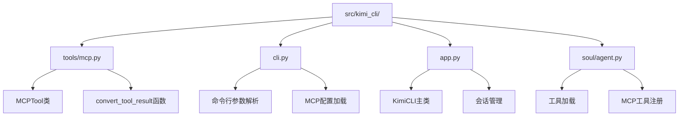

**图表来源**
- [mcp.py](file://src/kimi_cli/tools/mcp.py#L1-L114)
- [cli.py](file://src/kimi_cli/cli.py#L1-L358)
- [agent.py](file://src/kimi_cli/soul/agent.py#L122-L164)

**章节来源**
- [mcp.py](file://src/kimi_cli/tools/mcp.py#L1-L114)
- [cli.py](file://src/kimi_cli/cli.py#L1-L358)

## 核心组件

### MCPTool类

MCPTool是MCP集成的核心类，负责将MCP工具包装为Kimi CLI可用的工具格式。

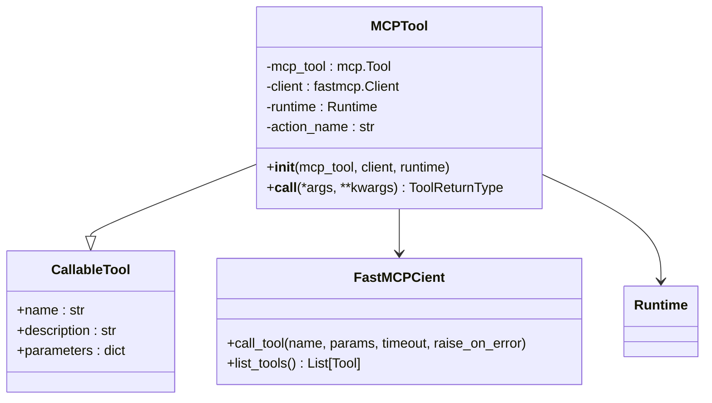

**图表来源**
- [mcp.py](file://src/kimi_cli/tools/mcp.py#L14-L43)

### 命令行接口

CLI模块提供了两个主要的MCP配置选项：

| 参数 | 类型 | 描述 | 示例 |
|------|------|------|------|
| `--mcp-config-file` | Path[] | MCP配置文件路径列表 | `/path/to/config.json` |
| `--mcp-config` | str[] | 直接传入的MCP配置JSON字符串 | `'{"url": "http://localhost:8080"}'` |

**章节来源**
- [cli.py](file://src/kimi_cli/cli.py#L155-L178)

## 架构概览

MCP集成的整体架构如下：

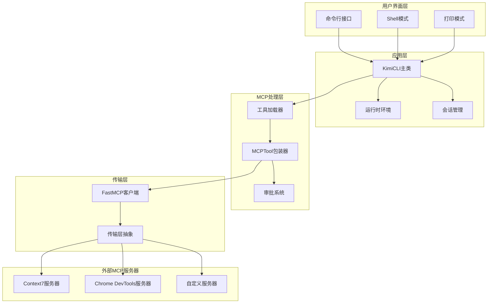

**图表来源**
- [app.py](file://src/kimi_cli/app.py#L25-L102)
- [agent.py](file://src/kimi_cli/soul/agent.py#L144-L164)

## 详细组件分析

### MCPTool实现

MCPTool类实现了从MCP工具到Kimi CLI工具的转换：

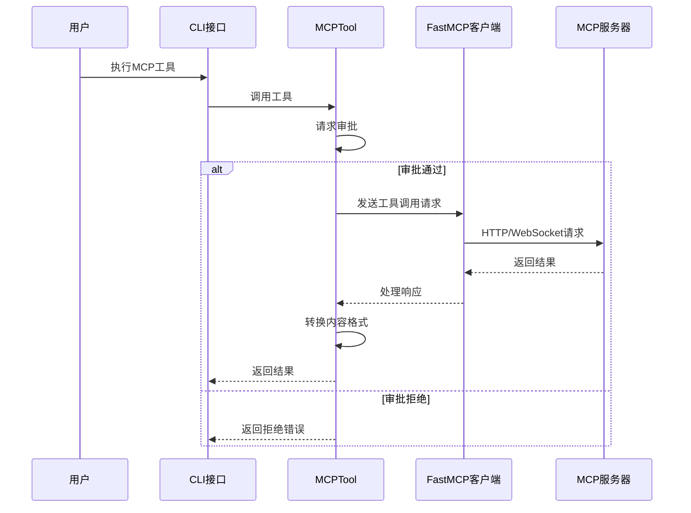

**图表来源**
- [mcp.py](file://src/kimi_cli/tools/mcp.py#L34-L43)

### 工具结果转换

MCP工具的结果被转换为Kimi CLI可识别的格式：

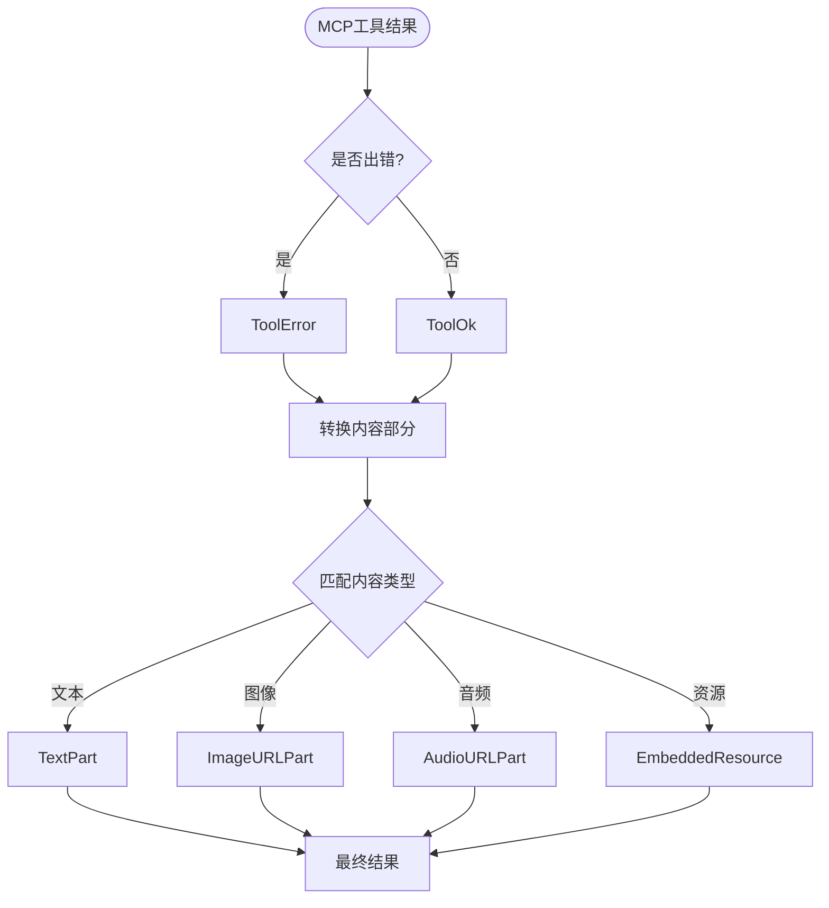

**图表来源**
- [mcp.py](file://src/kimi_cli/tools/mcp.py#L46-L113)

**章节来源**
- [mcp.py](file://src/kimi_cli/tools/mcp.py#L14-L113)

## 配置文件详解

### JSON Schema

MCP配置文件遵循特定的JSON Schema结构：

```json
{
  "mcpServers": {
    "context7": {
      "url": "https://mcp.context7.com/mcp",
      "headers": {
        "CONTEXT7_API_KEY": "YOUR_API_KEY"
      }
    },
    "chrome-devtools": {
      "command": "npx",
      "args": ["-y", "chrome-devtools-mcp@latest"]
    }
  }
}
```

### 配置参数说明

| 字段 | 类型 | 必需 | 描述 | 示例 |
|------|------|------|------|------|
| `url` | string | 否 | MCP服务器URL | `"https://mcp.example.com"` |
| `command` | string | 否 | 启动服务器的命令 | `"npx"` |
| `args` | string[] | 否 | 命令参数列表 | `["-y", "mcp-server@latest"]` |
| `headers` | object | 否 | HTTP请求头 | `{"Authorization": "Bearer token"}` |

### 多服务器配置

支持同时连接多个MCP服务器：

```bash
kimi --mcp-config-file config1.json --mcp-config-file config2.json
```

或使用多个配置字符串：

```bash
kimi --mcp-config '{"url": "http://localhost:8080"}' --mcp-config '{"url": "http://localhost:9090"}'
```

**章节来源**
- [cli.py](file://src/kimi_cli/cli.py#L155-L178)
- [README.md](file://README.md#L110-L130)

## 连接流程

### 初始化过程

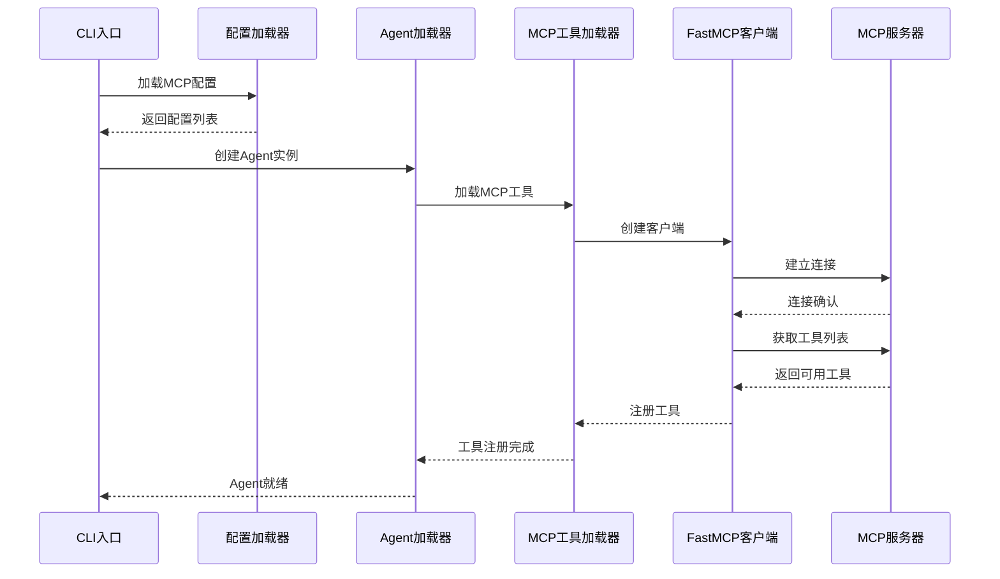

**图表来源**
- [cli.py](file://src/kimi_cli/cli.py#L283-L324)
- [agent.py](file://src/kimi_cli/soul/agent.py#L144-L164)

### 连接超时设置

每个MCP连接都有默认的超时设置：

- **工具调用超时**：20秒
- **连接建立超时**：由底层传输层决定
- **错误处理**：`raise_on_error=False`，返回错误而非抛出异常

**章节来源**
- [cli.py](file://src/kimi_cli/cli.py#L283-L324)
- [agent.py](file://src/kimi_cli/soul/agent.py#L144-L164)
- [mcp.py](file://src/kimi_cli/tools/mcp.py#L40-L42)

## 认证机制

### API Key认证

最常用的认证方式是通过HTTP头部传递API密钥：

```json
{
  "mcpServers": {
    "context7": {
      "url": "https://mcp.context7.com/mcp",
      "headers": {
        "CONTEXT7_API_KEY": "your-api-key-here"
      }
    }
  }
}
```

### 环境变量支持

配置文件中的值可以被环境变量覆盖：

```bash
export CONTEXT7_API_KEY="my-secret-key"
kimi --mcp-config-file mcp.json
```

### 其他认证方式

根据MCP规范，还支持以下认证方式：
- OAuth令牌
- 基本认证
- 自定义头部认证
- 证书认证

**章节来源**
- [README.md](file://README.md#L110-L130)

## 工具发现与调用

### 工具发现机制

MCP服务器会主动暴露其可用工具：

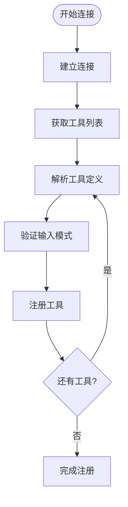

**图表来源**
- [agent.py](file://src/kimi_cli/soul/agent.py#L160-L163)

### 工具调用流程

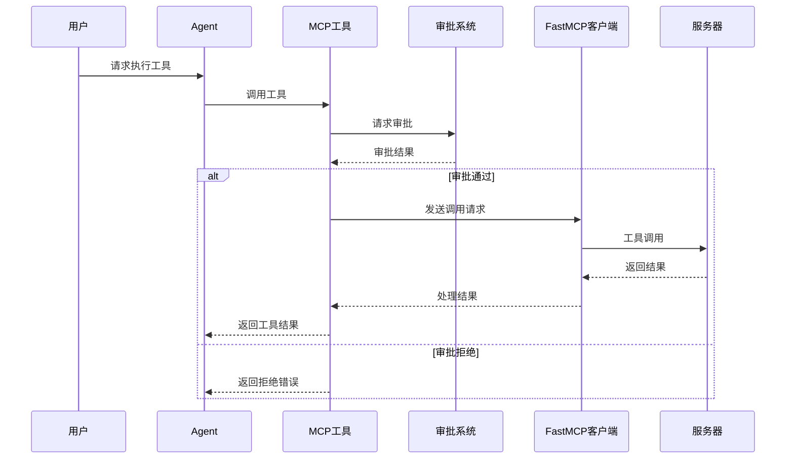

**图表来源**
- [mcp.py](file://src/kimi_cli/tools/mcp.py#L34-L43)

### 支持的内容类型

MCP工具支持多种内容类型的输入和输出：

| 类型 | 输入 | 输出 | MIME类型 |
|------|------|------|----------|
| 文本 | JSON Schema | 文本片段 | `text/plain` |
| 图像 | Base64编码 | 图像URL | `image/*` |
| 音频 | Base64编码 | 音频URL | `audio/*` |
| 资源链接 | URI引用 | 资源链接 | `application/*` |

**章节来源**
- [mcp.py](file://src/kimi_cli/tools/mcp.py#L46-L113)

## 错误处理

### 错误分类

MCP集成中的错误分为以下几类：

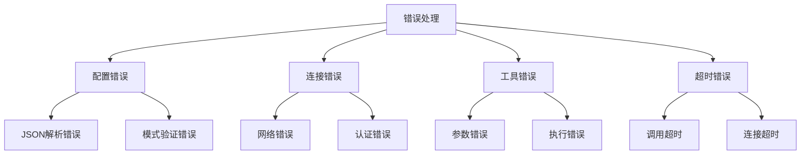

### 错误处理策略

| 错误类型 | 处理方式 | 用户反馈 |
|----------|----------|----------|
| JSON解析错误 | 显示具体错误信息 | "无效的JSON: {error}" |
| 连接失败 | 重试机制 | "无法连接到MCP服务器" |
| 工具调用失败 | 返回错误详情 | "工具执行失败: {details}" |
| 超时错误 | 设置合理超时 | "操作超时，请重试" |

### 异常恢复

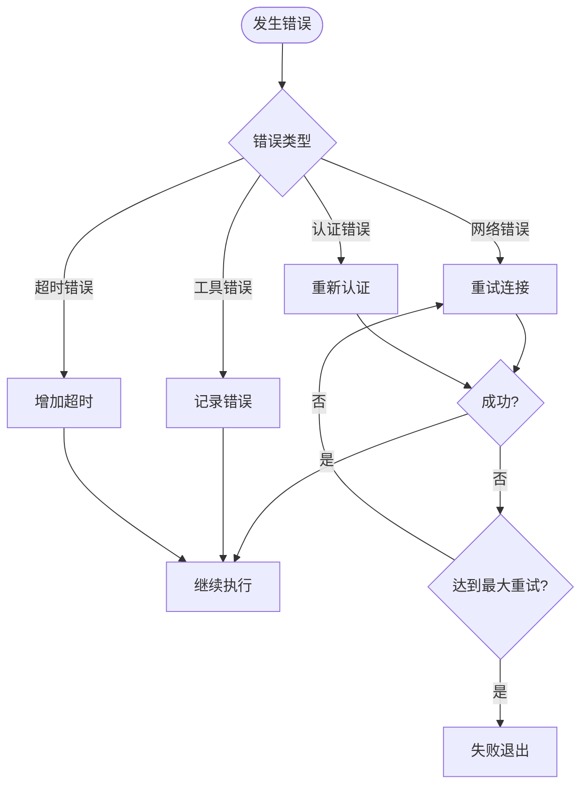

**章节来源**
- [cli.py](file://src/kimi_cli/cli.py#L275-L281)
- [mcp.py](file://src/kimi_cli/tools/mcp.py#L106-L113)

## 性能考虑

### 连接管理

- **连接池**：复用MCP连接以减少建立开销
- **心跳检测**：定期检查连接状态
- **自动重连**：网络中断时自动恢复连接
- **优雅关闭**：正常关闭连接和清理资源

### 消息处理

- **异步处理**：使用异步IO避免阻塞
- **批量操作**：合并多个小请求
- **背压控制**：防止内存溢出
- **压缩传输**：启用消息压缩

### 内存优化

- **流式处理**：大文件使用流式传输
- **缓存策略**：智能缓存工具定义
- **垃圾回收**：及时释放不需要的对象
- **资源监控**：监控内存使用情况

### 并发控制

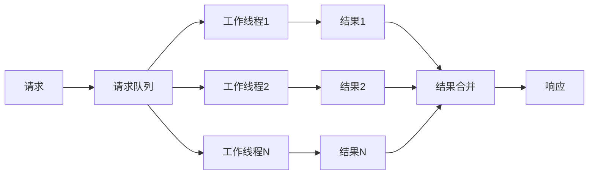

**章节来源**
- [mcp.py](file://src/kimi_cli/tools/mcp.py#L39-L42)

## 开发示例

### 连接Context7服务器

```json
{
  "mcpServers": {
    "context7": {
      "url": "https://mcp.context7.com/mcp",
      "headers": {
        "CONTEXT7_API_KEY": "your-context7-api-key"
      }
    }
  }
}
```

使用方法：
```bash
kimi --mcp-config-file context7-config.json
```

### 连接Chrome DevTools服务器

```json
{
  "mcpServers": {
    "chrome-devtools": {
      "command": "npx",
      "args": ["-y", "chrome-devtools-mcp@latest"]
    }
  }
}
```

使用方法：
```bash
kimi --mcp-config-file chrome-devtools-config.json
```

### 自定义MCP服务器

```json
{
  "mcpServers": {
    "my-custom-server": {
      "url": "http://localhost:8080/mcp",
      "headers": {
        "Authorization": "Bearer my-token"
      }
    }
  }
}
```

### 多服务器配置

```bash
kimi \
  --mcp-config-file context7.json \
  --mcp-config-file chrome-devtools.json \
  --mcp-config-file custom.json
```

**章节来源**
- [README.md](file://README.md#L110-L130)

## 故障排除

### 常见问题

| 问题 | 可能原因 | 解决方案 |
|------|----------|----------|
| 连接超时 | 网络延迟或服务器无响应 | 增加超时时间或检查网络 |
| 认证失败 | API密钥错误或过期 | 验证密钥有效性 |
| 工具不可用 | 服务器未提供该工具 | 检查服务器工具列表 |
| JSON解析错误 | 配置文件格式错误 | 验证JSON语法 |

### 调试技巧

1. **启用调试日志**：
   ```bash
   kimi --debug --mcp-config-file config.json
   ```

2. **检查配置文件**：
   ```bash
   python -c "import json; print(json.dumps(json.loads(open('config.json').read()), indent=2))"
   ```

3. **测试连接**：
   ```bash
   curl -H "Authorization: Bearer YOUR_TOKEN" https://mcp.example.com/mcp/tools
   ```

4. **查看日志文件**：
   ```
   ~/.local/share/kimi/logs/kimi.log
   ```

### 性能优化建议

- 使用本地服务器减少网络延迟
- 合理设置超时时间
- 监控内存使用情况
- 定期清理临时文件
- 使用连接池复用连接

**章节来源**
- [cli.py](file://src/kimi_cli/cli.py#L229-L238)

## 总结

Kimi CLI的MCP集成为用户提供了强大而灵活的外部工具集成能力。通过标准化的协议和丰富的配置选项，用户可以轻松地连接各种MCP服务器，扩展Kimi CLI的功能。

### 主要特性

- **标准化协议**：基于MCP标准，确保兼容性
- **灵活配置**：支持文件和直接JSON配置
- **类型安全**：基于Pydantic的输入输出验证
- **异步处理**：高性能的异步通信
- **错误处理**：完善的错误处理和恢复机制
- **权限控制**：内置的工具调用审批系统

### 最佳实践

1. **配置管理**：使用配置文件管理MCP服务器设置
2. **认证安全**：妥善保管API密钥和认证信息
3. **错误处理**：实现适当的错误处理和重试机制
4. **性能监控**：监控连接状态和响应时间
5. **安全考虑**：限制不必要的工具访问权限

通过遵循这些指导原则，开发者可以充分利用MCP集成的强大功能，构建更加智能和功能丰富的CLI应用程序。