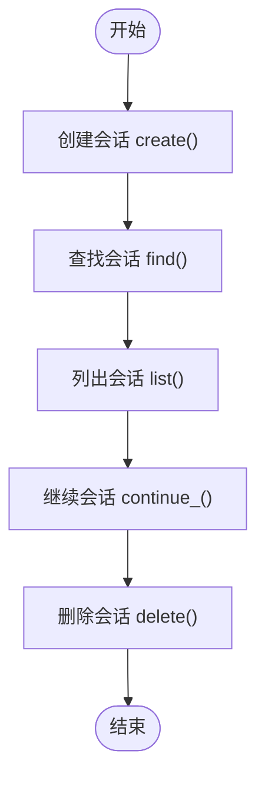
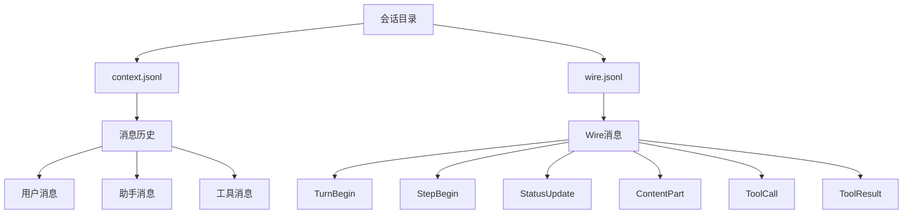
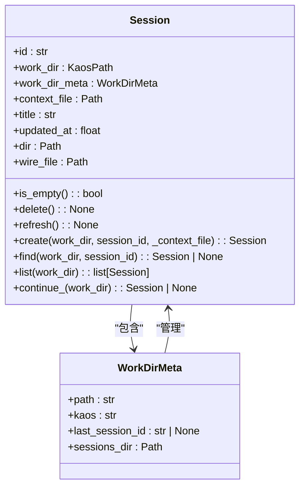
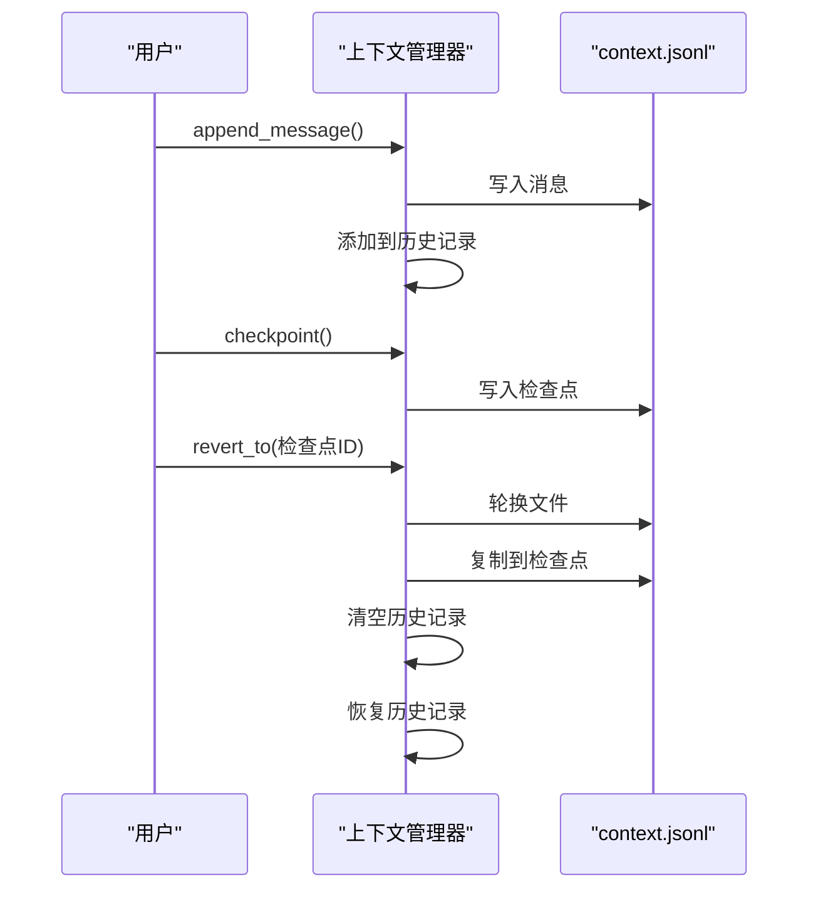
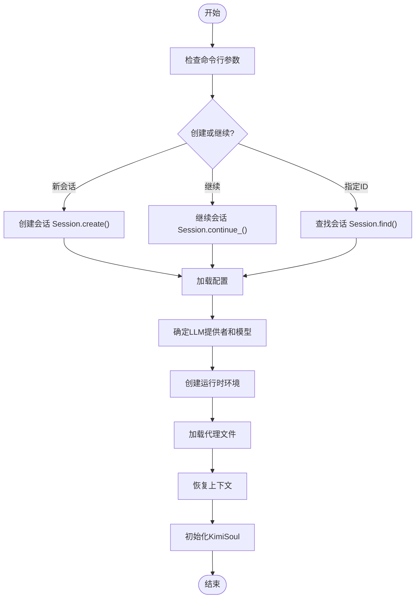

# 会话目录结构

<cite>
**本文档中引用的文件**  
- [session.py](file://src/kimi_cli/session.py)
- [metadata.py](file://src/kimi_cli/metadata.py)
- [context.py](file://src/kimi_cli/soul/context.py)
- [wire/message.py](file://src/kimi_cli/wire/message.py)
- [app.py](file://src/kimi_cli/app.py)
- [kimisoul.py](file://src/kimi_cli/soul/kimisoul.py)
- [cli.py](file://src/kimi_cli/cli.py)
</cite>

## 目录
1. [简介](#简介)
2. [会话核心组件](#会话核心组件)
3. [会话生命周期管理](#会话生命周期管理)
4. [会话数据存储结构](#会话数据存储结构)
5. [会话与工作目录关系](#会话与工作目录关系)
6. [会话元数据管理](#会话元数据管理)
7. [会话上下文管理](#会话上下文管理)
8. [会话通信协议](#会话通信协议)
9. [会话创建与恢复流程](#会话创建与恢复流程)
10. [会话迁移与兼容性](#会话迁移与兼容性)

## 简介
kimi-cli 项目中的会话系统是其核心功能之一，负责管理用户与AI代理之间的交互状态。会话系统通过结构化的目录和文件组织方式，持久化存储对话历史、上下文信息和元数据。每个会话都与特定的工作目录相关联，并通过唯一的会话ID进行标识。系统设计考虑了会话的创建、查找、列出、恢复和删除等完整生命周期管理，同时支持会话数据的迁移和兼容性处理。

## 会话核心组件

会话系统的核心是 `Session` 类，它封装了会话的所有属性和操作。会话ID是会话的唯一标识符，通常使用UUID生成。会话与工作目录紧密关联，每个工作目录可以有多个会话。会话系统还维护了会话的标题和最后更新时间戳，这些信息用于会话的展示和排序。会话的静态元数据包括会话ID、工作目录路径和工作目录元数据，而可刷新的元数据包括会话标题和最后更新时间。

**会话来源**
- [session.py](file://src/kimi_cli/session.py#L20-L38)

## 会话生命周期管理

会话系统提供了完整的生命周期管理功能，包括会话的创建、查找、列出、继续和删除。`create` 方法用于创建新会话，如果未指定会话ID，则自动生成UUID。`find` 方法根据工作目录和会话ID查找特定会话。`list` 方法列出指定工作目录的所有会话，并按最后更新时间倒序排列。`continue_` 方法获取工作目录的最后一个会话，用于会话的连续性。`delete` 方法异步删除会话目录，清理相关资源。



**流程图来源**
- [session.py](file://src/kimi_cli/session.py#L99-L260)

## 会话数据存储结构

会话数据存储采用分层目录结构，确保数据的组织性和可管理性。每个会话在文件系统中都有一个对应的目录，目录名即为会话ID。会话目录中包含两个主要文件：`context.jsonl` 和 `wire.jsonl`。`context.jsonl` 文件以JSON Lines格式存储消息历史，每行一个JSON对象，包含角色、内容和相关元数据。`wire.jsonl` 文件存储Wire协议消息，用于UI和后端之间的通信。这种分离的设计使得上下文管理和UI更新可以独立进行。



**图来源**
- [session.py](file://src/kimi_cli/session.py#L47-L50)
- [wire/message.py](file://src/kimi_cli/wire/message.py#L16-L188)

## 会话与工作目录关系

会话与工作目录之间存在一对一的关系，但一个工作目录可以有多个会话。`WorkDirMeta` 类管理工作目录的元数据，包括工作目录路径、KAOS名称和最后会话ID。工作目录的会话存储目录通过工作目录路径的MD5哈希值确定，确保路径名的唯一性和长度限制。如果工作目录位于非本地KAOS上，目录名会包含KAOS名称前缀。这种设计避免了长路径名问题，同时支持跨KAOS的会话管理。



**类图来源**
- [session.py](file://src/kimi_cli/session.py#L20-L272)
- [metadata.py](file://src/kimi_cli/metadata.py#L20-L40)

## 会话元数据管理

会话元数据管理通过 `Metadata` 类实现，该类负责加载和保存全局元数据。元数据文件存储在共享目录的 `kimi.json` 中，包含所有工作目录的元数据列表。`load_metadata` 函数从文件加载元数据，如果文件不存在则创建空元数据。`save_metadata` 函数将元数据保存到文件，使用JSON格式并保留非ASCII字符。`get_work_dir_meta` 方法根据工作目录路径获取其元数据，`new_work_dir_meta` 方法为新工作目录创建元数据。这种设计确保了元数据的持久化和跨会话的一致性。

**会话元数据来源**
- [metadata.py](file://src/kimi_cli/metadata.py#L42-L81)

## 会话上下文管理

会话上下文管理由 `Context` 类负责，它封装了消息历史的读写操作。上下文文件以追加模式写入，每条消息作为独立的JSON行存储。`restore` 方法从文件恢复上下文，跳过空行和元数据行。`append_message` 方法将消息添加到历史记录和文件中。`checkpoint` 方法创建检查点，用于上下文的版本控制和回滚。`revert_to` 方法将上下文回滚到指定检查点，通过文件轮换来实现原子性操作。`clear` 方法清空上下文，相当于回滚到初始状态。`update_token_count` 方法更新上下文的令牌计数，用于资源管理。



**序列图来源**
- [context.py](file://src/kimi_cli/soul/context.py#L16-L176)

## 会话通信协议

会话通信基于Wire协议，通过 `WireMessage` 类型联合定义了所有可能的消息类型。协议消息分为事件和请求两大类，事件包括 `TurnBegin`、`StepBegin`、`StatusUpdate` 等，请求主要是 `ApprovalRequest`。`WireMessageEnvelope` 类用于消息的序列化和反序列化，将具体消息类型包装为包含类型名和负载的通用格式。`is_event`、`is_request` 和 `is_wire_message` 函数用于类型检查，确保消息处理的正确性。这种设计实现了灵活的消息传递机制，支持UI更新、状态同步和用户交互。

```mermaid
erDiagram
WireMessage ||--o{ Event : "包含"
WireMessage ||--o{ Request : "包含"
Event }|-- TurnBegin : "继承"
Event }|-- StepBegin : "继承"
Event }|-- StepInterrupted : "继承"
Event }|-- CompactionBegin : "继承"
Event }|-- CompactionEnd : "继承"
Event }|-- StatusUpdate : "继承"
Event }|-- ContentPart : "继承"
Event }|-- ToolCall : "继承"
Event }|-- ToolCallPart : "继承"
Event }|-- ToolResult : "继承"
Event }|-- SubagentEvent : "继承"
Event }|-- ApprovalRequestResolved : "继承"
Request }|-- ApprovalRequest : "继承"
WireMessage }|-- WireMessageEnvelope : "包装"
```

**ER图来源**
- [wire/message.py](file://src/kimi_cli/wire/message.py#L16-L245)

## 会话创建与恢复流程

会话的创建与恢复流程由 `KimiCLI.create` 方法协调。流程开始于会话的创建或继续，根据命令行参数决定。如果指定了会话ID，则尝试查找现有会话；如果指定了继续模式，则获取最后一个会话；否则创建新会话。配置加载后，根据配置和环境变量确定LLM提供者和模型。运行时环境创建后，加载指定的代理文件或默认代理。上下文从文件恢复，最后初始化 `KimiSoul` 实例。整个流程确保了会话状态的正确初始化和配置的一致性。



**流程图来源**
- [app.py](file://src/kimi_cli/app.py#L50-L129)
- [cli.py](file://src/kimi_cli/cli.py#L40-L200)

## 会话迁移与兼容性

会话系统考虑了向后兼容性，通过 `_migrate_session_context_file` 函数处理旧版会话数据的迁移。在早期版本中，会话上下文文件直接存储在会话存储目录下，文件名为 `{session_id}.jsonl`。新版本将上下文文件移至会话子目录中，路径为 `{session_id}/context.jsonl`。迁移函数检查旧文件是否存在且新文件不存在，如果条件满足则创建子目录并重命名文件。迁移完成后记录日志，确保操作的可追溯性。这种设计允许系统平滑升级，保护用户数据不丢失。

**会话迁移来源**
- [session.py](file://src/kimi_cli/session.py#L262-L272)
- [metadata.py](file://src/kimi_cli/metadata.py#L32-L39)