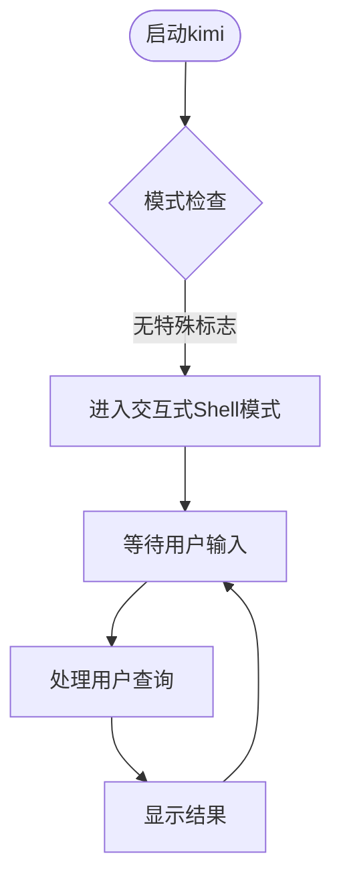
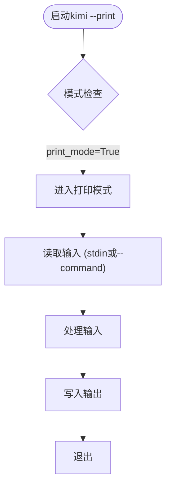
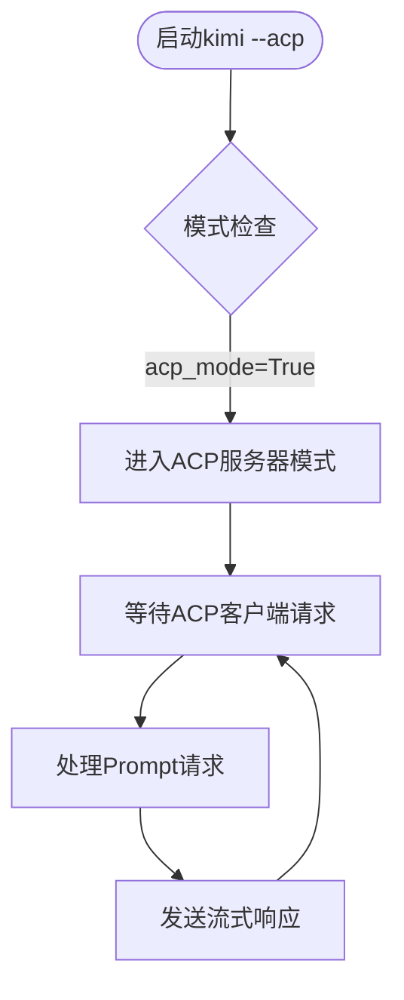
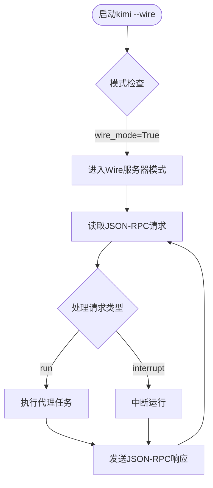
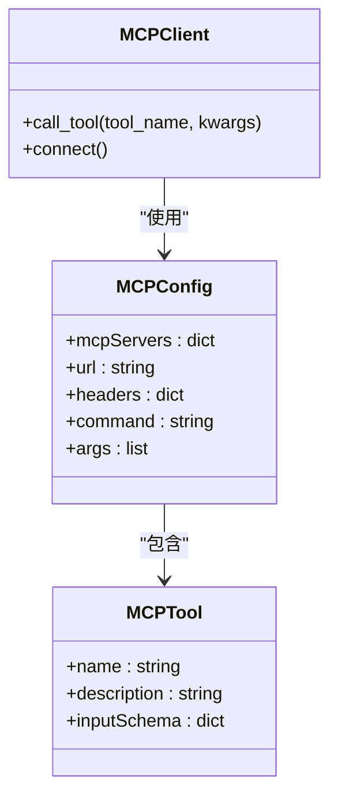

# 命令行参考

<cite>
**本文档中引用的文件**  
- [cli.py](file://src/kimi_cli/cli.py)
- [app.py](file://src/kimi_cli/app.py)
- [config.py](file://src/kimi_cli/config.py)
- [shell/__init__.py](file://src/kimi_cli/ui/shell/__init__.py)
- [print/__init__.py](file://src/kimi_cli/ui/print/__init__.py)
- [acp/__init__.py](file://src/kimi_cli/ui/acp/__init__.py)
- [wire/__init__.py](file://src/kimi_cli/ui/wire/__init__.py)
- [mcp.py](file://src/kimi_cli/tools/mcp.py)
- [constant.py](file://src/kimi_cli/constant.py)
</cite>

## 目录
1. [简介](#简介)
2. [命令模式](#命令模式)
3. [核心选项](#核心选项)
4. [MCP配置](#mcp配置)
5. [使用示例](#使用示例)
6. [输出格式与退出状态](#输出格式与退出状态)
7. [故障排除](#故障排除)

## 简介

Kimi CLI 是一个命令行智能代理工具，旨在帮助开发者完成软件开发任务和终端操作。它提供了多种运行模式，包括交互式shell模式、非交互式打印模式、ACP服务器模式和实验性的Wire服务器模式。该工具支持通过MCP（Model Control Protocol）配置连接外部服务，为开发者提供强大的AI辅助功能。

**Section sources**
- [cli.py](file://src/kimi_cli/cli.py#L21-L358)
- [README.md](file://README.md#L1-L162)

## 命令模式

Kimi CLI 提供了四种主要的运行模式，通过不同的命令行标志来激活。这些模式决定了工具的行为方式和交互形式。

### 默认Shell模式

默认模式提供了一个交互式的shell界面，用户可以与AI代理进行对话，执行命令并查看结果。这是最常用的模式，适合需要与代理进行多轮交互的场景。



**Diagram sources**
- [cli.py](file://src/kimi_cli/cli.py#L220-L227)
- [app.py](file://src/kimi_cli/app.py#L136-L186)

### 打印模式 (--print)

打印模式是一种非交互式模式，适合在脚本或自动化流程中使用。在此模式下，工具会处理输入并直接输出结果，不提供交互界面。



**Diagram sources**
- [cli.py](file://src/kimi_cli/cli.py#L114-L122)
- [print/__init__.py](file://src/kimi_cli/ui/print/__init__.py#L21-L127)

### ACP服务器模式 (--acp)

ACP（Agent Client Protocol）服务器模式使Kimi CLI能够作为AI代理服务器运行，与支持ACP协议的编辑器或IDE集成，如Zed编辑器。



**Diagram sources**
- [cli.py](file://src/kimi_cli/cli.py#L123-L129)
- [acp/__init__.py](file://src/kimi_cli/ui/acp/__init__.py#L447-L473)

### Wire服务器模式 (--wire)

Wire服务器模式是一种实验性模式，通过JSON-RPC协议提供更底层的通信接口，适合需要精细控制的集成场景。



**Diagram sources**
- [cli.py](file://src/kimi_cli/cli.py#L130-L136)
- [wire/__init__.py](file://src/kimi_cli/ui/wire/__init__.py#L114-L343)

## 核心选项

Kimi CLI 提供了一系列核心选项来控制其行为。这些选项可以组合使用，以满足不同的使用需求。

### 通用选项

| 选项 | 别名 | 数据类型 | 默认值 | 描述 |
|------|------|--------|--------|------|
| `--version` | `-V` | 布尔值 | False | 显示版本信息并退出 |
| `--verbose` | | 布尔值 | False | 打印详细信息 |
| `--debug` | | 布尔值 | False | 记录调试信息 |
| `--work-dir` | `-w` | 路径 | 当前目录 | 设置工作目录 |
| `--continue` | `-C` | 布尔值 | False | 继续之前的工作会话 |

**Section sources**
- [cli.py](file://src/kimi_cli/cli.py#L38-L103)

### 代理配置选项

| 选项 | 数据类型 | 默认值 | 描述 |
|------|--------|--------|------|
| `--agent-file` | 路径 | 内置默认代理 | 指定自定义代理规范文件 |
| `--model` | 字符串 | 配置文件中设置的默认模型 | 指定使用的LLM模型 |
| `--thinking` | 布尔值 | 上次设置的值 | 启用思考模式（如果支持） |

**Section sources**
- [cli.py](file://src/kimi_cli/cli.py#L64-L196)
- [app.py](file://src/kimi_cli/app.py#L27-L102)

### 自动化选项

| 选项 | 别名 | 描述 |
|------|------|------|
| `--yolo` | `--yes`, `-y`, `--auto-approve` | 自动批准所有操作，无需确认 |
| `--print` | | 运行在打印模式（非交互式），隐式添加`--yolo` |

**Section sources**
- [cli.py](file://src/kimi_cli/cli.py#L114-L122)
- [app.py](file://src/kimi_cli/app.py#L294-L295)

### 输入输出格式选项

| 选项 | 数据类型 | 默认值 | 描述 |
|------|--------|--------|------|
| `--input-format` | text \| stream-json | text | 输入格式，必须与`--print`一起使用 |
| `--output-format` | text \| stream-json | text | 输出格式，必须与`--print`一起使用 |

**Section sources**
- [cli.py](file://src/kimi_cli/cli.py#L137-L154)
- [print/__init__.py](file://src/kimi_cli/ui/print/__init__.py#L21-L127)

## MCP配置

MCP（Model Control Protocol）配置允许Kimi CLI连接到外部服务和工具，扩展其功能。可以通过文件或直接JSON配置来指定MCP服务器。

### MCP配置选项

| 选项 | 数据类型 | 描述 |
|------|--------|------|
| `--mcp-config-file` | 路径列表 | MCP配置文件路径，可多次指定多个配置 |
| `--mcp-config` | JSON字符串列表 | MCP配置JSON，可多次指定多个配置 |



**Diagram sources**
- [cli.py](file://src/kimi_cli/cli.py#L155-L178)
- [mcp.py](file://src/kimi_cli/tools/mcp.py#L14-L114)

### MCP配置示例

```json
{
  "mcpServers": {
    "context7": {
      "url": "https://mcp.context7.com/mcp",
      "headers": {
        "CONTEXT7_API_KEY": "YOUR_API_KEY"
      }
    },
    "chrome-devtools": {
      "command": "npx",
      "args": ["-y", "chrome-devtools-mcp@latest"]
    }
  }
}
```

使用方式：
```bash
kimi --mcp-config-file /path/to/mcp.json
```

**Section sources**
- [cli.py](file://src/kimi_cli/cli.py#L155-L178)
- [mcp.py](file://src/kimi_cli/tools/mcp.py#L14-L114)

## 使用示例

以下是一些常见的使用场景和示例命令。

### 启动交互式会话

启动默认的交互式shell会话：

```bash
kimi
```

继续之前的工作目录会话：

```bash
kimi --work-dir /path/to/project --continue
```

**Section sources**
- [cli.py](file://src/kimi_cli/cli.py#L38-L358)
- [README.md](file://README.md#L51-L56)

### 执行非交互式任务

使用`--print`模式执行单个命令：

```bash
kimi --print --command "列出当前目录的所有Python文件"
```

从标准输入读取命令：

```bash
echo "分析这个代码文件的结构" | kimi --print
```

使用流式JSON输入输出：

```bash
kimi --print --input-format stream-json --output-format stream-json
```

**Section sources**
- [cli.py](file://src/kimi_cli/cli.py#L104-L113)
- [print/__init__.py](file://src/kimi_cli/ui/print/__init__.py#L44-L127)

### 连接MCP服务器

连接到MCP服务器以使用扩展工具：

```bash
kimi --mcp-config-file ./mcp-config.json
```

指定多个MCP配置文件：

```bash
kimi --mcp-config-file ./mcp1.json --mcp-config-file ./mcp2.json
```

使用内联JSON配置：

```bash
kimi --mcp-config '{"mcpServers": {"my-server": {"url": "http://localhost:8080"}}}'
```

**Section sources**
- [cli.py](file://src/kimi_cli/cli.py#L155-L178)
- [mcp.py](file://src/kimi_cli/tools/mcp.py#L14-L114)

### 集成到编辑器

配置Zed编辑器使用Kimi CLI作为ACP代理：

```json
{
  "agent_servers": {
    "Kimi CLI": {
      "command": "kimi",
      "args": ["--acp"],
      "env": {}
    }
  }
}
```

**Section sources**
- [README.md](file://README.md#L88-L107)
- [acp/__init__.py](file://src/kimi_cli/ui/acp/__init__.py#L74-L473)

## 输出格式与退出状态

了解Kimi CLI的输出格式和退出状态对于在脚本中使用该工具至关重要。

### 输出格式

在不同模式下，Kimi CLI会产生不同的输出：

- **Shell模式**: 丰富的交互式输出，包含颜色和格式化
- **打印模式**: 简化的文本输出，适合脚本处理
- **ACP模式**: 流式的JSON-RPC消息，用于编辑器集成
- **Wire模式**: 结构化的JSON-RPC响应，包含详细的状态信息

### 退出状态码

| 状态码 | 含义 |
|-------|------|
| 0 | 成功执行，所有操作完成 |
| 1 | 执行失败，发生错误或被用户中断 |
| 2 | 命令行参数错误 |

在`--print`模式下，成功完成任务返回状态码0，而失败或中断则返回状态码1。

**Section sources**
- [cli.py](file://src/kimi_cli/cli.py#L343-L348)
- [app.py](file://src/kimi_cli/app.py#L283-L341)

## 故障排除

### 常见问题与解决方案

| 问题 | 可能原因 | 解决方案 |
|------|--------|--------|
| 无法启动 | 权限问题或首次运行安全检查 | 等待完成安全检查，通常需要10秒以上 |
| LLM未设置 | 未配置模型或API密钥 | 发送`/setup`命令配置LLM |
| 授权失败 | API密钥无效或过期 | 检查API密钥并重新配置 |
| 配额超出 | 使用量超过限制 | 升级计划或稍后重试 |
| MCP连接失败 | 配置文件格式错误 | 检查JSON格式和服务器URL |

### 调试技巧

启用详细日志以诊断问题：

```bash
kimi --debug --verbose
```

日志文件保存在共享目录的logs子目录中，文件名为`kimi.log`。

**Section sources**
- [cli.py](file://src/kimi_cli/cli.py#L50-L63)
- [app.py](file://src/kimi_cli/app.py#L230-L238)
- [shell/__init__.py](file://src/kimi_cli/ui/shell/__init__.py#L140-L226)