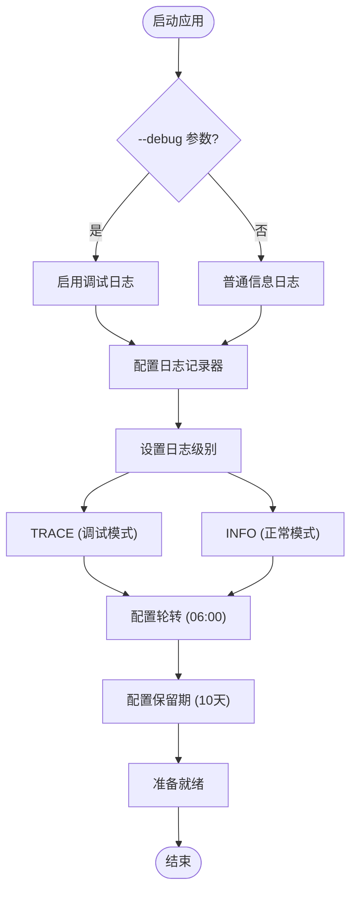

# 命令详情

<cite>
**本文档中引用的文件**
- [cli.py](file://src/kimi_cli/cli.py)
- [app.py](file://src/kimi_cli/app.py)
- [config.py](file://src/kimi_cli/config.py)
- [session.py](file://src/kimi_cli/session.py)
- [print/__init__.py](file://src/kimi_cli/ui/print/__init__.py)
- [acp/__init__.py](file://src/kimi_cli/ui/acp/__init__.py)
- [wire/__init__.py](file://src/kimi_cli/ui/wire/__init__.py)
- [mcp.py](file://src/kimi_cli/tools/mcp.py)
- [session.py](file://src/kimi_cli/session.py)
</cite>

## 目录
1. [简介](#简介)
2. [核心UI模式参数](#核心ui模式参数)
3. [工作目录与会话管理](#工作目录与会话管理)
4. [输入输出格式控制](#输入输出格式控制)
5. [MCP配置管理](#mcp配置管理)
6. [模型与代理设置](#模型与代理设置)
7. [权限与安全控制](#权限与安全控制)
8. [调试与日志控制](#调试与日志控制)
9. [参数验证与错误处理](#参数验证与错误处理)
10. [使用场景与最佳实践](#使用场景与最佳实践)
11. [故障排除指南](#故障排除指南)

## 简介

kimi-cli 是一个功能强大的CLI智能代理工具，提供了丰富的命令行参数来控制不同的运行模式和行为。本文档详细说明了所有可用的命令行选项，包括它们的数据类型、默认值、有效范围以及相互依赖关系。

## 核心UI模式参数

### 互斥模式设计

kimi-cli 实现了严格的互斥模式控制，确保同一时间只能启用一种主要运行模式。这种设计通过 `special_flags` 字典和条件判断实现。


**图表来源**
- [cli.py](file://src/kimi_cli/cli.py#L208-L218)

#### --print 参数

**技术规格：**
- 类型：`bool`
- 默认值：`False`
- 数据类型：布尔值
- 互斥关系：与其他特殊标志互斥
- 特殊行为：隐式启用 `--yolo` 模式

**功能描述：**
- 运行非交互式打印模式
- 自动批准所有操作（等同于 `--yolo`）
- 支持管道输入和输出格式化
- 适用于脚本自动化场景

**使用示例：**
```bash
# 基本打印模式
kimi --print "列出当前目录下的Python文件"

# 结合输入输出格式
echo '{"role":"user","content":"分析项目结构"}' | kimi --print --input-format stream-json --output-format text
```

#### --acp 参数

**技术规格：**
- 类型：`bool`
- 默认值：`False`
- 数据类型：布尔值
- 协议标准：符合 ACP (Agent Communication Protocol) 规范
- 互斥关系：与其他特殊标志互斥

**功能描述：**
- 启动 ACP 服务器进程
- 提供标准化的代理通信接口
- 支持外部客户端连接
- 实现完整的工具调用审批流程

**架构组件：**


**图表来源**
- [acp/__init__.py](file://src/kimi_cli/ui/acp/__init__.py#L136-L168)

#### --wire 参数

**技术规格：**
- 类型：`bool`
- 默认值：`False`
- 数据类型：布尔值
- 协议标准：JSON-RPC 2.0
- 互斥关系：与其他特殊标志互斥

**功能描述：**
- 启动实验性的 Wire 服务器
- 提供 JSON-RPC 接口用于程序化控制
- 支持运行和中断操作
- 适用于高级集成场景

**协议消息流：**


**图表来源**
- [wire/__init__.py](file://src/kimi_cli/ui/wire/__init__.py#L178-L241)

**节来源**
- [cli.py](file://src/kimi_cli/cli.py#L114-L136)
- [acp/__init__.py](file://src/kimi_cli/ui/acp/__init__.py#L447-L473)
- [wire/__init__.py](file://src/kimi_cli/ui/wire/__init__.py#L114-L138)

## 工作目录与会话管理

### 工作目录参数 (--work-dir, -w)

**技术规格：**
- 类型：`Path | None`
- 默认值：`None`（当前目录）
- 验证规则：必须存在且为可读目录
- 数据类型：路径对象

**功能描述：**
- 指定代理的工作目录
- 影响文件访问权限和工具调用范围
- 作为会话标识的基础
- 支持绝对和相对路径

### 会话继续参数 (--continue, -C)

**技术规格：**
- 类型：`bool`
- 默认值：`False`
- 数据类型：布尔值

**功能描述：**
- 恢复指定工作目录的前一次会话
- 从历史记录中恢复上下文信息
- 维持连续的对话状态
- 如果没有前次会话则抛出错误


**图表来源**
- [cli.py](file://src/kimi_cli/cli.py#L240-L248)
- [session.py](file://src/kimi_cli/session.py#L58-L83)

**使用场景：**
```bash
# 在特定目录中恢复会话
kimi --work-dir /path/to/project --continue

# 结合命令参数恢复并执行新任务
kimi --work-dir /path/to/project --continue --command "分析最近的提交"

# 脚本化会话管理
PROJECT_DIR="/tmp/my-project"
mkdir -p "$PROJECT_DIR"
kimi --work-dir "$PROJECT_DIR" --continue || kimi --work-dir "$PROJECT_DIR" --command "初始化项目"
```

**节来源**
- [cli.py](file://src/kimi_cli/cli.py#L83-L103)
- [session.py](file://src/kimi_cli/session.py#L19-L83)

## 输入输出格式控制

### 输入格式参数 (--input-format)

**技术规格：**
- 类型：`InputFormat | None`
- 可选值：`"text"` 或 `"stream-json"`
- 默认值：`None`
- 依赖关系：仅在 `--print` 模式下有效

**功能描述：**
- 控制输入数据的解析格式
- 支持文本输入和流式JSON输入
- 影响管道处理能力

### 输出格式参数 (--output-format)

**技术规格：**
- 类型：`OutputFormat | None`
- 可选值：`"text"` 或 `"stream-json"`
- 默认值：`None`
- 依赖关系：仅在 `--print` 模式下有效

**功能描述：**
- 控制输出数据的格式化方式
- 支持纯文本和结构化JSON输出
- 影响后续管道处理


**图表来源**
- [cli.py](file://src/kimi_cli/cli.py#L258-L268)
- [print/__init__.py](file://src/kimi_cli/ui/print/__init__.py#L103-L127)

**使用示例：**
```bash
# 文本输入输出
echo "分析项目结构" | kimi --print --output-format text

# JSON流输入输出
cat <<EOF | kimi --print --input-format stream-json --output-format stream-json
{"role":"user","content":"分析项目结构"}
{"role":"user","content":"找出主要的Python文件"}
EOF

# 结合管道处理
curl -s https://api.github.com/repos/octocat/Hello-World/contents |
  jq -r '.[] | select(.type=="file") | .name' |
  kimi --print --input-format text --output-format text
```

**节来源**
- [cli.py](file://src/kimi_cli/cli.py#L137-L154)
- [print/__init__.py](file://src/kimi_cli/ui/print/__init__.py#L21-L43)

## MCP配置管理

### 多重配置加载机制

kimi-cli 支持通过多种方式加载MCP（Model Context Protocol）配置，实现了灵活的配置组合机制。

#### --mcp-config-file 参数

**技术规格：**
- 类型：`list[Path] | None`
- 默认值：`None`
- 数据类型：路径列表
- 支持多次调用：是
- 验证规则：文件必须存在且可读

**功能描述：**
- 加载本地MCP配置文件
- 支持多次调用以加载多个配置文件
- 自动解析JSON格式配置
- 优先级低于 `--mcp-config` 参数

#### --mcp-config 参数

**技术规格：**
- 类型：`list[str] | None`
- 默认值：`None`
- 数据类型：JSON字符串列表
- 支持多次调用：是

**功能描述：**
- 直接提供MCP配置JSON字符串
- 支持多次调用以加载多个配置
- 适用于内联配置和动态生成配置


**图表来源**
- [cli.py](file://src/kimi_cli/cli.py#L270-L282)
- [mcp.py](file://src/kimi_cli/tools/mcp.py#L14-L44)

**配置加载顺序：**
1. `--mcp-config-file` 参数中的文件按顺序加载
2. `--mcp-config` 参数中的字符串按顺序加载
3. 后加载的配置覆盖先加载的配置相同部分

**使用示例：**
```bash
# 加载单个配置文件
kimi --mcp-config-file /path/to/config1.json

# 加载多个配置文件
kimi --mcp-config-file config1.json --mcp-config-file config2.json

# 内联配置
kimi --mcp-config '{"type":"server","command":["python","-m","mcp_server"]}' \
     --mcp-config '{"type":"browser","capabilities":{"navigate":true}}'

# 组合使用
kimi --mcp-config-file base-config.json \
     --mcp-config '{"type":"custom","endpoint":"http://localhost:8080"}'
```

**节来源**
- [cli.py](file://src/kimi_cli/cli.py#L155-L178)
- [mcp.py](file://src/kimi_cli/tools/mcp.py#L14-L114)

## 模型与代理设置

### 模型参数 (--model, -m)

**技术规格：**
- 类型：`str | None`
- 默认值：`None`
- 数据类型：字符串
- 依赖关系：需要在配置文件中预定义

**功能描述：**
- 指定使用的LLM模型名称
- 优先级高于配置文件中的默认模型
- 必须在配置文件的模型列表中定义

### 代理文件参数 (--agent-file)

**技术规格：**
- 类型：`Path | None`
- 默认值：`None`
- 验证规则：文件必须存在且可读
- 数据类型：路径对象

**功能描述：**
- 指定自定义代理规范文件
- 替换内置默认代理配置
- 支持复杂的代理行为定制

### 思考模式参数 (--thinking)

**技术规格：**
- 类型：`bool | None`
- 默认值：`None`
- 数据类型：布尔值或None
- 特殊行为：继承上次会话的思考模式

**功能描述：**
- 启用或禁用思考模式
- 如果为 `None`，则使用上次会话的设置
- 需要支持思考模式的模型

**节来源**
- [cli.py](file://src/kimi_cli/cli.py#L75-L95)
- [app.py](file://src/kimi_cli/app.py#L26-L102)

## 权限与安全控制

### 自动批准参数 (--yolo, --yes, -y, --auto-approve)

**技术规格：**
- 类型：`bool`
- 默认值：`False`
- 数据类型：布尔值
- 特殊行为：在 `--print` 模式下自动启用

**功能描述：**
- 自动批准所有工具调用请求
- 禁用交互式审批流程
- 提高自动化效率
- 需要谨慎使用以避免意外操作


**图表来源**
- [cli.py](file://src/kimi_cli/cli.py#L294-L295)

### 命令参数 (--command, -c, --query, -q)

**技术规格：**
- 类型：`str | None`
- 默认值：`None`
- 数据类型：字符串
- 验证规则：不能为空字符串

**功能描述：**
- 直接提供用户查询
- 支持简短命令行查询
- 在非交互模式下特别有用
- 自动去除首尾空白字符

**节来源**
- [cli.py](file://src/kimi_cli/cli.py#L179-L195)
- [cli.py](file://src/kimi_cli/cli.py#L254-L258)

## 调试与日志控制

### 详细输出参数 (--verbose)

**技术规格：**
- 类型：`bool`
- 默认值：`False`
- 数据类型：布尔值

**功能描述：**
- 启用详细信息输出
- 显示内部操作过程
- 用于调试和问题诊断
- 与 `--debug` 参数配合使用

### 调试参数 (--debug)

**技术规格：**
- 类型：`bool`
- 默认值：`False`
- 数据类型：布尔值

**功能描述：**
- 启用调试日志记录
- 记录详细的执行信息
- 将日志保存到 `~/.kimi/logs/kimi.log`
- 支持轮转和保留策略



**图表来源**
- [cli.py](file://src/kimi_cli/cli.py#L230-L238)

**日志配置：**
- 日志文件位置：`~/.kimi/logs/kimi.log`
- 轮转时间：每天凌晨6点
- 保留期限：10天
- 级别控制：`--debug` 时为 `TRACE`，否则为 `INFO`

**节来源**
- [cli.py](file://src/kimi_cli/cli.py#L50-L63)
- [cli.py](file://src/kimi_cli/cli.py#L230-L238)

## 参数验证与错误处理

### 版本回调机制

kimi-cli 使用了 `is_eager=True` 的版本回调机制，确保版本信息优先显示。

**技术特点：**
- `is_eager=True`：立即处理版本请求
- 不影响其他参数验证
- 提供清晰的版本信息输出

### 互斥参数验证

系统实现了严格的互斥参数验证，防止不兼容的参数组合。


**图表来源**
- [cli.py](file://src/kimi_cli/cli.py#L208-L218)

### 错误处理层次

1. **参数解析层**：Typer框架提供的基础验证
2. **业务逻辑层**：应用级别的参数验证
3. **运行时层**：执行过程中的异常处理

**常见错误类型：**
- `BadParameter`：参数值无效
- `ValidationError`：配置文件格式错误
- `JSONDecodeError`：JSON格式错误

**节来源**
- [cli.py](file://src/kimi_cli/cli.py#L32-L35)
- [cli.py](file://src/kimi_cli/cli.py#L208-L218)

## 使用场景与最佳实践

### 交互式开发环境

```bash
# 基本交互模式
kimi

# 带有工作目录的交互模式
kimi --work-dir /path/to/project

# 启用思考模式的开发助手
kimi --thinking --work-dir ~/my-project
```

### 自动化脚本集成

```bash
# 打印模式用于脚本
kimi --print "分析项目依赖" | tee dependencies.txt

# JSON格式输出便于程序处理
kimi --print --output-format stream-json "生成API文档" | jq '.content'

# 多步骤自动化
kimi --print --command "初始化Git仓库" \
     --print --command "添加所有文件" \
     --print --command "创建初始提交"
```

### CI/CD集成场景

```bash
# 静默模式部署
kimi --print --yolo --command "部署到生产环境"

# 带有审批的部署
kimi --print --command "部署到生产环境" | \
  jq -r '.content' | \
  xargs -I {} echo "部署结果: {}" && \
  kimi --print --command "监控部署状态"
```

### ACP服务器集成

```bash
# 启动ACP服务器供IDE集成
kimi --acp &

# 外部客户端连接示例
echo '{"method":"prompt","params":{"prompt":"分析代码质量"}}' | \
  nc localhost 3000
```

### Wire服务器集成

```bash
# 启动Wire服务器
kimi --wire &

# 程序化控制示例
echo '{"jsonrpc":"2.0","id":1,"method":"run","params":{"input":"分析项目结构"}}' | \
  nc localhost 3001

# 中断正在运行的任务
echo '{"jsonrpc":"2.0","id":2,"method":"interrupt","params":{}}' | \
  nc localhost 3001
```

## 故障排除指南

### 常见错误及解决方案

#### Cannot combine 错误

**错误信息：**
```
Error: Cannot combine --print, --acp.
```

**原因分析：**
- 同时启用了多个互斥的UI模式参数
- 如同时使用 `--print` 和 `--acp`

**解决方案：**
```bash
# 错误示例
kimi --print --acp

# 正确示例
kimi --print  # 或 kimi --acp
```

**调试建议：**
1. 检查是否同时使用了 `--print`、`--acp` 和 `--wire`
2. 确认只有一个UI模式参数被启用
3. 使用 `--help` 查看参数说明

#### No previous session 错误

**错误信息：**
```
Error: No previous session found for the working directory
```

**原因分析：**
- 使用 `--continue` 参数但指定的工作目录没有历史会话
- 工作目录从未被使用过

**解决方案：**
```bash
# 创建新会话而不是继续
kimi --work-dir /path/to/project --command "初始化项目"

# 或者先创建会话
kimi --work-dir /path/to/project
# 然后继续
kimi --work-dir /path/to/project --continue
```

#### Input format not supported 错误

**错误信息：**
```
Error: Input format is only supported for print UI
```

**原因分析：**
- 在非打印模式下使用了 `--input-format` 参数
- `--input-format` 和 `--output-format` 只能在 `--print` 模式下使用

**解决方案：**
```bash
# 错误示例
kimi --acp --input-format text

# 正确示例
kimi --print --input-format text
```

#### Invalid JSON 错误

**错误信息：**
```
Error: Invalid JSON: Expecting ',' delimiter
```

**原因分析：**
- `--mcp-config-file` 指定的文件包含无效JSON
- `--mcp-config` 提供的JSON字符串格式错误

**解决方案：**
```bash
# 检查JSON文件语法
python -m json.tool config.json

# 验证JSON字符串
echo '{"valid":"json"}' | python -m json.tool
```

### 调试技巧

#### 启用详细日志

```bash
# 同时启用详细输出和调试
kimi --verbose --debug --command "测试命令"
```

#### 检查配置文件

```bash
# 查看配置文件位置
ls -la ~/.kimi/config.json

# 验证配置文件格式
python -m json.tool ~/.kimi/config.json
```

#### 测试MCP配置

```bash
# 单独测试MCP配置
kimi --mcp-config-file test-config.json --print --command "测试MCP"
```

### 性能优化建议

1. **合理使用缓存**：利用 `--continue` 参数恢复会话
2. **批量处理**：在 `--print` 模式下使用管道处理大量数据
3. **配置优化**：适当调整模型参数和工具配置
4. **资源管理**：定期清理旧的日志和会话文件

### 最佳实践总结

1. **明确使用场景**：根据需求选择合适的UI模式
2. **参数组合验证**：确保互斥参数不会冲突
3. **配置文件管理**：维护有效的MCP配置文件
4. **错误处理**：实现适当的错误处理和重试机制
5. **性能监控**：关注长时间运行任务的资源使用

通过遵循这些指导原则和最佳实践，可以充分发挥kimi-cli的功能，提高开发和自动化工作的效率。