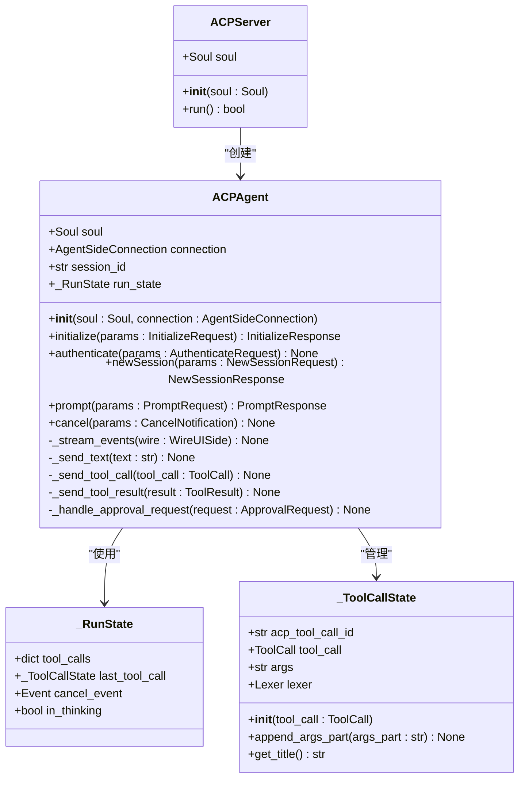
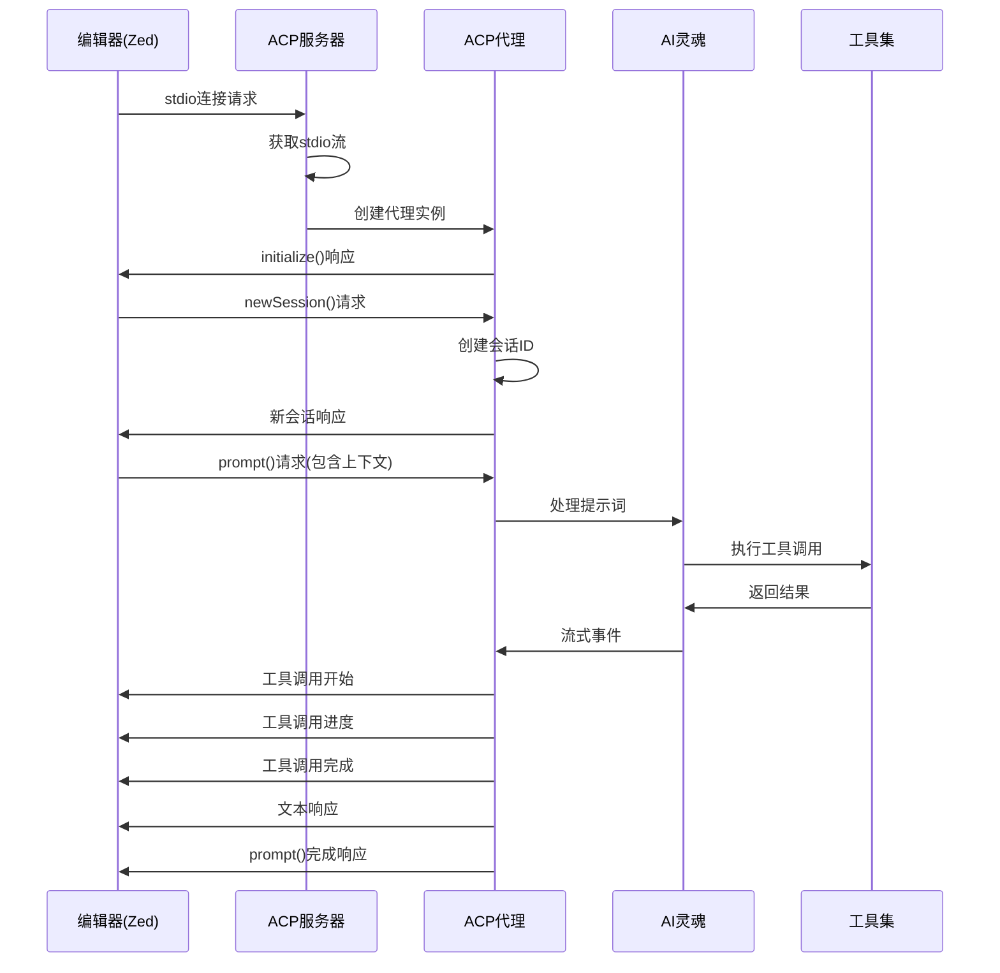
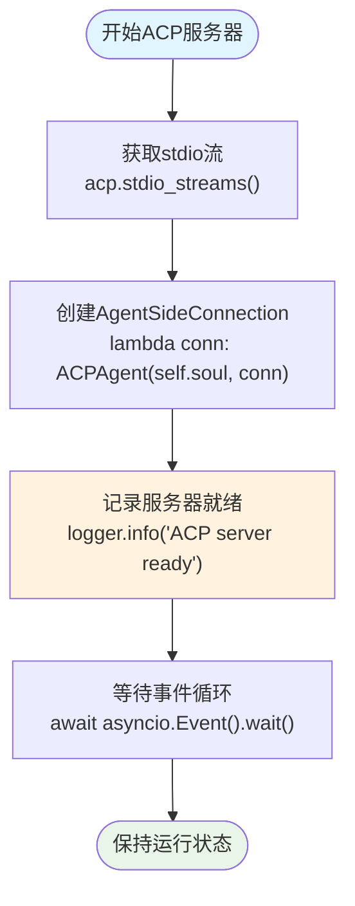
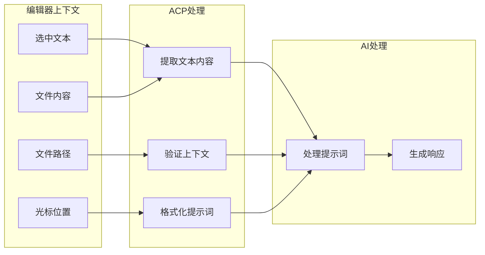
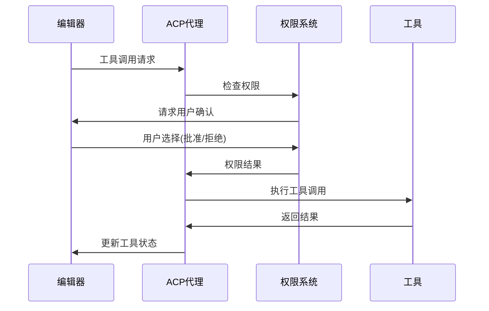
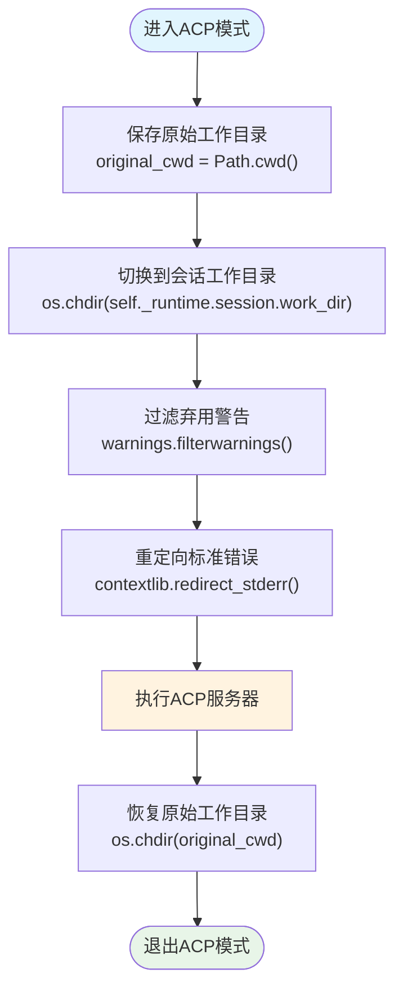
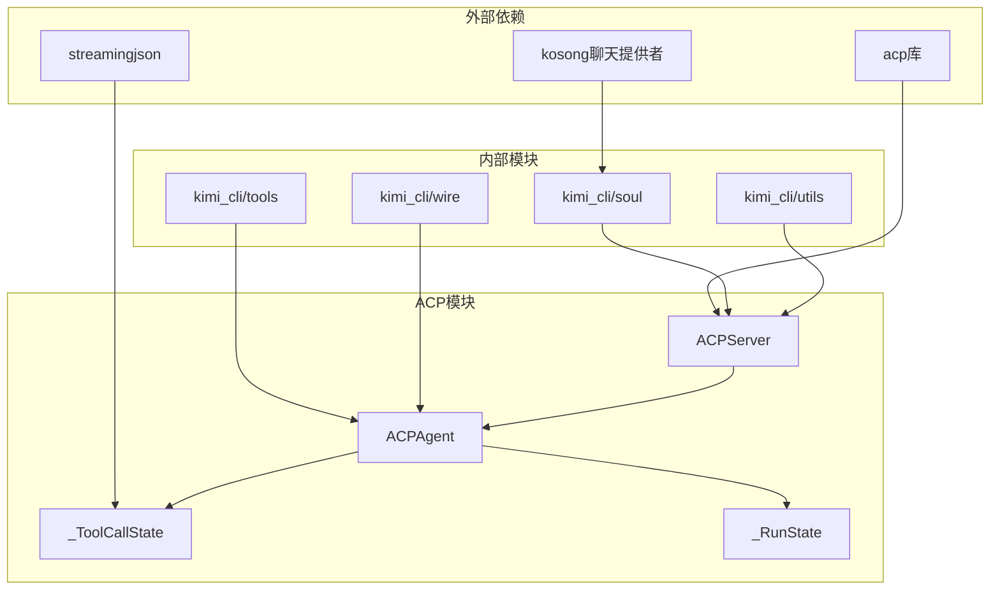

# ACP模式

<cite>
**本文档中引用的文件**
- [src/kimi_cli/ui/acp/__init__.py](file://src/kimi_cli/ui/acp/__init__.py)
- [src/kimi_cli/app.py](file://src/kimi_cli/app.py)
- [src/kimi_cli/cli.py](file://src/kimi_cli/cli.py)
- [src/kimi_cli/ui/wire/__init__.py](file://src/kimi_cli/ui/wire/__init__.py)
- [src/kimi_cli/ui/shell/__init__.py](file://src/kimi_cli/ui/shell/__init__.py)
- [src/kimi_cli/tools/bash/__init__.py](file://src/kimi_cli/tools/bash/__init__.py)
- [src/kimi_cli/tools/bash/bash.md](file://src/kimi_cli/tools/bash/bash.md)
- [src/kimi_cli/tools/bash/cmd.md](file://src/kimi_cli/tools/bash/cmd.md)
- [src/kimi_cli/tools/file/replace.py](file://src/kimi_cli/tools/file/replace.py)
- [src/kimi_cli/tools/file/replace.md](file://src/kimi_cli/tools/file/replace.md)
- [src/kimi_cli/tools/__init__.py](file://src/kimi_cli/tools/__init__.py)
- [src/kimi_cli/wire/CLAUDE.md](file://src/kimi_cli/wire/CLAUDE.md)
- [README.md](file://README.md)
</cite>

## 目录
1. [简介](#简介)
2. [项目结构](#项目结构)
3. [核心组件](#核心组件)
4. [架构概览](#架构概览)
5. [详细组件分析](#详细组件分析)
6. [依赖关系分析](#依赖关系分析)
7. [性能考虑](#性能考虑)
8. [故障排除指南](#故障排除指南)
9. [结论](#结论)

## 简介

ACP（Agent Client Protocol）模式是Kimí CLI的一个重要功能，它实现了Agent Client Protocol服务器，为支持ACP的编辑器（如Zed）提供AI代理服务。该模式通过标准输入输出流（stdio）建立与编辑器的通信连接，将编辑器中的上下文信息转化为AI代理的输入，并将代理的响应安全地传回编辑器。

ACP模式的核心特性包括：
- **WebSocket服务器集成**：通过`run_acp_server`方法启动基于stdio的ACP服务器
- **编辑器上下文传递**：将选中文本、文件路径等上下文信息传递给AI代理
- **安全的响应传输**：确保AI代理的响应能够安全地返回到编辑器
- **工作目录管理**：在`_app_env`环境中运行，确保工作目录正确
- **命令参数忽略**：忽略`--command`参数，持续运行直至手动终止

## 项目结构

ACP模式的实现分布在多个模块中，形成了清晰的分层架构：

```mermaid
graph TB
subgraph "命令行接口层"
CLI[kimi_cli/cli.py]
APP[kimi_cli/app.py]
end
subgraph "ACP服务器层"
ACPSERVER[kimi_cli/ui/acp/__init__.py]
ACPSERVER_CLASS[ACPServer类]
ACPAGENT[ACPAgent类]
end
subgraph "会话管理层"
SESSION[kimi_cli/session.py]
ENV[kimi_cli/app.py]
end
subgraph "工具层"
TOOLS[kimi_cli/tools/]
FILETOOLS[文件操作工具]
BASHTOOLS[Bash命令工具]
end
CLI --> APP
APP --> ACPSERVER
ACPSERVER --> ACPSERVER_CLASS
ACPSERVER_CLASS --> ACPAGENT
APP --> ENV
ACPAGENT --> TOOLS
TOOLS --> FILETOOLS
TOOLS --> BASHTOOLS
```

**图表来源**
- [src/kimi_cli/cli.py](file://src/kimi_cli/cli.py#L1-L200)
- [src/kimi_cli/app.py](file://src/kimi_cli/app.py#L203-L208)
- [src/kimi_cli/ui/acp/__init__.py](file://src/kimi_cli/ui/acp/__init__.py#L447-L472)

**章节来源**
- [src/kimi_cli/cli.py](file://src/kimi_cli/cli.py#L1-L358)
- [src/kimi_cli/app.py](file://src/kimi_cli/app.py#L1-L217)

## 核心组件

### ACPServer类

ACPServer是ACP模式的核心服务器类，负责管理与编辑器的连接和通信。

**图表来源**
- [src/kimi_cli/ui/acp/__init__.py](file://src/kimi_cli/ui/acp/__init__.py#L447-L472)
- [src/kimi_cli/ui/acp/__init__.py](file://src/kimi_cli/ui/acp/__init__.py#L74-L472)

### 命令行接口

ACP模式通过命令行参数`--acp`启用，与传统的交互式模式或打印模式互斥。

**章节来源**
- [src/kimi_cli/ui/acp/__init__.py](file://src/kimi_cli/ui/acp/__init__.py#L447-L472)
- [src/kimi_cli/app.py](file://src/kimi_cli/app.py#L203-L208)
- [src/kimi_cli/cli.py](file://src/kimi_cli/cli.py#L309-L312)

## 架构概览

ACP模式采用基于stdio的JSON-RPC通信架构，实现了编辑器与AI代理之间的无缝集成：

**图表来源**
- [src/kimi_cli/ui/acp/__init__.py](file://src/kimi_cli/ui/acp/__init__.py#L454-L471)
- [src/kimi_cli/ui/acp/__init__.py](file://src/kimi_cli/ui/acp/__init__.py#L83-L168)

## 详细组件分析

### ACP服务器启动流程

ACP服务器的启动过程展示了其简洁而高效的架构设计：

**图表来源**
- [src/kimi_cli/ui/acp/__init__.py](file://src/kimi_cli/ui/acp/__init__.py#L453-L471)

### 编辑器集成配置

ACP模式与Zed编辑器的集成通过简单的配置即可实现：

| 配置项 | 值 | 说明 |
|--------|-----|------|
| 命令 | `"kimi"` | Kimí CLI可执行文件路径 |
| 参数 | `["--acp"]` | 启用ACP模式 |
| 环境变量 | `{}` | 默认环境配置 |

**章节来源**
- [src/kimi_cli/ui/acp/__init__.py](file://src/kimi_cli/ui/acp/__init__.py#L454-L471)
- [README.md](file://README.md#L92-L106)

### 上下文处理机制

ACP代理能够智能地处理来自编辑器的各种上下文信息：

**图表来源**
- [src/kimi_cli/ui/acp/__init__.py](file://src/kimi_cli/ui/acp/__init__.py#L136-L168)

### 工具调用安全机制

ACP模式实现了完善的工具调用安全机制，确保编辑器操作的安全性：

**图表来源**
- [src/kimi_cli/ui/acp/__init__.py](file://src/kimi_cli/ui/acp/__init__.py#L327-L400)

**章节来源**
- [src/kimi_cli/ui/acp/__init__.py](file://src/kimi_cli/ui/acp/__init__.py#L136-L472)

### 工作目录管理

ACP模式通过`_app_env`上下文管理器确保工作目录的正确性：

**图表来源**
- [src/kimi_cli/app.py](file://src/kimi_cli/app.py#L124-L134)

**章节来源**
- [src/kimi_cli/app.py](file://src/kimi_cli/app.py#L124-L134)

### 命令参数处理策略

ACP模式具有独特的命令参数处理策略，与传统模式形成鲜明对比：

| 模式 | `--command`参数处理 | 运行行为 |
|------|-------------------|----------|
| ACP模式 | 忽略并记录警告 | 持续运行，直到手动终止 |
| 传统模式 | 执行单次命令后退出 | 执行完成后自动退出 |
| Print模式 | 执行单次命令后退出 | 执行完成后自动退出 |

**章节来源**
- [src/kimi_cli/cli.py](file://src/kimi_cli/cli.py#L310-L316)

## 依赖关系分析

ACP模式的依赖关系展现了其模块化的设计理念：

**图表来源**
- [src/kimi_cli/ui/acp/__init__.py](file://src/kimi_cli/ui/acp/__init__.py#L1-L23)

**章节来源**
- [src/kimi_cli/ui/acp/__init__.py](file://src/kimi_cli/ui/acp/__init__.py#L1-L23)

## 性能考虑

### 并发处理

ACP模式采用异步编程模型，能够高效处理多个并发连接：

- **非阻塞I/O**：使用`asyncio`实现非阻塞的网络通信
- **事件驱动**：基于事件循环的异步事件处理
- **内存管理**：及时清理工具调用状态，避免内存泄漏

### 连接管理

- **长连接支持**：支持长时间运行的连接，适合编辑器场景
- **优雅关闭**：实现完整的连接关闭流程
- **错误恢复**：具备基本的错误处理和恢复机制

### 安全性考虑

ACP模式实现了多层次的安全保护：

1. **权限控制**：所有工具调用都需要用户授权
2. **路径验证**：严格检查文件操作路径的安全性
3. **资源限制**：对命令执行设置超时限制
4. **上下文隔离**：每个会话都有独立的工作空间

## 故障排除指南

### 常见问题及解决方案

#### 1. 编辑器无法连接ACP服务器

**症状**：编辑器显示连接失败或超时

**可能原因**：
- Kimí CLI未正确启动ACP模式
- 端口被占用或权限不足
- 编辑器配置错误

**解决方案**：
- 确保使用`--acp`参数启动Kimí CLI
- 检查编辑器的ACP配置是否正确
- 查看Kimí CLI的日志输出

#### 2. 工具调用被频繁拒绝

**症状**：AI代理尝试执行文件操作时被拒绝

**可能原因**：
- 权限设置过于严格
- 文件路径不在允许范围内
- 安全策略限制

**解决方案**：
- 检查文件操作工具的安全配置
- 验证目标文件路径的有效性
- 调整安全策略设置

#### 3. 工作目录不正确

**症状**：文件操作在错误的目录中执行

**可能原因**：
- `_app_env`上下文管理器未正确使用
- 会话工作目录配置错误

**解决方案**：
- 确保在`run_acp_server`中使用`with self._app_env():`
- 检查会话配置中的工作目录设置

**章节来源**
- [src/kimi_cli/ui/acp/__init__.py](file://src/kimi_cli/ui/acp/__init__.py#L327-L400)
- [src/kimi_cli/app.py](file://src/kimi_cli/app.py#L124-L134)

## 结论

ACP模式代表了Kimí CLI在AI辅助开发领域的重大突破，它成功地将强大的AI能力与现代编辑器无缝集成。通过标准化的Agent Client Protocol，ACP模式不仅支持Zed编辑器，还为其他ACP兼容的编辑器提供了统一的接入方式。

### 主要优势

1. **无缝集成**：通过stdio流实现与编辑器的深度集成
2. **上下文感知**：智能处理编辑器上下文信息
3. **安全保障**：完善的权限控制和安全机制
4. **持续运行**：支持长时间的交互式开发会话
5. **扩展性强**：基于模块化设计，易于扩展新功能

### 应用价值

ACP模式显著提升了IDE内的AI辅助开发体验：

- **即时反馈**：编辑器中的任何修改都能立即获得AI建议
- **上下文保持**：长时间的开发会话中保持上下文连续性
- **安全可控**：用户可以精确控制AI代理的操作范围
- **高效协作**：支持复杂的代码生成和重构任务

### 发展前景

随着ACP协议的普及和更多编辑器的支持，ACP模式将在AI辅助软件开发领域发挥越来越重要的作用。未来的发展方向包括：

- 更丰富的编辑器集成支持
- 更智能的上下文理解能力
- 更灵活的权限管理机制
- 更强大的多语言支持

ACP模式的成功实现证明了标准化协议在AI工具生态建设中的重要价值，为构建更加智能、高效的开发环境奠定了坚实基础。