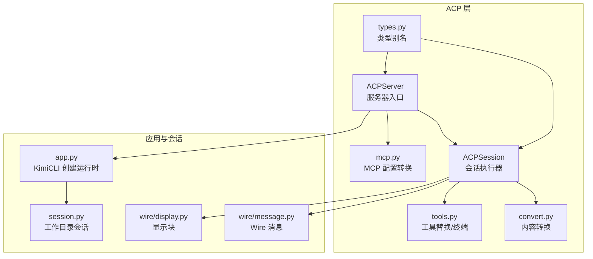
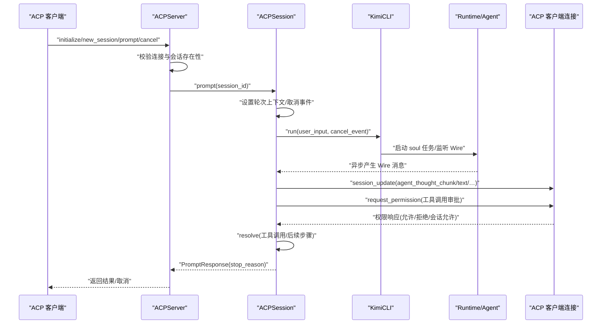
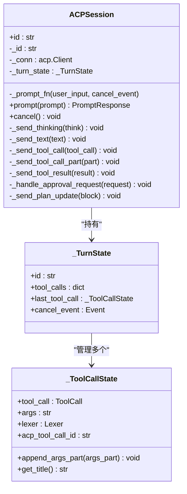
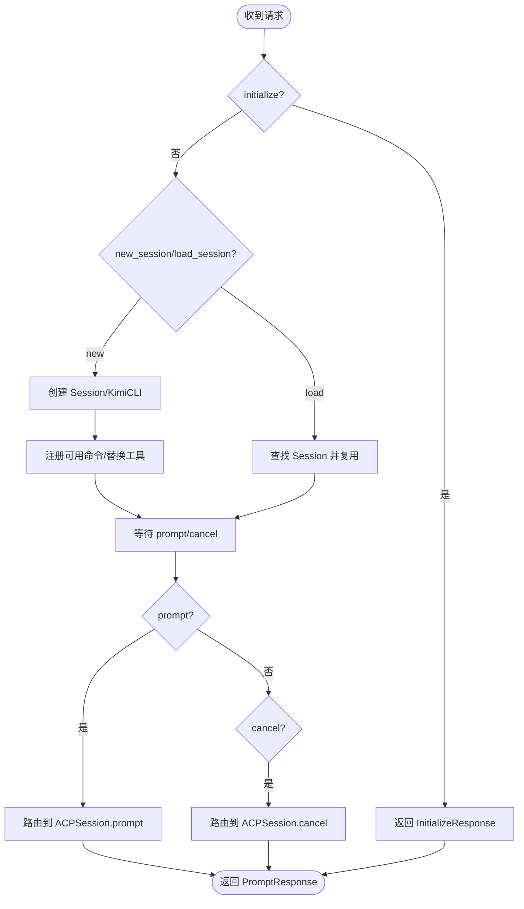
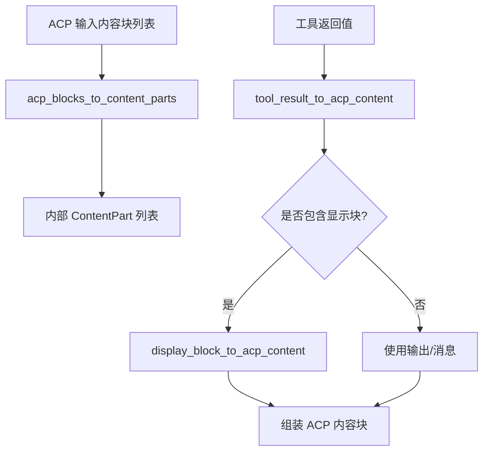
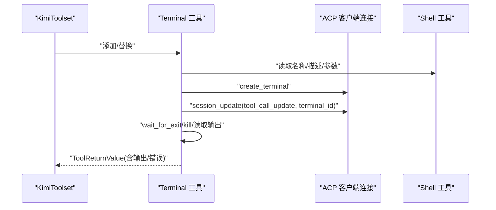
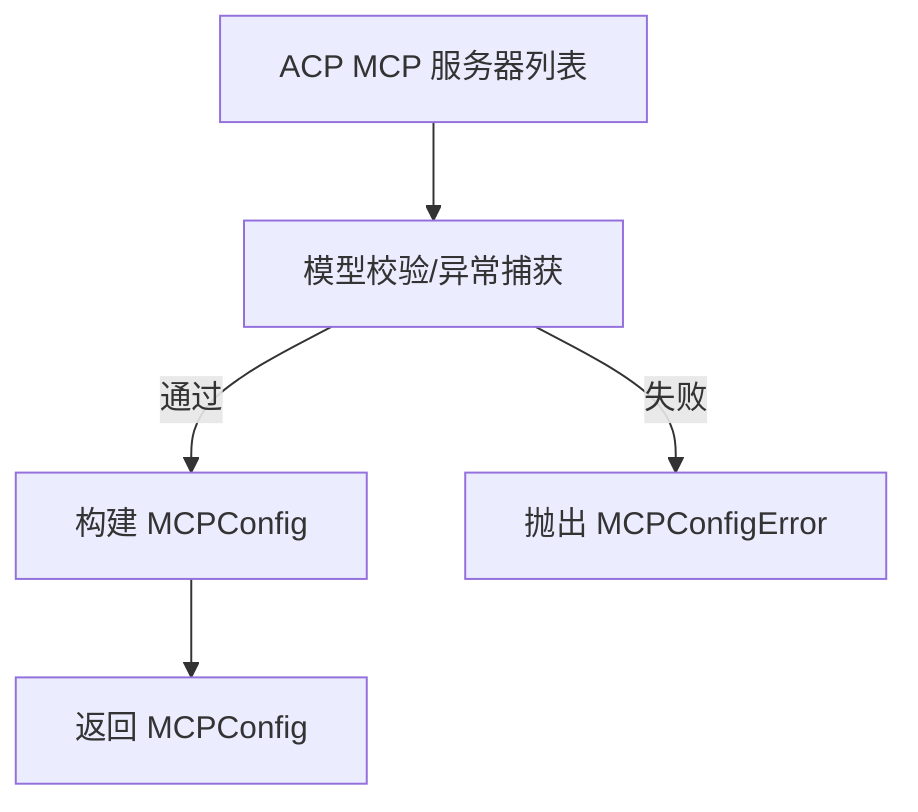
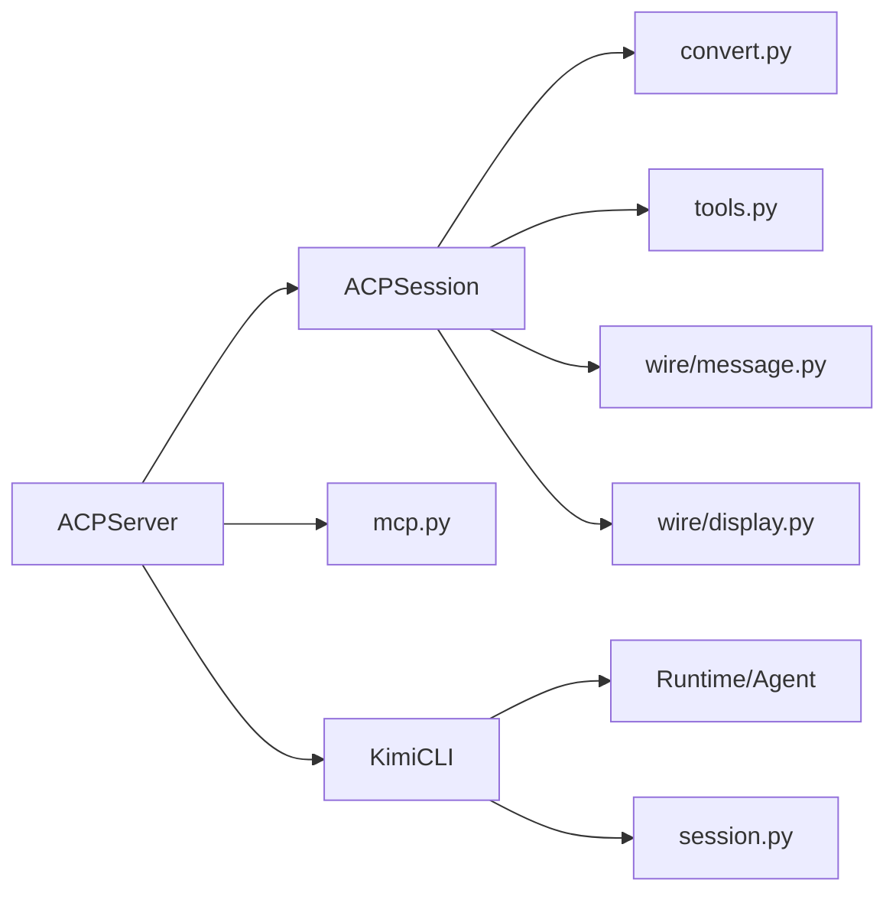

# ACP 会话管理

<cite>
**本文引用的文件**
- [src/kimi_cli/acp/session.py](file://src/kimi_cli/acp/session.py)
- [src/kimi_cli/acp/server.py](file://src/kimi_cli/acp/server.py)
- [src/kimi_cli/acp/types.py](file://src/kimi_cli/acp/types.py)
- [src/kimi_cli/acp/convert.py](file://src/kimi_cli/acp/convert.py)
- [src/kimi_cli/acp/mcp.py](file://src/kimi_cli/acp/mcp.py)
- [src/kimi_cli/acp/tools.py](file://src/kimi_cli/acp/tools.py)
- [src/kimi_cli/app.py](file://src/kimi_cli/app.py)
- [src/kimi_cli/session.py](file://src/kimi_cli/session.py)
- [src/kimi_cli/soul/toolset.py](file://src/kimi_cli/soul/toolset.py)
- [src/kimi_cli/wire/message.py](file://src/kimi_cli/wire/message.py)
- [src/kimi_cli/wire/display.py](file://src/kimi_cli/wire/display.py)
- [tests/test_acp_convert.py](file://tests/test_acp_convert.py)
- [tests/test_session.py](file://tests/test_session.py)
</cite>

## 目录
1. [简介](#简介)
2. [项目结构](#项目结构)
3. [核心组件](#核心组件)
4. [架构总览](#架构总览)
5. [详细组件分析](#详细组件分析)
6. [依赖关系分析](#依赖关系分析)
7. [性能考量](#性能考量)
8. [故障排查指南](#故障排查指南)
9. [结论](#结论)
10. [附录](#附录)

## 简介
本文件系统性梳理 Kimi CLI 中的 ACP（Agent Communication Protocol）会话管理能力，围绕“会话生命周期、消息流、工具调用与权限审批、MCP 集成、以及与本地会话持久化”的设计进行深入解析，并提供可视化图示帮助读者快速理解各模块之间的交互关系与数据流向。

## 项目结构
ACP 会话管理位于 src/kimi_cli/acp 目录下，配合应用入口、会话持久化、工具集与 MCP 配置等模块协同工作：
- 会话层：ACPSession 负责将外部 ACP 请求映射为内部运行流程，并通过 ACP 客户端推送增量更新。
- 服务器层：ACPServer 统一处理初始化、新建/加载会话、列出会话、提示词请求与取消等。
- 类型与转换：定义 ACP 内容块类型、将 ACP 块转换为内部内容部件、工具结果转换为 ACP 内容。
- 工具替换：在支持终端能力时，将 Shell 工具替换为 ACP Terminal 工具以实现流式输出。
- MCP 配置：将 ACP 客户端提供的 MCP 服务器配置转换为运行时可用的 MCPConfig。
- 应用与会话：KimiCLI 创建运行时环境与会话上下文；Session 提供工作目录下的会话创建、查找与列表。

图表来源
- [src/kimi_cli/acp/server.py](file://src/kimi_cli/acp/server.py#L23-L198)
- [src/kimi_cli/acp/session.py](file://src/kimi_cli/acp/session.py#L97-L174)
- [src/kimi_cli/acp/convert.py](file://src/kimi_cli/acp/convert.py#L1-L111)
- [src/kimi_cli/acp/types.py](file://src/kimi_cli/acp/types.py#L1-L14)
- [src/kimi_cli/acp/mcp.py](file://src/kimi_cli/acp/mcp.py#L1-L47)
- [src/kimi_cli/acp/tools.py](file://src/kimi_cli/acp/tools.py#L1-L157)
- [src/kimi_cli/app.py](file://src/kimi_cli/app.py#L48-L130)
- [src/kimi_cli/session.py](file://src/kimi_cli/session.py#L20-L148)
- [src/kimi_cli/wire/message.py](file://src/kimi_cli/wire/message.py)
- [src/kimi_cli/wire/display.py](file://src/kimi_cli/wire/display.py)

章节来源
- [src/kimi_cli/acp/server.py](file://src/kimi_cli/acp/server.py#L23-L198)
- [src/kimi_cli/acp/session.py](file://src/kimi_cli/acp/session.py#L97-L174)
- [src/kimi_cli/acp/types.py](file://src/kimi_cli/acp/types.py#L1-L14)
- [src/kimi_cli/acp/convert.py](file://src/kimi_cli/acp/convert.py#L1-L111)
- [src/kimi_cli/acp/mcp.py](file://src/kimi_cli/acp/mcp.py#L1-L47)
- [src/kimi_cli/acp/tools.py](file://src/kimi_cli/acp/tools.py#L1-L157)
- [src/kimi_cli/app.py](file://src/kimi_cli/app.py#L48-L130)
- [src/kimi_cli/session.py](file://src/kimi_cli/session.py#L20-L148)

## 核心组件
- ACPServer：负责 ACP 初始化、新建/加载会话、列出会话、接收 prompt/cancel 请求，并将请求委派给 ACPSession。
- ACPSession：封装一次“提示词请求”为“轮次”，在轮次内跟踪工具调用状态、发送思考、文本、工具调用、工具结果、计划更新等，并处理权限审批。
- 转换模块：将 ACP 内容块转换为内部内容部件，将工具返回转换为 ACP 内容块，将显示块转换为 ACP 文件差异或终端内容。
- 工具替换：在客户端具备终端能力时，将 Shell 工具替换为 ACP Terminal 工具，实现实时终端输出流。
- MCP 配置：将 ACP 客户端传入的 MCP 服务器配置转换为运行时可消费的 MCPConfig。
- KimiCLI：创建运行时、加载代理与上下文、运行无 UI 的消息流，作为 ACPSession 的 prompt 回调。
- Session：工作目录下的会话抽象，提供创建、查找、列表、标题推导与删除等能力。

章节来源
- [src/kimi_cli/acp/server.py](file://src/kimi_cli/acp/server.py#L23-L198)
- [src/kimi_cli/acp/session.py](file://src/kimi_cli/acp/session.py#L97-L174)
- [src/kimi_cli/acp/convert.py](file://src/kimi_cli/acp/convert.py#L1-L111)
- [src/kimi_cli/acp/tools.py](file://src/kimi_cli/acp/tools.py#L1-L157)
- [src/kimi_cli/acp/mcp.py](file://src/kimi_cli/acp/mcp.py#L1-L47)
- [src/kimi_cli/app.py](file://src/kimi_cli/app.py#L48-L130)
- [src/kimi_cli/session.py](file://src/kimi_cli/session.py#L20-L148)

## 架构总览
ACP 会话管理采用“服务器-会话-运行时”的分层架构：
- 服务器层（ACPServer）接收来自 ACP 客户端的请求，维护会话字典，将请求路由到对应 ACPSession。
- 会话层（ACPSession）将 ACP 请求转换为内部消息流，通过 KimiCLI 的 run 方法产生 Wire 消息，再按 ACP 协议推送增量更新。
- 运行时（KimiCLI/Runtime）负责加载代理、上下文与工具集，维持会话状态与取消事件。
- MCP 与工具替换：根据客户端能力与配置，动态替换工具（如 Shell→Terminal），并注入会话级 MCP 会话头。

图表来源
- [src/kimi_cli/acp/server.py](file://src/kimi_cli/acp/server.py#L175-L191)
- [src/kimi_cli/acp/session.py](file://src/kimi_cli/acp/session.py#L114-L173)
- [src/kimi_cli/app.py](file://src/kimi_cli/app.py#L163-L211)

## 详细组件分析

### ACPSession：轮次与工具调用状态管理
- 轮次上下文：每次 prompt 开始时创建新的轮次 ID，使用上下文变量隔离当前轮次，确保工具调用 ID 唯一性。
- 工具调用状态：_ToolCallState 记录单个工具调用的参数流式拼接、标题提取与唯一 ID（前缀轮次 ID）。
- 消息分发：根据 Wire 消息类型，分别发送思考、文本、工具调用开始、工具调用进度、工具结果、计划更新等。
- 权限审批：当收到审批请求时，向客户端发起权限选项，依据响应决定批准、会话批准或拒绝。
- 取消机制：通过 asyncio.Event 在运行时中断 soul 任务，返回取消停止原因。

图表来源
- [src/kimi_cli/acp/session.py](file://src/kimi_cli/acp/session.py#L97-L174)
- [src/kimi_cli/acp/session.py](file://src/kimi_cli/acp/session.py#L182-L306)
- [src/kimi_cli/acp/session.py](file://src/kimi_cli/acp/session.py#L300-L386)

章节来源
- [src/kimi_cli/acp/session.py](file://src/kimi_cli/acp/session.py#L97-L174)
- [src/kimi_cli/acp/session.py](file://src/kimi_cli/acp/session.py#L182-L306)
- [src/kimi_cli/acp/session.py](file://src/kimi_cli/acp/session.py#L300-L386)

### ACPServer：会话生命周期与路由
- 初始化：返回代理能力声明，包含会话能力、提示词能力、MCP 能力等。
- 新建会话：创建 Session，构建 KimiCLI 实例，注册可用命令，必要时替换工具（如 Shell→Terminal）。
- 加载会话：根据工作目录与会话 ID 查找已有 Session 并复用。
- 列出会话：基于工作目录枚举会话并返回会话信息。
- 提示词与取消：转发到对应 ACPSession，返回 PromptResponse 或触发取消。

图表来源
- [src/kimi_cli/acp/server.py](file://src/kimi_cli/acp/server.py#L33-L102)
- [src/kimi_cli/acp/server.py](file://src/kimi_cli/acp/server.py#L104-L160)
- [src/kimi_cli/acp/server.py](file://src/kimi_cli/acp/server.py#L175-L191)

章节来源
- [src/kimi_cli/acp/server.py](file://src/kimi_cli/acp/server.py#L33-L102)
- [src/kimi_cli/acp/server.py](file://src/kimi_cli/acp/server.py#L104-L160)
- [src/kimi_cli/acp/server.py](file://src/kimi_cli/acp/server.py#L175-L191)

### 内容转换与显示块
- ACP 内容块到内部内容部件：将 ACP 文本/图片等块转换为内部 TextPart/ImageURLPart。
- 工具结果到 ACP 内容：将工具返回的显示块与输出转换为 ACP 的内容块，支持隐藏输出、文件差异、终端输出等。
- 显示块到 ACP：将 DiffDisplayBlock 转换为 ACP 文件差异内容块。

图表来源
- [src/kimi_cli/acp/convert.py](file://src/kimi_cli/acp/convert.py#L16-L33)
- [src/kimi_cli/acp/convert.py](file://src/kimi_cli/acp/convert.py#L35-L47)
- [src/kimi_cli/acp/convert.py](file://src/kimi_cli/acp/convert.py#L49-L111)

章节来源
- [src/kimi_cli/acp/convert.py](file://src/kimi_cli/acp/convert.py#L16-L33)
- [src/kimi_cli/acp/convert.py](file://src/kimi_cli/acp/convert.py#L35-L47)
- [src/kimi_cli/acp/convert.py](file://src/kimi_cli/acp/convert.py#L49-L111)

### 工具替换与终端集成
- 替换策略：当客户端支持终端且存在 Shell 工具时，用 ACP Terminal 工具替换，以流式输出替代传统回显。
- 终端工具：创建终端句柄、发送 ToolCallProgress 含终端内容、等待退出、读取输出、处理超时/信号/退出码并构造错误/成功消息。
- 输出隐藏：通过特殊显示块指示 ACP 客户端不再额外展示工具输出，避免重复。

图表来源
- [src/kimi_cli/acp/tools.py](file://src/kimi_cli/acp/tools.py#L17-L38)
- [src/kimi_cli/acp/tools.py](file://src/kimi_cli/acp/tools.py#L61-L157)

章节来源
- [src/kimi_cli/acp/tools.py](file://src/kimi_cli/acp/tools.py#L17-L38)
- [src/kimi_cli/acp/tools.py](file://src/kimi_cli/acp/tools.py#L61-L157)

### MCP 配置转换
- 将 ACP 客户端提供的 MCP 服务器列表转换为 MCPConfig，支持 HTTP/SSE/STDIO 三种传输方式与头部注入。
- 异常处理：对无效配置抛出 MCPConfigError。

图表来源
- [src/kimi_cli/acp/mcp.py](file://src/kimi_cli/acp/mcp.py#L13-L23)
- [src/kimi_cli/acp/mcp.py](file://src/kimi_cli/acp/mcp.py#L25-L47)

章节来源
- [src/kimi_cli/acp/mcp.py](file://src/kimi_cli/acp/mcp.py#L13-L23)
- [src/kimi_cli/acp/mcp.py](file://src/kimi_cli/acp/mcp.py#L25-L47)

### 会话持久化与标题推导
- Session 提供创建、查找、列表、删除、刷新标题等功能；标题来源于首次 TurnBegin 的用户输入文本。
- 支持空会话过滤与按更新时间排序。

章节来源
- [src/kimi_cli/session.py](file://src/kimi_cli/session.py#L20-L148)
- [src/kimi_cli/session.py](file://src/kimi_cli/session.py#L149-L238)
- [tests/test_session.py](file://tests/test_session.py#L1-L122)

## 依赖关系分析
- ACPServer 依赖 ACPSession、KimiCLI、Session、MCP 配置转换与工具替换。
- ACPSession 依赖转换模块、工具集、Wire 消息与显示块。
- KimiCLI 依赖配置、运行时、代理与上下文，作为 ACPSession 的回调函数。
- 工具替换依赖客户端能力与运行时审批。

图表来源
- [src/kimi_cli/acp/server.py](file://src/kimi_cli/acp/server.py#L23-L198)
- [src/kimi_cli/acp/session.py](file://src/kimi_cli/acp/session.py#L97-L174)
- [src/kimi_cli/acp/convert.py](file://src/kimi_cli/acp/convert.py#L1-L111)
- [src/kimi_cli/acp/tools.py](file://src/kimi_cli/acp/tools.py#L1-L157)
- [src/kimi_cli/app.py](file://src/kimi_cli/app.py#L48-L130)
- [src/kimi_cli/session.py](file://src/kimi_cli/session.py#L20-L148)

章节来源
- [src/kimi_cli/acp/server.py](file://src/kimi_cli/acp/server.py#L23-L198)
- [src/kimi_cli/acp/session.py](file://src/kimi_cli/acp/session.py#L97-L174)
- [src/kimi_cli/app.py](file://src/kimi_cli/app.py#L48-L130)
- [src/kimi_cli/session.py](file://src/kimi_cli/session.py#L20-L148)

## 性能考量
- 流式更新：工具调用参数与结果通过增量 session_update 推送，减少一次性大包传输。
- 取消事件：通过 asyncio.Event 快速中断长耗时任务，避免资源浪费。
- 终端输出限制：终端工具在创建时设置输出字节上限，防止过大数据导致客户端卡顿。
- MCP 连接：OAuth 未授权时跳过连接，避免无效重试；批量连接使用 gather 并发提升效率。

章节来源
- [src/kimi_cli/acp/session.py](file://src/kimi_cli/acp/session.py#L175-L173)
- [src/kimi_cli/acp/tools.py](file://src/kimi_cli/acp/tools.py#L87-L124)
- [src/kimi_cli/soul/toolset.py](file://src/kimi_cli/soul/toolset.py#L245-L267)

## 故障排查指南
- LLM 相关错误：当 LLM 未设置或不被支持时，会抛出内部错误；检查 KimiCLI 创建时的模型与提供商配置。
- ChatProviderError：LLM 提供方返回错误时统一转为内部错误；查看日志定位具体错误。
- 最大步数/取消：达到最大步数返回 max_turn_requests，用户取消返回 cancelled；确认取消事件是否正确传递。
- 权限审批失败：请求权限时异常将自动拒绝；检查客户端连接与网络。
- MCP 配置无效：模型校验失败抛出 MCPConfigError；核对 ACP 客户端传入的服务器配置。
- 会话不存在：new_session/load_session/prompt/cancel 会校验会话存在性；确认 session_id 与工作目录一致。

章节来源
- [src/kimi_cli/acp/session.py](file://src/kimi_cli/acp/session.py#L152-L170)
- [src/kimi_cli/acp/server.py](file://src/kimi_cli/acp/server.py#L175-L191)
- [src/kimi_cli/acp/mcp.py](file://src/kimi_cli/acp/mcp.py#L13-L23)
- [src/kimi_cli/acp/tools.py](file://src/kimi_cli/acp/tools.py#L381-L398)

## 结论
ACP 会话管理通过清晰的分层与严格的上下文隔离，实现了从 ACP 请求到内部消息流的顺畅转换，并在工具调用、权限审批、MCP 集成与会话持久化方面提供了稳健的能力。其流式更新与取消机制保证了良好的用户体验与性能表现。

## 附录
- ACP 内容块类型别名：用于统一 ACP 文本、图像、音频、资源等块类型。
- 工具集与 MCP：工具集负责工具发现与调用，MCP 工具通过 fastmcp 客户端接入，支持超时与错误处理。
- 测试参考：工具结果到 ACP 内容的转换测试覆盖了 DiffDisplayBlock 的场景。

章节来源
- [src/kimi_cli/acp/types.py](file://src/kimi_cli/acp/types.py#L1-L14)
- [src/kimi_cli/soul/toolset.py](file://src/kimi_cli/soul/toolset.py#L321-L398)
- [tests/test_acp_convert.py](file://tests/test_acp_convert.py#L1-L25)