# Print模式

<cite>
**本文档中引用的文件**
- [cli.py](file://src/kimi_cli/cli.py)
- [app.py](file://src/kimi_cli/app.py)
- [__init__.py](file://src/kimi_cli/ui/print/__init__.py)
- [visualize.py](file://src/kimi_cli/ui/print/visualize.py)
- [approval.py](file://src/kimi_cli/soul/approval.py)
- [runtime.py](file://src/kimi_cli/soul/runtime.py)
- [shell/__init__.py](file://src/kimi_cli/ui/shell/__init__.py)
- [README.md](file://README.md)
</cite>

## 目录
1. [简介](#简介)
2. [项目结构概览](#项目结构概览)
3. [核心组件分析](#核心组件分析)
4. [架构设计](#架构设计)
5. [详细组件分析](#详细组件分析)
6. [与Shell模式的对比](#与shell模式的对比)
7. [CI/CD集成与自动化](#cicd集成与自动化)
8. [JSON格式处理](#json格式处理)
9. [错误处理机制](#错误处理机制)
10. [性能考虑](#性能考虑)
11. [故障排除指南](#故障排除指南)
12. [总结](#总结)

## 简介

Print模式是Kimi CLI的一个非交互式运行模式，专为自动化场景和脚本友好型操作而设计。该模式通过`--print`参数激活，隐式启用`yolo`（自动批准所有操作）行为，使其成为CI/CD流水线、shell管道操作和程序化调用的理想选择。

Print模式的核心特性包括：
- **非交互式设计**：无需用户输入，自动处理所有操作
- **隐式Yolo行为**：自动批准所有工具调用和操作
- **流式输入处理**：支持从stdin读取JSON格式的命令流
- **结构化输出**：提供文本和JSON两种输出格式
- **快速执行**：直接输出结果后立即退出

## 项目结构概览

Kimi CLI采用模块化架构，Print模式相关组件分布在以下关键位置：

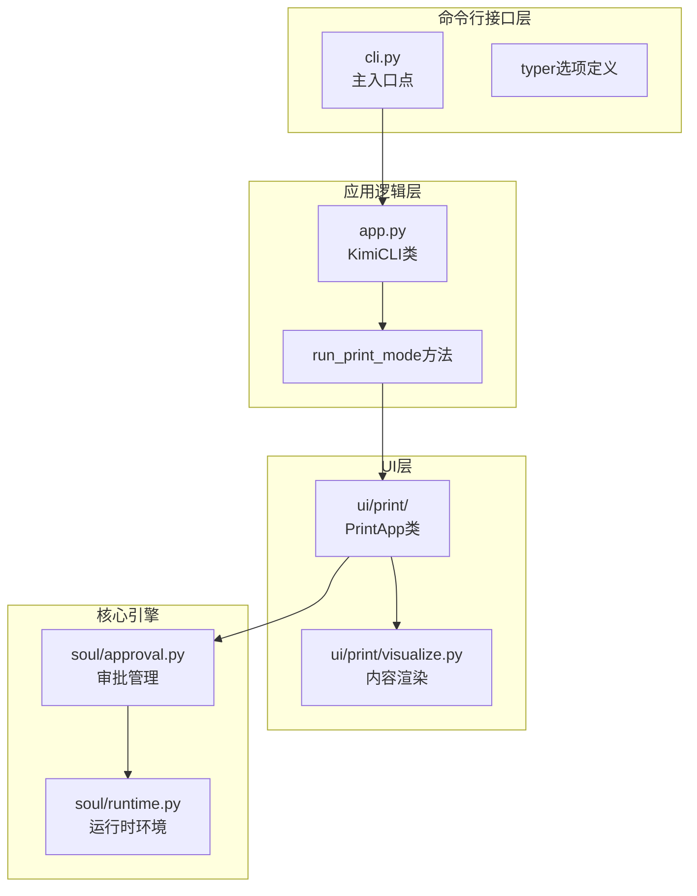

**图表来源**
- [cli.py](file://src/kimi_cli/cli.py#L114-L121)
- [app.py](file://src/kimi_cli/app.py#L186-L202)
- [__init__.py](file://src/kimi_cli/ui/print/__init__.py#L21-L127)

**章节来源**
- [cli.py](file://src/kimi_cli/cli.py#L114-L121)
- [app.py](file://src/kimi_cli/app.py#L186-L202)

## 核心组件分析

### 主要组件关系图

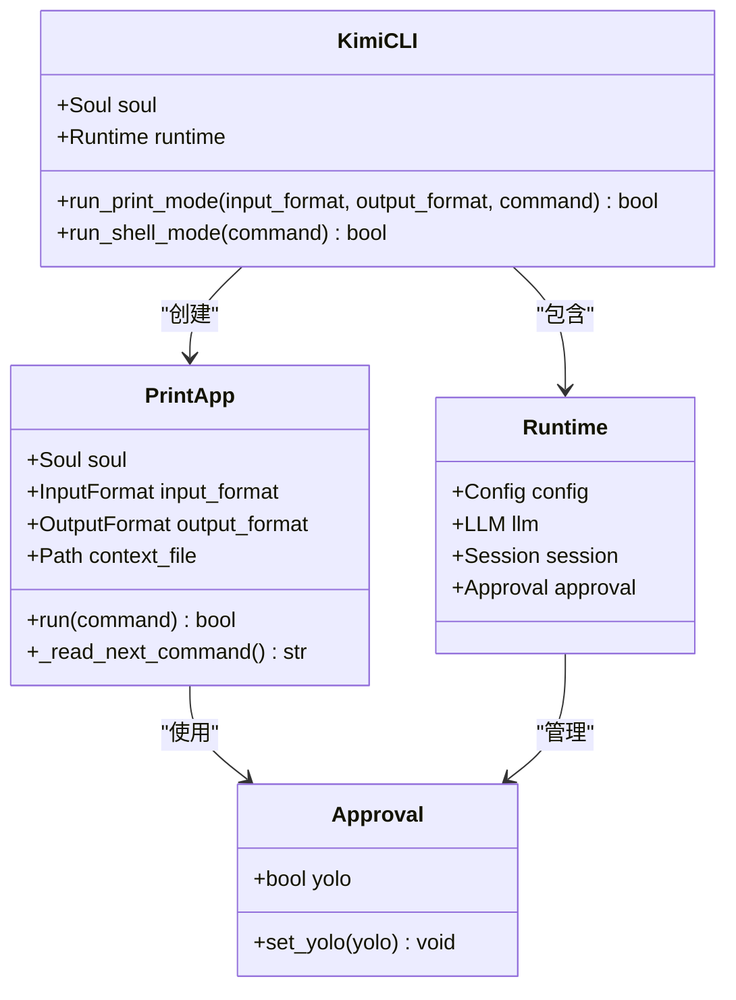

**图表来源**
- [app.py](file://src/kimi_cli/app.py#L25-L217)
- [__init__.py](file://src/kimi_cli/ui/print/__init__.py#L21-L127)
- [approval.py](file://src/kimi_cli/soul/approval.py#L10-L17)

### 参数配置系统

Print模式通过多个参数控制其行为：

| 参数 | 类型 | 默认值 | 描述 |
|------|------|--------|------|
| `--print` | bool | false | 启用Print模式，隐式启用`--yolo` |
| `--input-format` | InputFormat | text | 输入格式：text或stream-json |
| `--output-format` | OutputFormat | text | 输出格式：text或stream-json |
| `--command` | str | null | 直接指定命令，不从stdin读取 |
| `--yolo` | bool | false | 自动批准所有操作 |

**章节来源**
- [cli.py](file://src/kimi_cli/cli.py#L114-L154)

## 架构设计

### Print模式执行流程

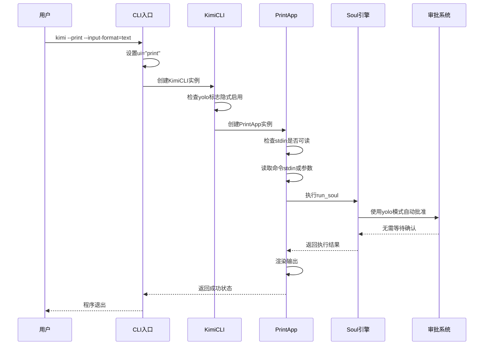

**图表来源**
- [cli.py](file://src/kimi_cli/cli.py#L292-L308)
- [app.py](file://src/kimi_cli/app.py#L186-L202)
- [__init__.py](file://src/kimi_cli/ui/print/__init__.py#L44-L101)

### 输入处理机制

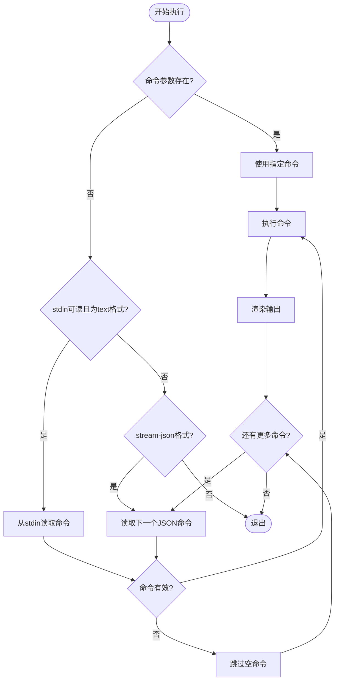

**图表来源**
- [__init__.py](file://src/kimi_cli/ui/print/__init__.py#L53-L82)

**章节来源**
- [__init__.py](file://src/kimi_cli/ui/print/__init__.py#L44-L101)

## 详细组件分析

### PrintApp类实现

PrintApp是Print模式的核心实现类，负责处理非交互式命令执行和输出渲染。

#### 关键特性

1. **自动Yolo行为**：构造函数中自动启用`yolo`模式
2. **多格式输入支持**：支持文本格式和流式JSON格式
3. **信号处理**：正确处理中断信号以确保优雅退出
4. **异常安全**：完善的错误处理和资源清理

#### 输入格式处理

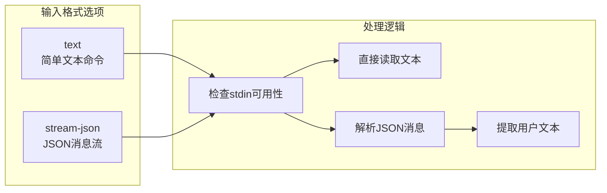

**图表来源**
- [__init__.py](file://src/kimi_cli/ui/print/__init__.py#L53-L127)

#### 输出渲染系统

Print模式支持两种输出格式，通过Visualize模块实现：

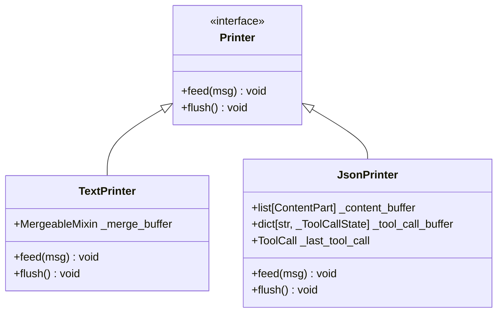

**图表来源**
- [visualize.py](file://src/kimi_cli/ui/print/visualize.py#L15-L130)

**章节来源**
- [__init__.py](file://src/kimi_cli/ui/print/__init__.py#L21-L127)
- [visualize.py](file://src/kimi_cli/ui/print/visualize.py#L15-L130)

### Yolo行为实现

Yolo模式通过Approval系统实现自动批准所有操作：

#### Approval系统架构

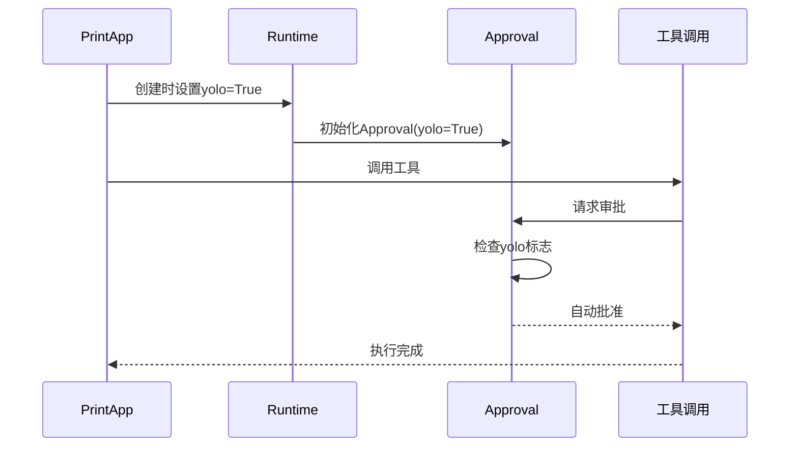

**图表来源**
- [approval.py](file://src/kimi_cli/soul/approval.py#L10-L17)
- [runtime.py](file://src/kimi_cli/soul/runtime.py#L76-L101)

**章节来源**
- [approval.py](file://src/kimi_cli/soul/approval.py#L10-L17)
- [runtime.py](file://src/kimi_cli/soul/runtime.py#L76-L101)

## 与Shell模式的对比

### 功能特性对比表

| 特性 | Shell模式 | Print模式 |
|------|-----------|-----------|
| 交互性 | 完全交互式 | 非交互式 |
| 欢迎界面 | 显示启动信息 | 无欢迎界面 |
| 会话持久化 | 支持历史记录 | 无状态执行 |
| 模式切换 | 支持Agent/Shell切换 | 固定非交互模式 |
| 自动补全 | 支持文件和命令补全 | 无补全功能 |
| 键盘快捷键 | 支持多种快捷键 | 无键盘交互 |
| 视觉反馈 | 丰富的终端渲染 | 简洁文本输出 |
| 错误处理 | 详细错误信息 | 基础错误输出 |

### 架构差异

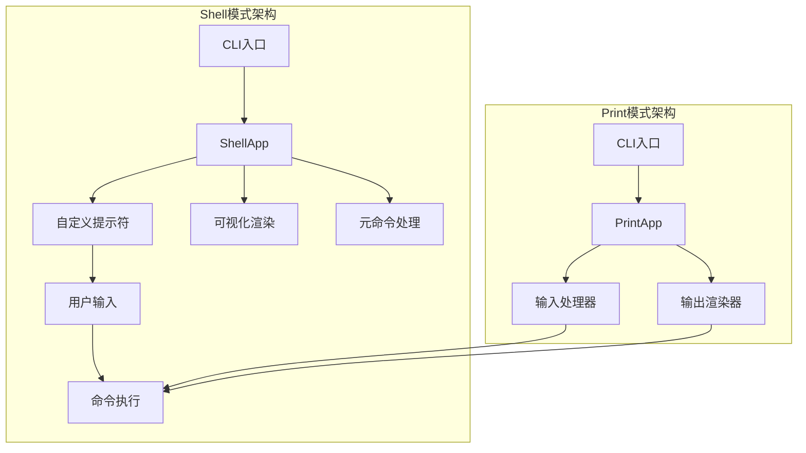

**图表来源**
- [shell/__init__.py](file://src/kimi_cli/ui/shell/__init__.py#L29-L200)
- [__init__.py](file://src/kimi_cli/ui/print/__init__.py#L21-L127)

### 使用场景对比

#### Shell模式适用场景
- 开发者日常交互式工作
- 复杂的多步骤任务执行
- 需要实时反馈和调试的场景
- 文件系统探索和编辑

#### Print模式适用场景
- CI/CD流水线集成
- 批量脚本处理
- 系统监控和报告生成
- API调用和数据处理
- 自动化测试执行

**章节来源**
- [shell/__init__.py](file://src/kimi_cli/ui/shell/__init__.py#L29-L200)
- [__init__.py](file://src/kimi_cli/ui/print/__init__.py#L21-L127)

## CI/CD集成与自动化

### Shell管道操作示例

Print模式特别适合在shell管道中使用，提供无缝的自动化能力：

#### 基本管道操作

```bash
# 从文件读取命令列表
cat commands.txt | kimi --print --input-format=text --output-format=text

# JSON格式的命令流
echo '{"role": "user", "content": "列出当前目录"}' | kimi --print --input-format=stream-json

# 组合多个命令
echo -e "创建文件\n删除临时文件" | kimi --print --input-format=text
```

#### CI/CD集成模式

```bash
#!/bin/bash
# CI/CD脚本示例

# 配置环境
export KIMI_API_KEY="your-api-key"
export KIMI_MODEL_NAME="moonshot-v1-8k"

# 执行自动化任务
kimi --print --command="分析项目依赖并生成报告" | tee report.txt

# 批量处理文件
find . -name "*.py" | xargs -I {} echo "分析文件: {}" | kimi --print --input-format=text

# JSON格式的批量处理
{
  "commands": [
    {"role": "user", "content": "检查文件权限"},
    {"role": "user", "content": "验证语法"}
  ]
} | jq -c '.commands[]' | kimi --print --input-format=stream-json
```

### 自动化最佳实践

#### 错误处理策略

```bash
#!/bin/bash
set -e  # 立即退出失败的命令

# 检查Kimi CLI可用性
if ! command -v kimi &> /dev/null; then
    echo "Kimi CLI未安装"
    exit 1
fi

# 设置超时和重试机制
timeout 30s kimi --print --command="$COMMAND" || {
    echo "命令执行超时"
    exit 1
}

# 结果验证
RESULT=$(kimi --print --command="$VERIFY_COMMAND" | grep -c "success")
if [ "$RESULT" -eq 0 ]; then
    echo "验证失败"
    exit 1
fi
```

#### 性能优化建议

1. **批量处理**：尽可能将多个小命令合并为单个执行
2. **缓存利用**：避免重复的相同查询
3. **资源管理**：合理设置超时时间防止长时间运行
4. **并发控制**：在支持的情况下并行执行独立任务

**章节来源**
- [cli.py](file://src/kimi_cli/cli.py#L142-L145)
- [__init__.py](file://src/kimi_cli/ui/print/__init__.py#L53-L82)

## JSON格式处理

### Stream-JSON输入格式

Print模式支持流式JSON格式输入，允许发送复杂的消息结构：

#### JSON消息格式

```json
{
  "role": "user",
  "content": "分析这个Python文件的复杂度",
  "timestamp": "2024-01-01T00:00:00Z",
  "metadata": {
    "file_path": "src/main.py",
    "priority": "high"
  }
}
```

#### 输入处理流程

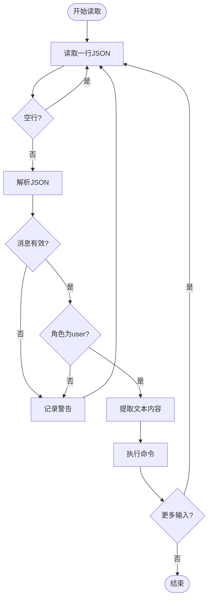

**图表来源**
- [__init__.py](file://src/kimi_cli/ui/print/__init__.py#L102-L127)

### JSON输出格式

当使用`--output-format=stream-json`时，Print模式会输出结构化的JSON消息：

#### 输出消息类型

1. **ContentPart**：文本内容片段
2. **ToolCall**：工具调用请求
3. **ToolResult**：工具执行结果
4. **StepBegin/StepInterrupted**：步骤状态信息

#### JSON输出示例

```json
{
  "role": "assistant",
  "content": "正在分析文件复杂度...",
  "timestamp": "2024-01-01T00:00:00Z"
}

{
  "role": "assistant",
  "content": "找到以下问题：",
  "tool_calls": [
    {
      "id": "call_123",
      "type": "function",
      "function": {
        "name": "analyze_complexity",
        "arguments": "{\"file\": \"main.py\"}"
      }
    }
  ],
  "timestamp": "2024-01-01T00:00:00Z"
}

{
  "role": "tool",
  "content": "文件复杂度分析结果：总复杂度为15，主要问题在函数A和B",
  "tool_call_id": "call_123",
  "timestamp": "2024-01-01T00:00:00Z"
}
```

**章节来源**
- [__init__.py](file://src/kimi_cli/ui/print/__init__.py#L102-L127)
- [visualize.py](file://src/kimi_cli/ui/print/visualize.py#L44-L107)

## 错误处理机制

### 异常类型与处理

Print模式实现了全面的错误处理机制，确保在各种异常情况下都能优雅地退出：

#### 主要异常类型

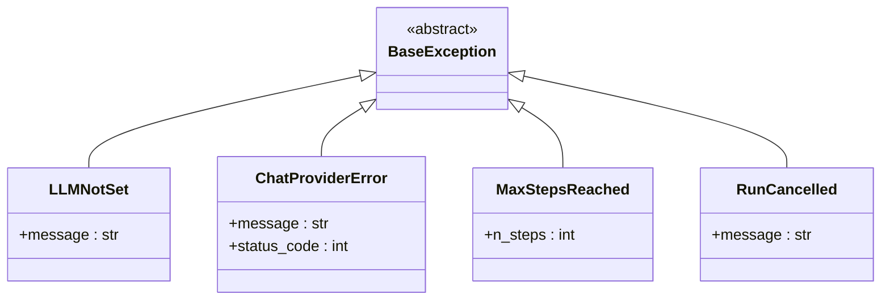

**图表来源**
- [__init__.py](file://src/kimi_cli/ui/print/__init__.py#L83-L98)

#### 错误处理流程

```mermaid
flowchart TD
Start([开始执行]) --> TryBlock[Try块执行]
TryBlock --> CheckException{"发生异常?"}
CheckException --> |否| Success[执行成功]
CheckException --> |是| TypeSwitch{异常类型}
TypeSwitch --> |LLMNotSet| LLMError[输出"LLM not set"]
TypeSwitch --> |ChatProviderError| ProviderError[输出提供商错误]
TypeSwitch --> |MaxStepsReached| StepsError[输出最大步数]
TypeSwitch --> |RunCancelled| CancelError[输出用户中断]
TypeSwitch --> |其他异常| UnknownError[输出未知错误]
LLMError --> LogError[记录错误日志]
ProviderError --> LogError
StepsError --> LogError
CancelError --> LogError
UnknownError --> LogError
LogError --> RaiseException[重新抛出异常]
Success --> Cleanup[清理资源]
RaiseException --> Cleanup
Cleanup --> Exit([程序退出])
```

**图表来源**
- [__init__.py](file://src/kimi_cli/ui/print/__init__.py#L83-L98)

### 信号处理

Print模式正确处理各种信号以确保资源的正确释放：

#### 信号处理机制

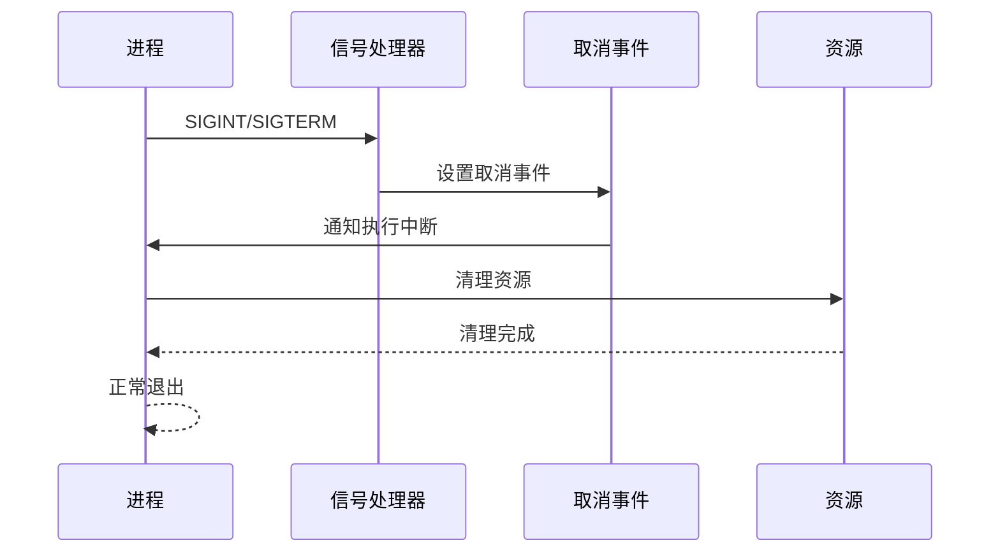

**图表来源**
- [__init__.py](file://src/kimi_cli/ui/print/__init__.py#L44-L52)

**章节来源**
- [__init__.py](file://src/kimi_cli/ui/print/__init__.py#L83-L98)

## 性能考虑

### 内存使用优化

Print模式通过以下方式优化内存使用：

1. **流式处理**：不缓存大量数据，逐行处理输入
2. **及时清理**：执行完成后立即释放资源
3. **无状态设计**：不维护会话状态减少内存占用

### 执行效率

1. **快速启动**：无需初始化复杂的UI组件
2. **直接输出**：避免中间缓冲和转换
3. **Yolo优化**：跳过审批检查提高执行速度

### 并发处理

虽然Print模式本身是单线程的，但可以与其他工具配合实现并发：

```bash
# 并行处理多个文件
find . -name "*.py" | parallel -j 4 kimi --print --command="分析文件复杂度"

# 批量API调用
seq 1 100 | xargs -P 10 -I {} kimi --print --command="处理任务 {}"
```

## 故障排除指南

### 常见问题与解决方案

#### 1. LLM配置问题

**症状**：输出"LLM not set"
**原因**：未配置API密钥或模型
**解决方案**：
```bash
# 设置环境变量
export KIMI_API_KEY="your-api-key"
export KIMI_MODEL_NAME="moonshot-v1-8k"

# 或使用命令行参数
kimi --print --command="测试" --model="moonshot-v1-8k"
```

#### 2. 输入格式错误

**症状**：无法识别命令输入
**原因**：输入格式不匹配
**解决方案**：
```bash
# 文本格式
echo "我的命令" | kimi --print --input-format=text

# JSON格式
echo '{"role": "user", "content": "我的命令"}' | kimi --print --input-format=stream-json
```

#### 3. 权限问题

**症状**：工具调用被拒绝
**原因**：Yolo模式未启用
**解决方案**：
```bash
# 自动启用Yolo
kimi --print --command="危险操作"

# 显式启用Yolo
kimi --print --yolo --command="危险操作"
```

#### 4. 超时问题

**症状**：命令执行超时
**原因**：默认超时设置
**解决方案**：
```bash
# 设置较长超时
timeout 60s kimi --print --command="长时间运行的任务"
```

### 调试技巧

1. **启用调试模式**：
   ```bash
   kimi --debug --print --command="测试"
   ```

2. **检查输出格式**：
   ```bash
   # 查看JSON输出
   echo '{"role": "user", "content": "测试"}' | kimi --print --input-format=stream-json --output-format=stream-json
   ```

3. **验证配置**：
   ```bash
   # 检查环境变量
   env | grep KIMI
   ```

**章节来源**
- [__init__.py](file://src/kimi_cli/ui/print/__init__.py#L83-L98)

## 总结

Print模式作为Kimi CLI的重要组成部分，为自动化场景提供了强大而灵活的解决方案。其核心优势包括：

### 主要优势

1. **自动化友好**：专为脚本和CI/CD设计，无需人工干预
2. **Yolo行为**：自动批准所有操作，简化部署流程
3. **格式灵活**：支持文本和JSON两种输入输出格式
4. **性能优异**：快速启动和执行，适合批量处理
5. **错误处理完善**：提供全面的异常处理和资源管理

### 应用场景

- **CI/CD流水线**：自动化测试、代码审查、部署验证
- **批量处理**：文件分析、数据转换、报告生成
- **API集成**：与其他系统的程序化交互
- **监控告警**：系统状态检查和异常检测
- **数据处理**：大规模数据分析和处理任务

### 最佳实践建议

1. **合理使用Yolo**：在受控环境中启用Yolo，避免安全风险
2. **格式选择**：根据具体需求选择合适的输入输出格式
3. **错误处理**：在脚本中添加适当的错误处理逻辑
4. **性能优化**：批量处理相似任务，避免频繁启动
5. **安全考虑**：在生产环境中谨慎使用Yolo模式

Print模式的成功实现展示了Kimi CLI在保持功能完整性的同时，能够适应不同的使用场景和需求。其简洁而强大的设计理念为开发者提供了可靠的自动化工具，大大提升了工作效率和系统集成能力。