# Shell模式

<cite>
**本文档引用的文件**
- [app.py](file://src/kimi_cli/app.py)
- [shell/__init__.py](file://src/kimi_cli/ui/shell/__init__.py)
- [shell/console.py](file://src/kimi_cli/ui/shell/console.py)
- [shell/metacmd.py](file://src/kimi_cli/ui/shell/metacmd.py)
- [shell/setup.py](file://src/kimi_cli/ui/shell/setup.py)
- [shell/prompt.py](file://src/kimi_cli/ui/shell/prompt.py)
- [shell/visualize.py](file://src/kimi_cli/ui/shell/visualize.py)
- [shell/keyboard.py](file://src/kimi_cli/ui/shell/keyboard.py)
- [shell/debug.py](file://src/kimi_cli/ui/shell/debug.py)
- [soul/kimisoul.py](file://src/kimi_cli/soul/kimisoul.py)
- [session.py](file://src/kimi_cli/session.py)
</cite>

## 目录
1. [简介](#简介)
2. [核心架构](#核心架构)
3. [ShellApp初始化与欢迎信息](#shellapp初始化与欢迎信息)
4. [_app_env环境隔离机制](#_app_env环境隔离机制)
5. [用户输入处理流程](#用户输入处理流程)
6. [与KimiSoul核心引擎交互](#与kimisoul核心引擎交互)
7. [富文本输出渲染](#富文本输出渲染)
8. [prompt-toolkit高级交互特性](#prompt-toolkit高级交互特性)
9. [元命令系统](#元命令系统)
10. [典型使用场景](#典型使用场景)
11. [常见问题排查](#常见问题排查)
12. [总结](#总结)

## 简介

Shell模式是kimi-cli的默认交互式界面，为用户提供了一个功能丰富的命令行环境。它基于`prompt-toolkit`库构建，提供了智能的自动补全、历史记录、键盘快捷键等高级终端交互特性，同时集成了KimiSoul核心引擎，支持自然语言对话、代码辅助、文件操作等多种功能。

## 核心架构

Shell模式采用分层架构设计，主要包含以下核心组件：

```mermaid
graph TB
subgraph "Shell模式架构"
KimiCLI[KimiCLI主控制器]
ShellApp[ShellApp应用层]
CustomPromptSession[自定义提示会话]
KimiSoul[KimiSoul核心引擎]
Visualize[可视化渲染器]
KimiCLI --> ShellApp
ShellApp --> CustomPromptSession
ShellApp --> KimiSoul
ShellApp --> Visualize
CustomPromptSession --> AutoComplete[自动补全系统]
CustomPromptSession --> History[历史记录]
CustomPromptSession --> Keyboard[键盘事件处理]
KimiSoul --> Agent[智能代理]
KimiSoul --> Context[上下文管理]
KimiSoul --> Tools[工具调用]
end
```

**图表来源**
- [app.py](file://src/kimi_cli/app.py#L29-L217)
- [shell/__init__.py](file://src/kimi_cli/ui/shell/__init__.py#L29-L320)

**章节来源**
- [app.py](file://src/kimi_cli/app.py#L29-L217)
- [shell/__init__.py](file://src/kimi_cli/ui/shell/__init__.py#L29-L320)

## ShellApp初始化与欢迎信息

`run_shell_mode`方法是Shell模式的入口点，负责初始化整个交互环境并展示欢迎信息。

### 欢迎信息结构

欢迎信息系统通过`WelcomeInfoItem`类组织显示的各种状态信息：

```mermaid
classDiagram
class WelcomeInfoItem {
+string name
+string value
+Level level
+Level.INFO
+Level.WARN
+Level.ERROR
}
class ShellApp {
+WelcomeInfoItem[] _welcome_info
+Soul soul
+run(command) bool
+_print_welcome_info()
}
ShellApp --> WelcomeInfoItem : "包含多个"
```

**图表来源**
- [shell/__init__.py](file://src/kimi_cli/ui/shell/__init__.py#L271-L320)

### 欢迎信息内容

Shell模式会显示以下关键信息：

| 信息类型 | 内容 | 描述 |
|---------|------|------|
| 工作目录 | 当前工作路径 | 显示用户当前所在的项目目录 |
| 会话标识 | 唯一会话ID | 标识当前交互会话的唯一标识符 |
| API URL | 配置的API地址 | 如果通过环境变量设置了API地址 |
| API密钥 | 密钥掩码 | 如果通过环境变量设置了API密钥 |
| 模型配置 | 当前使用的模型 | 显示LLM模型名称或未设置警告 |

### 欢迎信息级别

欢迎信息使用不同的颜色级别来区分重要性：
- **INFO** (灰色): 正常信息，如模型名称
- **WARN** (黄色): 警告信息，如环境变量覆盖或未设置的模型
- **ERROR** (红色): 错误信息，如必需的配置缺失

**章节来源**
- [app.py](file://src/kimi_cli/app.py#L139-L182)
- [shell/__init__.py](file://src/kimi_cli/ui/shell/__init__.py#L283-L320)

## _app_env环境隔离机制

`_app_env`上下文管理器实现了环境隔离机制，确保Shell模式的运行不会影响外部环境。

### 环境隔离实现

```mermaid
sequenceDiagram
participant Main as 主程序
participant AppEnv as _app_env
participant OS as 操作系统
participant Runtime as 运行时环境
Main->>AppEnv : 进入上下文
AppEnv->>OS : 记录原始工作目录
AppEnv->>OS : 切换到会话工作目录
AppEnv->>Runtime : 应用环境隔离
Runtime->>AppEnv : 执行Shell模式
AppEnv->>OS : 恢复原始工作目录
AppEnv->>Main : 退出上下文
```

**图表来源**
- [app.py](file://src/kimi_cli/app.py#L124-L135)

### 隔离特性

1. **工作目录隔离**: 自动切换到会话指定的工作目录
2. **警告过滤**: 忽略来自dateparser的弃用警告
3. **错误流重定向**: 将stderr重定向到日志系统
4. **自动恢复**: 确保无论正常退出还是异常退出都能恢复原始环境

### 使用场景

- **文件操作**: 在特定项目目录下执行文件相关操作
- **配置隔离**: 避免不同会话间的配置冲突
- **安全性**: 防止Shell模式中的操作影响全局环境

**章节来源**
- [app.py](file://src/kimi_cli/app.py#L124-L135)

## 用户输入处理流程

Shell模式的用户输入处理是一个复杂的多阶段流程，涉及多种输入模式和命令解析。

### 输入模式识别

```mermaid
flowchart TD
Start([用户输入]) --> Empty{空输入?}
Empty --> |是| Skip[跳过处理]
Empty --> |否| CheckMeta{以/开头?}
CheckMeta --> |是| MetaCmd[元命令处理]
CheckMeta --> |否| CheckShell{Shell模式?}
CheckShell --> |是| ShellCmd[Shell命令执行]
CheckShell --> |否| AgentCmd[代理命令处理]
MetaCmd --> ValidateCmd[验证命令]
ValidateCmd --> ExecCmd[执行命令]
ShellCmd --> ExecShell[执行Shell命令]
AgentCmd --> ProcessAgent[处理代理请求]
ProcessAgent --> Visualize[可视化输出]
ExecCmd --> End([完成])
ExecShell --> End
Visualize --> End
Skip --> End
```

**图表来源**
- [shell/__init__.py](file://src/kimi_cli/ui/shell/__init__.py#L53-L91)

### 输入解析器

`CustomPromptSession`提供了强大的输入解析能力：

1. **模式切换**: 支持代理模式和Shell模式之间的切换
2. **思考模式**: 可以启用深度思考模式
3. **富文本支持**: 支持文本、图片等多种内容格式
4. **附件处理**: 自动处理粘贴的图片附件

### 命令分类

| 命令类型 | 格式示例 | 处理方式 |
|---------|----------|----------|
| 元命令 | `/help`, `/setup` | 特殊控制命令 |
| Shell命令 | `ls -la`, `cd ~/projects` | 直接系统调用 |
| 代理命令 | "写一个Python脚本" | 发送给AI处理 |
| 系统命令 | `exit`, `quit` | 系统控制命令 |

**章节来源**
- [shell/__init__.py](file://src/kimi_cli/ui/shell/__init__.py#L53-L91)
- [shell/prompt.py](file://src/kimi_cli/ui/shell/prompt.py#L689-L722)

## 与KimiSoul核心引擎交互

Shell模式通过`run_soul_command`方法与KimiSoul核心引擎进行深度集成。

### 交互流程

```mermaid
sequenceDiagram
participant Shell as ShellApp
participant Soul as KimiSoul
participant Engine as LLM引擎
participant Visualizer as 可视化器
Shell->>Soul : _run_soul_command(input, thinking)
Soul->>Engine : 创建对话轮次
Engine->>Visualizer : 流式输出开始
loop 对话过程
Engine->>Visualizer : 内容块更新
Visualizer->>Shell : 实时渲染
end
Engine->>Soul : 对话完成
Soul->>Shell : 返回结果
Shell->>Shell : 处理异常情况
```

**图表来源**
- [shell/__init__.py](file://src/kimi_cli/ui/shell/__init__.py#L160-L229)
- [soul/kimisoul.py](file://src/kimi_cli/soul/kimisoul.py#L144-L200)

### 异常处理机制

Shell模式实现了完善的异常处理机制：

| 异常类型 | 处理策略 | 用户反馈 |
|---------|----------|----------|
| LLMNotSet | 显示配置提示 | "LLM not set, send /setup to configure" |
| LLMNotSupported | 显示能力限制 | 具体不支持的功能列表 |
| ChatProviderError | 显示提供商错误 | API状态码对应的错误信息 |
| MaxStepsReached | 显示步骤限制 | 达到最大步骤数的警告 |
| RunCancelled | 显示用户中断 | 用户取消操作的提示 |

### 思考模式控制

Shell模式支持动态切换思考模式：

```mermaid
stateDiagram-v2
[*] --> Normal : 默认模式
Normal --> Thinking : Tab键切换
Thinking --> Normal : Tab键切换
state Normal {
[*] --> StandardReasoning
StandardReasoning --> [*]
}
state Thinking {
[*] --> DeepAnalysis
DeepAnalysis --> [*]
}
```

**图表来源**
- [shell/prompt.py](file://src/kimi_cli/ui/shell/prompt.py#L557-L567)

**章节来源**
- [shell/__init__.py](file://src/kimi_cli/ui/shell/__init__.py#L160-L229)
- [soul/kimisoul.py](file://src/kimi_cli/soul/kimisoul.py#L144-L200)

## 富文本输出渲染

Shell模式使用`visualize`模块实现富文本输出渲染，提供直观的交互体验。

### 渲染架构

**图表来源**
- [shell/visualize.py](file://src/kimi_cli/ui/shell/visualize.py#L291-L566)

### 实时渲染特性

1. **流式输出**: 内容逐步渲染，无需等待完整响应
2. **状态指示**: 使用旋转图标表示处理状态
3. **工具调用跟踪**: 实时显示工具调用的进度
4. **思考过程展示**: 区分普通回复和深度思考内容

### 输出格式化

| 内容类型 | 渲染样式 | 特殊处理 |
|---------|----------|----------|
| 文本回复 | 标准Markdown格式 | 支持语法高亮 |
| 思考过程 | 灰色斜体字体 | 前缀"💫"符号 |
| 工具调用 | 绿色边框面板 | 参数高亮显示 |
| 错误信息 | 红色字体 | 错误图标标记 |
| 审批请求 | 黄色警告面板 | 交互式选择菜单 |

**章节来源**
- [shell/visualize.py](file://src/kimi_cli/ui/shell/visualize.py#L40-L566)

## prompt-toolkit高级交互特性

Shell模式基于`prompt-toolkit`库构建，提供了丰富的终端交互特性。

### 自动补全系统

```mermaid
graph LR
subgraph "自动补全类型"
MetaCmd[元命令补全]
FileMention[文件引用补全]
WordComplete[单词补全]
Fuzzy[Fuzzy匹配]
end
subgraph "补全触发"
SlashTrigger["/开头触发"]
AtTrigger["@开头触发"]
SpaceTrigger["空格触发"]
end
SlashTrigger --> MetaCmd
AtTrigger --> FileMention
SpaceTrigger --> WordComplete
MetaCmd --> Fuzzy
FileMention --> Fuzzy
```

**图表来源**
- [shell/prompt.py](file://src/kimi_cli/ui/shell/prompt.py#L57-L94)
- [shell/prompt.py](file://src/kimi_cli/ui/shell/prompt.py#L57-L94)

### 文件引用补全

文件补全系统具有智能缓存和过滤机制：

1. **智能缓存**: 缓存文件列表，避免重复扫描
2. **忽略规则**: 自动忽略版本控制目录和临时文件
3. **Fuzzy匹配**: 支持模糊搜索和智能排序
4. **路径展开**: 支持相对路径和绝对路径

### 历史记录管理

```mermaid
sequenceDiagram
participant User as 用户输入
participant Session as 提示会话
participant History as 历史记录
participant Storage as 存储系统
User->>Session : 输入命令
Session->>History : 添加到内存历史
Session->>Storage : 持久化存储
Note over Session : 下次启动时加载历史
Storage->>History : 加载历史记录
History->>Session : 提供历史补全
```

**图表来源**
- [shell/prompt.py](file://src/kimi_cli/ui/shell/prompt.py#L344-L383)

### 键盘快捷键

| 快捷键组合 | 功能 | 触发条件 |
|-----------|------|----------|
| Ctrl-X | 模式切换 | 代理模式 ↔ Shell模式 |
| Tab | 思考模式切换 | 代理模式且支持思考功能 |
| Ctrl-J | 新行插入 | 任何模式 |
| Ctrl-V | 粘贴内容 | 支持剪贴板的平台 |
| Ctrl-D | 退出程序 | 任何时刻 |
| Esc | 取消操作 | 任何操作过程中 |

### 平台适配

```mermaid
graph TB
subgraph "跨平台键盘监听"
Unix[Unix/Linux系统]
Windows[Windows系统]
MacOS[macOS系统]
end
subgraph "实现方式"
Termios[Termios库]
Msvcrt[MSVCRT库]
Native[原生API]
end
Unix --> Termios
Windows --> Msvcrt
MacOS --> Native
```

**图表来源**
- [shell/keyboard.py](file://src/kimi_cli/ui/shell/keyboard.py#L47-L186)

**章节来源**
- [shell/prompt.py](file://src/kimi_cli/ui/shell/prompt.py#L466-L794)
- [shell/keyboard.py](file://src/kimi_cli/ui/shell/keyboard.py#L1-L186)

## 元命令系统

Shell模式提供了丰富的元命令系统，用于控制应用程序行为和配置。

### 元命令架构

**图表来源**
- [shell/metacmd.py](file://src/kimi_cli/ui/shell/metacmd.py#L40-L96)

### 核心元命令

| 命令 | 别名 | 功能描述 | 是否需要KimiSoul |
|------|------|----------|------------------|
| `/help` | `/h`, `/?` | 显示帮助信息 | 否 |
| `/setup` | - | 配置LLM服务 | 否 |
| `/init` | - | 分析代码库生成AGENTS.md | 是 |
| `/clear` | `/reset` | 清除上下文 | 是 |
| `/compact` | - | 压缩上下文 | 是 |
| `/yolo` | - | 启用YOLO模式 | 是 |
| `/version` | - | 显示版本信息 | 否 |
| `/debug` | - | 调试上下文信息 | 是 |

### 元命令注册机制

```mermaid
sequenceDiagram
participant Decorator as @meta_command装饰器
participant Registry as 命令注册表
participant Command as MetaCommand实例
Decorator->>Command : 创建命令对象
Decorator->>Registry : 注册主命令
Decorator->>Registry : 注册别名映射
Note over Registry : 命令查找时优先匹配主命令
Registry->>Command : 返回命令实例
```

**图表来源**
- [shell/metacmd.py](file://src/kimi_cli/ui/shell/metacmd.py#L71-L135)

### Setup命令详解

`/setup`命令提供了完整的LLM服务配置流程：

```mermaid
flowchart TD
Start([开始配置]) --> SelectPlatform[选择平台]
SelectPlatform --> EnterKey[输入API密钥]
EnterKey --> ListModels[列出可用模型]
ListModels --> SelectModel[选择模型]
SelectModel --> SaveConfig[保存配置]
SaveConfig --> Reload[重新加载]
SelectPlatform --> PlatformList[平台列表:<br/>- Kimi For Coding<br/>- Moonshot AI 开放平台<br/>- Moonshot AI Open Platform]
ListModels --> FilterModels[按平台过滤模型]
FilterModels --> ModelList[模型列表]
```

**图表来源**
- [shell/setup.py](file://src/kimi_cli/ui/shell/setup.py#L50-L84)

**章节来源**
- [shell/metacmd.py](file://src/kimi_cli/ui/shell/metacmd.py#L1-L276)
- [shell/setup.py](file://src/kimi_cli/ui/shell/setup.py#L50-L84)

## 典型使用场景

Shell模式支持多种实际应用场景，以下是几个典型的使用案例。

### 代码辅助开发

```mermaid
sequenceDiagram
participant Dev as 开发者
participant Shell as Shell模式
participant AI as AI助手
participant Editor as 代码编辑器
Dev->>Shell : "写一个Python函数处理JSON数据"
Shell->>AI : 转发请求
AI->>Shell : 返回代码实现
Shell->>Dev : 显示生成的代码
Dev->>Shell : "添加错误处理逻辑"
Shell->>AI : 转发增强请求
AI->>Shell : 返回改进后的代码
Shell->>Dev : 更新显示
Dev->>Shell : "保存到文件"
Shell->>Editor : 调用文件工具
Editor->>Shell : 确认保存
Shell->>Dev : 显示保存结果
```

### 文件操作任务

Shell模式提供了强大的文件操作能力：

| 操作类型 | 示例命令 | 功能描述 |
|---------|----------|----------|
| 文件读取 | `cat README.md` | 查看文件内容 |
| 文件搜索 | `grep "TODO" *.py` | 搜索代码中的TODO |
| 文件修改 | `replace "old" "new" file.txt` | 替换文件内容 |
| 文件创建 | `write new_file.txt` | 创建新文件 |
| 文件比较 | `diff file1.txt file2.txt` | 比较文件差异 |

### 项目分析与重构

```mermaid
flowchart TD
Init[运行 /init] --> Analyze[分析代码结构]
Analyze --> Generate[生成AGENTS.md]
Generate --> Review[审查生成的文档]
Review --> Refactor[基于文档重构]
Refactor --> Test[测试重构结果]
subgraph "分析内容"
CodeStructure[代码结构分析]
Dependencies[依赖关系识别]
Patterns[设计模式检测]
BestPractices[最佳实践建议]
end
Analyze --> CodeStructure
Analyze --> Dependencies
Analyze --> Patterns
Analyze --> BestPractices
```

### 任务分解与执行

Shell模式支持复杂任务的分解和逐步执行：

1. **任务接收**: 接收高层次的任务描述
2. **子任务分解**: 将大任务拆分为可执行的小任务
3. **并行执行**: 支持多个子任务并行处理
4. **结果整合**: 将子任务结果整合为最终输出

**章节来源**
- [shell/metacmd.py](file://src/kimi_cli/ui/shell/metacmd.py#L204-L276)

## 常见问题排查

Shell模式在使用过程中可能遇到各种问题，以下是常见问题及其解决方案。

### 环境变量覆盖提示

当环境变量覆盖配置时，Shell模式会显示黄色警告信息：

```mermaid
flowchart TD
EnvCheck[检查环境变量] --> HasOverride{有覆盖?}
HasOverride --> |是| ShowWarn[显示警告信息]
HasOverride --> |否| Normal[正常运行]
ShowWarn --> LogWarn[记录警告日志]
LogWarn --> Continue[继续执行]
subgraph "警告类型"
BaseURL[API URL覆盖]
APIKey[API密钥覆盖]
ModelName[模型名称覆盖]
end
ShowWarn --> BaseURL
ShowWarn --> APIKey
ShowWarn --> ModelName
```

**图表来源**
- [app.py](file://src/kimi_cli/app.py#L143-L159)

### 模型未设置警告

如果未配置LLM模型，Shell模式会显示相应的警告：

| 警告信息 | 原因 | 解决方案 |
|---------|------|----------|
| "Model not set, send /setup to configure" | 未配置LLM服务 | 运行 `/setup` 命令 |
| "Model configured from KIMI_MODEL_NAME" | 使用环境变量配置 | 检查环境变量设置 |
| "Model: {model_name}" | 正常配置 | 无需处理 |

### 权限和认证问题

```mermaid
sequenceDiagram
participant User as 用户
participant Shell as Shell模式
participant Provider as LLM提供商
participant API as API服务
User->>Shell : 发送请求
Shell->>Provider : 转发请求
Provider->>API : 调用API
API-->>Provider : 返回错误
Provider-->>Shell : 错误响应
Shell-->>User : 显示错误信息
Note over User,API : 常见错误类型
Note over API : 401 : 认证失败
Note over API : 402 : 会员过期
Note over API : 403 : 配额超限
```

### 性能优化建议

1. **上下文压缩**: 定期运行 `/compact` 命令压缩上下文
2. **会话管理**: 合理使用 `/clear` 清理不需要的历史
3. **网络优化**: 确保稳定的网络连接
4. **资源监控**: 关注系统资源使用情况

### 调试工具

Shell模式提供了内置的调试功能：

```mermaid
classDiagram
class DebugCommand {
+debug(app, args)
+_format_message(msg, index)
+_format_content_part(part)
+_format_tool_call(tool_call)
}
class DebugOutput {
+ContextInfo 上下文信息
+MessageList 消息列表
+TokenCount 令牌计数
+CheckpointInfo 检查点信息
}
DebugCommand --> DebugOutput : "生成"
```

**图表来源**
- [shell/debug.py](file://src/kimi_cli/ui/shell/debug.py#L146-L190)

**章节来源**
- [app.py](file://src/kimi_cli/app.py#L143-L182)
- [shell/debug.py](file://src/kimi_cli/ui/shell/debug.py#L146-L190)

## 总结

Shell模式作为kimi-cli的核心交互界面，提供了功能丰富、用户体验优秀的命令行环境。它通过以下关键特性实现了卓越的交互体验：

### 核心优势

1. **智能环境隔离**: 通过`_app_env`机制确保运行安全性和稳定性
2. **丰富的交互特性**: 基于`prompt-toolkit`的自动补全、历史记录、键盘快捷键
3. **实时可视化输出**: 流式渲染和状态指示，提供良好的用户体验
4. **灵活的命令系统**: 支持代理命令、Shell命令和元命令的无缝切换
5. **完善的错误处理**: 全面的异常捕获和用户友好的错误提示

### 技术特色

- **异步架构**: 基于asyncio的非阻塞设计，支持并发操作
- **插件化扩展**: 元命令系统支持功能的动态扩展
- **跨平台兼容**: 统一的键盘事件处理和平台适配
- **富文本渲染**: 基于Rich库的美观输出格式

### 应用价值

Shell模式不仅是一个简单的命令行界面，更是一个智能化的开发助手，能够显著提升开发效率和代码质量。通过与KimiSoul核心引擎的深度集成，它能够理解复杂的自然语言指令，执行智能的代码分析和生成任务，为开发者提供全方位的技术支持。

对于希望充分利用AI技术提升开发效率的团队和个人来说，Shell模式提供了一个既强大又易用的交互平台，是现代软件开发工具链中不可或缺的重要组成部分。