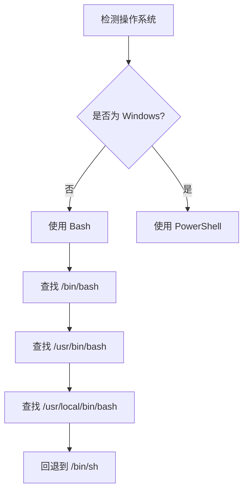
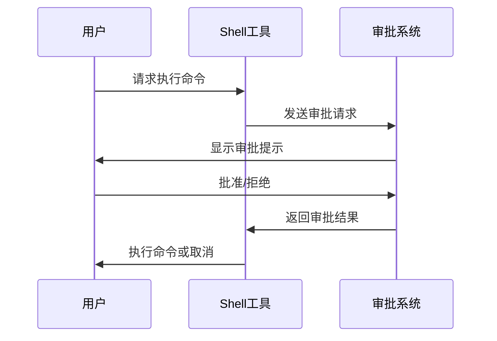
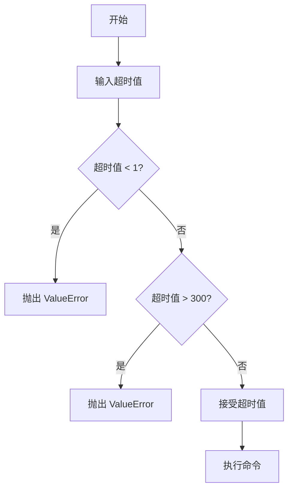
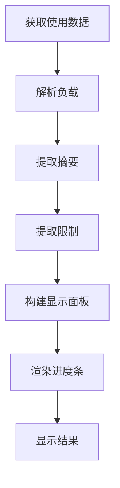

# Shell 用法统计

<cite>
**本文档引用的文件**  
- [__init__.py](file://src/kimi_cli/tools/shell/__init__.py)
- [bash.md](file://src/kimi_cli/tools/shell/bash.md)
- [powershell.md](file://src/kimi_cli/tools/shell/powershell.md)
- [test_shell_bash.py](file://tests/test_shell_bash.py)
- [test_shell_powershell.py](file://tests/test_shell_powershell.py)
- [utils.py](file://src/kimi_cli/tools/utils.py)
- [approval.py](file://src/kimi_cli/soul/approval.py)
- [environment.py](file://src/kimi_cli/utils/environment.py)
- [usage.py](file://src/kimi_cli/ui/shell/usage.py)
</cite>

## 目录
1. [简介](#简介)
2. [Shell 工具核心功能](#shell-工具核心功能)
3. [跨平台支持](#跨平台支持)
4. [安全与审批机制](#安全与审批机制)
5. [执行参数与限制](#执行参数与限制)
6. [输出处理与截断](#输出处理与截断)
7. [使用效率最佳实践](#使用效率最佳实践)
8. [测试覆盖](#测试覆盖)
9. [API 使用统计](#api-使用统计)
10. [结论](#结论)

## 简介
Kimi CLI 是一个命令行智能代理工具，能够帮助用户完成软件开发任务和终端操作。其核心功能之一是通过 Shell 工具执行系统命令，该工具支持跨平台操作，并具备完善的安全控制、输出管理和使用统计功能。本文档详细分析 Shell 工具的用法统计、执行机制和最佳实践。

## Shell 工具核心功能

Shell 工具是 Kimi CLI 的核心组件之一，允许代理在用户的系统上执行命令以完成各种任务，如文件系统探索、文件编辑、脚本运行和系统信息获取等。该工具通过异步方式执行命令，并将标准输出和标准错误合并返回。

**Shell 工具的主要特性包括**：
- 支持在非交互式环境中执行命令
- 提供超时控制以防止命令无限运行
- 支持命令链式调用和复杂逻辑执行
- 能够处理长输出并自动截断

**Section sources**
- [__init__.py](file://src/kimi_cli/tools/shell/__init__.py#L1-L121)

## 跨平台支持

Kimi CLI 的 Shell 工具根据运行环境自动适配不同的 shell 类型，支持 Linux/macOS 上的 Bash 和 Windows 上的 PowerShell。

### Bash 支持
在非 Windows 系统上，Shell 工具使用 Bash 执行命令。工具会自动检测系统中可用的 Bash 路径（如 `/bin/bash`、`/usr/bin/bash` 等），若未找到则回退到 `/bin/sh`。



**Diagram sources**
- [__init__.py](file://src/kimi_cli/tools/shell/__init__.py#L36-L46)
- [environment.py](file://src/kimi_cli/utils/environment.py#L33-L58)

### PowerShell 支持
在 Windows 系统上，Shell 工具使用 Windows PowerShell 执行命令。工具会自动配置为使用 `powershell.exe` 作为执行器。

**Section sources**
- [__init__.py](file://src/kimi_cli/tools/shell/__init__.py#L36-L46)
- [powershell.md](file://src/kimi_cli/tools/shell/powershell.md#L1-L26)

## 安全与审批机制

为了确保系统安全，Shell 工具实施了严格的审批机制，防止未经授权的命令执行。

### 审批流程
每次执行 Shell 命令前，系统会向用户请求审批。只有在获得用户明确批准后，命令才会执行。这一机制通过 `Approval` 类实现，确保所有潜在风险操作都经过用户确认。



**Diagram sources**
- [__init__.py](file://src/kimi_cli/tools/shell/__init__.py#L54-L59)
- [approval.py](file://src/kimi_cli/soul/approval.py#L37-L87)

### 安全指南
Shell 工具遵循严格的安全准则：
- 每次调用都在全新的 shell 环境中执行，不保留环境变量、工作目录变更和命令历史
- 禁止执行需要超级用户权限的命令，除非明确授权
- 避免访问工作目录之外的文件或目录
- 不执行可能无限期阻塞的交互式程序

**Section sources**
- [bash.md](file://src/kimi_cli/tools/shell/bash.md#L6-L12)
- [powershell.md](file://src/kimi_cli/tools/shell/powershell.md#L8-L12)

## 执行参数与限制

Shell 工具通过参数化配置来控制命令执行行为，确保安全性和效率。

### 参数定义
```python
class Params(BaseModel):
    command: str = Field(description="要执行的 bash 命令。")
    timeout: int = Field(
        description="命令执行的超时时间（秒）。如果命令执行时间超过此值，将被终止。",
        default=60,
        ge=1,
        le=MAX_TIMEOUT,
    )
```

### 超时验证
系统对超时参数进行严格验证，确保其在有效范围内（1-300秒）。测试用例验证了边界条件的正确处理。



**Diagram sources**
- [__init__.py](file://src/kimi_cli/tools/shell/__init__.py#L18-L28)
- [test_shell_bash.py](file://tests/test_shell_bash.py#L208-L221)

**Section sources**
- [__init__.py](file://src/kimi_cli/tools/shell/__init__.py#L18-L28)
- [test_shell_bash.py](file://tests/test_shell_bash.py#L208-L221)

## 输出处理与截断

Shell 工具对命令输出进行智能处理，确保大输出不会影响系统性能。

### 输出截断机制
当命令输出过长时，系统会自动截断并添加标记 `[...truncated]`。默认最大字符数限制为 50,000 字符。

```mermaid
flowchart TD
A[执行命令] --> B[收集输出]
B --> C{输出长度 > 50,000?}
C --> |是| D[截断输出]
D --> E[添加 [...truncated] 标记]
C --> |否| F[保持完整输出]
E --> G[返回结果]
F --> G
```

### 截断测试
测试用例验证了成功和失败情况下长输出的截断行为：

```python
def test_output_truncation_on_success(shell_tool: Shell):
    """测试成功命令的长输出截断"""
    result = await shell_tool(Params(command=f"python3 -c \"print('X' * {oversize_length})\""))
    assert not result.is_error
    assert result.output.endswith("[...truncated]\n")

def test_output_truncation_on_failure(shell_tool: Shell):
    """测试失败命令的长输出截断"""
    result = await shell_tool(Params(command="python3 -c \"import sys; print('ERROR_' * 8000); sys.exit(1)\""))
    assert result.is_error
    assert result.output.endswith("[...truncated]\n")
```

**Section sources**
- [utils.py](file://src/kimi_cli/tools/utils.py#L34-L35)
- [test_shell_bash.py](file://tests/test_shell_bash.py#L175-L205)

## 使用效率最佳实践

Shell 工具提供了多种方式来提高命令执行效率，减少不必要的工具调用。

### 命令链式调用
- 使用 `&&` 连接相关命令，在单次调用中执行
- 使用 `;` 顺序执行命令，无论成功或失败
- 使用 `||` 进行条件执行（仅在前一个命令失败时执行第二个命令）

### 管道与重定向
- 使用管道操作符 (`|`) 在命令间传递输入输出
- 使用重定向 (`>`, `>>`) 将输出保存到文件
- 结合控制流 (`if`, `case`, `for`, `while`) 在单次调用中执行复杂逻辑

### Windows PowerShell 效率指南
- 使用 `;` 链接相关命令
- 使用 `if ($?)` 或 `if (-not $?)` 根据前一个命令的成功或失败条件执行命令
- 利用内置工具（如 `findstr`, `where`）在单次调用中过滤、转换或定位数据

**Section sources**
- [bash.md](file://src/kimi_cli/tools/shell/bash.md#L14-L20)
- [powershell.md](file://src/kimi_cli/tools/shell/powershell.md#L15-L17)

## 测试覆盖

Shell 工具具有全面的测试覆盖，确保功能的稳定性和可靠性。

### 测试用例概览
| 测试类型 | 测试内容 | 文件 |
|---------|---------|------|
| 简单命令 | 执行简单命令并验证输出 | test_shell_bash.py |
| 错误命令 | 执行失败命令并验证错误处理 | test_shell_bash.py |
| 命令链式调用 | 验证 `&&` 和 `;` 的行为 | test_shell_bash.py |
| 条件执行 | 验证 `||` 的行为 | test_shell_bash.py |
| 管道操作 | 验证 `|` 的行为 | test_shell_bash.py |
| 超时处理 | 验证超时机制 | test_shell_bash.py |
| 环境变量 | 验证环境变量设置 | test_shell_bash.py |
| 文件操作 | 验证文件读写操作 | test_shell_bash.py |
| 文本处理 | 验证 sed、awk 等工具 | test_shell_bash.py |
| Windows 支持 | 验证 PowerShell 命令 | test_shell_powershell.py |

**Section sources**
- [test_shell_bash.py](file://tests/test_shell_bash.py#L1-L222)
- [test_shell_powershell.py](file://tests/test_shell_powershell.py#L1-L64)

## API 使用统计

Kimi CLI 提供了 `/usage` 命令来显示 API 使用情况和配额信息。

### 使用统计功能
- 从 Kimi for Coding 平台获取使用数据
- 显示总配额和各项限制
- 可视化进度条显示使用情况
- 提供重置时间提示

### 统计数据显示


**Section sources**
- [usage.py](file://src/kimi_cli/ui/shell/usage.py#L1-L272)

## 结论
Kimi CLI 的 Shell 工具提供了一个安全、高效且功能丰富的命令执行环境。通过严格的审批机制、智能的输出处理和跨平台支持，该工具能够在确保系统安全的同时，为用户提供强大的终端操作能力。其全面的测试覆盖和详细的使用统计功能进一步增强了工具的可靠性和可维护性。