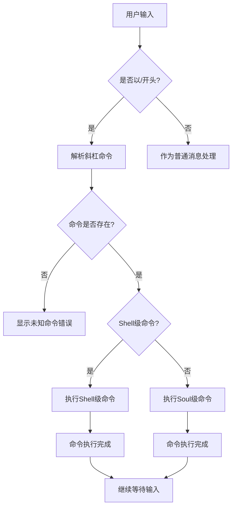
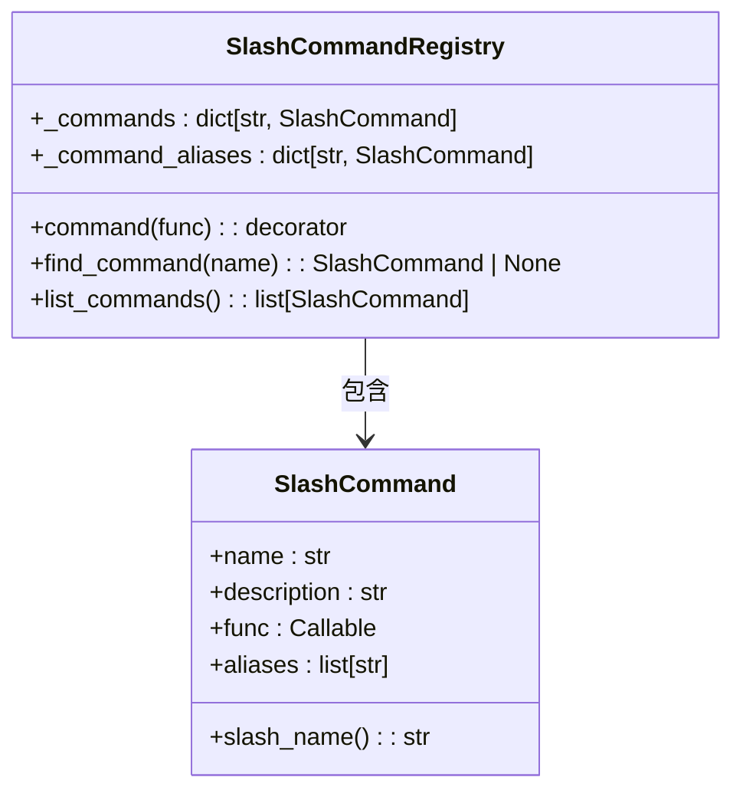
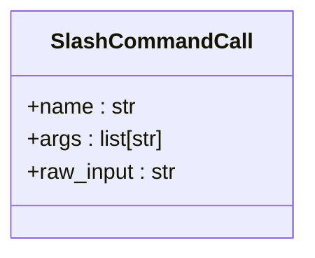
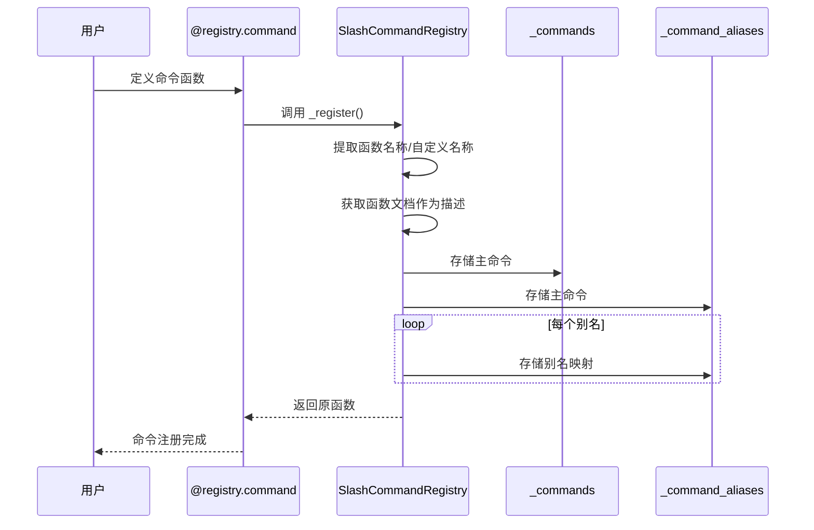
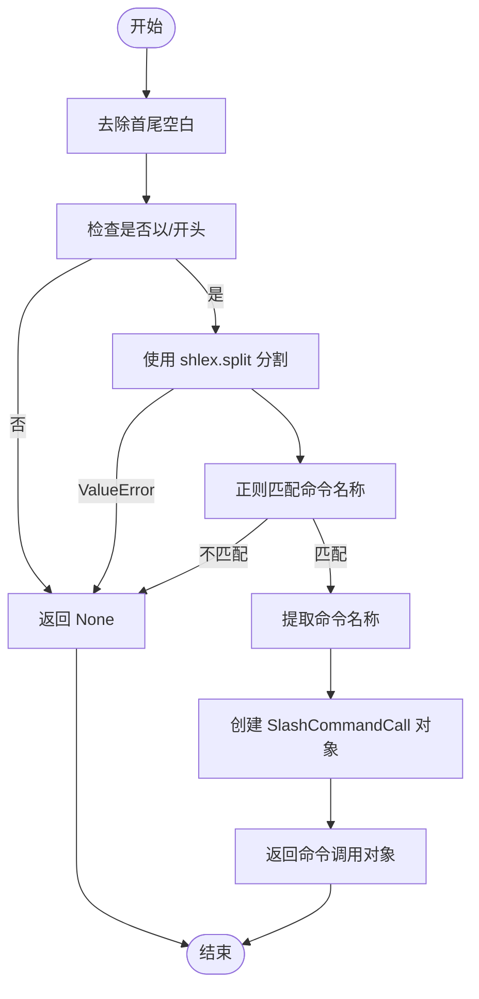
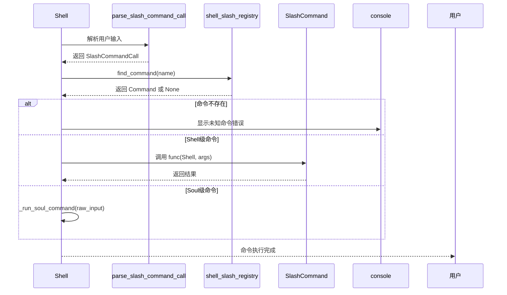
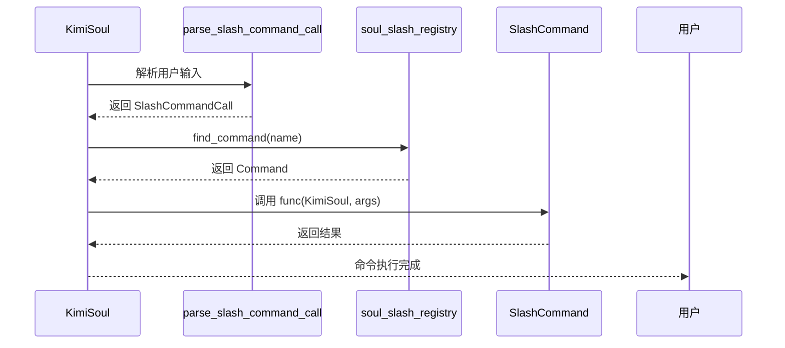
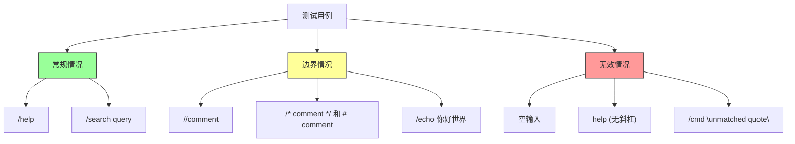
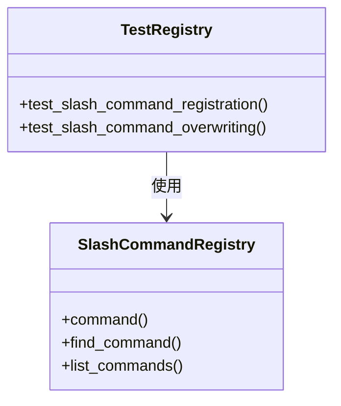

# 斜杠命令支持

<cite>
**本文档中引用的文件**   
- [slash.py](file://src/kimi_cli/soul/slash.py)
- [slash.py](file://src/kimi_cli/ui/shell/slash.py)
- [slashcmd.py](file://src/kimi_cli/utils/slashcmd.py)
- [__init__.py](file://src/kimi_cli/ui/shell/__init__.py)
- [kimisoul.py](file://src/kimi_cli/soul/kimisoul.py)
- [test_slash_command.py](file://tests/test_slash_command.py)
</cite>

## 目录
1. [简介](#简介)
2. [斜杠命令系统架构](#斜杠命令系统架构)
3. [核心组件分析](#核心组件分析)
4. [斜杠命令注册与解析](#斜杠命令注册与解析)
5. [斜杠命令执行流程](#斜杠命令执行流程)
6. [测试与验证](#测试与验证)
7. [结论](#结论)

## 简介
Kimi CLI 提供了一套完整的斜杠命令（Slash Commands）系统，允许用户通过以 `/` 开头的特殊命令与应用程序进行交互。这些命令分为两个层级：Shell 级和 Soul 级，提供了丰富的功能来控制应用程序行为、获取信息和执行特定操作。

## 斜杠命令系统架构

**图表来源**
- [__init__.py](file://src/kimi_cli/ui/shell/__init__.py#L99-L101)
- [slash.py](file://src/kimi_cli/ui/shell/slash.py#L30)
- [slash.py](file://src/kimi_cli/soul/slash.py#L29)

## 核心组件分析

### 斜杠命令注册器
斜杠命令系统的核心是 `SlashCommandRegistry` 类，它负责管理所有可用的斜杠命令。该注册器使用装饰器模式来注册命令，并支持命令别名。

**图表来源**
- [slashcmd.py](file://src/kimi_cli/utils/slashcmd.py#L22-L94)

### 命令调用数据结构
`SlashCommandCall` 类用于表示一个斜杠命令调用，包含命令名称、参数和原始输入。

**图表来源**
- [slashcmd.py](file://src/kimi_cli/utils/slashcmd.py#L98-L102)

## 斜杠命令注册与解析

### 命令注册机制
斜杠命令通过装饰器进行注册，支持自定义名称和别名。注册器会同时维护主命令名称和所有别名的映射。

**图表来源**
- [slashcmd.py](file://src/kimi_cli/utils/slashcmd.py#L42-L87)
- [slash.py](file://src/kimi_cli/ui/shell/slash.py#L39)
- [slash.py](file://src/kimi_cli/soul/slash.py#L32)

### 命令解析流程
当用户输入以 `/` 开头时，系统会解析该输入以确定是否为有效的斜杠命令。

**图表来源**
- [slashcmd.py](file://src/kimi_cli/utils/slashcmd.py#L104-L126)
- [test_slash_command.py](file://tests/test_slash_command.py#L40-L88)

## 斜杠命令执行流程

### Shell 级命令执行
Shell 级命令由 UI 层直接处理，通常用于控制界面行为或获取系统信息。

**图表来源**
- [__init__.py](file://src/kimi_cli/ui/shell/__init__.py#L146-L179)
- [slash.py](file://src/kimi_cli/ui/shell/slash.py)

### Soul 级命令执行
Soul 级命令由核心逻辑层处理，通常用于执行与 AI 代理相关的操作。

**图表来源**
- [kimisoul.py](file://src/kimi_cli/soul/kimisoul.py#L165-L179)
- [slash.py](file://src/kimi_cli/soul/slash.py)

## 测试与验证

### 命令解析测试
系统提供了全面的测试用例来验证斜杠命令解析的正确性，包括各种边界情况。

**图表来源**
- [test_slash_command.py](file://tests/test_slash_command.py#L40-L88)

### 命令注册测试
测试验证了命令注册的各种场景，包括别名、自定义名称和覆盖行为。

**图表来源**
- [test_slash_command.py](file://tests/test_slash_command.py#L100-L192)

## 结论
Kimi CLI 的斜杠命令系统设计精巧，具有以下特点：
- **分层架构**：区分 Shell 级和 Soul 级命令，实现关注点分离
- **灵活注册**：通过装饰器模式支持命令注册，可自定义名称和别名
- **健壮解析**：使用 shlex 和正则表达式确保命令解析的准确性
- **完整测试**：提供全面的测试用例覆盖各种使用场景
- **用户友好**：支持中文参数，提供清晰的错误提示

该系统为用户提供了强大的交互能力，同时保持了代码的可维护性和扩展性。