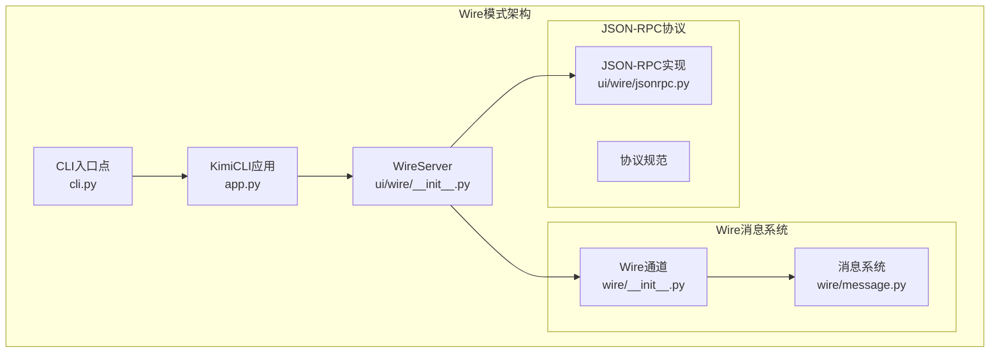
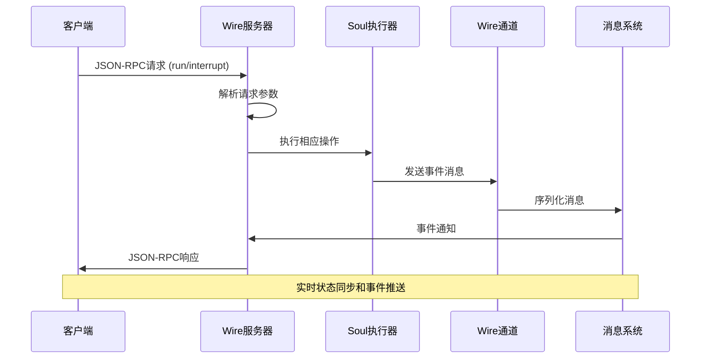
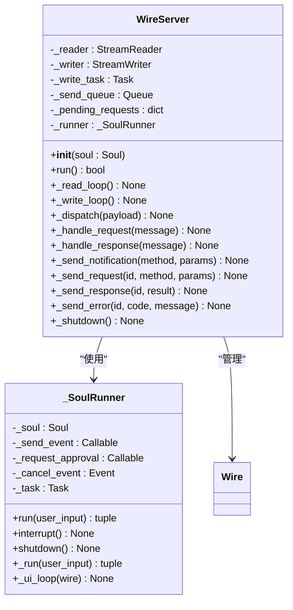
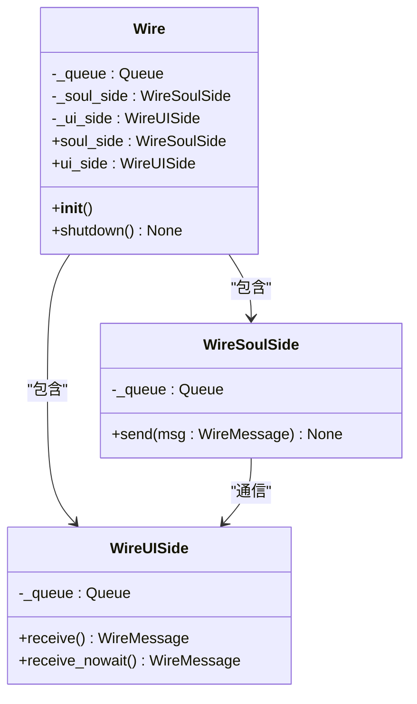
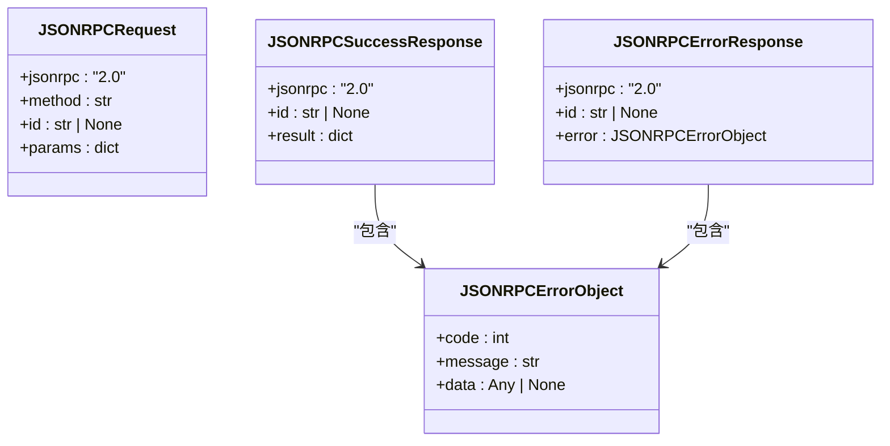
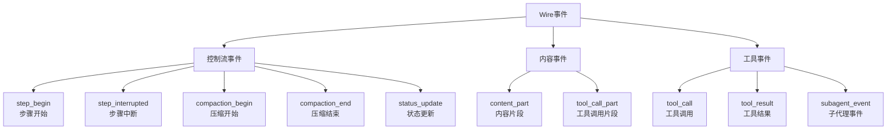
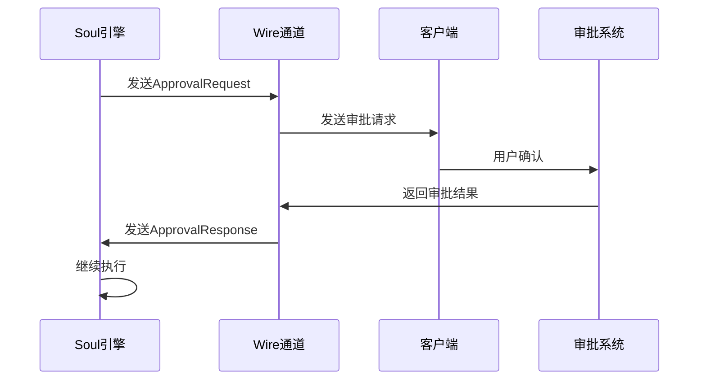
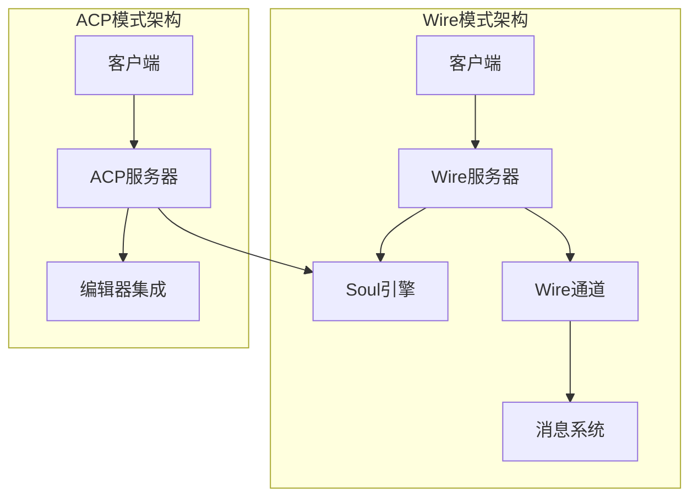

# Wire模式

<cite>
**本文档中引用的文件**
- [src/kimi_cli/ui/wire/__init__.py](file://src/kimi_cli/ui/wire/__init__.py)
- [src/kimi_cli/ui/wire/jsonrpc.py](file://src/kimi_cli/ui/wire/jsonrpc.py)
- [src/kimi_cli/ui/wire/README.md](file://src/kimi_cli/ui/wire/README.md)
- [src/kimi_cli/wire/__init__.py](file://src/kimi_cli/wire/__init__.py)
- [src/kimi_cli/wire/message.py](file://src/kimi_cli/wire/message.py)
- [src/kimi_cli/cli.py](file://src/kimi_cli/cli.py)
- [src/kimi_cli/app.py](file://src/kimi_cli/app.py)
- [tests/test_wire_message.py](file://tests/test_wire_message.py)
- [src/kimi_cli/wire/CLAUDE.md](file://src/kimi_cli/wire/CLAUDE.md)
</cite>

## 目录
1. [简介](#简介)
2. [项目结构](#项目结构)
3. [核心组件](#核心组件)
4. [架构概览](#架构概览)
5. [详细组件分析](#详细组件分析)
6. [JSON-RPC协议实现](#json-rpc协议实现)
7. [Wire消息系统](#wire消息系统)
8. [使用方式](#使用方式)
9. [与ACP模式的对比](#与acp模式的对比)
10. [故障排除指南](#故障排除指南)
11. [结论](#结论)

## 简介

Wire模式是Kimia CLI提供的实验性JSON-RPC服务器功能，旨在为需要深度嵌入到其他应用程序中的场景提供一种轻量级、语言无关的集成方式。该模式通过标准输入输出（stdio）或网络套接字处理JSON-RPC消息，使外部客户端能够与KimiSoul进行交互。

Wire模式具有以下特点：
- **实验性状态**：API可能不稳定，处于开发阶段
- **语言无关**：基于JSON-RPC协议，支持任何编程语言
- **轻量级设计**：最小化资源占用，适合嵌入式应用
- **实时通信**：支持双向消息传递和事件通知

## 项目结构

Wire模式的实现分布在多个模块中，形成了清晰的分层架构：



**图表来源**
- [src/kimi_cli/cli.py](file://src/kimi_cli/cli.py#L124-L135)
- [src/kimi_cli/app.py](file://src/kimi_cli/app.py#L211-L216)
- [src/kimi_cli/ui/wire/__init__.py](file://src/kimi_cli/ui/wire/__init__.py#L114-L343)

**章节来源**
- [src/kimi_cli/cli.py](file://src/kimi_cli/cli.py#L1-L358)
- [src/kimi_cli/app.py](file://src/kimi_cli/app.py#L172-L216)

## 核心组件

Wire模式包含以下核心组件：

### 1. WireServer类
负责管理JSON-RPC服务器生命周期，处理客户端请求和响应。

### 2. Wire通道
提供Soul和UI之间的通信桥梁，支持事件和审批请求的传递。

### 3. JSON-RPC消息适配器
实现标准的JSON-RPC 2.0协议，确保消息格式的正确性和一致性。

### 4. Wire消息系统
定义了各种事件类型和消息格式，支持状态更新、步骤控制和工具调用。

**章节来源**
- [src/kimi_cli/ui/wire/__init__.py](file://src/kimi_cli/ui/wire/__init__.py#L114-L343)
- [src/kimi_cli/wire/__init__.py](file://src/kimi_cli/wire/__init__.py#L1-L83)
- [src/kimi_cli/ui/wire/jsonrpc.py](file://src/kimi_cli/ui/wire/jsonrpc.py#L1-L51)

## 架构概览

Wire模式采用异步事件驱动架构，通过消息队列实现高效的双向通信：



**图表来源**
- [src/kimi_cli/ui/wire/__init__.py](file://src/kimi_cli/ui/wire/__init__.py#L139-L302)
- [src/kimi_cli/wire/message.py](file://src/kimi_cli/wire/message.py#L1-L201)

## 详细组件分析

### WireServer类分析

WireServer是Wire模式的核心组件，负责管理整个JSON-RPC服务器的生命周期：



**图表来源**
- [src/kimi_cli/ui/wire/__init__.py](file://src/kimi_cli/ui/wire/__init__.py#L114-L343)

#### 核心方法说明

1. **`run()`方法**：初始化服务器并启动读写循环
2. **`_read_loop()`方法**：从标准输入读取JSON-RPC消息
3. **`_write_loop()`方法**：向标准输出发送JSON-RPC响应
4. **`_dispatch()`方法**：分发解析后的消息到相应的处理器

**章节来源**
- [src/kimi_cli/ui/wire/__init__.py](file://src/kimi_cli/ui/wire/__init__.py#L114-L343)

### Wire通道分析

Wire通道提供了Soul和UI之间的通信机制：



**图表来源**
- [src/kimi_cli/wire/__init__.py](file://src/kimi_cli/wire/__init__.py#L18-L83)

**章节来源**
- [src/kimi_cli/wire/__init__.py](file://src/kimi_cli/wire/__init__.py#L1-L83)

## JSON-RPC协议实现

Wire模式基于JSON-RPC 2.0标准协议，提供了完整的请求-响应机制：

### 协议消息类型



**图表来源**
- [src/kimi_cli/ui/wire/jsonrpc.py](file://src/kimi_cli/ui/wire/jsonrpc.py#L16-L41)

### 支持的方法

Wire模式支持以下JSON-RPC方法：

| 方法名 | 描述 | 参数 | 返回值 |
|--------|------|------|--------|
| `run` | 执行用户输入的指令 | `{"input": "<prompt>"}` | 执行状态 |
| `interrupt` | 中断当前执行 | `{}` | 中断状态 |

**章节来源**
- [src/kimi_cli/ui/wire/jsonrpc.py](file://src/kimi_cli/ui/wire/jsonrpc.py#L1-L51)
- [src/kimi_cli/ui/wire/README.md](file://src/kimi_cli/ui/wire/README.md#L18-L47)

## Wire消息系统

Wire消息系统定义了丰富的事件类型，支持完整的状态跟踪和工具调用：

### 事件类型分类



**图表来源**
- [src/kimi_cli/wire/message.py](file://src/kimi_cli/wire/message.py#L64-L67)

### 审批请求系统

Wire模式支持细粒度的权限控制：



**图表来源**
- [src/kimi_cli/wire/message.py](file://src/kimi_cli/wire/message.py#L76-L107)

**章节来源**
- [src/kimi_cli/wire/message.py](file://src/kimi_cli/wire/message.py#L1-L201)

## 使用方式

### 启动Wire服务器

通过命令行参数启用Wire模式：

```bash
# 基本启动
kimi --wire

# 指定工作目录
kimi --wire --work-dir /path/to/project

# 结合其他参数使用
kimi --wire --model gpt-4 --agent-file custom-agent.yaml
```

### 客户端连接示例

以下是Python客户端的基本连接模式：

```python
import asyncio
import json

async def connect_wire_client():
    # 获取标准输入输出流
    reader, writer = await asyncio.open_connection('localhost', 8080)
    
    # 发送run请求
    request = {
        "jsonrpc": "2.0",
        "id": "1",
        "method": "run",
        "params": {"input": "请列出当前目录的所有文件"}
    }
    
    # 发送请求
    writer.write(json.dumps(request).encode() + b'\n')
    await writer.drain()
    
    # 接收响应
    while True:
        line = await reader.readline()
        if not line:
            break
            
        response = json.loads(line.decode())
        print(f"收到响应: {response}")
```

### 消息格式示例

#### 请求消息格式
```json
{
  "jsonrpc": "2.0",
  "id": "unique-request-id",
  "method": "run",
  "params": {
    "input": "你的指令内容"
  }
}
```

#### 响应消息格式
```json
{
  "jsonrpc": "2.0",
  "id": "unique-request-id",
  "result": {
    "status": "finished"
  }
}
```

#### 事件通知格式
```json
{
  "jsonrpc": "2.0",
  "method": "event",
  "params": {
    "type": "content_part",
    "payload": {
      "type": "text",
      "text": "文件列表如下：\nfile1.txt\nfile2.txt"
    }
  }
}
```

**章节来源**
- [src/kimi_cli/cli.py](file://src/kimi_cli/cli.py#L130-L135)
- [src/kimi_cli/ui/wire/README.md](file://src/kimi_cli/ui/wire/README.md#L11-L17)

## 与ACP模式的对比

Wire模式和ACP模式都提供了与KimiSoul的集成能力，但定位和适用场景有所不同：

### 功能对比表

| 特性 | Wire模式 | ACP模式 |
|------|----------|---------|
| **协议类型** | JSON-RPC over stdio | ACP协议 |
| **复杂度** | 更底层、更通用 | 更高层、更专注 |
| **集成难度** | 需要手动处理JSON-RPC | 提供高级抽象 |
| **适用场景** | 深度嵌入、自定义客户端 | 编辑器集成、IDE插件 |
| **实验状态** | 实验性 | 相对稳定 |
| **消息格式** | 标准JSON-RPC | ACP特定格式 |

### 架构差异



**图表来源**
- [src/kimi_cli/ui/wire/__init__.py](file://src/kimi_cli/ui/wire/__init__.py#L114-L343)

### 选择建议

- **选择Wire模式**：当你需要完全控制通信协议，或者需要与现有系统深度集成时
- **选择ACP模式**：当你主要关注编辑器集成，希望获得更好的用户体验时

**章节来源**
- [src/kimi_cli/ui/wire/README.md](file://src/kimi_cli/ui/wire/README.md#L1-L10)

## 故障排除指南

### 常见问题及解决方案

#### 1. 服务器无法启动
**症状**：Wire服务器启动失败或立即退出
**原因**：Soul实例初始化失败或配置错误
**解决方案**：
- 检查LLM模型配置是否正确
- 验证API密钥设置
- 查看日志文件获取详细错误信息

#### 2. JSON-RPC消息格式错误
**症状**：服务器返回无效请求错误
**原因**：消息格式不符合JSON-RPC 2.0规范
**解决方案**：
- 确保消息包含`jsonrpc`字段且值为"2.0"
- 验证`method`字段存在且有效
- 检查`params`字段格式正确

#### 3. 连接超时或断开
**症状**：客户端无法连接或连接频繁断开
**原因**：网络问题或服务器负载过高
**解决方案**：
- 检查防火墙设置
- 增加超时时间配置
- 监控服务器资源使用情况

#### 4. 消息丢失或重复
**症状**：某些事件未收到或重复接收
**原因**：消息队列处理异常
**解决方案**：
- 检查队列大小配置
- 验证消息序列化过程
- 实现消息去重机制

### 调试技巧

1. **启用详细日志**：使用`--debug`参数启动服务器
2. **监控消息流**：使用网络抓包工具分析通信
3. **单元测试**：编写针对特定消息类型的测试用例
4. **压力测试**：模拟高并发场景验证稳定性

**章节来源**
- [src/kimi_cli/ui/wire/__init__.py](file://src/kimi_cli/ui/wire/__init__.py#L86-L100)
- [src/kimi_cli/ui/wire/README.md](file://src/kimi_cli/ui/wire/README.md#L105-L110)

## 结论

Wire模式作为Kimia CLI的实验性功能，为开发者提供了强大的集成能力。通过基于JSON-RPC的标准协议，它实现了语言无关的通信机制，使得KimiSoul能够无缝集成到各种应用程序中。

### 主要优势

1. **灵活性**：支持多种编程语言和平台
2. **标准化**：基于广泛接受的JSON-RPC协议
3. **可扩展性**：易于添加新的方法和事件类型
4. **实时性**：支持双向通信和事件推送

### 注意事项

1. **实验性状态**：API可能在未来版本中发生变化
2. **性能考虑**：需要合理配置消息队列和缓冲区大小
3. **错误处理**：必须实现完善的错误恢复机制
4. **安全性**：在生产环境中需要考虑访问控制和数据加密

### 未来发展方向

- **协议增强**：支持更多的JSON-RPC扩展功能
- **性能优化**：改进消息序列化和传输效率
- **安全加固**：添加认证和授权机制
- **监控集成**：提供更完善的指标和监控功能

Wire模式为KimiSoul的生态系统扩展奠定了坚实的基础，随着实验性功能的成熟，它将在更多场景中发挥重要作用。