# 运行模式参考

<cite>
**本文档中引用的文件**
- [app.py](file://src/kimi_cli/app.py)
- [cli.py](file://src/kimi_cli/cli.py)
- [config.py](file://src/kimi_cli/config.py)
- [session.py](file://src/kimi_cli/session.py)
- [shell/__init__.py](file://src/kimi_cli/ui/shell/__init__.py)
- [print/__init__.py](file://src/kimi_cli/ui/print/__init__.py)
- [acp/__init__.py](file://src/kimi_cli/ui/acp/__init__.py)
- [wire/__init__.py](file://src/kimi_cli/ui/wire/__init__.py)
- [wire/jsonrpc.py](file://src/kimi_cli/ui/wire/jsonrpc.py)
- [print/visualize.py](file://src/kimi_cli/ui/print/visualize.py)
- [approval.py](file://src/kimi_cli/soul/approval.py)
- [UI文档](file://src/kimi_cli/ui/CLAUDE.md)
</cite>

## 目录
1. [概述](#概述)
2. [模式识别与选择机制](#模式识别与选择机制)
3. [Shell模式详解](#shell模式详解)
4. [Print模式详解](#print模式详解)
5. [ACP模式详解](#acp模式详解)
6. [Wire模式详解](#wire模式详解)
7. [模式间互斥性检查](#模式间互斥性检查)
8. [配置与使用示例](#配置与使用示例)
9. [性能影响与最佳实践](#性能影响与最佳实践)
10. [故障排除指南](#故障排除指南)

## 概述

Kimi CLI提供了四种核心运行模式，每种模式针对不同的使用场景和需求进行了优化设计。这些模式通过命令行参数进行选择，并在运行时根据配置自动激活相应的用户界面组件。

### 四种核心模式

1. **Shell模式**：交互式命令行界面，提供类似终端的体验
2. **Print模式**：非交互式的打印输出模式，适合脚本集成
3. **ACP模式**：Agent Client Protocol服务器，支持外部客户端连接
4. **Wire模式**：实验性JSON-RPC服务器，提供标准化的通信接口

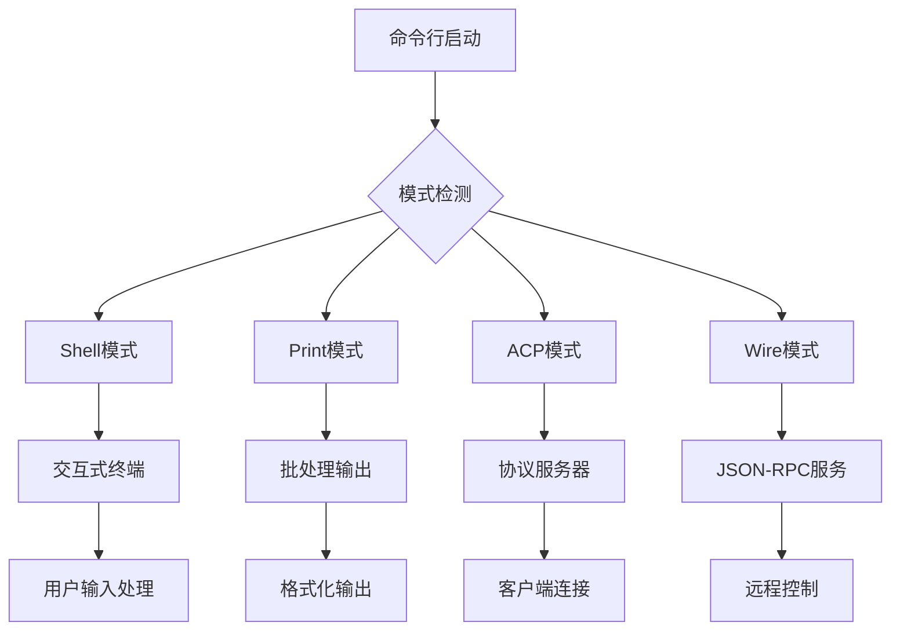

**图表来源**
- [cli.py](file://src/kimi_cli/cli.py#L208-L226)
- [app.py](file://src/kimi_cli/app.py#L300-L316)

## 模式识别与选择机制

### 模式选择逻辑

Kimi CLI通过命令行参数中的特殊标志来确定运行模式。系统维护一个特殊标志映射表，用于跟踪哪些模式被激活。

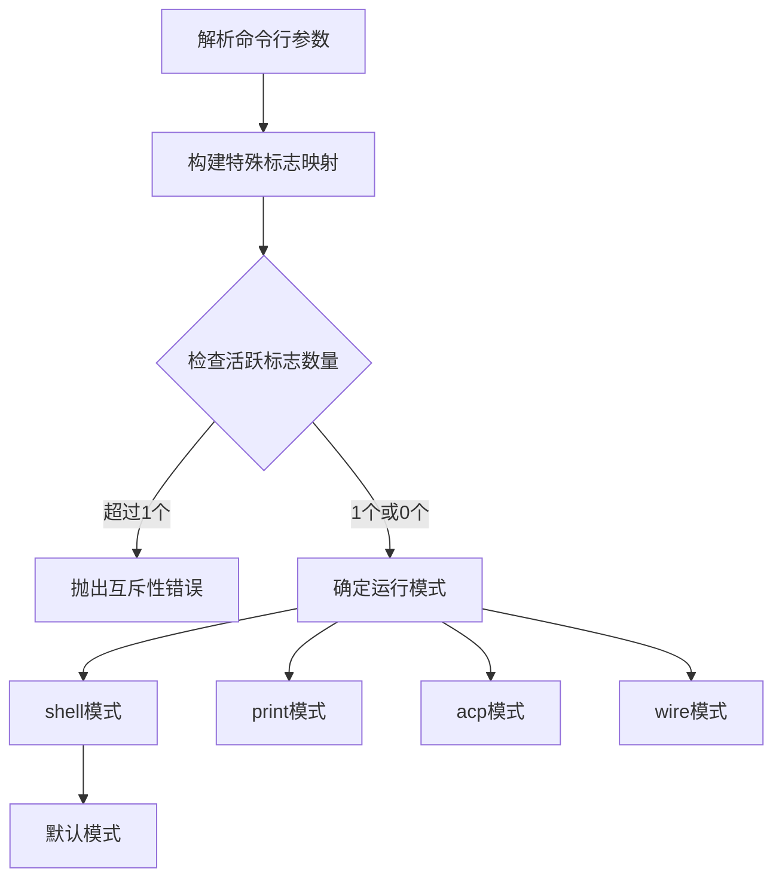

**图表来源**
- [cli.py](file://src/kimi_cli/cli.py#L208-L226)

### 模式映射规则

| 命令行参数 | 模式名称 | 默认值 | 描述 |
|------------|----------|--------|------|
| `--print` | print | false | 启用非交互式打印模式 |
| `--acp` | acp | false | 启用ACP协议服务器 |
| `--wire` | wire | false | 启用Wire协议服务器 |

**节来源**
- [cli.py](file://src/kimi_cli/cli.py#L208-L226)

## Shell模式详解

### 交互式终端特性

Shell模式是Kimi CLI的主要交互方式，提供丰富的命令行界面体验。该模式支持实时输入、自动补全、历史记录等功能。

#### 核心功能特性

1. **实时命令输入**：支持多行输入和语法高亮
2. **智能自动补全**：文件名、命令、参数自动完成
3. **历史记录管理**：命令历史浏览和搜索
4. **元命令系统**：内置的控制命令集合
5. **模式切换**：Agent模式与Shell模式之间的快速切换

#### 模式切换机制

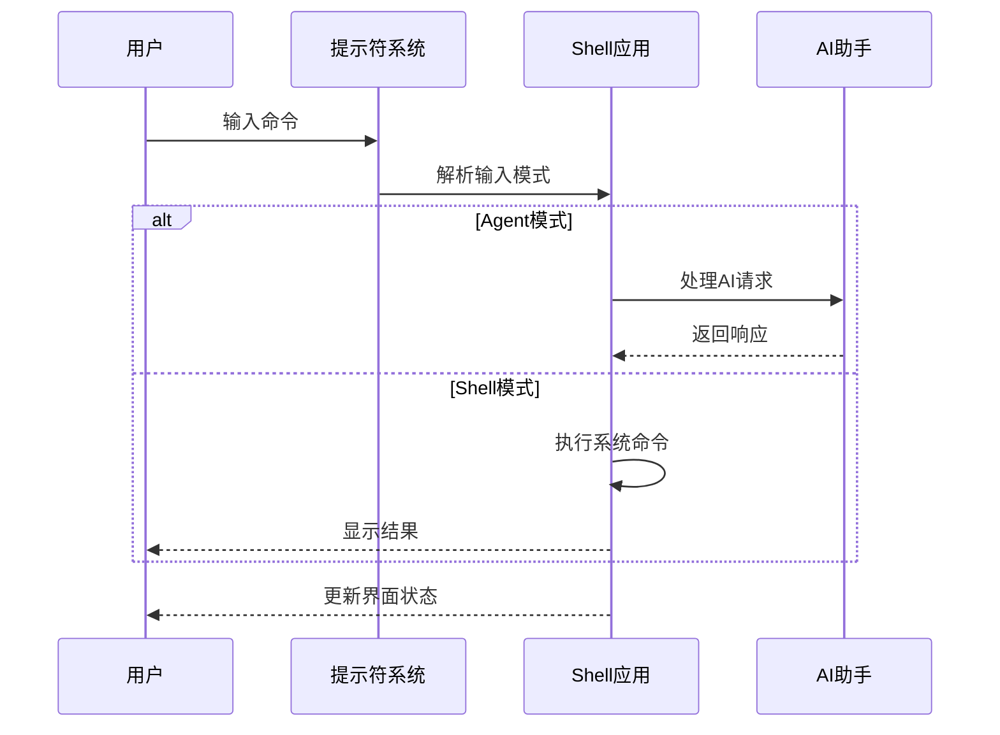

**图表来源**
- [shell/__init__.py](file://src/kimi_cli/ui/shell/__init__.py#L52-L90)

#### 元命令系统

Shell模式支持一系列元命令，用于系统管理和配置：

| 元命令 | 功能描述 | 使用场景 |
|--------|----------|----------|
| `/help` | 显示帮助信息 | 学习新功能 |
| `/setup` | 配置向导 | 初始化设置 |
| `/exit` | 退出程序 | 结束会话 |
| `/clear` | 清屏 | 整理界面 |
| `/history` | 显示历史记录 | 查看过往命令 |
| `/mode` | 切换模式 | 快速模式转换 |

**节来源**
- [shell/__init__.py](file://src/kimi_cli/ui/shell/__init__.py#L121-L158)

### Shell模式的启动流程

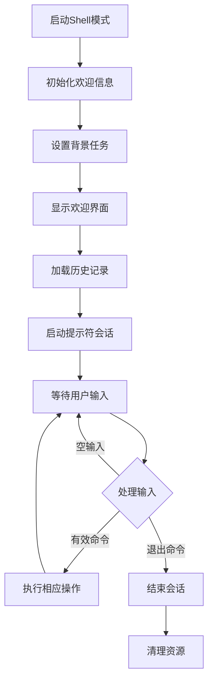

**图表来源**
- [shell/__init__.py](file://src/kimi_cli/ui/shell/__init__.py#L35-L92)

**节来源**
- [shell/__init__.py](file://src/kimi_cli/ui/shell/__init__.py#L29-L92)

## Print模式详解

### 非交互式脚本集成能力

Print模式专为自动化和脚本集成设计，提供结构化的输出格式和批量处理能力。该模式具有隐式的`yolo`行为，意味着所有操作都会自动批准。

#### 输出格式支持

Print模式支持两种主要的输出格式：

1. **文本格式**：直接的纯文本输出
2. **流式JSON格式**：结构化的JSON消息流

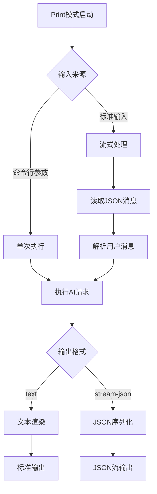

**图表来源**
- [print/__init__.py](file://src/kimi_cli/ui/print/__init__.py#L44-L82)
- [print/visualize.py](file://src/kimi_cli/ui/print/visualize.py#L112-L129)

#### 隐式Yolo行为

Print模式的一个重要特性是隐式的`yolo`行为，这意味着：

- 所有工具调用都会自动批准
- 不需要用户交互确认
- 适合无人值守的自动化场景

这种设计使得Print模式特别适合：
- CI/CD流水线集成
- 批处理作业
- 数据处理管道
- 自动化脚本

**节来源**
- [print/__init__.py](file://src/kimi_cli/ui/print/__init__.py#L44-L82)
- [cli.py](file://src/kimi_cli/cli.py#L294)

### Print模式的输入处理

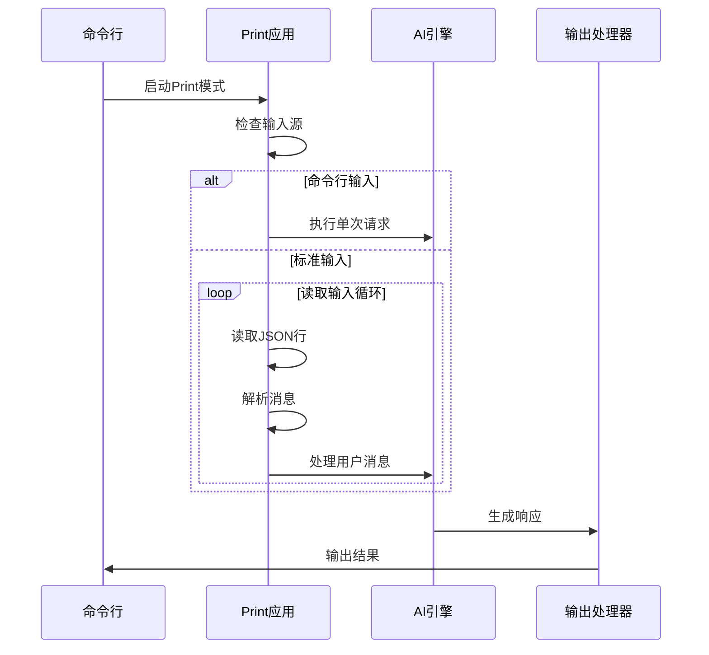

**图表来源**
- [print/__init__.py](file://src/kimi_cli/ui/print/__init__.py#L54-L82)

**节来源**
- [print/__init__.py](file://src/kimi_cli/ui/print/__init__.py#L44-L127)

## ACP模式详解

### Agent Client Protocol服务器角色

ACP（Agent Client Protocol）模式将Kimi CLI转变为一个标准的Agent Client Protocol服务器，允许外部客户端通过标准化协议与其交互。

#### ACP协议架构

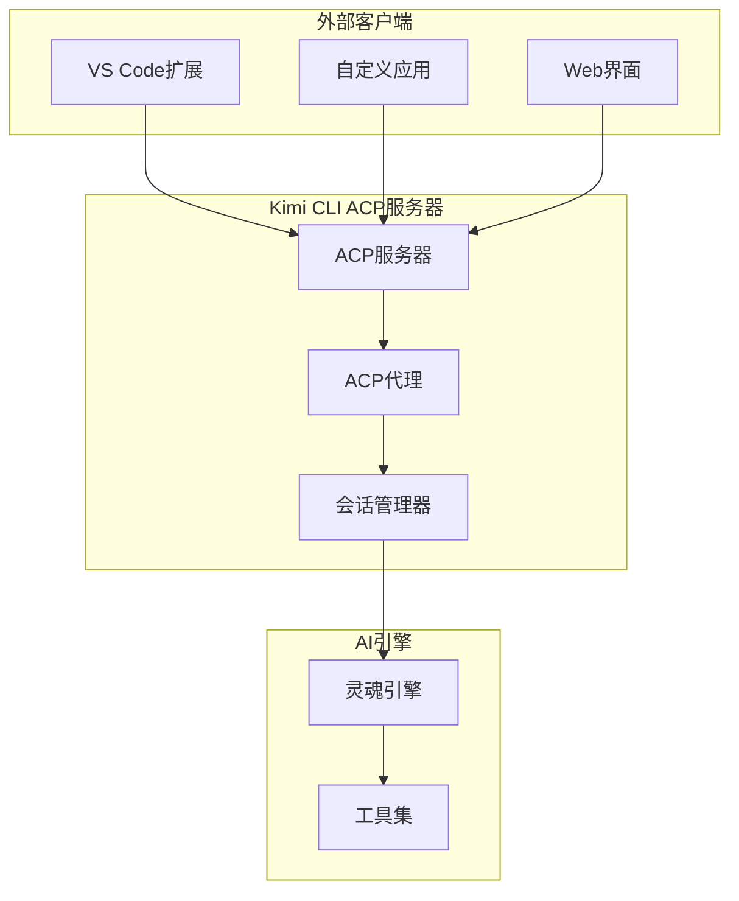

**图表来源**
- [acp/__init__.py](file://src/kimi_cli/ui/acp/__init__.py#L447-L473)

#### 核心功能特性

1. **会话管理**：支持多个并发会话
2. **流式响应**：实时的消息流传输
3. **权限控制**：细粒度的操作审批机制
4. **状态同步**：保持客户端与服务器状态一致

#### ACP消息流处理

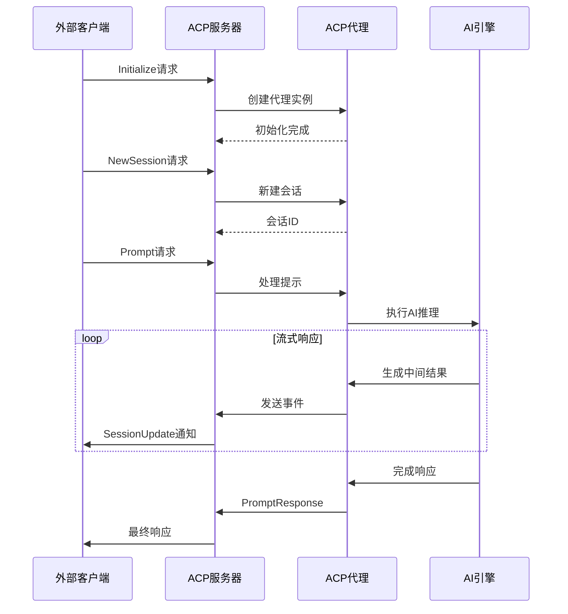

**图表来源**
- [acp/__init__.py](file://src/kimi_cli/ui/acp/__init__.py#L136-L168)

**节来源**
- [acp/__init__.py](file://src/kimi_cli/ui/acp/__init__.py#L74-L473)

## Wire模式详解

### 实验性JSON-RPC服务器功能

Wire模式实现了实验性的JSON-RPC协议，为Kimi CLI提供了一个标准化的远程控制接口。该模式主要用于高级集成场景和自动化控制。

#### JSON-RPC协议实现

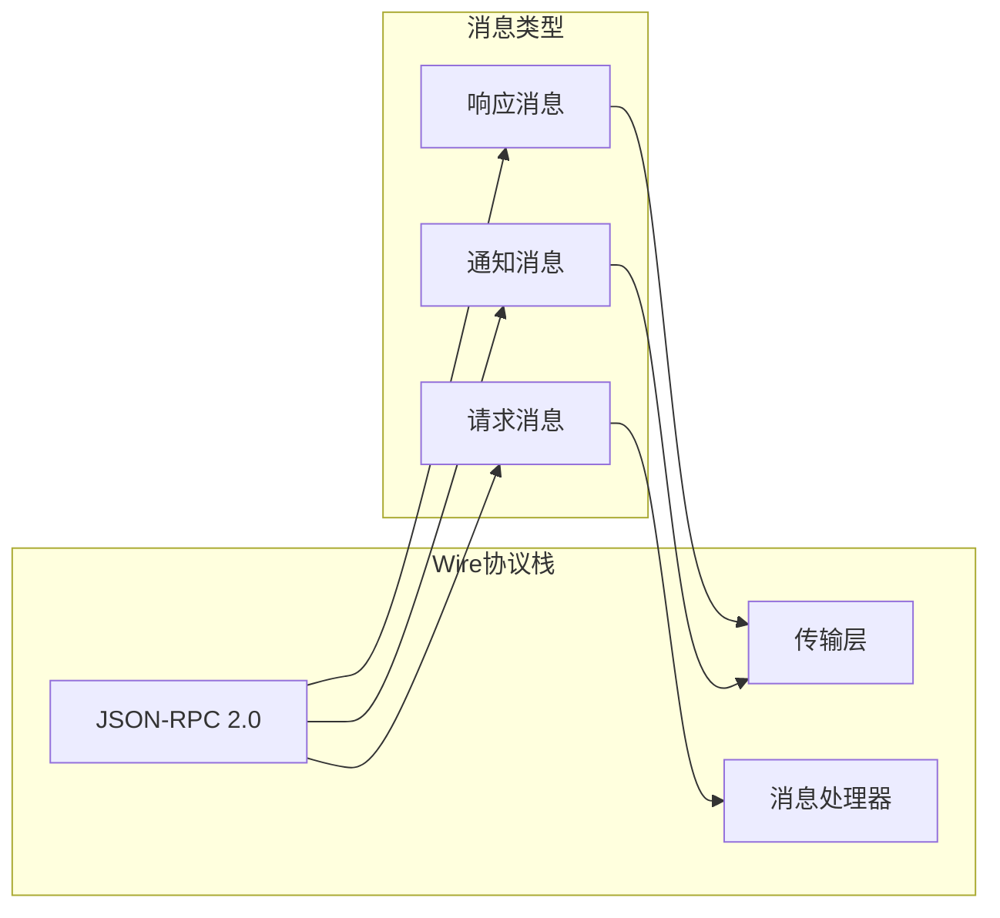

**图表来源**
- [wire/jsonrpc.py](file://src/kimi_cli/ui/wire/jsonrpc.py#L16-L38)

#### 支持的JSON-RPC方法

| 方法名 | 参数 | 返回值 | 功能描述 |
|--------|------|--------|----------|
| `run` | `{"input": string}` | `{"status": string}` | 执行AI请求 |
| `interrupt` | `{}` | `{"status": string}` | 中断当前操作 |
| `event` | `{"type": string, "data": object}` | `{}` | 事件通知 |

#### Wire服务器架构

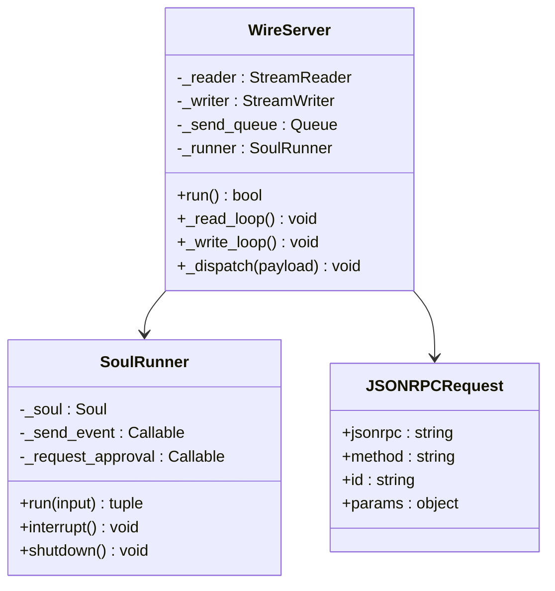

**图表来源**
- [wire/__init__.py](file://src/kimi_cli/ui/wire/__init__.py#L114-L154)

#### Wire模式的消息处理流程

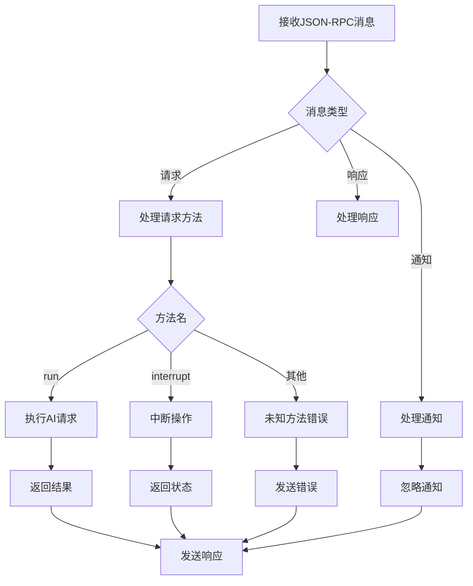

**图表来源**
- [wire/__init__.py](file://src/kimi_cli/ui/wire/__init__.py#L178-L241)

**节来源**
- [wire/__init__.py](file://src/kimi_cli/ui/wire/__init__.py#L114-L343)
- [wire/jsonrpc.py](file://src/kimi_cli/ui/wire/jsonrpc.py#L16-L51)

## 模式间互斥性检查

### active_specials验证机制

Kimi CLI实现了严格的模式互斥性检查，确保同一时间只能激活一种运行模式。这一机制通过`active_specials`列表验证来实现。

#### 互斥性检查流程

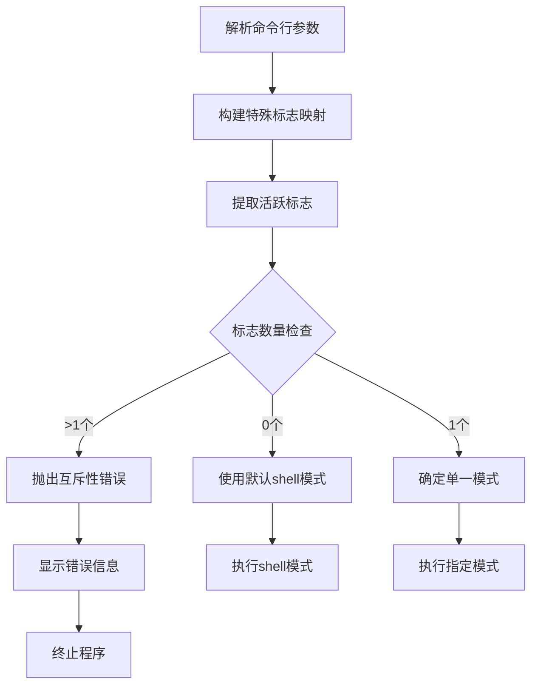

**图表来源**
- [cli.py](file://src/kimi_cli/cli.py#L213-L218)

#### 错误处理机制

当检测到多个模式标志同时激活时，系统会抛出明确的错误信息：

```python
# 错误示例：Cannot combine --print, --acp
raise typer.BadParameter(
    f"Cannot combine {', '.join(active_specials)}.",
    param_hint=active_specials[0],
)
```

这种设计确保了系统的稳定性和可预测性，避免了模式冲突导致的意外行为。

**节来源**
- [cli.py](file://src/kimi_cli/cli.py#L213-L218)

## 配置与使用示例

### Shell模式配置示例

```bash
# 基本交互模式
kimi

# 指定工作目录
kimi --work-dir /path/to/project

# 继续之前的会话
kimi --continue

# 启用调试模式
kimi --debug

# 启用思考模式
kimi --thinking
```

### Print模式配置示例

```bash
# 基本打印模式
kimi --print

# 指定输入格式
echo "Hello World" | kimi --print --input-format stream-json

# 指定输出格式
kimi --print --output-format stream-json

# 自动批准所有操作
kimi --print --yolo

# 结合命令参数
kimi --print --command "分析这个文件"
```

### ACP模式配置示例

```bash
# 启用ACP服务器
kimi --acp

# 指定模型
kimi --acp --model gpt-4

# 指定代理文件
kimi --acp --agent-file ./custom-agent.yaml
```

### Wire模式配置示例

```bash
# 启用Wire服务器
kimi --wire

# 结合其他参数
kimi --wire --model claude-3 --yolo
```

### 模式切换示例

```bash
# 从Shell模式切换到Print模式
# 在Shell中: /mode print

# 从Print模式切换到ACP模式
# 在Print模式下: kimi --acp

# 从ACP模式切换到Wire模式
# 在ACP模式下: kimi --wire
```

## 性能影响与最佳实践

### 模式性能对比

| 模式 | 启动开销 | 内存占用 | CPU使用率 | 适用场景 |
|------|----------|----------|-----------|----------|
| Shell | 中等 | 中等 | 中等 | 开发调试、日常使用 |
| Print | 低 | 低 | 低 | 自动化、批处理 |
| ACP | 高 | 高 | 中等 | 集成开发、插件开发 |
| Wire | 高 | 高 | 中等 | 远程控制、API集成 |

### 最佳实践建议

#### Shell模式最佳实践
1. **合理使用会话管理**：定期保存和恢复会话
2. **配置合适的提示符**：启用历史记录和自动补全
3. **利用元命令**：熟悉各种元命令提高效率

#### Print模式最佳实践
1. **明确输出格式**：根据下游系统选择合适的输出格式
2. **处理错误情况**：在脚本中正确处理各种异常情况
3. **批量处理优化**：对于大量数据处理，考虑分批处理

#### ACP模式最佳实践
1. **连接管理**：妥善处理客户端连接的建立和断开
2. **状态同步**：保持客户端与服务器状态的一致性
3. **错误处理**：提供清晰的错误信息和恢复机制

#### Wire模式最佳实践
1. **协议兼容性**：确保客户端与Wire协议的兼容性
2. **超时处理**：实现合理的超时和重试机制
3. **安全考虑**：注意传输过程中的安全性

### 模式选择决策树

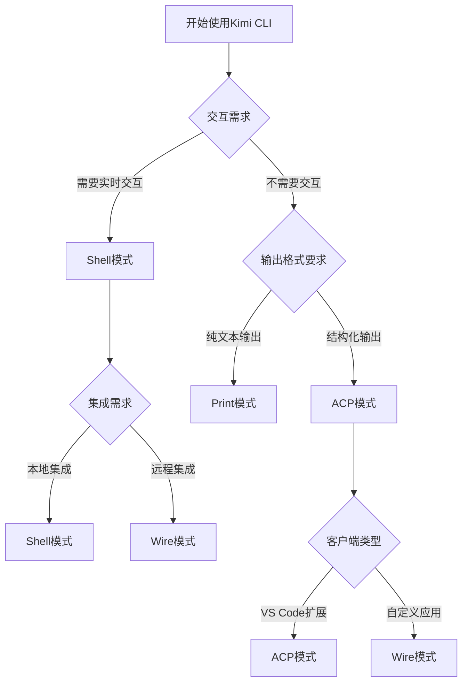

## 故障排除指南

### 常见问题与解决方案

#### Shell模式问题

**问题**：无法进入交互模式
- **原因**：终端环境不支持或权限不足
- **解决方案**：检查终端配置，确保支持富文本输出

**问题**：自动补全功能失效
- **原因**：文件系统权限或路径配置问题
- **解决方案**：检查文件权限，重新初始化Shell环境

#### Print模式问题

**问题**：输出格式不符合预期
- **原因**：未正确指定输出格式参数
- **解决方案**：检查`--output-format`参数设置

**问题**：无限等待输入
- **原因**：标准输入未正确关闭
- **解决方案**：确保输入流正确结束或使用命令行参数

#### ACP模式问题

**问题**：客户端连接失败
- **原因**：端口被占用或防火墙阻止
- **解决方案**：检查端口可用性，配置防火墙规则

**问题**：会话管理异常
- **原因**：并发会话过多或资源泄漏
- **解决方案**：限制并发连接数，定期清理过期会话

#### Wire模式问题

**问题**：JSON-RPC消息解析失败
- **原因**：消息格式不正确或编码问题
- **解决方案**：检查消息格式，确保UTF-8编码

**问题**：远程控制无响应
- **原因**：网络延迟或消息丢失
- **解决方案**：实现心跳机制，增加重试逻辑

### 调试技巧

#### 启用详细日志
```bash
# 启用调试模式
kimi --debug

# 查看特定模块日志
export RUST_LOG=kimi_cli=trace
```

#### 模式诊断
```bash
# 检查当前模式
kimi --print --command "当前运行模式是什么？"

# 测试基本功能
kimi --print --command "你好，世界！"
```

#### 性能监控
```bash
# 监控内存使用
/usr/bin/time -v kimi --print

# 分析CPU使用
perf record kimi --print
```

**节来源**
- [cli.py](file://src/kimi_cli/cli.py#L230-L238)
- [app.py](file://src/kimi_cli/app.py#L136-L216)

## 总结

Kimi CLI的四种运行模式各具特色，适用于不同的使用场景。通过理解每种模式的特点和适用场景，用户可以更好地选择和配置合适的运行模式，从而获得最佳的使用体验。

- **Shell模式**：适合日常交互和开发调试
- **Print模式**：适合自动化和脚本集成
- **ACP模式**：适合插件开发和IDE集成
- **Wire模式**：适合远程控制和API集成

正确的模式选择不仅能够提高工作效率，还能确保系统的稳定性和安全性。随着Kimi CLI功能的不断完善，这些运行模式将继续演进，为用户提供更加丰富和灵活的使用体验。