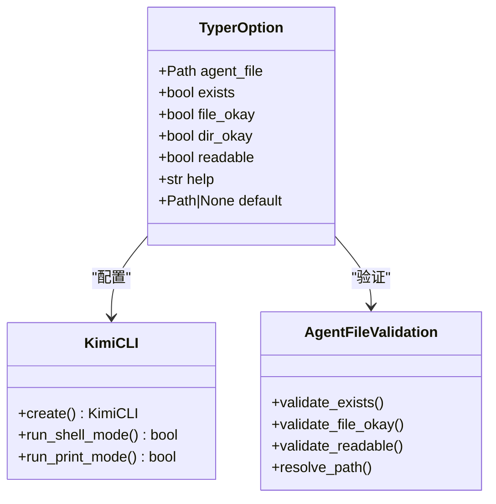
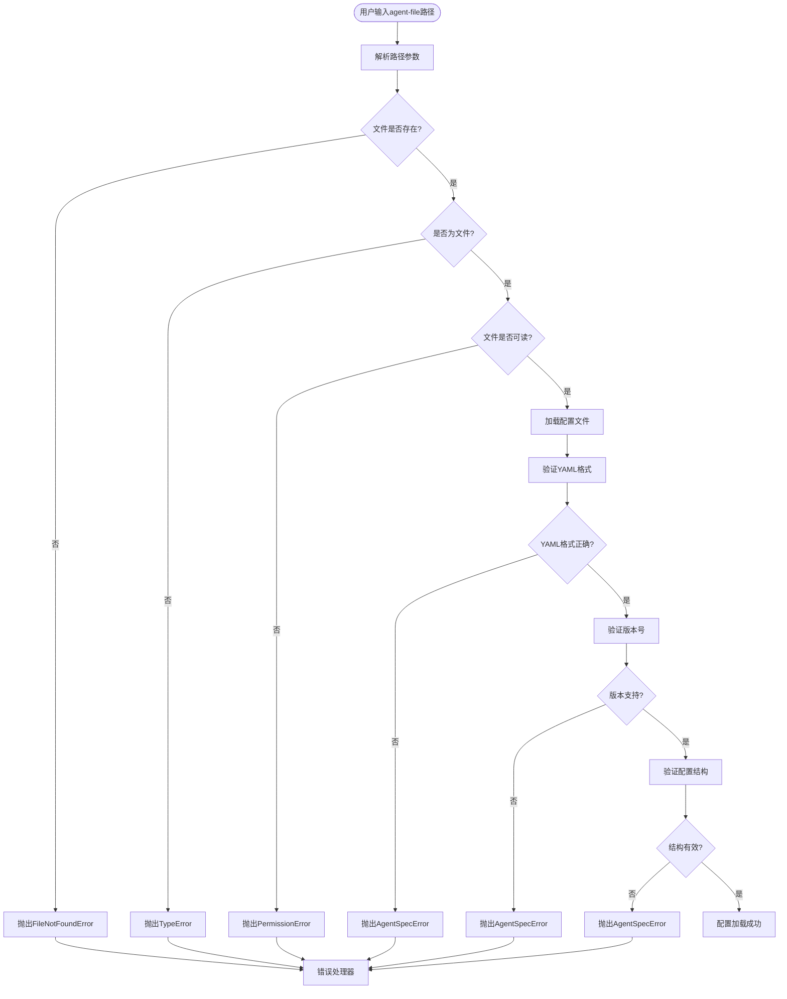
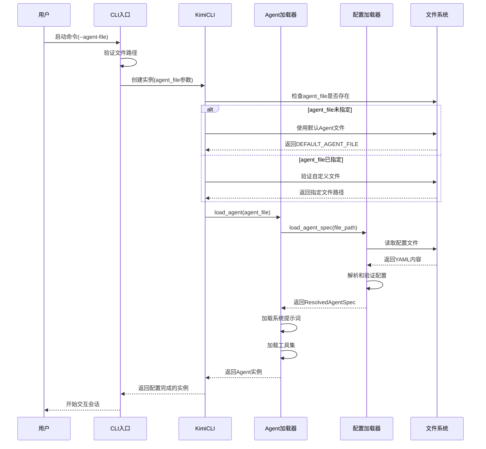
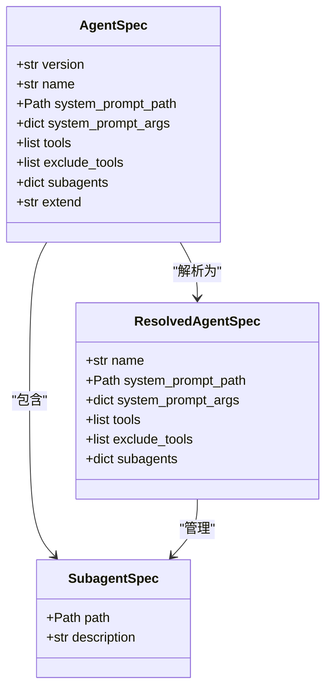
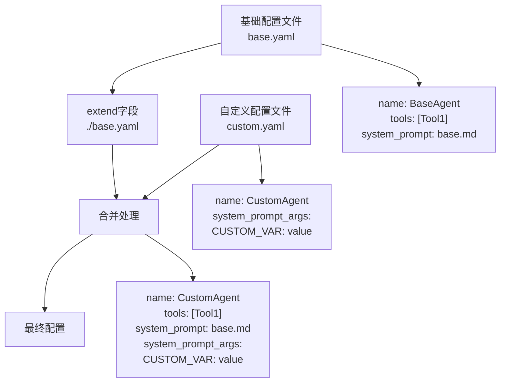
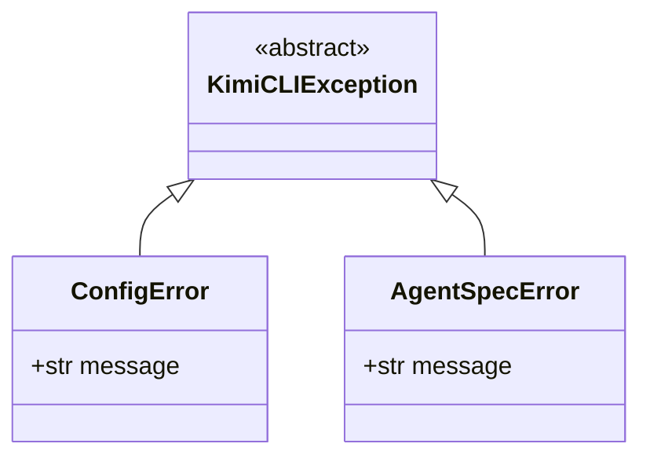

# agent-file选项配置机制详解

<cite>
**本文档引用的文件**
- [cli.py](file://src/kimi_cli/cli.py)
- [agentspec.py](file://src/kimi_cli/agentspec.py)
- [app.py](file://src/kimi_cli/app.py)
- [agent.py](file://src/kimi_cli/soul/agent.py)
- [exception.py](file://src/kimi_cli/exception.py)
- [agent.yaml](file://src/kimi_cli/agents/default/agent.yaml)
- [system.md](file://src/kimi_cli/agents/default/system.md)
- [sub.yaml](file://src/kimi_cli/agents/default/sub.yaml)
- [test_load_agent.py](file://tests/test_load_agent.py)
- [test_agent_spec.py](file://tests/test_agent_spec.py)
</cite>

## 目录
1. [概述](#概述)
2. [CLI选项定义](#cli选项定义)
3. [文件验证机制](#文件验证机制)
4. [配置加载流程](#配置加载流程)
5. [Agent配置文件结构](#agent配置文件结构)
6. [配置继承与扩展](#配置继承与扩展)
7. [错误处理策略](#错误处理策略)
8. [自定义Agent配置示例](#自定义agent配置示例)
9. [故障排除指南](#故障排除指南)
10. [最佳实践建议](#最佳实践建议)

## 概述

`--agent-file`选项是Kimi CLI中的一个关键配置机制，允许用户指定自定义的Agent配置文件来覆盖内置的默认Agent行为。该选项通过Typer框架提供的严格文件验证机制确保配置文件的有效性和安全性。

## CLI选项定义

### 选项参数配置

在`cli.py`文件中，`--agent-file`选项通过`typer.Option`装饰器进行定义：



**图表来源**
- [cli.py](file://src/kimi_cli/cli.py#L64-L74)

### 关键验证参数

`--agent-file`选项使用以下验证参数：

| 参数 | 类型 | 默认值 | 描述 |
|------|------|--------|------|
| `exists` | `bool` | `True` | 确保文件存在 |
| `file_okay` | `bool` | `True` | 允许文件类型 |
| `dir_okay` | `bool` | `False` | 禁止目录类型 |
| `readable` | `bool` | `True` | 确保文件可读 |

**节来源**
- [cli.py](file://src/kimi_cli/cli.py#L64-L74)

## 文件验证机制

### 验证流程架构



**图表来源**
- [agentspec.py](file://src/kimi_cli/agentspec.py#L81-L119)
- [app.py](file://src/kimi_cli/app.py#L86-L88)

### 验证实现细节

文件验证通过以下步骤确保配置文件的安全性：

1. **路径解析验证**：确保提供的路径指向有效的文件
2. **权限检查**：验证文件具有适当的读取权限
3. **格式验证**：使用`yaml.safe_load()`确保YAML格式正确
4. **版本兼容性**：检查配置文件版本是否受支持
5. **结构完整性**：验证必需字段的存在和有效性

**节来源**
- [agentspec.py](file://src/kimi_cli/agentspec.py#L81-L119)

## 配置加载流程

### 加载顺序与优先级



**图表来源**
- [app.py](file://src/kimi_cli/app.py#L35-L89)
- [agent.py](file://src/kimi_cli/soul/agent.py#L32-L80)

### 默认行为机制

当未指定`--agent-file`选项时，系统自动使用内置的默认Agent配置：

**节来源**
- [app.py](file://src/kimi_cli/app.py#L86-L88)

## Agent配置文件结构

### YAML配置架构

Agent配置文件采用标准化的YAML结构，包含以下关键字段：



**图表来源**
- [agentspec.py](file://src/kimi_cli/agentspec.py#L20-L53)

### 核心配置字段详解

| 字段名 | 类型 | 必需 | 描述 |
|--------|------|------|------|
| `version` | `int` | 是 | 配置文件版本号（当前支持版本1） |
| `agent.name` | `str` | 是 | Agent名称标识符 |
| `agent.system_prompt_path` | `Path` | 是 | 系统提示词文件路径 |
| `agent.system_prompt_args` | `dict` | 否 | 提示词参数映射表 |
| `agent.tools` | `list[str]` | 是 | 启用的工具列表 |
| `agent.exclude_tools` | `list[str]` | 否 | 排除的工具列表 |
| `agent.subagents` | `dict` | 否 | 子Agent配置字典 |
| `agent.extend` | `str` | 否 | 继承的基础配置文件 |

**节来源**
- [agentspec.py](file://src/kimi_cli/agentspec.py#L20-L53)
- [agent.yaml](file://src/kimi_cli/agents/default/agent.yaml#L1-L25)

### 系统提示词模板

系统提示词支持模板变量替换，主要内置变量包括：

| 变量名 | 描述 | 示例值 |
|--------|------|--------|
| `${KIMI_WORK_DIR}` | 当前工作目录 | `/home/user/project` |
| `${KIMI_NOW}` | 当前时间戳 | `2024-01-15T10:30:00Z` |
| `${KIMI_WORK_DIR_LS}` | 目录列表 | `README.md<br/>src/<br/>tests/` |
| `${KIMI_AGENTS_MD}` | AGENTS.md内容 | 项目相关信息 |

**节来源**
- [system.md](file://src/kimi_cli/agents/default/system.md#L1-L73)

## 配置继承与扩展

### 继承机制实现



**图表来源**
- [agentspec.py](file://src/kimi_cli/agentspec.py#L100-L118)

### 继承规则

配置继承遵循以下优先级规则：

1. **字段覆盖**：自定义配置直接覆盖基础配置的对应字段
2. **参数合并**：`system_prompt_args`采用合并而非完全覆盖
3. **工具组合**：`tools`列表通过排除机制组合
4. **递归处理**：支持多层继承链的递归解析

**节来源**
- [agentspec.py](file://src/kimi_cli/agentspec.py#L100-L118)

## 错误处理策略

### 异常层次结构



**图表来源**
- [exception.py](file://src/kimi_cli/exception.py#L4-L19)

### 常见错误类型

| 错误类型 | 异常类 | 触发条件 | 解决方案 |
|----------|--------|----------|----------|
| 文件不存在 | `FileNotFoundError` | 指定的agent-file路径不存在 | 检查文件路径拼写，确认文件存在 |
| 非文件对象 | `TypeError` | 路径指向目录而非文件 | 提供正确的文件路径 |
| 权限不足 | `PermissionError` | 文件无读取权限 | 修改文件权限或使用有权限的用户 |
| YAML格式错误 | `AgentSpecError` | 配置文件YAML语法错误 | 修复YAML语法，确保格式正确 |
| 版本不支持 | `AgentSpecError` | 配置文件版本号不被支持 | 更新配置文件版本号或升级软件 |
| 结构缺失 | `AgentSpecError` | 必需字段缺失 | 添加缺失的必需字段 |
| 工具无效 | `ValueError` | 工具路径无法导入 | 检查工具路径和依赖项 |

**节来源**
- [exception.py](file://src/kimi_cli/exception.py#L16-L19)
- [agentspec.py](file://src/kimi_cli/agentspec.py#L55-L78)

### 错误恢复机制

系统提供多层次的错误恢复策略：

1. **优雅降级**：当自定义配置失败时，自动回退到默认配置
2. **详细诊断**：提供具体的错误信息和修复建议
3. **日志记录**：记录详细的错误堆栈和上下文信息
4. **用户引导**：提供清晰的错误消息和解决步骤

**节来源**
- [app.py](file://src/kimi_cli/app.py#L47-L50)

## 自定义Agent配置示例

### 基础自定义配置

以下是一个完整的自定义Agent配置示例：

```yaml
# 自定义Agent配置示例
version: 1
agent:
  name: "开发助手"
  system_prompt_path: ./developer-prompt.md
  system_prompt_args:
    ROLE_ADDITIONAL: |
      你是一个专注于软件开发的AI助手，擅长代码审查、调试和重构。
    DEVELOPMENT_ENV: "Python Flask应用"
    CODE_STANDARDS: "PEP 8标准，包含单元测试"
  tools:
    - "kimi_cli.tools.bash:Bash"
    - "kimi_cli.tools.file:ReadFile"
    - "kimi_cli.tools.file:WriteFile"
    - "kimi_cli.tools.file:Grep"
    - "kimi_cli.tools.web:SearchWeb"
    - "kimi_cli.tools.task:Task"
  exclude_tools:
    - "kimi_cli.tools.todo:SetTodoList"
    - "kimi_cli.tools.dmail:SendDMail"
```

### 高级配置示例

```yaml
# 高级Agent配置示例
version: 1
agent:
  extend: ./base-agent.yaml
  name: "全栈开发专家"
  system_prompt_args:
    ROLE_ADDITIONAL: |
      你是一个经验丰富的全栈开发者，能够处理前端、后端和数据库相关的所有任务。
    PROJECT_TYPE: "全栈Web应用"
    TECHNOLOGY_STACK: "React + Django + PostgreSQL"
  tools:
    - "kimi_cli.tools.web:FetchURL"
    - "kimi_cli.tools.file:StrReplaceFile"
  subagents:
    frontend:
      path: ./frontend-subagent.yaml
      description: "专门处理前端开发任务"
    backend:
      path: ./backend-subagent.yaml
      description: "专门处理后端开发任务"
```

### 子Agent配置示例

```yaml
# 子Agent配置示例
version: 1
agent:
  extend: ./agent.yaml
  system_prompt_args:
    ROLE_ADDITIONAL: |
      你是一个专门处理前端开发任务的子Agent。
      所有的`user`消息都由主Agent发送。主Agent无法看到你的上下文，
      它只能看到你在完成任务时的最后一条消息。你需要在最终消息中提供
      你已经完成的工作和学习的综合总结。如果你编写或修改了任何文件，
      你必须在摘要中提及它们。
  exclude_tools:
    - "kimi_cli.tools.task:Task"
    - "kimi_cli.tools.bash:Bash"
    - "kimi_cli.tools.web:SearchWeb"
```

**节来源**
- [agent.yaml](file://src/kimi_cli/agents/default/agent.yaml#L1-L25)
- [sub.yaml](file://src/kimi_cli/agents/default/sub.yaml#L1-L12)

## 故障排除指南

### 常见问题及解决方案

#### 1. 配置文件加载失败

**症状**：启动时出现"Agent配置加载失败"错误

**可能原因**：
- YAML语法错误
- 文件编码问题
- 路径解析错误

**解决方案**：
```bash
# 检查YAML语法
python -c "import yaml; print(yaml.safe_load(open('agent.yaml')))"

# 验证文件编码
file agent.yaml

# 使用绝对路径
kimi --agent-file /full/path/to/agent.yaml
```

#### 2. 工具加载失败

**症状**：工具无法正常工作或报错

**可能原因**：
- 工具路径错误
- 依赖项缺失
- 权限问题

**解决方案**：
```bash
# 检查工具路径
python -c "from kimi_cli.tools.file import ReadFile; print(ReadFile.__name__)"

# 验证依赖安装
pip list | grep kimi-cli

# 检查文件权限
ls -la agent.yaml
```

#### 3. 系统提示词模板变量无效

**症状**：提示词中模板变量未正确替换

**可能原因**：
- 变量名拼写错误
- 变量值为空
- 模板语法错误

**解决方案**：
```bash
# 检查模板语法
cat system.md | grep "\$\{.*\}"

# 验证变量定义
grep -r "system_prompt_args" agent.yaml
```

### 调试技巧

#### 启用详细日志

```bash
# 启用调试模式
kimi --debug --agent-file custom.yaml

# 查看日志文件
tail -f ~/.local/share/kimi/logs/kimi.log
```

#### 配置验证脚本

```python
#!/usr/bin/env python3
"""Agent配置验证脚本"""

import sys
from pathlib import Path
import yaml
from kimi_cli.agentspec import load_agent_spec

def validate_agent_config(config_path: str):
    """验证Agent配置文件"""
    try:
        path = Path(config_path)
        if not path.exists():
            print(f"错误: 配置文件不存在 - {config_path}")
            return False
        
        spec = load_agent_spec(path)
        print(f"✓ 配置验证成功")
        print(f"  Agent名称: {spec.name}")
        print(f"  使用工具: {len(spec.tools)}个")
        print(f"  排除工具: {len(spec.exclude_tools)}个")
        return True
        
    except Exception as e:
        print(f"✗ 配置验证失败: {e}")
        return False

if __name__ == "__main__":
    if len(sys.argv) != 2:
        print("用法: python validate_agent.py <agent_config.yaml>")
        sys.exit(1)
    
    validate_agent_config(sys.argv[1])
```

**节来源**
- [test_load_agent.py](file://tests/test_load_agent.py#L73-L78)

## 最佳实践建议

### 配置文件组织

1. **模块化设计**：将通用配置提取到基础文件，通过继承复用
2. **版本控制**：将Agent配置文件纳入版本控制系统
3. **命名规范**：使用有意义的文件名和目录结构
4. **文档注释**：在配置文件中添加必要的注释说明

### 性能优化

1. **工具选择**：根据具体需求选择合适的工具，避免不必要的工具加载
2. **缓存策略**：合理利用系统提示词缓存机制
3. **资源管理**：监控Agent内存使用情况，及时清理临时文件

### 安全考虑

1. **权限最小化**：只授予Agent必要的文件系统权限
2. **输入验证**：对用户输入进行严格的验证和过滤
3. **审计日志**：记录Agent的关键操作以便审计
4. **沙箱隔离**：在受限环境中运行Agent以提高安全性

### 维护建议

1. **定期更新**：保持Agent配置与最新功能同步
2. **测试验证**：在生产环境部署前充分测试配置
3. **备份策略**：定期备份重要的Agent配置文件
4. **监控告警**：建立配置异常的监控和告警机制

通过遵循这些最佳实践，可以确保Agent配置的稳定性、安全性和可维护性，充分发挥Kimi CLI的强大功能。