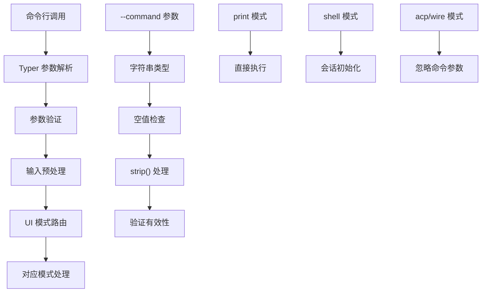
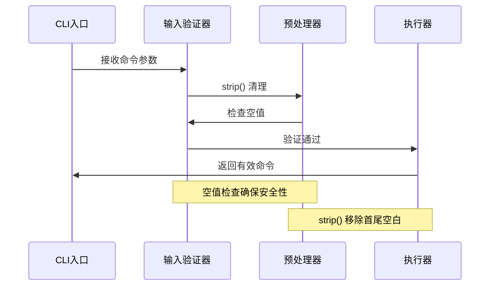
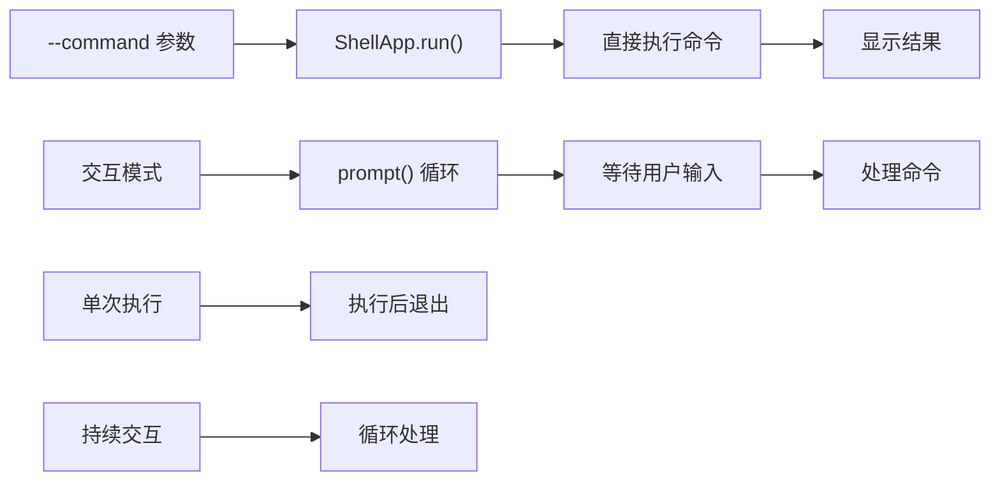
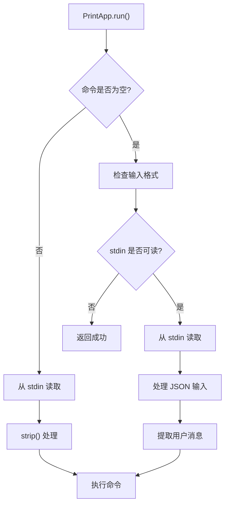
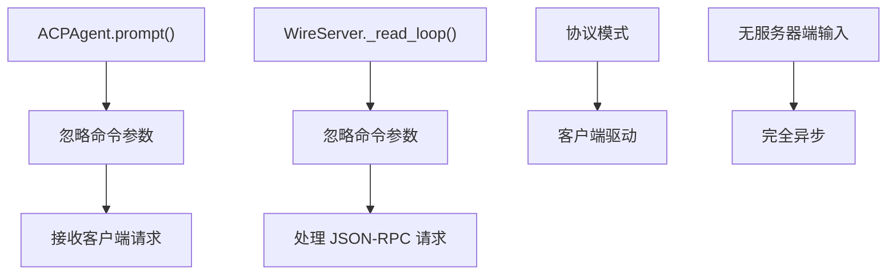
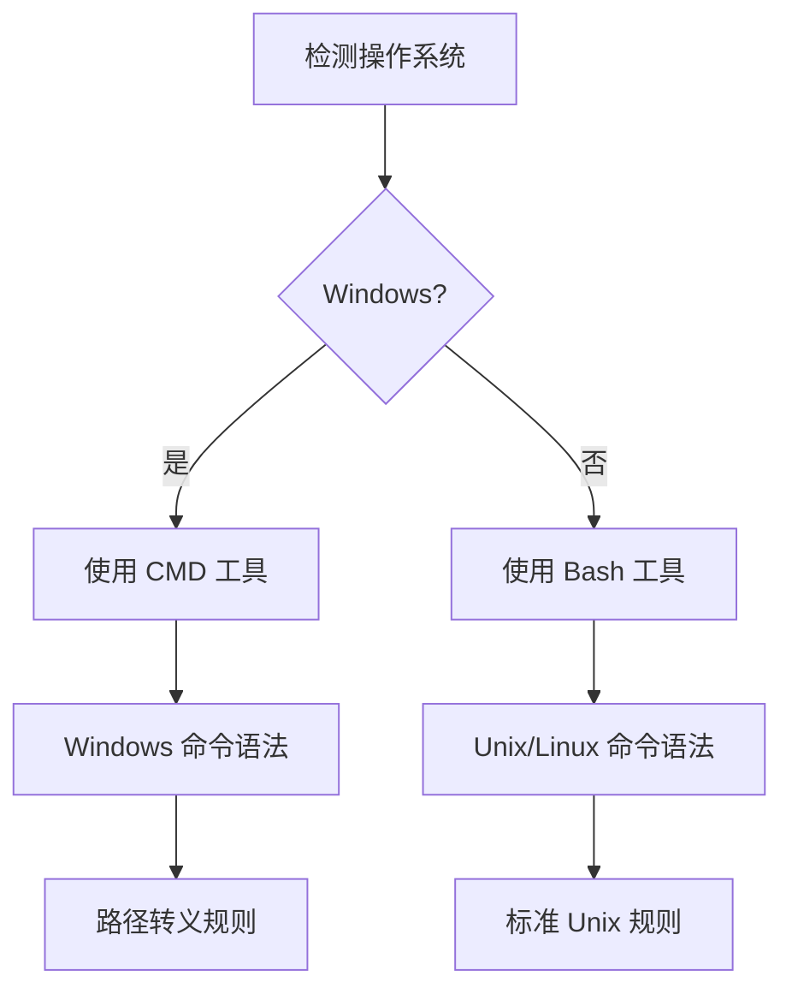
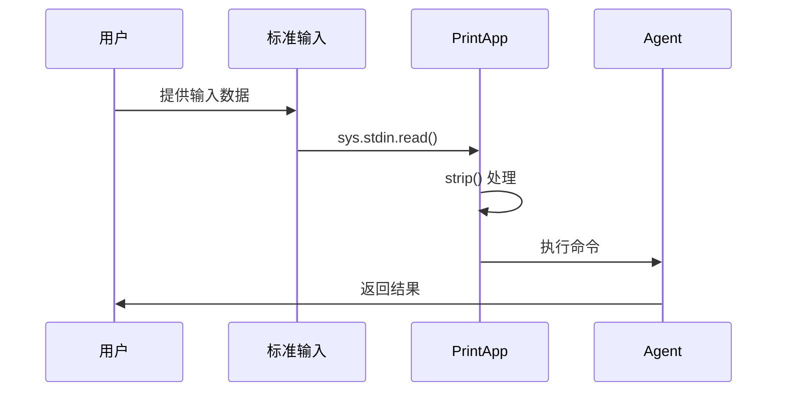
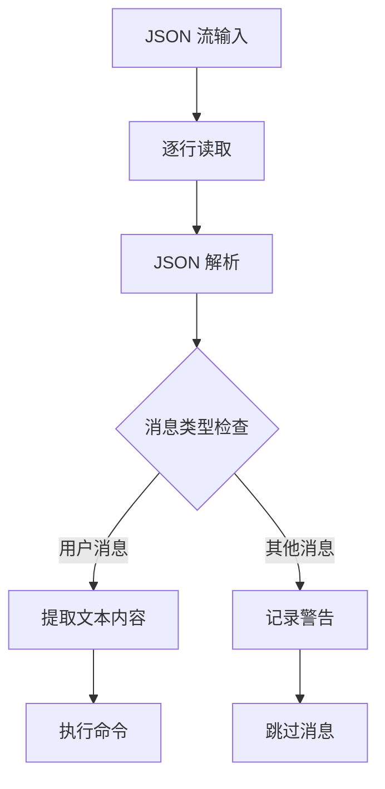

# `--command` 选项输入处理机制和交互模式影响

<cite>
**本文档中引用的文件**
- [cli.py](file://src/kimi_cli/cli.py)
- [app.py](file://src/kimi_cli/app.py)
- [print/__init__.py](file://src/kimi_cli/ui/print/__init__.py)
- [shell/__init__.py](file://src/kimi_cli/ui/shell/__init__.py)
- [acp/__init__.py](file://src/kimi_cli/ui/acp/__init__.py)
- [wire/jsonrpc.py](file://src/kimi_cli/ui/wire/jsonrpc.py)
- [config.py](file://src/kimi_cli/config.py)
- [bash/bash.md](file://src/kimi_cli/tools/bash/bash.md)
- [bash/cmd.md](file://src/kimi_cli/tools/bash/cmd.md)
</cite>

## 目录
1. [简介](#简介)
2. [命令行参数处理架构](#命令行参数处理架构)
3. [输入预处理和验证逻辑](#输入预处理和验证逻辑)
4. [UI模式下的行为差异](#ui模式下的行为差异)
5. [复杂命令字符串处理](#复杂命令字符串处理)
6. [管道输入集成](#管道输入集成)
7. [最佳实践指南](#最佳实践指南)
8. [故障排除](#故障排除)

## 简介

`--command` 选项是 kimi-cli 中一个关键的功能特性，它允许用户通过命令行直接传递查询给 AI Agent，从而替代传统的交互式输入方式。该选项支持多种输入格式和处理模式，为自动化脚本和批处理任务提供了强大的支持。

## 命令行参数处理架构

### 参数定义和注册

`--command` 选项在 CLI 模块中被正确定义，支持简短形式 `-c` 和完整形式 `--command`：



**图表来源**
- [cli.py](file://src/kimi_cli/cli.py#L104-L113)

### 参数类型系统

命令行参数使用 Typer 的类型系统进行严格验证：

| 参数属性 | 类型 | 默认值 | 描述 |
|---------|------|--------|------|
| `command` | `str \| None` | `None` | 用户查询文本 |
| `--command/-c` | `str` | - | 主要命令参数 |
| `--query/-q` | `str` | - | 别名参数 |

**段落来源**
- [cli.py](file://src/kimi_cli/cli.py#L104-L113)

## 输入预处理和验证逻辑

### 核心验证流程

`--command` 选项的输入处理遵循严格的预处理和验证流程：



**图表来源**
- [cli.py](file://src/kimi_cli/cli.py#L254-L257)

### 验证规则详解

1. **空值检查**：确保命令不为空字符串
2. **空白字符处理**：自动移除首尾空白字符
3. **类型安全**：强制字符串类型转换
4. **错误处理**：提供明确的错误信息

**段落来源**
- [cli.py](file://src/kimi_cli/cli.py#L254-L257)

## UI模式下的行为差异

### Shell 模式行为

在 shell 交互模式下，`--command` 参数作为初始查询传递给 Agent：



**图表来源**
- [shell/__init__.py](file://src/kimi_cli/ui/shell/__init__.py#L35-L40)

### Print 模式行为

Print 模式具有特殊的输入处理机制：



**图表来源**
- [print/__init__.py](file://src/kimi_cli/ui/print/__init__.py#L54-L56)

### ACP 和 Wire 模式行为

在 ACP 和 Wire 协议模式下，`--command` 参数会被忽略：



**图表来源**
- [acp/__init__.py](file://src/kimi_cli/ui/acp/__init__.py#L310-L316)
- [wire/jsonrpc.py](file://src/kimi_cli/ui/wire/jsonrpc.py#L114-L154)

**段落来源**
- [cli.py](file://src/kimi_cli/cli.py#L309-L316)

## 复杂命令字符串处理

### 转义和引用机制

系统支持复杂的命令字符串处理，包括转义序列和引号嵌套：

| 转义类型 | 示例 | 处理方式 |
|---------|------|----------|
| 双引号 | `"Hello \"World\""` | 内部引号转义 |
| 单引号 | `'It'\''s good'` | 内部单引号转义 |
| 反斜杠 | `C:\\Program Files` | 路径分隔符转义 |
| 特殊字符 | `echo $PATH` | 变量展开 |
| 管道操作 | `ls \| grep "pattern"` | 命令链式执行 |

### 平台特定处理

系统根据操作系统平台采用不同的命令处理策略：



**图表来源**
- [bash/bash.md](file://src/kimi_cli/tools/bash/bash.md#L1-L32)
- [bash/cmd.md](file://src/kimi_cli/tools/bash/cmd.md#L1-L32)

**段落来源**
- [bash/bash.md](file://src/kimi_cli/tools/bash/bash.md#L18-L20)
- [bash/cmd.md](file://src/kimi_cli/tools/bash/cmd.md#L15-L19)

## 管道输入集成

### 标准输入处理

Print 模式支持从标准输入读取命令内容：



**图表来源**
- [print/__init__.py](file://src/kimi_cli/ui/print/__init__.py#L54-L56)

### JSON 流处理

对于流式 JSON 输入，系统提供专门的解析机制：



**图表来源**
- [print/__init__.py](file://src/kimi_cli/ui/print/__init__.py#L103-L127)

**段落来源**
- [print/__init__.py](file://src/kimi_cli/ui/print/__init__.py#L103-L127)

## 最佳实践指南

### 命令字符串构建

1. **引号使用**：
   - 使用双引号包围包含空格的路径
   - 对于特殊字符，使用适当的转义
   - 在 Windows 上注意路径分隔符

2. **命令链式执行**：
   - 使用 `&&` 连接成功依赖的命令
   - 使用 `||` 连接失败时的回退命令
   - 使用 `;` 连接不关心执行结果的命令

3. **安全性考虑**：
   - 避免在命令中包含敏感信息
   - 使用环境变量存储密钥
   - 启用 YOLO 模式时谨慎使用

### 自动化脚本集成

```bash
# 基本用法示例
kimi-cli --command "列出当前目录的所有文件" --print

# 管道输入示例
echo "查找所有 Python 文件" | kimi-cli --print

# JSON 流处理示例
cat messages.json | kimi-cli --print --input-format stream-json --output-format text
```

### 错误处理策略

1. **参数验证**：始终检查命令参数的有效性
2. **异常捕获**：处理可能的运行时错误
3. **资源清理**：确保正确释放系统资源

## 故障排除

### 常见问题和解决方案

| 问题类型 | 症状 | 解决方案 |
|---------|------|----------|
| 空命令错误 | "Command cannot be empty" | 检查命令字符串是否为空 |
| 编码问题 | Unicode 错误 | 确保输入使用 UTF-8 编码 |
| 权限问题 | 访问被拒绝 | 检查文件和目录权限 |
| 超时问题 | 命令执行超时 | 增加 timeout 参数值 |

### 调试技巧

1. **启用调试模式**：使用 `--debug` 参数获取详细日志
2. **检查配置**：验证 LLM 配置和 API 密钥
3. **测试简单命令**：从简单的命令开始逐步增加复杂度
4. **监控资源使用**：注意内存和 CPU 使用情况

**段落来源**
- [cli.py](file://src/kimi_cli/cli.py#L256-L257)
- [config.py](file://src/kimi_cli/config.py#L112-L158)