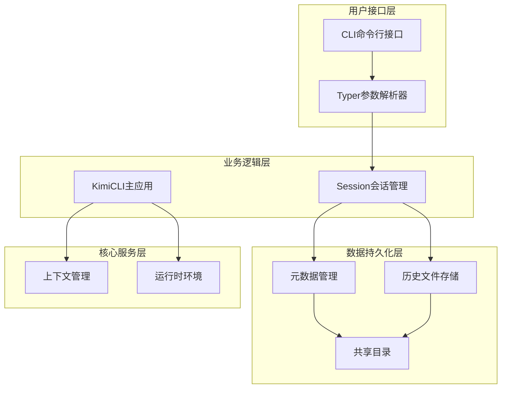
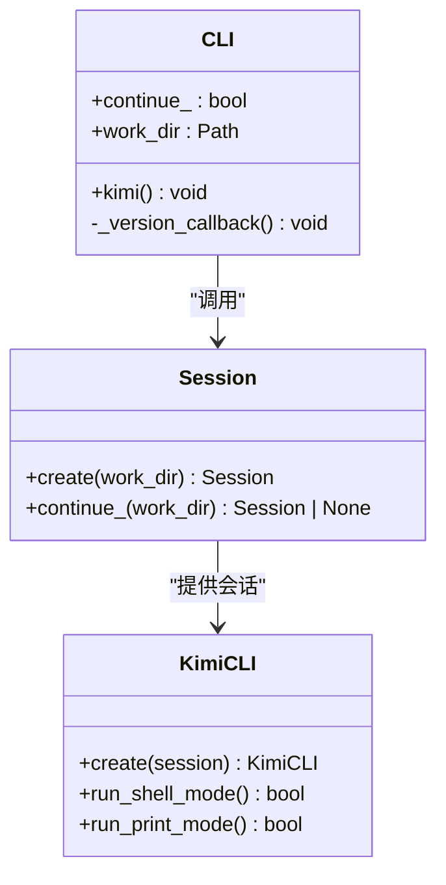
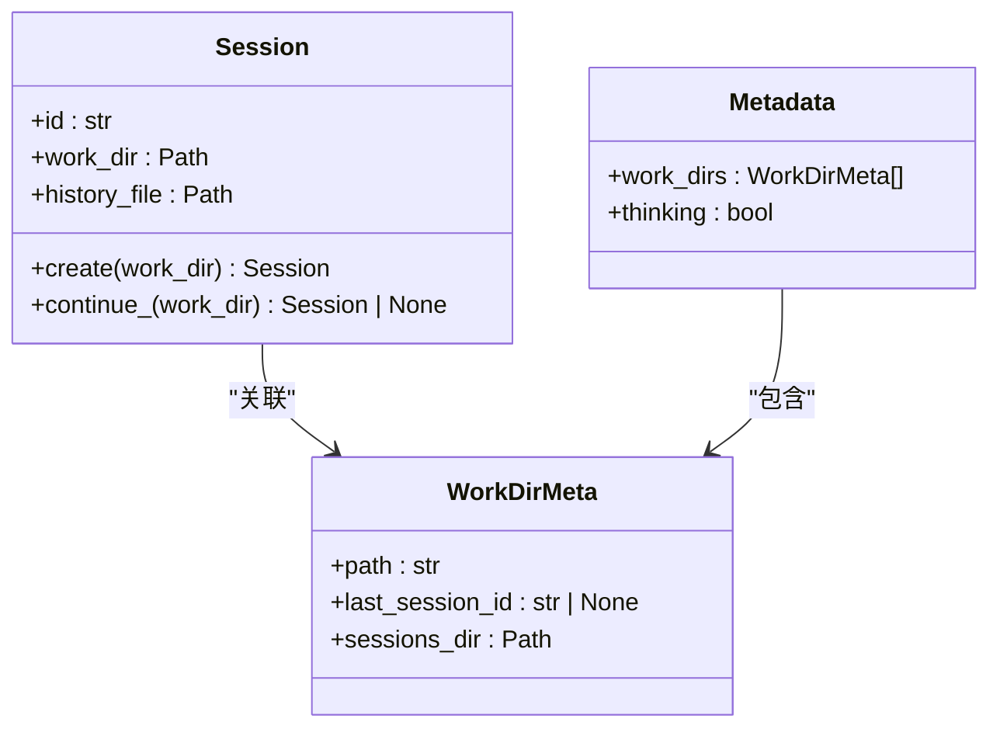
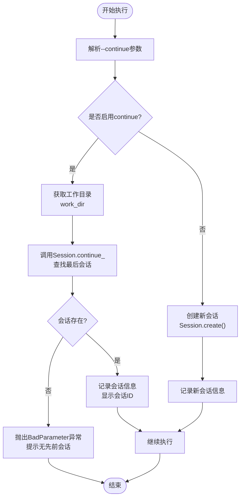
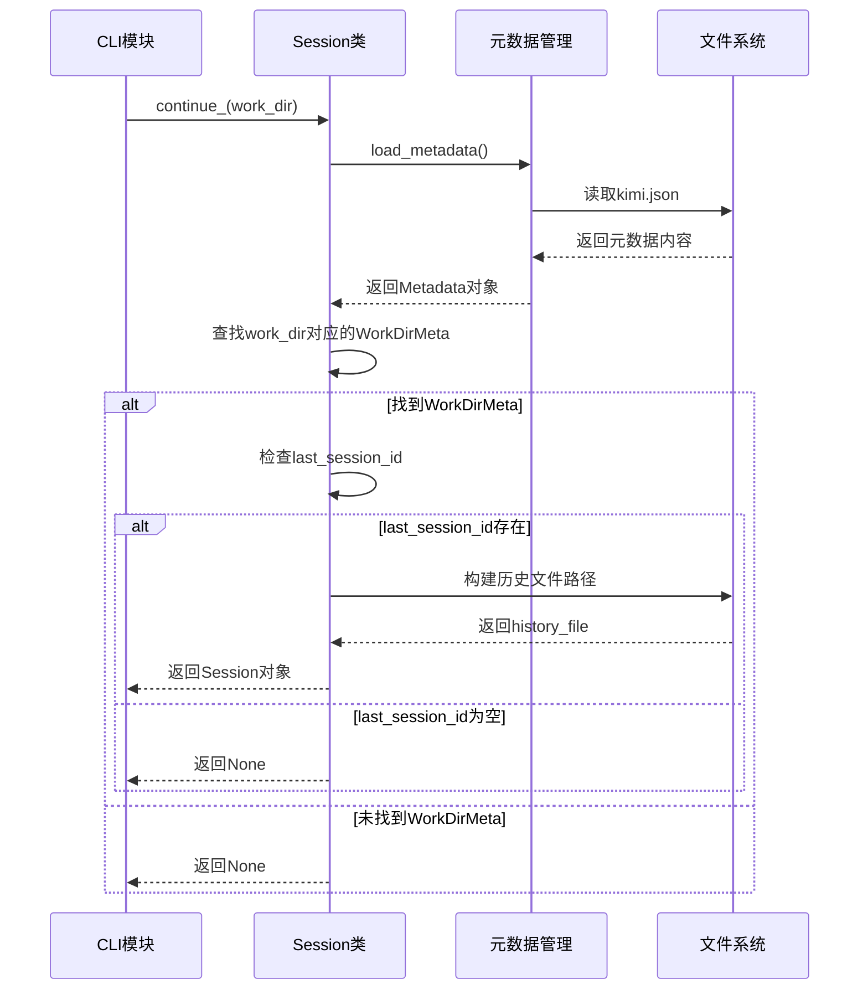
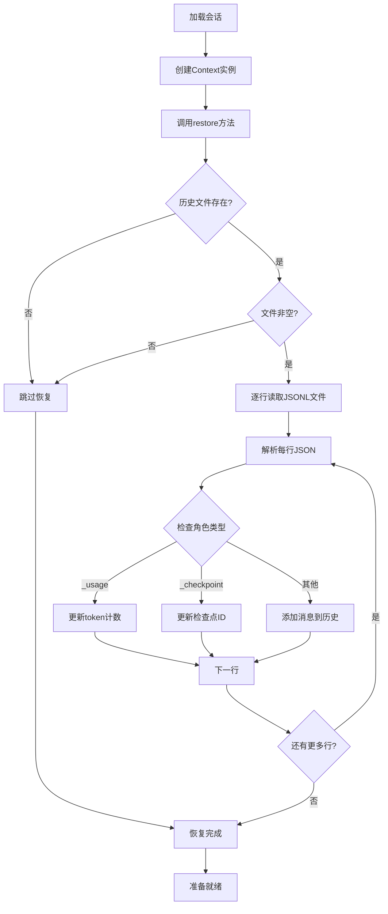
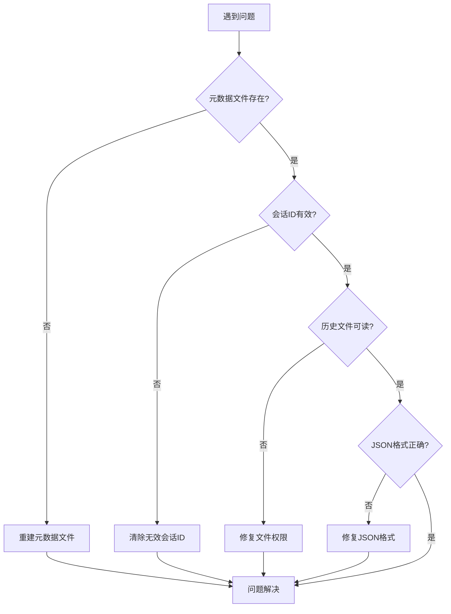
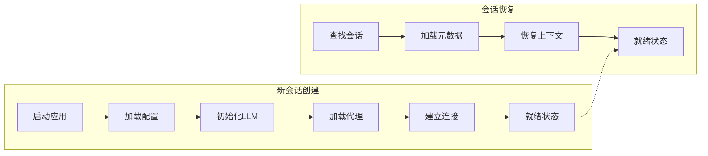
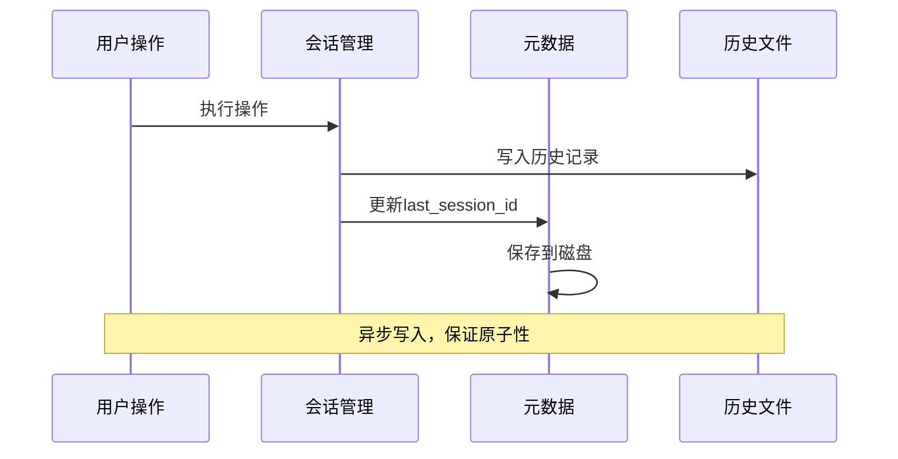

# `--continue`选项会话恢复机制深度解析

<cite>
**本文档引用的文件**
- [cli.py](file://src/kimi_cli/cli.py)
- [session.py](file://src/kimi_cli/session.py)
- [app.py](file://src/kimi_cli/app.py)
- [metadata.py](file://src/kimi_cli/metadata.py)
- [context.py](file://src/kimi_cli/soul/context.py)
- [share.py](file://src/kimi_cli/share.py)
- [test_session.py](file://tests/test_session.py)
</cite>

## 目录
1. [概述](#概述)
2. [系统架构](#系统架构)
3. [核心组件分析](#核心组件分析)
4. [会话恢复流程详解](#会话恢复流程详解)
5. [持久化存储机制](#持久化存储机制)
6. [错误处理与故障排除](#错误处理与故障排除)
7. [新会话vs会话恢复对比](#新会话vs会话恢复对比)
8. [最佳实践与建议](#最佳实践与建议)
9. [总结](#总结)

## 概述

`--continue`选项是kimi-cli中的一个关键功能，它允许用户在不同的命令执行之间保持上下文连续性。当使用`--continue`标志时，系统会基于当前工作目录查找并恢复之前的会话状态，从而实现无缝的对话体验。

该机制的核心价值在于：
- **上下文连续性**：保持对话历史和状态信息
- **效率提升**：避免重复设置和初始化过程
- **用户体验优化**：提供类似聊天应用的流畅交互

## 系统架构

kimi-cli的会话恢复机制采用分层架构设计，确保数据的一致性和可靠性：



**图表来源**
- [cli.py](file://src/kimi_cli/cli.py#L240-L249)
- [session.py](file://src/kimi_cli/session.py#L11-L83)
- [app.py](file://src/kimi_cli/app.py#L25-L102)

## 核心组件分析

### CLI命令行接口

CLI模块负责接收和解析`--continue`参数，这是会话恢复的入口点：



**图表来源**
- [cli.py](file://src/kimi_cli/cli.py#L38-L197)
- [session.py](file://src/kimi_cli/session.py#L11-L83)

### 会话管理器

Session类是会话恢复的核心组件，提供了创建和恢复会话的静态方法：



**图表来源**
- [session.py](file://src/kimi_cli/session.py#L11-L83)
- [metadata.py](file://src/kimi_cli/metadata.py#L17-L58)

**章节来源**
- [cli.py](file://src/kimi_cli/cli.py#L38-L197)
- [session.py](file://src/kimi_cli/session.py#L11-L83)
- [metadata.py](file://src/kimi_cli/metadata.py#L17-L58)

## 会话恢复流程详解

### 参数解析阶段

当用户在命令行中指定`--continue`选项时，CLI模块会进行以下处理：



**图表来源**
- [cli.py](file://src/kimi_cli/cli.py#L240-L249)

### 会话查找算法

`Session.continue_`方法实现了智能的会话查找逻辑：



**图表来源**
- [session.py](file://src/kimi_cli/session.py#L58-L83)
- [metadata.py](file://src/kimi_cli/metadata.py#L43-L58)

### 上下文恢复过程

一旦找到有效的会话，系统会通过Context类恢复对话历史：



**图表来源**
- [context.py](file://src/kimi_cli/soul/context.py#L24-L50)

**章节来源**
- [cli.py](file://src/kimi_cli/cli.py#L240-L249)
- [session.py](file://src/kimi_cli/session.py#L58-L83)
- [context.py](file://src/kimi_cli/soul/context.py#L24-L50)

## 持久化存储机制

### 元数据存储结构

kimi-cli使用JSON格式的元数据文件来跟踪会话信息：

| 字段名 | 类型 | 描述 | 默认值 |
|--------|------|------|--------|
| work_dirs | List[WorkDirMeta] | 工作目录列表 | [] |
| thinking | bool | 最后一次会话是否启用思考模式 | false |

每个工作目录的元数据包含：
| 字段名 | 类型 | 描述 |
|--------|------|------|
| path | str | 工作目录完整路径 |
| last_session_id | str \| None | 最后会话ID或None |
| sessions_dir | Path | 会话历史文件存储目录 |

### 历史文件格式

会话历史以JSON Lines格式存储，每行是一个JSON对象：

```json
{"role": "user", "content": [{"type": "text", "text": "你好"}]}
{"role": "assistant", "content": [{"type": "text", "text": "你好！有什么可以帮助你的？"}]}
{"role": "_usage", "token_count": 123}
{"role": "_checkpoint", "id": 1}
```

特殊标记说明：
- `_usage`：记录token使用统计
- `_checkpoint`：标记检查点位置
- 正常消息：标准的用户/助手消息格式

### 存储路径策略

系统采用基于MD5哈希的目录组织方式：
- 共享目录：`~/.kimi/`
- 元数据文件：`~/.kimi/kimi.json`
- 会话目录：`~/.kimi/sessions/{md5_hash}/`

这种设计的优势：
- 避免大量文件直接存放在根目录
- 提供稳定的目录结构
- 支持大规模并发访问

**章节来源**
- [metadata.py](file://src/kimi_cli/metadata.py#L17-L58)
- [context.py](file://src/kimi_cli/soul/context.py#L36-L74)
- [share.py](file://src/kimi_cli/share.py#L6-L10)

## 错误处理与故障排除

### 常见失败场景

#### 1. 会话不存在

**症状**：`No previous session found for the working directory`

**原因分析**：
- 工作目录从未被使用过
- 当前工作目录没有关联的会话
- 元数据文件被意外删除

**解决方案**：
```bash
# 检查当前工作目录
pwd

# 创建新会话
kimi --work-dir ./your-project

# 或者切换到已知有会话的目录
cd ~/projects/existing-session
kimi --continue
```

#### 2. 历史文件损坏

**症状**：JSON解析错误或文件格式异常

**诊断步骤**：
```bash
# 检查历史文件是否存在且可读
ls -la ~/.kimi/sessions/*/*.jsonl

# 查看文件大小
du -h ~/.kimi/sessions/*/*.jsonl

# 检查JSON格式
python -m json.tool ~/.kimi/sessions/*/your-session-id.jsonl
```

**修复方案**：
- 删除损坏的历史文件，系统会自动创建新的
- 如果重要数据丢失，尝试从备份恢复

#### 3. 权限问题

**症状**：无法写入共享目录或历史文件

**解决方法**：
```bash
# 检查权限
ls -la ~/.kimi/

# 修复权限
chmod -R 755 ~/.kimi/
chown -R $USER:$USER ~/.kimi/
```

### 故障排除流程



### 调试技巧

1. **启用调试日志**：
   ```bash
   kimi --debug --continue
   ```

2. **手动检查元数据**：
   ```bash
   cat ~/.kimi/kimi.json
   ```

3. **验证历史文件**：
   ```bash
   wc -l ~/.kimi/sessions/*/*.jsonl
   head -5 ~/.kimi/sessions/*/*.jsonl
   ```

**章节来源**
- [cli.py](file://src/kimi_cli/cli.py#L244-L246)
- [session.py](file://src/kimi_cli/session.py#L65-L70)
- [context.py](file://src/kimi_cli/soul/context.py#L29-L34)

## 新会话vs会话恢复对比

### 功能特性对比

| 特性 | 新会话创建 | 会话恢复 |
|------|------------|----------|
| 初始化时间 | 较长（需加载配置、建立连接） | 较短（仅恢复状态） |
| 内存占用 | 初始高，后续稳定 | 继承原有状态 |
| 上下文连续性 | 无 | 完整保留 |
| 配置重载 | 必须重新设置 | 保持上次设置 |
| 思考模式 | 默认关闭 | 继承上次状态 |
| 代理文件 | 可指定自定义代理 | 使用上次代理 |

### 性能表现



### 使用场景建议

#### 适合使用`--continue`的情况：
- 在同一项目上进行连续开发
- 需要保持长时间的对话上下文
- 频繁的小规模修改任务
- 需要记住之前的操作历史

#### 适合创建新会话的情况：
- 开始全新的项目或任务
- 需要完全不同的工作环境
- 清除之前的错误状态
- 测试新的配置或代理

### 数据一致性保证

系统通过以下机制确保数据一致性：



**章节来源**
- [cli.py](file://src/kimi_cli/cli.py#L240-L251)
- [app.py](file://src/kimi_cli/app.py#L320-L339)

## 最佳实践与建议

### 会话管理策略

1. **定期清理旧会话**
   - 使用脚本监控会话数量
   - 设置合理的保留期限
   - 备份重要的会话历史

2. **工作目录规划**
   - 为不同类型的项目使用独立的工作目录
   - 建立清晰的目录命名规范
   - 考虑使用符号链接简化访问

3. **配置版本控制**
   - 将代理配置纳入版本控制
   - 记录重要的配置变更
   - 维护配置模板库

### 性能优化建议

1. **合理使用检查点**
   - 在关键操作前后设置检查点
   - 避免过度频繁的检查点创建
   - 定期清理不必要的检查点

2. **内存管理**
   - 监控历史文件大小
   - 实施适当的轮转策略
   - 考虑压缩长期不活跃的会话

3. **网络优化**
   - 启用连接池减少握手开销
   - 使用本地缓存减少网络请求
   - 实施重试机制处理临时故障

### 安全考虑

1. **敏感信息保护**
   - 避在历史文件中记录敏感数据
   - 使用环境变量管理API密钥
   - 定期审查会话访问权限

2. **数据备份**
   - 定期备份元数据文件
   - 跨设备同步重要会话
   - 实施灾难恢复计划

## 总结

kimi-cli的`--continue`选项会话恢复机制是一个精心设计的系统，它通过多层次的数据管理和状态维护，为用户提供了无缝的交互体验。该机制的核心优势包括：

### 技术亮点

1. **智能会话查找**：基于工作目录的精确匹配算法
2. **可靠的数据持久化**：多层备份和验证机制
3. **高效的上下文恢复**：增量加载和懒惰初始化策略
4. **健壮的错误处理**：完善的异常捕获和恢复机制

### 设计哲学

- **用户友好**：最小化用户操作，最大化功能价值
- **性能优先**：快速响应和低资源消耗
- **可扩展性**：模块化设计支持功能扩展
- **可靠性**：多重保障确保数据安全

### 应用价值

该机制不仅提升了用户的操作效率，更重要的是为AI驱动的开发工具树立了新的标准。通过保持上下文连续性和提供可靠的会话管理，kimi-cli真正实现了"智能助手"的价值定位。

对于开发者而言，理解这一机制有助于：
- 更好地利用工具的功能特性
- 优化工作流程和项目管理
- 解决常见的使用问题
- 探索更高级的应用场景

随着AI技术的不断发展，类似的会话恢复机制将成为智能工具的标准配置，而kimi-cli的设计理念和实现方式为此提供了宝贵的参考价值。