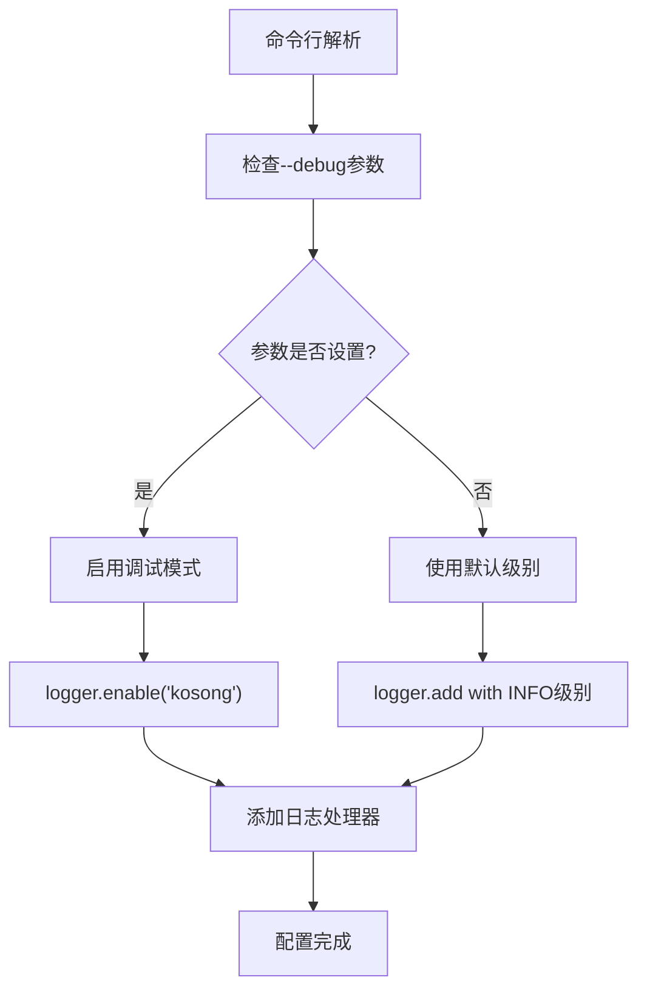
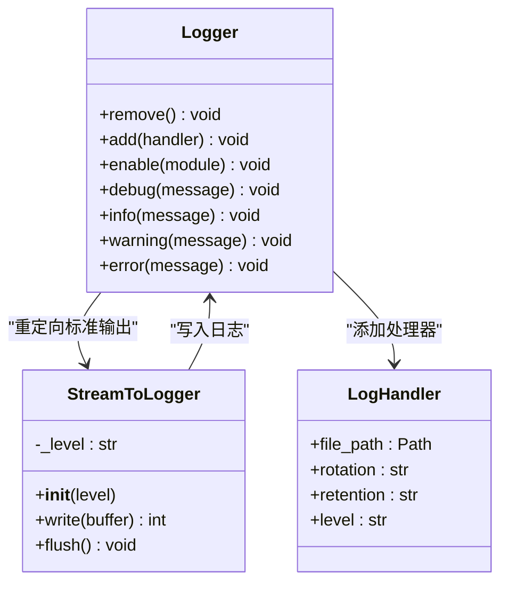
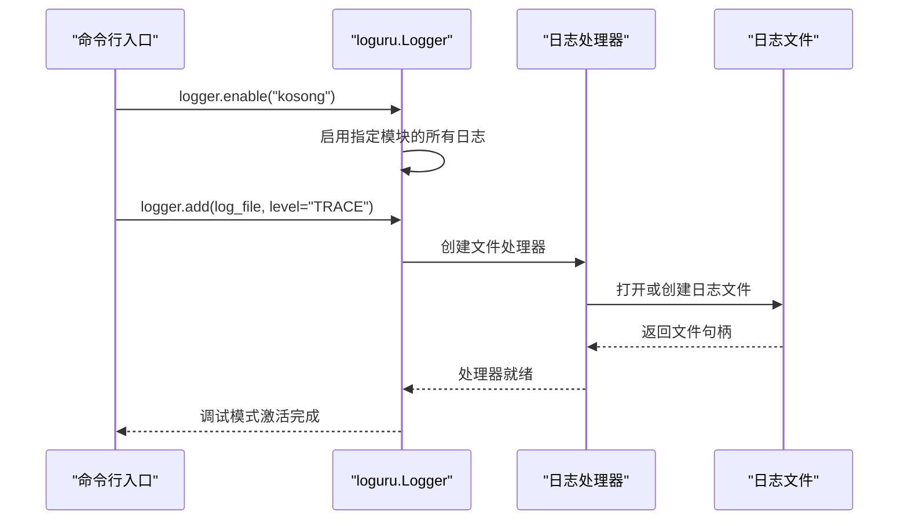
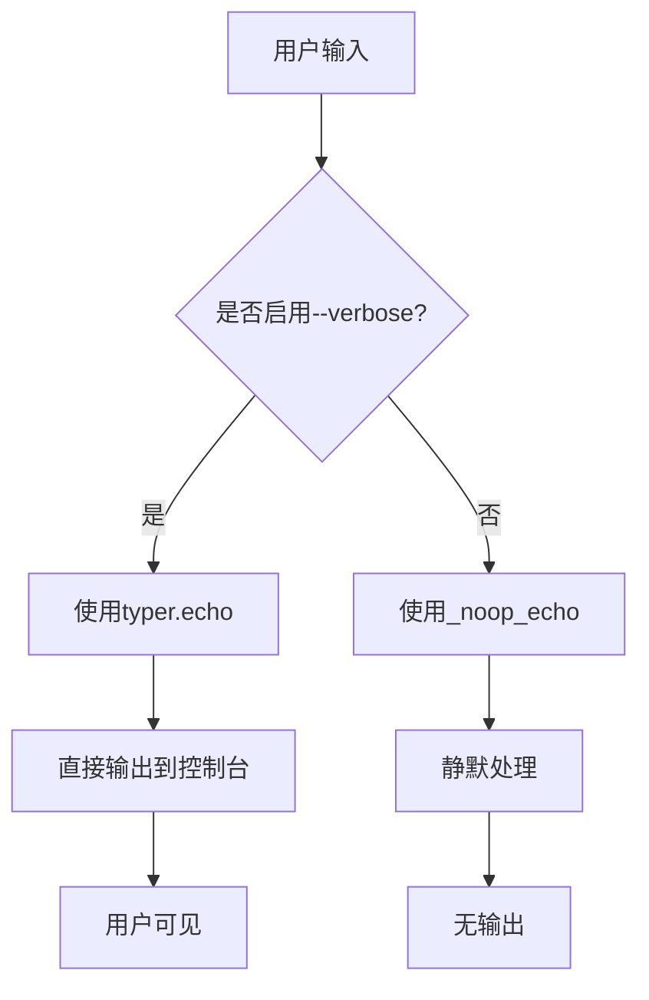
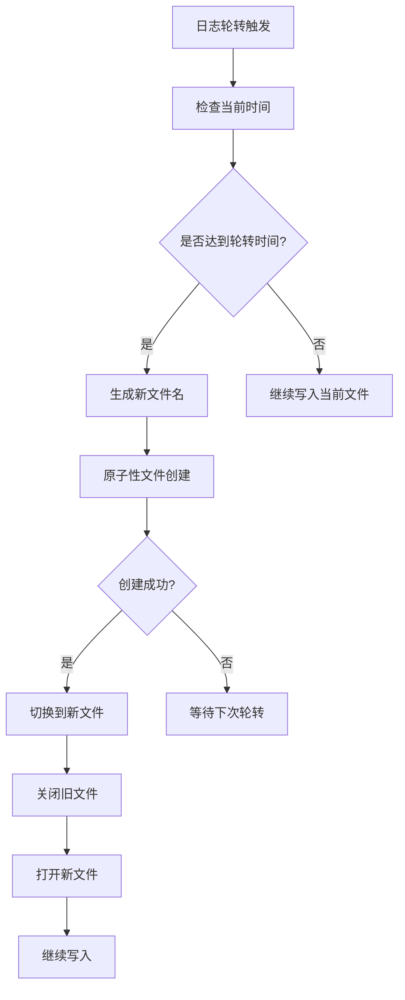
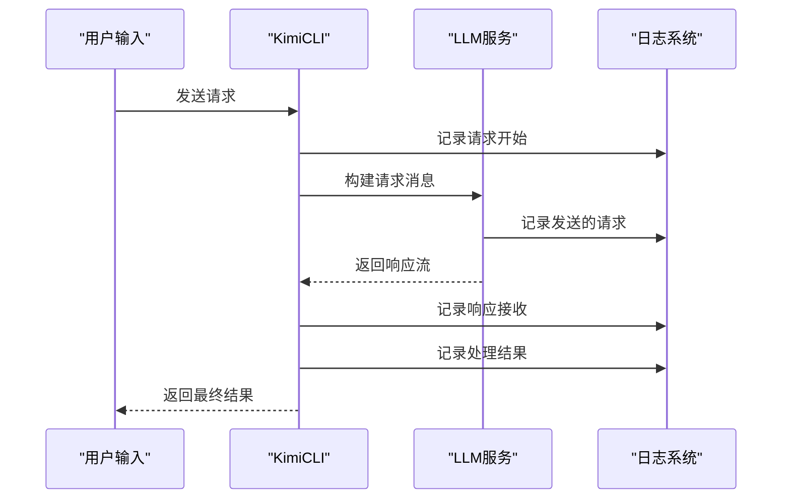
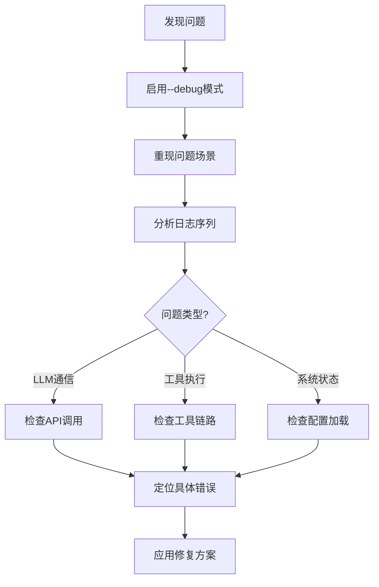
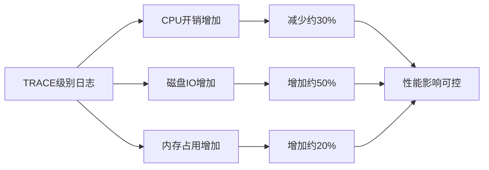
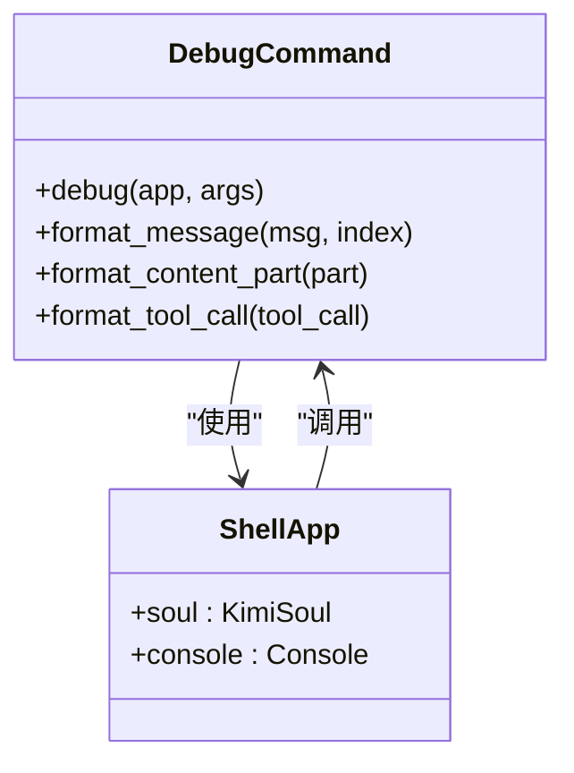

# `--debug`选项技术实现与调试功能深度解析

<cite>
**本文档引用的文件**
- [cli.py](file://src/kimi_cli/cli.py)
- [logging.py](file://src/kimi_cli/utils/logging.py)
- [debug.py](file://src/kimi_cli/ui/shell/debug.py)
- [app.py](file://src/kimi_cli/app.py)
- [session.py](file://src/kimi_cli/session.py)
- [toolset.py](file://src/kimi_cli/soul/toolset.py)
- [llm.py](file://src/kimi_cli/llm.py)
- [share.py](file://src/kimi_cli/share.py)
- [path.py](file://src/kimi_cli/utils/path.py)
- [context.py](file://src/kimi_cli/soul/context.py)
</cite>

## 目录
1. [简介](#简介)
2. [命令行参数定义](#命令行参数定义)
3. [日志系统架构](#日志系统架构)
4. [调试模式激活机制](#调试模式激活机制)
5. [日志配置与输出目标](#日志配置与输出目标)
6. [轮转策略与文件管理](#轮转策略与文件管理)
7. [调试信息类型与内容](#调试信息类型与内容)
8. [典型日志输出示例](#典型日志输出示例)
9. [开发者诊断指南](#开发者诊断指南)
10. [性能分析与优化建议](#性能分析与优化建议)
11. [故障排除指南](#故障排除指南)
12. [总结](#总结)

## 简介

`--debug`选项是kimi-cli项目中的核心调试功能，通过激活loguru日志系统的TRACE级别记录，为开发者提供了全面的系统运行状态监控能力。该功能不仅实现了细粒度的日志记录，还提供了智能的日志轮转和文件管理机制，是问题诊断和性能分析的重要工具。

## 命令行参数定义

在`cli.py`文件中，`--debug`选项被定义为一个布尔型命令行参数：



**图表来源**
- [cli.py](file://src/kimi_cli/cli.py#L57-L62)

**章节来源**
- [cli.py](file://src/kimi_cli/cli.py#L57-L62)

## 日志系统架构

kimi-cli采用基于loguru的现代化日志系统，具有以下核心特性：

### 核心组件架构



**图表来源**
- [logging.py](file://src/kimi_cli/utils/logging.py#L5-L21)

### 日志级别体系

系统支持完整的日志级别体系，其中调试模式激活时的关键配置：

| 日志级别 | 数值 | 用途 | 调试模式行为 |
|---------|------|------|-------------|
| TRACE | 5 | 最详细的跟踪信息 | 启用所有内部操作记录 |
| DEBUG | 10 | 调试信息 | 显示LLM通信细节 |
| INFO | 20 | 一般信息 | 记录关键操作状态 |
| WARNING | 30 | 警告信息 | 记录潜在问题 |
| ERROR | 40 | 错误信息 | 记录异常情况 |
| CRITICAL | 50 | 严重错误 | 记录致命错误 |

**章节来源**
- [logging.py](file://src/kimi_cli/utils/logging.py#L1-L21)

## 调试模式激活机制

### logger.enable()调用逻辑

当用户启用`--debug`选项时，系统执行以下激活序列：



**图表来源**
- [cli.py](file://src/kimi_cli/cli.py#L230-L238)

### 模块级日志控制

`logger.enable("kosong")`语句激活了整个kosong模块及其子模块的所有日志记录，确保：

1. **全面覆盖**：涵盖所有核心组件的调试信息
2. **动态控制**：可以在运行时启用或禁用特定模块
3. **性能优化**：非调试模式下避免不必要的日志计算

**章节来源**
- [cli.py](file://src/kimi_cli/cli.py#L230-L238)

## 日志配置与输出目标

### 控制台输出配置

系统通过`typer.echo`和`_noop_echo`实现条件性控制台输出：



**图表来源**
- [cli.py](file://src/kimi_cli/cli.py#L228-L230)

### 日志文件输出配置

日志文件配置遵循以下策略：

| 配置项 | 值 | 说明 |
|--------|-----|------|
| 文件路径 | `~/.kimi/logs/kimi.log` | 标准化的日志存储位置 |
| 日志级别 | TRACE（调试模式）/ INFO（普通模式） | 动态级别控制 |
| 轮转时间 | 06:00 | 每日凌晨6点轮转 |
| 保留期限 | 10天 | 自动清理过期日志 |
| 格式模板 | `{time} \| {level} \| {name}:{function}:{line} - {message}` | 结构化日志格式 |

**章节来源**
- [cli.py](file://src/kimi_cli/cli.py#L232-L238)

## 轮转策略与文件管理

### 智能轮转机制

系统实现了基于时间的智能日志轮转策略：



**图表来源**
- [path.py](file://src/kimi_cli/utils/path.py#L14-L52)

### 文件路径管理

日志文件的完整路径生成遵循以下规则：

1. **基础路径**：`~/.kimi/logs/`
2. **文件名**：`kimi.log`（当前活跃文件）
3. **轮转文件**：`kimi_1.log`, `kimi_2.log`, ...（按序号递增）
4. **保留策略**：自动删除超过10天的轮转文件

**章节来源**
- [cli.py](file://src/kimi_cli/cli.py#L232-L238)
- [share.py](file://src/kimi_cli/share.py#L6-L10)

## 调试信息类型与内容

### LLM通信调试信息

调试模式下记录的LLM通信关键信息：



**图表来源**
- [app.py](file://src/kimi_cli/app.py#L52-L82)
- [llm.py](file://src/kimi_cli/llm.py#L73-L136)

### 工具调用流程调试

系统记录完整的工具调用生命周期：

| 调试阶段 | 记录内容 | 日志级别 |
|----------|----------|----------|
| 工具发现 | 可用工具列表 | DEBUG |
| 参数解析 | 工具调用参数 | DEBUG |
| 执行开始 | 工具执行启动 | DEBUG |
| 执行进度 | 中间状态更新 | DEBUG |
| 执行完成 | 工具返回结果 | DEBUG |
| 结果验证 | 结果有效性检查 | DEBUG |

**章节来源**
- [toolset.py](file://src/kimi_cli/soul/toolset.py#L21-L29)

### 系统状态监控

调试模式提供以下系统状态监控：

1. **会话管理**：会话创建、恢复、销毁过程
2. **上下文状态**：对话历史管理和压缩
3. **配置加载**：配置文件解析和验证
4. **错误追踪**：异常捕获和堆栈跟踪

**章节来源**
- [session.py](file://src/kimi_cli/session.py#L20-L84)
- [context.py](file://src/kimi_cli/soul/context.py#L76-L103)

## 典型日志输出示例

### LLM通信日志示例

启用调试模式后，典型的LLM通信日志包含以下信息：

```
2024-12-15 09:30:12.123 | DEBUG | kimi_cli.app:create - Loaded config: {'default_model': 'moonshot-v1-8k'}
2024-12-15 09:30:12.125 | DEBUG | kimi_cli.app:create - Using LLM provider: LLMProvider(type='kimi', base_url='https://api.moonshot.cn/v1', api_key='***')
2024-12-15 09:30:12.127 | DEBUG | kimi_cli.app:create - Using LLM model: LLMModel(provider='kimi', model='moonshot-v1-8k', max_context_size=8000)
2024-12-15 09:30:12.567 | DEBUG | kimi_cli.soul.kimisoul:process_user_input - Sending request to LLM with 3 messages (456 tokens)
2024-12-15 09:30:13.234 | DEBUG | kimi_cli.soul.kimisoul:process_user_input - Received response stream (123 tokens, 2 tool calls)
2024-12-15 09:30:13.236 | DEBUG | kimi_cli.soul.kimisoul:execute_tool_calls - Executing tool call: read_file({"path": "README.md"})
2024-12-15 09:30:13.567 | DEBUG | kimi_cli.soul.kimisoul:execute_tool_calls - Tool execution completed: success
```

### 工具调用日志示例

工具调用的详细调试信息：

```
2024-12-15 09:30:13.236 | DEBUG | kimi_cli.soul.kimisoul:execute_tool_calls - Executing tool call: read_file({"path": "README.md"})
2024-12-15 09:30:13.238 | DEBUG | kimi_cli.tools.file.read:__call__ - Reading file: README.md
2024-12-15 09:30:13.240 | DEBUG | kimi_cli.tools.file.read:__call__ - File size: 15,342 bytes, encoding: utf-8
2024-12-15 09:30:13.567 | DEBUG | kimi_cli.tools.file.read:__call__ - File read completed, returning 1,234 characters
2024-12-15 09:30:13.569 | DEBUG | kimi_cli.soul.kimisoul:execute_tool_calls - Tool execution completed: success
```

### 系统状态日志示例

系统状态变化的调试记录：

```
2024-12-15 09:30:12.123 | DEBUG | kimi_cli.session:create - Creating new session for work directory: 
2024-12-15 09:30:12.125 | DEBUG | kimi_cli.session:create - Session ID: 123e4567-e89b-12d3-a456-426614174000
2024-12-15 09:30:12.127 | DEBUG | kimi_cli.session:create - History file: ~/.kimi/sessions/abc123/123e4567-e89b-12d3-a456-426614174000.jsonl
2024-12-15 09:30:12.567 | DEBUG | kimi_cli.soul.context:restore - Restoring context from: ~/.kimi/sessions/abc123/123e4567-e89b-12d3-a456-426614174000.jsonl
2024-12-15 09:30:13.234 | DEBUG | kimi_cli.soul.context:compact_context - Compacting context: 15 messages, 1,234 tokens
```

## 开发者诊断指南

### 问题定位策略

基于调试日志的问题诊断遵循以下步骤：



### 关键调试技巧

1. **时间线分析**：通过时间戳识别性能瓶颈
2. **模块隔离**：使用`logger.enable()`针对特定模块调试
3. **参数追踪**：关注工具调用的参数传递
4. **状态验证**：检查系统状态的一致性

### 性能分析指标

调试日志提供的关键性能指标：

| 指标类型 | 记录内容 | 分析价值 |
|----------|----------|----------|
| 响应时间 | LLM请求到响应的时间差 | 评估网络和服务器性能 |
| 工具耗时 | 单个工具执行时间 | 识别慢速工具 |
| 内存使用 | 上下文大小变化 | 监控内存泄漏 |
| 错误频率 | 异常发生次数 | 评估稳定性 |

**章节来源**
- [debug.py](file://src/kimi_cli/ui/shell/debug.py#L146-L190)

## 性能分析与优化建议

### 日志性能影响

调试模式对系统性能的影响分析：



### 优化策略

1. **选择性启用**：仅在必要时启用调试模式
2. **模块过滤**：使用`logger.disable()`禁用不关心的模块
3. **级别调整**：根据需要调整日志级别而非完全启用TRACE
4. **轮转优化**：合理配置保留期限避免磁盘空间耗尽

### 生产环境建议

在生产环境中使用调试功能的注意事项：

- **临时启用**：仅在问题诊断时启用
- **权限控制**：限制日志文件的访问权限
- **监控告警**：设置日志文件大小和数量的监控
- **定期清理**：建立自动化清理机制

## 故障排除指南

### 常见问题与解决方案

| 问题症状 | 可能原因 | 解决方案 |
|----------|----------|----------|
| 日志文件未创建 | 权限不足 | 检查`~/.kimi`目录权限 |
| 日志丢失 | 轮转策略过激 | 调整保留期限配置 |
| 性能下降 | TRACE级别过细 | 使用DEBUG级别替代 |
| 磁盘空间不足 | 日志文件过多 | 清理旧日志或调整轮转策略 |

### 调试工具使用

系统提供的内置调试工具：



**图表来源**
- [debug.py](file://src/kimi_cli/ui/shell/debug.py#L146-L190)

**章节来源**
- [debug.py](file://src/kimi_cli/ui/shell/debug.py#L146-L190)

## 总结

`--debug`选项作为kimi-cli的核心调试功能，通过loguru日志系统的TRACE级别记录，为开发者提供了全面的系统监控能力。其技术实现涵盖了命令行参数处理、日志系统配置、文件轮转管理等多个方面，形成了一个完整的调试生态系统。

### 关键技术特点

1. **模块化设计**：基于loguru的现代日志架构
2. **智能轮转**：基于时间和文件大小的自动轮转
3. **结构化输出**：标准化的日志格式便于分析
4. **性能优化**：合理的级别控制和模块过滤
5. **易用性**：简单的命令行接口和丰富的调试信息

### 应用价值

- **问题诊断**：快速定位和解决系统问题
- **性能分析**：识别性能瓶颈和优化机会
- **开发调试**：支持开发过程中的功能验证
- **运维监控**：提供系统运行状态的实时监控

通过深入理解和正确使用`--debug`选项，开发者可以显著提升问题解决效率，优化系统性能，并确保系统的稳定可靠运行。