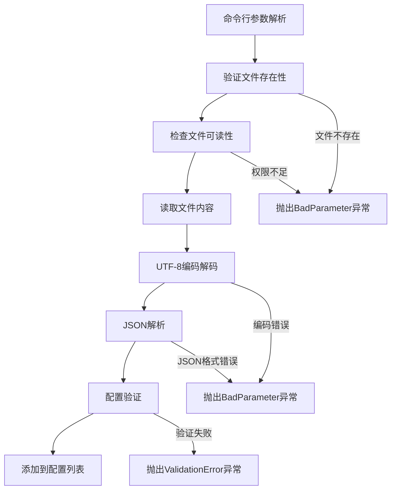
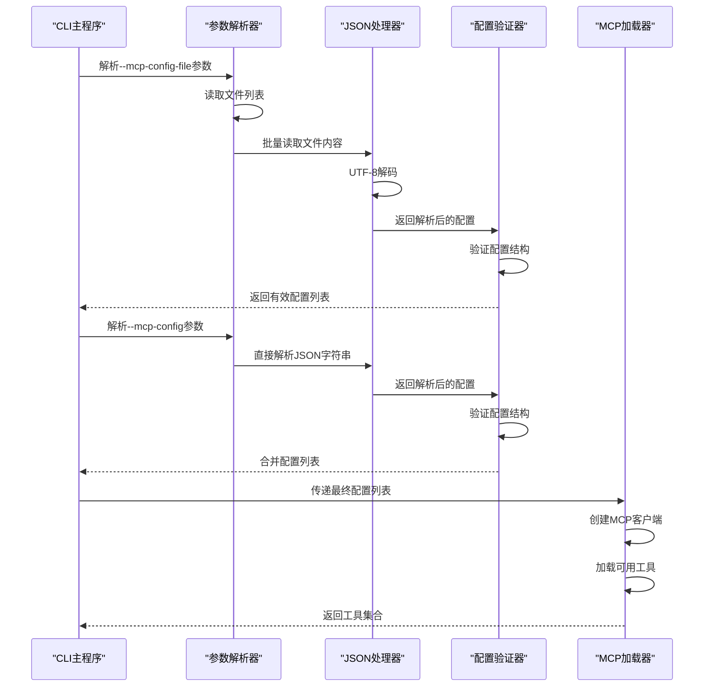
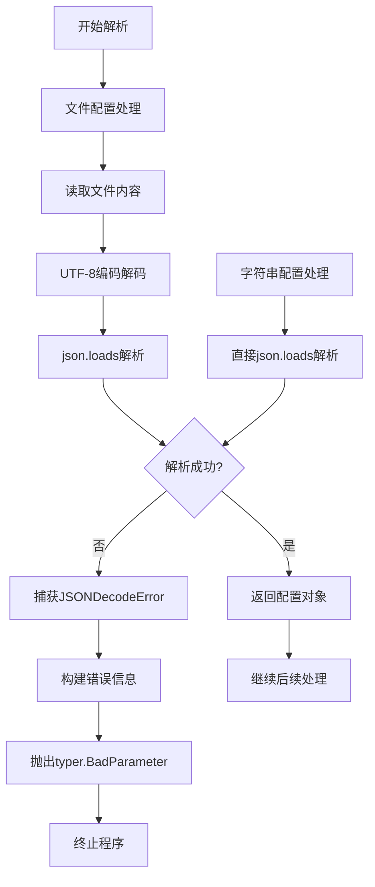
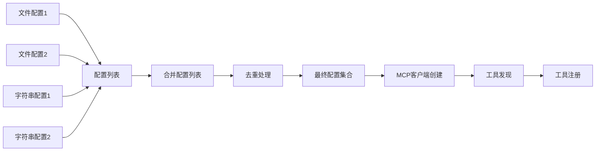
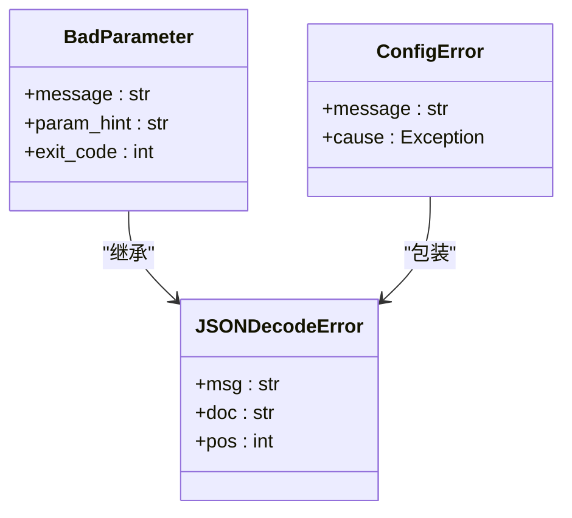

# mcp-config-file与mcp-config选项

<cite>
**本文档引用的文件**
- [cli.py](file://src/kimi_cli/cli.py)
- [config.py](file://src/kimi_cli/config.py)
- [mcp.py](file://src/kimi_cli/tools/mcp.py)
- [agent.py](file://src/kimi_cli/soul/agent.py)
- [test_config.py](file://tests/test_config.py)
</cite>

## 目录
1. [概述](#概述)
2. [命令行选项定义](#命令行选项定义)
3. [配置加载流程](#配置加载流程)
4. [JSON解析与验证](#json解析与验证)
5. [配置结构与要求](#配置结构与要求)
6. [多配置叠加机制](#多配置叠加机制)
7. [错误处理机制](#错误处理机制)
8. [典型配置示例](#典型配置示例)
9. [常见错误与解决方案](#常见错误与解决方案)
10. [最佳实践建议](#最佳实践建议)

## 概述

`--mcp-config-file`和`--mcp-config`选项是Kimí CLI中用于加载外部MCP（Model Context Protocol）服务器配置的核心功能。这些选项支持从文件或直接JSON字符串两种方式加载MCP配置，为工具扩展提供了灵活的配置机制。

MCP协议允许CLI应用程序与各种外部服务进行交互，包括文件系统访问、网络请求、数据库操作等。通过这两个选项，用户可以轻松集成自定义的MCP服务器，扩展CLI的功能边界。

## 命令行选项定义

### --mcp-config-file选项



**图表来源**
- [cli.py](file://src/kimi_cli/cli.py#L155-L167)

该选项支持：
- 多次指定以加载多个配置文件
- 文件必须存在且可读
- 支持绝对路径和相对路径
- 使用UTF-8编码读取文件内容

### --mcp-config选项

该选项接受直接的JSON字符串作为配置内容，无需文件存储。支持：
- 多次指定以加载多个JSON配置
- 直接在命令行中嵌入配置
- 灵活的配置传递方式

**节来源**
- [cli.py](file://src/kimi_cli/cli.py#L155-L177)

## 配置加载流程

### 主要加载步骤



**图表来源**
- [cli.py](file://src/kimi_cli/cli.py#L270-L281)
- [agent.py](file://src/kimi_cli/soul/agent.py#L144-L164)

### 具体实现流程

配置加载过程分为两个主要阶段：

1. **文件配置加载**：处理`--mcp-config-file`选项
2. **字符串配置加载**：处理`--mcp-config`选项

每个阶段都包含完整的错误检测和报告机制。

**节来源**
- [cli.py](file://src/kimi_cli/cli.py#L270-L281)

## JSON解析与验证

### json.loads调用机制

系统使用Python标准库的`json.loads`函数进行JSON解析，具体实现如下：



**图表来源**
- [cli.py](file://src/kimi_cli/cli.py#L273-L281)

### 错误处理策略

系统实现了多层次的错误处理机制：

1. **文件读取错误**：文件不存在或权限不足
2. **编码错误**：非UTF-8编码的文件内容
3. **JSON语法错误**：无效的JSON格式
4. **配置验证错误**：结构不符合预期

**节来源**
- [cli.py](file://src/kimi_cli/cli.py#L273-L281)

## 配置结构与要求

### 预期配置结构

虽然代码中没有明确的配置模式验证，但基于使用的`fastmcp`库和MCP协议规范，配置通常包含以下要素：

| 字段名称 | 类型 | 必需 | 描述 |
|---------|------|------|------|
| `name` | string | 是 | MCP服务器名称 |
| `transport` | object | 是 | 传输层配置 |
| `authentication` | object | 否 | 认证配置 |
| `capabilities` | object | 否 | 服务器能力声明 |

### 传输层配置

常见的传输层配置包括：

- **WebSocket传输**：用于实时通信
- **HTTP传输**：用于RESTful API调用
- **STDIO传输**：用于进程间通信

### 认证配置

支持多种认证方式：
- API密钥认证
- OAuth令牌认证
- 自定义认证方案

**节来源**
- [mcp.py](file://src/kimi_cli/tools/mcp.py#L144-L164)

## 多配置叠加机制

### 配置合并策略



**图表来源**
- [cli.py](file://src/kimi_cli/cli.py#L270-L279)

### 优先级规则

当前实现采用简单的追加顺序：
1. 文件配置按命令行出现顺序加载
2. 字符串配置按命令行出现顺序加载
3. 后加载的配置会覆盖先加载的同名配置

注意：这种实现方式可能需要根据实际需求调整为更复杂的合并逻辑。

**节来源**
- [cli.py](file://src/kimi_cli/cli.py#L270-L279)

## 错误处理机制

### 异常类型与处理



**图表来源**
- [cli.py](file://src/kimi_cli/cli.py#L275-L281)

### 错误分类与处理

1. **参数错误**：无效的文件路径或权限问题
2. **JSON解析错误**：语法错误或编码问题
3. **配置验证错误**：结构不匹配或必需字段缺失

每种错误都有对应的详细错误信息和建议的解决方法。

**节来源**
- [cli.py](file://src/kimi_cli/cli.py#L275-L281)

## 典型配置示例

### 基本文件配置示例

```json
{
  "name": "本地文件服务器",
  "transport": {
    "type": "stdio",
    "command": "python -m my_mcp_server"
  },
  "capabilities": {
    "tools": true,
    "prompts": false,
    "resources": true
  }
}
```

### HTTP传输配置示例

```json
{
  "name": "Web API服务器",
  "transport": {
    "type": "http",
    "url": "http://localhost:8080/mcp"
  },
  "authentication": {
    "type": "bearer",
    "token": "your-api-token-here"
  }
}
```

### WebSocket传输配置示例

```json
{
  "name": "实时数据服务器",
  "transport": {
    "type": "websocket",
    "url": "ws://localhost:9090/mcp"
  },
  "capabilities": {
    "tools": true,
    "notifications": true
  }
}
```

### 多配置组合示例

```bash
# 命令行示例
kimi --mcp-config-file ./config1.json \
     --mcp-config-file ./config2.json \
     --mcp-config '{"name":"内存服务器","transport":{"type":"memory"}}'
```

## 常见错误与解决方案

### JSON解析错误

#### 语法错误
**错误现象**：`Invalid JSON: Expecting ',' delimiter: line 5 column 10 (char 123)`

**解决方案**：
1. 检查JSON语法是否正确
2. 确保所有引号都正确配对
3. 验证数组和对象的括号匹配

#### 编码问题
**错误现象**：`Invalid JSON: Unterminated string starting at: line 1 column 10 (char 9)`

**解决方案**：
1. 确保文件使用UTF-8编码保存
2. 检查特殊字符是否正确转义
3. 验证文件头是否有BOM标记

### 文件访问错误

#### 文件不存在
**错误现象**：`Invalid JSON: Expecting value: line 1 column 1 (char 0)`

**解决方案**：
1. 验证文件路径是否正确
2. 检查文件是否存在
3. 确认文件名拼写无误

#### 权限不足
**错误现象**：`Permission denied: '/path/to/config.json'`

**解决方案**：
1. 检查文件读取权限
2. 确认用户有访问权限
3. 修改文件权限设置

### 配置结构错误

#### 缺少必需字段
**错误现象**：`Missing required field: transport`

**解决方案**：
1. 添加必需的配置字段
2. 参考MCP协议规范
3. 验证配置完整性

#### 类型不匹配
**错误现象**：`Expected type 'object' for field 'transport'`

**解决方案**：
1. 检查字段类型是否正确
2. 确保对象结构符合预期
3. 验证嵌套配置的格式

**节来源**
- [cli.py](file://src/kimi_cli/cli.py#L275-L281)

## 最佳实践建议

### 配置文件组织

1. **模块化配置**：将不同功能的配置分离到独立文件
2. **版本控制**：将配置文件纳入版本控制系统
3. **环境区分**：为不同环境准备不同的配置文件

### 性能优化

1. **延迟加载**：只在需要时加载MCP配置
2. **缓存机制**：缓存已解析的配置避免重复解析
3. **并发处理**：支持多个MCP服务器的并发连接

### 安全考虑

1. **敏感信息保护**：避免在配置文件中硬编码敏感信息
2. **权限控制**：限制配置文件的访问权限
3. **验证机制**：实施严格的配置验证

### 开发调试

1. **日志记录**：启用详细的配置加载日志
2. **错误报告**：提供清晰的错误诊断信息
3. **测试策略**：建立配置加载的自动化测试

通过合理使用`--mcp-config-file`和`--mcp-config`选项，开发者可以灵活地扩展Kimí CLI的功能，集成各种外部服务和工具，构建强大的命令行智能代理系统。