# `--model` 选项系统性说明

<cite>
**本文档引用的文件**
- [cli.py](file://src/kimi_cli/cli.py)
- [app.py](file://src/kimi_cli/app.py)
- [config.py](file://src/kimi_cli/config.py)
- [llm.py](file://src/kimi_cli/llm.py)
- [kimisoul.py](file://src/kimi_cli/soul/kimisoul.py)
- [soul/__init__.py](file://src/kimi_cli/soul/__init__.py)
- [message.py](file://src/kimi_cli/soul/message.py)
- [setup.py](file://src/kimi_cli/ui/shell/setup.py)
</cite>

## 目录
1. [概述](#概述)
2. [模型选择策略](#模型选择策略)
3. [优先级机制](#优先级机制)
4. [参数传递路径](#参数传递路径)
5. [支持的模型格式](#支持的模型格式)
6. [错误处理机制](#错误处理机制)
7. [环境变量覆盖](#环境变量覆盖)
8. [性能考量](#性能考量)
9. [使用建议](#使用建议)
10. [故障排除](#故障排除)

## 概述

`--model` 选项是 Kimi CLI 中用于指定 AI 模型的核心功能，它提供了灵活的模型选择机制，允许用户在运行时动态切换不同的 LLM（大语言模型）。该选项通过命令行参数传递，具有最高优先级，能够覆盖配置文件中设置的默认模型。

## 模型选择策略

### 多层次选择逻辑

Kimi CLI 实现了基于优先级的模型选择策略，按照以下顺序确定最终使用的模型：

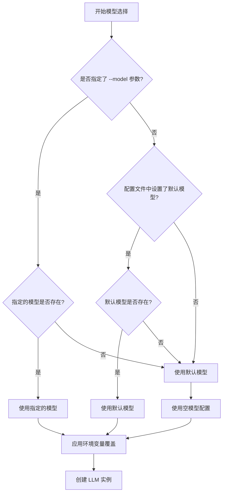

**图表来源**
- [app.py](file://src/kimi_cli/app.py#L58-L66)

### 配置文件集成

模型选择与配置系统深度集成，通过以下组件协同工作：

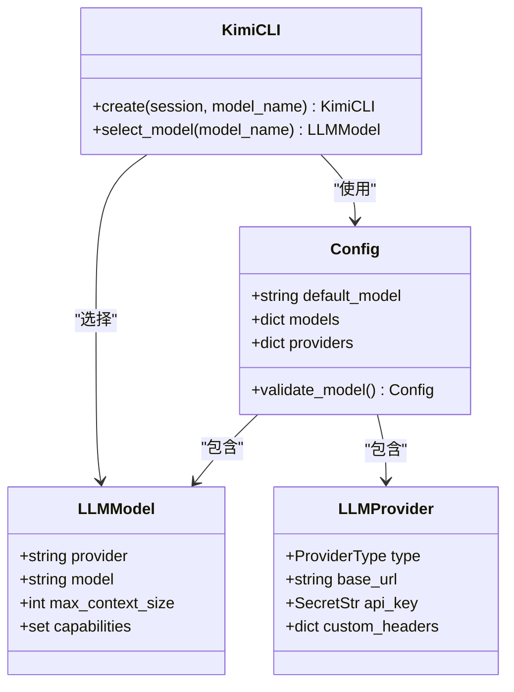

**图表来源**
- [config.py](file://src/kimi_cli/config.py#L32-L43)
- [config.py](file://src/kimi_cli/config.py#L15-L31)
- [app.py](file://src/kimi_cli/app.py#L25-L102)

**章节来源**
- [app.py](file://src/kimi_cli/app.py#L58-L66)
- [config.py](file://src/kimi_cli/config.py#L76-L95)

## 优先级机制

### 优先级顺序

模型选择遵循严格的优先级顺序，确保用户意图得到正确执行：

| 优先级 | 条件 | 行为 |
|--------|------|------|
| 1 | `--model` 参数存在且有效 | 使用指定模型，完全覆盖其他配置 |
| 2 | 配置文件设置默认模型且存在 | 使用配置文件默认模型 |
| 3 | 无有效配置 | 使用空模型配置 |

### 优先级验证流程

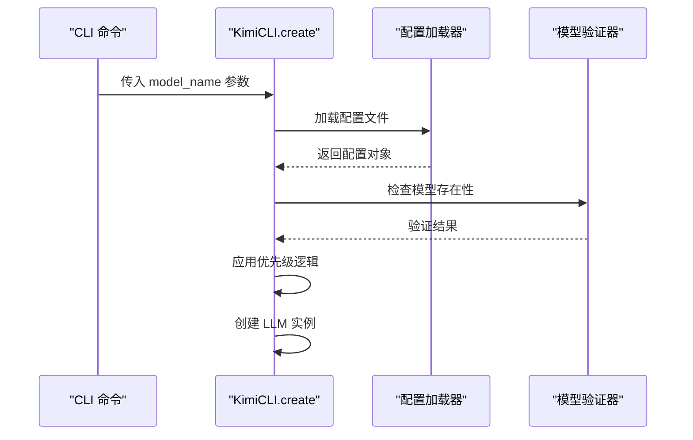

**图表来源**
- [app.py](file://src/kimi_cli/app.py#L29-L66)

**章节来源**
- [app.py](file://src/kimi_cli/app.py#L58-L66)

## 参数传递路径

### 完整调用链路

从命令行到模型实例化的完整路径展示了 `model_name` 参数的传递过程：

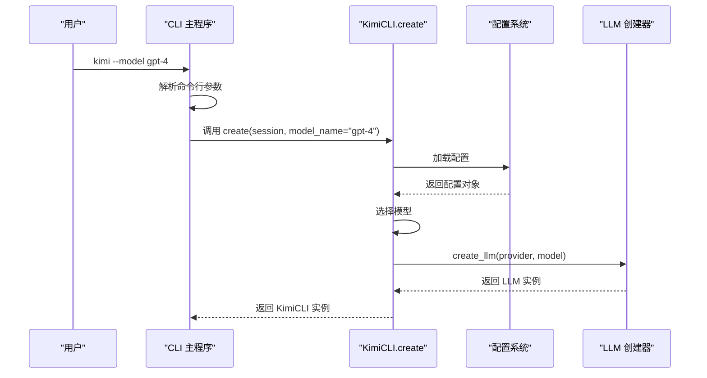

**图表来源**
- [cli.py](file://src/kimi_cli/cli.py#L292-L298)
- [app.py](file://src/kimi_cli/app.py#L27-L102)

### 关键参数映射

| 组件 | 参数名 | 类型 | 描述 |
|------|--------|------|------|
| CLI 命令 | `--model` | `str \| None` | 用户指定的模型名称 |
| KimiCLI.create | `model_name` | `str \| None` | 内部模型参数 |
| Runtime | `llm` | `LLM \| None` | 最终使用的 LLM 实例 |

**章节来源**
- [cli.py](file://src/kimi_cli/cli.py#L75-L82)
- [cli.py](file://src/kimi_cli/cli.py#L292-L298)
- [app.py](file://src/kimi_cli/app.py#L33)

## 支持的模型格式

### 模型名称规范

Kimi CLI 支持多种格式的模型名称，具体包括：

#### 标准模型名称格式
- **平台前缀**: `kimi-`, `openai-`, `anthropic-` 等
- **版本标识**: 包含具体版本号如 `gpt-4-turbo-2024-04-01`
- **特殊模型**: 如 `kimi-for-coding`, `claude-3-sonnet`

#### 可用模型类型

| 提供商 | 示例模型 | 特殊能力 | 上下文长度 |
|--------|----------|----------|------------|
| Kimi | `kimi-20241101` | 思维模式 | 100,000+ tokens |
| OpenAI | `gpt-4-turbo` | 图像输入 | 128,000 tokens |
| Anthropic | `claude-3-sonnet` | 思维模式 | 200,000 tokens |
| 自定义 | `custom-model` | 可配置 | 可配置 |

### 模型能力检测

系统会自动检测模型的能力特性：

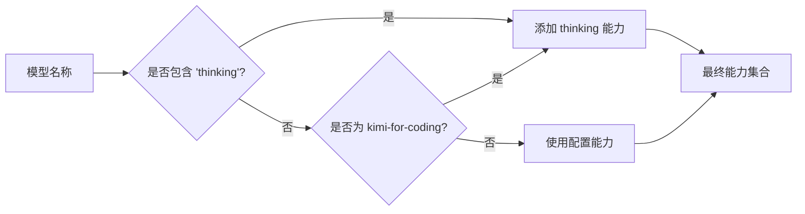

**图表来源**
- [llm.py](file://src/kimi_cli/llm.py#L139-L146)

**章节来源**
- [llm.py](file://src/kimi_cli/llm.py#L15-L18)
- [llm.py](file://src/kimi_cli/llm.py#L139-L146)

## 错误处理机制

### 模型不存在错误

当指定的模型不存在时，系统会触发相应的错误处理：

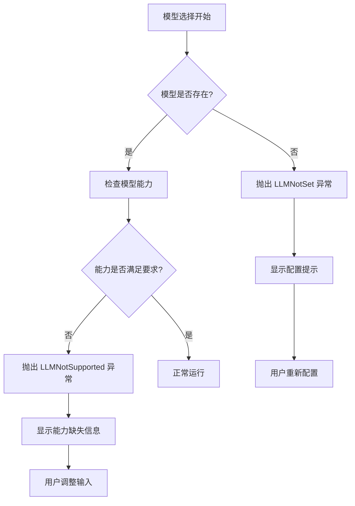

**图表来源**
- [kimisoul.py](file://src/kimi_cli/soul/kimisoul.py#L145-L150)
- [soul/__init__.py](file://src/kimi_cli/soul/__init__.py#L19-L35)

### 错误类型详解

| 错误类型 | 触发条件 | 处理方式 | 用户提示 |
|----------|----------|----------|----------|
| `LLMNotSet` | 模型未配置或无效 | 显示 `/setup` 指令 | "LLM not set, send /setup to configure" |
| `LLMNotSupported` | 模型能力不足 | 显示缺失能力列表 | "LLM model 'xxx' does not support required capabilities: xxx" |
| `ConfigError` | 配置文件无效 | 显示配置错误详情 | JSON 解析或验证错误 |

### 运行时错误处理

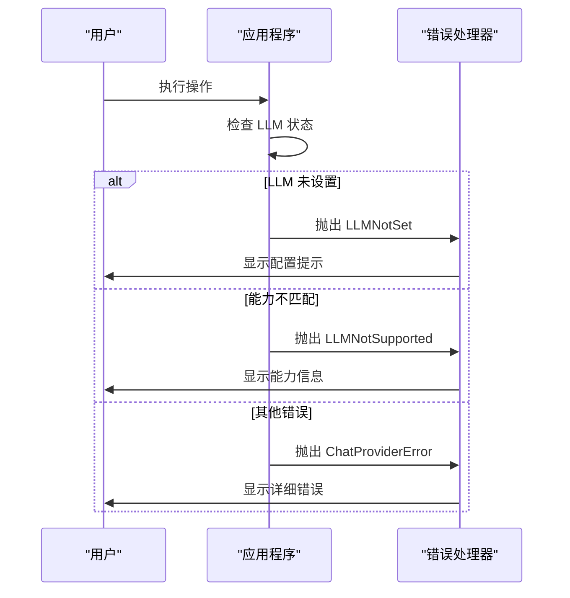

**图表来源**
- [__init__.py](file://src/kimi_cli/soul/__init__.py#L19-L35)
- [kimisoul.py](file://src/kimi_cli/soul/kimisoul.py#L145-L150)

**章节来源**
- [soul/__init__.py](file://src/kimi_cli/soul/__init__.py#L19-L35)
- [kimisoul.py](file://src/kimi_cli/soul/kimisoul.py#L145-L150)

## 环境变量覆盖

### 动态配置覆盖机制

Kimi CLI 支持通过环境变量动态覆盖模型配置，提供额外的灵活性：

| 环境变量 | 功能 | 优先级 | 示例值 |
|----------|------|--------|--------|
| `KIMI_MODEL_NAME` | 模型名称覆盖 | 高 | `gpt-4-turbo` |
| `KIMI_BASE_URL` | API 基础 URL | 高 | `https://api.openai.com/v1` |
| `KIMI_API_KEY` | API 密钥覆盖 | 高 | `sk-...` |
| `KIMI_MODEL_MAX_CONTEXT_SIZE` | 上下文大小 | 中 | `131072` |
| `KIMI_MODEL_CAPABILITIES` | 能力配置 | 中 | `thinking,image_in` |

### 覆盖流程

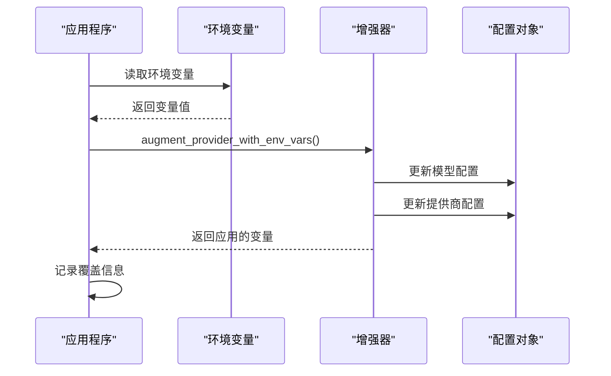

**图表来源**
- [llm.py](file://src/kimi_cli/llm.py#L32-L70)

### 环境变量处理逻辑

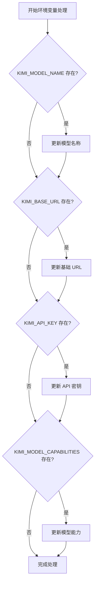

**图表来源**
- [llm.py](file://src/kimi_cli/llm.py#L42-L61)

**章节来源**
- [llm.py](file://src/kimi_cli/llm.py#L32-L70)

## 性能考量

### 模型选择对性能的影响

不同模型的选择会对系统性能产生显著影响：

#### 上下文长度考虑
- **小上下文模型**: `gpt-3.5-turbo` (4,096 tokens)
- **中等上下文**: `gpt-4` (8,192 tokens)
- **大上下文**: `kimi-20241101` (100,000+ tokens)
- **超大上下文**: `claude-3-sonnet` (200,000 tokens)

#### 思维模式性能影响
- **启用思维模式**: 增加推理时间但提高准确性
- **禁用思维模式**: 更快响应但可能降低质量
- **能力检测开销**: 每次消息都会进行能力检查

### 多模型环境优化

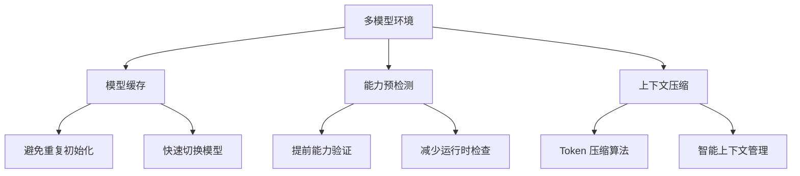

### 性能监控指标

| 指标 | 正常范围 | 警告阈值 | 优化建议 |
|------|----------|----------|----------|
| 响应时间 | < 2秒 | > 5秒 | 选择更快模型 |
| Token 使用率 | < 80% | > 90% | 启用上下文压缩 |
| 错误率 | < 1% | > 5% | 检查模型配置 |

## 使用建议

### 单模型环境最佳实践

1. **明确指定模型**: 在配置文件中设置默认模型，避免每次运行都指定
2. **能力匹配**: 确保模型能力与任务需求匹配
3. **定期更新**: 保持模型版本最新以获得最佳性能

### 多模型环境使用指南

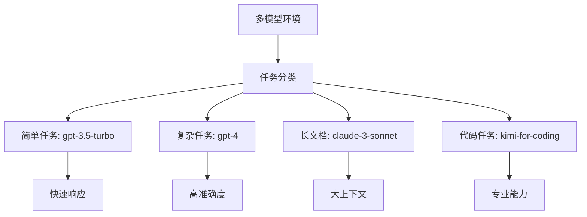

### 模型切换策略

| 场景 | 推荐模型 | 切换时机 | 注意事项 |
|------|----------|----------|----------|
| 日常办公 | `gpt-3.5-turbo` | 默认配置 | 成本效益最高 |
| 技术讨论 | `gpt-4` | 需要深度分析 | 准确性优先 |
| 文档处理 | `claude-3-sonnet` | 大文档任务 | 上下文容量充足 |
| 编程开发 | `kimi-for-coding` | 代码相关任务 | 专业工具支持 |

### 配置优化建议

1. **本地测试**: 在生产环境前先测试模型性能
2. **监控日志**: 定期检查模型使用情况和错误率
3. **资源规划**: 根据使用量选择合适的定价计划
4. **备份方案**: 准备备用模型以防主模型不可用

## 故障排除

### 常见问题及解决方案

#### 模型配置问题

| 问题 | 症状 | 解决方案 |
|------|------|----------|
| 模型不存在 | `LLMNotSet` 异常 | 使用 `/setup` 命令重新配置 |
| 能力不匹配 | `LLMNotSupported` 异常 | 选择支持相应能力的模型 |
| 配置文件损坏 | 配置加载失败 | 删除配置文件重新生成 |

#### 环境变量问题

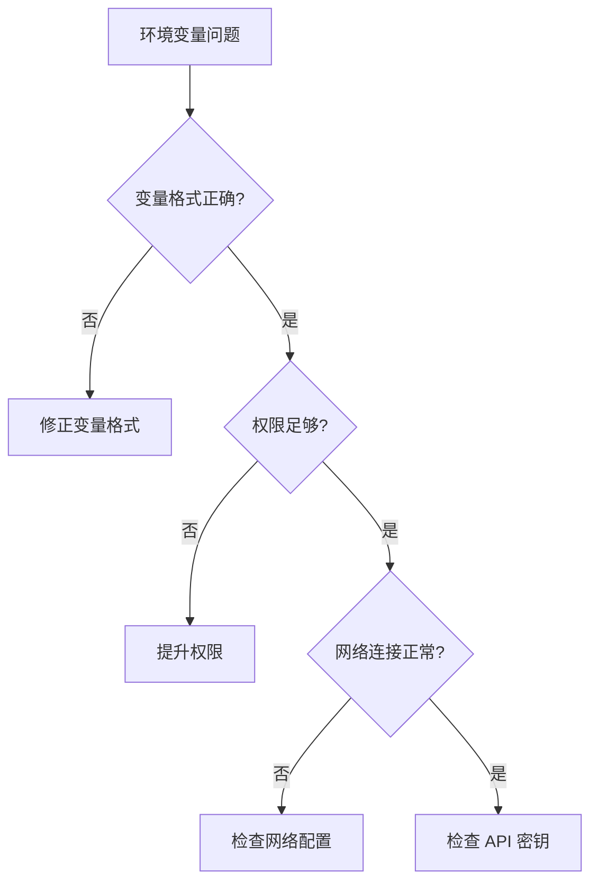

#### 性能问题诊断

1. **响应缓慢**: 检查模型选择和上下文长度
2. **频繁错误**: 验证 API 密钥和网络连接
3. **内存占用高**: 启用上下文压缩功能

### 调试技巧

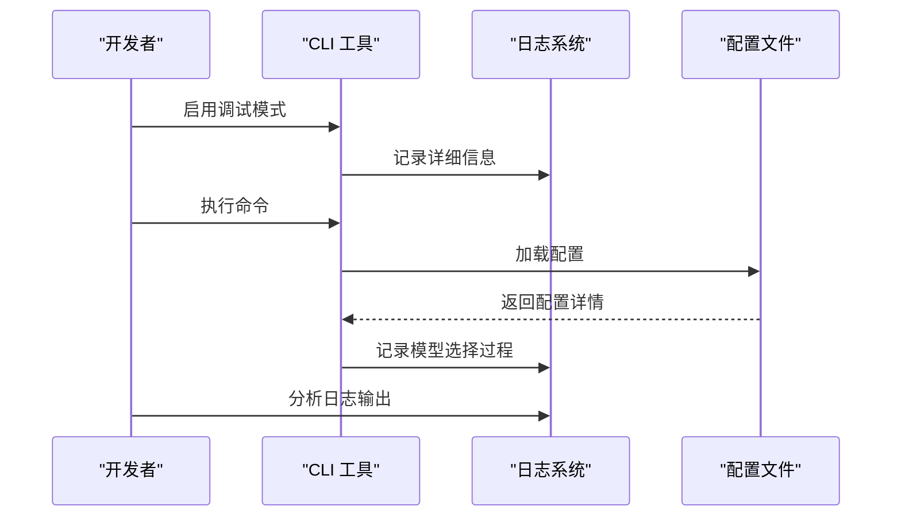

### 错误恢复流程

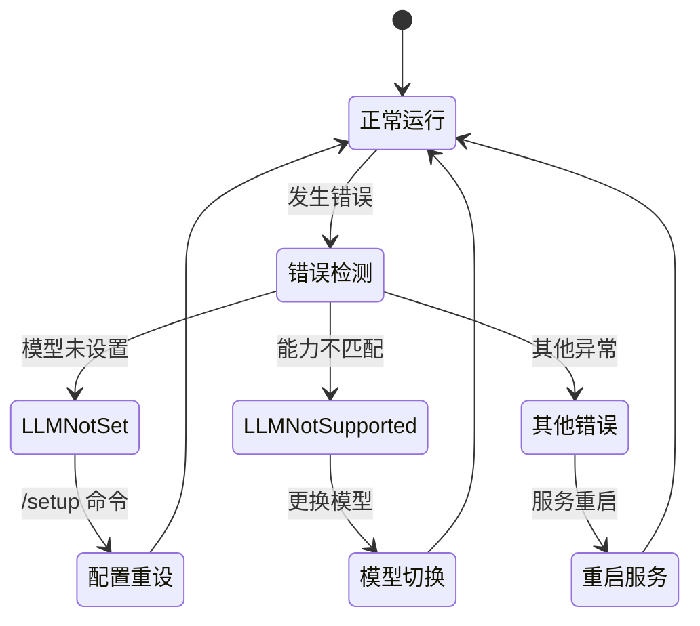

**章节来源**
- [setup.py](file://src/kimi_cli/ui/shell/setup.py#L50-L84)
- [__init__.py](file://src/kimi_cli/soul/__init__.py#L19-L35)

## 结论

`--model` 选项作为 Kimi CLI 的核心功能，提供了灵活而强大的模型选择机制。通过理解其优先级策略、错误处理机制和性能考量，用户可以更好地利用这一功能来满足不同的使用场景需求。合理的配置和使用策略不仅能提高工作效率，还能确保系统的稳定性和可靠性。

在实际使用中，建议根据具体任务需求选择合适的模型，并充分利用环境变量覆盖和配置文件管理功能来优化使用体验。同时，建立完善的监控和故障排除机制对于维护系统的长期稳定性至关重要。