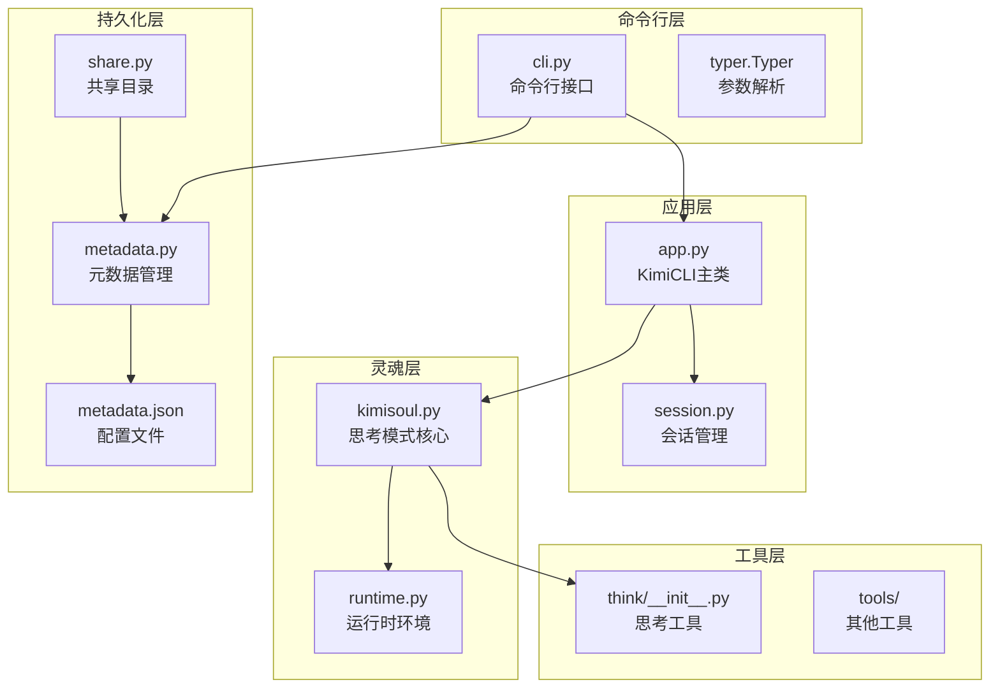
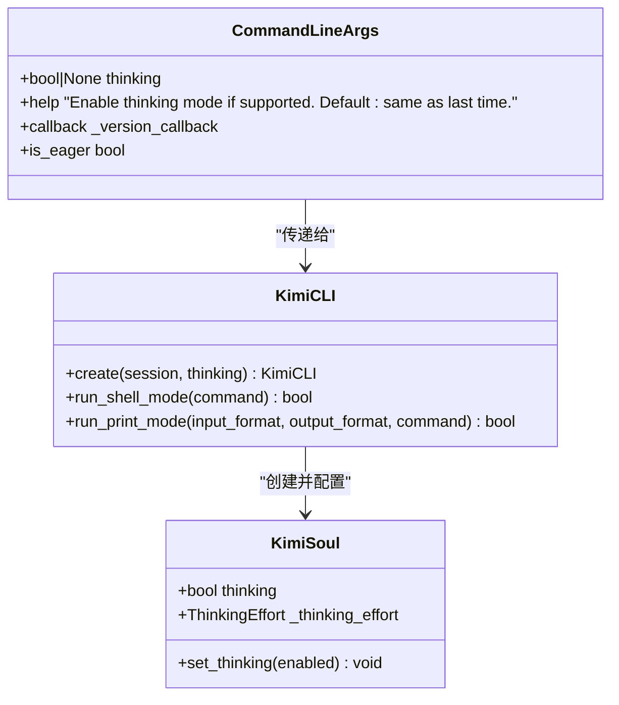
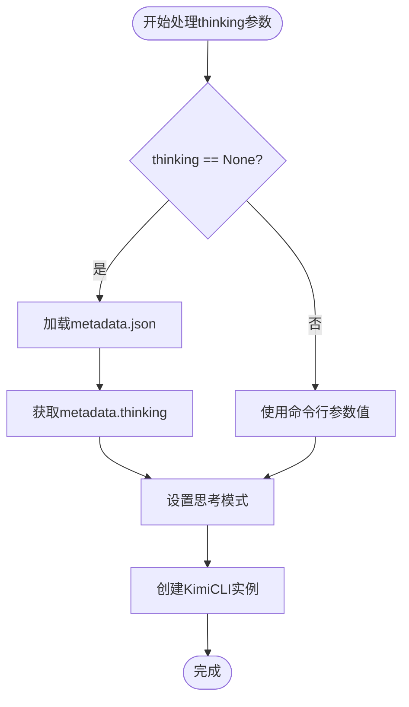
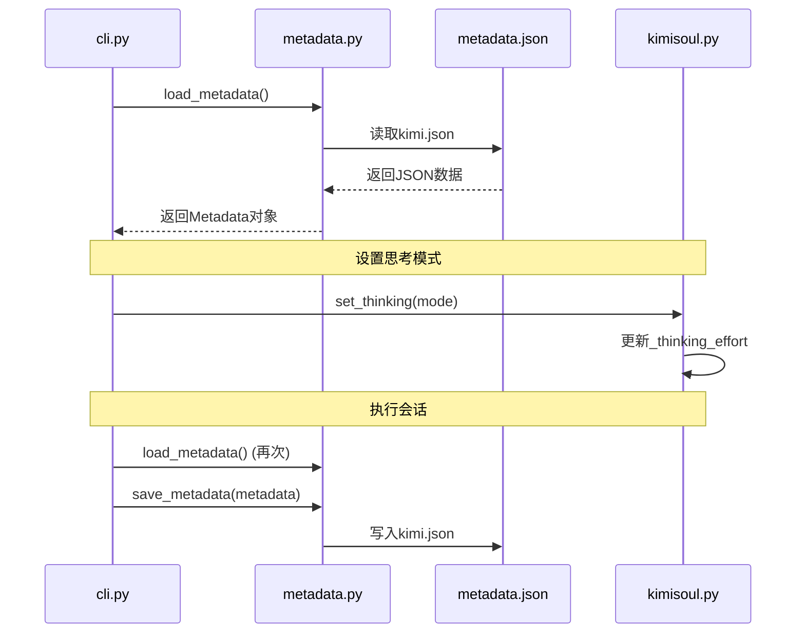
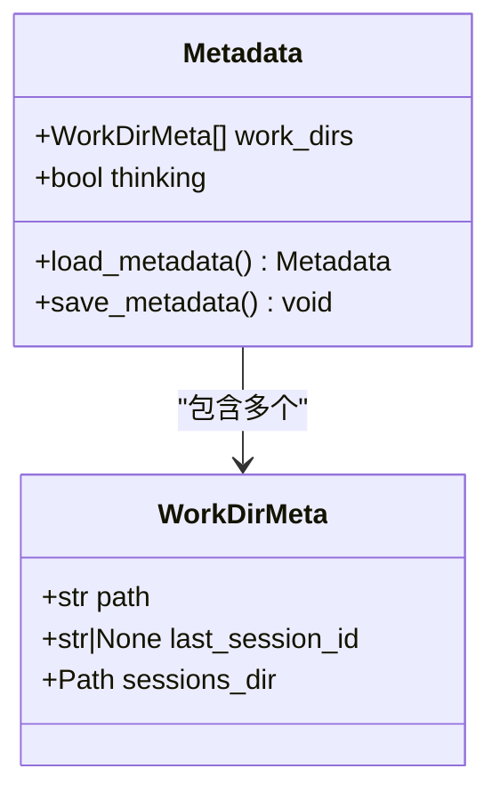
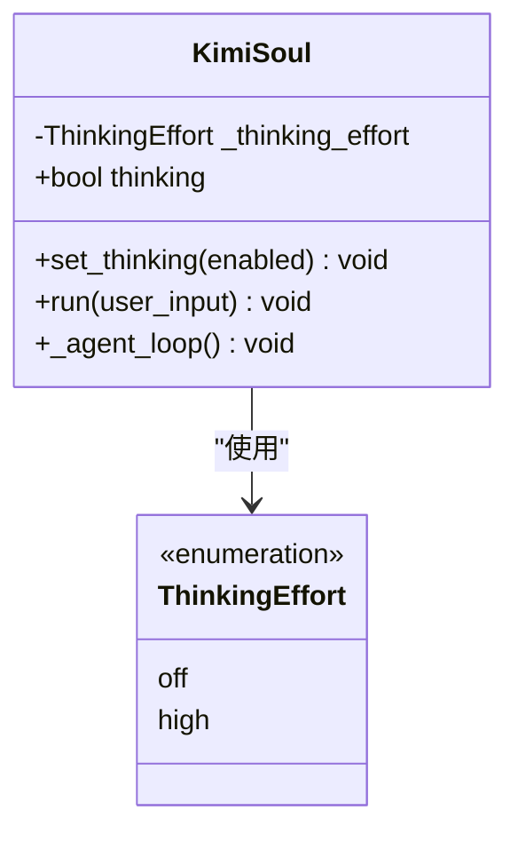
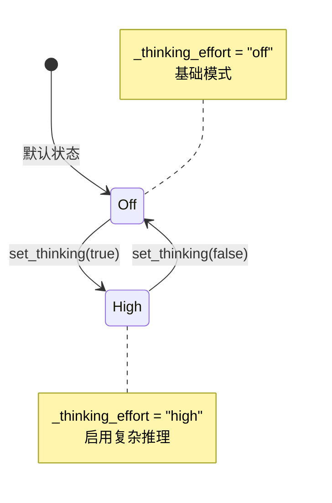
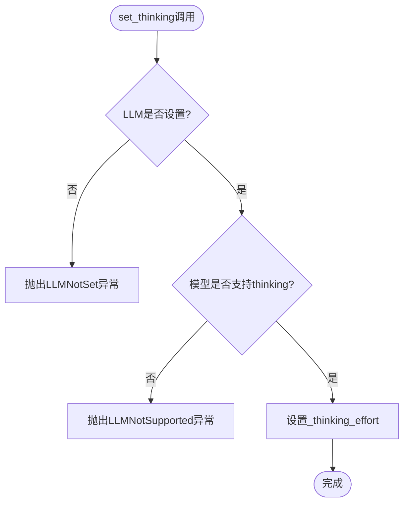
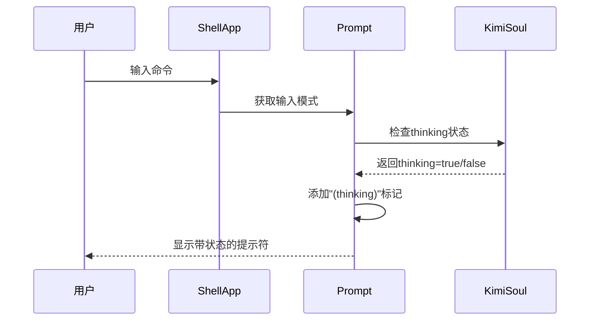
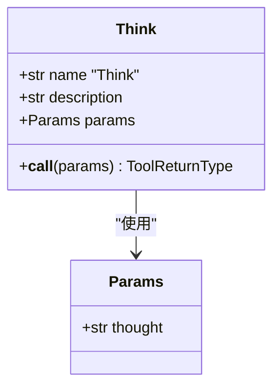

# thinking选项状态持久化机制深度解析

<cite>
**本文档引用的文件**
- [cli.py](file://src/kimi_cli/cli.py)
- [metadata.py](file://src/kimi_cli/metadata.py)
- [app.py](file://src/kimi_cli/app.py)
- [kimisoul.py](file://src/kimi_cli/soul/kimisoul.py)
- [session.py](file://src/kimi_cli/session.py)
- [share.py](file://src/kimi_cli/share.py)
- [think/__init__.py](file://src/kimi_cli/tools/think/__init__.py)
- [think.md](file://src/kimi_cli/tools/think/think.md)
</cite>

## 目录
1. [概述](#概述)
2. [项目架构分析](#项目架构分析)
3. [thinking选项核心机制](#thinking选项核心机制)
4. [状态持久化流程](#状态持久化流程)
5. [元数据文件结构](#元数据文件结构)
6. [思考模式控制逻辑](#思考模式控制逻辑)
7. [用户交互界面](#用户交互界面)
8. [故障排除指南](#故障排除指南)
9. [最佳实践建议](#最佳实践建议)
10. [总结](#总结)

## 概述

`--thinking`选项是kimi-cli中的一个关键功能特性，它控制Agent的思考模式开关，并通过`metadata.json`文件实现状态跨会话持久化。本文档深入解析了这一机制的完整工作流程，包括命令行参数处理、状态读取与保存、以及用户界面集成等各个方面。

## 项目架构分析

kimi-cli采用分层架构设计，将思考模式的实现分布在多个模块中：



**图表来源**
- [cli.py](file://src/kimi_cli/cli.py#L21-L358)
- [app.py](file://src/kimi_cli/app.py#L25-L217)
- [metadata.py](file://src/kimi_cli/metadata.py#L13-L59)

## thinking选项核心机制

### 命令行参数定义

`--thinking`选项在cli.py中被定义为可选布尔值，默认值为None：



**图表来源**
- [cli.py](file://src/kimi_cli/cli.py#L189-L195)
- [app.py](file://src/kimi_cli/app.py#L27-L102)
- [kimisoul.py](file://src/kimi_cli/soul/kimisoul.py#L127-L139)

### 默认行为机制

当`thinking`参数为None时，系统会从元数据中继承上次的设置：



**图表来源**
- [cli.py](file://src/kimi_cli/cli.py#L286-L290)

**章节来源**
- [cli.py](file://src/kimi_cli/cli.py#L189-L195)
- [cli.py](file://src/kimi_cli/cli.py#L286-L290)

## 状态持久化流程

### 元数据加载与保存机制

系统通过`load_metadata()`和`save_metadata()`函数实现状态的持久化：



**图表来源**
- [cli.py](file://src/kimi_cli/cli.py#L284-L285)
- [cli.py](file://src/kimi_cli/cli.py#L318-L339)
- [metadata.py](file://src/kimi_cli/metadata.py#L43-L58)

### 状态更新时机

思考模式的状态会在以下情况下更新：

1. **会话结束时**：保存当前的思考模式状态
2. **新会话创建时**：继承上一次的设置
3. **用户显式切换**：通过命令行参数直接设置

**章节来源**
- [cli.py](file://src/kimi_cli/cli.py#L318-L339)
- [metadata.py](file://src/kimi_cli/metadata.py#L43-L58)

## 元数据文件结构

### metadata.json文件格式

元数据文件位于用户主目录下的`.kimi/kimi.json`，其结构如下：

```json
{
  "work_dirs": [
    {
      "path": "/path/to/workdir",
      "last_session_id": "session-uuid-here"
    }
  ],
  "thinking": false
}
```

### 数据模型定义



**图表来源**
- [metadata.py](file://src/kimi_cli/metadata.py#L33-L41)
- [metadata.py](file://src/kimi_cli/metadata.py#L17-L31)

### 默认值行为

- **thinking字段**：默认值为`false`，表示默认禁用思考模式
- **work_dirs列表**：空列表，表示没有工作目录记录
- **文件不存在时**：自动创建空的Metadata对象

**章节来源**
- [metadata.py](file://src/kimi_cli/metadata.py#L39-L41)
- [metadata.py](file://src/kimi_cli/metadata.py#L46-L51)

## 思考模式控制逻辑

### KimiSoul中的思考模式实现

思考模式的核心实现在KimiSoul类中：



**图表来源**
- [kimisoul.py](file://src/kimi_cli/soul/kimisoul.py#L85)
- [kimisoul.py](file://src/kimi_cli/soul/kimisoul.py#L127-L139)

### 思考模式状态转换



**图表来源**
- [kimisoul.py](file://src/kimi_cli/soul/kimisoul.py#L139)

### LLM能力检测

系统会检查LLM是否支持思考模式：



**图表来源**
- [kimisoul.py](file://src/kimi_cli/soul/kimisoul.py#L135-L139)

**章节来源**
- [kimisoul.py](file://src/kimi_cli/soul/kimisoul.py#L123-L139)

## 用户交互界面

### Shell模式中的思考模式显示

在Shell界面中，思考模式会通过提示符显示：



**图表来源**
- [prompt.py](file://src/kimi_cli/ui/shell/prompt.py#L558-L591)

### 工具调用中的思考模式

思考工具允许在推理过程中添加思考步骤：



**图表来源**
- [think/__init__.py](file://src/kimi_cli/tools/think/__init__.py#L14-L21)

**章节来源**
- [prompt.py](file://src/kimi_cli/ui/shell/prompt.py#L558-L591)
- [think/__init__.py](file://src/kimi_cli/tools/think/__init__.py#L14-L21)

## 故障排除指南

### 常见问题及解决方案

#### 1. 思考模式无法启用

**症状**：使用`--thinking`参数但思考模式未生效

**原因分析**：
- LLM不支持思考模式
- LLM未正确配置
- 元数据文件损坏

**解决方法**：
```bash
# 检查LLM配置
kimi --model gpt-4 --thinking

# 强制重置思考模式
rm ~/.kimi/kimi.json
```

#### 2. 思考模式状态丢失

**症状**：重启后思考模式设置被重置

**原因分析**：
- 元数据文件权限问题
- 文件写入失败
- 程序异常退出

**解决方法**：
```bash
# 检查文件权限
ls -la ~/.kimi/kimi.json

# 手动备份现有配置
cp ~/.kimi/kimi.json ~/.kimi/kimi.json.bak
```

#### 3. 多工作目录间的思考模式冲突

**症状**：在不同工作目录间切换时思考模式行为异常

**原因分析**：
- 元数据文件中缺少对应工作目录记录
- 工作目录路径不匹配

**解决方法**：
```bash
# 清理所有工作目录记录
sed -i '' '/work_dirs/d' ~/.kimi/kimi.json
```

### 调试技巧

#### 启用详细日志

```bash
# 启用调试模式查看思考模式状态
kimi --debug --thinking

# 查看元数据文件内容
cat ~/.kimi/kimi.json
```

#### 手动修改配置

```bash
# 编辑元数据文件
nano ~/.kimi/kimi.json

# 设置全局思考模式为启用
sed -i '' 's/"thinking": false/"thinking": true/g' ~/.kimi/kimi.json
```

## 最佳实践建议

### 1. 配置管理策略

- **定期备份**：定期备份`~/.kimi/kimi.json`文件
- **版本控制**：对于重要的工作目录，考虑版本控制其配置
- **环境隔离**：在不同环境中使用不同的配置文件

### 2. 思考模式使用场景

- **复杂任务**：在需要深度分析的任务中启用思考模式
- **学习阶段**：在学习新工具或新领域时启用思考模式
- **生产环境**：在生产环境中谨慎使用，避免不必要的计算开销

### 3. 性能优化建议

- **按需启用**：只在必要时启用思考模式
- **监控资源**：注意思考模式对系统资源的影响
- **合理配置**：根据具体需求调整思考模式的使用频率

### 4. 安全注意事项

- **敏感信息**：思考模式可能产生大量中间结果，注意保护敏感信息
- **文件权限**：确保`~/.kimi`目录的适当权限设置
- **定期清理**：定期清理过期的会话历史文件

## 总结

kimi-cli的`--thinking`选项通过精心设计的状态持久化机制，实现了思考模式的智能管理和跨会话保持。该机制的核心特点包括：

1. **智能继承**：默认继承上次会话的思考模式设置
2. **灵活控制**：支持命令行参数的显式覆盖
3. **持久化存储**：通过`metadata.json`文件实现状态持久化
4. **错误处理**：完善的异常处理和能力检测机制
5. **用户友好**：在界面中直观显示当前思考模式状态

这种设计不仅提供了良好的用户体验，还确保了系统的稳定性和可靠性。通过理解这些机制，用户可以更有效地利用kimi-cli的各项功能，而开发者也可以在此基础上进行扩展和定制。