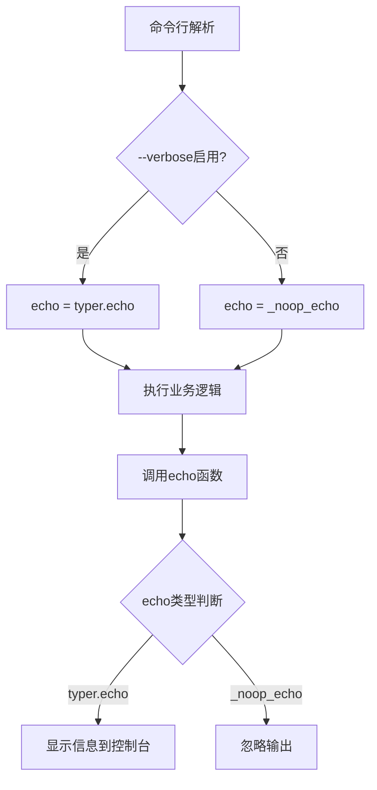
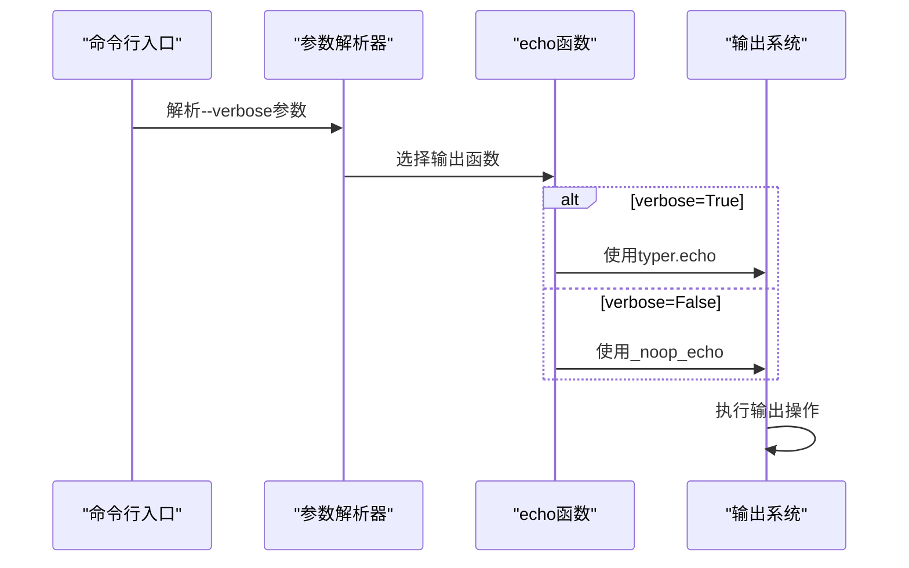
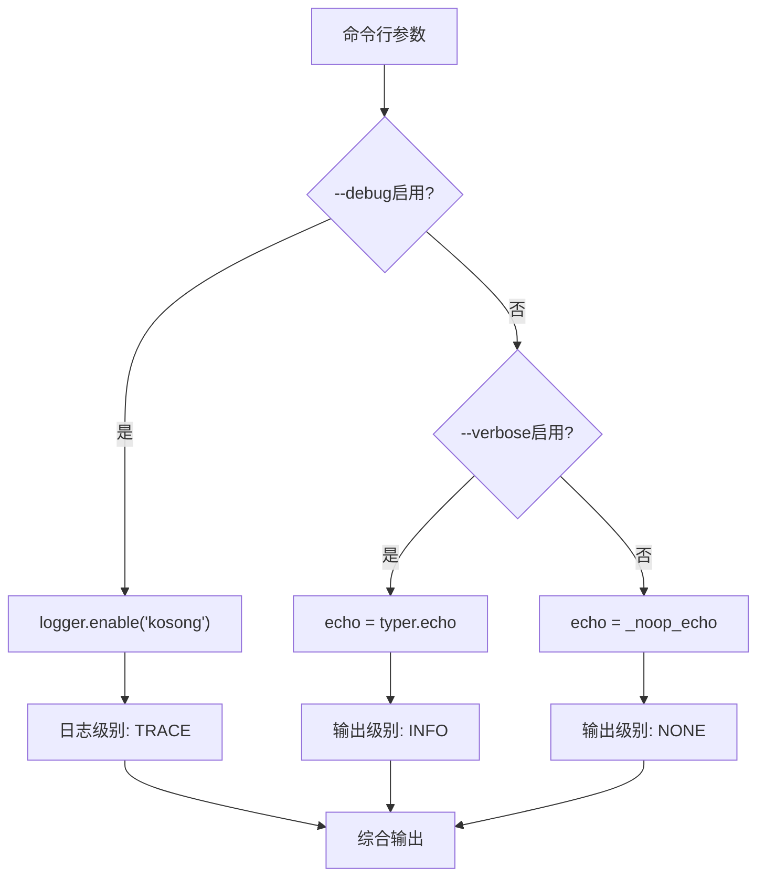

# verbose选项

<cite>
**本文档中引用的文件**
- [cli.py](file://src/kimi_cli/cli.py)
- [app.py](file://src/kimi_cli/app.py)
- [session.py](file://src/kimi_cli/session.py)
- [config.py](file://src/kimi_cli/config.py)
- [logging.py](file://src/kimi_cli/utils/logging.py)
- [ui/CLAUDE.md](file://src/kimi_cli/ui/CLAUDE.md)
- [README.md](file://README.md)
</cite>

## 目录
1. [简介](#简介)
2. [核心功能概述](#核心功能概述)
3. [技术实现机制](#技术实现机制)
4. [与_ui_echo函数的配合逻辑](#与_ui_echo函数的配合逻辑)
5. [不同UI模式下的行为差异](#不同ui模式下的行为差异)
6. [运行时信息输出类型](#运行时信息输出类型)
7. [使用示例](#使用示例)
8. [与其他日志选项的优先级关系](#与其他日志选项的优先级关系)
9. [常见使用场景和最佳实践](#常见使用场景和最佳实践)
10. [故障排除指南](#故障排除指南)

## 简介

`--verbose`命令行选项是kimi-cli项目中的一个重要调试和诊断功能，它通过控制信息输出级别来提供详细的运行时信息。该选项采用条件输出机制，仅在启用时才显示额外的调试信息，从而保持默认输出的简洁性。

## 核心功能概述

`--verbose`选项的主要功能包括：

- **条件信息输出**：根据选项状态决定是否显示详细信息
- **统一输出接口**：通过`echo`函数提供一致的信息输出方式
- **跨模块支持**：在所有UI模式下都能正常工作
- **性能优化**：未启用时避免不必要的字符串操作和I/O开销

## 技术实现机制

### 基础架构

`--verbose`选项的实现基于Python的条件表达式和函数指针技术：



**图表来源**
- [cli.py](file://src/kimi_cli/cli.py#L227-L228)

### 关键实现细节

1. **函数选择机制**：通过三元运算符在运行时选择不同的输出函数
2. **空操作函数**：`_noop_echo`函数提供零开销的输出替代方案
3. **类型安全**：使用Callable类型注解确保函数签名的一致性

**章节来源**
- [cli.py](file://src/kimi_cli/cli.py#L205-L207)
- [cli.py](file://src/kimi_cli/cli.py#L227-L228)

## 与_ui_echo函数的配合逻辑

### _noop_echo函数设计

`_noop_echo`是一个精心设计的空操作函数，具有以下特点：

- **零参数处理**：接受任意数量的位置参数和关键字参数
- **无操作实现**：函数体为空，不执行任何操作
- **类型兼容性**：与`typer.echo`函数签名完全兼容

### 函数指针切换机制



**图表来源**
- [cli.py](file://src/kimi_cli/cli.py#L205-L228)

这种设计实现了以下优势：

1. **性能优化**：未启用时避免函数调用开销
2. **内存效率**：不创建额外的对象或数据结构
3. **代码简洁**：保持业务逻辑的清晰性

**章节来源**
- [cli.py](file://src/kimi_cli/cli.py#L205-L228)

## 不同UI模式下的行为差异

### Shell模式（默认）

在Shell模式下，`--verbose`选项提供最丰富的调试信息：

- **会话管理信息**：创建新会话、继续现有会话的状态
- **配置加载详情**：模型配置、代理文件加载过程
- **环境变量覆盖**：API密钥、基础URL等环境变量的影响
- **工具调用追踪**：各种工具的执行状态和结果

### Print模式

Print模式下的`--verbose`输出更加精简，专注于核心流程：

- **输入输出格式验证**：支持的格式类型和转换过程
- **命令执行状态**：单次命令的执行结果
- **错误诊断信息**：格式错误、权限问题等

### ACP模式和Wire模式

这两种服务器模式下的`--verbose`输出主要用于：

- **连接建立**：客户端连接、认证过程
- **请求处理**：JSON-RPC请求的接收和响应
- **状态监控**：服务器运行状态和资源使用情况

**章节来源**
- [cli.py](file://src/kimi_cli/cli.py#L300-L317)
- [app.py](file://src/kimi_cli/app.py#L136-L216)

## 运行时信息输出类型

### 会话创建和管理

启用`--verbose`后，系统会显示以下会话相关信息：

| 信息类型 | 输出内容 | 触发时机 |
|---------|---------|---------|
| 新会话创建 | "✓ Created new session: {session_id}" | Session.create()调用时 |
| 继续会话 | "✓ Continuing previous session: {session_id}" | Session.continue_()调用时 |
| 历史文件路径 | "✓ Session history file: {history_file}" | 会话初始化完成时 |

### 配置加载过程

配置系统的详细输出包括：

| 配置阶段 | 输出信息 | 日志级别 |
|---------|---------|---------|
| 配置文件读取 | "Loading config from file: {file}" | DEBUG |
| 默认配置创建 | "No config file found, creating default config" | DEBUG |
| 配置保存 | "Saving config to file: {file}" | DEBUG |
| LLM提供商信息 | "Using LLM provider: {provider}" | INFO |
| LLM模型信息 | "Using LLM model: {model}" | INFO |

### 系统启动和初始化

系统启动过程中的详细信息：

- **工作目录设置**：当前工作目录和会话目录
- **环境变量检查**：KIMI_API_KEY、KIMI_BASE_URL等
- **模型能力检测**：支持的模型特性和限制
- **代理文件加载**：自定义代理规范的解析过程

**章节来源**
- [cli.py](file://src/kimi_cli/cli.py#L248-L252)
- [app.py](file://src/kimi_cli/app.py#L52-L82)
- [config.py](file://src/kimi_cli/config.py#L127-L134)

## 使用示例

### 基本使用

```bash
# 启用详细输出
kimi --verbose

# 结合其他选项使用
kimi --verbose --debug --work-dir ./project

# 在特定UI模式下使用
kimi --verbose --print -c "列出当前目录内容"
```

### 输出对比示例

#### 禁用verbose时的输出

```bash
$ kimi
✓ Session created: abc123
✓ Ready to assist you
```

#### 启用verbose时的输出

```bash
$ kimi --verbose
✓ Created new session: abc123
✓ Session history file: /home/user/.kimi/sessions/abc123.jsonl
✓ Loaded config: Config(default_model='moonshot', ...)
✓ Using LLM provider: LLMProvider(type='moonshot', ...)
✓ Using LLM model: LLMModel(provider='moonshot', model='moonshot-large', ...)
✓ Ready to assist you
```

### 实际应用场景

#### 开发调试场景

```bash
# 调试配置加载问题
kimi --verbose --debug --agent-file ./custom-agent.yaml

# 检查会话恢复功能
kimi --verbose --continue --work-dir ./project
```

#### 生产环境监控

```bash
# 监控工具调用过程
kimi --verbose --yolo -c "运行自动化脚本"

# 检查MCP配置加载
kimi --verbose --mcp-config-file ./mcp-config.json
```

**章节来源**
- [cli.py](file://src/kimi_cli/cli.py#L248-L252)

## 与其他日志选项的优先级关系

### 与--debug选项的关系

`--verbose`和`--debug`选项存在明确的优先级关系：



**图表来源**
- [cli.py](file://src/kimi_cli/cli.py#L230-L238)

### 日志级别配置

| 选项组合 | 日志级别 | 输出级别 | 详细程度 |
|---------|---------|---------|---------|
| 无选项 | INFO | NONE | 最低 |
| --verbose | INFO | INFO | 中等 |
| --debug | TRACE | INFO | 高度 |
| --verbose + --debug | TRACE | INFO | 最高 |

### 性能影响分析

- **--verbose alone**：主要影响输出函数的选择，性能开销最小
- **--debug alone**：启用完整日志系统，可能有轻微性能影响
- **两者同时使用**：获得最大详细程度，但可能增加I/O开销

**章节来源**
- [cli.py](file://src/kimi_cli/cli.py#L230-L238)
- [logging.py](file://src/kimi_cli/utils/logging.py#L1-L21)

## 常见使用场景和最佳实践

### 开发和调试场景

1. **配置问题诊断**
   ```bash
   # 检查配置文件加载过程
   kimi --verbose --debug
   
   # 验证自定义代理文件
   kimi --verbose --agent-file ./my-agent.yaml
   ```

2. **会话管理调试**
   ```bash
   # 检查会话创建过程
   kimi --verbose --continue
   
   # 验证工作目录设置
   kimi --verbose --work-dir ./test-project
   ```

### 自动化和CI/CD场景

1. **批处理脚本**
   ```bash
   # 在脚本中启用详细输出
   kimi --verbose --print -c "$COMMAND" > output.log 2>&1
   ```

2. **错误排查**
   ```bash
   # 记录完整的执行过程
   kimi --verbose --debug --yolo -c "部署应用" >> deploy.log 2>&1
   ```

### 性能优化建议

1. **按需启用**：仅在需要调试时启用`--verbose`
2. **组合使用**：根据具体需求选择合适的选项组合
3. **输出重定向**：在长时间运行的任务中重定向输出到文件
4. **环境变量**：考虑使用环境变量而非命令行参数

### 最佳实践清单

- **开发阶段**：始终使用`--verbose --debug`进行问题诊断
- **测试阶段**：定期验证`--verbose`输出的准确性
- **生产环境**：避免在生产环境中使用`--verbose`
- **持续集成**：在CI/CD管道中适当使用详细输出

**章节来源**
- [cli.py](file://src/kimi_cli/cli.py#L248-L351)

## 故障排除指南

### 常见问题和解决方案

#### 问题1：`--verbose`没有产生预期输出

**可能原因**：
- UI模式不支持详细输出
- 权限限制阻止了输出

**解决方案**：
```bash
# 尝试不同的UI模式
kimi --verbose --print -c "测试命令"

# 检查输出重定向
kimi --verbose > verbose_output.txt 2>&1
```

#### 问题2：性能问题

**可能原因**：
- 过度使用`--verbose`和`--debug`
- 输出量过大导致I/O瓶颈

**解决方案**：
```bash
# 减少详细程度
kimi --verbose  # 避免同时使用--debug

# 重定向输出到文件
kimi --verbose > output.log 2>&1
```

#### 问题3：日志文件过大

**可能原因**：
- 长时间运行且启用了`--debug`
- 输出频率过高

**解决方案**：
```bash
# 使用轮转日志
kimi --debug --work-dir ./limited-output

# 限制输出量
kimi --verbose --yolo -c "短命令"
```

### 调试技巧

1. **分步验证**：逐步添加选项来定位问题
2. **输出分析**：仔细检查`--verbose`输出中的模式
3. **环境隔离**：在干净环境中测试选项效果
4. **版本对比**：比较不同版本的行为差异

**章节来源**
- [cli.py](file://src/kimi_cli/cli.py#L248-L351)
- [logging.py](file://src/kimi_cli/utils/logging.py#L1-L21)

## 总结

`--verbose`命令行选项是kimi-cli项目中一个精心设计的调试工具，它通过巧妙的函数指针技术和条件输出机制，在提供详细信息的同时保持了良好的性能特性。该选项与`_noop_echo`函数的配合实现了零开销的禁用状态，而与`--debug`选项的协作则提供了灵活的日志级别控制。

在实际使用中，`--verbose`选项为开发者和用户提供了一个强大的诊断工具，能够帮助快速定位问题、理解系统行为，并优化配置。通过遵循最佳实践和故障排除指南，用户可以充分发挥这一功能的价值，同时避免潜在的性能问题。