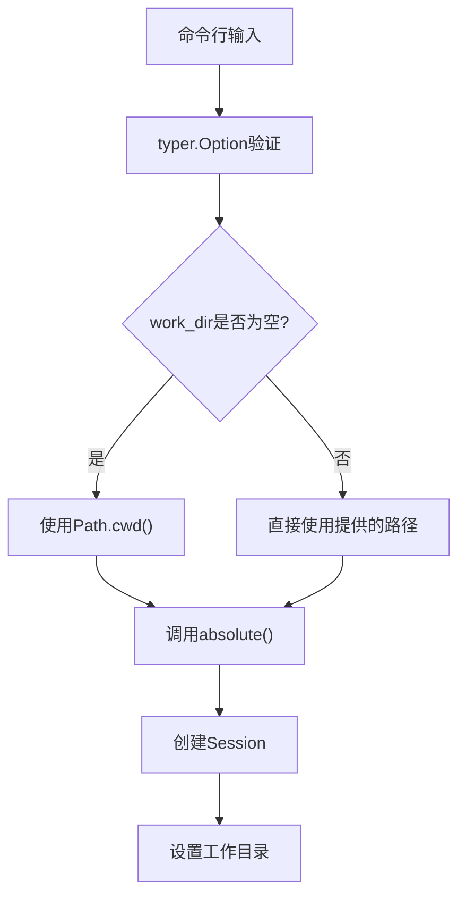
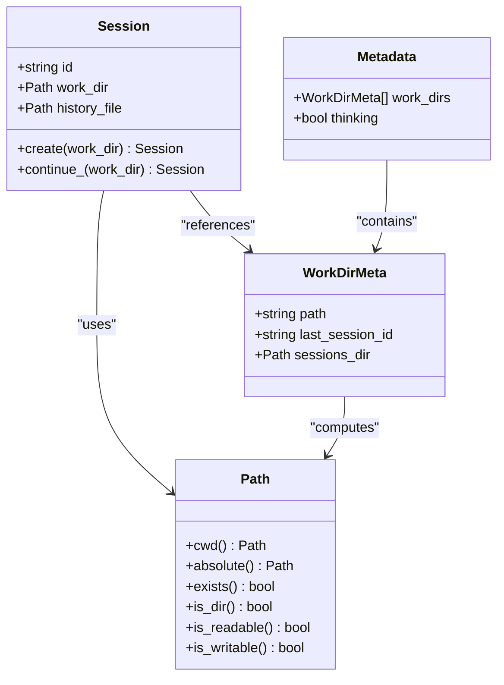
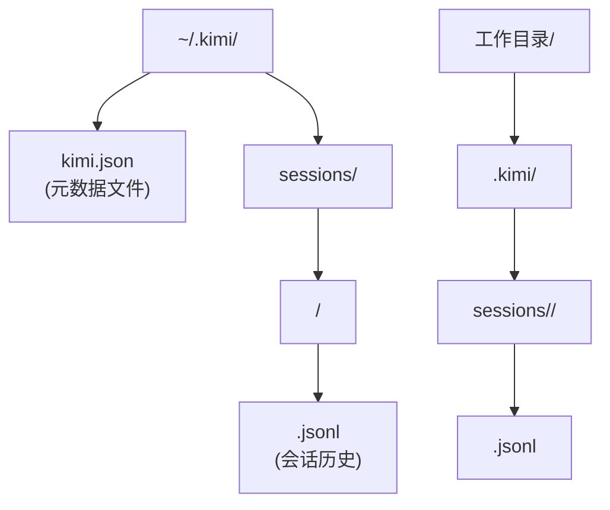
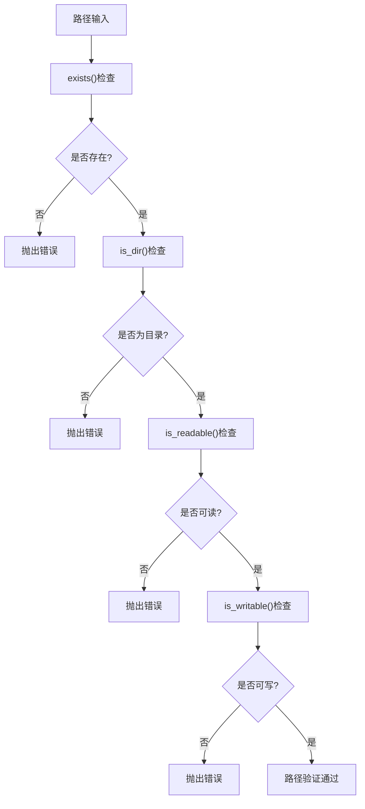
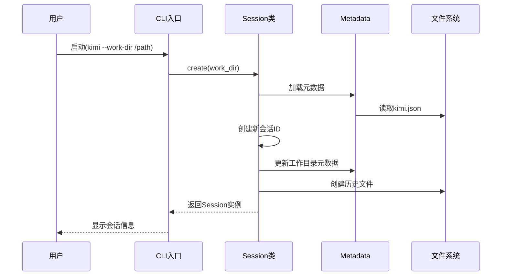
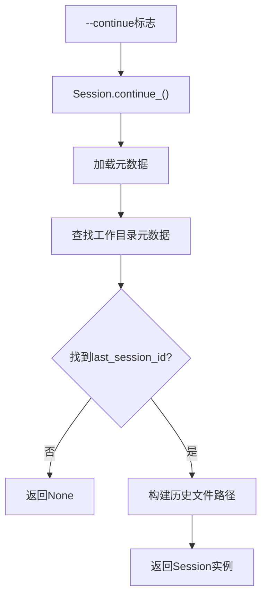
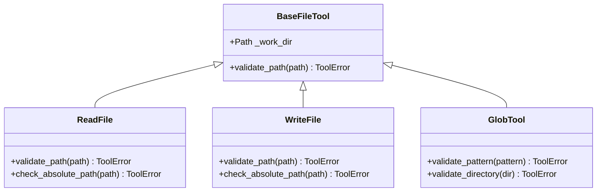
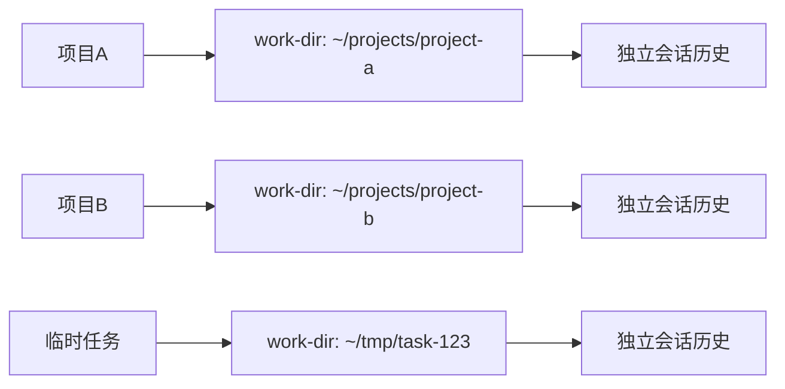
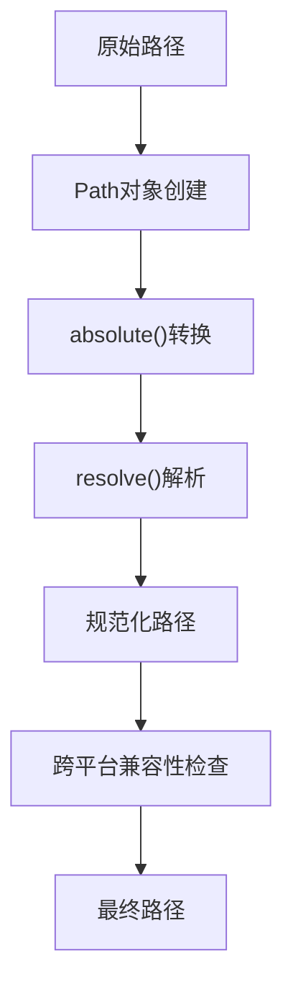

# work-dir选项详细说明

<cite>
**本文档引用的文件**
- [cli.py](file://src/kimi_cli/cli.py)
- [session.py](file://src/kimi_cli/session.py)
- [metadata.py](file://src/kimi_cli/metadata.py)
- [path.py](file://src/kimi_cli/utils/path.py)
- [read.py](file://src/kimi_cli/tools/file/read.py)
- [write.py](file://src/kimi_cli/tools/file/write.py)
- [glob.py](file://src/kimi_cli/tools/file/glob.py)
- [share.py](file://src/kimi_cli/share.py)
- [test_session.py](file://tests/test_session.py)
</cite>

## 目录
1. [简介](#简介)
2. [工作目录选项概述](#工作目录选项概述)
3. [核心架构分析](#核心架构分析)
4. [路径解析和验证机制](#路径解析和验证机制)
5. [会话历史管理](#会话历史管理)
6. [文件操作范围控制](#文件操作范围控制)
7. [多项目环境最佳实践](#多项目环境最佳实践)
8. [跨平台路径配置](#跨平台路径配置)
9. [常见错误排查](#常见错误排查)
10. [总结](#总结)

## 简介

`--work-dir`选项是kimi-cli中的一个关键功能，它为Agent会话提供了独立的工作上下文环境。通过指定工作目录，用户可以创建隔离的文件操作范围，实现会话持久化，并在不同项目之间保持独立的状态管理。

该选项不仅影响文件系统的访问权限，还决定了会话历史的存储位置，是kimi-cli实现多项目管理和状态隔离的核心机制。

## 工作目录选项概述

### 命令行参数定义

`--work-dir`选项在命令行接口中被定义为一个可选参数，具有以下特性：

- **别名**: `-w`
- **类型**: `Path`对象
- **默认值**: `None`（使用当前工作目录）
- **验证要求**: 必须存在、可读、可写且为目录
- **帮助信息**: "Agent的工作目录。默认：当前目录"

### 在代码中的实现

在`cli.py`文件中，`--work-dir`选项的处理逻辑如下：



**图表来源**
- [cli.py](file://src/kimi_cli/cli.py#L83-L94)
- [cli.py](file://src/kimi_cli/cli.py#L239-L250)

**节来源**
- [cli.py](file://src/kimi_cli/cli.py#L83-L94)
- [cli.py](file://src/kimi_cli/cli.py#L239-L250)

## 核心架构分析

### 工作目录与会话的关系

工作目录管理涉及多个核心组件的协作：



**图表来源**
- [session.py](file://src/kimi_cli/session.py#L11-L18)
- [metadata.py](file://src/kimi_cli/metadata.py#L17-L31)
- [metadata.py](file://src/kimi_cli/metadata.py#L33-L41)

### 目录结构组织

系统采用分层的目录结构来管理会话数据：



**图表来源**
- [metadata.py](file://src/kimi_cli/metadata.py#L27-L30)
- [share.py](file://src/kimi_cli/share.py#L6-L10)

**节来源**
- [metadata.py](file://src/kimi_cli/metadata.py#L27-L30)
- [share.py](file://src/kimi_cli/share.py#L6-L10)

## 路径解析和验证机制

### Path.cwd()和absolute()的调用

系统在处理工作目录时采用了严格的路径解析策略：

1. **默认行为**: 当未指定`--work-dir`时，使用`Path.cwd()`获取当前工作目录
2. **绝对路径转换**: 调用`absolute()`确保获得完整的绝对路径
3. **路径验证**: 通过typer的内置验证机制确保路径的有效性

### 目录权限检查

系统实现了多层次的目录验证机制：



**图表来源**
- [cli.py](file://src/kimi_cli/cli.py#L88-L92)

### 可读写性检查的具体实现

在文件操作工具中，系统对路径的安全性进行了额外的验证：

**节来源**
- [cli.py](file://src/kimi_cli/cli.py#L88-L92)
- [cli.py](file://src/kimi_cli/cli.py#L239-L240)

## 会话历史管理

### 会话生命周期

工作目录与会话历史紧密关联，形成了完整的生命周期管理：



**图表来源**
- [cli.py](file://src/kimi_cli/cli.py#L249-L252)
- [session.py](file://src/kimi_cli/session.py#L19-L56)

### 历史文件命名规则

每个会话的历史文件采用统一的命名格式：
- **格式**: `{session-id}.jsonl`
- **位置**: `~/.kimi/sessions/{hash}/`
- **哈希计算**: 使用工作目录路径的MD5哈希值作为子目录名

### 继续会话功能

系统支持从之前的工作目录恢复会话：



**图表来源**
- [cli.py](file://src/kimi_cli/cli.py#L241-L247)
- [session.py](file://src/kimi_cli/session.py#L58-L83)

**节来源**
- [cli.py](file://src/kimi_cli/cli.py#L241-L247)
- [session.py](file://src/kimi_cli/session.py#L19-L83)

## 文件操作范围控制

### 工作目录边界保护

所有文件操作工具都实施了严格的工作目录边界检查：



**图表来源**
- [read.py](file://src/kimi_cli/tools/file/read.py#L60-L70)
- [write.py](file://src/kimi_cli/tools/file/write.py#L37-L52)
- [glob.py](file://src/kimi_cli/tools/file/glob.py#L63-L77)

### 路径安全性验证

系统实现了多层次的路径安全检查：

1. **绝对路径检查**: 确保所有文件操作使用绝对路径
2. **路径遍历防护**: 验证目标路径不超出工作目录范围
3. **目录存在性检查**: 确保父目录存在

### 具体验证逻辑

以`WriteFile`工具为例，路径验证包含以下步骤：

1. **绝对路径验证**: 检查路径是否为绝对路径
2. **工作目录边界检查**: 使用`resolve()`解析路径并验证边界
3. **父目录存在性检查**: 确保目标目录已存在

**节来源**
- [read.py](file://src/kimi_cli/tools/file/read.py#L60-L70)
- [write.py](file://src/kimi_cli/tools/file/write.py#L37-L52)
- [glob.py](file://src/kimi_cli/tools/file/glob.py#L63-L77)

## 多项目环境最佳实践

### 项目隔离策略

在多项目环境中，建议采用以下工作目录组织策略：

1. **按项目命名**: 使用清晰的项目名称作为工作目录
2. **版本控制集成**: 将工作目录设置为Git仓库根目录
3. **临时项目**: 为一次性任务创建临时工作目录

### 会话管理建议



### 状态保持和恢复

系统支持在不同项目间无缝切换：

- **自动状态保存**: 每次退出时自动保存会话状态
- **智能恢复**: 使用`--continue`标志快速恢复之前的会话
- **元数据管理**: 通过全局元数据文件跟踪所有工作目录

**节来源**
- [cli.py](file://src/kimi_cli/cli.py#L320-L335)

## 跨平台路径配置

### 平台差异处理

系统在跨平台兼容性方面采取了以下措施：

1. **路径分隔符**: 自动处理Windows的`\`和Unix系统的`/`
2. **绝对路径标准化**: 统一使用绝对路径表示
3. **权限模型适配**: 根据操作系统调整权限检查

### Windows特定考虑

在Windows平台上，系统提供了专门的命令提示符工具：

- **路径转义**: 自动处理特殊字符和空格
- **驱动器切换**: 支持`cd /d`命令进行驱动器切换
- **权限模型**: 适应Windows的文件权限系统

### 路径规范化流程



**图表来源**
- [cli.py](file://src/kimi_cli/cli.py#L239-L240)

**节来源**
- [cli.py](file://src/kimi_cli/cli.py#L239-L240)

## 常见错误排查

### 路径相关错误

以下是常见的`--work-dir`使用错误及解决方案：

| 错误类型 | 症状 | 解决方案 |
|---------|------|----------|
| 路径不存在 | `No previous session found` | 确保工作目录存在 |
| 权限不足 | `Permission denied` | 检查目录读写权限 |
| 不是目录 | `Not a directory` | 确保路径指向目录而非文件 |
| 路径格式错误 | `Invalid path` | 使用绝对路径 |

### 会话恢复问题

当遇到会话恢复失败时：

1. **检查元数据文件**: 确认`~/.kimi/kimi.json`存在且有效
2. **验证工作目录记录**: 检查元数据中是否包含对应的工作目录
3. **清理损坏的会话**: 删除对应的会话历史文件重新开始

### 性能优化建议

1. **避免深层嵌套目录**: 保持工作目录结构简单
2. **定期清理历史文件**: 删除不再需要的会话历史
3. **合理使用缓存**: 利用系统缓存提高文件操作性能

### 调试技巧

启用调试模式获取详细的路径解析信息：

```bash
kimi --debug --work-dir /path/to/project
```

这将显示：
- 路径解析过程
- 权限检查结果
- 会话创建/恢复详情

**节来源**
- [cli.py](file://src/kimi_cli/cli.py#L241-L247)
- [session.py](file://src/kimi_cli/session.py#L60-L83)

## 总结

`--work-dir`选项是kimi-cli实现强大工作空间管理功能的核心。通过提供独立的工作上下文，它实现了：

1. **项目隔离**: 不同项目拥有独立的文件操作范围和会话状态
2. **状态持久化**: 会话历史自动保存和恢复
3. **安全控制**: 严格的路径边界检查防止意外的文件操作
4. **跨平台兼容**: 统一的路径处理机制支持多种操作系统
5. **灵活配置**: 支持从当前目录到自定义目录的各种使用场景

正确使用`--work-dir`选项能够显著提升开发效率，特别是在处理多个项目或需要保持会话连续性的场景中。通过遵循最佳实践和注意跨平台差异，用户可以充分发挥这一功能的优势。