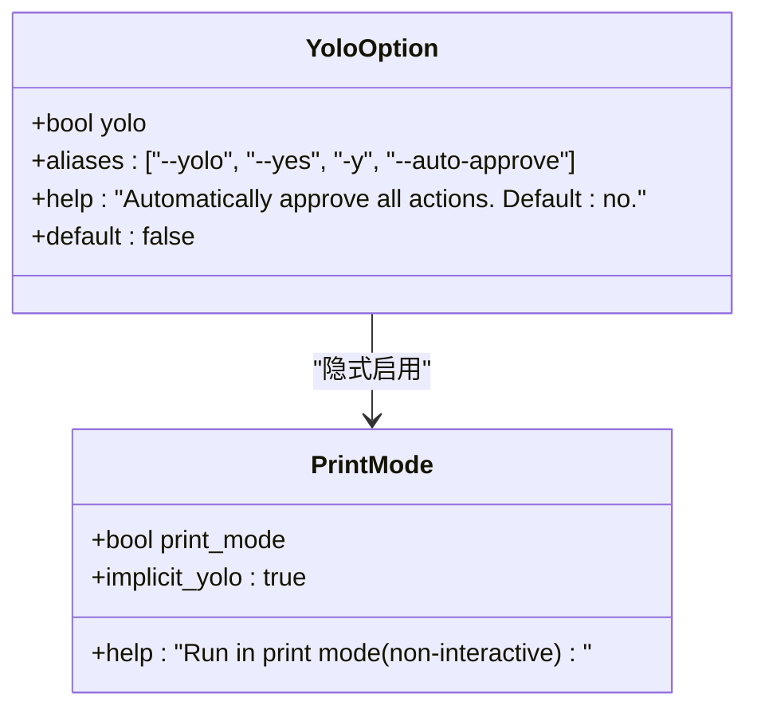
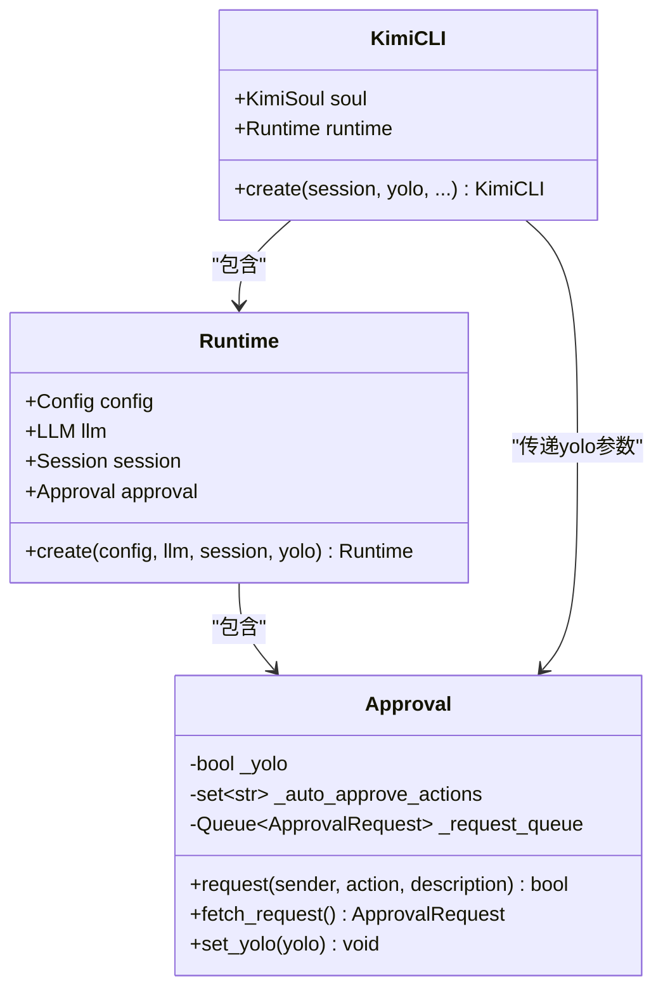
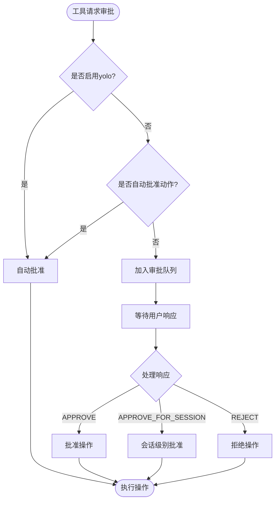
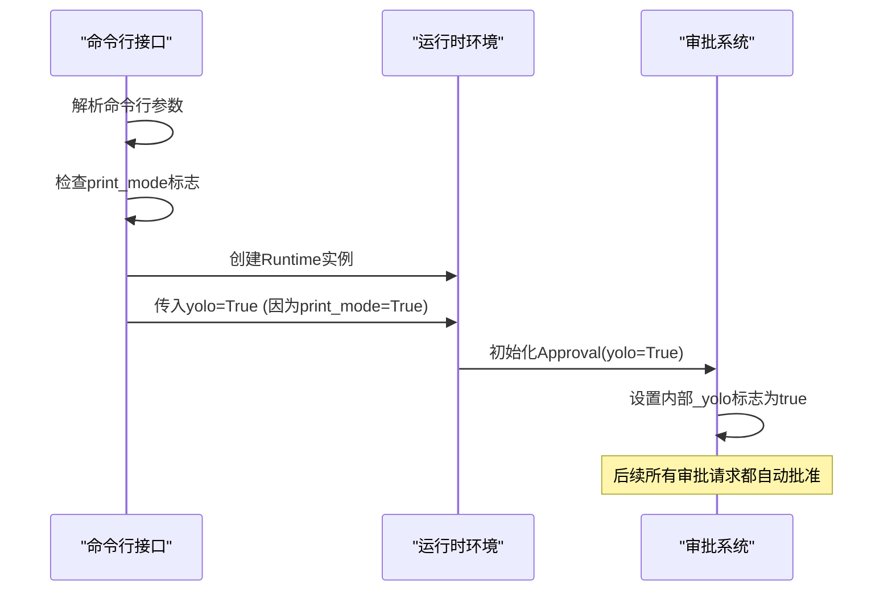
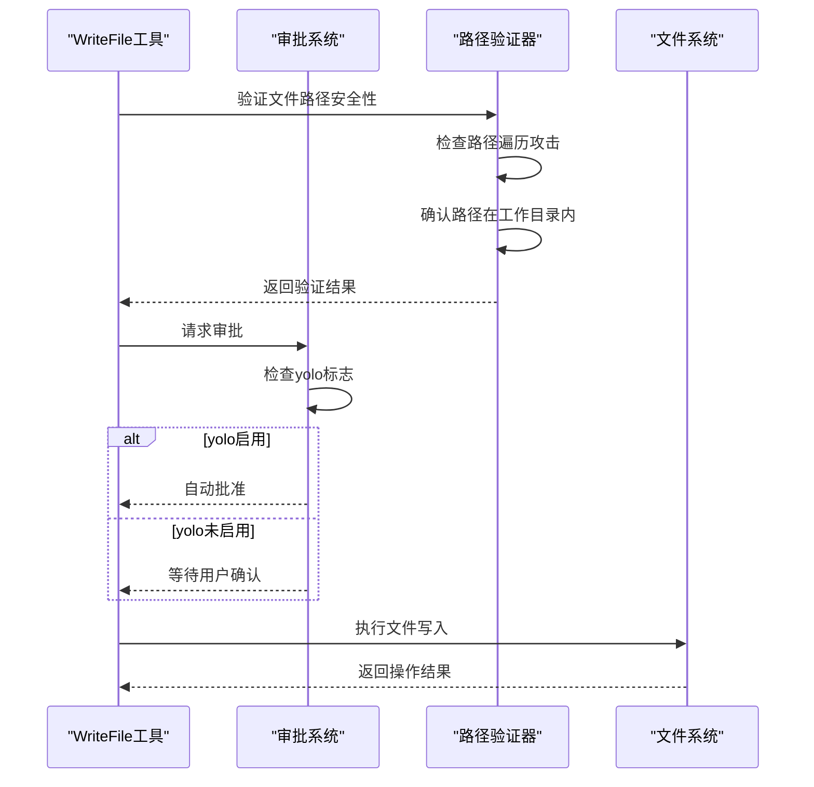
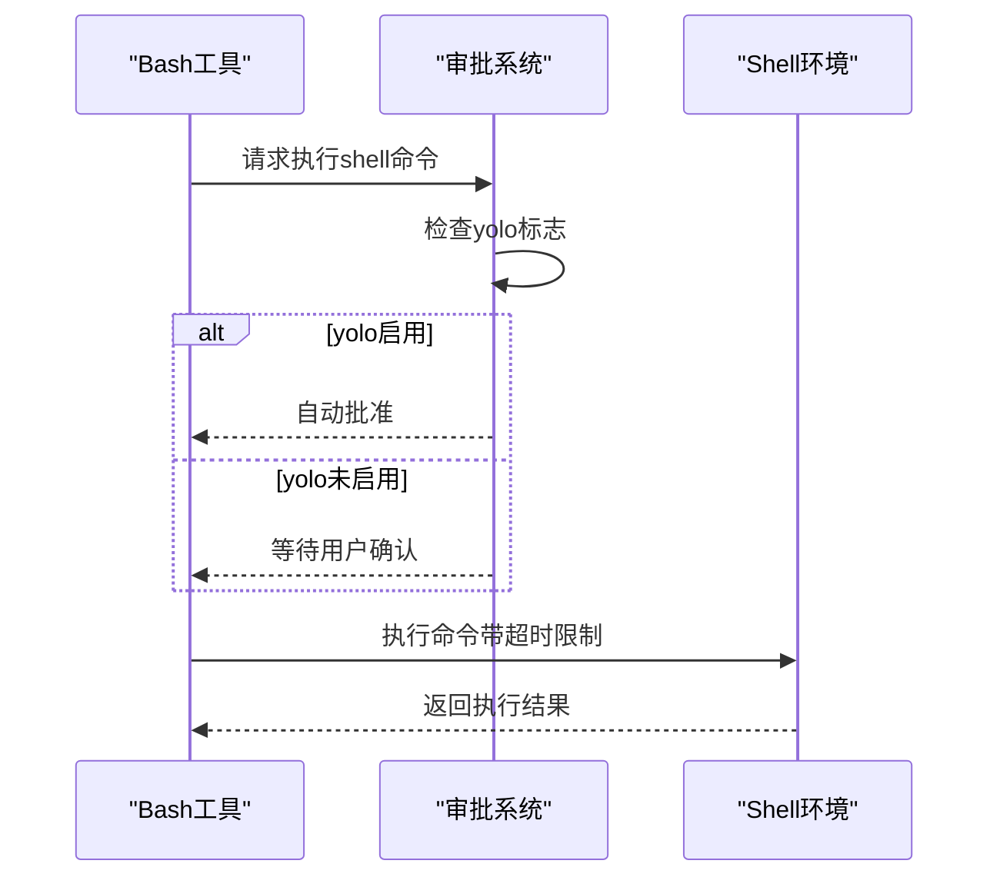
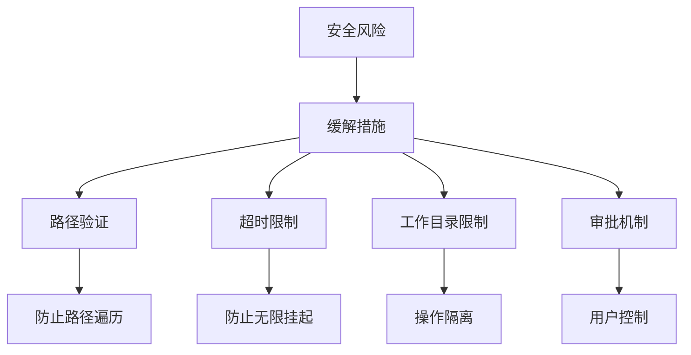
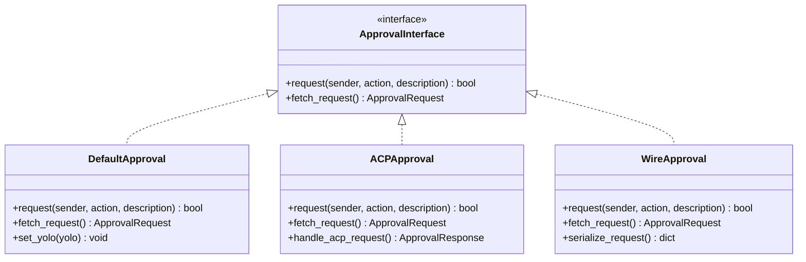

# yolo选项：自动审批机制详解

<cite>
**本文档引用的文件**
- [cli.py](file://src/kimi_cli/cli.py)
- [approval.py](file://src/kimi_cli/soul/approval.py)
- [runtime.py](file://src/kimi_cli/soul/runtime.py)
- [app.py](file://src/kimi_cli/app.py)
- [write.py](file://src/kimi_cli/tools/file/write.py)
- [cmd.py](file://src/kimi_cli/tools/bash/cmd.py)
- [__init__.py](file://src/kimi_cli/tools/file/__init__.py)
- [message.py](file://src/kimi_cli/wire/message.py)
- [print/__init__.py](file://src/kimi_cli/ui/print/__init__.py)
</cite>

## 目录
1. [概述](#概述)
2. [命令行参数定义](#命令行参数定义)
3. [自动审批机制架构](#自动审批机制架构)
4. [print模式下的隐式启用](#print模式下的隐式启用)
5. [工具执行中的审批流程](#工具执行中的审批流程)
6. [安全风险分析](#安全风险分析)
7. [最佳实践建议](#最佳实践建议)
8. [系统可扩展性设计](#系统可扩展性设计)
9. [总结](#总结)

## 概述

`--yolo`选项是kimi-cli中的一个关键安全机制，它允许用户绕过工具执行前的用户确认流程，实现全自动操作。该选项通过设置全局的自动审批标志，使得所有需要用户授权的操作都能立即执行，无需人工干预。

### 核心特性
- **全自动操作**：绕过所有用户确认步骤
- **隐式启用**：在print模式下自动激活
- **细粒度控制**：支持会话级别的自动批准
- **安全边界**：仍然受工作目录限制和路径验证

## 命令行参数定义

`--yolo`选项在命令行接口中被定义为多个别名，提供了灵活的使用方式：



**图表来源**
- [cli.py](file://src/kimi_cli/cli.py#L179-L188)
- [cli.py](file://src/kimi_cli/cli.py#L114-L122)

**章节来源**
- [cli.py](file://src/kimi_cli/cli.py#L179-L188)

## 自动审批机制架构

### 审批系统核心组件



**图表来源**
- [approval.py](file://src/kimi_cli/soul/approval.py#L10-L76)
- [runtime.py](file://src/kimi_cli/soul/runtime.py#L66-L101)
- [app.py](file://src/kimi_cli/app.py#L25-L102)

### 审批决策流程



**图表来源**
- [approval.py](file://src/kimi_cli/soul/approval.py#L20-L70)

**章节来源**
- [approval.py](file://src/kimi_cli/soul/approval.py#L10-L76)

## print模式下的隐式启用

### print模式特性

print模式是一种非交互式的运行模式，专门用于自动化脚本和批处理任务。在这种模式下，系统不会显示任何用户界面，而是直接输出结果到标准输出。

### 隐式yolo启用机制



**图表来源**
- [cli.py](file://src/kimi_cli/cli.py#L221-L222)
- [cli.py](file://src/kimi_cli/cli.py#L294)

### 实现细节

在`cli.py`中，print模式的隐式yolo启用通过以下逻辑实现：

```python
# 在cli.py第294行附近
instance = await KimiCLI.create(
    session,
    yolo=yolo or (ui == "print"),  # print模式隐式启用yolo
    mcp_configs=mcp_configs,
    model_name=model_name,
    thinking=thinking_mode,
    agent_file=agent_file,
)
```

**章节来源**
- [cli.py](file://src/kimi_cli/cli.py#L294)
- [print/__init__.py](file://src/kimi_cli/ui/print/__init__.py#L1-L127)

## 工具执行中的审批流程

### 文件写入工具的审批流程

文件写入操作是最敏感的安全风险点之一，系统实现了严格的审批和验证机制：



**图表来源**
- [write.py](file://src/kimi_cli/tools/file/write.py#L55-L119)

### shell命令执行的审批流程

shell命令执行涉及更广泛的安全风险，系统同样实施了多层审批机制：



**图表来源**
- [cmd.py](file://src/kimi_cli/tools/bash/cmd.py#L42-L51)

### 审批动作类型定义

系统定义了明确的动作类型来区分不同的操作：

| 动作类型 | 描述 | 安全级别 |
|---------|------|----------|
| `read file` | 文件读取操作 | 低 |
| `edit file` | 文件编辑操作 | 中 |
| `run shell command` | shell命令执行 | 高 |

**章节来源**
- [write.py](file://src/kimi_cli/tools/file/write.py#L93-L96)
- [cmd.py](file://src/kimi_cli/tools/bash/cmd.py#L46-L48)
- [__init__.py](file://src/kimi_cli/tools/file/__init__.py#L10-L13)

## 安全风险分析

### 主要风险场景

#### 1. 自动文件修改风险
当启用yolo选项时，任何需要文件写入权限的操作都会立即执行，可能导致意外的文件修改或删除。

#### 2. shell命令执行风险
未经确认的shell命令执行可能带来严重的系统安全问题，包括但不限于：
- 敏感文件的意外删除
- 系统配置的破坏
- 恶意代码的执行

#### 3. 路径遍历攻击
虽然系统实施了路径验证，但在某些情况下仍可能存在绕过风险。

### 风险缓解措施



**章节来源**
- [write.py](file://src/kimi_cli/tools/file/write.py#L37-L52)
- [cmd.py](file://src/kimi_cli/tools/bash/cmd.py#L13-L26)

## 最佳实践建议

### 1. 临时启用策略

```bash
# 推荐：仅在必要时临时启用yolo
kimi --yolo --command "批量处理文件"

# 不推荐：长期启用yolo
kimi --yolo  # 可能导致意外操作
```

### 2. 结合--verbose监控执行过程

```bash
# 使用verbose模式监控所有操作
kimi --yolo --verbose --command "执行敏感操作"
```

### 3. 工作目录隔离

```bash
# 在隔离的工作目录中使用yolo
mkdir /tmp/safe-workspace
cd /tmp/safe-workspace
kimi --yolo --work-dir /tmp/safe-workspace --command "清理临时文件"
```

### 4. 分阶段验证

```bash
# 第一步：先以交互模式验证
kimi --command "分析文件结构"

# 第二步：确认无误后使用yolo
kimi --yolo --command "批量修改文件"
```

### 5. 会话级别批准

对于重复使用的操作，可以考虑使用会话级别的自动批准：

```bash
# 1. 首次执行时选择"approve for session"
# 2. 后续相同操作自动批准
kimi --yolo --command "格式化代码"
```

## 系统可扩展性设计

### 审批系统的模块化设计



**图表来源**
- [approval.py](file://src/kimi_cli/soul/approval.py#L10-L76)
- [message.py](file://src/kimi_cli/wire/message.py#L70-L107)

### 扩展点设计

#### 1. 新工具类型的审批支持

```python
# 示例：添加新的文件操作类型
class NewFileActions(str, Enum):
    READ = "read file"
    EDIT = "edit file"
    NEW_OPERATION = "new operation"  # 新增操作类型
```

#### 2. 自定义审批规则

```python
# 示例：基于时间的审批规则
class TimeBasedApproval(Approval):
    def __init__(self, yolo: bool = False):
        super().__init__(yolo)
        self._time_limits = {
            "edit file": 30,  # 秒
            "run shell command": 60
        }
```

#### 3. 多因素审批支持

```python
# 示例：需要多个因素才能批准
class MultiFactorApproval(Approval):
    def __init__(self, factors: List[ApprovalFactor]):
        self.factors = factors
        self._approved_factors = set()
    
    async def request(self, sender: str, action: str, description: str) -> bool:
        # 实现多因素审批逻辑
        pass
```

**章节来源**
- [approval.py](file://src/kimi_cli/soul/approval.py#L10-L76)
- [message.py](file://src/kimi_cli/wire/message.py#L70-L107)

## 总结

`--yolo`选项是kimi-cli中一个强大但需要谨慎使用的功能。它通过以下机制实现全自动操作：

1. **命令行集成**：提供多种别名，便于用户快速启用
2. **隐式激活**：在print模式下自动启用，满足自动化需求
3. **统一审批**：通过Approval类实现统一的审批管理
4. **安全边界**：保留路径验证和工作目录限制等安全措施

### 关键要点

- **安全第一**：始终优先考虑安全性，避免不必要的yolo使用
- **最小权限原则**：仅在必要时启用yolo，且使用范围最小化
- **监控执行**：结合--verbose参数监控所有操作
- **定期审计**：定期检查和审计使用yolo的场景

### 使用建议

1. **开发环境**：可在受控环境中适度使用yolo进行自动化测试
2. **生产环境**：严格限制yolo的使用，确保有完整的备份和监控
3. **教育培训**：对团队成员进行yolo使用风险的培训

通过合理使用`--yolo`选项，可以在保证安全的前提下提高工作效率，实现智能化的CLI操作体验。