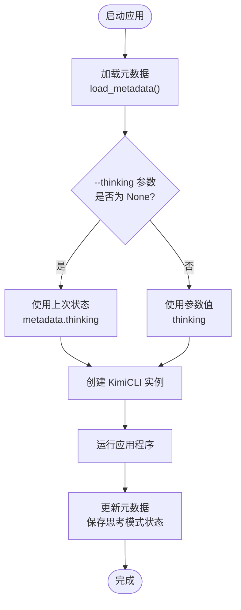
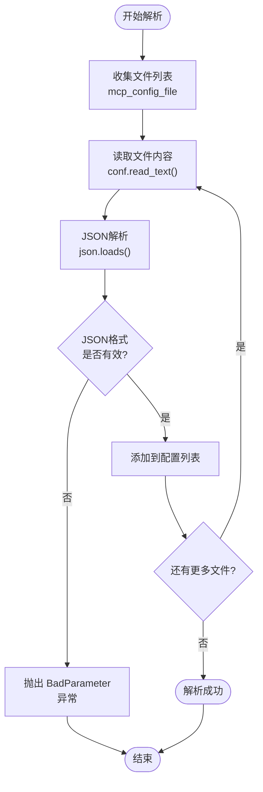

# 选项参考

<cite>
**本文档中引用的文件**
- [cli.py](file://src/kimi_cli/cli.py)
- [config.py](file://src/kimi_cli/config.py)
- [metadata.py](file://src/kimi_cli/metadata.py)
- [app.py](file://src/kimi_cli/app.py)
- [session.py](file://src/kimi_cli/session.py)
- [mcp.py](file://src/kimi_cli/tools/mcp.py)
- [llm.py](file://src/kimi_cli/llm.py)
- [logging.py](file://src/kimi_cli/utils/logging.py)
- [agent.yaml](file://src/kimi_cli/agents/default/agent.yaml)
</cite>

## 目录
1. [简介](#简介)
2. [核心日志控制选项](#核心日志控制选项)
3. [工作目录与会话管理](#工作目录与会话管理)
4. [模型配置选项](#模型配置选项)
5. [代理与工具配置](#代理与工具配置)
6. [用户交互模式](#用户交互模式)
7. [MCP服务器配置](#mcp服务器配置)
8. [高级功能选项](#高级功能选项)
9. [配置示例与最佳实践](#配置示例与最佳实践)
10. [常见问题解决方案](#常见问题解决方案)

## 简介

`kimi`命令行工具提供了丰富的配置选项，支持多种使用场景和高级功能。本文档系统性地记录了所有可用的命令行选项，包括其技术实现原理、配置方法和最佳实践。

## 核心日志控制选项

### `--verbose` 详细输出控制

**技术实现：**
- 使用条件输出函数控制日志级别
- 默认禁用详细输出，通过`typer.echo`启用
- 配合`_noop_echo`函数实现无输出模式

**代码位置：** [`cli.py`](file://src/kimi_cli/cli.py#L228)

**使用示例：**
```bash
# 启用详细输出
kimi --verbose

# 结合其他选项使用
kimi --verbose --work-dir /path/to/project --command "analyze code"
```

**技术细节：**
- `echo`函数根据`verbose`参数动态切换
- 在非verbose模式下使用`_noop_echo`避免输出
- 适用于调试命令执行过程和查看详细信息

**节来源**
- [cli.py](file://src/kimi_cli/cli.py#L228)

### `--debug` 调试模式

**技术实现：**
- 启用`kosong`模块的调试日志
- 配置日志文件轮转和保留策略
- 设置TRACE级别日志输出

**代码位置：** [`cli.py`](file://src/kimi_cli/cli.py#L230-L238)

**使用示例：**
```bash
# 启用调试模式
kimi --debug

# 结合工作目录使用
kimi --debug --work-dir ~/projects/my-app

# 查看日志文件
ls ~/.local/share/kimi/logs/
```

**技术细节：**
- 日志文件位于`~/.local/share/kimi/logs/kimi.log`
- 按时间轮转（每天06:00）
- 保留最近10天的日志文件
- TRACE级别包含最详细的执行信息

**节来源**
- [cli.py](file://src/kimi_cli/cli.py#L230-L238)
- [logging.py](file://src/kimi_cli/utils/logging.py#L1-L21)

## 工作目录与会话管理

### `--work-dir` 工作目录设置

**技术实现：**
- 自动转换为绝对路径
- 支持目录存在性检查
- 与会话历史文件关联

**代码位置：** [`cli.py`](file://src/kimi_cli/cli.py#L240)

**使用示例：**
```bash
# 指定工作目录
kimi --work-dir /home/user/projects/backend

# 当前目录作为工作目录（默认）
kimi

# 绝对路径和相对路径都支持
kimi --work-dir ./my-project
```

**技术细节：**
- 默认使用当前工作目录（`Path.cwd()`）
- 自动创建绝对路径引用
- 与会话历史文件存储路径关联

**节来源**
- [cli.py](file://src/kimi_cli/cli.py#L240)

### `--continue` 会话恢复

**技术实现：**
- 基于元数据查找最后会话
- 支持会话历史文件读取
- 错误处理和用户提示

**代码位置：** [`cli.py`](file://src/kimi_cli/cli.py#L241-L247), [`session.py`](file://src/kimi_cli/session.py#L58-L84)

**使用示例：**
```bash
# 恢复上次会话
kimi --continue

# 指定工作目录恢复会话
kimi --continue --work-dir /path/to/project

# 错误情况处理
kimi --continue  # 如果没有历史会话，会报错
```

**技术细节：**
- 检查元数据中的`last_session_id`
- 自动定位会话历史文件
- 提供清晰的错误消息

**节来源**
- [cli.py](file://src/kimi_cli/cli.py#L241-L247)
- [session.py](file://src/kimi_cli/session.py#L58-L84)

### `--command` 输入处理

**技术实现：**
- 命令字符串预处理和验证
- 空命令检测
- 与不同UI模式的集成

**代码位置：** [`cli.py`](file://src/kimi_cli/cli.py#L254-L257)

**使用示例：**
```bash
# 直接指定命令
kimi --command "fix the bug in main.py"

# 多行命令（注意引号）
kimi --command "analyze this code:\nfunction foo() {\n  return true;\n}"

# 结合打印模式使用
kimi --print --command "generate report"
```

**技术细节：**
- 自动去除首尾空白字符
- 空命令会触发参数错误
- 在交互模式下会被忽略

**节来源**
- [cli.py](file://src/kimi_cli/cli.py#L254-L257)

## 模型配置选项

### `--model` 模型选择

**技术实现：**
- 配置文件优先级处理
- 环境变量覆盖机制
- 模型能力检测

**代码位置：** [`app.py`](file://src/kimi_cli/app.py#L55-L66), [`llm.py`](file://src/kimi_cli/llm.py#L32-L70)

**使用示例：**
```bash
# 指定模型名称
kimi --model "kimi-for-coding"

# 不指定模型（使用配置文件默认值）
kimi

# 环境变量覆盖
export KIMI_MODEL_NAME="gpt-4"
kimi
```

**技术细节：**
1. 优先使用`--model`参数
2. 其次使用配置文件默认模型
3. 最后使用环境变量`KIMI_MODEL_NAME`
4. 支持模型能力自动检测

**节来源**
- [app.py](file://src/kimi_cli/app.py#L55-L66)
- [llm.py](file://src/kimi_cli/llm.py#L32-L70)

### 环境变量配置

**技术实现：**
- `KIMI_API_KEY`: API密钥覆盖
- `KIMI_BASE_URL`: API基础URL覆盖  
- `KIMI_MODEL_NAME`: 模型名称覆盖
- `KIMI_MODEL_MAX_CONTEXT_SIZE`: 上下文大小覆盖
- `KIMI_MODEL_CAPABILITIES`: 模型能力覆盖

**代码位置：** [`llm.py`](file://src/kimi_cli/llm.py#L32-L70)

**使用示例：**
```bash
# 设置API密钥
export KIMI_API_KEY="your-api-key-here"

# 设置自定义API端点
export KIMI_BASE_URL="https://api.example.com/v1"

# 设置模型能力
export KIMI_MODEL_CAPABILITIES="image_in,thinking"

# 完整配置示例
export KIMI_API_KEY="sk-..."
export KIMI_BASE_URL="https://api.kimi.com/v1"
export KIMI_MODEL_NAME="kimi-for-coding"
export KIMI_MODEL_MAX_CONTEXT_SIZE="100000"
```

**技术细节：**
- 密钥值在日志中显示为`******`
- 多个能力用逗号分隔
- 上下文大小为整数值

**节来源**
- [llm.py](file://src/kimi_cli/llm.py#L32-L70)

## 代理与工具配置

### `--agent-file` 自定义代理文件

**技术实现：**
- 文件存在性验证
- YAML格式解析
- 系统提示词路径处理

**代码位置：** [`cli.py`](file://src/kimi_cli/cli.py#L64-L74), [`app.py`](file://src/kimi_cli/app.py#L86-L88)

**使用示例：**
```bash
# 指定自定义代理文件
kimi --agent-file ./my-agent.yaml

# 使用相对路径
kimi --agent-file agents/custom.yaml

# 使用绝对路径
kimi --agent-file /home/user/agents/production.yaml
```

**技术细节：**
- 默认使用内置默认代理
- 支持相对路径和绝对路径
- 文件必须可读且存在

**节来源**
- [cli.py](file://src/kimi_cli/cli.py#L64-L74)
- [app.py](file://src/kimi_cli/app.py#L86-L88)

### `--thinking` 思考模式

**状态持久化机制：**

**技术实现：**
- 元数据保存思考模式状态
- 启动时从元数据加载
- 运行时更新状态

**代码位置：** [`cli.py`](file://src/kimi_cli/cli.py#L286-L291), [`metadata.py`](file://src/kimi_cli/metadata.py#L39-L40), [`cli.py`](file://src/kimi_cli/cli.py#L337-L338)

**使用示例：**
```bash
# 启用思考模式
kimi --thinking

# 禁用思考模式
kimi --no-thinking

# 不指定参数（使用上次状态）
kimi
```

**状态持久化流程：**



**图表来源**
- [cli.py](file://src/kimi_cli/cli.py#L286-L291)
- [metadata.py](file://src/kimi_cli/metadata.py#L39-L40)
- [cli.py](file://src/kimi_cli/cli.py#L337-L338)

**技术细节：**
- 默认值为`None`，表示使用上次状态
- 状态保存在`~/.local/share/kimi/kimi.json`
- 支持`thinking`和`no-thinking`两种形式

**节来源**
- [cli.py](file://src/kimi_cli/cli.py#L286-L291)
- [metadata.py](file://src/kimi_cli/metadata.py#L39-L40)
- [cli.py](file://src/kimi_cli/cli.py#L337-L338)

## 用户交互模式

### `--print` 打印模式

**技术实现：**
- 非交互式运行模式
- 自动启用`--yolo`选项
- 支持流式JSON输入输出

**代码位置：** [`cli.py`](file://src/kimi_cli/cli.py#L114-L121), [`cli.py`](file://src/kimi_cli/cli.py#L221-L222)

**使用示例：**
```bash
# 基本打印模式
kimi --print --command "generate report"

# 流式JSON输入
echo '{"query": "analyze this code"}' | kimi --print --input-format stream-json

# 流式JSON输出
kimi --print --command "process data" --output-format stream-json
```

**技术细节：**
- 自动设置`ui = "print"`
- 隐式启用`--yolo`选项
- 支持stdin/stdout重定向

**节来源**
- [cli.py](file://src/kimi_cli/cli.py#L114-L121)
- [cli.py](file://src/kimi_cli/cli.py#L221-L222)

### `--acp` ACP服务器模式

**技术实现：**
- 启动ACP协议服务器
- 忽略命令参数
- 独立运行模式

**代码位置：** [`cli.py`](file://src/kimi_cli/cli.py#L123-L129), [`cli.py`](file://src/kimi_cli/cli.py#L309-L312)

**使用示例：**
```bash
# 启动ACP服务器
kimi --acp

# 服务器模式下忽略命令参数
kimi --acp --command "should be ignored"
```

**技术细节：**
- 独立的运行模式
- 不支持命令行参数
- 用于与其他工具集成

**节来源**
- [cli.py](file://src/kimi_cli/cli.py#L123-L129)
- [cli.py](file://src/kimi_cli/cli.py#L309-L312)

### `--wire` Wire服务器模式

**技术实现：**
- 实验性Wire协议服务器
- 忽略命令参数
- WebSocket连接支持

**代码位置：** [`cli.py`](file://src/kimi_cli/cli.py#L130-L136), [`cli.py`](file://src/kimi_cli/cli.py#L313-L316)

**使用示例：**
```bash
# 启动Wire服务器（实验性）
kimi --wire

# 服务器模式下忽略命令参数
kimi --wire --command "should be ignored"
```

**技术细节：**
- 实验性功能
- WebSocket协议支持
- 不稳定，谨慎使用

**节来源**
- [cli.py](file://src/kimi_cli/cli.py#L130-L136)
- [cli.py](file://src/kimi_cli/cli.py#L313-L316)

## MCP服务器配置

### `--mcp-config-file` 外部配置文件

**JSON解析流程：**

**技术实现：**
- 多文件支持（可多次指定）
- JSON格式验证
- 错误处理和用户提示

**代码位置：** [`cli.py`](file://src/kimi_cli/cli.py#L155-L167), [`cli.py`](file://src/kimi_cli/cli.py#L273-L276)

**使用示例：**
```bash
# 单个配置文件
kimi --mcp-config-file ./mcp-config.json

# 多个配置文件
kimi --mcp-config-file ./mcp1.json --mcp-config-file ./mcp2.json

# 配置文件内容示例
cat > mcp-config.json << EOF
{
  "transport": {
    "type": "stdio",
    "command": "python",
    "args": ["./mcp-server.py"]
  }
}
EOF
```

**JSON解析流程图：**



**图表来源**
- [cli.py](file://src/kimi_cli/cli.py#L273-L276)

**技术细节：**
- 支持多个配置文件
- 自动JSON格式验证
- 错误时提供详细信息

**节来源**
- [cli.py](file://src/kimi_cli/cli.py#L155-L167)
- [cli.py](file://src/kimi_cli/cli.py#L273-L276)

### `--mcp-config` 内联JSON配置

**JSON解析流程：**

**技术实现：**
- 内联JSON字符串解析
- 多配置支持
- 错误处理机制

**代码位置：** [`cli.py`](file://src/kimi_cli/cli.py#L169-L178), [`cli.py`](file://src/kimi_cli/cli.py#L278-L281)

**使用示例：**
```bash
# 单个内联配置
kimi --mcp-config '{"transport": {"type": "stdio", "command": "python"}}'

# 多个内联配置
kimi \
  --mcp-config '{"transport": {"type": "stdio", "command": "python"}}' \
  --mcp-config '{"transport": {"type": "websocket", "url": "ws://localhost:8080"}}'
```

**技术细节：**
- 直接在命令行中嵌入JSON
- 支持复杂配置结构
- 与文件配置并行处理

**节来源**
- [cli.py](file://src/kimi_cli/cli.py#L169-L178)
- [cli.py](file://src/kimi_cli/cli.py#L278-L281)

### MCP配置合并机制

**技术实现：**
- 文件配置优先于内联配置
- 配置列表合并
- 异常传播机制

**代码位置：** [`cli.py`](file://src/kimi_cli/cli.py#L270-L281)

**使用示例：**
```bash
# 混合配置方式
kimi \
  --mcp-config-file ./mcp-base.json \
  --mcp-config-file ./mcp-custom.json \
  --mcp-config '{"transport": {"type": "stdio", "command": "python"}}'
```

**技术细节：**
- 文件配置先处理
- 内联配置后处理
- 配置按顺序合并

**节来源**
- [cli.py](file://src/kimi_cli/cli.py#L270-L281)

## 高级功能选项

### `--yolo` 自动审批机制

**技术实现：**
- 全局自动批准开关
- 打印模式隐式启用
- 审批请求绕过

**代码位置：** [`cli.py`](file://src/kimi_cli/cli.py#L179-L188), [`cli.py`](file://src/kimi_cli/cli.py#L294)

**使用示例：**
```bash
# 启用自动审批
kimi --yolo

# 缩写形式
kimi -y

# 打印模式自动启用
kimi --print --command "delete files"  # 自动批准删除操作
```

**技术细节：**
- `--yolo`等价于`--yes`和`--auto-approve`
- 打印模式下自动启用
- 绕过所有用户确认步骤

**节来源**
- [cli.py](file://src/kimi_cli/cli.py#L179-L188)
- [cli.py](file://src/kimi_cli/cli.py#L294)

### 输入输出格式控制

**技术实现：**
- 格式验证和约束
- 打印模式专用
- 流式JSON支持

**代码位置：** [`cli.py`](file://src/kimi_cli/cli.py#L137-L154)

**使用示例：**
```bash
# 打印模式下的格式控制
kimi --print --input-format text --output-format text --command "process"

# 流式JSON格式
kimi --print --input-format stream-json --output-format stream-json
```

**技术细节：**
- 仅在打印模式下有效
- 支持`text`和`stream-json`格式
- 输入格式必须配合stdin使用

**节来源**
- [cli.py](file://src/kimi_cli/cli.py#L137-L154)

## 配置示例与最佳实践

### 完整配置示例

**基本开发环境配置：**
```bash
# 设置API密钥（推荐使用环境变量）
export KIMI_API_KEY="sk-your-secret-key-here"

# 创建项目工作目录
mkdir -p ~/projects/my-app
cd ~/projects/my-app

# 使用完整配置运行
kimi \
  --work-dir ~/projects/my-app \
  --model kimi-for-coding \
  --thinking \
  --verbose \
  --command "analyze the codebase structure"
```

**生产环境配置：**
```bash
# 设置生产环境变量
export KIMI_BASE_URL="https://api.production.com/v1"
export KIMI_MODEL_NAME="kimi-for-production"
export KIMI_MODEL_MAX_CONTEXT_SIZE="200000"

# 使用配置运行
kimi \
  --work-dir /var/www/app \
  --continue \
  --yolo \
  --debug
```

**CI/CD环境配置：**
```bash
# CI环境配置
export KIMI_API_KEY="${KIMI_API_KEY}"
export KIMI_MODEL_NAME="kimi-for-ci"

# 自动化脚本
kimi --print --command "generate test coverage report" > coverage.json
```

### 环境变量最佳实践

**安全配置：**
```bash
# 使用环境变量文件
cat > ~/.kimi.env << EOF
export KIMI_API_KEY="sk-..."
export KIMI_BASE_URL="https://api.kimi.com/v1"
export KIMI_MODEL_NAME="kimi-for-coding"
EOF

# 加载配置
source ~/.kimi.env

# 验证配置
kimi --print --command "show model info"
```

**多环境配置：**
```bash
# 开发环境
export KIMI_API_KEY="dev-sk-..."
export KIMI_MODEL_NAME="kimi-for-development"

# 生产环境
export KIMI_API_KEY="prod-sk-..."
export KIMI_MODEL_NAME="kimi-for-production"

# 切换环境
alias kimi-dev='source ~/.kimi.dev && kimi'
alias kimi-prod='source ~/.kimi.prod && kimi'
```

## 常见问题解决方案

### API密钥配置问题

**问题：** API密钥未正确设置
**解决方案：**
```bash
# 检查当前配置
kimi --print --command "show model info"

# 设置环境变量
export KIMI_API_KEY="your-api-key"

# 或者使用配置文件
kimi --setup  # 交互式设置
```

**问题：** 环境变量不生效
**解决方案：**
```bash
# 检查环境变量
echo $KIMI_API_KEY

# 确保变量已导出
export KIMI_API_KEY="your-key"

# 验证变量作用域
kimi --print --command "echo \$KIMI_API_KEY"
```

### 会话恢复问题

**问题：** `--continue`找不到上次会话
**解决方案：**
```bash
# 检查工作目录是否有历史
ls ~/.local/share/kimi/sessions/

# 手动指定会话目录
find ~/.local/share/kimi/sessions/ -name "*.jsonl"

# 或重新创建会话
kimi --work-dir /path/to/project
```

**问题：** 会话历史损坏
**解决方案：**
```bash
# 删除损坏的会话文件
rm ~/.local/share/kimi/sessions/*/*.jsonl

# 重新创建会话
kimi --work-dir /path/to/project
```

### MCP配置问题

**问题：** MCP配置文件格式错误
**解决方案：**
```bash
# 验证JSON格式
python -m json.tool mcp-config.json

# 检查配置内容
cat mcp-config.json

# 使用内联配置测试
kimi --mcp-config '{"transport": {"type": "stdio", "command": "python"}}'
```

**问题：** MCP服务器连接失败
**解决方案：**
```bash
# 检查服务器状态
ps aux | grep mcp-server

# 验证服务器可访问性
curl -f http://localhost:8080/health

# 使用调试模式
kimi --debug --mcp-config-file ./mcp-config.json
```

### 性能优化建议

**内存使用优化：**
```bash
# 限制上下文大小
export KIMI_MODEL_MAX_CONTEXT_SIZE="100000"

# 使用较小的模型
export KIMI_MODEL_NAME="kimi-for-coding-small"
```

**网络优化：**
```bash
# 设置超时时间
export KIMI_BASE_URL="https://api.fast.com/v1"

# 使用本地缓存
kimi --work-dir /tmp/cache --continue
```

**节来源**
- [llm.py](file://src/kimi_cli/llm.py#L32-L70)
- [session.py](file://src/kimi_cli/session.py#L58-L84)
- [cli.py](file://src/kimi_cli/cli.py#L273-L281)