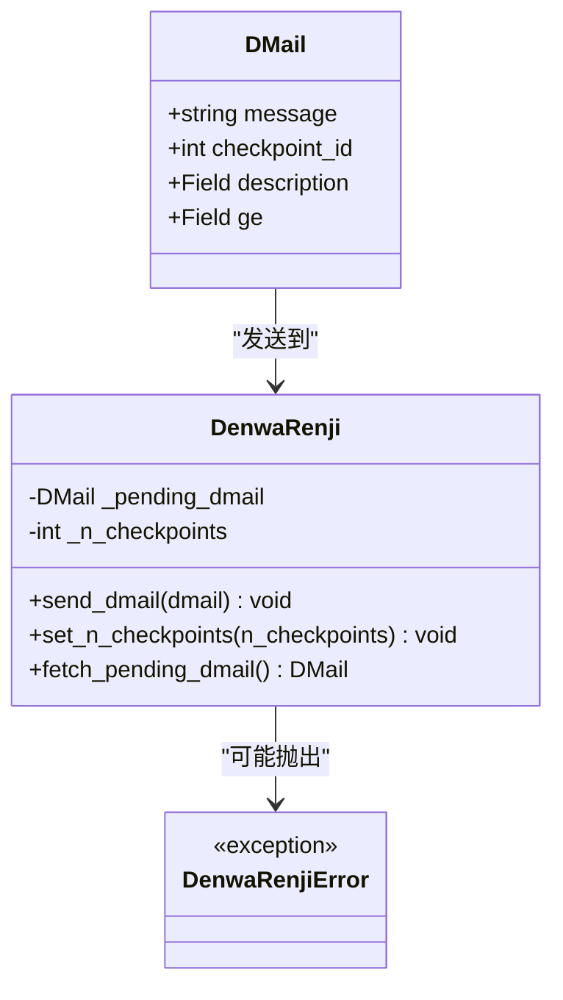
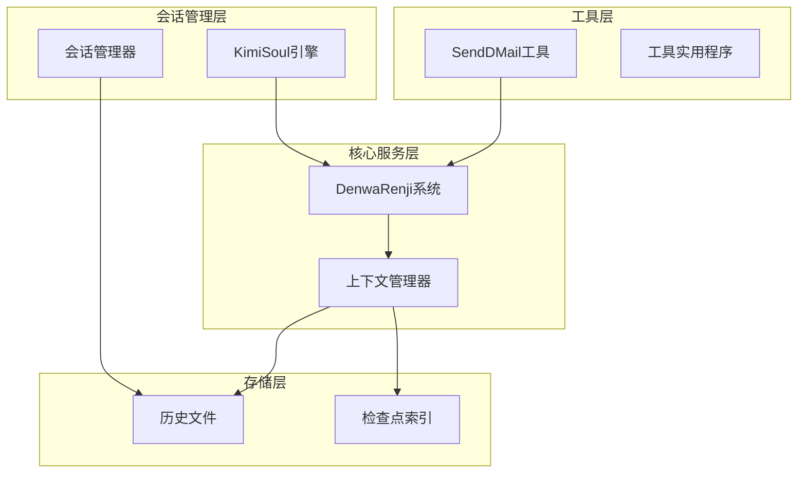
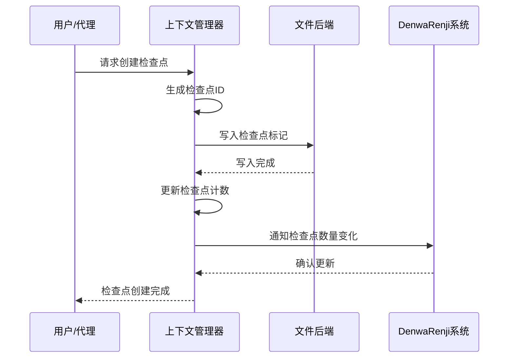
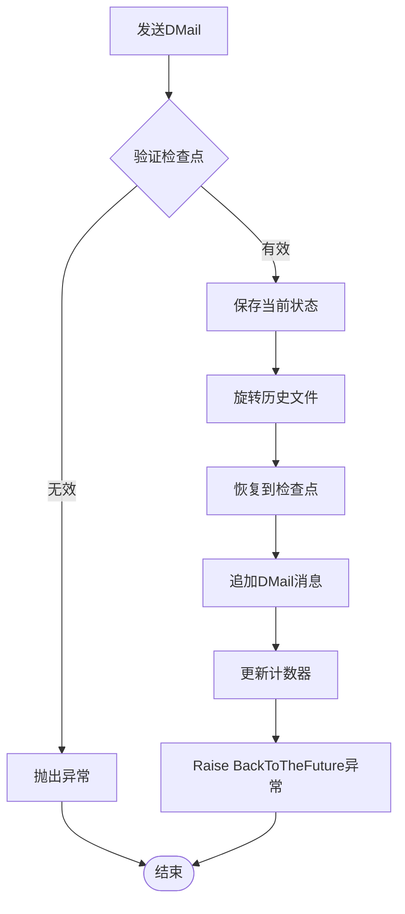
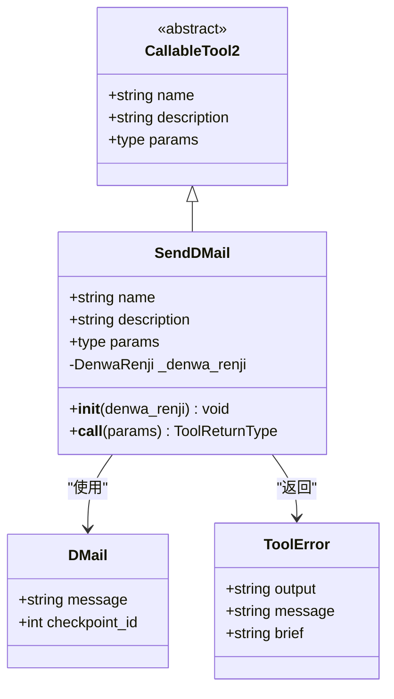
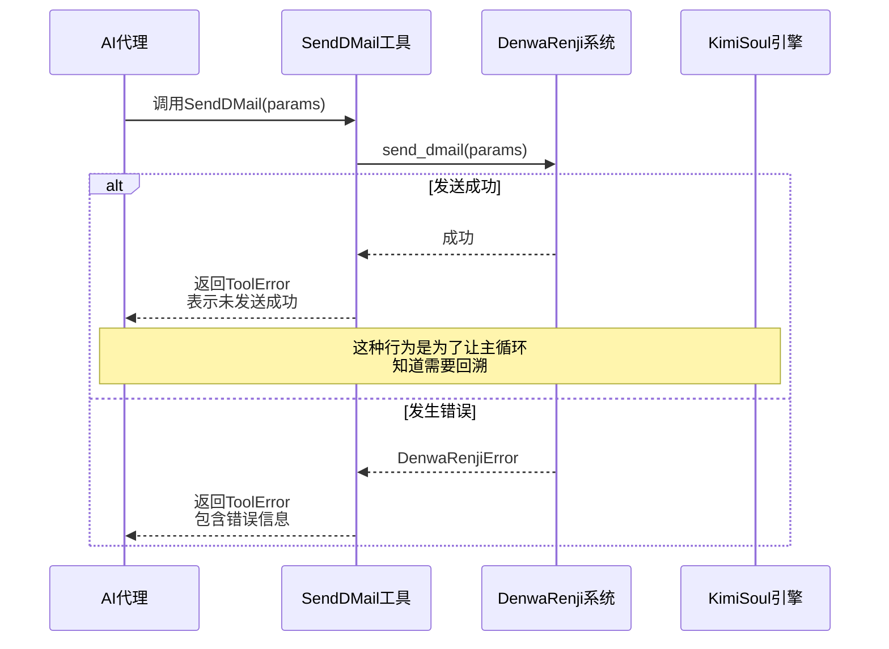
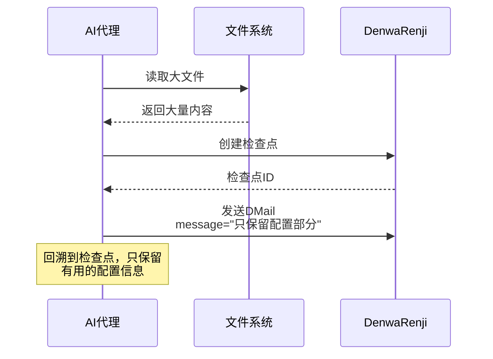
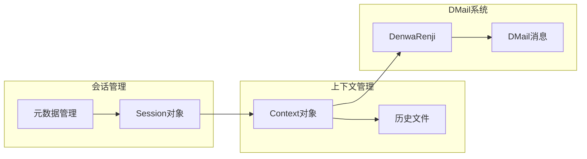
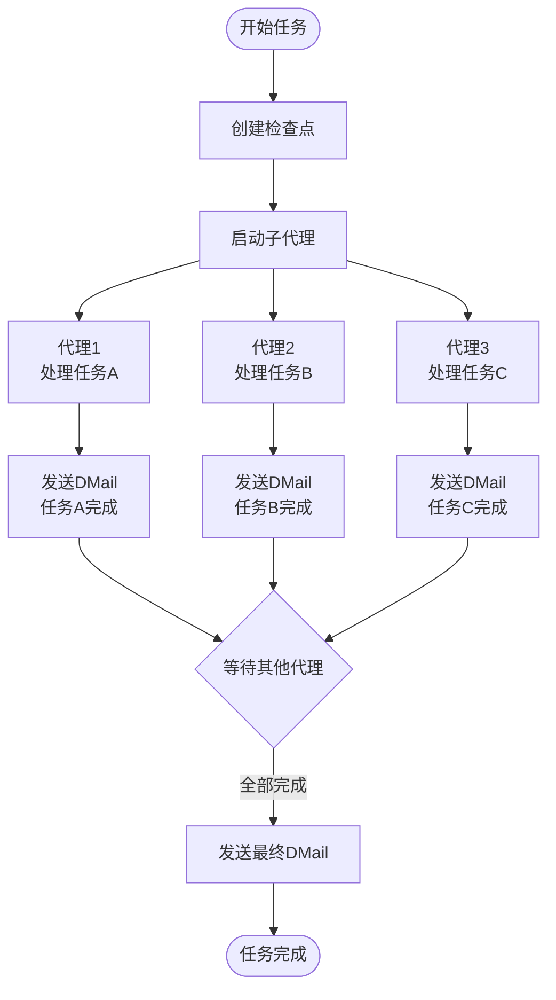

# DMail工具详细文档

<cite>
**本文档引用的文件**
- [src/kimi_cli/tools/dmail/__init__.py](file://src/kimi_cli/tools/dmail/__init__.py)
- [src/kimi_cli/tools/dmail/dmail.md](file://src/kimi_cli/tools/dmail/dmail.md)
- [src/kimi_cli/soul/denwarenji.py](file://src/kimi_cli/soul/denwarenji.py)
- [src/kimi_cli/soul/kimisoul.py](file://src/kimi_cli/soul/kimisoul.py)
- [src/kimi_cli/soul/context.py](file://src/kimi_cli/soul/context.py)
- [src/kimi_cli/soul/toolset.py](file://src/kimi_cli/soul/toolset.py)
- [src/kimi_cli/session.py](file://src/kimi_cli/session.py)
- [src/kimi_cli/soul/CLAUDE.md](file://src/kimi_cli/soul/CLAUDE.md)
- [tests/test_tool_descriptions.py](file://tests/test_tool_descriptions.py)
- [tests/test_tool_schemas.py](file://tests/test_tool_schemas.py)
</cite>

## 目录
1. [简介](#简介)
2. [核心概念](#核心概念)
3. [系统架构](#系统架构)
4. [DMail消息结构](#dmail消息结构)
5. [检查点管理系统](#检查点管理系统)
6. [工具实现详解](#工具实现详解)
7. [应用场景示例](#应用场景示例)
8. [与会话管理系统的集成](#与会话管理系统的集成)
9. [高级Agent工作流编排](#高级agent工作流编排)
10. [当前实现的局限性](#当前实现的局限性)
11. [最佳实践建议](#最佳实践建议)
12. [总结](#总结)

## 简介

DMail工具是Kimi CLI中一个独特而强大的功能，它实现了"来自未来的消息"通信机制，灵感来源于科幻作品《命运石之门》中的D-Mail系统。该工具允许AI代理向过去的自己发送消息，实现跨时间点的上下文回溯和信息传递，为复杂的AI工作流提供了前所未有的灵活性和效率。

DMail系统的核心价值在于：
- **时间旅行式的消息传递**：能够将信息从当前上下文发送到过去的特定检查点
- **智能上下文管理**：通过检查点机制实现精确的历史状态回溯
- **异步协作模式**：支持复杂的多步骤任务分解和协作
- **错误恢复能力**：能够在发现问题时快速回退到已知的良好状态

## 核心概念

### D-Mail消息模型

DMail系统基于两个核心概念构建：

1. **DMail对象**：包含消息内容和目标检查点ID的数据结构
2. **检查点系统**：标记时间点的状态快照机制



**图表来源**
- [src/kimi_cli/soul/denwarenji.py](file://src/kimi_cli/soul/denwarenji.py#L6-L39)

### 检查点机制

检查点系统是DMail功能的基础，它提供了：

- **时间点标记**：在对话历史中创建可回溯的断点
- **状态快照**：保存特定时刻的完整上下文状态
- **精确回溯**：能够准确回到指定的历史状态

## 系统架构

DMail系统采用分层架构设计，确保了功能的模块化和可扩展性：



**图表来源**
- [src/kimi_cli/tools/dmail/__init__.py](file://src/kimi_cli/tools/dmail/__init__.py#L12-L39)
- [src/kimi_cli/soul/denwarenji.py](file://src/kimi_cli/soul/denwarenji.py#L16-L39)
- [src/kimi_cli/soul/kimisoul.py](file://src/kimi_cli/soul/kimisoul.py#L57-L96)

**章节来源**
- [src/kimi_cli/tools/dmail/__init__.py](file://src/kimi_cli/tools/dmail/__init__.py#L1-L40)
- [src/kimi_cli/soul/denwarenji.py](file://src/kimi_cli/soul/denwarenji.py#L1-L40)

## DMail消息结构

### 数据模型定义

DMail消息结构简洁而强大，包含两个关键字段：

| 字段名 | 类型 | 描述 | 约束条件 |
|--------|------|------|----------|
| message | string | 要发送的消息内容 | 必需，不能为空 |
| checkpoint_id | integer | 目标检查点的ID | 必需，≥ 0 |

### 消息验证机制

系统实现了严格的验证机制确保消息的有效性：

```mermaid
flowchart TD
Start([开始发送DMail]) --> CheckPending{是否有待处理邮件?}
CheckPending --> |是| ThrowError1[抛出DenwaRenjiError<br/>"只能发送一封邮件"]
CheckPending --> |否| CheckNegative{检查点ID是否为负?}
CheckNegative --> |是| ThrowError2[抛出DenwaRenjiError<br/>"检查点ID不能为负"]
CheckNegative --> |否| CheckValid{检查点ID是否存在?}
CheckValid --> |否| ThrowError3[抛出DenwaRenjiError<br/>"不存在该检查点"]
CheckValid --> |是| SetPending[设置待处理邮件]
SetPending --> Success([发送成功])
ThrowError1 --> End([结束])
ThrowError2 --> End
ThrowError3 --> End
Success --> End
```

**图表来源**
- [src/kimi_cli/soul/denwarenji.py](file://src/kimi_cli/soul/denwarenji.py#L21-L29)

**章节来源**
- [src/kimi_cli/soul/denwarenji.py](file://src/kimi_cli/soul/denwarenji.py#L6-L10)

## 检查点管理系统

### 检查点创建流程

检查点系统提供了完整的生命周期管理：



**图表来源**
- [src/kimi_cli/soul/context.py](file://src/kimi_cli/soul/context.py#L64-L74)
- [src/kimi_cli/soul/denwarenji.py](file://src/kimi_cli/soul/denwarenji.py#L31-L33)

### 上下文回溯机制

当DMail被发送时，系统执行以下操作序列：

1. **状态保存**：当前上下文状态被保存到临时文件
2. **历史旋转**：现有历史文件被重命名备份
3. **状态恢复**：回溯到指定检查点，删除后续所有消息
4. **消息注入**：将DMail消息追加到上下文末尾



**图表来源**
- [src/kimi_cli/soul/kimisoul.py](file://src/kimi_cli/soul/kimisoul.py#L251-L275)

**章节来源**
- [src/kimi_cli/soul/context.py](file://src/kimi_cli/soul/context.py#L60-L145)
- [src/kimi_cli/soul/denwarenji.py](file://src/kimi_cli/soul/denwarenji.py#L16-L39)

## 工具实现详解

### SendDMail工具类

SendDMail工具是DMail功能的直接入口，继承自CallableTool2基类：



**图表来源**
- [src/kimi_cli/tools/dmail/__init__.py](file://src/kimi_cli/tools/dmail/__init__.py#L12-L39)

### 工具调用流程

工具的实际执行遵循严格的错误处理和状态管理流程：



**图表来源**
- [src/kimi_cli/tools/dmail/__init__.py](file://src/kimi_cli/tools/dmail/__init__.py#L21-L39)

### 错误处理策略

工具实现了多层次的错误处理：

1. **参数验证**：确保输入符合DMail模型要求
2. **状态检查**：验证检查点的有效性和唯一性
3. **异常转换**：将内部异常转换为标准的ToolError格式
4. **用户友好**：提供清晰的错误信息和解决建议

**章节来源**
- [src/kimi_cli/tools/dmail/__init__.py](file://src/kimi_cli/tools/dmail/__init__.py#L1-L40)

## 应用场景示例

### 场景一：文件内容过滤

当读取大型文件时，可以发送DMail只保留有用信息：

**典型场景**：
- 读取配置文件，发现大部分内容不相关
- 搜索网络结果，找到的信息过于庞大
- 编写代码遇到困难，但过程不重要

**解决方案**：


### 场景二：搜索优化

网络搜索结果过大时的智能处理：

**决策流程**：
1. **信息提取**：从搜索结果中提取关键信息
2. **检查点创建**：在搜索前创建检查点
3. **结果过滤**：发送DMail只保留有用的部分
4. **查询优化**：如果未找到所需信息，发送建议重新查询

### 场景三：代码调试优化

编写代码时的智能回溯：

**应用场景**：
- 编写复杂算法，调试过程冗长
- 修改现有代码，但最终版本已知
- 尝试多种解决方案，但只有最优方案有价值

**优势**：
- 避免重复劳动，直接获得正确结果
- 保持上下文连贯性
- 减少不必要的计算开销

**章节来源**
- [src/kimi_cli/tools/dmail/dmail.md](file://src/kimi_cli/tools/dmail/dmail.md#L9-L16)

## 与会话管理系统的集成

### 会话生命周期管理

DMail系统与Kimi CLI的会话管理系统深度集成：



**图表来源**
- [src/kimi_cli/session.py](file://src/kimi_cli/session.py#L11-L84)
- [src/kimi_cli/soul/context.py](file://src/kimi_cli/soul/context.py#L1-L145)

### 状态同步机制

系统确保DMail状态与会话状态的一致性：

1. **检查点计数同步**：DenwaRenji跟踪的检查点数量与上下文同步
2. **历史文件管理**：每个会话维护独立的历史文件
3. **状态快照**：定期保存会话状态以支持恢复

**章节来源**
- [src/kimi_cli/session.py](file://src/kimi_cli/session.py#L1-L84)
- [src/kimi_cli/soul/context.py](file://src/kimi_cli/soul/context.py#L60-L145)

## 高级Agent工作流编排

### 并行任务分解

DMail系统支持复杂的并行工作流：



### 异步协作模式

系统支持多种异步协作模式：

1. **流水线模式**：任务按顺序分解，每个阶段发送DMail
2. **并行模式**：多个任务同时进行，最后汇总结果
3. **混合模式**：结合流水线和并行的优势

### 错误恢复机制

DMail系统提供了强大的错误恢复能力：

- **优雅降级**：单个任务失败不影响整体流程
- **状态回滚**：可以回溯到稳定的中间状态
- **结果合并**：不同阶段的结果可以智能合并

**章节来源**
- [src/kimi_cli/soul/kimisoul.py](file://src/kimi_cli/soul/kimisoul.py#L200-L360)

## 当前实现的局限性

### 技术限制

1. **单一封邮件限制**：系统在同一时间只能处理一封DMail
2. **文件系统状态**：目前不支持文件系统状态的回滚（TODO）
3. **检查点数量**：受内存和性能限制，检查点数量有限

### 功能扩展需求

1. **附件支持**：目前只支持纯文本消息，需要支持文件附件
2. **多收件人**：支持同时发送给多个检查点
3. **邮件历史**：需要记录和查询已发送的邮件
4. **权限控制**：添加邮件发送权限验证

### 性能考虑

1. **历史文件大小**：长期运行可能导致历史文件过大
2. **内存使用**：大量检查点可能增加内存消耗
3. **I/O性能**：频繁的状态保存和恢复影响性能

**章节来源**
- [src/kimi_cli/soul/denwarenji.py](file://src/kimi_cli/soul/denwarenji.py#L9-L10)
- [src/kimi_cli/soul/CLAUDE.md](file://src/kimi_cli/soul/CLAUDE.md#L417-L428)

## 最佳实践建议

### 使用策略

1. **时机选择**：在关键决策点创建检查点
2. **信息精炼**：DMail消息应该简洁明了，重点突出
3. **避免过度使用**：不要在每个步骤都创建检查点
4. **语义明确**：DMail消息应该清楚地说明为什么发送

### 开发建议

1. **错误处理**：始终处理DMail发送可能的失败情况
2. **状态管理**：合理管理检查点的创建和清理
3. **性能监控**：监控DMail系统的性能影响
4. **测试覆盖**：充分测试DMail相关的边界情况

### 安全考虑

1. **敏感信息**：避免在DMail中发送敏感或机密信息
2. **访问控制**：考虑添加DMail发送的权限控制
3. **审计日志**：记录DMail发送的审计信息

## 总结

DMail工具代表了Kimi CLI在AI工作流编排方面的重要创新。它不仅实现了时间旅行式的消息传递机制，更重要的是为复杂的AI任务提供了前所未有的灵活性和效率。

### 核心价值

1. **智能回溯能力**：能够精确回溯到历史状态，避免重复劳动
2. **异步协作支持**：支持复杂的并行和流水线工作流
3. **错误恢复机制**：提供强大的容错和恢复能力
4. **上下文管理**：实现了精确的上下文状态管理

### 应用前景

DMail系统为AI代理的高级工作流编排奠定了基础，特别是在需要复杂决策和长时间推理的任务中具有巨大潜力。随着功能的不断完善和扩展，它将在以下领域发挥重要作用：

- **复杂软件开发**：支持大型项目的模块化开发和重构
- **数据分析**：优化数据探索和分析流程
- **研究辅助**：支持学术研究和实验的迭代优化
- **创意工作**：为写作、设计等创造性任务提供支持

### 发展方向

未来的发展重点包括：
- 增强文件系统状态回滚能力
- 支持更复杂的多收件人邮件系统
- 实现智能的检查点自动管理
- 提供更好的性能优化和资源管理

DMail工具的成功实现证明了Kimi CLI在AI系统设计方面的先进性和创新性，为构建更加智能和高效的AI工作流平台奠定了坚实基础。