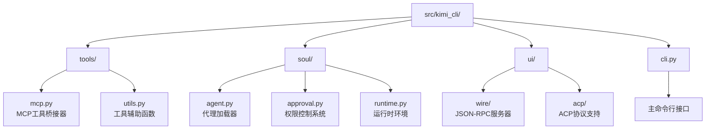
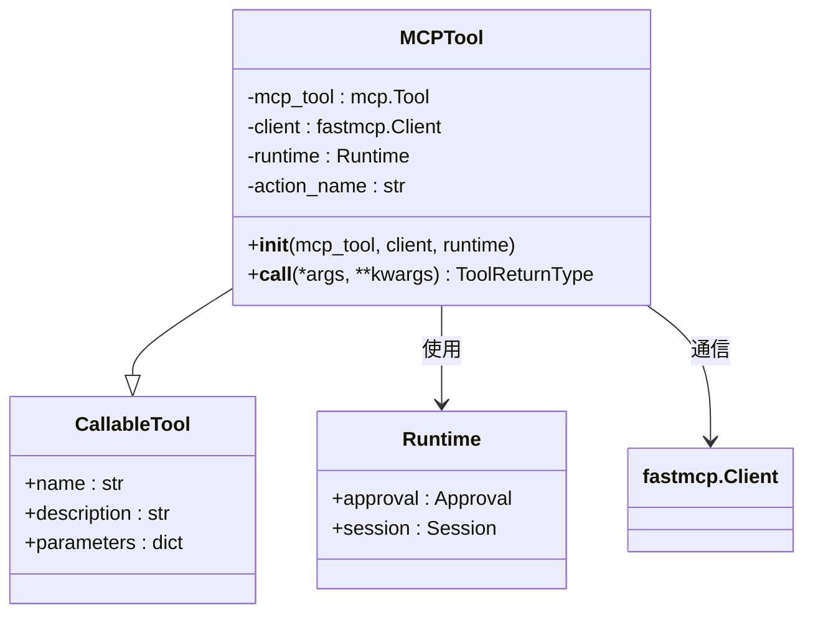
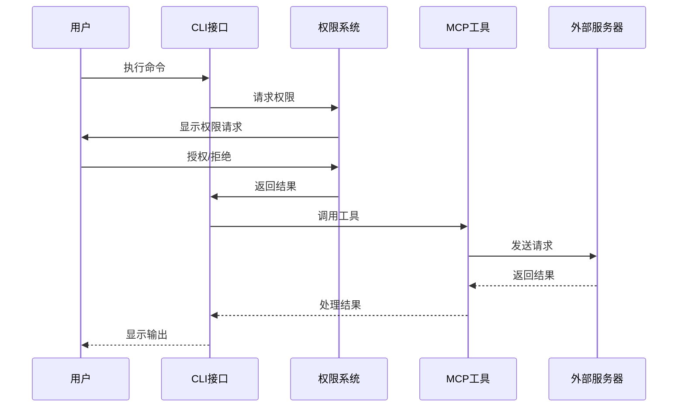
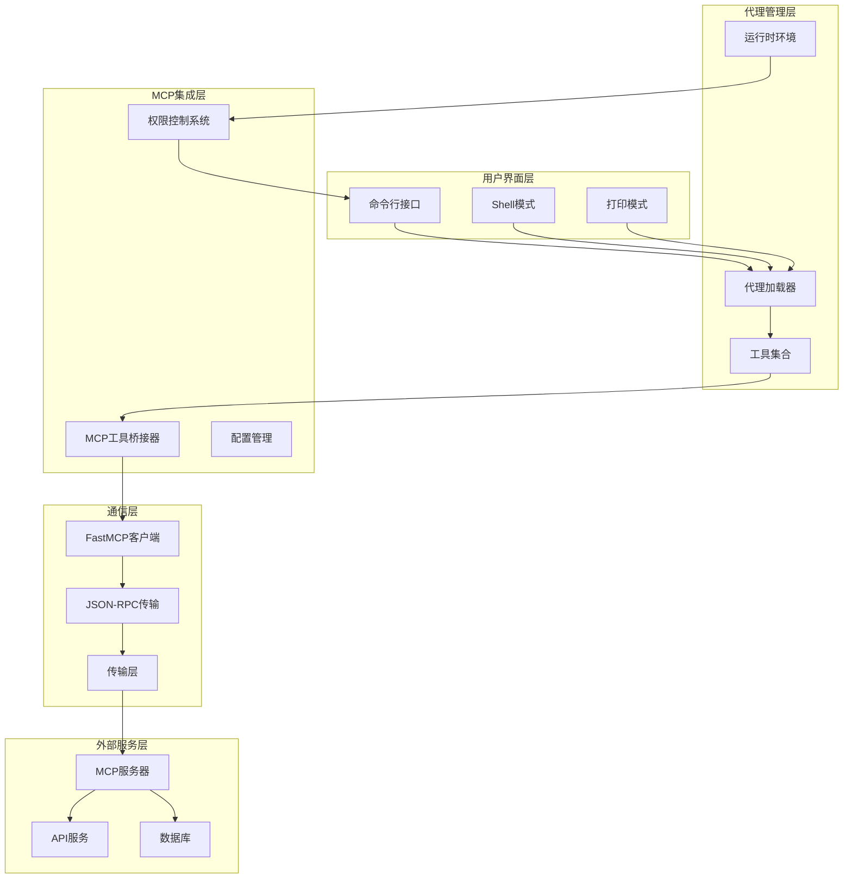
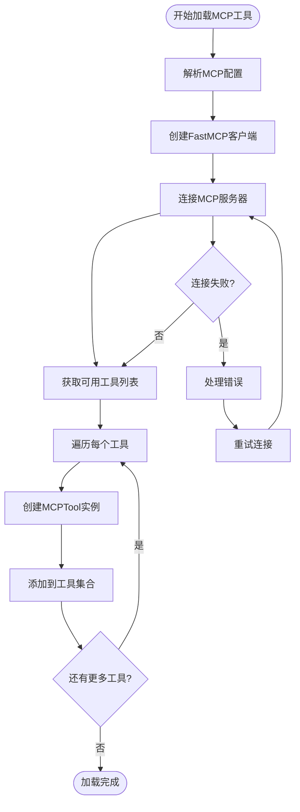
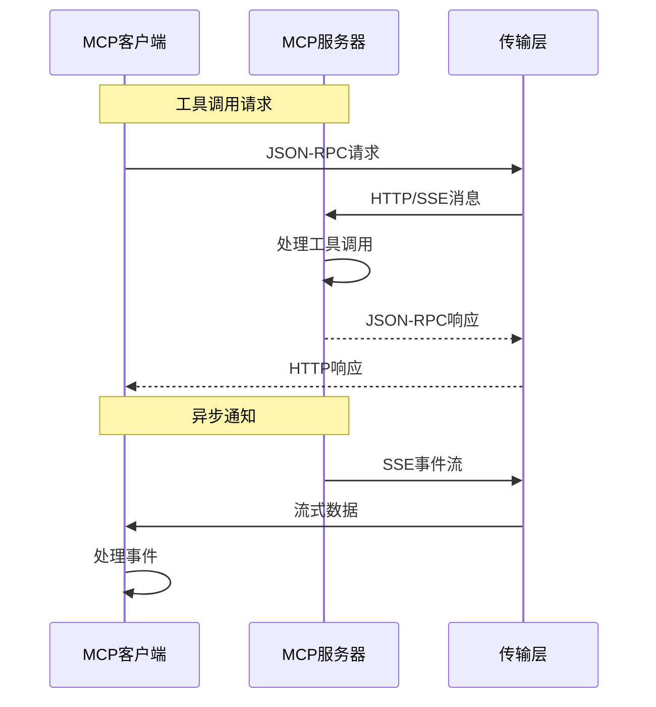
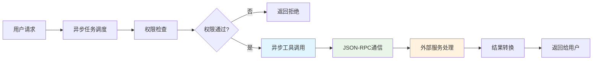
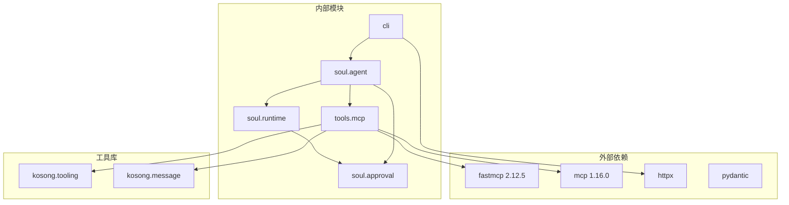

# MCP集成

<cite>
**本文档中引用的文件**
- [mcp.py](file://src/kimi_cli/tools/mcp.py)
- [cli.py](file://src/kimi_cli/cli.py)
- [agent.py](file://src/kimi_cli/soul/agent.py)
- [app.py](file://src/kimi_cli/app.py)
- [approval.py](file://src/kimi_cli/soul/approval.py)
- [runtime.py](file://src/kimi_cli/soul/runtime.py)
- [jsonrpc.py](file://src/kimi_cli/ui/wire/jsonrpc.py)
- [agent.yaml](file://src/kimi_cli/agents/default/agent.yaml)
- [test_tool_schemas.py](file://tests/test_tool_schemas.py)
</cite>

## 目录
1. [简介](#简介)
2. [项目结构](#项目结构)
3. [核心组件](#核心组件)
4. [架构概览](#架构概览)
5. [详细组件分析](#详细组件分析)
6. [依赖关系分析](#依赖关系分析)
7. [性能考虑](#性能考虑)
8. [故障排除指南](#故障排除指南)
9. [结论](#结论)

## 简介

MCP（Model Context Protocol）集成是kimi-cli项目中的一个关键功能模块，它作为外部工具集成的桥梁，实现了与外部MCP服务器的无缝连接。该系统通过fastmcp库提供了对MCP标准的完整支持，允许LLM通过标准化的接口调用外部服务，如数据库查询、API调用、文件操作等。

MCP集成的核心价值在于扩展了Kimi CLI的能力边界，使其能够访问传统工具无法触及的功能领域。通过JSON-RPC通信协议和异步调用模式，系统确保了高性能和响应性，同时通过严格的安全控制机制保障了系统的安全性。

## 项目结构

kimi-cli项目采用模块化架构设计，MCP集成相关文件分布在以下关键目录中：

**图表来源**
- [mcp.py](file://src/kimi_cli/tools/mcp.py#L1-L114)
- [agent.py](file://src/kimi_cli/soul/agent.py#L1-L165)
- [cli.py](file://src/kimi_cli/cli.py#L1-L358)

**章节来源**
- [mcp.py](file://src/kimi_cli/tools/mcp.py#L1-L114)
- [agent.py](file://src/kimi_cli/soul/agent.py#L1-L165)
- [cli.py](file://src/kimi_cli/cli.py#L1-L358)

## 核心组件

### MCPTool类：工具桥接器

MCPTool是MCP集成的核心类，继承自CallableTool，负责将MCP工具转换为Kimi CLI可识别的工具格式。

**图表来源**
- [mcp.py](file://src/kimi_cli/tools/mcp.py#L14-L43)
- [approval.py](file://src/kimi_cli/soul/approval.py#L10-L76)

### 命令行接口：MCP配置参数

CLI模块提供了丰富的MCP配置选项，支持从文件或直接JSON配置加载MCP服务器信息。

| 参数名称 | 类型 | 描述 | 默认值 |
|---------|------|------|--------|
| `--mcp-config-file` | Path[] | MCP配置文件路径列表 | [] |
| `--mcp-config` | str[] | 直接提供的MCP JSON配置 | [] |

### 权限控制系统

MCP集成包含完善的权限控制机制，确保只有经过授权的操作才能执行外部工具调用。

**图表来源**
- [approval.py](file://src/kimi_cli/soul/approval.py#L20-L76)
- [mcp.py](file://src/kimi_cli/tools/mcp.py#L34-L43)

**章节来源**
- [mcp.py](file://src/kimi_cli/tools/mcp.py#L14-L43)
- [cli.py](file://src/kimi_cli/cli.py#L155-L178)
- [approval.py](file://src/kimi_cli/soul/approval.py#L10-L76)

## 架构概览

MCP集成采用分层架构设计，从底层的JSON-RPC通信到顶层的用户交互，形成了完整的工具链。

**图表来源**
- [app.py](file://src/kimi_cli/app.py#L25-L217)
- [agent.py](file://src/kimi_cli/soul/agent.py#L32-L80)
- [mcp.py](file://src/kimi_cli/tools/mcp.py#L14-L43)

## 详细组件分析

### MCP工具加载机制

MCP工具的加载过程涉及多个步骤，从配置解析到工具实例化：

**图表来源**
- [agent.py](file://src/kimi_cli/soul/agent.py#L144-L164)

### JSON-RPC通信协议

系统使用标准的JSON-RPC 2.0协议进行通信，支持请求-响应模式和通知模式：

**图表来源**
- [jsonrpc.py](file://src/kimi_cli/ui/wire/jsonrpc.py#L16-L37)

### 安全控制机制

MCP集成实现了多层次的安全控制：

| 安全层级 | 控制机制 | 实现方式 |
|---------|----------|----------|
| 认证 | API密钥验证 | 配置文件中的认证信息 |
| 授权 | 权限审批系统 | Approval类的请求-响应机制 |
| 输入验证 | 参数类型检查 | Pydantic模型验证 |
| 网络隔离 | 连接超时控制 | 20秒超时限制 |
| 操作审计 | 日志记录 | 详细的调试日志 |

**章节来源**
- [mcp.py](file://src/kimi_cli/tools/mcp.py#L34-L43)
- [approval.py](file://src/kimi_cli/soul/approval.py#L20-L76)
- [jsonrpc.py](file://src/kimi_cli/ui/wire/jsonrpc.py#L1-L51)

### 异步调用模式

系统采用异步编程模型，确保高并发场景下的性能表现：

**图表来源**
- [mcp.py](file://src/kimi_cli/tools/mcp.py#L34-L43)

**章节来源**
- [mcp.py](file://src/kimi_cli/tools/mcp.py#L1-L114)
- [agent.py](file://src/kimi_cli/soul/agent.py#L144-L164)

## 依赖关系分析

MCP集成依赖于多个外部库和内部模块，形成了复杂的依赖网络：

**图表来源**
- [mcp.py](file://src/kimi_cli/tools/mcp.py#L1-L9)
- [agent.py](file://src/kimi_cli/soul/agent.py#L154-L155)

**章节来源**
- [mcp.py](file://src/kimi_cli/tools/mcp.py#L1-L9)
- [agent.py](file://src/kimi_cli/soul/agent.py#L154-L155)

## 性能考虑

MCP集成在设计时充分考虑了性能优化：

### 连接池管理
- 使用异步上下文管理器确保连接正确释放
- 支持连接复用减少建立连接的开销
- 实现自动重连机制提高系统稳定性

### 超时控制
- 工具调用设置20秒超时限制
- 支持raise_on_error=False避免异常中断
- 实现优雅的错误处理机制

### 内存管理
- 使用生成器模式处理大量数据
- 及时清理临时对象和缓存
- 避免内存泄漏的资源管理策略

## 故障排除指南

### 常见问题及解决方案

| 问题类型 | 症状 | 解决方案 |
|---------|------|----------|
| 连接超时 | 工具调用无响应 | 检查网络连接，调整超时设置 |
| 权限拒绝 | 工具调用被拒绝 | 检查权限配置，确认用户授权 |
| 配置错误 | MCP服务器未找到 | 验证配置文件格式和内容 |
| 类型错误 | 参数验证失败 | 检查参数类型和格式 |

### 调试技巧
- 启用详细日志记录
- 使用--debug参数获取更多信息
- 检查网络连接状态
- 验证MCP服务器可用性

**章节来源**
- [mcp.py](file://src/kimi_cli/tools/mcp.py#L40-L42)
- [cli.py](file://src/kimi_cli/cli.py#L230-L238)

## 结论

MCP集成是kimi-cli项目中的一个精心设计的功能模块，它成功地将外部工具的能力整合到了CLI环境中。通过fastmcp库的使用，系统实现了对MCP标准的完整支持，包括JSON-RPC通信协议、异步调用模式和严格的权限控制机制。

该集成的主要优势包括：
- **扩展性**：能够轻松集成各种外部MCP服务器
- **安全性**：完善的权限控制和输入验证机制
- **性能**：异步处理和连接池优化
- **易用性**：简洁的配置接口和错误处理

未来的发展方向可能包括：
- 更多的MCP服务器适配器
- 增强的安全特性
- 更好的监控和诊断工具
- 更灵活的配置选项

MCP集成不仅扩展了Kimi CLI的功能边界，也为构建更强大的AI驱动工具生态系统奠定了基础。