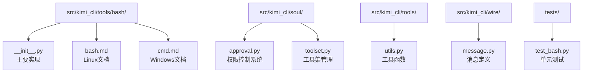
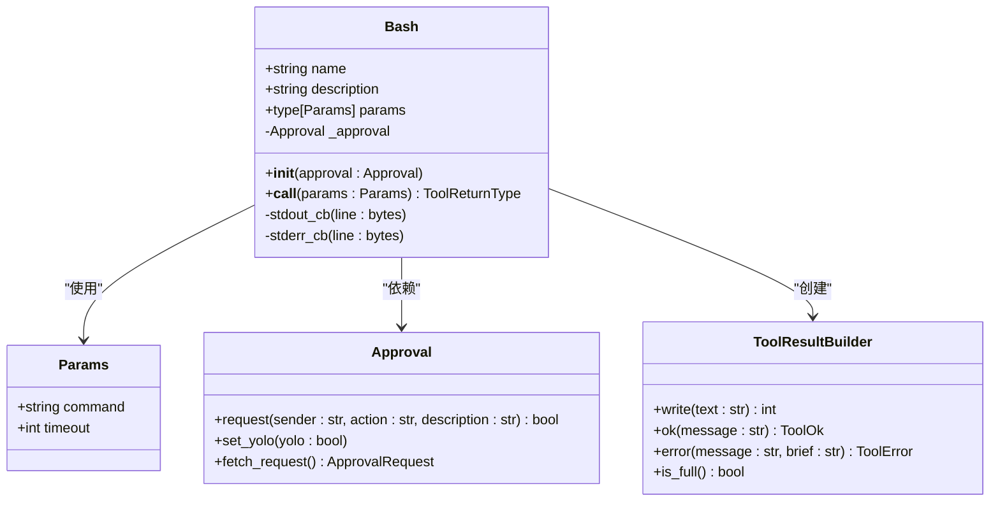
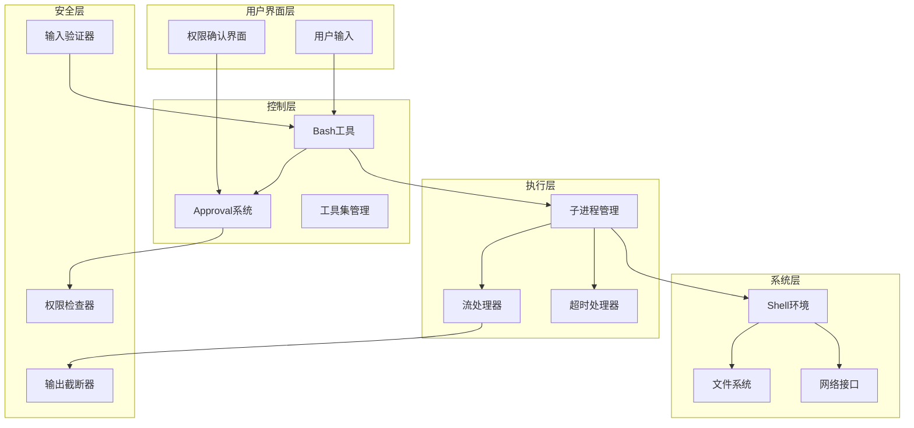
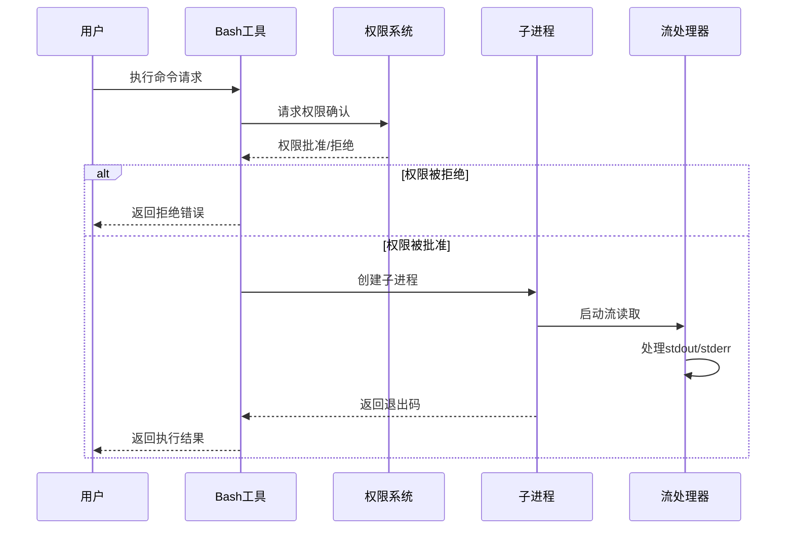
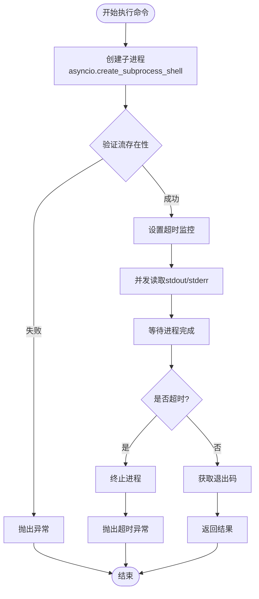
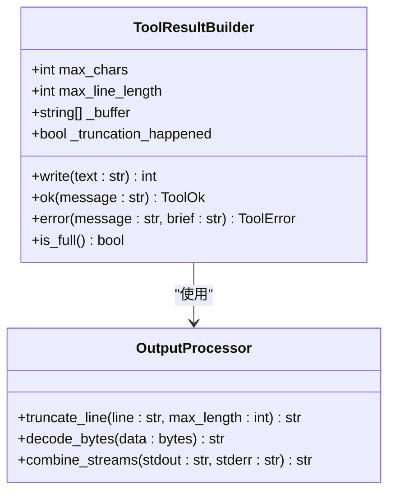
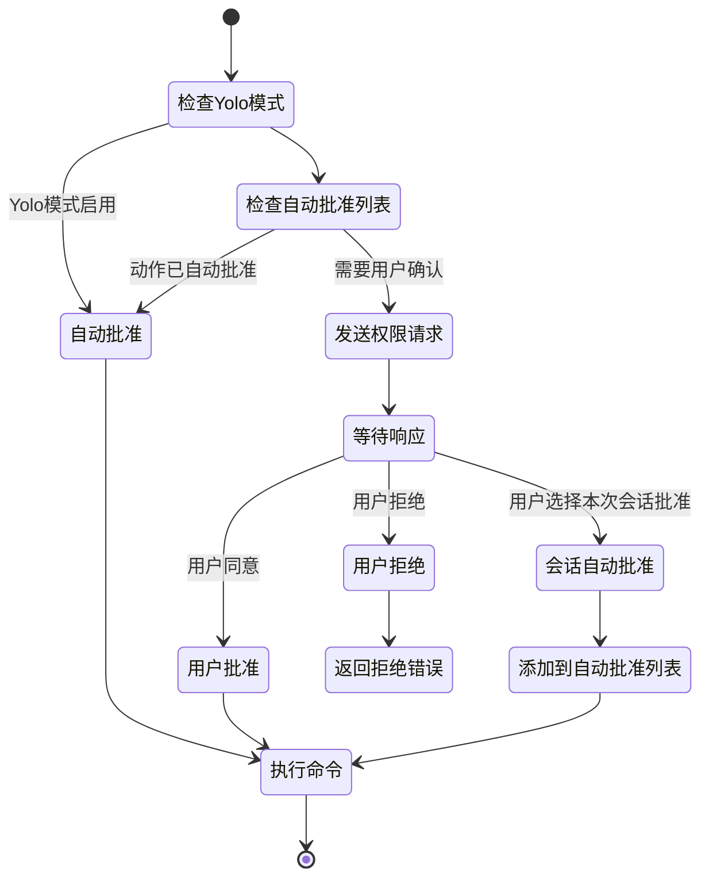
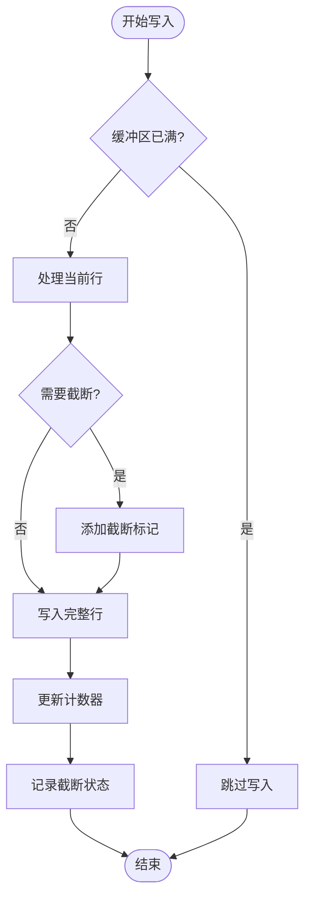

# Shell执行工具

<cite>
**本文档中引用的文件**
- [src/kimi_cli/tools/bash/__init__.py](file://src/kimi_cli/tools/bash/__init__.py)
- [src/kimi_cli/tools/bash/bash.md](file://src/kimi_cli/tools/bash/bash.md)
- [src/kimi_cli/tools/bash/cmd.md](file://src/kimi_cli/tools/bash/cmd.md)
- [src/kimi_cli/soul/approval.py](file://src/kimi_cli/soul/approval.py)
- [src/kimi_cli/soul/toolset.py](file://src/kimi_cli/soul/toolset.py)
- [src/kimi_cli/tools/utils.py](file://src/kimi_cli/tools/utils.py)
- [src/kimi_cli/wire/message.py](file://src/kimi_cli/wire/message.py)
- [tests/test_bash.py](file://tests/test_bash.py)
</cite>

## 目录
1. [简介](#简介)
2. [项目结构](#项目结构)
3. [核心组件](#核心组件)
4. [架构概览](#架构概览)
5. [详细组件分析](#详细组件分析)
6. [安全机制](#安全机制)
7. [使用场景](#使用场景)
8. [性能考虑](#性能考虑)
9. [故障排除指南](#故障排除指南)
10. [结论](#结论)

## 简介

Shell执行工具（Bash）是kimi-cli项目中的一个核心组件，负责在受控环境中执行Shell命令。该工具提供了安全、可控的命令执行能力，同时具备严格的权限控制和输入验证机制。它能够执行任意Shell命令，收集标准输出、标准错误输出和退出码，并通过Approval系统确保所有命令执行都经过用户显式确认。

该工具设计用于与操作系统进行深度交互，支持文件系统操作、系统信息查询、脚本执行等多种功能。通过异步执行和超时处理机制，确保命令执行的安全性和可靠性。

## 项目结构

Shell执行工具位于项目的工具模块中，具有清晰的组织结构：



**图表来源**
- [src/kimi_cli/tools/bash/__init__.py](file://src/kimi_cli/tools/bash/__init__.py#L1-L114)
- [src/kimi_cli/soul/approval.py](file://src/kimi_cli/soul/approval.py#L1-L76)

**章节来源**
- [src/kimi_cli/tools/bash/__init__.py](file://src/kimi_cli/tools/bash/__init__.py#L1-L114)
- [src/kimi_cli/tools/bash/bash.md](file://src/kimi_cli/tools/bash/bash.md#L1-L32)

## 核心组件

### Bash类

Bash类是Shell执行工具的主要实现，继承自CallableTool2基类，提供了完整的命令执行功能：



**图表来源**
- [src/kimi_cli/tools/bash/__init__.py](file://src/kimi_cli/tools/bash/__init__.py#L33-L114)
- [src/kimi_cli/soul/approval.py](file://src/kimi_cli/soul/approval.py#L10-L76)

### 参数模型

Params类定义了命令执行所需的参数结构：

| 参数名 | 类型 | 描述 | 默认值 | 验证规则 |
|--------|------|------|--------|----------|
| command | string | 要执行的Shell命令 | 必需 | 无限制 |
| timeout | integer | 命令执行超时时间（秒） | 60 | 1 ≤ timeout ≤ 300 |

**章节来源**
- [src/kimi_cli/tools/bash/__init__.py](file://src/kimi_cli/tools/bash/__init__.py#L16-L26)

## 架构概览

Shell执行工具采用分层架构设计，确保安全性和可维护性：



**图表来源**
- [src/kimi_cli/tools/bash/__init__.py](file://src/kimi_cli/tools/bash/__init__.py#L33-L114)
- [src/kimi_cli/soul/approval.py](file://src/kimi_cli/soul/approval.py#L10-L76)

## 详细组件分析

### 异步命令执行

Bash工具使用异步编程模式执行命令，提供非阻塞的用户体验：



**图表来源**
- [src/kimi_cli/tools/bash/__init__.py](file://src/kimi_cli/tools/bash/__init__.py#L42-L77)
- [src/kimi_cli/soul/approval.py](file://src/kimi_cli/soul/approval.py#L20-L70)

### 子进程管理

底层的子进程管理实现了高效的流处理和资源管理：



**图表来源**
- [src/kimi_cli/tools/bash/__init__.py](file://src/kimi_cli/tools/bash/__init__.py#L80-L114)

### 输出处理机制

工具实现了智能的输出处理，包括截断和编码处理：



**图表来源**
- [src/kimi_cli/tools/utils.py](file://src/kimi_cli/tools/utils.py#L37-L151)

**章节来源**
- [src/kimi_cli/tools/bash/__init__.py](file://src/kimi_cli/tools/bash/__init__.py#L42-L77)
- [src/kimi_cli/tools/utils.py](file://src/kimi_cli/tools/utils.py#L37-L151)

## 安全机制

### 权限控制系统

Shell执行工具实现了严格的权限控制机制，确保所有命令执行都经过用户显式确认：



**图表来源**
- [src/kimi_cli/soul/approval.py](file://src/kimi_cli/soul/approval.py#L20-L70)

### 输入验证策略

虽然当前实现没有对命令输入进行严格验证，但工具遵循以下安全原则：

| 安全原则 | 实现方式 | 风险缓解 |
|----------|----------|----------|
| 独立执行环境 | 每次调用启动新Shell | 防止状态污染 |
| 工作目录限制 | 无法访问上级目录 | 防止文件系统越权 |
| 超时控制 | 最大300秒执行时间 | 防止无限循环 |
| 输出截断 | 最大50,000字符限制 | 防止内存溢出 |
| 权限检查 | 用户显式授权 | 防止恶意命令执行 |

### 命令注入防护

工具通过以下机制防止命令注入攻击：

1. **参数化执行**：使用`asyncio.create_subprocess_shell`而非字符串拼接
2. **独立环境**：每次执行都在新的Shell进程中
3. **权限验证**：所有执行都需要用户明确授权
4. **输出隔离**：stdout和stderr分别处理，避免混淆

**章节来源**
- [src/kimi_cli/soul/approval.py](file://src/kimi_cli/soul/approval.py#L20-L70)
- [src/kimi_cli/tools/bash/bash.md](file://src/kimi_cli/tools/bash/bash.md#L6-L12)

## 使用场景

### 典型使用场景

Shell执行工具支持多种实际应用场景：

#### 1. 系统信息查询
```bash
# 查询系统版本
uname -a

# 查看磁盘使用情况  
df -h

# 获取网络连接信息
netstat -tulpn
```

#### 2. 文件系统操作
```bash
# 列出目录内容
ls -la /path/to/directory

# 创建目录结构
mkdir -p /tmp/project/{src,bin,lib}

# 文件权限管理
chmod 755 script.sh && chown user:group file.txt
```

#### 3. 构建和部署
```bash
# 编译项目
make clean && make all

# 运行测试套件
npm test && python -m pytest

# 部署应用
docker-compose up -d && systemctl restart service
```

#### 4. 脚本执行
```bash
# 执行Python脚本
python3 script.py --input data.csv --output result.json

# 运行Shell脚本
./deploy.sh --environment production --version 1.2.3
```

### 高效命令组合

工具支持多种命令组合方式以提高效率：

| 组合方式 | 示例 | 用途 |
|----------|------|------|
| 顺序执行 | `cd /project && make build` | 相关操作链 |
| 忽略失败 | `command1; command2` | 可选操作 |
| 条件执行 | `command1 \|\| fallback` | 错误恢复 |
| 管道操作 | `find . -name "*.log" \| xargs grep "error"` | 数据处理 |
| 重定向 | `echo "data" \> output.txt` | 输出重定向 |

**章节来源**
- [src/kimi_cli/tools/bash/bash.md](file://src/kimi_cli/tools/bash/bash.md#L13-L32)
- [tests/test_bash.py](file://tests/test_bash.py#L20-L186)

## 性能考虑

### 异步执行优势

Shell执行工具采用异步编程模型，具有以下性能优势：

1. **非阻塞I/O**：流读取使用异步操作，不会阻塞主线程
2. **并发处理**：stdout和stderr可以并发读取
3. **超时控制**：精确的超时管理，防止长时间运行
4. **资源回收**：及时清理子进程资源

### 内存管理

工具实现了智能的内存管理策略：



**图表来源**
- [src/kimi_cli/tools/utils.py](file://src/kimi_cli/tools/utils.py#L57-L95)

### 超时处理机制

工具实现了多层次的超时保护：

| 超时类型 | 默认值 | 最大值 | 处理方式 |
|----------|--------|--------|----------|
| 命令执行 | 60秒 | 300秒 | 自动终止进程 |
| 权限等待 | 无限制 | 无限制 | 用户交互 |
| 流读取 | 30秒 | 30秒 | 超时异常 |

**章节来源**
- [src/kimi_cli/tools/bash/__init__.py](file://src/kimi_cli/tools/bash/__init__.py#L13-L14)
- [src/kimi_cli/tools/utils.py](file://src/kimi_cli/tools/utils.py#L32-L34)

## 故障排除指南

### 常见问题及解决方案

#### 1. 命令超时
**症状**：命令执行超过设定时间被终止
**原因**：命令本身耗时过长或死循环
**解决方案**：
- 增加timeout参数值
- 优化命令逻辑
- 分解复杂命令为多个简单命令

#### 2. 权限拒绝
**症状**：工具返回"Rejected by user"错误
**原因**：用户未授予执行权限
**解决方案**：
- 检查权限确认界面
- 使用"Approve for this session"选项
- 调整Approval系统的自动批准策略

#### 3. 输出截断
**症状**：命令输出被截断显示"[...truncated]"
**原因**：输出内容超过字符限制
**解决方案**：
- 使用管道操作减少输出量
- 添加过滤条件
- 分批处理大量数据

#### 4. 编码问题
**症状**：输出包含乱码或特殊字符
**原因**：字符编码不匹配
**解决方案**：
- 确保正确的UTF-8编码
- 使用适当的转义字符
- 检查终端编码设置

### 调试技巧

1. **启用详细日志**：检查Approval系统的调试信息
2. **简化命令**：从简单命令开始逐步增加复杂度
3. **监控资源**：观察内存和CPU使用情况
4. **测试边界**：验证最大字符限制和超时设置

**章节来源**
- [src/kimi_cli/tools/bash/__init__.py](file://src/kimi_cli/tools/bash/__init__.py#L73-L77)
- [src/kimi_cli/tools/utils.py](file://src/kimi_cli/tools/utils.py#L142-L151)

## 结论

Shell执行工具（Bash）是kimi-cli项目中的关键安全组件，通过精心设计的架构实现了强大的命令执行能力。其主要特点包括：

### 核心优势
1. **安全性优先**：严格的权限控制和输入验证
2. **高性能执行**：异步处理和资源优化
3. **灵活配置**：可调节的超时和输出限制
4. **跨平台支持**：同时支持Linux和Windows环境

### 设计亮点
- **Approval系统集成**：确保所有命令执行都经过用户确认
- **智能输出处理**：自动截断和编码处理
- **资源管理**：完善的超时和清理机制
- **错误处理**：详细的错误信息和恢复机制

### 应用价值
该工具为AI代理提供了安全可靠的系统交互能力，在自动化运维、系统管理、开发辅助等场景中发挥重要作用。通过持续的安全改进和性能优化，它将继续为用户提供高质量的服务体验。