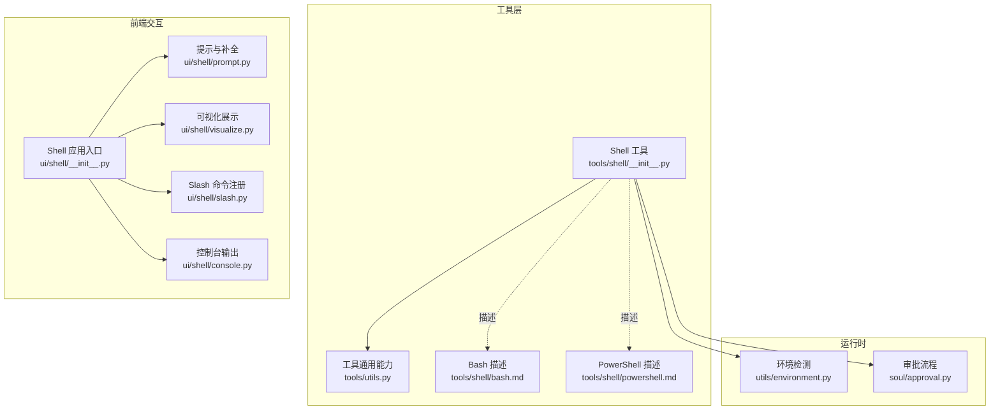
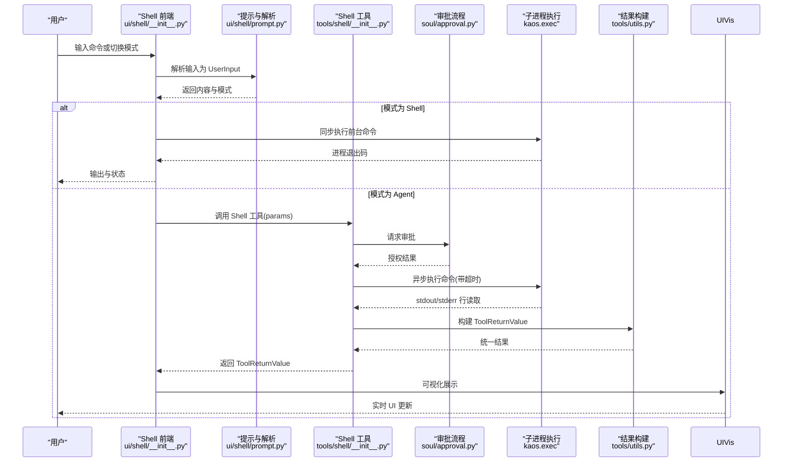
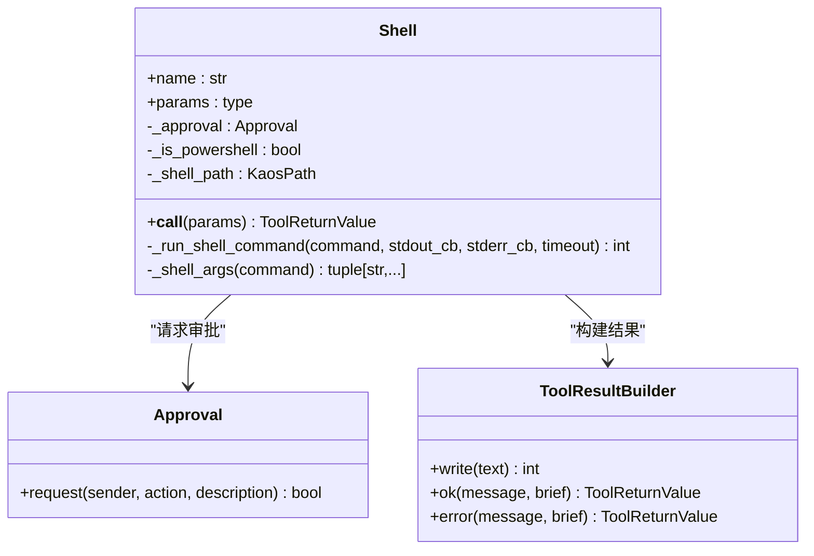
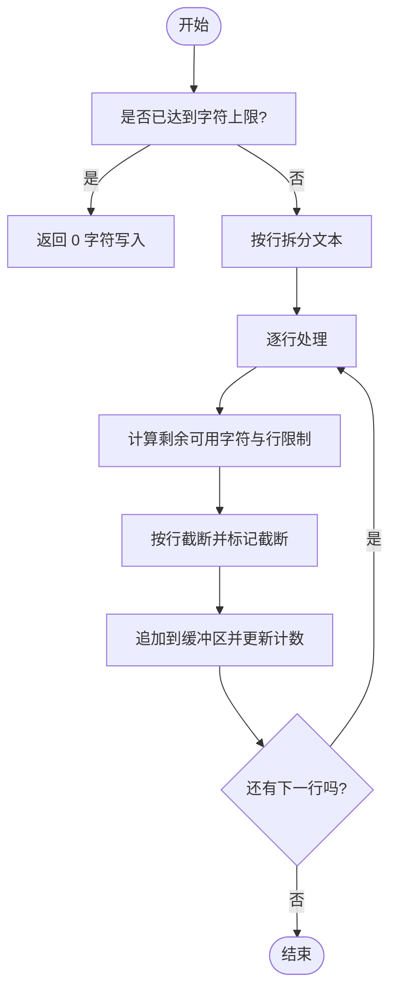
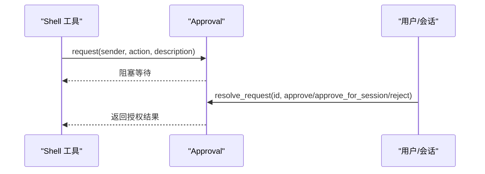
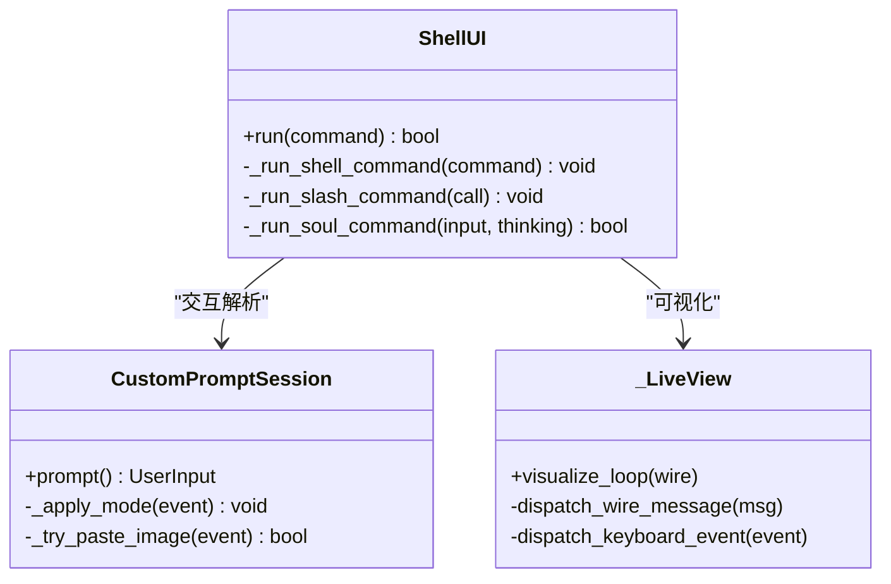
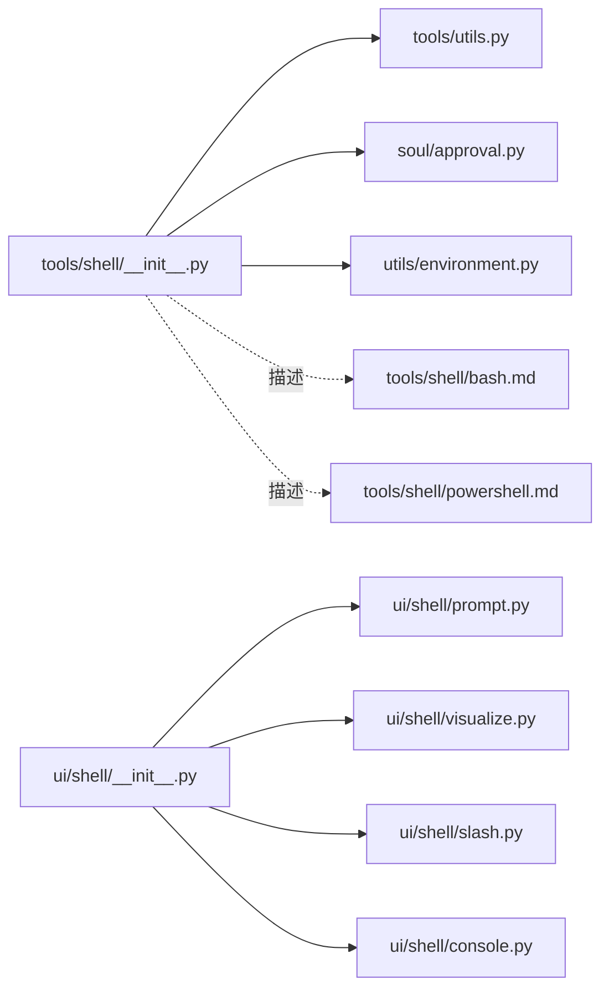

# Shell 工具重构

<cite>
**本文引用的文件**
- [src/kimi_cli/tools/shell/__init__.py](file://src/kimi_cli/tools/shell/__init__.py)
- [src/kimi_cli/tools/shell/bash.md](file://src/kimi_cli/tools/shell/bash.md)
- [src/kimi_cli/tools/shell/powershell.md](file://src/kimi_cli/tools/shell/powershell.md)
- [src/kimi_cli/tools/utils.py](file://src/kimi_cli/tools/utils.py)
- [src/kimi_cli/soul/approval.py](file://src/kimi_cli/soul/approval.py)
- [src/kimi_cli/utils/environment.py](file://src/kimi_cli/utils/environment.py)
- [src/kimi_cli/ui/shell/__init__.py](file://src/kimi_cli/ui/shell/__init__.py)
- [src/kimi_cli/ui/shell/prompt.py](file://src/kimi_cli/ui/shell/prompt.py)
- [src/kimi_cli/ui/shell/console.py](file://src/kimi_cli/ui/shell/console.py)
- [src/kimi_cli/ui/shell/visualize.py](file://src/kimi_cli/ui/shell/visualize.py)
- [src/kimi_cli/ui/shell/slash.py](file://src/kimi_cli/ui/shell/slash.py)
- [tests/test_shell_bash.py](file://tests/test_shell_bash.py)
- [tests/test_shell_powershell.py](file://tests/test_shell_powershell.py)
</cite>

## 目录
1. [简介](#简介)
2. [项目结构](#项目结构)
3. [核心组件](#核心组件)
4. [架构总览](#架构总览)
5. [详细组件分析](#详细组件分析)
6. [依赖关系分析](#依赖关系分析)
7. [性能考量](#性能考量)
8. [故障排查指南](#故障排查指南)
9. [结论](#结论)
10. [附录](#附录)

## 简介
本文件围绕 Kimi CLI 的 Shell 工具重构进行系统化文档化，重点覆盖以下方面：
- Shell 工具在不同操作系统（Linux/macOS 使用 bash；Windows 使用 PowerShell）下的行为差异与适配策略
- 工具调用的安全与权限控制、超时机制、输出截断与错误处理
- 前端交互层对 Shell 命令执行的支持（前台命令、提示符模式切换、快捷键、历史记录等）
- 审批流程与用户授权在工具调用中的作用
- 测试用例对功能边界与行为的验证

该文档既面向开发者，也面向需要理解 Shell 工具工作原理与使用方式的非技术读者。

## 项目结构
与 Shell 工具相关的核心模块分布如下：
- 工具定义与描述：tools/shell
- 工具通用能力：tools/utils（结果构建、截断、拒绝错误）
- 审批与授权：soul/approval
- 环境检测：utils/environment
- 前端交互：ui/shell（会话、提示、可视化、Slash 命令）
- 测试：tests 下针对 Bash 与 PowerShell 的专项测试

图表来源
- [src/kimi_cli/tools/shell/__init__.py](file://src/kimi_cli/tools/shell/__init__.py#L1-L121)
- [src/kimi_cli/tools/utils.py](file://src/kimi_cli/tools/utils.py#L1-L175)
- [src/kimi_cli/soul/approval.py](file://src/kimi_cli/soul/approval.py#L1-L134)
- [src/kimi_cli/utils/environment.py](file://src/kimi_cli/utils/environment.py#L1-L59)
- [src/kimi_cli/ui/shell/__init__.py](file://src/kimi_cli/ui/shell/__init__.py#L1-L344)
- [src/kimi_cli/ui/shell/prompt.py](file://src/kimi_cli/ui/shell/prompt.py#L1-L831)
- [src/kimi_cli/ui/shell/visualize.py](file://src/kimi_cli/ui/shell/visualize.py#L1-L598)
- [src/kimi_cli/ui/shell/slash.py](file://src/kimi_cli/ui/shell/slash.py#L1-L214)
- [src/kimi_cli/ui/shell/console.py](file://src/kimi_cli/ui/shell/console.py#L1-L32)

章节来源
- [src/kimi_cli/tools/shell/__init__.py](file://src/kimi_cli/tools/shell/__init__.py#L1-L121)
- [src/kimi_cli/ui/shell/__init__.py](file://src/kimi_cli/ui/shell/__init__.py#L1-L344)

## 核心组件
- Shell 工具：封装参数校验、审批请求、进程执行、流读取、超时与退出码处理，并通过工具结果构建器统一输出格式与截断策略。
- 工具通用能力：提供输出截断、字符与行数限制、显示块与附加数据的统一返回结构。
- 审批流程：在工具调用前向用户或会话请求授权，支持一次性批准、会话级自动批准与拒绝。
- 环境检测：根据平台选择合适的 Shell 名称与路径（Windows 使用 PowerShell，类 Unix 使用 bash 或 sh）。
- 前端交互：提供交互式提示、历史记录、补全、模式切换（Agent/Shell）、键盘事件处理与实时可视化。

章节来源
- [src/kimi_cli/tools/shell/__init__.py](file://src/kimi_cli/tools/shell/__init__.py#L1-L121)
- [src/kimi_cli/tools/utils.py](file://src/kimi_cli/tools/utils.py#L1-L175)
- [src/kimi_cli/soul/approval.py](file://src/kimi_cli/soul/approval.py#L1-L134)
- [src/kimi_cli/utils/environment.py](file://src/kimi_cli/utils/environment.py#L1-L59)
- [src/kimi_cli/ui/shell/__init__.py](file://src/kimi_cli/ui/shell/__init__.py#L1-L344)

## 架构总览
Shell 工具的调用链路从“前端输入”到“工具执行”，再到“结果返回与展示”。整体流程如下：

图表来源
- [src/kimi_cli/ui/shell/__init__.py](file://src/kimi_cli/ui/shell/__init__.py#L80-L180)
- [src/kimi_cli/ui/shell/prompt.py](file://src/kimi_cli/ui/shell/prompt.py#L717-L753)
- [src/kimi_cli/tools/shell/__init__.py](file://src/kimi_cli/tools/shell/__init__.py#L48-L121)
- [src/kimi_cli/soul/approval.py](file://src/kimi_cli/soul/approval.py#L37-L88)
- [src/kimi_cli/tools/utils.py](file://src/kimi_cli/tools/utils.py#L38-L175)
- [src/kimi_cli/ui/shell/visualize.py](file://src/kimi_cli/ui/shell/visualize.py#L42-L120)

## 详细组件分析

### Shell 工具（跨平台）
- 参数模型与描述：包含命令字符串与超时秒数，描述文件根据当前 Shell 名称动态注入变量。
- 审批前置：每次调用都会请求审批，未授权则直接返回拒绝错误。
- 执行策略：
  - 读取 stdout/stderr 流，逐行写入结果构建器，支持 UTF-8 替换解码。
  - 使用异步等待与超时控制，超时后主动杀掉进程并抛出超时错误。
  - 依据平台选择不同的启动参数（PowerShell 使用 -command，类 Unix 使用 -c）。
- 结果构建：成功返回“执行成功”，失败返回“失败且附带退出码”，并按统一规则添加截断提示。

图表来源
- [src/kimi_cli/tools/shell/__init__.py](file://src/kimi_cli/tools/shell/__init__.py#L18-L121)
- [src/kimi_cli/soul/approval.py](file://src/kimi_cli/soul/approval.py#L26-L88)
- [src/kimi_cli/tools/utils.py](file://src/kimi_cli/tools/utils.py#L38-L175)

章节来源
- [src/kimi_cli/tools/shell/__init__.py](file://src/kimi_cli/tools/shell/__init__.py#L18-L121)
- [src/kimi_cli/tools/shell/bash.md](file://src/kimi_cli/tools/shell/bash.md#L1-L31)
- [src/kimi_cli/tools/shell/powershell.md](file://src/kimi_cli/tools/shell/powershell.md#L1-L26)

### 工具通用能力（结果构建与截断）
- 截断策略：按行进行截断，保留行尾换行，超过最大字符数或单行长度时追加标记并标记截断发生。
- 输出上限：默认字符数与单行长度可配置，超出即截断。
- 返回结构：统一的 ToolReturnValue，包含 is_error、output、message、display、extras 字段，便于上层 UI 展示与后续处理。

图表来源
- [src/kimi_cli/tools/utils.py](file://src/kimi_cli/tools/utils.py#L17-L113)

章节来源
- [src/kimi_cli/tools/utils.py](file://src/kimi_cli/tools/utils.py#L1-L175)

### 审批流程（授权与会话级自动批准）
- 请求来源：必须来自工具调用上下文，否则抛出运行时错误。
- 自动批准：支持“一次性批准”和“会话级自动批准”两种响应，后者会将动作加入自动批准集合。
- 队列管理：请求进入队列，由会话侧轮询取出并处理，支持批量自动批准与拒绝传播。

图表来源
- [src/kimi_cli/soul/approval.py](file://src/kimi_cli/soul/approval.py#L37-L134)

章节来源
- [src/kimi_cli/soul/approval.py](file://src/kimi_cli/soul/approval.py#L1-L134)

### 环境检测（跨平台 Shell 选择）
- 平台识别：根据系统类型设置 OS 类型、架构与版本。
- Shell 选择：Windows 默认 PowerShell；类 Unix 优先 bash，不存在则回退 sh。
- 路径与名称：记录 shell 名称与可执行路径，供工具描述与参数拼接使用。

章节来源
- [src/kimi_cli/utils/environment.py](file://src/kimi_cli/utils/environment.py#L1-L59)

### 前端交互（提示、补全、模式切换与可视化）
- 提示与解析：支持 Agent/Shell 模式切换、思考模式、历史记录、剪贴板图片粘贴、Slash 命令补全等。
- Shell 前台命令：对 cd 等目录变更给出提示；捕获 SIGINT 并终止子进程；异常时输出错误信息。
- 可视化：实时渲染内容块、工具调用块、审批面板与状态栏，支持键盘事件（ESC 取消、上下选择审批选项）。
- Slash 命令：注册帮助、版本、会话列表、MCP 服务器等命令，支持重载与会话切换。

图表来源
- [src/kimi_cli/ui/shell/__init__.py](file://src/kimi_cli/ui/shell/__init__.py#L48-L253)
- [src/kimi_cli/ui/shell/prompt.py](file://src/kimi_cli/ui/shell/prompt.py#L492-L753)
- [src/kimi_cli/ui/shell/visualize.py](file://src/kimi_cli/ui/shell/visualize.py#L42-L120)

章节来源
- [src/kimi_cli/ui/shell/__init__.py](file://src/kimi_cli/ui/shell/__init__.py#L1-L344)
- [src/kimi_cli/ui/shell/prompt.py](file://src/kimi_cli/ui/shell/prompt.py#L1-L831)
- [src/kimi_cli/ui/shell/visualize.py](file://src/kimi_cli/ui/shell/visualize.py#L1-L598)
- [src/kimi_cli/ui/shell/slash.py](file://src/kimi_cli/ui/shell/slash.py#L1-L214)
- [src/kimi_cli/ui/shell/console.py](file://src/kimi_cli/ui/shell/console.py#L1-L32)

### 测试用例（Bash 与 PowerShell）
- Bash 测试覆盖：简单命令、错误命令、命令链、管道、条件执行、超时、环境变量、文件操作、文本处理、命令替换、算术替换、长输出截断、超时参数边界等。
- PowerShell 测试覆盖：基本命令、错误命令、命令链、文件读写等 Windows 场景。

章节来源
- [tests/test_shell_bash.py](file://tests/test_shell_bash.py#L1-L222)
- [tests/test_shell_powershell.py](file://tests/test_shell_powershell.py#L1-L64)

## 依赖关系分析
- 工具层依赖：
  - Shell 工具依赖工具通用能力（结果构建与截断）、审批流程（授权）、环境检测（平台与 Shell 选择）。
  - 描述文件（bash.md、powershell.md）用于动态注入 Shell 名称与路径。
- 前端依赖：
  - ShellUI 依赖提示会话、可视化组件、Slash 命令注册与控制台输出。
  - 可视化组件依赖 Wire 通道与键盘监听，实现事件驱动的 UI 更新。
- 测试依赖：
  - 测试用例依赖工具参数模型与工具描述，验证跨平台行为与边界条件。

图表来源
- [src/kimi_cli/tools/shell/__init__.py](file://src/kimi_cli/tools/shell/__init__.py#L1-L121)
- [src/kimi_cli/tools/utils.py](file://src/kimi_cli/tools/utils.py#L1-L175)
- [src/kimi_cli/soul/approval.py](file://src/kimi_cli/soul/approval.py#L1-L134)
- [src/kimi_cli/utils/environment.py](file://src/kimi_cli/utils/environment.py#L1-L59)
- [src/kimi_cli/ui/shell/__init__.py](file://src/kimi_cli/ui/shell/__init__.py#L1-L344)
- [src/kimi_cli/ui/shell/prompt.py](file://src/kimi_cli/ui/shell/prompt.py#L1-L831)
- [src/kimi_cli/ui/shell/visualize.py](file://src/kimi_cli/ui/shell/visualize.py#L1-L598)
- [src/kimi_cli/ui/shell/slash.py](file://src/kimi_cli/ui/shell/slash.py#L1-L214)
- [src/kimi_cli/ui/shell/console.py](file://src/kimi_cli/ui/shell/console.py#L1-L32)

章节来源
- [src/kimi_cli/tools/shell/__init__.py](file://src/kimi_cli/tools/shell/__init__.py#L1-L121)
- [src/kimi_cli/ui/shell/__init__.py](file://src/kimi_cli/ui/shell/__init__.py#L1-L344)

## 性能考量
- I/O 与并发：使用异步读取 stdout/stderr，避免阻塞主线程；超时控制确保长时间运行命令不会占用资源。
- 输出截断：默认字符数与单行长度限制，防止过长输出导致内存与渲染压力。
- 前端刷新：Live 渲染以固定频率刷新，结合事件驱动的消息分发，减少不必要的重绘。
- 历史与补全：本地历史文件与路径缓存提升输入效率，但需注意磁盘 IO 与缓存一致性。

[本节为通用指导，不直接分析具体文件]

## 故障排查指南
- 命令无输出或被截断
  - 检查工具返回消息中是否包含“输出被截断”的提示；适当调整命令或分段执行。
  - 参考路径：[src/kimi_cli/tools/utils.py](file://src/kimi_cli/tools/utils.py#L114-L175)
- 命令超时被杀
  - 提高超时参数或优化命令；确认命令是否为交互式或无限循环。
  - 参考路径：[src/kimi_cli/tools/shell/__init__.py](file://src/kimi_cli/tools/shell/__init__.py#L70-L116)
- 权限不足或被拒绝
  - 审批流程可能因用户拒绝而中断；检查审批请求与会话级自动批准设置。
  - 参考路径：[src/kimi_cli/soul/approval.py](file://src/kimi_cli/soul/approval.py#L37-L134)
- Windows 命令不生效
  - 确认使用 PowerShell 语法与路径；避免使用类 Unix 特性。
  - 参考路径：[src/kimi_cli/tools/shell/powershell.md](file://src/kimi_cli/tools/shell/powershell.md#L1-L26)
- 前台命令无法持久化目录变更
  - Shell 前台命令不会保留目录变更；如需持久化，请在单次调用内完成链式命令。
  - 参考路径：[src/kimi_cli/ui/shell/__init__.py](file://src/kimi_cli/ui/shell/__init__.py#L109-L145)

章节来源
- [src/kimi_cli/tools/utils.py](file://src/kimi_cli/tools/utils.py#L114-L175)
- [src/kimi_cli/tools/shell/__init__.py](file://src/kimi_cli/tools/shell/__init__.py#L70-L116)
- [src/kimi_cli/soul/approval.py](file://src/kimi_cli/soul/approval.py#L37-L134)
- [src/kimi_cli/tools/shell/powershell.md](file://src/kimi_cli/tools/shell/powershell.md#L1-L26)
- [src/kimi_cli/ui/shell/__init__.py](file://src/kimi_cli/ui/shell/__init__.py#L109-L145)

## 结论
本次重构围绕“跨平台 Shell 工具 + 审批授权 + 前端交互 + 结果构建与截断”的完整闭环展开，实现了：
- 明确的参数与描述规范，支持 Bash 与 PowerShell 的差异化说明
- 严格的审批前置与超时控制，兼顾安全与稳定性
- 统一的结果构建与截断策略，保证输出可控与可读
- 丰富的前端交互能力，包括模式切换、补全、历史与可视化

建议在后续迭代中：
- 增强对子进程信号处理与资源回收的健壮性
- 优化长输出场景下的增量展示与分页
- 扩展审批流程的 UI 与会话级配置项

[本节为总结性内容，不直接分析具体文件]

## 附录
- 关键参数与约束
  - 命令：必填字符串
  - 超时：最小 1 秒，最大 300 秒（对应常量 MAX_TIMEOUT）
- 输出与错误
  - 成功：返回“执行成功”消息
  - 失败：返回“失败且附带退出码”的消息
  - 截断：当输出超过默认字符数或单行长度时追加截断标记

章节来源
- [src/kimi_cli/tools/shell/__init__.py](file://src/kimi_cli/tools/shell/__init__.py#L18-L30)
- [src/kimi_cli/tools/utils.py](file://src/kimi_cli/tools/utils.py#L33-L51)
- [tests/test_shell_bash.py](file://tests/test_shell_bash.py#L207-L222)