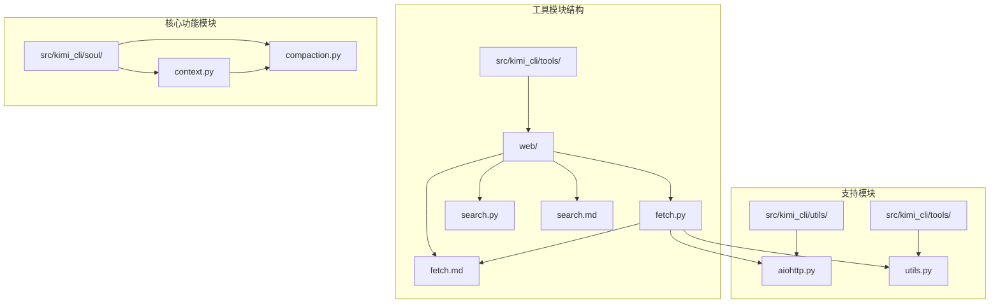
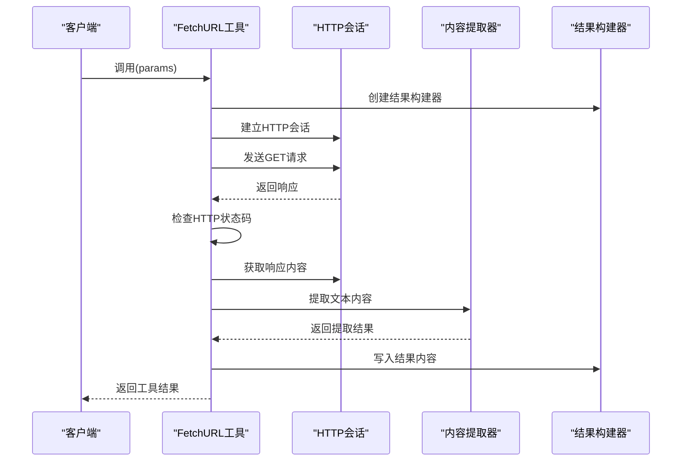
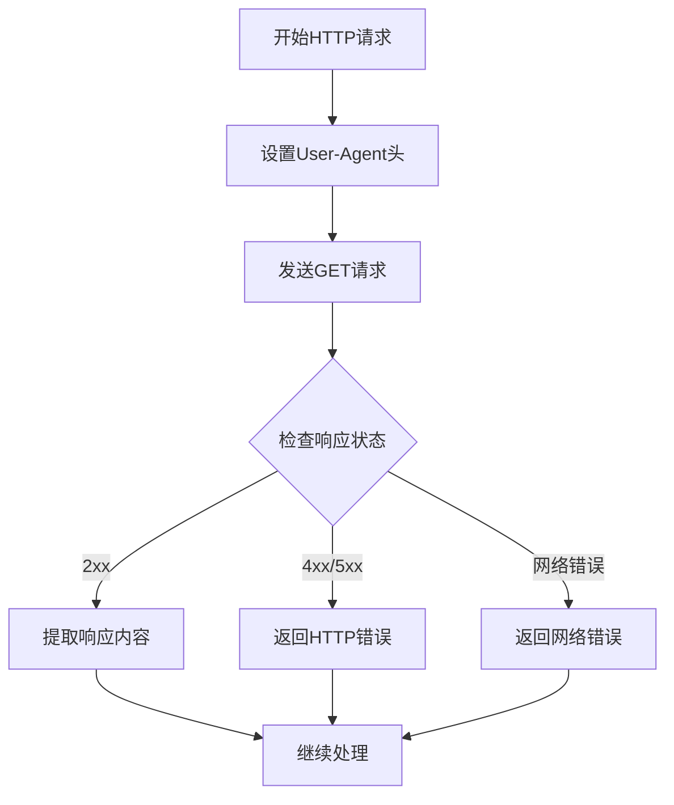
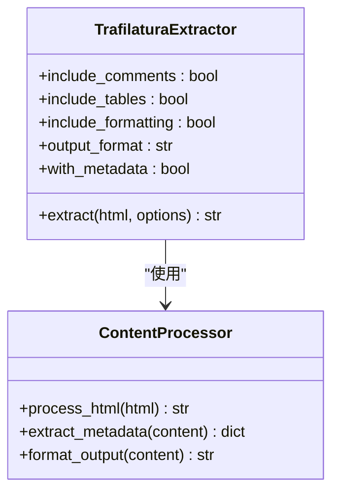
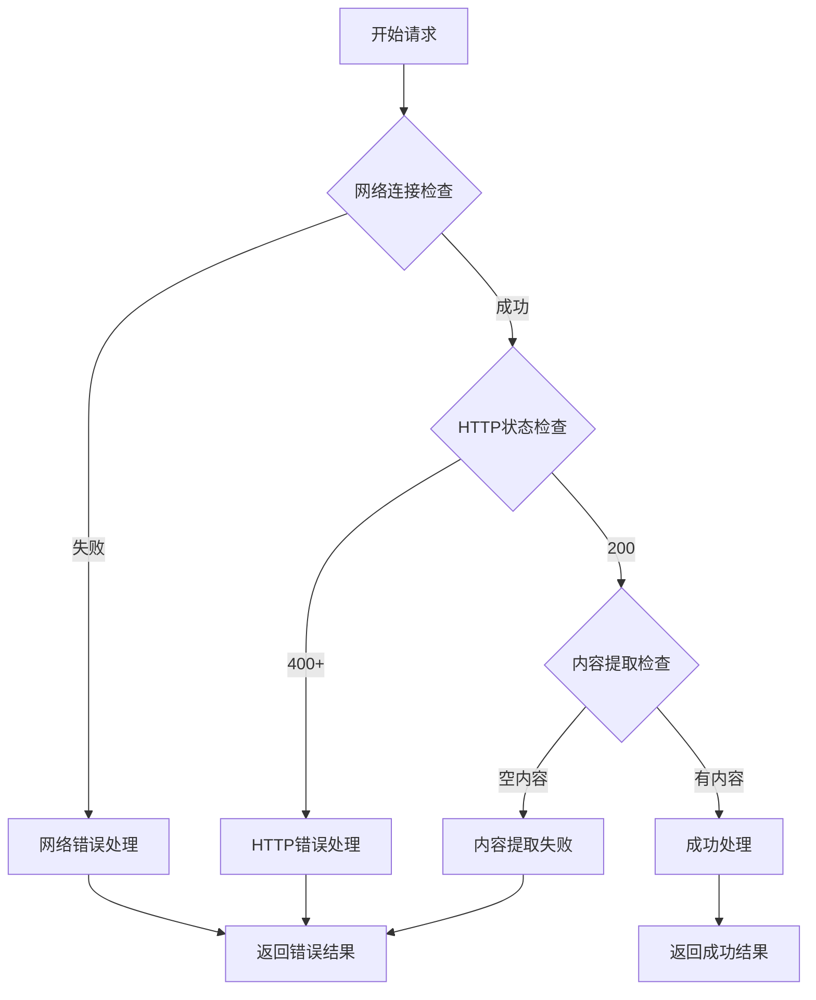
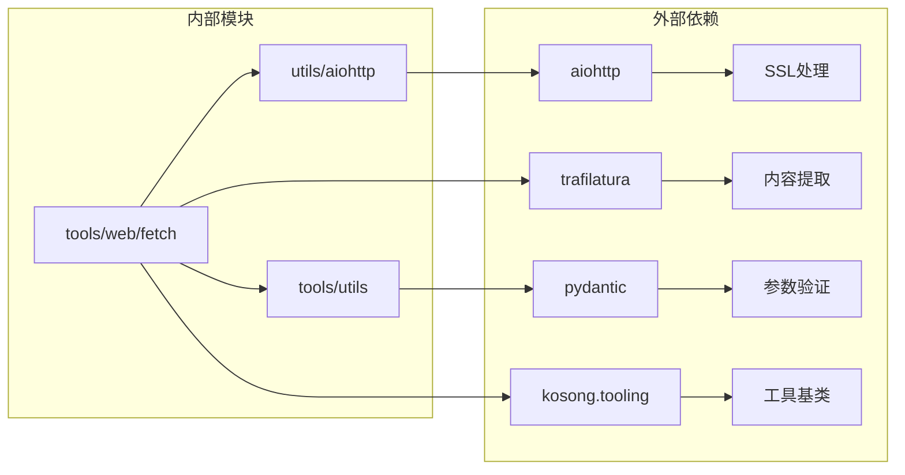

# FetchURL 工具

<cite>
**本文档中引用的文件**
- [fetch.py](file://src/kimi_cli/tools/web/fetch.py)
- [fetch.md](file://src/kimi_cli/tools/web/fetch.md)
- [test_fetch_url.py](file://tests/test_fetch_url.py)
- [aiohttp.py](file://src/kimi_cli/utils/aiohttp.py)
- [utils.py](file://src/kimi_cli/tools/utils.py)
- [pyproject.toml](file://pyproject.toml)
- [context.py](file://src/kimi_cli/soul/context.py)
- [compaction.py](file://src/kimi_cli/soul/compaction.py)
</cite>

## 目录
1. [简介](#简介)
2. [项目结构](#项目结构)
3. [核心组件](#核心组件)
4. [架构概览](#架构概览)
5. [详细组件分析](#详细组件分析)
6. [依赖关系分析](#依赖关系分析)
7. [性能考虑](#性能考虑)
8. [故障排除指南](#故障排除指南)
9. [结论](#结论)

## 简介

FetchURL工具是一个强大的异步网页内容抓取工具，专门设计用于从指定URL获取网页内容并提取主要文本信息。该工具基于现代Python异步编程模式，使用aiohttp库进行HTTP请求处理，并集成Trafilatura库进行智能的内容提取和简化。

FetchURL工具的核心功能包括：
- 异步HTTP GET请求处理
- 智能HTML内容提取和文本化
- 元信息提取（标题、作者、日期等）
- 错误处理和重试机制
- 内容大小限制和截断
- 安全防护措施

该工具在kimi-cli项目中扮演着重要的角色，特别是在上下文压缩前对网页内容进行预处理，为后续的AI处理提供高质量的文本输入。

## 项目结构

FetchURL工具位于项目的web工具模块中，具有清晰的文件组织结构：

**图表来源**
- [fetch.py](file://src/kimi_cli/tools/web/fetch.py#L1-L96)
- [aiohttp.py](file://src/kimi_cli/utils/aiohttp.py#L1-L13)
- [utils.py](file://src/kimi_cli/tools/utils.py#L1-L151)

**章节来源**
- [fetch.py](file://src/kimi_cli/tools/web/fetch.py#L1-L96)
- [fetch.md](file://src/kimi_cli/tools/web/fetch.md#L1-L2)

## 核心组件

FetchURL工具由以下核心组件构成：

### 参数模型 (Params)
定义了工具的输入参数结构，包含单个必需的URL字段。

### FetchURL类
继承自CallableTool2，实现了异步调用接口，负责整个抓取流程的协调。

### 工具结果构建器 (ToolResultBuilder)
提供统一的结果处理机制，包括成功和错误响应的格式化。

### HTTP客户端会话管理
基于aiohttp的异步HTTP客户端，支持SSL验证和连接池管理。

**章节来源**
- [fetch.py](file://src/kimi_cli/tools/web/fetch.py#L13-L21)
- [utils.py](file://src/kimi_cli/tools/utils.py#L37-L151)

## 架构概览

FetchURL工具采用分层架构设计，确保了良好的可维护性和扩展性：

**图表来源**
- [fetch.py](file://src/kimi_cli/tools/web/fetch.py#L22-L84)
- [aiohttp.py](file://src/kimi_cli/utils/aiohttp.py#L11-L12)

## 详细组件分析

### HTTP请求处理组件

FetchURL工具使用aiohttp库进行异步HTTP请求处理，具备以下特性：

#### 用户代理伪装
工具使用标准的浏览器用户代理字符串，避免被目标网站识别为爬虫：

**图表来源**
- [fetch.py](file://src/kimi_cli/tools/web/fetch.py#L27-L37)

#### SSL验证配置
通过自定义的SSL上下文确保HTTPS连接的安全性：

**章节来源**
- [fetch.py](file://src/kimi_cli/tools/web/fetch.py#L27-L37)
- [aiohttp.py](file://src/kimi_cli/utils/aiohttp.py#L8-L12)

### 内容提取组件

#### Trafilatura集成
工具集成了Trafilatura库进行智能的内容提取：

**图表来源**
- [fetch.py](file://src/kimi_cli/tools/web/fetch.py#L64-L71)

#### 元信息提取
提取的元信息包括：
- 页面标题 (title)
- 作者信息 (author)
- 页面URL (url)
- 主机名 (hostname)
- 描述信息 (description)
- 网站名称 (sitename)
- 发布日期 (date)
- 分类标签 (categories)

**章节来源**
- [fetch.py](file://src/kimi_cli/tools/web/fetch.py#L64-L71)

### 错误处理与重试机制

工具实现了多层次的错误处理机制：

**图表来源**
- [fetch.py](file://src/kimi_cli/tools/web/fetch.py#L39-L84)

**章节来源**
- [fetch.py](file://src/kimi_cli/tools/web/fetch.py#L39-L84)

### 结果构建与输出

#### ToolResultBuilder系统
提供了统一的结果处理机制，支持：

- 字符数限制 (DEFAULT_MAX_CHARS = 50,000)
- 行长度限制 (DEFAULT_MAX_LINE_LENGTH = 2,000)
- 自动截断标记 ([...truncated])
- 成功和错误结果的格式化

#### 输出格式
成功的提取结果包含：
- YAML格式的元信息头部
- 提取的主要文本内容
- 完整的上下文信息

**章节来源**
- [utils.py](file://src/kimi_cli/tools/utils.py#L37-L151)

## 依赖关系分析

FetchURL工具的依赖关系展现了清晰的模块化设计：

**图表来源**
- [fetch.py](file://src/kimi_cli/tools/web/fetch.py#L1-L9)
- [pyproject.toml](file://pyproject.toml#L7-L26)

### 关键依赖说明

| 依赖包 | 版本 | 用途 |
|--------|------|------|
| aiohttp | 3.13.2 | 异步HTTP客户端 |
| trafilatura | 2.0.0 | HTML内容提取 |
| pydantic | 2.12.4 | 数据验证和序列化 |
| kosong.tooling | 0.25.0 | 工具基类框架 |

**章节来源**
- [pyproject.toml](file://pyproject.toml#L7-L26)
- [fetch.py](file://src/kimi_cli/tools/web/fetch.py#L1-L9)

## 性能考虑

### 异步处理优势
- 使用aiohttp实现真正的异步I/O操作
- 支持并发请求处理
- 减少线程开销和资源占用

### 内存优化
- 内容大小限制防止内存溢出
- 流式处理减少内存占用
- 及时释放HTTP连接资源

### 缓存策略
虽然当前版本没有内置缓存，但可以通过外部机制实现：
- URL级别的内容缓存
- 元信息缓存
- 错误状态缓存

## 故障排除指南

### 常见问题及解决方案

#### 网络连接问题
**症状**: "Failed to fetch URL due to network error"
**原因**: URL无效、服务器不可达、DNS解析失败
**解决方案**: 
- 验证URL格式正确性
- 检查网络连接状态
- 确认目标服务器可达性

#### HTTP状态错误
**症状**: "Failed to fetch URL. Status: 404"
**原因**: 页面不存在、权限拒绝、服务器错误
**解决方案**:
- 检查URL是否正确
- 验证访问权限
- 查看服务器状态

#### 内容提取失败
**症状**: "Failed to extract meaningful content"
**原因**: 页面需要JavaScript渲染、内容不适合提取
**解决方案**:
- 尝试其他类型的页面
- 检查页面是否动态加载内容
- 考虑使用更高级的爬虫工具

**章节来源**
- [test_fetch_url.py](file://tests/test_fetch_url.py#L40-L99)

### 安全与合规性

#### URL验证
虽然代码中没有显式的URL白名单验证，但在实际使用中应该：
- 实现URL格式验证
- 检查域名白名单
- 防止SSRF攻击

#### 内容过滤
- 过滤恶意脚本和XSS攻击
- 移除敏感个人信息
- 控制内容大小防止滥用

#### 隐私保护
- 不保存用户的原始查询
- 对提取的内容进行适当的脱敏处理
- 遵循相关的数据保护法规

## 结论

FetchURL工具是一个设计精良的异步网页内容抓取解决方案，具有以下突出特点：

### 技术优势
- 基于现代异步编程模式，性能优异
- 集成专业的内容提取库，准确性高
- 完善的错误处理和结果格式化
- 良好的可扩展性和维护性

### 应用价值
- 为AI对话系统提供高质量的上下文信息
- 支持技术文档和知识库的自动化获取
- 可作为搜索引擎和信息聚合的基础组件

### 改进建议
- 添加URL白名单验证机制
- 实现内容缓存策略
- 增加更多的内容过滤规则
- 提供更详细的日志记录

FetchURL工具在kimi-cli生态系统中发挥着重要作用，为智能对话和知识处理提供了可靠的内容获取能力。其模块化的设计和清晰的架构使其易于维护和扩展，是现代AI应用中不可或缺的基础设施组件。