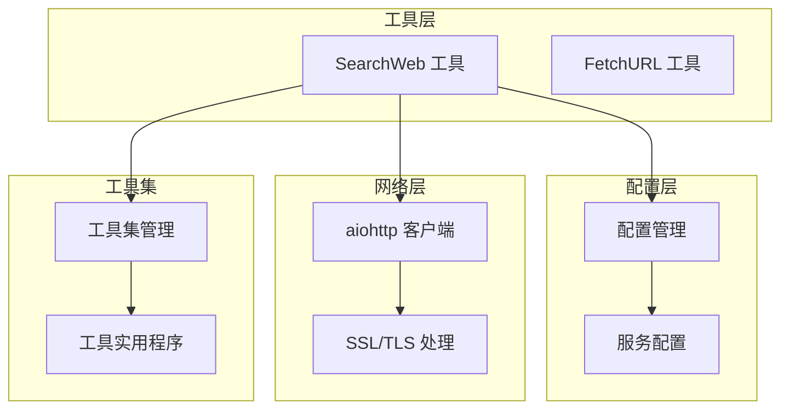
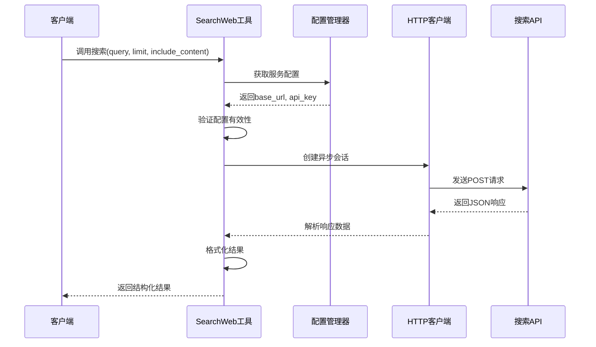
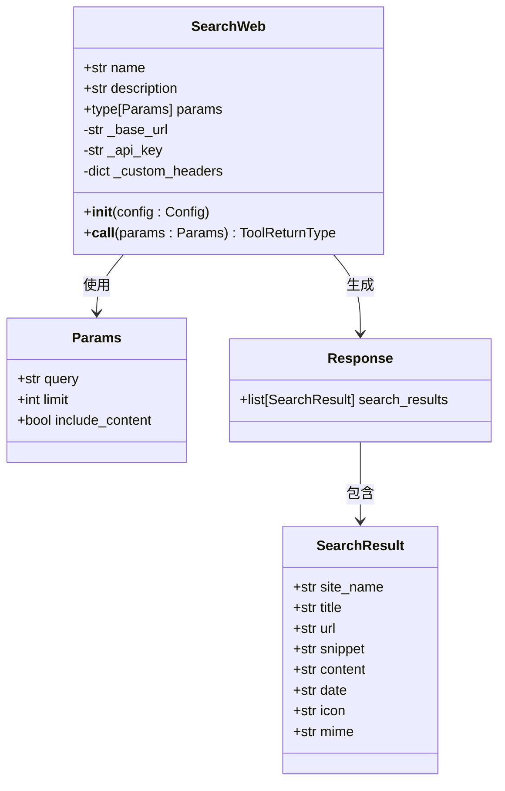
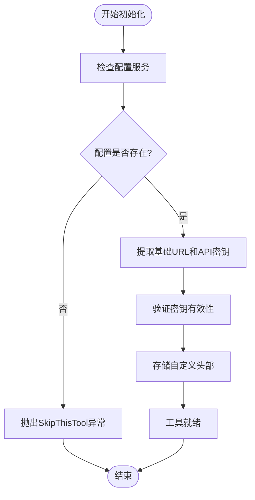
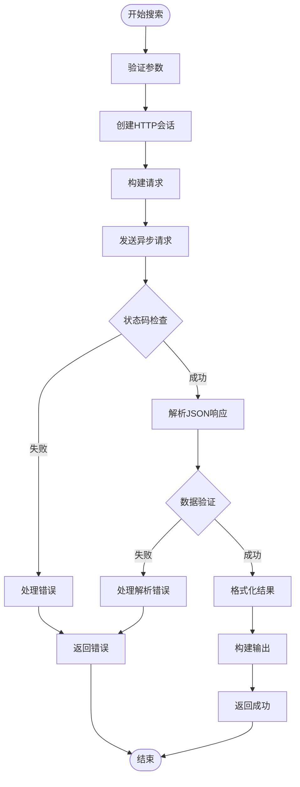
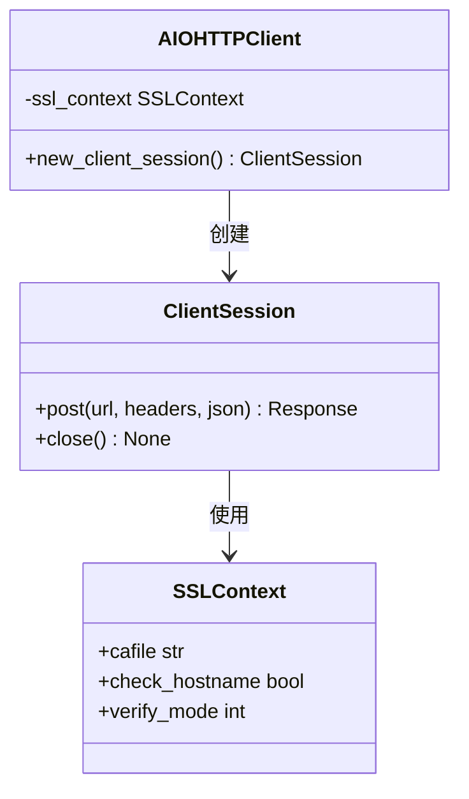
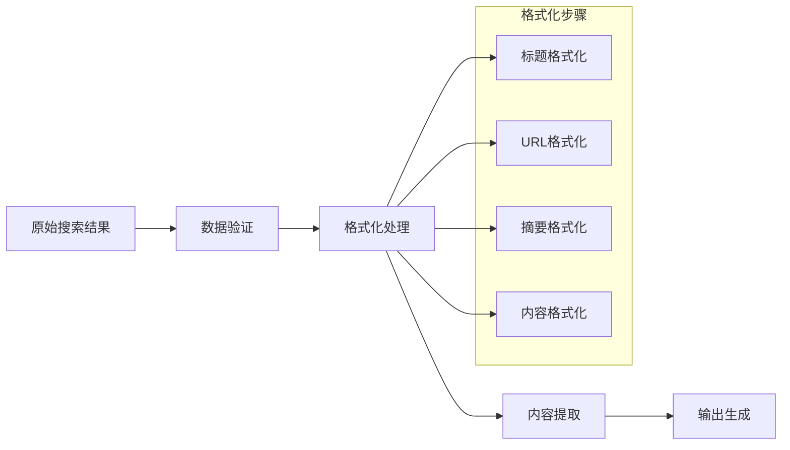
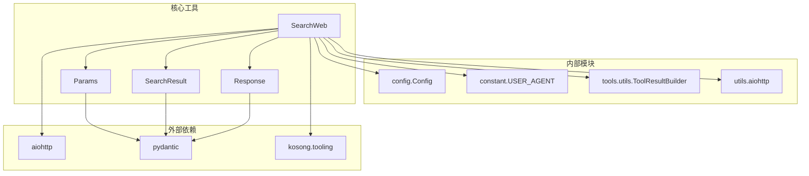

# SearchWeb 工具技术文档

<cite>
**本文档中引用的文件**
- [search.py](file://src/kimi_cli/tools/web/search.py)
- [search.md](file://src/kimi_cli/tools/web/search.md)
- [aiohttp.py](file://src/kimi_cli/utils/aiohttp.py)
- [config.py](file://src/kimi_cli/config.py)
- [constant.py](file://src/kimi_cli/constant.py)
- [utils.py](file://src/kimi_cli/tools/utils.py)
- [toolset.py](file://src/kimi_cli/soul/toolset.py)
- [__init__.py](file://src/kimi_cli/tools/web/__init__.py)
</cite>

## 目录
1. [简介](#简介)
2. [项目结构](#项目结构)
3. [核心组件](#核心组件)
4. [架构概览](#架构概览)
5. [详细组件分析](#详细组件分析)
6. [依赖关系分析](#依赖关系分析)
7. [性能考虑](#性能考虑)
8. [故障排除指南](#故障排除指南)
9. [结论](#结论)

## 简介

SearchWeb 是 Kimi CLI 项目中的一个关键工具，专门负责通过集成的搜索引擎（如 Moonshot Search）执行网络搜索请求。该工具提供了强大的异步HTTP请求机制，能够从互联网获取最新的信息，包括新闻、文档、发布说明、博客文章、论文等多种类型的在线资源。

SearchWeb 工具的核心功能包括：
- 异步网络搜索请求处理
- 结构化搜索结果解析
- 结果内容提取与格式化
- 安全的API密钥管理和请求认证
- 错误处理和重试机制
- 用户隐私保护和内容过滤

## 项目结构

SearchWeb 工具在项目中的组织结构体现了清晰的模块化设计：

**图表来源**
- [search.py](file://src/kimi_cli/tools/web/search.py#L1-L128)
- [config.py](file://src/kimi_cli/config.py#L54-L85)
- [aiohttp.py](file://src/kimi_cli/utils/aiohttp.py#L1-L13)

**章节来源**
- [search.py](file://src/kimi_cli/tools/web/search.py#L1-L128)
- [__init__.py](file://src/kimi_cli/tools/web/__init__.py#L1-L4)

## 核心组件

SearchWeb 工具由以下核心组件构成：

### 参数模型 (Params)
定义了搜索请求的输入参数结构，包括查询文本、结果数量限制和内容包含选项。

### 搜索结果模型 (SearchResult)
标准化了搜索结果的数据结构，包含标题、URL、摘要、内容、日期等字段。

### 响应模型 (Response)
封装了完整的搜索响应结构，包含多个搜索结果的列表。

### 工具类 (SearchWeb)
实现了主要的搜索逻辑，包括HTTP请求构建、API调用和结果处理。

**章节来源**
- [search.py](file://src/kimi_cli/tools/web/search.py#L15-L128)

## 架构概览

SearchWeb 工具采用异步架构设计，确保高效的并发处理能力：

**图表来源**
- [search.py](file://src/kimi_cli/tools/web/search.py#L52-L112)
- [aiohttp.py](file://src/kimi_cli/utils/aiohttp.py#L11-L13)

## 详细组件分析

### SearchWeb 类分析

SearchWeb 类是整个工具的核心实现，继承自 `CallableTool2`，提供了完整的异步搜索功能。

#### 类结构图

**图表来源**
- [search.py](file://src/kimi_cli/tools/web/search.py#L15-L128)

#### 初始化过程

SearchWeb 的初始化过程包含了完整的配置验证和错误处理：

**图表来源**
- [search.py](file://src/kimi_cli/tools/web/search.py#L43-L50)

#### 异步搜索流程

搜索过程采用了完整的异步编程模式，确保非阻塞的网络操作：

**图表来源**
- [search.py](file://src/kimi_cli/tools/web/search.py#L52-L112)

**章节来源**
- [search.py](file://src/kimi_cli/tools/web/search.py#L38-L112)

### 参数验证系统

SearchWeb 实现了严格的参数验证机制，确保输入数据的有效性：

| 参数名 | 类型 | 默认值 | 验证规则 | 描述 |
|--------|------|--------|----------|------|
| query | str | 必需 | 非空字符串 | 要搜索的查询文本 |
| limit | int | 5 | 1 ≤ value ≤ 20 | 返回结果的数量限制 |
| include_content | bool | False | 布尔值 | 是否包含网页内容 |

**章节来源**
- [search.py](file://src/kimi_cli/tools/web/search.py#L15-L35)

### HTTP客户端集成

SearchWeb 使用 aiohttp 库构建安全可靠的HTTP客户端：

**图表来源**
- [aiohttp.py](file://src/kimi_cli/utils/aiohttp.py#L11-L13)

**章节来源**
- [aiohttp.py](file://src/kimi_cli/utils/aiohttp.py#L1-L13)

### 结果处理与格式化

SearchWeb 提供了完整的搜索结果处理链：

**图表来源**
- [search.py](file://src/kimi_cli/tools/web/search.py#L102-L111)

**章节来源**
- [search.py](file://src/kimi_cli/tools/web/search.py#L102-L111)

### 错误处理机制

SearchWeb 实现了多层次的错误处理策略：

| 错误类型 | 处理策略 | 返回信息 |
|----------|----------|----------|
| 配置缺失 | SkipThisTool异常 | "Search service is not configured" |
| API密钥无效 | 错误响应 | "Search service not configured" |
| 网络请求失败 | 状态码检查 | "Failed to search. Status: {status}" |
| 数据解析错误 | 验证异常处理 | "Failed to parse search results" |

**章节来源**
- [search.py](file://src/kimi_cli/tools/web/search.py#L55-L100)

## 依赖关系分析

SearchWeb 工具的依赖关系展现了清晰的分层架构：

**图表来源**
- [search.py](file://src/kimi_cli/tools/web/search.py#L1-L13)
- [config.py](file://src/kimi_cli/config.py#L54-L85)

**章节来源**
- [search.py](file://src/kimi_cli/tools/web/search.py#L1-L13)
- [config.py](file://src/kimi_cli/config.py#L54-L85)

## 性能考虑

SearchWeb 工具在设计时充分考虑了性能优化：

### 异步处理优势
- 非阻塞的网络请求处理
- 并发连接支持
- 内存高效的流式处理

### 缓存策略
- 连接池复用
- SSL上下文缓存
- 请求头复用

### 资源管理
- 自动连接关闭
- 内存使用控制
- 输出长度限制

## 故障排除指南

### 常见问题及解决方案

#### 1. 搜索服务未配置
**症状**: 抛出 `SkipThisTool` 异常
**原因**: 配置文件中缺少 `moonshot_search` 服务配置
**解决**: 在配置文件中添加正确的服务配置

#### 2. API密钥无效
**症状**: 返回 "Search service not configured" 错误
**原因**: API密钥为空或配置不正确
**解决**: 检查并更新有效的API密钥

#### 3. 网络请求超时
**症状**: 返回 "Failed to search" 错误
**原因**: 网络连接问题或API服务不可用
**解决**: 检查网络连接和API服务状态

#### 4. 数据解析失败
**症状**: 返回 "Failed to parse search results" 错误
**原因**: API响应格式不符合预期
**解决**: 检查API版本兼容性和响应格式

**章节来源**
- [search.py](file://src/kimi_cli/tools/web/search.py#L55-L100)

## 结论

SearchWeb 工具是一个设计精良的异步搜索解决方案，具有以下特点：

### 技术优势
- **异步架构**: 利用现代异步编程模式提高性能
- **类型安全**: 使用Pydantic进行严格的数据验证
- **错误处理**: 完善的异常处理和恢复机制
- **配置管理**: 灵活的服务配置和密钥管理

### 安全特性
- **API密钥保护**: 使用SecretStr安全存储敏感信息
- **SSL/TLS支持**: 自动化的HTTPS连接和证书验证
- **请求追踪**: 通过工具调用ID进行请求追踪

### 扩展性
- **模块化设计**: 清晰的职责分离和接口定义
- **配置驱动**: 支持多种搜索引擎后端
- **插件架构**: 易于扩展新的搜索服务

SearchWeb 工具为 Kimi CLI 提供了强大的网络搜索能力，是构建智能代理系统的重要基础设施。其优雅的设计和完善的错误处理机制确保了在各种环境下的稳定运行。