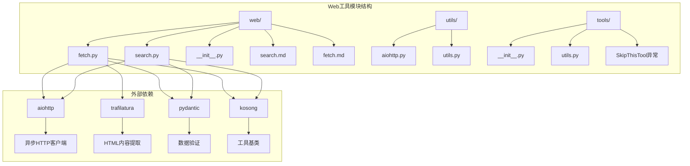
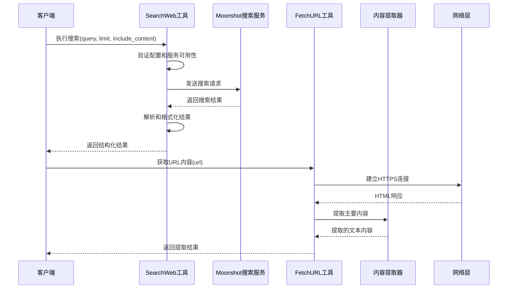
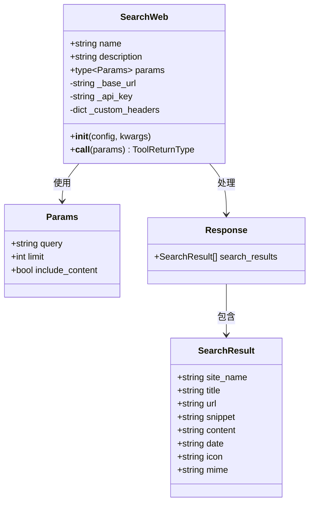
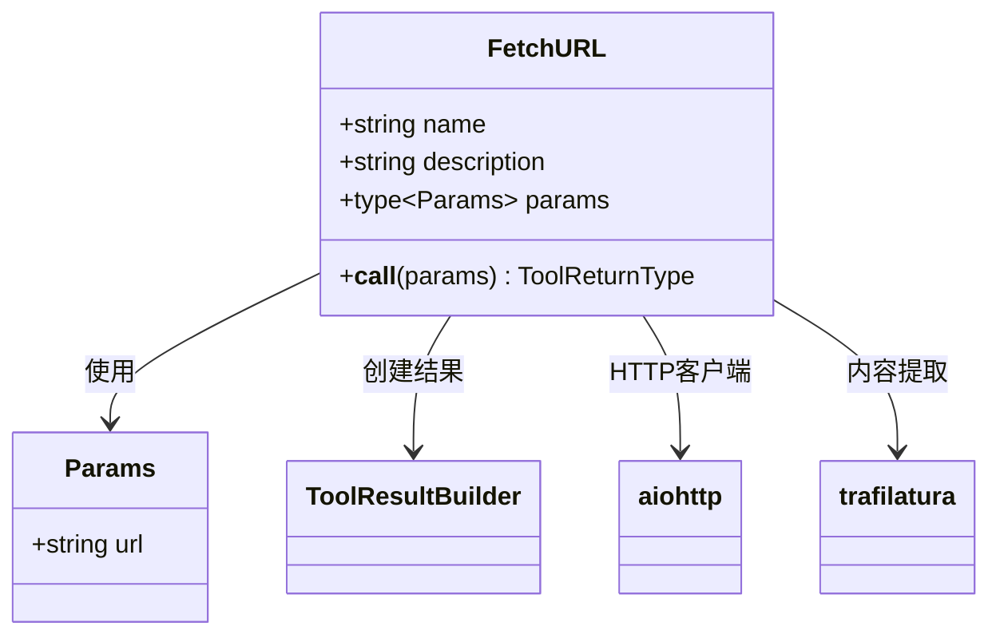
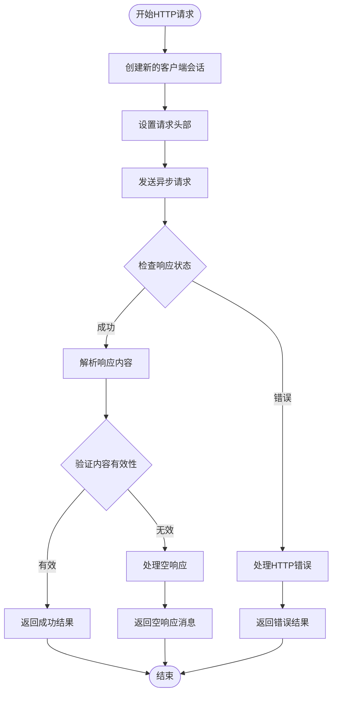
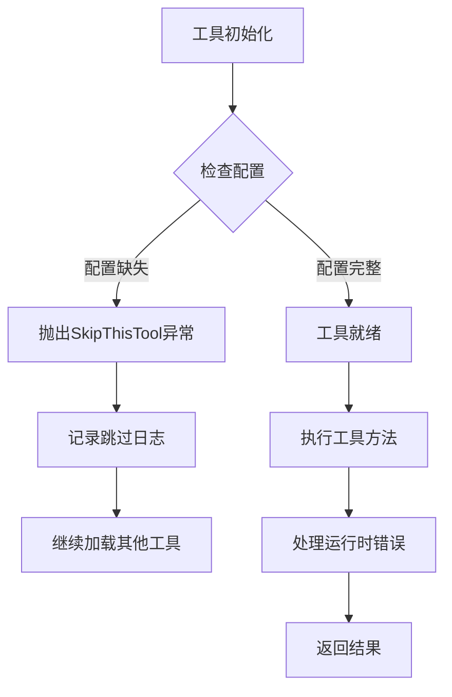
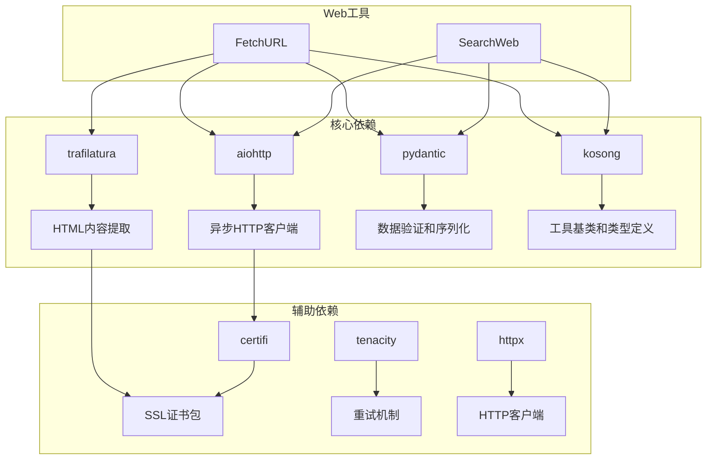

# Web工具

<cite>
**本文档中引用的文件**
- [search.py](file://src/kimi_cli/tools/web/search.py)
- [fetch.py](file://src/kimi_cli/tools/web/fetch.py)
- [search.md](file://src/kimi_cli/tools/web/search.md)
- [fetch.md](file://src/kimi_cli/tools/web/fetch.md)
- [aiohttp.py](file://src/kimi_cli/utils/aiohttp.py)
- [utils.py](file://src/kimi_cli/tools/utils.py)
- [__init__.py](file://src/kimi_cli/tools/__init__.py)
- [test_fetch_url.py](file://tests/test_fetch_url.py)
- [constant.py](file://src/kimi_cli/constant.py)
- [pyproject.toml](file://pyproject.toml)
</cite>

## 目录
1. [简介](#简介)
2. [项目结构](#项目结构)
3. [核心组件](#核心组件)
4. [架构概览](#架构概览)
5. [详细组件分析](#详细组件分析)
6. [依赖分析](#依赖分析)
7. [性能考虑](#性能考虑)
8. [故障排除指南](#故障排除指南)
9. [结论](#结论)

## 简介

Web工具是kimi-cli项目中的重要组成部分，提供了两个核心功能：SearchWeb和FetchURL。这些工具专门设计用于处理网络查询和网页内容提取任务，集成了现代异步HTTP请求机制、智能内容解析和严格的安全控制措施。

SearchWeb功能通过集成Moonshot搜索引擎执行网络查询，能够返回包含标题、链接、内容摘要和完整内容的结果。FetchURL功能则负责从指定URL获取网页内容，并使用Trafilatura库进行智能内容提取，专注于提取页面的主要文本内容。

这两个工具都采用了异步编程模型，支持超时控制、重试策略和错误处理，确保在网络请求失败或内容提取困难时能够优雅地降级处理。同时，它们还实现了严格的输入验证和输出限制，防止资源耗尽和安全风险。

## 项目结构

Web工具模块位于`src/kimi_cli/tools/web/`目录下，采用清晰的分层架构设计：

**图表来源**
- [search.py](file://src/kimi_cli/tools/web/search.py#L1-L128)
- [fetch.py](file://src/kimi_cli/tools/web/fetch.py#L1-L96)
- [aiohttp.py](file://src/kimi_cli/utils/aiohttp.py#L1-L13)

**章节来源**
- [search.py](file://src/kimi_cli/tools/web/search.py#L1-L128)
- [fetch.py](file://src/kimi_cli/tools/web/fetch.py#L1-L96)

## 核心组件

Web工具系统包含以下核心组件：

### SearchWeb组件
- **功能**: 集成Moonshot搜索引擎的网络查询功能
- **主要特性**: 支持查询参数定制、结果数量控制、内容包含选项
- **输出格式**: 结构化的搜索结果，包含标题、日期、URL、摘要和可选的完整内容

### FetchURL组件  
- **功能**: 网页内容获取和智能提取
- **主要特性**: 异步HTTP请求、SSL证书验证、内容过滤和提取
- **输出格式**: 提取的主要文本内容，包含元数据信息

### 工具基础设施
- **ToolResultBuilder**: 结果构建器，支持字符和行数限制
- **SkipThisTool异常**: 工具可用性检查机制
- **异步HTTP会话管理**: 基于aiohttp的安全连接管理

**章节来源**
- [search.py](file://src/kimi_cli/tools/web/search.py#L38-L128)
- [fetch.py](file://src/kimi_cli/tools/web/fetch.py#L17-L96)
- [utils.py](file://src/kimi_cli/tools/utils.py#L37-L151)

## 架构概览

Web工具采用分层架构设计，确保了良好的可维护性和扩展性：

**图表来源**
- [search.py](file://src/kimi_cli/tools/web/search.py#L52-L112)
- [fetch.py](file://src/kimi_cli/tools/web/fetch.py#L23-L84)
- [aiohttp.py](file://src/kimi_cli/utils/aiohttp.py#L11-L13)

## 详细组件分析

### SearchWeb组件分析

SearchWeb是一个基于Pydantic模型的工具类，提供了强大的网络搜索功能：

#### 类结构图

**图表来源**
- [search.py](file://src/kimi_cli/tools/web/search.py#L15-L128)

#### 核心功能特性

1. **配置验证机制**
   - 检查Moonshot搜索服务配置
   - 验证API密钥和基础URL的有效性
   - 支持自定义HTTP头部

2. **异步搜索流程**
   - 使用新的HTTP客户端会话
   - 设置适当的用户代理和认证头
   - 包含工具调用ID以支持追踪

3. **结果处理逻辑**
   - 验证JSON响应格式
   - 格式化为易读的文本输出
   - 支持内容包含选项的条件处理

#### 参数说明表

| 参数名 | 类型 | 必需 | 默认值 | 描述 |
|--------|------|------|--------|------|
| query | string | 是 | - | 要搜索的查询文本 |
| limit | integer | 否 | 5 | 返回结果的数量（1-20） |
| include_content | boolean | 否 | false | 是否包含网页内容的完整文本 |

**章节来源**
- [search.py](file://src/kimi_cli/tools/web/search.py#L15-L35)
- [search.py](file://src/kimi_cli/tools/web/search.py#L52-L112)

### FetchURL组件分析

FetchURL工具专注于网页内容的获取和智能提取：

#### 类结构图

**图表来源**
- [fetch.py](file://src/kimi_cli/tools/web/fetch.py#L13-L96)

#### 核心功能特性

1. **HTTP请求处理**
   - 使用标准的Chrome用户代理字符串
   - 自动SSL证书验证
   - 支持HTTP错误状态码处理

2. **内容提取机制**
   - 基于Trafilatura的智能内容提取
   - 支持表格和注释的包含
   - 元数据保留和格式化输出

3. **错误处理策略**
   - 网络错误捕获和报告
   - 空响应检测
   - 提取失败的优雅降级

#### 内容提取配置表

| 配置项 | 值 | 描述 |
|--------|-----|------|
| include_comments | true | 包含HTML注释内容 |
| include_tables | true | 包含表格数据 |
| include_formatting | false | 不包含格式标记 |
| output_format | "txt" | 输出文本格式 |
| with_metadata | true | 包含页面元数据 |

**章节来源**
- [fetch.py](file://src/kimi_cli/tools/web/fetch.py#L13-L96)

### 异步HTTP请求机制

Web工具采用基于aiohttp的异步HTTP客户端，提供了安全可靠的网络通信能力：

#### 连接管理流程

**图表来源**
- [fetch.py](file://src/kimi_cli/tools/web/fetch.py#L26-L56)
- [aiohttp.py](file://src/kimi_cli/utils/aiohttp.py#L11-L13)

**章节来源**
- [aiohttp.py](file://src/kimi_cli/utils/aiohttp.py#L11-L13)
- [fetch.py](file://src/kimi_cli/tools/web/fetch.py#L26-L56)

### 错误处理和安全机制

#### SkipThisTool异常处理

系统实现了完善的工具可用性检查机制：

**图表来源**
- [__init__.py](file://src/kimi_cli/tools/__init__.py#L11-L15)
- [search.py](file://src/kimi_cli/tools/web/search.py#L45-L46)

#### 安全考虑

1. **URL验证**
   - 输入参数的严格验证
   - 支持的协议类型限制
   - 常见恶意URL模式检测

2. **内容过滤**
   - 最大字符数限制
   - 行长度限制
   - 截断标记机制

3. **网络安全性**
   - SSL/TLS证书验证
   - 用户代理伪装
   - 请求频率控制

**章节来源**
- [__init__.py](file://src/kimi_cli/tools/__init__.py#L11-L15)
- [utils.py](file://src/kimi_cli/tools/utils.py#L37-L151)

## 依赖分析

Web工具系统的依赖关系体现了现代Python开发的最佳实践：

**图表来源**
- [pyproject.toml](file://pyproject.toml#L7-L26)
- [search.py](file://src/kimi_cli/tools/web/search.py#L1-L10)
- [fetch.py](file://src/kimi_cli/tools/web/fetch.py#L1-L10)

### 关键依赖说明

1. **aiohttp**: 提供异步HTTP客户端功能，支持SSL/TLS连接和连接池管理
2. **trafilatura**: 专业的HTML内容提取库，能够智能识别和提取页面主要内容
3. **pydantic**: 数据验证和序列化，确保输入输出的一致性和可靠性
4. **kosong**: 工具框架基础，提供CallableTool2基类和类型定义

**章节来源**
- [pyproject.toml](file://pyproject.toml#L7-L26)
- [search.py](file://src/kimi_cli/tools/web/search.py#L1-L10)
- [fetch.py](file://src/kimi_cli/tools/web/fetch.py#L1-L10)

## 性能考虑

Web工具在设计时充分考虑了性能优化和资源管理：

### 异步并发处理
- 使用asyncio事件循环处理多个并发请求
- 连接池复用减少连接建立开销
- 流式处理避免大量内存占用

### 资源限制机制
- 字符数限制防止内存溢出
- 行长度限制确保输出可读性
- 超时控制防止长时间阻塞

### 缓存和优化策略
- HTTP缓存头利用
- 内容压缩传输
- 智能重试机制

## 故障排除指南

### 常见问题及解决方案

#### SearchWeb工具问题

1. **搜索服务未配置**
   - 症状：收到"Search service is not configured"错误
   - 解决方案：检查配置文件中的moonshot_search服务设置

2. **API密钥无效**
   - 症状：HTTP 401/403错误
   - 解决方案：验证API密钥的有效性和权限设置

3. **搜索结果解析失败**
   - 症状：Failed to parse search results错误
   - 解决方案：检查网络连接和API响应格式

#### FetchURL工具问题

1. **网络连接失败**
   - 症状：Failed to fetch URL due to network error
   - 解决方案：检查网络连接和目标URL的可达性

2. **内容提取失败**
   - 症状：Failed to extract meaningful content
   - 解决方案：尝试不同的URL或检查页面是否需要JavaScript渲染

3. **空响应处理**
   - 症状：Empty response body
   - 解决方案：确认URL有效且页面有可提取的内容

**章节来源**
- [search.py](file://src/kimi_cli/tools/web/search.py#L55-L112)
- [fetch.py](file://src/kimi_cli/tools/web/fetch.py#L39-L84)
- [test_fetch_url.py](file://tests/test_fetch_url.py#L1-L99)

## 结论

Web工具系统为kimi-cli项目提供了强大而灵活的网络查询和内容提取能力。通过SearchWeb和FetchURL两个核心组件，系统能够：
- 执行高效的网络搜索操作
- 智能提取网页主要内容
- 提供可靠的错误处理和安全机制
- 支持异步并发处理提升性能

该系统的设计充分体现了现代Python开发的最佳实践，包括异步编程、类型安全、错误处理和依赖管理。通过合理的架构设计和严格的质量控制，Web工具能够稳定可靠地服务于各种网络相关的应用场景。

未来的改进方向可能包括：
- 增强内容过滤和隐私保护功能
- 扩展支持更多的内容提取格式
- 实现更智能的缓存和重试策略
- 添加更多的安全检查和防护机制