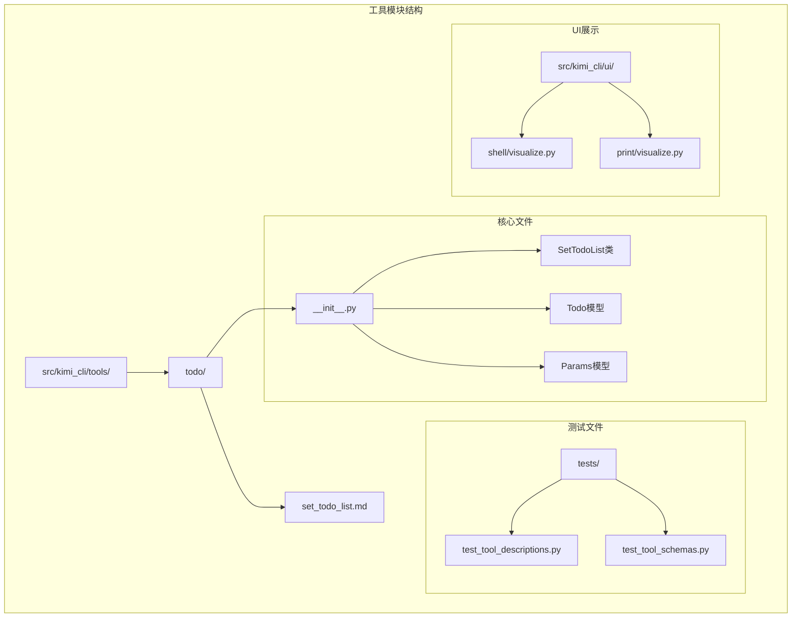
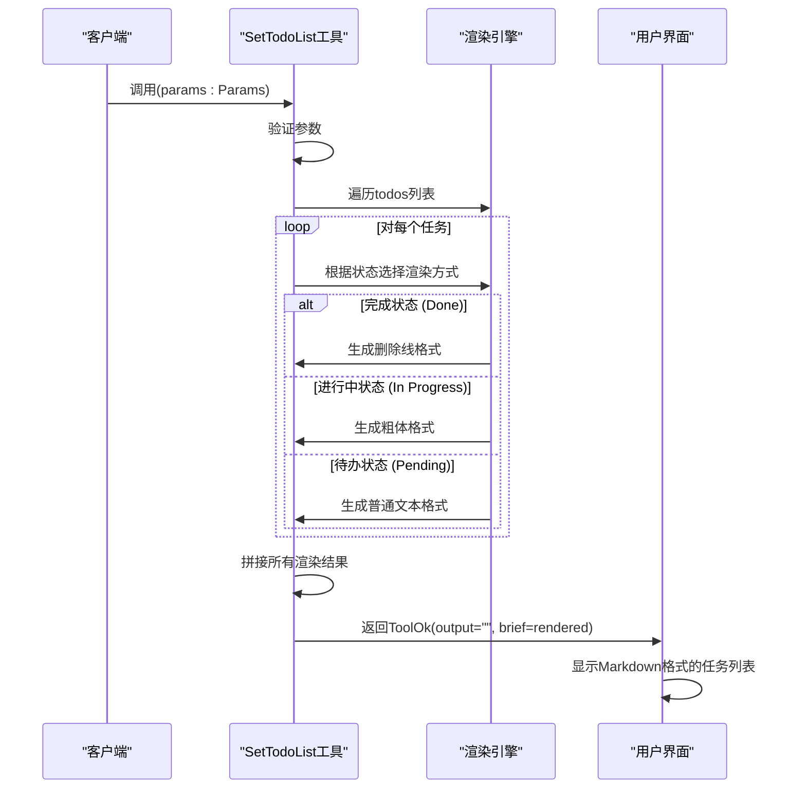
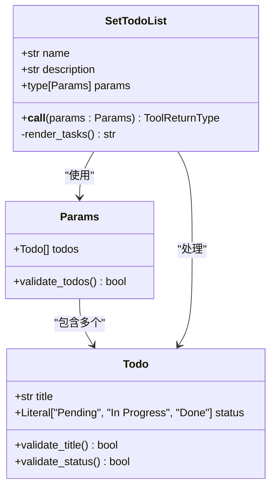
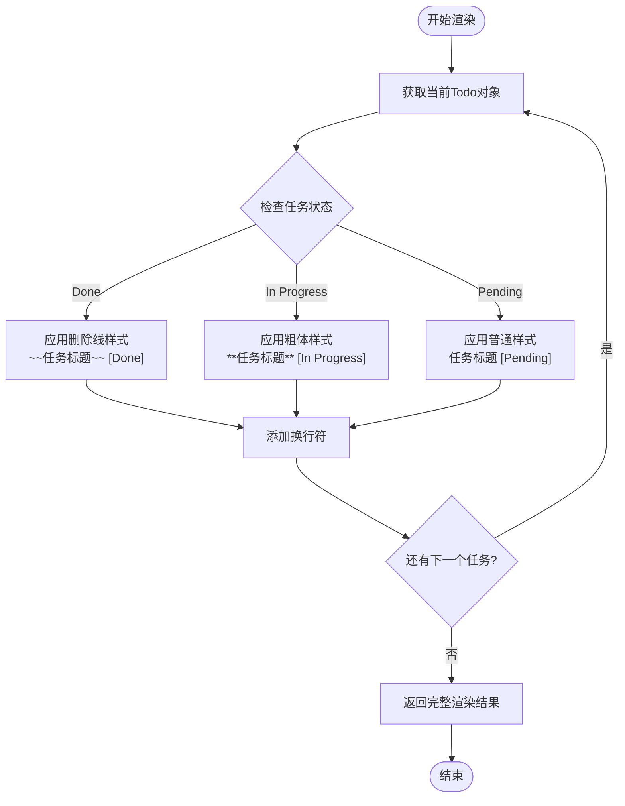
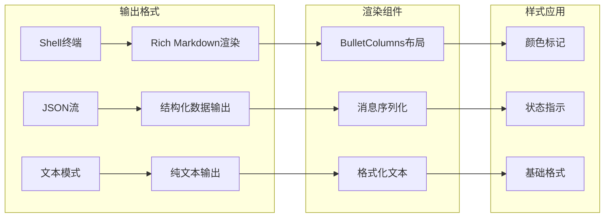
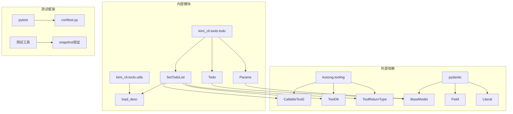

# SetTodoList工具详细文档

<cite>
**本文档引用的文件**
- [src/kimi_cli/tools/todo/__init__.py](file://src/kimi_cli/tools/todo/__init__.py)
- [src/kimi_cli/tools/todo/set_todo_list.md](file://src/kimi_cli/tools/todo/set_todo_list.md)
- [src/kimi_cli/tools/CLAUDE.md](file://src/kimi_cli/tools/CLAUDE.md)
- [tests/test_tool_descriptions.py](file://tests/test_tool_descriptions.py)
- [tests/test_tool_schemas.py](file://tests/test_tool_schemas.py)
- [src/kimi_cli/ui/shell/visualize.py](file://src/kimi_cli/ui/shell/visualize.py)
- [src/kimi_cli/ui/print/visualize.py](file://src/kimi_cli/ui/print/visualize.py)
</cite>

## 目录
1. [简介](#简介)
2. [项目结构](#项目结构)
3. [核心组件](#核心组件)
4. [架构概览](#架构概览)
5. [详细组件分析](#详细组件分析)
6. [依赖关系分析](#依赖关系分析)
7. [性能考虑](#性能考虑)
8. [故障排除指南](#故障排除指南)
9. [结论](#结论)

## 简介

SetTodoList工具是Kimi CLI任务管理系统中的核心可视化管理器，专门负责任务进度的Markdown格式化显示。该工具通过智能的状态渲染机制，为用户提供直观的任务状态可视化，支持三种标准状态：'Pending'（待办）、'In Progress'（进行中）和'Done'（已完成）。

该工具的独特之处在于其不返回传统意义上的输出内容，而是通过`brief`字段传递经过Markdown语法处理的渲染结果，专为UI展示而设计，实现了任务状态与视觉呈现的完美结合。

## 项目结构

SetTodoList工具位于Kimi CLI项目的工具模块中，采用清晰的分层架构设计：

**图表来源**
- [src/kimi_cli/tools/todo/__init__.py](file://src/kimi_cli/tools/todo/__init__.py#L1-L36)
- [src/kimi_cli/tools/todo/set_todo_list.md](file://src/kimi_cli/tools/todo/set_todo_list.md#L1-L16)

**章节来源**
- [src/kimi_cli/tools/todo/__init__.py](file://src/kimi_cli/tools/todo/__init__.py#L1-L36)

## 核心组件

SetTodoList工具由三个核心数据模型组成，每个模型都有明确的职责和约束：

### Todo数据模型
Todo模型定义了单个任务的基本结构，包含两个关键字段：
- **title**: 任务标题，必须为非空字符串
- **status**: 任务状态，严格限定为三个枚举值之一

### Params模型
Params模型作为工具参数容器，包含一个todos列表，用于接收完整的待办事项更新集合。该设计确保每次调用都处理整个任务列表，符合工具的设计原则。

### SetTodoList类
SetTodoList类继承自CallableTool2基类，实现了异步调用接口，负责处理任务列表并生成格式化的Markdown输出。

**章节来源**
- [src/kimi_cli/tools/todo/__init__.py](file://src/kimi_cli/tools/todo/__init__.py#L10-L17)

## 架构概览

SetTodoList工具采用简洁而高效的架构设计，遵循单一职责原则：

**图表来源**
- [src/kimi_cli/tools/todo/__init__.py](file://src/kimi_cli/tools/todo/__init__.py#L24-L35)

## 详细组件分析

### Todo数据模型深度解析

Todo模型采用了Pydantic的强类型验证机制，确保数据的完整性和一致性：

**图表来源**
- [src/kimi_cli/tools/todo/__init__.py](file://src/kimi_cli/tools/todo/__init__.py#L10-L17)

#### 字段验证机制

Todo模型的字段验证遵循严格的约束条件：

| 字段 | 类型 | 约束 | 验证规则 |
|------|------|------|----------|
| title | str | 非空字符串 | min_length=1 |
| status | Literal | 枚举类型 | 必须为"Pending"、"In Progress"或"Done" |

这种设计确保了数据的有效性，防止无效状态的产生。

**章节来源**
- [src/kimi_cli/tools/todo/__init__.py](file://src/kimi_cli/tools/todo/__init__.py#L10-L12)

### 渲染逻辑详解

SetTodoList的核心渲染逻辑基于Python的match-case语句，实现了智能的状态映射：

**图表来源**
- [src/kimi_cli/tools/todo/__init__.py](file://src/kimi_cli/tools/todo/__init__.py#L26-L34)

#### Markdown样式映射表

| 状态 | Markdown语法 | 视觉效果 | 应用场景 |
|------|-------------|----------|----------|
| Done | `~~任务~~` | ~~任务~~ | 已完成的任务 |
| In Progress | `**任务**` | **任务** | 正在进行的任务 |
| Pending | `任务` | 任务 | 待办任务 |

这种样式映射确保了在支持Markdown的环境中能够正确渲染视觉效果。

**章节来源**
- [src/kimi_cli/tools/todo/__init__.py](file://src/kimi_cli/tools/todo/__init__.py#L28-L34)

### UI展示集成

SetTodoList的输出通过专门的UI可视化组件进行展示，支持多种输出格式：

**图表来源**
- [src/kimi_cli/ui/shell/visualize.py](file://src/kimi_cli/ui/shell/visualize.py#L188-L193)
- [src/kimi_cli/ui/print/visualize.py](file://src/kimi_cli/ui/print/visualize.py#L101-L106)

**章节来源**
- [src/kimi_cli/ui/shell/visualize.py](file://src/kimi_cli/ui/shell/visualize.py#L188-L193)

## 依赖关系分析

SetTodoList工具的依赖关系体现了清晰的分层架构：

**图表来源**
- [src/kimi_cli/tools/todo/__init__.py](file://src/kimi_cli/tools/todo/__init__.py#L1-L9)

### 关键依赖说明

| 依赖项 | 版本要求 | 用途 | 影响范围 |
|--------|----------|------|----------|
| kosong.tooling | 最新稳定版 | 提供工具基类和类型定义 | 整个工具链 |
| pydantic | 2.x系列 | 数据验证和序列化 | Todo和Params模型 |
| rich | 最新稳定版 | 终端渲染和样式支持 | UI展示组件 |

**章节来源**
- [src/kimi_cli/tools/todo/__init__.py](file://src/kimi_cli/tools/todo/__init__.py#L1-L9)

## 性能考虑

SetTodoList工具在设计时充分考虑了性能优化：

### 渲染性能
- **O(n)复杂度**: 渲染算法的时间复杂度为线性，与任务数量成正比
- **内存友好**: 使用字符串拼接而非列表存储，减少内存占用
- **即时渲染**: 不缓存中间结果，直接生成最终输出

### 并发处理
- **异步设计**: 支持并发调用，适合高负载场景
- **无状态设计**: 每次调用都是独立的，避免状态污染

### 输出优化
- **零输出策略**: 主要输出通过`brief`字段，减少不必要的数据传输
- **格式化压缩**: 使用紧凑的Markdown格式，减少传输体积

## 故障排除指南

### 常见问题及解决方案

#### 参数验证失败
**症状**: 工具调用返回验证错误
**原因**: Todo对象的title为空或status不在允许范围内
**解决方案**: 确保title非空且status为"Pending"、"In Progress"或"Done"之一

#### 渲染输出异常
**症状**: 生成的Markdown格式不正确
**原因**: UI组件未正确处理brief字段
**解决方案**: 检查UI渲染组件是否支持Markdown语法

#### 性能问题
**症状**: 大量任务时渲染缓慢
**原因**: 一次性处理过多任务
**解决方案**: 分批处理任务，避免超过合理数量限制

**章节来源**
- [tests/test_tool_schemas.py](file://tests/test_tool_schemas.py#L80-L112)

## 结论

SetTodoList工具作为Kimi CLI任务管理系统的核心组件，成功实现了任务进度可视化管理的目标。其设计体现了以下优势：

### 技术优势
- **类型安全**: 基于Pydantic的强类型验证，确保数据完整性
- **渲染智能**: 自动根据任务状态应用相应的Markdown样式
- **性能高效**: 线性复杂度的渲染算法，适合大规模任务处理
- **扩展性强**: 清晰的架构设计便于功能扩展

### 应用价值
- **项目管理**: 支持复杂的多步骤开发任务进度跟踪
- **团队协作**: 提供标准化的任务状态可视化方案
- **用户体验**: 通过视觉样式增强任务识别和状态感知
- **系统集成**: 与Kimi CLI的其他工具无缝集成

该工具在跟踪多步骤开发任务进度方面具有重要价值，为开发者提供了直观、高效的项目管理解决方案。其简洁而强大的设计理念，使其成为现代软件开发工具链中的重要组成部分。