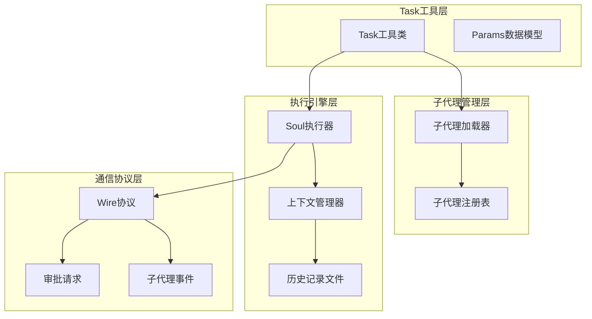
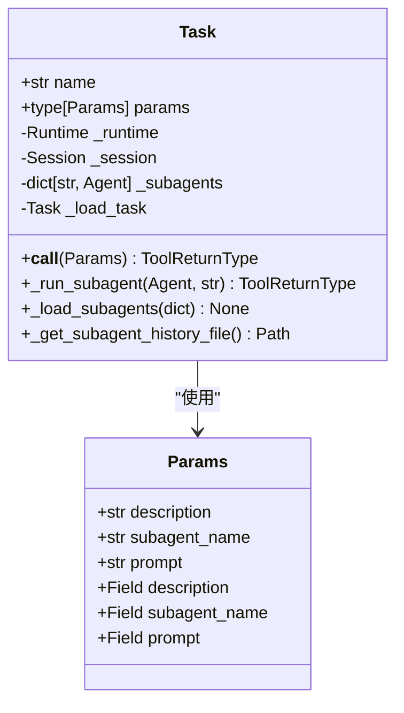
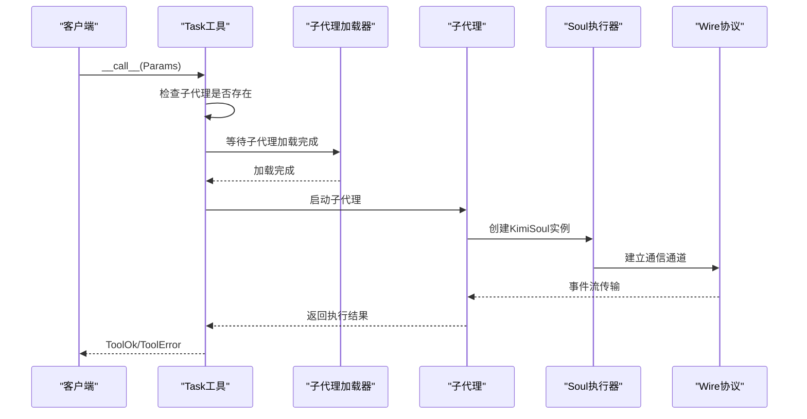
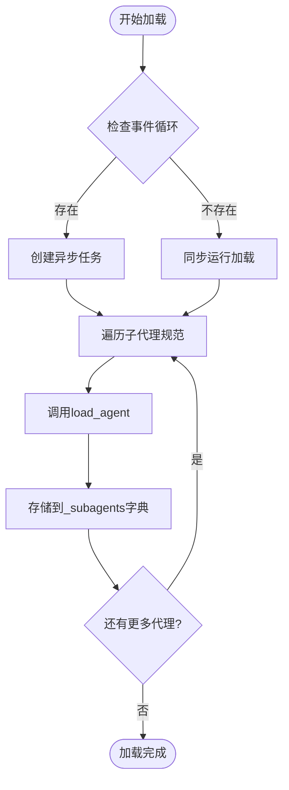
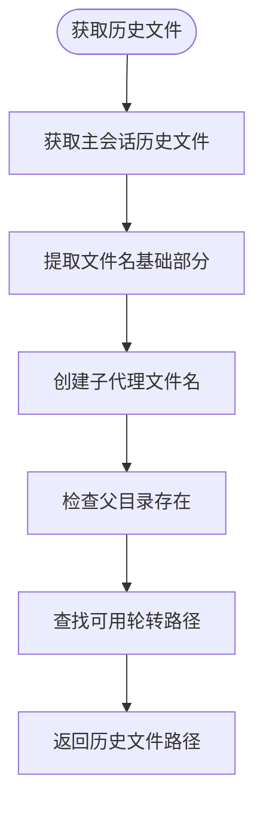
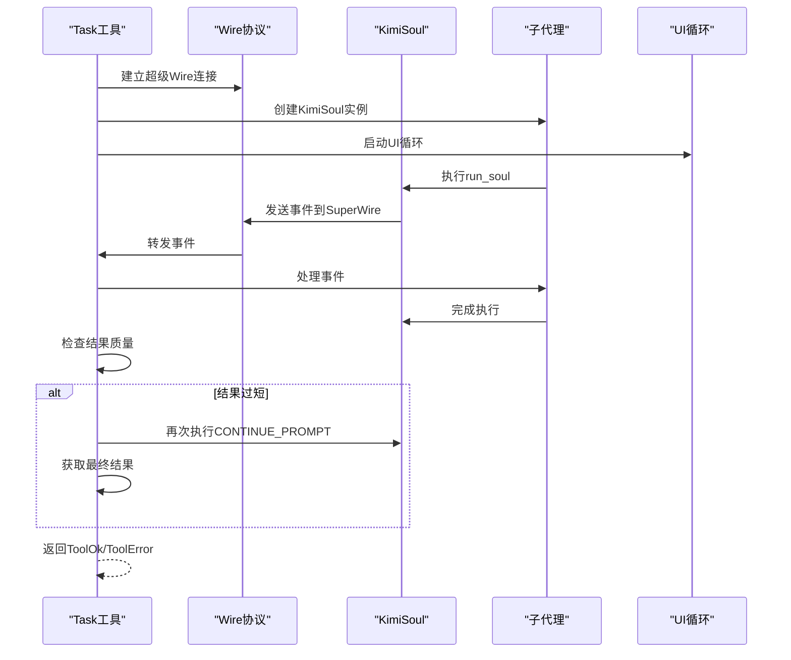
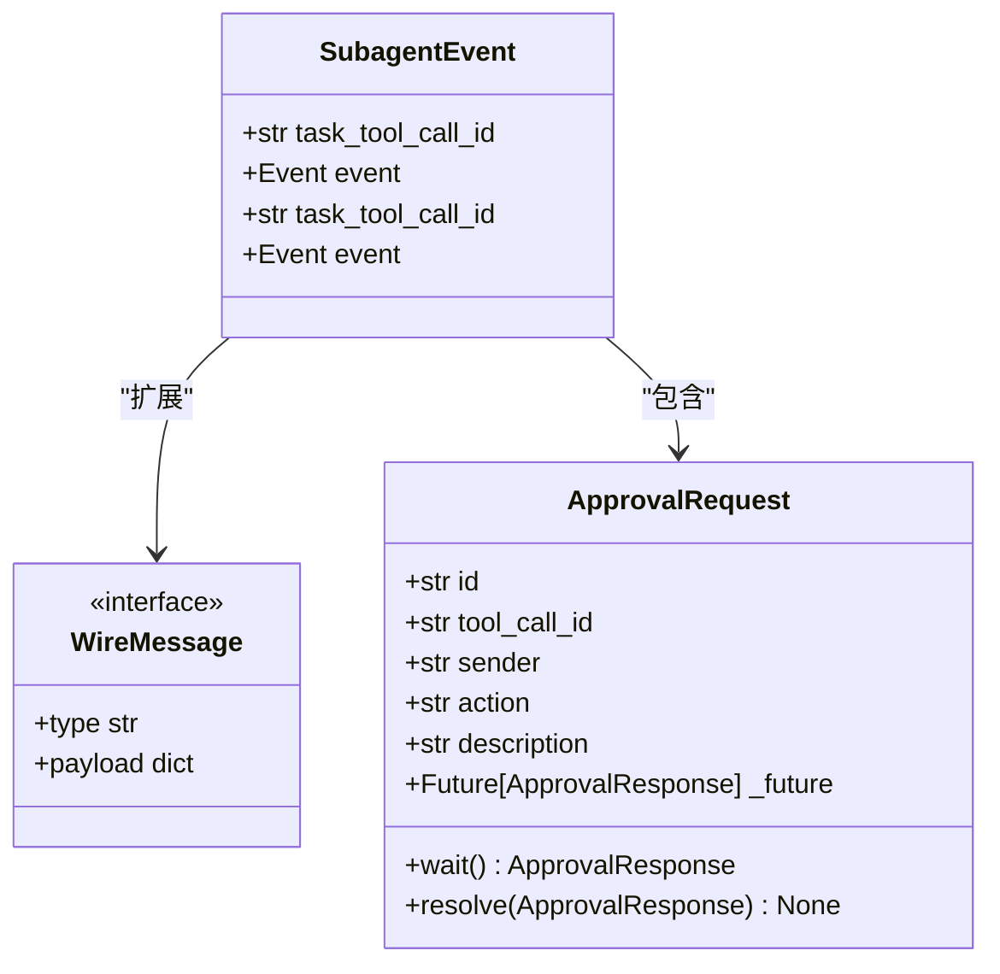
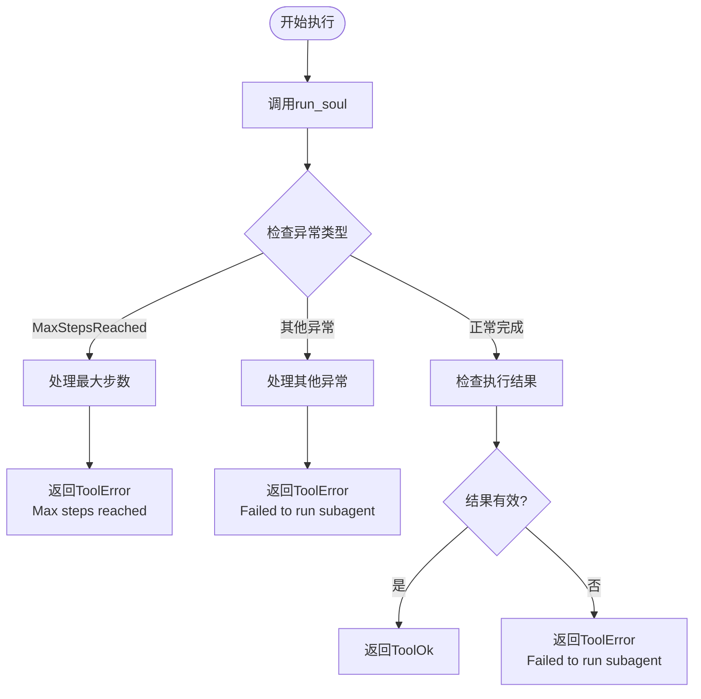

# Task工具详细文档

<cite>
**本文档中引用的文件**
- [src/kimi_cli/tools/task/__init__.py](file://src/kimi_cli/tools/task/__init__.py)
- [src/kimi_cli/tools/task/task.md](file://src/kimi_cli/tools/task/task.md)
- [src/kimi_cli/soul/toolset.py](file://src/kimi_cli/soul/toolset.py)
- [src/kimi_cli/session.py](file://src/kimi_cli/session.py)
- [src/kimi_cli/soul/agent.py](file://src/kimi_cli/soul/agent.py)
- [src/kimi_cli/soul/runtime.py](file://src/kimi_cli/soul/runtime.py)
- [src/kimi_cli/wire/message.py](file://src/kimi_cli/wire/message.py)
- [src/kimi_cli/soul/context.py](file://src/kimi_cli/soul/context.py)
- [src/kimi_cli/agents/default/sub.yaml](file://src/kimi_cli/agents/default/sub.yaml)
- [tests/test_task_subagents.py](file://tests/test_task_subagents.py)
</cite>

## 目录
1. [简介](#简介)
2. [核心架构概述](#核心架构概述)
3. [Params数据模型详解](#params数据模型详解)
4. [Task工具类深度分析](#task工具类深度分析)
5. [子代理加载机制](#子代理加载机制)
6. [会话隔离与历史记录管理](#会话隔离与历史记录管理)
7. [子代理生命周期管理](#子代理生命周期管理)
8. [Wire协议集成](#wire协议集成)
9. [错误处理与容错机制](#错误处理与容错机制)
10. [使用示例与最佳实践](#使用示例与最佳实践)
11. [总结](#总结)

## 简介

Task工具是Kimia CLI系统中的核心子任务执行引擎，专门设计用于启动专用子代理来处理复杂任务。该工具通过`_run_subagent`方法实现任务的分解与隔离执行，确保主代理能够保持上下文的简洁性和专注性。

Task工具的核心价值在于：
- **上下文隔离**：为每个子任务创建独立的执行环境
- **并行多任务处理**：支持同时运行多个独立的子任务
- **专业化分工**：利用专门的子代理处理特定类型的复杂任务
- **结果聚合**：将子代理的执行结果汇总返回给主代理

## 核心架构概述

Task工具采用分层架构设计，包含以下关键组件：



**图表来源**
- [src/kimi_cli/tools/task/__init__.py](file://src/kimi_cli/tools/task/__init__.py#L49-L176)
- [src/kimi_cli/soul/toolset.py](file://src/kimi_cli/soul/toolset.py#L13-L29)
- [src/kimi_cli/wire/message.py](file://src/kimi_cli/wire/message.py#L57-L62)

## Params数据模型详解

Params数据模型定义了Task工具的输入参数结构，包含三个核心字段：

### description字段
- **类型**: `str`
- **描述**: 任务的简短描述（3-5个词）
- **用途**: 提供任务的快速识别标签
- **验证**: 字符串长度限制确保描述的简洁性

### subagent_name字段  
- **类型**: `str`
- **描述**: 要使用的专门子代理名称
- **用途**: 指定负责执行任务的具体子代理
- **验证**: 必须存在于已注册的子代理列表中

### prompt字段
- **类型**: `str`
- **描述**: 子代理需要执行的任务详细说明
- **用途**: 向子代理提供完整背景信息和具体要求
- **重要性**: 子代理无法访问主代理的上下文，必须提供所有必要信息



**图表来源**
- [src/kimi_cli/tools/task/__init__.py](file://src/kimi_cli/tools/task/__init__.py#L35-L46)
- [src/kimi_cli/tools/task/__init__.py](file://src/kimi_cli/tools/task/__init__.py#L49-L176)

**章节来源**
- [src/kimi_cli/tools/task/__init__.py](file://src/kimi_cli/tools/task/__init__.py#L35-L46)

## Task工具类深度分析

Task工具类继承自`CallableTool2`，实现了完整的工具调用接口和生命周期管理。

### 初始化过程

Task工具的初始化包含以下关键步骤：

1. **描述加载**: 从Markdown文件动态加载工具描述
2. **依赖注入**: 注入运行时环境和会话信息
3. **异步加载**: 创建子代理加载任务
4. **状态管理**: 维护子代理注册表和加载状态

### 工具调用流程



**图表来源**
- [src/kimi_cli/tools/task/__init__.py](file://src/kimi_cli/tools/task/__init__.py#L96-L116)
- [src/kimi_cli/tools/task/__init__.py](file://src/kimi_cli/tools/task/__init__.py#L117-L176)

**章节来源**
- [src/kimi_cli/tools/task/__init__.py](file://src/kimi_cli/tools/task/__init__.py#L49-L116)

## 子代理加载机制

### _load_subagents方法

子代理加载机制通过异步方式批量加载所有预定义的子代理：



**图表来源**
- [src/kimi_cli/tools/task/__init__.py](file://src/kimi_cli/tools/task/__init__.py#L79-L84)
- [src/kimi_cli/soul/agent.py](file://src/kimi_cli/soul/agent.py#L32-L80)

### 子代理配置

子代理通过YAML配置文件定义，支持以下特性：

- **继承机制**: 可以继承基础代理的配置
- **角色定制**: 通过`ROLE_ADDITIONAL`参数定制子代理行为
- **工具排除**: 排除不合适的工具以避免循环调用
- **无子代理嵌套**: 防止子代理内部再次调用Task工具

**章节来源**
- [src/kimi_cli/tools/task/__init__.py](file://src/kimi_cli/tools/task/__init__.py#L79-L84)
- [src/kimi_cli/soul/agent.py](file://src/kimi_cli/soul/agent.py#L32-L80)
- [src/kimi_cli/agents/default/sub.yaml](file://src/kimi_cli/agents/default/sub.yaml#L1-L12)

## 会话隔离与历史记录管理

### 独立历史记录文件

Task工具通过`_get_subagent_history_file`方法为每个子代理生成独立的历史记录文件，实现严格的会话隔离：



**图表来源**
- [src/kimi_cli/tools/task/__init__.py](file://src/kimi_cli/tools/task/__init__.py#L85-L94)

### 上下文隔离机制

每个子代理拥有独立的上下文管理器，确保：

- **历史记录隔离**: 子代理的历史不会影响主代理
- **Token计数独立**: 各自维护独立的Token使用统计
- **检查点独立**: 支持各自独立的上下文压缩和恢复

**章节来源**
- [src/kimi_cli/tools/task/__init__.py](file://src/kimi_cli/tools/task/__init__.py#L85-L94)
- [src/kimi_cli/soul/context.py](file://src/kimi_cli/soul/context.py#L16-L145)

## 子代理生命周期管理

### _run_subagent方法详解

子代理生命周期管理通过`_run_subagent`方法实现，包含完整的执行流程：



**图表来源**
- [src/kimi_cli/tools/task/__init__.py](file://src/kimi_cli/tools/task/__init__.py#L117-L176)

### 结果质量控制

Task工具实现了智能的结果质量控制机制：

1. **长度检查**: 检查最终响应长度是否小于200字符
2. **重试机制**: 最多重试一次，使用`CONTINUE_PROMPT`提示
3. **有效性验证**: 确保上下文历史记录有效且来自助手角色

### 错误处理策略

- **最大步数限制**: 当达到最大执行步数时抛出`MaxStepsReached`异常
- **执行失败检测**: 检查上下文历史记录的有效性
- **异常包装**: 将各种异常转换为标准化的`ToolError`格式

**章节来源**
- [src/kimi_cli/tools/task/__init__.py](file://src/kimi_cli/tools/task/__init__.py#L117-L176)

## Wire协议集成

### SubagentEvent事件传递

Task工具通过`SubagentEvent`实现与Wire协议的深度集成：



**图表来源**
- [src/kimi_cli/wire/message.py](file://src/kimi_cli/wire/message.py#L57-L62)
- [src/kimi_cli/wire/message.py](file://src/kimi_cli/wire/message.py#L76-L107)

### 事件路由机制

Task工具实现了智能的事件路由：

1. **审批请求转发**: 直接发送到超级Wire的Soul侧
2. **其他事件封装**: 包装为`SubagentEvent`并通过超级Wire发送
3. **工具调用标识**: 使用当前工具调用ID进行事件关联

**章节来源**
- [src/kimi_cli/tools/task/__init__.py](file://src/kimi_cli/tools/task/__init__.py#L125-L140)
- [src/kimi_cli/wire/message.py](file://src/kimi_cli/wire/message.py#L57-L62)

## 错误处理与容错机制

### 最大步数限制

Task工具集成了完善的错误处理机制：



**图表来源**
- [src/kimi_cli/tools/task/__init__.py](file://src/kimi_cli/tools/task/__init__.py#L146-L154)

### 容错策略

1. **异步加载保护**: 在事件循环不存在时使用同步加载
2. **子代理验证**: 确保指定的子代理确实存在
3. **执行结果验证**: 检查子代理的输出质量和完整性
4. **异常透明化**: 将底层异常转换为用户友好的错误消息

**章节来源**
- [src/kimi_cli/tools/task/__init__.py](file://src/kimi_cli/tools/task/__init__.py#L71-L77)
- [src/kimi_cli/tools/task/__init__.py](file://src/kimi_cli/tools/task/__init__.py#L102-L116)

## 使用示例与最佳实践

### 基本使用模式

Task工具的最佳使用场景包括：

1. **代码修复**: 当主代理遇到编译错误时，启动专门的修复子代理
2. **知识搜索**: 需要最新技术信息时，启动网络搜索子代理
3. **并行任务**: 多个独立任务可以同时启动多个子代理执行

### 配置示例

```yaml
# Agent配置示例
tools:
  - "kimi_cli.tools.task:Task"
  - "kimi_cli.tools.web:SearchWeb"
  - "kimi_cli.tools.file:ReadFile"

subagents:
  code_fixer:
    path: "./agents/code_fixer.yaml"
    description: "专门用于代码修复的子代理"
  research_agent:
    path: "./agents/research_agent.yaml"
    description: "专门用于信息研究的子代理"
```

### 错误处理最佳实践

1. **合理设置最大步数**: 根据任务复杂度调整最大执行步数
2. **提供详细提示**: 在prompt中包含所有必要的背景信息
3. **监控子代理状态**: 通过Wire协议监控子代理的执行状态
4. **实现重试机制**: 对于可重试的任务实现适当的重试逻辑

### 结果续写机制

当子代理返回的结果过于简短时，Task工具会自动触发续写机制：

- **触发条件**: 响应长度小于200字符且有重试机会
- **续写提示**: 使用预定义的`CONTINUE_PROMPT`模板
- **质量保证**: 确保最终结果包含足够的技术细节和完整信息

**章节来源**
- [src/kimi_cli/tools/task/__init__.py](file://src/kimi_cli/tools/task/__init__.py#L25-L32)
- [src/kimi_cli/tools/task/__init__.py](file://src/kimi_cli/tools/task/__init__.py#L166-L174)

## 总结

Task工具作为Kimia CLI系统的核心组件，通过以下关键特性实现了高效的子任务执行：

### 核心优势

1. **严格的上下文隔离**: 每个子代理拥有独立的历史记录和Token统计
2. **灵活的子代理管理**: 支持动态加载和配置多种专业化的子代理
3. **完善的通信协议**: 通过Wire协议实现事件的透明传递和状态同步
4. **智能的质量控制**: 自动检测和优化子代理的输出质量
5. **健壮的错误处理**: 提供多层次的异常处理和容错机制

### 技术创新

- **异步加载机制**: 支持非阻塞的子代理初始化
- **会话隔离设计**: 确保主代理和子代理之间的完全独立性
- **事件驱动架构**: 通过Wire协议实现松耦合的组件通信
- **结果质量保证**: 智能的输出验证和续写机制

### 应用价值

Task工具显著提升了AI代理系统的执行效率和可靠性，使复杂的多任务处理成为可能，同时保持了系统的可维护性和可扩展性。通过专业化的子代理分工，系统能够在保持主代理简洁性的同时，处理各种复杂的子任务需求。