# 任务管理工具

<cite>
**本文档中引用的文件**
- [task.md](file://src/kimi_cli/tools/task/task.md)
- [set_todo_list.md](file://src/kimi_cli/tools/todo/set_todo_list.md)
- [task/__init__.py](file://src/kimi_cli/tools/task/__init__.py)
- [todo/__init__.py](file://src/kimi_cli/tools/todo/__init__.py)
- [CLAUDE.md](file://src/kimi_cli/tools/CLAUDE.md)
- [context.py](file://src/kimi_cli/soul/context.py)
- [session.py](file://src/kimi_cli/session.py)
- [test_tool_descriptions.py](file://tests/test_tool_descriptions.py)
- [test_tool_schemas.py](file://tests/test_tool_schemas.py)
</cite>

## 目录
1. [简介](#简介)
2. [项目结构](#项目结构)
3. [核心组件](#核心组件)
4. [架构概览](#架构概览)
5. [详细组件分析](#详细组件分析)
6. [数据结构设计](#数据结构设计)
7. [使用示例](#使用示例)
8. [上下文管理与持久化](#上下文管理与持久化)
9. [最佳实践](#最佳实践)
10. [故障排除指南](#故障排除指南)
11. [总结](#总结)

## 简介

Kimi CLI 的任务管理工具模块提供了强大的任务分解、子任务管理和进度跟踪功能。该模块包含两个核心工具：`Task` 和 `SetTodoList`，它们协同工作帮助用户高效处理复杂的多步骤开发任务。

### 主要特性

- **子任务分解与管理**：通过 Task 工具支持复杂的任务分步执行和状态跟踪
- **待办事项列表管理**：通过 SetTodoList 工具设置和更新待办事项列表
- **上下文隔离**：子代理运行时保持独立的上下文环境
- **并行多任务处理**：支持同时执行多个独立的子任务
- **状态持久化**：任务状态在会话间持久化保存
- **Markdown 渲染**：美观的任务列表显示效果

## 项目结构

任务管理工具模块位于 `src/kimi_cli/tools/` 目录下，包含以下关键文件：


**图表来源**
- [task/__init__.py](file://src/kimi_cli/tools/task/__init__.py#L1-L176)
- [todo/__init__.py](file://src/kimi_cli/tools/todo/__init__.py#L1-L36)

**章节来源**
- [CLAUDE.md](file://src/kimi_cli/tools/CLAUDE.md#L1-L309)

## 核心组件

任务管理工具模块由以下核心组件构成：

### Task 工具
负责创建和管理子代理任务，支持上下文隔离和并行多任务处理。

### SetTodoList 工具  
用于设置和更新待办事项列表，提供任务进度可视化和管理功能。

### 上下文管理系统
负责任务状态的持久化存储和恢复。

**章节来源**
- [task/__init__.py](file://src/kimi_cli/tools/task/__init__.py#L49-L176)
- [todo/__init__.py](file://src/kimi_cli/tools/todo/__init__.py#L19-L36)

## 架构概览

任务管理工具采用分层架构设计，确保任务的高效管理和状态持久化：


**图表来源**
- [task/__init__.py](file://src/kimi_cli/tools/task/__init__.py#L53-L176)
- [context.py](file://src/kimi_cli/soul/context.py#L16-L145)

## 详细组件分析

### Task 工具详细分析

Task 工具是任务管理的核心组件，提供了强大的子代理任务管理功能。

#### 类结构图


**图表来源**
- [task/__init__.py](file://src/kimi_cli/tools/task/__init__.py#L35-L176)

#### 核心功能流程


**图表来源**
- [task/__init__.py](file://src/kimi_cli/tools/task/__init__.py#L117-L176)

**章节来源**
- [task/__init__.py](file://src/kimi_cli/tools/task/__init__.py#L49-L176)

### SetTodoList 工具详细分析

SetTodoList 工具提供了简洁而强大的待办事项列表管理功能。

#### 数据模型结构


**图表来源**
- [todo/__init__.py](file://src/kimi_cli/tools/todo/__init__.py#L10-L36)

#### 渲染机制

SetTodoList 工具支持 Markdown 样式渲染，提供直观的任务状态显示：

| 状态 | 渲染格式 | 描述 |
|------|----------|------|
| Pending | `- 任务标题 [Pending]` | 待办状态，普通文本显示 |
| In Progress | `- **任务标题** [In Progress]` | 进行中状态，粗体显示 |
| Done | `- ~~任务标题~~ [Done]` | 完成状态，删除线显示 |

**章节来源**
- [todo/__init__.py](file://src/kimi_cli/tools/todo/__init__.py#L19-L36)

## 数据结构设计

### Task 参数结构

Task 工具接受以下参数结构：

| 字段 | 类型 | 描述 | 必需 |
|------|------|------|------|
| description | str | 任务简短描述（3-5个词） | 是 |
| subagent_name | str | 使用的专门子代理名称 | 是 |
| prompt | str | 子代理执行的具体任务 | 是 |

### Todo 数据结构

Todo 对象包含以下字段：

| 字段 | 类型 | 描述 | 验证规则 |
|------|------|------|----------|
| title | str | 任务标题 | 非空字符串 |
| status | Literal | 任务状态 | "Pending", "In Progress", "Done" |

### 上下文持久化结构

上下文管理系统维护以下数据结构：

| 元素 | 类型 | 描述 |
|------|------|------|
| 历史消息 | List[Message] | 对话历史记录 |
| Token计数 | int | 上下文Token使用量 |
| 检查点 | int | 状态检查点编号 |
| 会话文件 | Path | 历史文件路径 |

**章节来源**
- [task/__init__.py](file://src/kimi_cli/tools/task/__init__.py#L35-L46)
- [todo/__init__.py](file://src/kimi_cli/tools/todo/__init__.py#L10-L12)
- [context.py](file://src/kimi_cli/soul/context.py#L16-L145)

## 使用示例

### Task 工具使用示例

#### 场景1：代码修复任务
```python
# 创建代码修复任务
task_params = {
    "description": "修复编译错误",
    "subagent_name": "coder",
    "prompt": "项目中有一个编译错误，需要修复以下问题：\n1. 检查main.c文件中的语法错误\n2. 添加缺失的头文件\n3. 提供修复后的完整代码示例"
}

# 调用Task工具
result = await task_tool(task_params)
```

#### 场景2：并行多任务处理
```python
# 并行处理多个独立任务
tasks = [
    {
        "description": "前端页面开发",
        "subagent_name": "frontend",
        "prompt": "开发用户登录页面，包含表单验证和错误提示"
    },
    {
        "description": "后端API开发", 
        "subagent_name": "backend",
        "prompt": "实现用户认证API，支持JWT令牌生成和验证"
    },
    {
        "description": "数据库设计",
        "subagent_name": "db",
        "prompt": "设计用户表结构，包含用户名、密码、邮箱等字段"
    }
]

# 并行执行所有任务
results = await asyncio.gather(*[
    task_tool(task) for task in tasks
])
```

### SetTodoList 工具使用示例

#### 基本待办事项管理
```python
# 创建初始待办事项列表
todo_items = [
    Todo(title="完成需求分析", status="Pending"),
    Todo(title="设计系统架构", status="Pending"), 
    Todo(title="编写技术文档", status="Pending")
]

# 设置待办事项列表
await set_todo_list_tool(Params(todos=todo_items))
```

#### 更新任务状态
```python
# 更新已完成的任务
updated_todos = [
    Todo(title="完成需求分析", status="Done"),
    Todo(title="设计系统架构", status="In Progress"),
    Todo(title="编写技术文档", status="Pending")
]

# 更新待办事项列表
await set_todo_list_tool(Params(todos=updated_todos))
```

#### 任务完成后的反馈
```python
# 任务完成后更新状态并给予鼓励
completed_tasks = [
    Todo(title="修复登录功能", status="Done"),
    Todo(title="优化性能", status="Done"),
    Todo(title="添加单元测试", status="In Progress")
]

result = await set_todo_list_tool(Params(todos=completed_tasks))
print(f"恭喜完成！{result.message}")
```

**章节来源**
- [task.md](file://src/kimi_cli/tools/task/task.md#L1-L27)
- [set_todo_list.md](file://src/kimi_cli/tools/todo/set_todo_list.md#L1-L16)

## 上下文管理与持久化

### 会话管理

任务管理工具与 Kimi CLI 的会话管理系统紧密集成，确保任务状态在会话间持久化：


**图表来源**
- [session.py](file://src/kimi_cli/session.py#L11-L83)
- [context.py](file://src/kimi_cli/soul/context.py#L16-L145)

### 状态持久化机制

#### 历史文件结构
每个任务都有独立的历史文件，格式如下：
- 消息记录：JSON 格式的对话消息
- Token使用量：上下文Token统计
- 检查点：状态快照标记

#### 上下文恢复流程

```mermaid
flowchart TD
A[启动会话] --> B{历史文件存在?}
B --> |是| C[加载历史记录]
B --> |否| D[创建新上下文]
C --> E[解析消息历史]
E --> F[恢复Token计数]
F --> G[重建上下文状态]
D --> H[初始化空上下文]
G --> I[上下文就绪]
H --> I
I --> J[开始任务执行]
```


**图表来源**
- [context.py](file://src/kimi_cli/soul/context.py#L24-L49)

**章节来源**
- [session.py](file://src/kimi_cli/session.py#L11-L83)
- [context.py](file://src/kimi_cli/soul/context.py#L16-L145)

## 最佳实践

### Task 工具使用指南

#### 上下文隔离原则
- **避免直接转发用户提示**：不要简单地将用户请求转发给 Task 工具
- **专注于具体任务**：只对特定且狭窄的任务使用子代理
- **提供完整背景信息**：由于子代理无法看到主上下文，必须提供详细的任务背景

#### 并行多任务策略
- **识别独立任务**：只有相互独立的任务才能并行执行
- **合理分配资源**：根据任务复杂度和重要性分配子代理
- **监控执行状态**：及时检查子代理的执行情况

### SetTodoList 工具使用指南

#### 任务分解原则
- **识别多步骤任务**：当任务涉及多个子任务或里程碑时使用
- **避免过度细分**：不要跟踪过于细小的步骤
- **保持灵活性**：根据任务复杂度动态调整使用策略

#### 状态管理建议
- **及时更新状态**：完成子任务后立即更新待办列表
- **保持列表整洁**：定期清理已完成的任务
- **激励自我**：为完成的任务给予积极反馈

### 性能优化建议

#### 子代理选择
- 根据任务类型选择合适的子代理
- 避免不必要的子代理切换
- 合理利用子代理的专业能力

#### 上下文管理
- 控制上下文大小，避免超出Token限制
- 定期清理无用的历史记录
- 利用检查点机制进行状态恢复

**章节来源**
- [task.md](file://src/kimi_cli/tools/task/task.md#L12-L13)
- [set_todo_list.md](file://src/kimi_cli/tools/todo/set_todo_list.md#L9-L15)

## 故障排除指南

### 常见问题及解决方案

#### Task 工具问题

**问题1：子代理未找到**
- **症状**：返回 "Subagent not found" 错误
- **原因**：指定的子代理名称不存在
- **解决**：检查可用子代理列表，确认拼写正确

**问题2：最大步数限制**
- **症状**：返回 "Max steps reached" 错误
- **原因**：子代理执行时间过长或陷入循环
- **解决**：将任务分解为更小的子任务

**问题3：子代理执行失败**
- **症状**：返回 "Failed to run subagent" 错误
- **原因**：子代理上下文无效或任务描述不清晰
- **解决**：提供更详细的任务描述和背景信息

#### SetTodoList 工具问题

**问题1：任务状态异常**
- **症状**：任务状态不符合预期
- **原因**：状态值不在允许范围内
- **解决**：确保状态值为 "Pending", "In Progress", 或 "Done"

**问题2：列表更新失败**
- **症状**：待办事项列表未更新
- **原因**：参数格式不正确或权限问题
- **解决**：检查参数结构和数据完整性

### 调试技巧

#### 启用详细日志
```python
import logging
logging.getLogger('kimi_cli.soul').setLevel(logging.DEBUG)
```

#### 检查上下文状态
```python
# 检查当前上下文历史
context_history = context.history
print(f"上下文消息数量: {len(context_history)}")
print(f"Token使用量: {context.token_count}")
```

#### 验证任务参数
```python
# 验证Task参数
try:
    task_params = Params(
        description="测试任务",
        subagent_name="coder",
        prompt="测试提示"
    )
    print("参数验证成功")
except Exception as e:
    print(f"参数验证失败: {e}")
```

**章节来源**
- [task/__init__.py](file://src/kimi_cli/tools/task/__init__.py#L102-L115)
- [test_tool_schemas.py](file://tests/test_tool_schemas.py#L80-L112)

## 总结

Kimi CLI 的任务管理工具模块提供了完整的任务分解、执行和跟踪解决方案。通过 Task 和 SetTodoList 两个核心工具的协同工作，用户可以：

### 核心优势
- **高效的多任务处理**：支持并行执行和上下文隔离
- **灵活的任务管理**：适应不同复杂度的任务需求
- **持久化的状态管理**：确保任务状态在会话间保持
- **直观的进度跟踪**：通过 Markdown 渲染提供清晰的视觉效果

### 应用场景
- **复杂项目开发**：分解大型项目为可管理的子任务
- **并行开发任务**：同时处理多个独立的开发任务
- **进度跟踪管理**：实时监控任务完成情况
- **团队协作支持**：为团队提供统一的任务管理界面

### 发展方向
- **增强的状态管理**：支持更多任务状态和优先级
- **自动化任务调度**：基于依赖关系的智能任务排序
- **集成的项目管理**：与项目管理工具的深度集成
- **高级分析功能**：任务执行时间和效率分析

通过合理使用这些工具，开发者可以显著提高工作效率，更好地管理复杂的开发任务，并确保项目按计划推进。