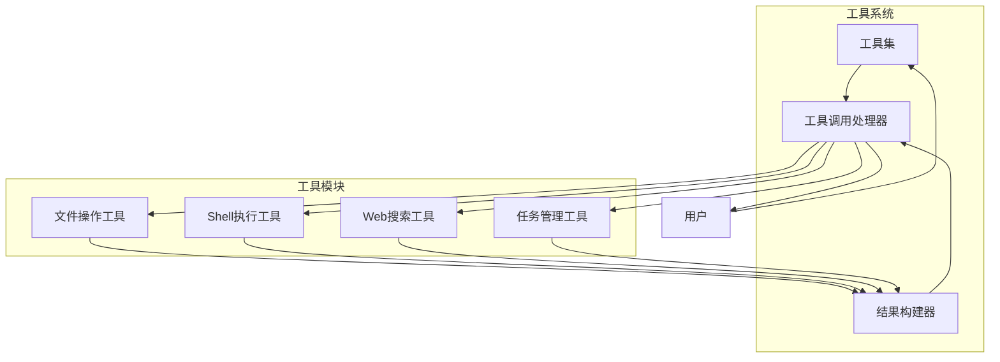
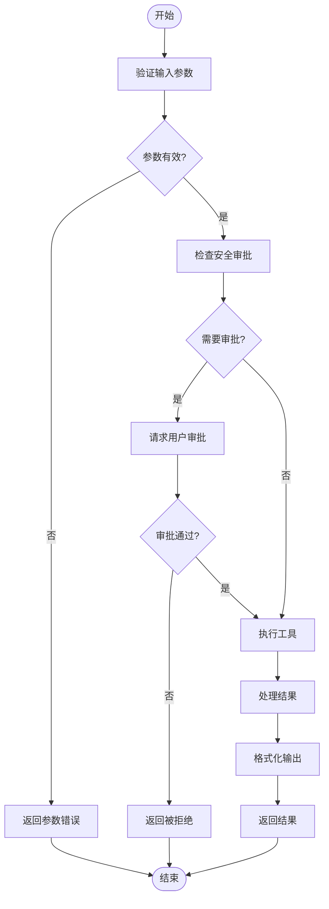
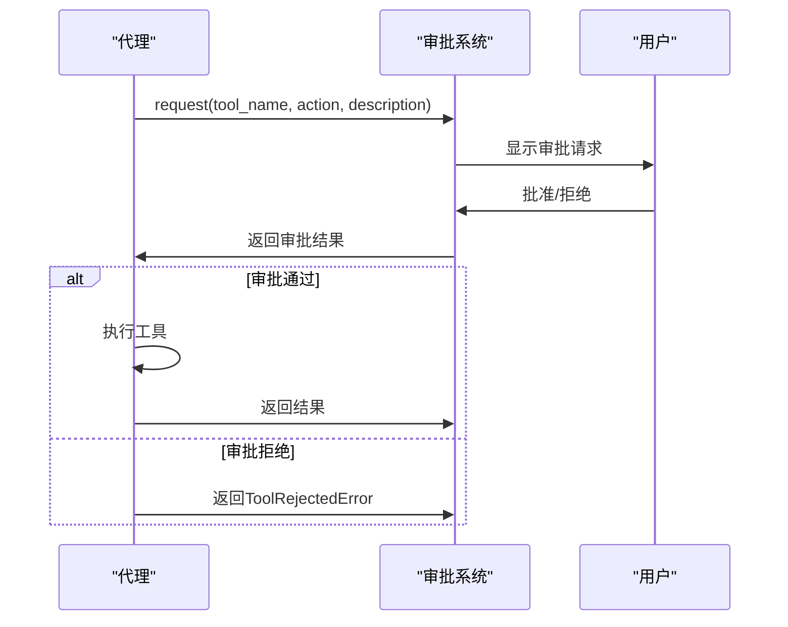

# 工具系统

<cite>
**本文档中引用的文件**  
- [read.py](file://src/kimi_cli/tools/file/read.py)
- [write.py](file://src/kimi_cli/tools/file/write.py)
- [replace.py](file://src/kimi_cli/tools/file/replace.py)
- [grep.py](file://src/kimi_cli/tools/file/grep.py)
- [bash.py](file://src/kimi_cli/tools/bash/__init__.py)
- [fetch.py](file://src/kimi_cli/tools/web/fetch.py)
- [search.py](file://src/kimi_cli/tools/web/search.py)
- [task.md](file://src/kimi_cli/tools/task/task.md)
- [set_todo_list.md](file://src/kimi_cli/tools/todo/set_todo_list.md)
- [dmail.md](file://src/kimi_cli/tools/dmail/dmail.md)
- [mcp.py](file://src/kimi_cli/tools/mcp.py)
- [utils.py](file://src/kimi_cli/tools/utils.py)
- [toolset.py](file://src/kimi_cli/soul/toolset.py)
- [approval.py](file://src/kimi_cli/soul/approval.py)
- [__init__.py](file://src/kimi_cli/tools/__init__.py)
</cite>

## 目录
1. [简介](#简介)
2. [工具系统架构](#工具系统架构)
3. [核心功能与工具详解](#核心功能与工具详解)
4. [文件操作工具](#文件操作工具)
5. [Shell执行工具](#shell执行工具)
6. [Web搜索与内容获取工具](#web搜索与内容获取工具)
7. [任务管理与待办事项工具](#任务管理与待办事项工具)
8. [DMail工具](#dmail工具)
9. [工具调用流程与结果处理](#工具调用流程与结果处理)
10. [工具权限与安全审批机制](#工具权限与安全审批机制)
11. [工具发现与加载机制](#工具发现与加载机制)
12. [附录：工具参数与限制](#附录工具参数与限制)

## 简介
Kimi CLI的工具系统是其功能扩展的核心，为智能代理提供了丰富的外部能力。该系统通过模块化设计，集成了文件操作、Shell执行、Web搜索、任务管理等多种工具，使代理能够与外部环境进行交互，完成复杂的任务。每个工具都经过精心设计，确保安全性、效率和易用性。

## 工具系统架构
Kimi CLI的工具系统采用模块化分层架构，核心组件包括工具集（Toolset）、工具调用处理器和结果构建器。工具集负责管理所有可用工具的注册和调用，工具调用处理器处理工具调用的生命周期，结果构建器则负责格式化和限制工具输出。

**图示来源**
- [toolset.py](file://src/kimi_cli/soul/toolset.py)
- [mcp.py](file://src/kimi_cli/tools/mcp.py)
- [utils.py](file://src/kimi_cli/tools/utils.py)

## 核心功能与工具详解
Kimi CLI的工具系统提供了多种核心功能，包括文件操作、Shell执行、Web搜索、任务管理等。每个工具都有明确的功能定位和使用场景，通过合理的工具组合，可以完成复杂的任务。

## 文件操作工具
文件操作工具是Kimi CLI中最基础也是最重要的工具之一，包括文件读取、写入、搜索和替换等功能。

### 文件读取 (ReadFile)
ReadFile工具用于读取文件内容，支持从指定行号开始读取，并限制读取的行数和字节数。

**功能特点**：
- 支持绝对路径读取
- 可指定起始行号和读取行数
- 自动截断超长行
- 限制最大读取1000行或100KB

**输入参数**：
- `path`: 要读取的文件的绝对路径
- `line_offset`: 从第几行开始读取（默认为1）
- `n_lines`: 读取多少行（默认为1000）

**输出格式**：
- 带行号的文件内容，格式类似于`cat -n`命令
- 包含读取统计信息的消息

**使用限制**：
- 路径必须是绝对路径
- 文件必须存在且为普通文件
- 读取内容受行数和字节数限制

**Section sources**
- [read.py](file://src/kimi_cli/tools/file/read.py#L1-L141)

### 文件写入 (WriteFile)
WriteFile工具用于向文件写入内容，支持覆盖写入和追加写入两种模式。

**功能特点**：
- 支持覆盖写入和追加写入
- 路径安全验证，确保文件在工作目录内
- 需要用户审批才能执行写入操作

**输入参数**：
- `path`: 要写入的文件的绝对路径
- `content`: 要写入的文件内容
- `mode`: 写入模式（"overwrite"或"append"）

**输出格式**：
- 空字符串（无直接输出）
- 包含写入结果和文件大小的消息

**使用限制**：
- 路径必须是绝对路径
- 文件父目录必须存在
- 路径必须在工作目录内
- 需要用户审批

**Section sources**
- [write.py](file://src/kimi_cli/tools/file/write.py#L1-L120)

### 文件搜索 (Grep)
Grep工具用于在文件中搜索正则表达式模式，基于ripgrep实现，支持多种搜索选项。

**功能特点**：
- 支持正则表达式搜索
- 支持大小写不敏感搜索
- 支持多行模式搜索
- 自动下载和安装ripgrep二进制文件

**输入参数**：
- `pattern`: 要搜索的正则表达式模式
- `path`: 搜索的文件或目录（默认为当前目录）
- `glob`: 用于过滤文件的glob模式
- `output_mode`: 输出模式（"content"、"files_with_matches"或"count_matches"）
- `before_context`: 显示匹配前的上下文行数
- `after_context`: 显示匹配后的上下文行数
- `context`: 显示匹配前后的上下文行数
- `line_number`: 是否显示行号
- `ignore_case`: 是否忽略大小写
- `type`: 文件类型过滤
- `head_limit`: 输出行数限制

**输出格式**：
- 根据输出模式返回匹配内容、文件路径或匹配计数
- 支持上下文显示和行号显示

**使用限制**：
- 路径必须是绝对路径或相对路径
- 搜索结果受行数限制

**Section sources**
- [grep.py](file://src/kimi_cli/tools/file/grep.py#L1-L303)

### 文件替换 (StrReplaceFile)
StrReplaceFile工具用于在文件中替换字符串，支持单次替换和全局替换。

**功能特点**：
- 支持单次替换和全局替换
- 支持多行字符串替换
- 路径安全验证
- 需要用户审批才能执行替换操作

**输入参数**：
- `path`: 要编辑的文件的绝对路径
- `edit`: 编辑操作，包含旧字符串、新字符串和是否全局替换

**输出格式**：
- 空字符串（无直接输出）
- 包含替换统计信息的消息

**使用限制**：
- 路径必须是绝对路径
- 文件必须存在且为普通文件
- 路径必须在工作目录内
- 需要用户审批

**Section sources**
- [replace.py](file://src/kimi_cli/tools/file/replace.py#L1-L145)

## Shell执行工具
Shell执行工具允许在系统Shell中执行命令，提供与操作系统的直接交互能力。

### Bash/CMD工具
Bash（Linux/Mac）和CMD（Windows）工具用于执行Shell命令，支持命令链和管道操作。

**功能特点**：
- 支持完整的Shell命令执行
- 支持命令链（&&、||、&）
- 支持管道和重定向
- 每次调用都是独立的Shell会话

**输入参数**：
- `command`: 要执行的Shell命令

**输出格式**：
- 合并的stdout和stderr输出
- 包含退出码的系统标签（当命令失败时）

**使用限制**：
- 不支持持久化环境变量
- 不支持交互式程序
- 建议避免离开工作目录
- 需要用户审批才能执行

**Section sources**
- [bash/__init__.py](file://src/kimi_cli/tools/bash/__init__.py)
- [cmd.md](file://src/kimi_cli/tools/bash/cmd.md)

## Web搜索与内容获取工具
Web搜索与内容获取工具提供了访问互联网的能力，支持网页搜索和内容提取。

### 网页搜索 (SearchWeb)
SearchWeb工具用于执行网络搜索，基于Moonshot搜索服务，返回搜索结果摘要。

**功能特点**：
- 支持文本查询搜索
- 可选择是否包含网页内容
- 支持结果数量限制
- 自动处理搜索服务配置

**输入参数**：
- `query`: 搜索查询文本
- `limit`: 返回结果数量（默认为5）
- `include_content`: 是否包含网页内容

**输出格式**：
- 格式化的搜索结果列表
- 包含标题、日期、URL、摘要和可选内容
- 结果之间用分隔符隔开

**使用限制**：
- 需要配置Moonshot搜索服务
- 包含内容时会消耗大量token
- 结果数量限制在1-20之间

**Section sources**
- [search.py](file://src/kimi_cli/tools/web/search.py#L1-L128)

### 网页内容获取 (FetchURL)
FetchURL工具用于获取网页内容，使用trafilatura库提取网页主要文本。

**功能特点**：
- 自动提取网页主要文本内容
- 忽略广告、导航等无关内容
- 支持表格和注释提取
- 使用标准User-Agent请求

**输入参数**：
- `url`: 要获取内容的URL

**输出格式**：
- 提取的网页主要文本内容
- 包含元数据（如标题、作者等）

**使用限制**：
- 无法处理需要JavaScript渲染的页面
- 某些网站可能阻止爬虫访问
- 空响应或无法提取内容时返回错误

**Section sources**
- [fetch.py](file://src/kimi_cli/tools/web/fetch.py#L1-L96)

## 任务管理与待办事项工具
任务管理与待办事项工具帮助代理组织和跟踪复杂任务的执行进度。

### 任务创建 (Task)
Task工具用于创建子代理执行特定任务，实现上下文隔离和并行多任务处理。

**功能特点**：
- 创建具有独立上下文的子代理
- 实现上下文隔离，保持主上下文清洁
- 支持并行多任务处理
- 子代理完成后返回结果

**使用场景**：
- 修复代码中的编译错误
- 搜索特定技术的最新信息
- 并行处理多个独立的子任务

**注意事项**：
- 不应直接转发用户提示给Task工具
- 不应为每个待办事项都创建子代理
- 仅用于非常具体和狭窄的任务

**Section sources**
- [task.md](file://src/kimi_cli/tools/task/task.md)

### 待办事项列表 (SetTodoList)
SetTodoList工具用于更新整个待办事项列表，帮助跟踪任务进度。

**功能特点**：
- 更新整个待办事项列表
- 跟踪子任务/里程碑的完成进度
- 帮助分解复杂任务

**使用场景**：
- 任务涉及多个子任务/里程碑
- 单个请求中包含多个任务
- 需要跟踪任务进度时

**使用限制**：
- 不应滥用以跟踪过小的步骤
- 不适用于简单查询或少量步骤的任务
- 每次操作都需要更新整个列表

**Section sources**
- [set_todo_list.md](file://src/kimi_cli/tools/todo/set_todo_list.md)

## DMail工具
DMail工具允许向过去发送消息，类似于《命运石之门》中的D-Mail，用于上下文回溯和优化。

### DMail功能
DMail工具允许代理向指定的检查点发送消息，系统会回溯到该检查点并附加DMail消息。

**功能特点**：
- 回溯到指定的检查点
- 附加DMail消息到上下文
- 优化决策路径

**使用场景**：
- 文件过大且大部分内容不相关时，发送有用部分
- Web搜索结果过大时，发送有用部分或建议新查询
- 代码修复过程复杂但结果简单时，发送修复后的代码

**注意事项**：
- 发送DMail时不要向用户过多解释
- 必须清楚地告诉过去的自己做了什么、学到了什么
- 选择合适的检查点作为目标

**Section sources**
- [dmail.md](file://src/kimi_cli/tools/dmail/dmail.md)

## 工具调用流程与结果处理
工具调用流程是Kimi CLI工具系统的核心，确保工具调用的安全性和有效性。

### 工具调用流程
工具调用流程包括工具发现、参数验证、安全审批、执行和结果处理等步骤。

**图示来源**
- [mcp.py](file://src/kimi_cli/tools/mcp.py#L34-L43)
- [utils.py](file://src/kimi_cli/tools/utils.py#L37-L151)

### 结果处理机制
结果处理机制使用ToolResultBuilder类，确保输出符合大小限制并正确格式化。

**功能特点**：
- 限制最大字符数（默认50,000）
- 限制最大行长度（默认2,000）
- 自动截断超长行
- 添加截断标记"[...truncated]"

**Section sources**
- [utils.py](file://src/kimi_cli/tools/utils.py#L37-L151)

## 工具权限与安全审批机制
安全审批机制是Kimi CLI工具系统的重要组成部分，防止未经授权的操作。

### 安全审批流程
安全审批机制要求某些敏感操作必须经过用户确认才能执行。

**需要审批的操作**：
- 文件写入
- 文件替换
- Shell命令执行
- 其他潜在危险操作

**审批机制特点**：
- 基于Runtime的approval.request方法
- 每个工具调用前检查审批
- 用户可以拒绝不安全的操作
- 提高系统安全性

**图示来源**
- [mcp.py](file://src/kimi_cli/tools/mcp.py#L36-L37)
- [write.py](file://src/kimi_cli/tools/file/write.py#L93-L98)
- [replace.py](file://src/kimi_cli/tools/file/replace.py#L95-L100)

## 工具发现与加载机制
工具发现与加载机制负责识别和注册所有可用的工具。

### 工具发现
工具系统通过扫描tools目录下的模块自动发现可用工具。

**发现机制特点**：
- 基于Python模块导入
- 自动识别CallableTool2子类
- 支持SkipThisTool异常跳过工具

### 工具加载
工具加载过程包括实例化工具对象和设置必要参数。

**加载流程**：
1. 导入工具模块
2. 查找工具类
3. 实例化工具对象
4. 注册到工具集

**Section sources**
- [__init__.py](file://src/kimi_cli/tools/__init__.py)
- [mcp.py](file://src/kimi_cli/tools/mcp.py)

## 附录：工具参数与限制
本附录总结了主要工具的参数和使用限制。

### 工具参数表
| 工具名称 | 输入参数 | 输出格式 | 使用限制 |
|---------|---------|---------|---------|
| ReadFile | path, line_offset, n_lines | 带行号的文件内容 | 绝对路径，最大1000行或100KB |
| WriteFile | path, content, mode | 空字符串 | 绝对路径，需审批，路径在工作目录内 |
| StrReplaceFile | path, edit | 空字符串 | 绝对路径，需审批，路径在工作目录内 |
| Grep | pattern, path, glob等 | 匹配内容/文件路径/计数 | 路径限制，结果行数限制 |
| SearchWeb | query, limit, include_content | 格式化搜索结果 | 需配置搜索服务，内容包含消耗token |
| FetchURL | url | 提取的网页文本 | 无法处理JS渲染页面 |

**Section sources**
- [read.py](file://src/kimi_cli/tools/file/read.py)
- [write.py](file://src/kimi_cli/tools/file/write.py)
- [replace.py](file://src/kimi_cli/tools/file/replace.py)
- [grep.py](file://src/kimi_cli/tools/file/grep.py)
- [search.py](file://src/kimi_cli/tools/web/search.py)
- [fetch.py](file://src/kimi_cli/tools/web/fetch.py)