# 思考工具

<cite>
**本文档中引用的文件**
- [src/kimi_cli/tools/think/__init__.py](file://src/kimi_cli/tools/think/__init__.py)
- [src/kimi_cli/tools/think/think.md](file://src/kimi_cli/tools/think/think.md)
- [src/kimi_cli/tools/utils.py](file://src/kimi_cli/tools/utils.py)
- [src/kimi_cli/soul/toolset.py](file://src/kimi_cli/soul/toolset.py)
- [src/kimi_cli/ui/shell/visualize.py](file://src/kimi_cli/ui/shell/visualize.py)
- [src/kimi_cli/ui/shell/prompt.py](file://src/kimi_cli/ui/shell/prompt.py)
- [src/kimi_cli/soul/kimisoul.py](file://src/kimi_cli/soul/kimisoul.py)
- [tests/test_tool_descriptions.py](file://tests/test_tool_descriptions.py)
- [tests/test_tool_schemas.py](file://tests/test_tool_schemas.py)
</cite>

## 目录
1. [简介](#简介)
2. [核心架构](#核心架构)
3. [工具设计原理](#工具设计原理)
4. [技术实现细节](#技术实现细节)
5. [使用场景与示例](#使用场景与示例)
6. [用户界面集成](#用户界面集成)
7. [性能特性](#性能特性)
8. [调试与优化](#调试与优化)
9. [最佳实践](#最佳实践)
10. [总结](#总结)

## 简介

Think工具是kimi-cli框架中的一个专门设计的认知过程记录工具，它作为Agent内部思维链的重要组成部分，用于记录复杂的推理步骤、假设和决策依据。该工具的核心特点是**不产生外部副作用**，而是专注于内部认知过程的透明化和可解释性增强。

Think工具的设计理念体现了现代AI系统对可解释性的追求：通过将Agent的中间推理过程显式地记录下来，为开发者和用户提供深入了解AI决策机制的机会，同时为调试和优化提供了宝贵的上下文信息。

## 核心架构

### 工具类层次结构

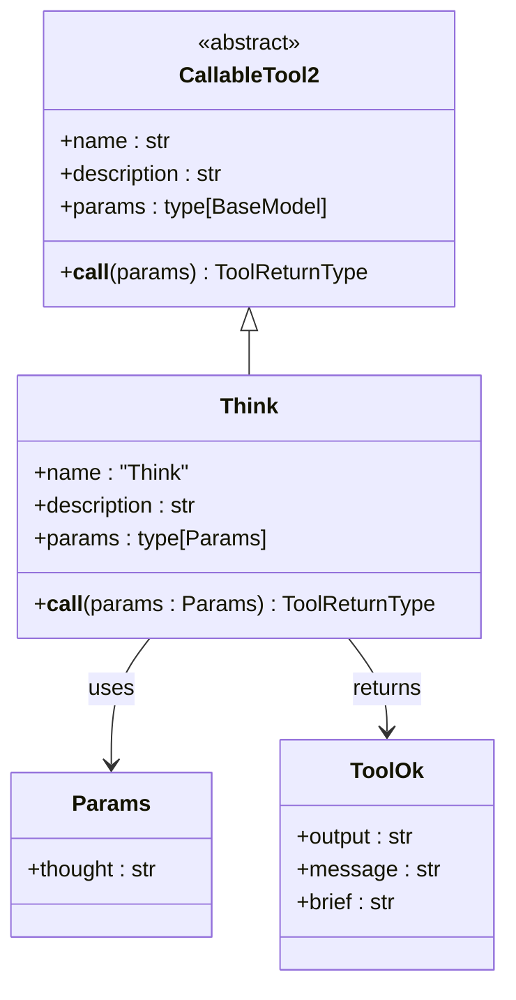

**图表来源**
- [src/kimi_cli/tools/think/__init__.py](file://src/kimi_cli/tools/think/__init__.py#L14-L21)

### 参数验证机制

Think工具采用严格的参数验证机制，确保输入的有效性和一致性：

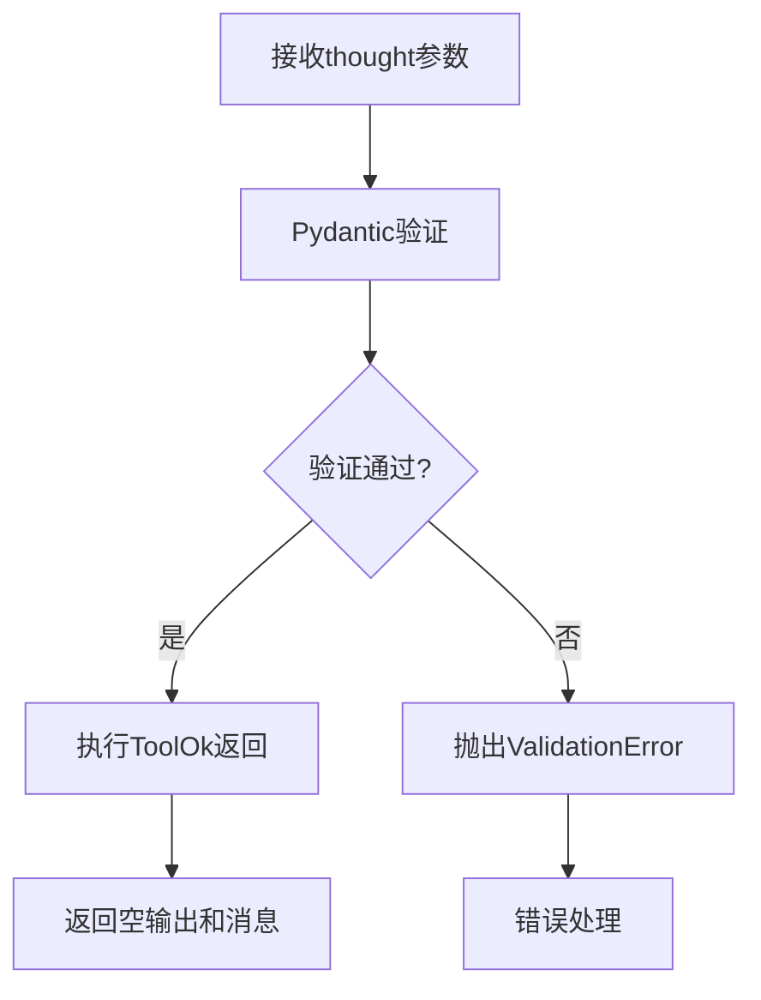

**图表来源**
- [src/kimi_cli/tools/think/__init__.py](file://src/kimi_cli/tools/think/__init__.py#L10-L12)

**节来源**
- [src/kimi_cli/tools/think/__init__.py](file://src/kimi_cli/tools/think/__init__.py#L1-L21)

## 工具设计原理

### 认知过程透明化

Think工具的核心价值在于增强Agent响应的透明度和可解释性。它通过以下方式实现这一目标：

1. **中间状态记录**：在复杂的决策过程中，记录Agent的思考轨迹
2. **假设显式化**：将隐式的推理假设转化为明确的文本记录
3. **决策依据追踪**：保存每个决策步骤的背景信息和考虑因素

### 内部认知过程管理

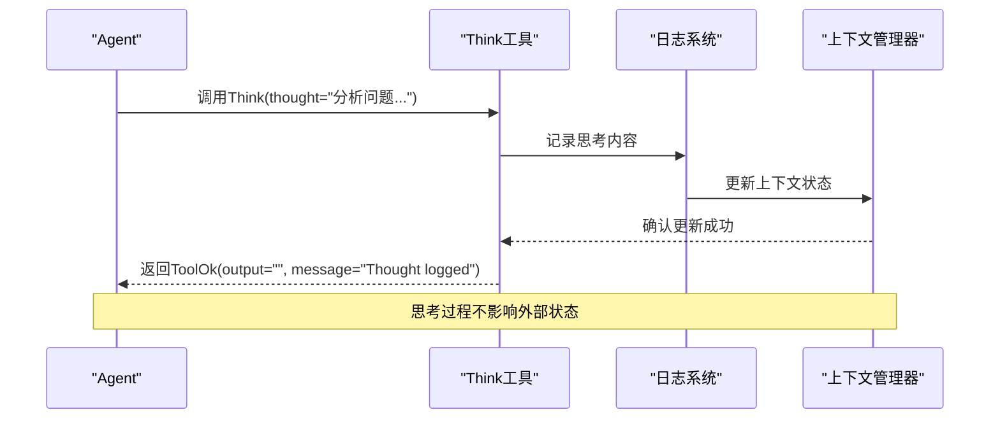

**图表来源**
- [src/kimi_cli/tools/think/__init__.py](file://src/kimi_cli/tools/think/__init__.py#L19-L21)

### 上下文隔离机制

Think工具实现了严格的上下文隔离，确保其操作不会影响其他组件的状态：

- **无副作用设计**：不修改数据库或外部状态
- **只读访问**：仅读取当前上下文而不进行写入操作
- **临时存储**：思考内容存储在内存中，不会持久化到数据库

**节来源**
- [src/kimi_cli/tools/think/think.md](file://src/kimi_cli/tools/think/think.md#L1-L2)

## 技术实现细节

### 参数定义与验证

Think工具的参数定义简洁而精确，体现了类型安全的设计原则：

```python
class Params(BaseModel):
    thought: str = Field(description="A thought to think about.")
```

这种设计确保：
- 输入必须是字符串类型
- 提供清晰的参数描述
- 利用Pydantic的自动验证功能

### 异步执行模型

Think工具采用异步执行模式，支持高并发的思考过程：

```python
async def __call__(self, params: Params) -> ToolReturnType:
    return ToolOk(output="", message="Thought logged")
```

这种设计的优势包括：
- 非阻塞的思考过程
- 支持并行多个思考实例
- 良好的资源利用率

### 错误处理机制

虽然Think工具本身没有复杂的业务逻辑，但其错误处理机制确保了系统的稳定性：

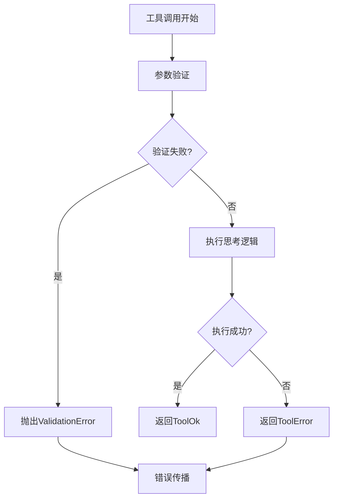

**图表来源**
- [src/kimi_cli/tools/think/__init__.py](file://src/kimi_cli/tools/think/__init__.py#L19-L21)

**节来源**
- [src/kimi_cli/tools/think/__init__.py](file://src/kimi_cli/tools/think/__init__.py#L10-L21)

## 使用场景与示例

### 复杂决策过程中的思考记录

Think工具在以下场景中发挥重要作用：

#### 场景一：多步骤推理过程

当Agent需要进行复杂的多步骤推理时，可以使用Think工具记录每个阶段的思考：

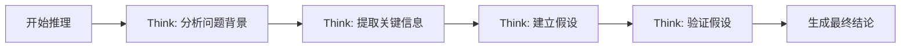

#### 场景二：假设性思考

在探索不同解决方案时，Think工具帮助记录各种假设：

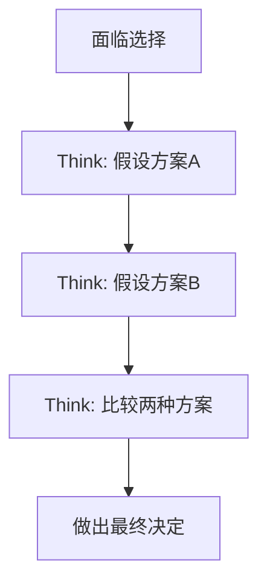

### 与其他工具的协作

Think工具经常与其他工具配合使用，形成完整的认知流程：

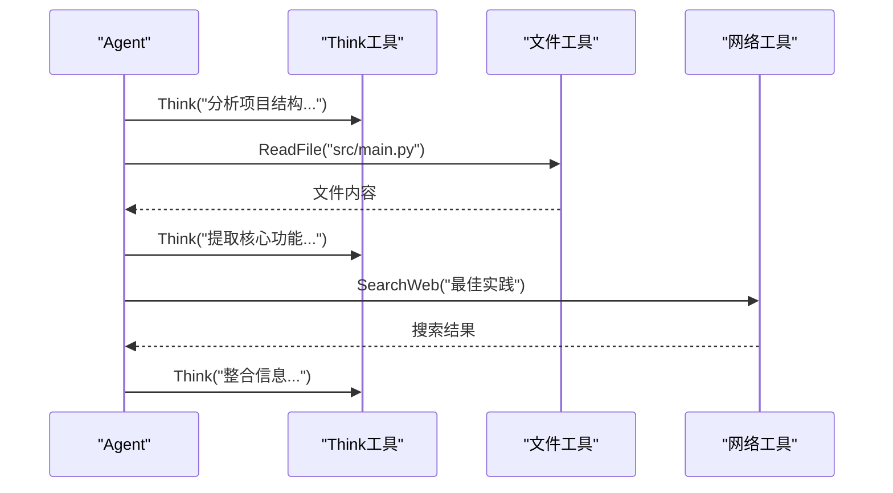

**图表来源**
- [src/kimi_cli/tools/think/think.md](file://src/kimi_cli/tools/think/think.md#L1-L2)

### 调试与优化中的应用

Think工具在调试和优化过程中具有重要价值：

#### 调试场景
- **跟踪推理路径**：通过思考记录追踪Agent的决策过程
- **识别瓶颈**：发现推理过程中的效率问题
- **验证假设**：检查Agent的假设是否合理

#### 优化场景
- **改进提示词**：基于思考记录优化提示词设计
- **调整策略**：根据思考模式调整推理策略
- **知识积累**：从思考记录中提取有价值的知识

**节来源**
- [tests/test_tool_descriptions.py](file://tests/test_tool_descriptions.py#L80-L85)

## 用户界面集成

### 可视化显示系统

Think工具的思考内容通过专门的可视化组件显示，提供直观的用户体验：

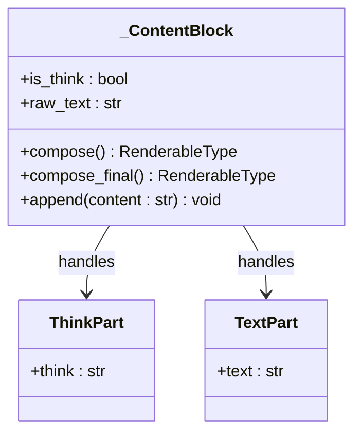

**图表来源**
- [src/kimi_cli/ui/shell/visualize.py](file://src/kimi_cli/ui/shell/visualize.py#L58-L78)

### 实时状态指示

系统提供了多种方式来指示当前是否处于思考模式：

#### 状态切换机制

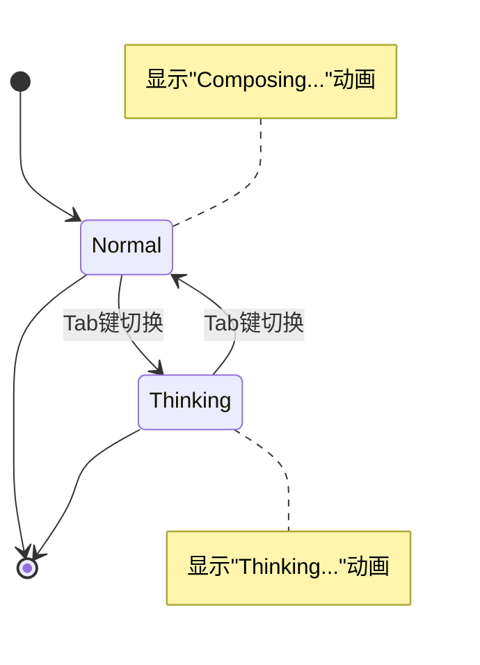

**图表来源**
- [src/kimi_cli/ui/shell/prompt.py](file://src/kimi_cli/ui/shell/prompt.py#L557-L567)

#### 视觉反馈系统

- **提示符变化**：思考模式下显示特殊的提示符符号
- **动画效果**：使用旋转动画表示思考过程
- **颜色编码**：通过灰色字体区分思考内容

### 交互式控制

用户可以通过键盘快捷键控制思考模式：

| 快捷键 | 功能 | 描述 |
|--------|------|------|
| Tab | 切换思考模式 | 在正常模式和思考模式之间切换 |
| Ctrl+X | 切换模式 | 在代理模式和Shell模式之间切换 |

**节来源**
- [src/kimi_cli/ui/shell/visualize.py](file://src/kimi_cli/ui/shell/visualize.py#L58-L78)
- [src/kimi_cli/ui/shell/prompt.py](file://src/kimi_cli/ui/shell/prompt.py#L555-L567)

## 性能特性

### 内存管理

Think工具采用了高效的内存管理策略：

- **即时释放**：思考内容在记录后立即可用，不会占用过多内存
- **流式处理**：支持长思考内容的分块处理
- **垃圾回收友好**：避免创建不必要的对象引用

### 并发处理能力

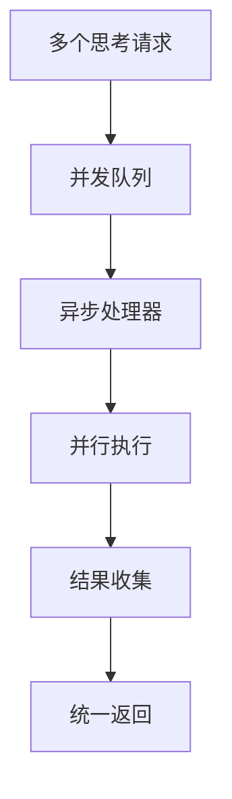

### 资源消耗优化

Think工具的资源消耗特点：

- **CPU使用率低**：主要是字符串处理操作
- **内存占用小**：仅存储思考内容的文本
- **I/O开销最小**：不涉及外部文件或网络操作

**节来源**
- [src/kimi_cli/tools/utils.py](file://src/kimi_cli/tools/utils.py#L1-L151)

## 调试与优化

### 调试支持功能

Think工具为调试提供了丰富的支持：

#### 日志记录机制

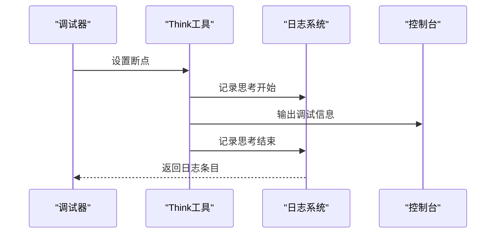

#### 性能监控

系统提供了多种性能监控指标：

- **执行时间统计**：记录每次思考的耗时
- **内存使用监控**：跟踪思考内容的内存占用
- **频率分析**：统计思考调用的频率和模式

### 优化建议

#### 提示词工程优化

基于Think工具的输出，可以进行以下优化：

1. **细化思考指令**：提供更具体的思考方向指导
2. **结构化思考**：引导Agent按照特定结构进行思考
3. **深度层次**：鼓励Agent进行多层次的思考

#### 工具组合优化

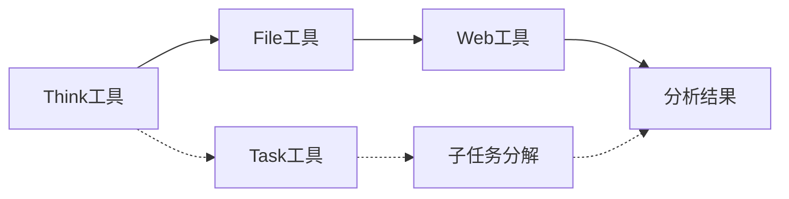

**节来源**
- [src/kimi_cli/soul/kimisoul.py](file://src/kimi_cli/soul/kimisoul.py#L126-L138)

## 最佳实践

### 使用指南

#### 合理使用思考时机

- **复杂问题**：在需要多步骤推理时使用
- **假设验证**：在验证不同假设时使用
- **决策支持**：在做出重要决策前使用

#### 思考内容的质量要求

1. **具体明确**：避免模糊的思考内容
2. **结构化**：使用清晰的结构组织思考
3. **相关性**：确保思考内容与当前任务相关

### 开发建议

#### 集成最佳实践

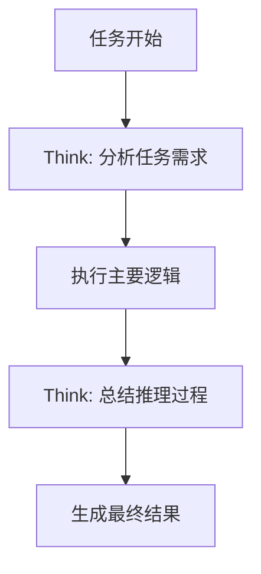

#### 错误处理策略

- **优雅降级**：当思考失败时，系统应保持正常运行
- **重试机制**：对于重要的思考过程，可以考虑重试
- **回退策略**：提供思考失败时的备选方案

### 性能优化建议

#### 批量处理

- **合并相似思考**：将相关的思考内容合并处理
- **延迟执行**：在合适的时机批量处理思考请求
- **优先级调度**：根据重要性调度思考任务

#### 缓存策略

虽然Think工具本身不缓存结果，但可以考虑：

- **思考模板**：预定义常用的思考模板
- **上下文缓存**：缓存相关的上下文信息
- **结果复用**：在相似场景中复用思考结果

## 总结

Think工具作为kimi-cli框架中的核心认知过程记录工具，体现了现代AI系统对可解释性和透明度的重视。通过其独特的设计理念和技术实现，Think工具在以下几个方面做出了重要贡献：

### 主要价值

1. **认知过程透明化**：将Agent的内部推理过程显式化，增强了系统的可解释性
2. **调试与优化支持**：为开发者提供了深入了解和优化Agent行为的工具
3. **用户体验提升**：通过可视化显示，让用户能够感知到AI的思考过程
4. **知识积累基础**：为未来的知识管理和智能优化奠定了基础

### 技术特色

- **无副作用设计**：确保思考过程不影响系统状态
- **异步执行模型**：支持高并发的思考处理
- **严格类型验证**：利用Pydantic确保输入的正确性
- **优雅的错误处理**：提供健壮的异常处理机制

### 应用前景

Think工具的设计理念和实现方式为未来的AI系统发展提供了重要启示：

- **可解释AI的发展**：为构建更加透明的AI系统提供了技术基础
- **人机协作的深化**：通过增强理解能力，促进更好的人机协作
- **智能优化的可能**：为基于认知过程的系统优化提供了新的途径

通过深入理解和合理使用Think工具，开发者可以构建更加智能、透明和可信赖的AI系统，为人机协作的未来发展奠定坚实基础。