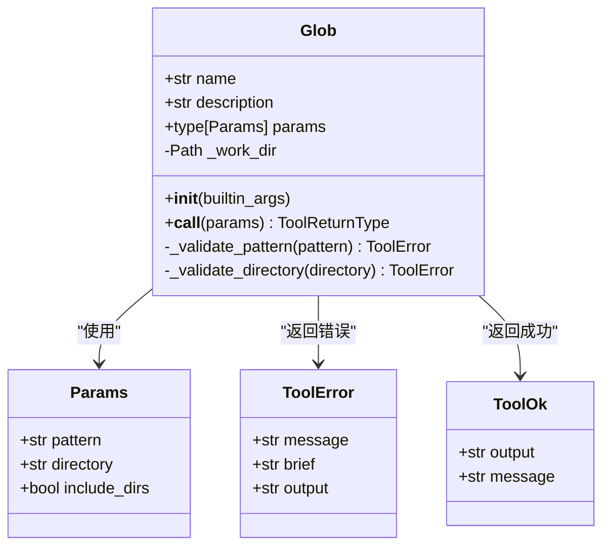
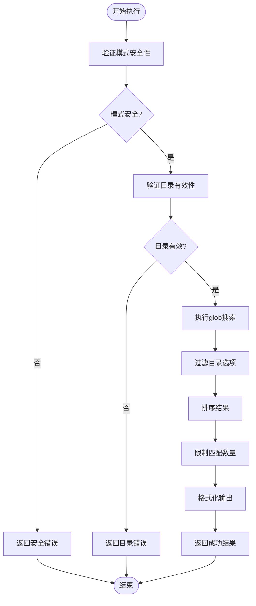
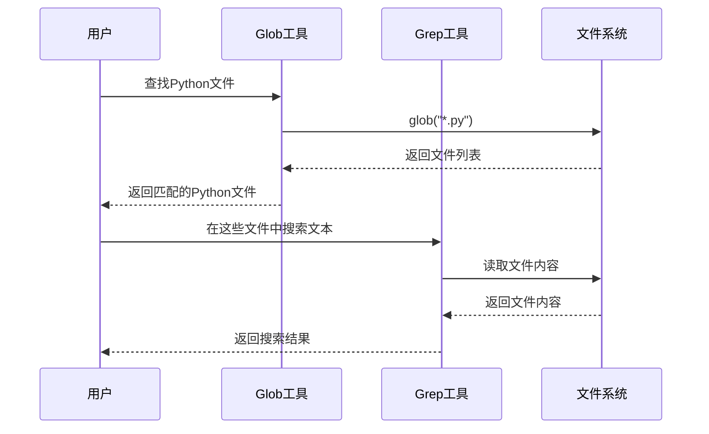

# Glob 工具

<cite>
**本文档中引用的文件**
- [glob.py](file://src/kimi_cli/tools/file/glob.py)
- [glob.md](file://src/kimi_cli/tools/file/glob.md)
- [test_glob.py](file://tests/test_glob.py)
- [__init__.py](file://src/kimi_cli/tools/file/__init__.py)
- [test_tool_descriptions.py](file://tests/test_tool_descriptions.py)
- [test_tool_schemas.py](file://tests/test_tool_schemas.py)
</cite>

## 目录
1. [简介](#简介)
2. [核心功能](#核心功能)
3. [架构概览](#架构概览)
4. [详细组件分析](#详细组件分析)
5. [输入参数详解](#输入参数详解)
6. [返回结构说明](#返回结构说明)
7. [支持的Glob语法](#支持的glob语法)
8. [实际调用示例](#实际调用示例)
9. [安全机制与限制](#安全机制与限制)
10. [协作模式](#协作模式)
11. [性能优化建议](#性能优化建议)
12. [故障排除指南](#故障排除指南)
13. [总结](#总结)

## 简介

Glob工具是一个强大的文件路径匹配工具，基于通配符模式（如`*.py`或`**/*.ts`）来匹配文件路径列表，用于批量文件发现。该工具实现了标准的glob语法，支持单星、问号和双星递归等模式，为项目中的文件操作提供了灵活而高效的文件筛选能力。

Glob工具在kimi-cli生态系统中扮演着关键角色，通常作为Grep、ReadFile等工具的前置步骤，实现文件筛选流水线，帮助用户快速定位和处理目标文件。

## 核心功能

Glob工具的核心功能包括：

- **文件路径匹配**：基于glob模式精确匹配文件和目录
- **递归搜索**：支持深度嵌套目录的递归查找
- **模式验证**：内置安全检查机制防止恶意模式
- **结果过滤**：可选择包含或排除目录
- **性能控制**：限制最大匹配数量防止资源耗尽

## 架构概览



**图表来源**
- [glob.py](file://src/kimi_cli/tools/file/glob.py#L17-L30)
- [glob.py](file://src/kimi_cli/tools/file/glob.py#L31-L150)

**章节来源**
- [glob.py](file://src/kimi_cli/tools/file/glob.py#L1-L150)

## 详细组件分析

### Glob类实现

Glob类继承自`CallableTool2`，实现了文件路径匹配的核心逻辑：



**图表来源**
- [glob.py](file://src/kimi_cli/tools/file/glob.py#L79-L149)

### 参数验证机制

工具实现了多层验证机制确保安全性：

1. **模式验证**：防止以`**`开头的递归模式
2. **目录验证**：确保目录在工作目录范围内
3. **路径验证**：要求绝对路径格式
4. **存在性验证**：检查目录是否存在且为目录类型

**章节来源**
- [glob.py](file://src/kimi_cli/tools/file/glob.py#L45-L112)

## 输入参数详解

### pattern (必需)
- **类型**：`str`
- **描述**：要匹配的glob模式
- **示例**：`"*.py"`, `"src/**/*.js"`, `"test_*.py"`
- **验证**：支持标准glob语法，但禁止以`**`开头的模式

### directory (可选)
- **类型**：`str | None`
- **描述**：要搜索的目录绝对路径，默认为工作目录
- **默认值**：`None`（使用工作目录）
- **要求**：必须为绝对路径

### include_dirs (可选)
- **类型**：`bool`
- **描述**：是否在结果中包含目录
- **默认值**：`True`
- **影响**：设置为`False`时只返回文件

**章节来源**
- [glob.py](file://src/kimi_cli/tools/file/glob.py#L17-L30)

## 返回结构说明

### 成功响应 (ToolOk)
- **output**：匹配文件的相对路径列表，每行一个路径
- **message**：包含匹配数量和状态信息的消息

### 错误响应 (ToolError)
- **message**：详细的错误描述
- **brief**：简短的错误标题
- **output**：附加的上下文信息（如目录列表）

**章节来源**
- [glob.py](file://src/kimi_cli/tools/file/glob.py#L140-L149)

## 支持的Glob语法

### 基础通配符
- `*`：匹配任意字符序列（不包括斜杠）
- `?`：匹配单个字符
- `[abc]`：匹配括号内的任意字符
- `[a-z]`：匹配指定范围内的字符

### 递归通配符
- `**`：递归匹配任意层级目录

### 示例语法对比

| 模式 | 匹配内容 | 说明 |
|------|----------|------|
| `*.py` | 当前目录下所有Python文件 | 基础通配符 |
| `src/**/*.js` | src目录及其子目录下的所有JS文件 | 递归匹配 |
| `test_*.py` | 以test_开头的Python文件 | 前缀匹配 |
| `*.config.{js,ts}` | 扩展名为js或ts的配置文件 | 大括号扩展 |

**章节来源**
- [glob.md](file://src/kimi_cli/tools/file/glob.md#L1-L18)

## 实际调用示例

### 查找项目中所有Markdown文件

```python
# 调用示例
result = await glob_tool(Params(
    pattern="*.md",
    directory="/project/root"
))

# 输出示例
# output: "README.md\nCHANGELOG.md\nCONTRIBUTING.md"
# message: "Found 3 matches for pattern `*.md`."
```

### 递归查找JavaScript文件

```python
# 调用示例
result = await glob_tool(Params(
    pattern="src/**/*.js",
    directory="/project/root"
))

# 可能输出
# output: "src/components/button.js\nsrc/utils/helper.js\nsrc/pages/home.js"
# message: "Found 3 matches for pattern `src/**/*.js`."
```

### 排除目录的文件查找

```python
# 调用示例
result = await glob_tool(Params(
    pattern="*.py",
    directory="/project/root",
    include_dirs=False
))

# 输出示例
# output: "main.py\nutils.py\nconfig.py"
# message: "Found 3 matches for pattern `*.py`."
```

**章节来源**
- [test_glob.py](file://tests/test_glob.py#L38-L322)

## 安全机制与限制

### 最大匹配数量限制

```python
MAX_MATCHES = 1000
```

当匹配结果超过1000个时，工具会自动截断结果并发出警告：
- **行为**：只返回前1000个匹配项
- **消息**：包含截断提示和建议更具体的模式

### 模式安全检查

工具对以下危险模式进行严格限制：

#### 禁止的模式
- `**`：完全递归搜索
- `**/*.py`：以`**`开头的递归模式
- `node_modules/**/*.js`：递归搜索依赖目录

#### 允许的模式
- `src/**/*.py`：特定目录下的递归搜索
- `**/main/*.py`：中间位置的递归模式
- `*.py`：基础通配符模式

### 目录访问控制

工具实施严格的目录访问控制：
- **范围限制**：只能访问工作目录及其子目录
- **路径验证**：要求绝对路径格式
- **存在性检查**：验证目录存在且为目录类型

**章节来源**
- [glob.py](file://src/kimi_cli/tools/file/glob.py#L14-L15)
- [glob.py](file://src/kimi_cli/tools/file/glob.py#L45-L77)

## 协作模式

### 与Grep工具的协作

Glob工具经常作为Grep工具的前置步骤，实现文件筛选流水线：



**图表来源**
- [test_grep.py](file://tests/test_grep.py#L169-L191)

### 与ReadFile工具的协作

Glob工具为ReadFile工具提供目标文件列表：

```python
# Glob工具找到目标文件
glob_result = await glob_tool(Params(pattern="*.md"))

# ReadFile工具读取这些文件
if glob_result.success:
    for file_path in glob_result.output.split('\n'):
        read_result = await read_file_tool(Params(path=file_path))
```

### 典型使用场景

1. **批量代码审查**：查找所有源代码文件后进行静态分析
2. **配置文件管理**：定位配置文件后进行批量修改
3. **测试文件发现**：查找测试文件后运行测试套件
4. **文档维护**：查找文档文件后进行格式检查

**章节来源**
- [test_tool_descriptions.py](file://tests/test_tool_descriptions.py#L179-L194)

## 性能优化建议

### 避免过度宽泛的模式

#### 不推荐的模式
- `**`：会导致整个文件系统的递归扫描
- `**/*.py`：以`**`开头的模式效率极低
- `node_modules/**/*`：递归搜索大型依赖目录

#### 推荐的模式
- `src/**/*.py`：限定在特定目录内递归
- `*.py`：基础通配符模式
- `src/{lib,utils}/**/*.py`：使用大括号扩展

### 合理使用include_dirs参数

- **仅需要文件**：设置`include_dirs=False`减少结果数量
- **需要目录**：保持`include_dirs=True`以便后续操作

### 结果数量控制

- **监控匹配数量**：关注返回消息中的匹配统计
- **使用更具体模式**：当匹配过多时细化搜索条件
- **分批处理**：对于大量文件，考虑分批处理策略

### 跨平台兼容性

- **路径分隔符**：工具自动处理不同操作系统的路径格式
- **大小写敏感**：根据操作系统特性处理文件名大小写
- **权限检查**：尊重操作系统的文件权限设置

**章节来源**
- [glob.md](file://src/kimi_cli/tools/file/glob.md#L16-L18)
- [glob.py](file://src/kimi_cli/tools/file/glob.py#L133-L138)

## 故障排除指南

### 常见错误及解决方案

#### 模式安全错误
**错误信息**：`Pattern starts with '**' which is not allowed`
**原因**：使用了可能导致大量匹配的递归模式
**解决方案**：使用更具体的模式，如`src/**/*.py`代替`**/*.py`

#### 目录访问错误
**错误信息**：`Directory outside working directory`
**原因**：尝试访问工作目录之外的路径
**解决方案**：使用绝对路径并确保在工作目录范围内

#### 路径格式错误
**错误信息**：`not an absolute path`
**原因**：提供的目录路径不是绝对路径
**解决方案**：使用完整路径，如`/project/root`而不是`./root`

#### 目录不存在错误
**错误信息**：`does not exist`
**原因**：指定的目录不存在
**解决方案**：检查路径拼写或创建缺失的目录

#### 非目录错误
**错误信息**：`is not a directory`
**原因**：指定路径不是一个目录
**解决方案**：确认路径指向正确的目录

### 调试技巧

1. **启用详细输出**：查看完整的错误消息和上下文信息
2. **简化模式**：从简单模式开始逐步增加复杂度
3. **检查工作目录**：确认当前工作目录符合预期
4. **验证路径**：手动检查路径的有效性和可访问性

**章节来源**
- [test_glob.py](file://tests/test_glob.py#L60-L322)

## 总结

Glob工具是kimi-cli生态系统中不可或缺的文件发现工具，具有以下核心优势：

### 主要特性
- **功能全面**：支持标准glob语法和递归搜索
- **安全可靠**：内置多重安全检查机制
- **性能优化**：智能限制匹配数量防止资源耗尽
- **易于使用**：简洁的API设计和清晰的错误信息

### 应用价值
- **提高效率**：快速定位目标文件，减少手动查找时间
- **保证质量**：通过安全检查防止意外的系统扫描
- **增强协作**：与其他工具无缝集成，构建完整的文件处理流水线

### 最佳实践
- 使用具体而非宽泛的glob模式
- 合理利用include_dirs参数控制结果范围
- 注意工作目录限制和路径格式要求
- 结合其他工具形成完整的文件处理方案

Glob工具的设计体现了现代软件开发中对安全性、性能和易用性的平衡，为开发者提供了强大而可靠的文件发现能力。