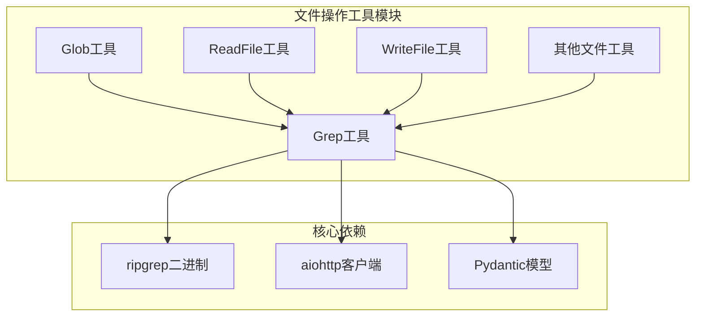
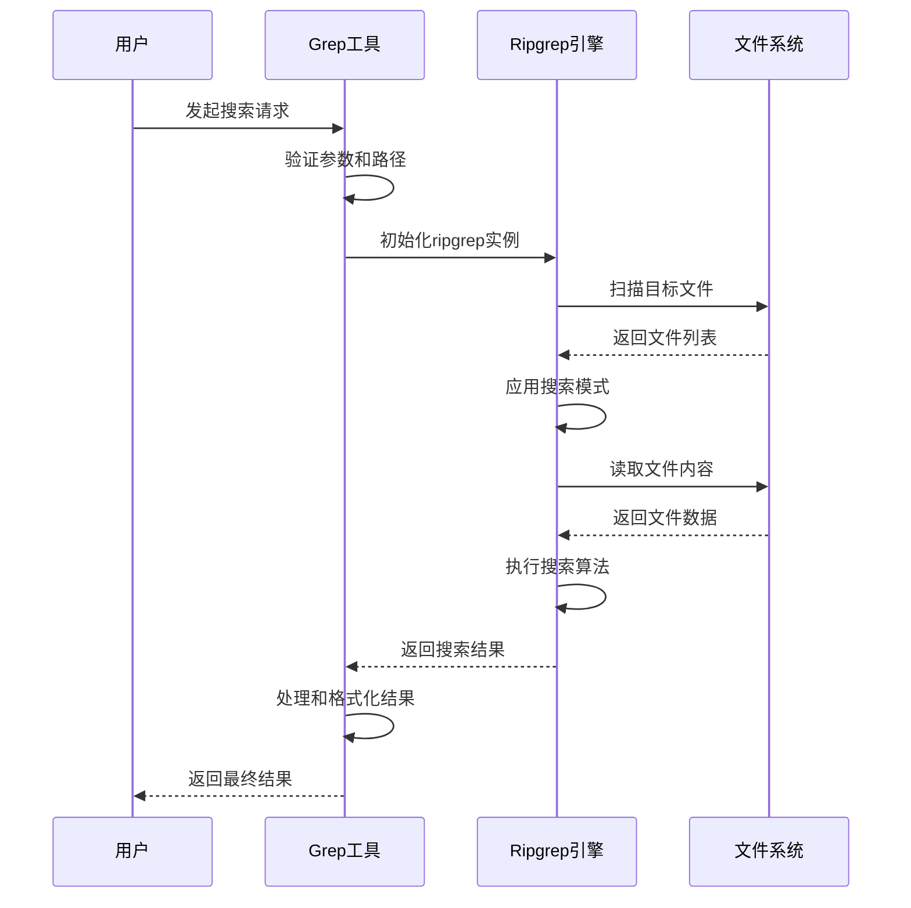
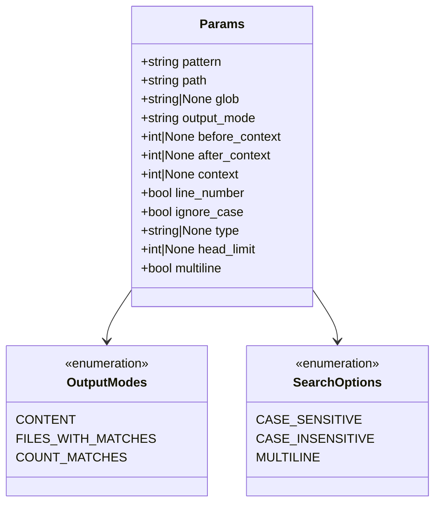
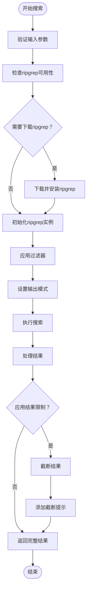
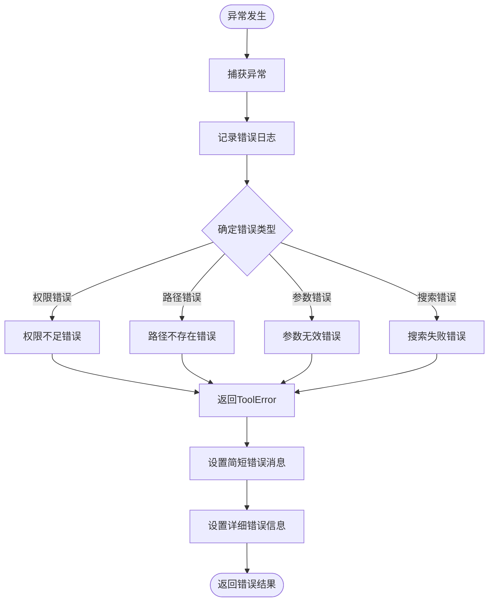
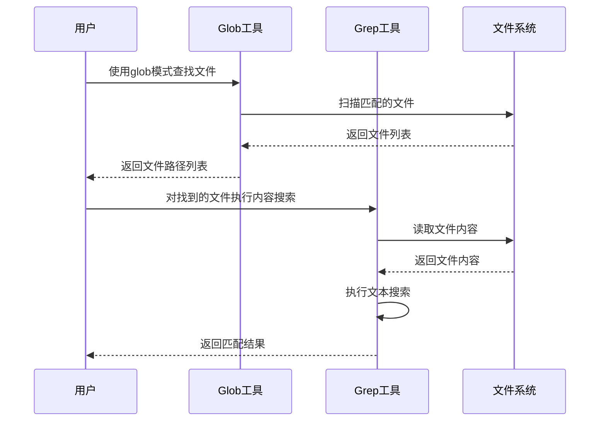
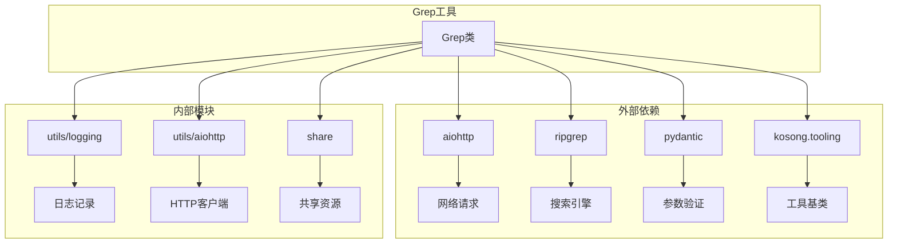

# Grep 工具详细文档

<cite>
**本文档中引用的文件**
- [grep.py](file://src/kimi_cli/tools/file/grep.py)
- [grep.md](file://src/kimi_cli/tools/file/grep.md)
- [glob.py](file://src/kimi_cli/tools/file/glob.py)
- [glob.md](file://src/kimi_cli/tools/file/glob.md)
- [test_grep.py](file://tests/test_grep.py)
- [__init__.py](file://src/kimi_cli/tools/__init__.py)
</cite>

## 目录
1. [简介](#简介)
2. [项目结构](#项目结构)
3. [核心组件](#核心组件)
4. [架构概览](#架构概览)
5. [详细组件分析](#详细组件分析)
6. [依赖关系分析](#依赖关系分析)
7. [性能考虑](#性能考虑)
8. [故障排除指南](#故障排除指南)
9. [结论](#结论)

## 简介

Grep工具是一个基于ripgrep的强大搜索工具，专门设计用于在指定文件或路径中搜索文本内容，返回匹配行及其行号。该工具提供了丰富的搜索选项，包括大小写敏感/不敏感搜索、上下文显示、文件类型过滤等高级功能。

Grep工具的核心优势在于：
- 基于高性能的ripgrep引擎
- 支持多种输出模式（内容显示、文件路径、匹配计数）
- 提供灵活的搜索选项和过滤器
- 与Glob工具协同工作，实现高效的文件发现和内容搜索流程

## 项目结构

Grep工具位于文件操作工具模块中，与其他文件操作工具共同构成了完整的文件系统交互能力。

**图表来源**
- [grep.py](file://src/kimi_cli/tools/file/grep.py#L1-L50)
- [glob.py](file://src/kimi_cli/tools/file/glob.py#L1-L30)

**章节来源**
- [grep.py](file://src/kimi_cli/tools/file/grep.py#L1-L303)
- [grep.md](file://src/kimi_cli/tools/file/grep.md#L1-L6)

## 核心组件

Grep工具由以下核心组件构成：

### 参数模型（Params）
定义了工具的所有配置选项，包括搜索模式、输出格式、过滤条件等。

### 主要类（Grep）
继承自CallableTool2，实现了具体的搜索逻辑和ripgrep集成。

### 二进制管理
负责ripgrep二进制的下载、安装和版本管理。

**章节来源**
- [grep.py](file://src/kimi_cli/tools/file/grep.py#L23-L110)

## 架构概览

Grep工具采用模块化架构设计，通过与ripgrep的深度集成实现高性能搜索功能。

**图表来源**
- [grep.py](file://src/kimi_cli/tools/file/grep.py#L242-L302)

## 详细组件分析

### 参数配置系统

Grep工具提供了丰富的参数配置选项，支持复杂的搜索需求：

**图表来源**
- [grep.py](file://src/kimi_cli/tools/file/grep.py#L23-L108)

#### 核心参数详解

| 参数名称 | 类型 | 默认值 | 描述 |
|---------|------|--------|------|
| pattern | string | 必需 | 要搜索的正则表达式模式 |
| path | string | "." | 搜索的目标文件或目录路径 |
| glob | string \| None | None | 用于过滤文件的glob模式 |
| output_mode | string | "files_with_matches" | 输出模式：content、files_with_matches、count_matches |
| ignore_case | bool | False | 是否执行大小写不敏感搜索 |
| multiline | bool | False | 是否启用多行模式 |

### 搜索逻辑实现

Grep工具的搜索逻辑遵循以下流程：

**图表来源**
- [grep.py](file://src/kimi_cli/tools/file/grep.py#L242-L296)

**章节来源**
- [grep.py](file://src/kimi_cli/tools/file/grep.py#L242-L296)

### 错误处理机制

Grep工具实现了完善的错误处理机制：

**图表来源**
- [grep.py](file://src/kimi_cli/tools/file/grep.py#L298-L302)

**章节来源**
- [grep.py](file://src/kimi_cli/tools/file/grep.py#L298-L302)

### 与Glob工具的协同使用

Grep工具与Glob工具形成了强大的文件发现和内容搜索组合：

**图表来源**
- [glob.py](file://src/kimi_cli/tools/file/glob.py#L114-L143)
- [grep.py](file://src/kimi_cli/tools/file/grep.py#L242-L296)

**章节来源**
- [glob.py](file://src/kimi_cli/tools/file/glob.py#L114-L143)

## 依赖关系分析

Grep工具的依赖关系体现了其作为复杂工具的架构特点：

**图表来源**
- [grep.py](file://src/kimi_cli/tools/file/grep.py#L1-L20)

**章节来源**
- [grep.py](file://src/kimi_cli/tools/file/grep.py#L1-L20)

## 性能考虑

### riPgrep优化特性

Grep工具利用ripgrep的多项性能优化：

- **并行搜索**：自动利用多核CPU进行并行处理
- **智能缓存**：缓存文件元数据以减少重复扫描
- **增量搜索**：支持增量搜索以提高大文件处理效率
- **内存优化**：智能内存管理避免内存溢出

### 性能限制和建议

对于大型文件集合，建议采用以下策略：

1. **分批处理**：将大量文件分成较小批次进行搜索
2. **合理使用过滤器**：优先使用glob和type过滤器缩小搜索范围
3. **设置结果限制**：使用head_limit参数控制输出量
4. **选择合适的输出模式**：根据需求选择content、files_with_matches或count_matches

### 平台特定优化

不同平台上的性能表现：

| 平台 | 优化特性 | 注意事项 |
|------|----------|----------|
| Windows | 原生二进制支持 | 需要管理员权限下载 |
| macOS | Apple Silicon原生支持 | 自动检测M1/M2芯片 |
| Linux | 多种架构支持 | 包含musl和glibc版本 |

## 故障排除指南

### 常见问题及解决方案

#### 1. riPgrep下载失败
**症状**：工具无法启动，提示下载ripgrep失败
**解决方案**：
- 检查网络连接
- 验证目标平台支持情况
- 手动安装ripgrep到系统PATH

#### 2. 权限不足错误
**症状**：无法访问某些文件或目录
**解决方案**：
- 检查文件权限设置
- 使用适当的用户身份运行
- 避免搜索受保护的系统目录

#### 3. 正则表达式语法错误
**症状**：搜索失败或返回意外结果
**解决方案**：
- 使用ripgrep的正则表达式语法
- 特殊字符需要正确转义
- 参考ripgrep文档的语法规范

#### 4. 结果过多导致性能问题
**症状**：搜索响应缓慢或内存占用过高
**解决方案**：
- 使用更具体的搜索模式
- 启用文件类型过滤
- 设置head_limit限制结果数量

**章节来源**
- [grep.py](file://src/kimi_cli/tools/file/grep.py#L298-L302)

## 结论

Grep工具作为文件内容搜索的核心组件，通过与ripgrep的深度集成，提供了强大而高效的搜索能力。其模块化设计、丰富的配置选项和完善的错误处理机制，使其成为文件系统探索和内容分析的理想工具。

主要优势包括：
- 基于高性能ripgrep引擎
- 灵活的参数配置系统
- 与Glob工具的无缝协作
- 完善的错误处理和日志记录
- 跨平台兼容性和自动优化

建议用户在使用时充分利用其过滤功能和输出模式，结合Glob工具实现高效的文件发现和内容搜索工作流。