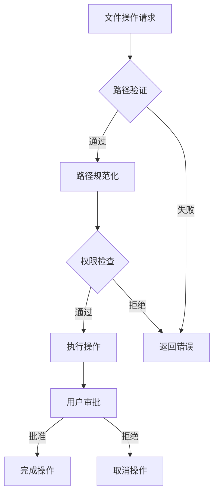
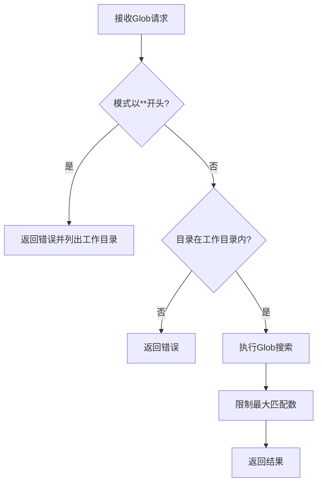
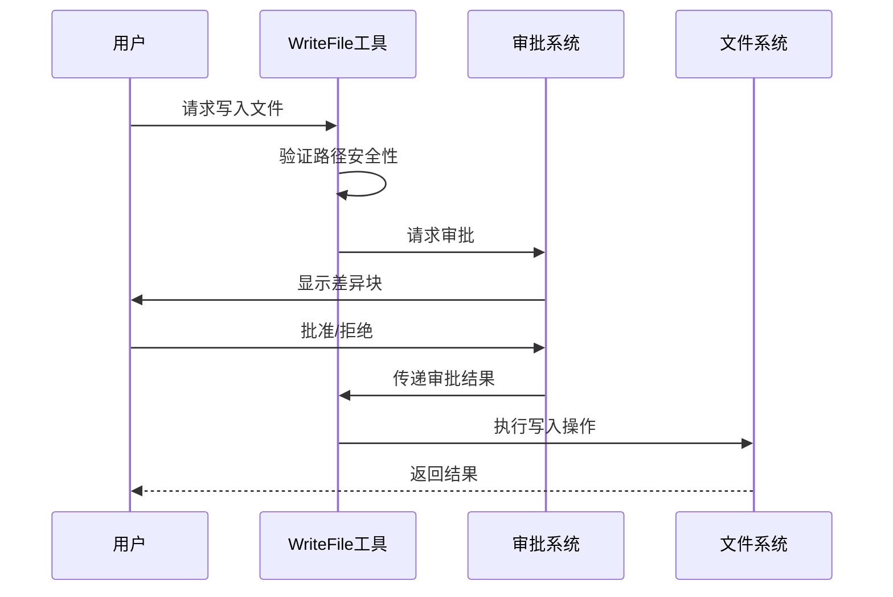

# Kaos 路径安全

<cite>
**本文档中引用的文件**  
- [path.py](file://src/kimi_cli/utils/path.py)
- [glob.py](file://src/kimi_cli/tools/file/glob.py)
- [read.py](file://src/kimi_cli/tools/file/read.py)
- [write.py](file://src/kimi_cli/tools/file/write.py)
- [approval.py](file://src/kimi_cli/soul/approval.py)
- [diff_utils.py](file://src/kimi_cli/tools/file/diff_utils.py)
- [test_utils_path.py](file://tests/test_utils_path.py)
- [test_glob.py](file://tests/test_glob.py)
- [test_read_file.py](file://tests/test_read_file.py)
- [test_write_file.py](file://tests/test_write_file.py)
</cite>

## 目录
1. [简介](#简介)
2. [路径安全机制](#路径安全机制)
3. [核心安全组件](#核心安全组件)
4. [文件操作安全策略](#文件操作安全策略)
5. [路径验证与规范化](#路径验证与规范化)
6. [安全测试与验证](#安全测试与验证)
7. [结论](#结论)

## 简介
Kaos 路径安全机制是 Kimi CLI 工具的核心安全特性，旨在防止路径遍历攻击、未经授权的文件访问和恶意文件操作。该系统通过多层次的验证、路径规范化和用户审批机制，确保所有文件操作都在安全的工作目录范围内进行。

**本文档中引用的文件**  
- [README.md](file://README.md)

## 路径安全机制
Kaos 路径安全机制通过 KaosPath 库和一系列验证函数实现，确保所有文件操作都符合安全规范。系统采用工作目录隔离策略，限制所有文件操作在指定的工作目录内进行。



**Diagram sources**
- [path.py](file://src/kimi_cli/utils/path.py#L102-L113)
- [write.py](file://src/kimi_cli/tools/file/write.py#L40-L54)

## 核心安全组件

### 路径验证函数
`is_within_directory` 函数是路径安全的核心，它使用纯路径语义检查目标路径是否包含在基目录内。该函数要求两个参数都已规范化（通过 KaosPath.canonical()）。

**Section sources**
- [path.py](file://src/kimi_cli/utils/path.py#L102-L113)

### 路径保留机制
`_reserve_rotation_path` 函数通过原子方式创建空文件作为路径保留，确保路径的唯一性。该机制使用 O_CREAT | O_EXCL | O_WRONLY 标志来防止竞争条件。

**Section sources**
- [path.py](file://src/kimi_cli/utils/path.py#L16-L27)

### 旋转路径管理
`next_available_rotation` 函数为文件或目录管理旋转路径，确保在日志轮换等场景下的唯一性。该函数会检查父目录是否存在，并通过正则表达式解析现有编号。

**Section sources**
- [path.py](file://src/kimi_cli/utils/path.py#L30-L54)

## 文件操作安全策略

### Glob 模式安全
Glob 工具实施严格的安全策略，禁止以 "**" 开头的模式，防止递归搜索可能包含大量文件的目录（如 node_modules）。系统会验证模式的安全性并限制最大匹配数。



**Diagram sources**
- [glob.py](file://src/kimi_cli/tools/file/glob.py#L45-L59)
- [glob.py](file://src/kimi_cli/tools/file/glob.py#L62-L75)

### 文件读取安全
ReadFile 工具实施多重安全检查，包括路径验证、文件存在性检查和可读性判断。系统会检查文件扩展名，阻止读取二进制文件（如图片、压缩包等）。

**Section sources**
- [read.py](file://src/kimi_cli/tools/file/read.py#L60-L75)
- [read.py](file://src/kimi_cli/tools/file/read.py#L286-L289)

### 文件写入安全
WriteFile 工具要求绝对路径，并验证目标路径是否在工作目录内。所有写入操作都需要用户审批，系统会显示差异块供用户审查。



**Diagram sources**
- [write.py](file://src/kimi_cli/tools/file/write.py#L40-L54)
- [approval.py](file://src/kimi_cli/soul/approval.py#L37-L87)

## 路径验证与规范化

### 路径规范化流程
系统使用 KaosPath.canonical() 方法对路径进行规范化，消除符号链接、相对路径组件（如 ".."）和多余的分隔符。这是路径验证的前提条件。

**Section sources**
- [path.py](file://src/kimi_cli/utils/path.py#L107-L111)

### 目录包含检查
`is_within_directory` 函数使用 PurePath.relative_to 方法检查路径包含关系。如果目标路径可以相对于基目录解析，则说明它在基目录内。

```mermaid
flowchart LR
A[目标路径] --> B[规范化]
C[基目录] --> D[规范化]
B --> E{relative_to(基目录)}
E --> |成功| F[路径在目录内]
E --> |失败| G[路径不在目录内]
```

**Diagram sources**
- [path.py](file://src/kimi_cli/utils/path.py#L109-L112)

### 绝对路径要求
所有文件操作都要求使用绝对路径，防止路径遍历攻击。相对路径只能用于工作目录内的文件访问。

**Section sources**
- [read.py](file://src/kimi_cli/tools/file/read.py#L65-L74)
- [write.py](file://src/kimi_cli/tools/file/write.py#L64-L71)

## 安全测试与验证

### 路径安全测试
系统包含全面的测试用例，验证各种边界情况下的路径安全行为，包括空目录、现有旋转文件、混合文件类型等场景。

**Section sources**
- [test_utils_path.py](file://tests/test_utils_path.py#L13-L237)

### Glob 安全测试
测试用例验证 Glob 模式的安全性，特别是对 "**" 开头模式的阻止机制，确保系统不会执行危险的递归搜索。

**Section sources**
- [test_glob.py](file://tests/test_glob.py#L320-L332)

### 文件读取测试
测试用例覆盖文件读取的各种场景，包括不存在的文件、目录而非文件、相对路径、Unicode 文件等，确保安全机制的健壮性。

**Section sources**
- [test_read_file.py](file://tests/test_read_file.py#L43-L200)

### 文件写入测试
测试用例验证文件写入的安全性，包括相对路径拒绝、工作目录外写入阻止、非存在目录处理等，确保写入操作的安全性。

**Section sources**
- [test_write_file.py](file://tests/test_write_file.py#L15-L184)

## 结论
Kaos 路径安全机制通过多层次的验证、规范化和用户审批，为 Kimi CLI 提供了强大的文件操作安全保障。系统设计考虑了各种攻击向量和边界情况，确保在提供强大功能的同时维护用户系统的安全。

该安全框架的核心优势包括：
- 严格的路径验证和规范化
- 工作目录隔离策略
- 用户审批机制
- 全面的测试覆盖
- 对危险模式的主动阻止

这些措施共同构成了一个健壮的安全体系，有效防止了常见的文件系统安全漏洞。