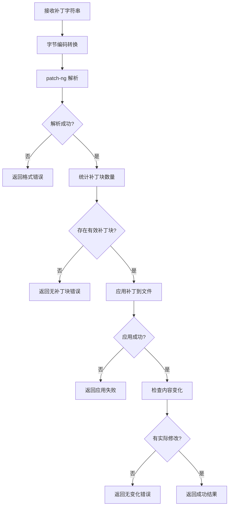
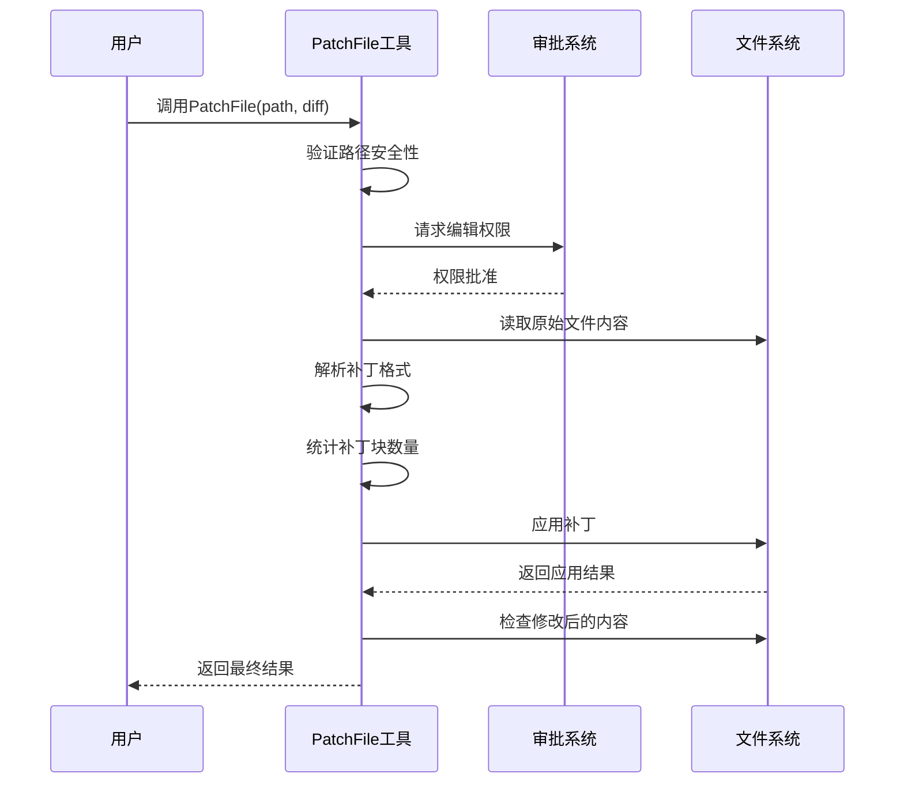
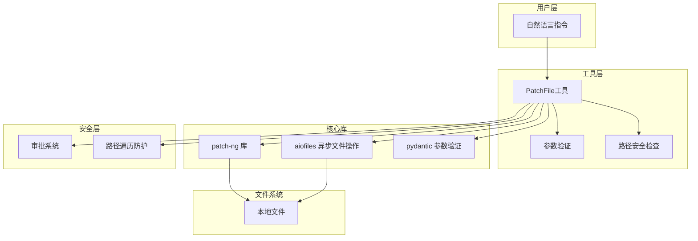
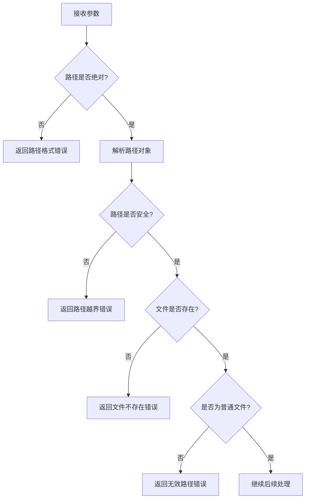
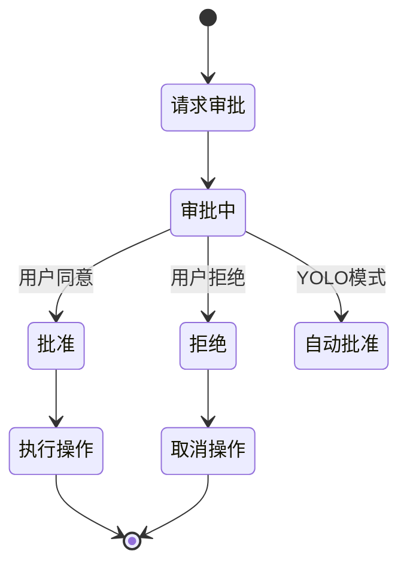
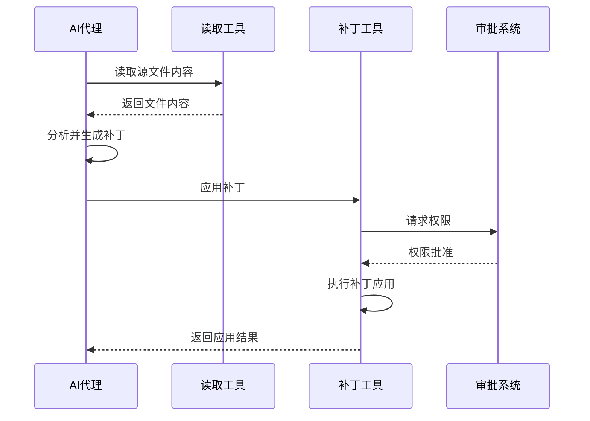
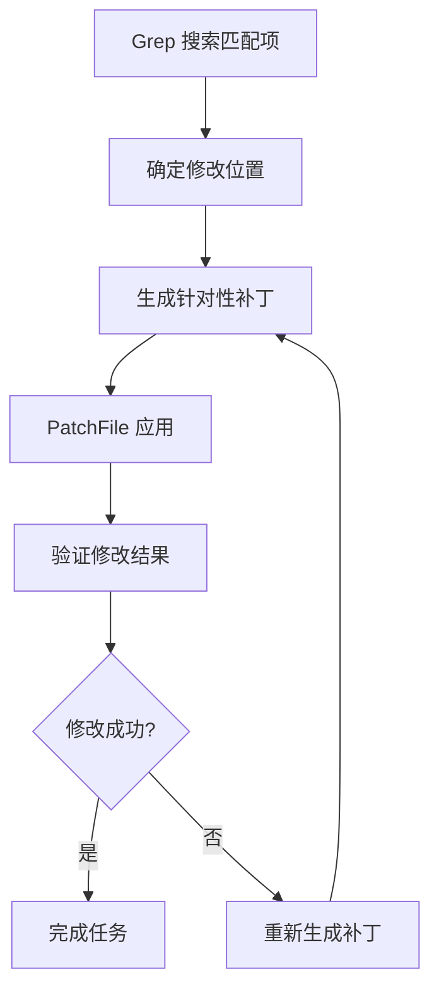
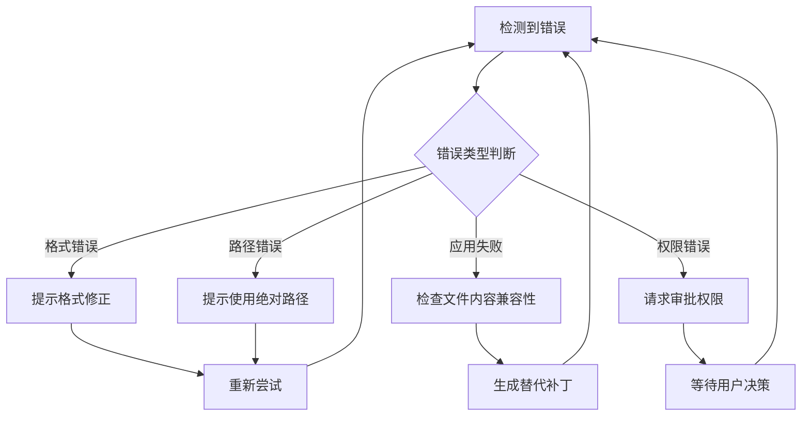

# PatchFile 工具详细文档

<cite>
**本文档中引用的文件**
- [patch.py](file://src/kimi_cli/tools/file/patch.py)
- [patch.md](file://src/kimi_cli/tools/file/patch.md)
- [approval.py](file://src/kimi_cli/soul/approval.py)
- [__init__.py](file://src/kimi_cli/tools/file/__init__.py)
- [utils.py](file://src/kimi_cli/tools/utils.py)
- [test_patch_file.py](file://tests/test_patch_file.py)
- [pyproject.toml](file://pyproject.toml)
</cite>

## 目录
1. [简介](#简介)
2. [核心功能](#核心功能)
3. [技术架构](#技术架构)
4. [输入参数详解](#输入参数详解)
5. [安全机制](#安全机制)
6. [使用限制](#使用限制)
7. [典型应用场景](#典型应用场景)
8. [工具集成工作流](#工具集成工作流)
9. [实际调用示例](#实际调用示例)
10. [错误处理机制](#错误处理机制)
11. [性能考虑](#性能考虑)
12. [故障排除指南](#故障排除指南)

## 简介

PatchFile 是 Kimi CLI 中一个专门用于将标准 diff 格式的补丁精确应用到目标文件的工具。该工具基于 `patch-ng` 库实现，能够处理统一格式的 diff 补丁，为代码变更的精确应用提供了强大的支持。

### 主要特性

- **精确应用**：基于统一 diff 格式，确保补丁的精确应用
- **安全性优先**：完整的路径验证和审批流程
- **多语言支持**：支持 Unicode 和各种字符编码
- **批量操作**：支持单个或多个补丁块的处理
- **实时反馈**：提供详细的执行结果和错误信息

## 核心功能

### 补丁解析与验证

PatchFile 工具的核心能力包括：



**图表来源**
- [patch.py](file://src/kimi_cli/tools/file/patch.py#L119-L167)

### 审批流程集成

工具实现了严格的审批机制，确保所有文件修改都经过授权：



**图表来源**
- [patch.py](file://src/kimi_cli/tools/file/patch.py#L107-L113)
- [approval.py](file://src/kimi_cli/soul/approval.py#L20-L75)

**章节来源**
- [patch.py](file://src/kimi_cli/tools/file/patch.py#L15-L43)
- [approval.py](file://src/kimi_cli/soul/approval.py#L10-L76)

## 技术架构

### 系统依赖

PatchFile 工具建立在以下核心技术之上：



**图表来源**
- [patch.py](file://src/kimi_cli/tools/file/patch.py#L1-L13)
- [pyproject.toml](file://pyproject.toml#L8-L26)

### 核心组件设计

PatchFile 类采用模块化设计，包含以下关键组件：

| 组件 | 功能 | 实现位置 |
|------|------|----------|
| 参数模型 | 定义输入参数结构 | `Params` 类 |
| 路径验证器 | 检查路径安全性 | `_validate_path` 方法 |
| 补丁解析器 | 解析 diff 字符串 | `_parse_patch` 函数 |
| 块计数器 | 统计补丁块数量 | `_count_hunks` 函数 |
| 补丁应用器 | 执行补丁应用 | `_apply_patch` 函数 |
| 错误处理器 | 处理各种异常情况 | 异常捕获逻辑 |

**章节来源**
- [patch.py](file://src/kimi_cli/tools/file/patch.py#L45-L173)

## 输入参数详解

### path 参数

**类型**: `str`  
**描述**: 目标文件的绝对路径  
**验证规则**:
- 必须是绝对路径
- 不能超出工作目录范围
- 文件必须存在且为普通文件

### diff 参数

**类型**: `str`  
**描述**: 统一格式的 diff 内容  
**格式要求**:
- 必须符合统一 diff 格式
- 使用 `diff -u` 或 `git diff` 生成
- 包含正确的文件时间戳信息

### 参数验证流程



**图表来源**
- [patch.py](file://src/kimi_cli/tools/file/patch.py#L78-L106)

**章节来源**
- [patch.py](file://src/kimi_cli/tools/file/patch.py#L45-L48)

## 安全机制

### 路径遍历防护

PatchFile 实现了严格的安全检查来防止路径遍历攻击：

```python
# 路径验证逻辑摘要
resolved_path = path.resolve()
resolved_work_dir = Path(self._work_dir).resolve()

if not str(resolved_path).startswith(str(resolved_work_dir)):
    return ToolError(
        message=f"`{path}` is outside the working directory. "
                "You can only patch files within the working directory."
    )
```

### 审批流程控制

所有文件修改操作都需要经过审批系统验证：



**图表来源**
- [approval.py](file://src/kimi_cli/soul/approval.py#L20-L75)

### 数据完整性保护

工具通过多重检查确保数据完整性：
- 应用前后内容对比
- 补丁块数量验证
- 文件编码一致性检查

**章节来源**
- [patch.py](file://src/kimi_cli/tools/file/patch.py#L60-L75)
- [approval.py](file://src/kimi_cli/soul/approval.py#L10-L76)

## 使用限制

### 支持的文件类型

| 类型 | 支持状态 | 说明 |
|------|----------|------|
| 文本文件 | ✅ 完全支持 | UTF-8、Unicode 等多种编码 |
| 二进制文件 | ❌ 不支持 | 仅处理纯文本内容 |
| 目录 | ❌ 不支持 | 只能处理普通文件 |
| 符号链接 | ⚠️ 有限支持 | 需要特殊处理 |

### 补丁格式限制

**必需格式**: 统一 diff 格式 (`diff -u` 或 `git diff`)
**不支持格式**:
- 二进制 diff
- 上下文 diff (context diff)
- 合并冲突标记
- 非标准扩展格式

### 系统环境要求

- Python ≥ 3.13
- patch-ng ≥ 1.19.0
- aiofiles ≥ 25.1.0
- 支持异步文件操作的文件系统

**章节来源**
- [patch.md](file://src/kimi_cli/tools/file/patch.md#L4-L8)
- [pyproject.toml](file://pyproject.toml#L8-L26)

## 典型应用场景

### 自动化代码修复

PatchFile 在代码质量改进中的典型应用：


### 版本迁移工具

支持从旧版本迁移到新版本的自动化工具：

- 配置文件格式更新
- API 接口签名变更
- 依赖库版本升级

### 代码重构助手

辅助开发者进行大规模代码重构：

- 命名规范统一
- 设计模式应用
- 性能优化调整

**章节来源**
- [patch.md](file://src/kimi_cli/tools/file/patch.md#L8-L9)

## 工具集成工作流

### 与 ReadFile 的协作



### 与 Grep 的配合使用



**图表来源**
- [__init__.py](file://src/kimi_cli/tools/file/__init__.py#L10-L29)

**章节来源**
- [__init__.py](file://src/kimi_cli/tools/file/__init__.py#L15-L30)

## 实际调用示例

### 基础补丁应用

以下是一个典型的补丁应用场景：

**输入参数**:
```json
{
    "path": "/project/src/main.py",
    "diff": "--- main.py\t2024-01-01 12:00:00.000000000 +0000\n+++ main.py\t2024-01-01 12:00:00.000000000 +0000\n@@ -10,5 +10,5 @@\n def calculate():\n     # Original calculation\n-    return x * y\n+    return x * y + z\n     # Additional logic\n"
}
```

**预期输出**:
```
File successfully patched. Applied 1 hunk(s) to /project/src/main.py.
```

### 多补丁块处理

支持同时应用多个补丁块的复杂场景：

**输入补丁**:
```
--- config.json	2024-01-01 10:00:00.000000000 +0000
+++ config.json	2024-01-01 10:00:00.000000000 +0000
@@ -1,3 +1,3 @@
 {
-  "version": "1.0",
+  "version": "1.1",
   "settings": {
     "timeout": 30,
@@ -5,3 +5,3 @@
     "retry_count": 3,
-    "max_connections": 10
+    "max_connections": 20
   }
 }
```

**执行结果**: 成功应用两个补丁块，版本号和连接数均正确更新。

### Unicode 文本处理

支持国际化文本的补丁应用：

**输入补丁**:
```
--- messages.txt	2024-01-01 08:00:00.000000000 +0000
+++ messages.txt	2024-01-01 08:00:00.000000000 +0000
@@ -1,2 +1,2 @@
-Hello 世界
+Hello 世界 (地球版)
 café
```

**章节来源**
- [test_patch_file.py](file://tests/test_patch_file.py#L12-L33)
- [test_patch_file.py](file://tests/test_patch_file.py#L62-L79)

## 错误处理机制

### 常见错误类型

| 错误类型 | 触发条件 | 错误消息示例 |
|----------|----------|--------------|
| 路径错误 | 相对路径或路径越界 | `"path" is not an absolute path.` |
| 文件不存在 | 目标文件不存在 | `"/path/to/file" does not exist.` |
| 格式错误 | 补丁格式无效 | `"Failed to parse diff content: invalid patch format"` |
| 应用失败 | 补丁与文件内容不兼容 | `"Failed to apply patch - patch may not be compatible"` |
| 无变化 | 补丁不产生实际修改 | `"No changes were made. The patch does not apply to the file."` |

### 错误恢复策略



**图表来源**
- [patch.py](file://src/kimi_cli/tools/file/patch.py#L169-L173)

**章节来源**
- [patch.py](file://src/kimi_cli/tools/file/patch.py#L82-L106)
- [patch.py](file://src/kimi_cli/tools/file/patch.py#L122-L167)

## 性能考虑

### 异步文件操作

PatchFile 使用 aiofiles 进行异步文件操作，提高 I/O 性能：

- **非阻塞读写**: 避免长时间文件操作阻塞主线程
- **并发处理**: 支持多个文件的并行处理
- **内存效率**: 流式处理大文件，减少内存占用

### 补丁解析优化


### 内存使用监控

工具实现了智能的内存使用控制：
- 最大字符数限制 (50,000)
- 最大行长度限制 (2,000)
- 输出截断机制

**章节来源**
- [patch.py](file://src/kimi_cli/tools/file/patch.py#L116-L118)
- [utils.py](file://src/kimi_cli/tools/utils.py#L32-L35)

## 故障排除指南

### 常见问题诊断

#### 补丁应用失败

**症状**: 补丁无法应用，返回 "Failed to apply patch" 错误

**可能原因**:
1. 文件内容与补丁不匹配
2. 补丁格式损坏
3. 文件被其他进程锁定

**解决方案**:
1. 验证文件内容是否发生变化
2. 重新生成补丁文件
3. 确保文件可写权限

#### Unicode 编码问题

**症状**: 补丁应用后出现乱码或编码错误

**解决方案**:
1. 确保文件使用 UTF-8 编码
2. 检查补丁内容的编码一致性
3. 使用适当的编码参数

#### 审批流程卡住

**症状**: 补丁应用请求被挂起，无法继续

**解决方案**:
1. 检查审批系统状态
2. 确认用户权限设置
3. 查看日志获取详细信息

### 调试技巧

1. **启用详细日志**: 设置日志级别为 DEBUG 获取更多信息
2. **分步验证**: 先验证补丁格式，再测试应用过程
3. **备份文件**: 在应用补丁前创建文件备份

**章节来源**
- [test_patch_file.py](file://tests/test_patch_file.py#L82-L126)
- [utils.py](file://src/kimi_cli/tools/utils.py#L142-L151)

## 结论

PatchFile 工具作为 Kimi CLI 生态系统中的重要组成部分，为代码变更的精确应用提供了可靠的技术保障。通过严格的安全部署、完善的错误处理机制和高效的性能表现，它能够满足各种复杂的代码修复需求。

### 关键优势

- **安全性**: 完整的路径验证和审批流程
- **可靠性**: 多重验证和错误恢复机制
- **易用性**: 直观的接口设计和详细的错误提示
- **性能**: 异步操作和智能资源管理

### 发展方向

未来的发展重点包括：
- 支持更多文件格式
- 增强错误诊断能力
- 优化大型项目处理性能
- 扩展多语言支持范围

PatchFile 工具将继续演进，为开发者提供更加强大和便捷的代码修改体验。