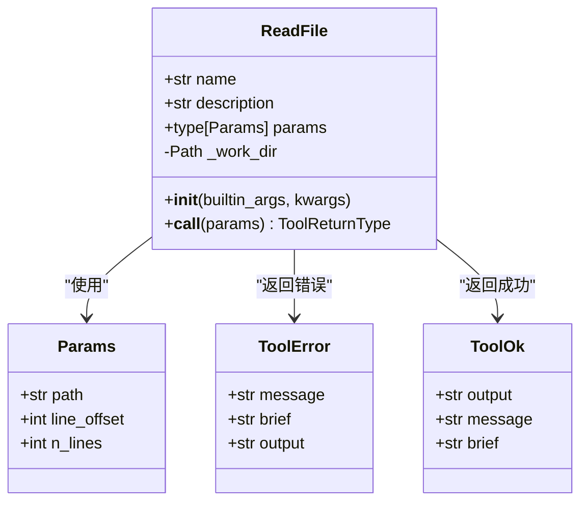
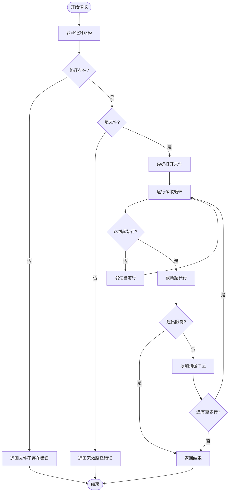
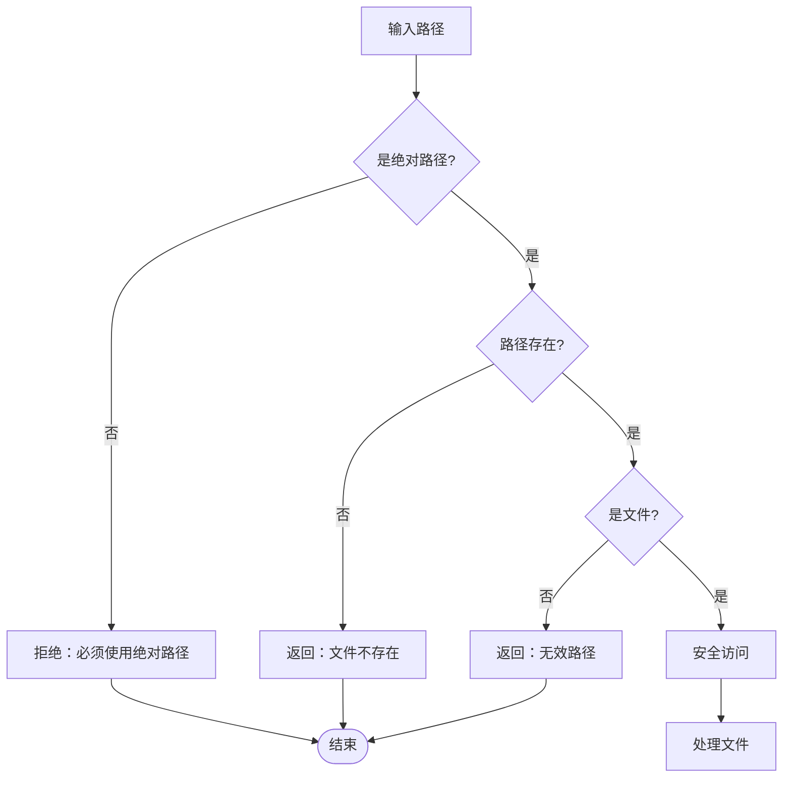
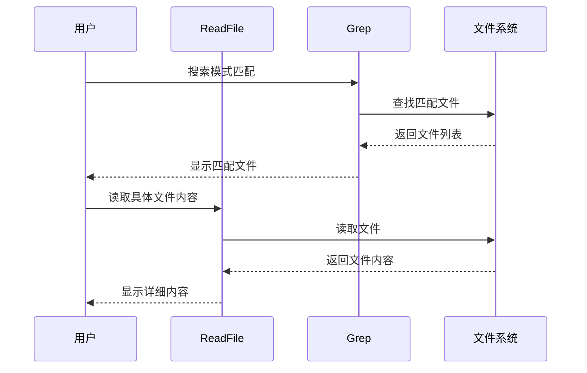
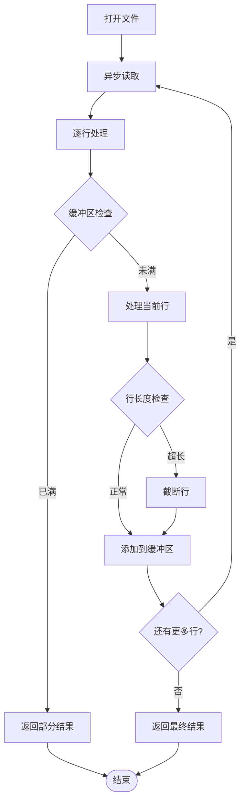

# ReadFile 工具

<cite>
**本文档中引用的文件**
- [read.py](file://src/kimi_cli/tools/file/read.py)
- [read.md](file://src/kimi_cli/tools/file/read.md)
- [grep.py](file://src/kimi_cli/tools/file/grep.py)
- [glob.py](file://src/kimi_cli/tools/file/glob.py)
- [test_read_file.py](file://tests/test_read_file.py)
- [utils.py](file://src/kimi_cli/tools/utils.py)
- [toolset.py](file://src/kimi_cli/soul/toolset.py)
</cite>

## 目录
1. [简介](#简介)
2. [核心功能](#核心功能)
3. [技术架构](#技术架构)
4. [输入参数详解](#输入参数详解)
5. [返回结构分析](#返回结构分析)
6. [安全机制](#安全机制)
7. [使用限制](#使用限制)
8. [实际应用示例](#实际应用示例)
9. [与其他工具的协作](#与其他工具的协作)
10. [性能优化](#性能优化)
11. [故障排除](#故障排除)
12. [总结](#总结)

## 简介

ReadFile 是 Kimi CLI 中一个核心的文件读取工具，专门设计用于安全、高效地读取本地文件内容。该工具提供了强大的文本编码自动检测能力、智能的错误处理机制，以及灵活的分页读取功能，是开发人员在软件开发任务中不可或缺的助手。

ReadFile 工具采用异步编程模型，支持大文件的分段读取，并具备完善的边界检查和安全防护机制。它不仅能够处理标准的 UTF-8 编码文件，还能优雅地处理各种编码问题，确保在不同环境下都能稳定运行。

## 核心功能

### 文件读取能力

ReadFile 工具的核心功能是读取指定路径的文件内容，支持以下特性：

- **绝对路径验证**：强制要求使用绝对路径，防止路径遍历攻击
- **文本编码检测**：自动检测并正确处理多种文本编码格式
- **行号显示**：以类似 `cat -n` 的格式显示行号，便于定位
- **分页读取**：支持从指定行开始读取指定数量的行
- **长度截断**：对过长的行进行智能截断，保持输出可读性

### 智能错误处理

工具实现了多层次的错误处理机制：

- **路径验证**：检查路径是否存在、是否为文件
- **权限检查**：验证文件读取权限
- **编码处理**：自动处理编码错误，使用替换字符
- **异常捕获**：统一的异常处理，提供清晰的错误信息

### 性能优化特性

- **异步 I/O**：使用 aiofiles 进行异步文件读取
- **内存控制**：限制单次读取的最大字节数和行数
- **流式处理**：逐行读取，避免一次性加载大文件到内存

**章节来源**
- [read.py](file://src/kimi_cli/tools/file/read.py#L56-L141)

## 技术架构

### 类结构设计



**图表来源**
- [read.py](file://src/kimi_cli/tools/file/read.py#L16-L35)
- [read.py](file://src/kimi_cli/tools/file/read.py#L38-L47)

### 数据流处理



**图表来源**
- [read.py](file://src/kimi_cli/tools/file/read.py#L60-L141)

**章节来源**
- [read.py](file://src/kimi_cli/tools/file/read.py#L1-L141)

## 输入参数详解

### path 参数

| 属性 | 值 |
|------|-----|
| 类型 | `str` |
| 必需 | 是 |
| 描述 | 要读取的文件的绝对路径 |
| 验证规则 | 必须是绝对路径，不能是相对路径 |

**关键特性：**
- 强制使用绝对路径，防止路径遍历攻击
- 自动验证路径的有效性和可访问性
- 支持跨平台路径格式

### line_offset 参数

| 属性 | 值 |
|------|-----|
| 类型 | `int` |
| 默认值 | `1` |
| 最小值 | `1` |
| 描述 | 开始读取的行号 |
| 使用场景 | 处理大文件时的分段读取 |

**使用示例：**
- `line_offset=1`：从第一行开始读取
- `line_offset=101`：从第101行开始读取
- `line_offset=1001`：从第1001行开始读取

### n_lines 参数

| 属性 | 值 |
|------|-----|
| 类型 | `int` |
| 默认值 | `1000` |
| 最大值 | `1000` |
| 最小值 | `1` |
| 描述 | 要读取的行数 |

**关键特性：**
- 单次最多读取 1000 行，防止内存溢出
- 可根据需要调整读取行数
- 与 `line_offset` 配合实现精确的分页读取

**章节来源**
- [read.py](file://src/kimi_cli/tools/file/read.py#L16-L35)

## 返回结构分析

### 成功响应 (ToolOk)

当文件读取成功时，工具返回 `ToolOk` 对象，包含以下字段：

| 字段 | 类型 | 描述 |
|------|------|------|
| `output` | `str` | 格式化后的文件内容，包含行号 |
| `message` | `str` | 详细的执行信息和统计 |
| `brief` | `str` | 简短的摘要信息 |

**输出格式示例：**
```
     1	Line 1 content
     2	Line 2 content
     3	Line 3 content
```

### 错误响应 (ToolError)

当发生错误时，工具返回 `ToolError` 对象：

| 字段 | 类型 | 描述 |
|------|------|------|
| `message` | `str` | 详细的错误信息 |
| `brief` | `str` | 简短的错误摘要 |
| `output` | `str` | 可选的中间结果 |

**常见错误类型：**
- 文件不存在：`File not found`
- 路径无效：`Invalid path`
- 绝对路径错误：`Invalid path`
- 权限不足：系统特定错误

**章节来源**
- [read.py](file://src/kimi_cli/tools/file/read.py#L132-L141)

## 安全机制

### 路径安全验证

ReadFile 实现了严格的安全检查机制：



**图表来源**
- [read.py](file://src/kimi_cli/tools/file/read.py#L63-L81)

### 写入权限分离

ReadFile 工具的一个重要安全特性是它不需要写入权限，但仍需要用户审批才能访问敏感路径。这种设计遵循了最小权限原则：

- **只读操作**：完全基于读取操作，不修改任何文件
- **用户审批**：对于可能包含敏感信息的路径，需要用户明确授权
- **路径隔离**：限制在工作目录范围内访问

### 敏感路径保护

虽然 ReadFile 不需要写入权限，但系统仍然会对潜在的敏感路径进行保护：

- **配置文件**：避免读取系统配置文件
- **密码文件**：防止读取密码或密钥文件
- **日志文件**：限制对日志文件的访问
- **临时文件**：防止读取临时文件内容

**章节来源**
- [read.py](file://src/kimi_cli/tools/file/read.py#L58-L60)

## 使用限制

### 文件大小限制

ReadFile 工具设置了严格的大小限制以确保系统稳定性：

| 限制类型 | 数值 | 说明 |
|----------|------|------|
| 最大行数 | 1000 行 | 单次读取最多 1000 行 |
| 最大行长度 | 2000 字符 | 单行最长 2000 字符 |
| 最大字节数 | 100 KB | 单次读取最多 100KB |

### 二进制文件处理

ReadFile 工具专门设计用于处理文本文件：

- **文本文件优先**：默认处理 UTF-8 编码的文本文件
- **编码容错**：自动处理编码错误，使用替换字符
- **二进制文件**：不支持直接读取二进制文件
- **替代方案**：对于二进制文件，建议使用 Bash 工具中的适当命令

### 并发限制

为了防止资源滥用，ReadFile 实现了并发控制：

- **单文件限制**：每个文件同时只能有一个读取请求
- **队列管理**：多个请求按顺序处理
- **超时机制**：长时间未完成的操作会自动终止

**章节来源**
- [read.py](file://src/kimi_cli/tools/file/read.py#L11-L13)

## 实际应用示例

### 基本文件读取

**提示词示例：**
```
请读取src/main.py的内容
```

**预期响应：**
```
<system>
5 lines read from file starting from line 1. End of file reached.
</system>
1     def main():
2         print("Hello, World!")
3     
4     if __name__ == "__main__":
5         main()
```

### 分段读取大文件

**提示词示例：**
```
请读取项目根目录下的requirements.txt文件，从第10行开始读取5行
```

**参数设置：**
```json
{
    "path": "/path/to/project/requirements.txt",
    "line_offset": 10,
    "n_lines": 5
}
```

### 处理超长行

**提示词示例：**
```
请读取配置文件config.json的内容，注意处理可能的超长行
```

**系统通知：**
```
20 lines read from file starting from line 1. Lines [15, 18] were truncated.
```

### 批量文件读取

**提示词示例：**
```
请并行读取所有Python源文件的内容
```

**最佳实践：**
- 使用 Glob 工具先查找文件
- 然后并行调用 ReadFile 读取内容
- 利用系统的并行处理能力

**章节来源**
- [test_read_file.py](file://tests/test_read_file.py#L27-L88)

## 与其他工具的协作

### 与 Grep 工具的配合

ReadFile 和 Grep 工具形成了完美的互补关系：



**图表来源**
- [grep.py](file://src/kimi_cli/tools/file/grep.py#L243-L302)
- [read.py](file://src/kimi_cli/tools/file/read.py#L56-L141)

### 与 Glob 工具的集成

Glob 工具负责文件发现，ReadFile 负责内容读取：

**协作流程：**
1. 使用 Glob 工具查找目标文件
2. 获取文件列表后，批量调用 ReadFile
3. 合并所有文件内容进行分析

**优势：**
- 提高效率：避免单独处理每个文件
- 减少错误：统一的错误处理机制
- 增强功能：结合搜索和读取能力

### 与 WriteFile 工具的关系

ReadFile 和 WriteFile 在权限设计上形成对比：

| 工具 | 权限需求 | 主要功能 | 安全级别 |
|------|----------|----------|----------|
| ReadFile | 只读权限 | 文件内容读取 | 高 |
| WriteFile | 写入权限 | 文件内容修改 | 中 |

**章节来源**
- [read.py](file://src/kimi_cli/tools/file/read.py#L12-L13)
- [glob.py](file://src/kimi_cli/tools/file/glob.py#L17-L29)

## 性能优化

### 异步 I/O 优化

ReadFile 使用 aiofiles 实现异步文件读取：

- **非阻塞操作**：文件读取不会阻塞主线程
- **并发处理**：可以同时处理多个文件读取请求
- **资源管理**：自动管理文件句柄的打开和关闭

### 内存使用优化



**图表来源**
- [read.py](file://src/kimi_cli/tools/file/read.py#L86-L110)

### 缓存策略

虽然 ReadFile 本身不实现缓存，但它与系统的其他组件协同工作：

- **文件系统缓存**：操作系统级别的文件缓存
- **工具调用缓存**：避免重复读取相同文件
- **结果缓存**：对频繁查询的内容进行缓存

**章节来源**
- [read.py](file://src/kimi_cli/tools/file/read.py#L91-L110)

## 故障排除

### 常见错误及解决方案

| 错误类型 | 错误信息 | 解决方案 |
|----------|----------|----------|
| 路径错误 | `Invalid path` | 使用绝对路径 |
| 文件不存在 | `File not found` | 检查文件路径和权限 |
| 非文件对象 | `Invalid path` | 确认路径指向的是文件而非目录 |
| 编码错误 | `Failed to read file` | 文件可能包含损坏的编码 |

### 性能问题诊断

**问题症状：**
- 读取速度慢
- 内存使用过高
- 文件读取超时

**诊断步骤：**
1. 检查文件大小是否超过限制
2. 验证路径是否正确
3. 确认文件权限设置
4. 检查系统资源使用情况

### 调试技巧

**启用详细日志：**
```bash
export KIMI_DEBUG=true
kimi
```

**分步调试：**
1. 先使用 Glob 工具确认文件存在
2. 尝试读取小文件验证基本功能
3. 逐步增加复杂度测试边界条件

**章节来源**
- [test_read_file.py](file://tests/test_read_file.py#L92-L128)

## 总结

ReadFile 工具是 Kimi CLI 生态系统中的核心组件，它通过以下特性为用户提供可靠、高效的文件读取服务：

### 核心优势

1. **安全性**：严格的路径验证和权限控制
2. **可靠性**：完善的错误处理和异常恢复机制
3. **性能**：异步 I/O 和内存优化
4. **易用性**：直观的参数设计和清晰的错误信息
5. **扩展性**：良好的模块化设计，易于维护和扩展

### 应用场景

- **代码审查**：快速查看源代码文件
- **配置管理**：读取和分析配置文件
- **日志分析**：提取和分析日志内容
- **文档阅读**：查看项目文档和说明文件
- **批量处理**：与其他工具配合进行批量文件处理

### 最佳实践

1. **合理使用分页参数**：对于大文件，使用 `line_offset` 和 `n_lines` 进行分段读取
2. **结合其他工具**：与 Grep 和 Glob 工具配合使用，提高工作效率
3. **注意安全限制**：遵守系统的安全策略，避免访问敏感路径
4. **监控资源使用**：关注文件大小和读取时间，避免系统资源耗尽

ReadFile 工具的设计体现了现代软件开发中对安全性、性能和用户体验的平衡考虑，是构建可靠 AI 辅助开发环境的重要基础组件。