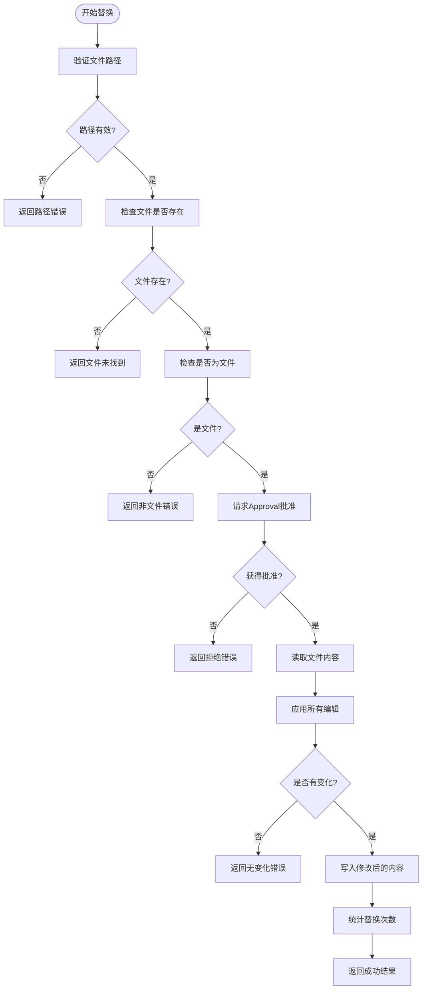

# StrReplaceFile 工具详细文档

<cite>
**本文档引用的文件**
- [replace.py](file://src/kimi_cli/tools/file/replace.py)
- [replace.md](file://src/kimi_cli/tools/file/replace.md)
- [approval.py](file://src/kimi_cli/soul/approval.py)
- [write.py](file://src/kimi_cli/tools/file/write.py)
- [read.py](file://src/kimi_cli/tools/file/read.py)
- [__init__.py](file://src/kimi_cli/tools/file/__init__.py)
- [test_str_replace_file.py](file://tests/test_str_replace_file.py)
</cite>

## 目录
1. [简介](#简介)
2. [核心功能概述](#核心功能概述)
3. [技术架构](#技术架构)
4. [输入参数详解](#输入参数详解)
5. [匹配逻辑与安全设计](#匹配逻辑与安全设计)
6. [使用示例](#使用示例)
7. [与WriteFile工具的区别](#与writefile工具的区别)
8. [多行字符串替换处理](#多行字符串替换处理)
9. [安全性设计](#安全性设计)
10. [性能考虑与大文件处理](#性能考虑与大文件处理)
11. [错误处理与故障排除](#错误处理与故障排除)
12. [最佳实践](#最佳实践)

## 简介

StrReplaceFile是Kimi CLI中的一个强大文件编辑工具，专门用于在指定文件中执行精确的字符串替换操作。该工具采用安全的Approval机制，确保每次文件修改都经过用户确认，并提供详细的diff预览功能，是代码重构和配置批量修改的理想选择。

## 核心功能概述

StrReplaceFile工具的核心能力包括：

- **精确字符串替换**：支持单个或多个字符串的精确匹配替换
- **多行内容处理**：完整支持多行字符串的替换操作
- **批量编辑**：一次调用可执行多个替换操作
- **安全审批机制**：所有修改操作都需要Approval确认
- **智能检测**：自动检测替换是否成功，避免无效操作

## 技术架构


**图表来源**
- [replace.py](file://src/kimi_cli/tools/file/replace.py#L30-L145)
- [approval.py](file://src/kimi_cli/soul/approval.py#L10-L76)
- [__init__.py](file://src/kimi_cli/tools/file/__init__.py#L10-L13)

**章节来源**
- [replace.py](file://src/kimi_cli/tools/file/replace.py#L1-L145)
- [approval.py](file://src/kimi_cli/soul/approval.py#L1-L76)

## 输入参数详解

StrReplaceFile工具接受两个主要参数：

### path参数
- **类型**：`str`
- **描述**：要编辑文件的绝对路径
- **要求**：必须是绝对路径，不能是相对路径
- **验证**：系统会检查路径的有效性和安全性

### edit参数
edit参数可以是单个Edit对象或Edit对象列表：

#### 单个Edit对象
```python
Edit(
    old="旧字符串",           # 要被替换的字符串
    new="新字符串",           # 替换后的新字符串
    replace_all=False         # 是否替换所有出现，默认只替换第一个
)
```

#### 多个Edit对象
```python
[
    Edit(old="first", new="one", replace_all=True),
    Edit(old="second", new="two", replace_all=False)
]
```

**章节来源**
- [replace.py](file://src/kimi_cli/tools/file/replace.py#L20-L27)
- [replace.py](file://src/kimi_cli/tools/file/replace.py#L14-L18)

## 匹配逻辑与安全设计

### 精确字符串匹配
StrReplaceFile采用Python内置的字符串精确匹配算法，不支持正则表达式。这意味着：
- 字符串匹配是字面意义上的完全相等
- 大小写敏感
- 支持Unicode字符
- 不支持通配符或模式匹配

### 匹配算法实现


**图表来源**
- [replace.py](file://src/kimi_cli/tools/file/replace.py#L65-L144)

**章节来源**
- [replace.py](file://src/kimi_cli/tools/file/replace.py#L57-L62)

## 使用示例

### 基本字符串替换
将文件中的特定字符串替换为新值：

```python
# 将所有import utils改为import helper
result = await str_replace_file_tool(
    Params(
        path="/project/src/main.py",
        edit=Edit(old="import utils", new="import helper")
    )
)
```

### 批量替换操作
一次性执行多个替换：

```python
# 批量替换多个import语句
result = await str_replace_file_tool(
    Params(
        path="/project/src/main.py",
        edit=[
            Edit(old="from utils import", new="from helper import"),
            Edit(old="import utils", new="import helper"),
            Edit(old="utils.", new="helper.")
        ]
    )
)
```

### 全局替换与局部替换混合
同时使用全局替换和局部替换：

```python
# 只替换第一个出现的特定字符串，其他保持不变
result = await str_replace_file_tool(
    Params(
        path="/project/src/config.py",
        edit=[
            Edit(old="DEBUG = True", new="DEBUG = False", replace_all=False),
            Edit(old="ENVIRONMENT = 'dev'", new="ENVIRONMENT = 'prod'", replace_all=True)
        ]
    )
)
```

### 多行内容替换
替换跨越多行的文本块：

```python
# 替换函数定义
result = await str_replace_file_tool(
    Params(
        path="/project/src/utils.py",
        edit=Edit(
            old="""def old_function():
    \"\"\"Old documentation\"\"\"
    return "old_value\"""",
            new="""def new_function():
    \"\"\"New documentation\"\"\"
    return "new_value\""""
        )
    )
)
```

**章节来源**
- [test_str_replace_file.py](file://tests/test_str_replace_file.py#L14-L28)
- [test_str_replace_file.py](file://tests/test_str_replace_file.py#L51-L69)
- [test_str_replace_file.py](file://tests/test_str_replace_file.py#L73-L90)

## 与WriteFile工具的区别

| 特性 | StrReplaceFile | WriteFile |
|------|----------------|-----------|
| **操作类型** | 字符串替换 | 完整内容重写 |
| **目标** | 修改现有内容 | 创建或重写文件 |
| **安全性** | 需要Approval确认 | 需要Approval确认 |
| **适用场景** | 代码重构、配置修改 | 文件创建、内容重写 |
| **性能** | 只读取和写入变更部分 | 读取整个文件，写入全部内容 |
| **原子性** | 单次替换操作 | 单次写入操作 |

### StrReplaceFile的优势
- **精确控制**：只替换指定内容，保留其他部分不变
- **安全性高**：需要Approval确认，避免意外修改
- **性能优化**：只处理变更的部分，减少I/O操作
- **多编辑支持**：一次调用可执行多个替换操作

### WriteFile的适用场景
- 创建新文件
- 完全重写现有文件内容
- 批量生成配置文件

**章节来源**
- [replace.py](file://src/kimi_cli/tools/file/replace.py#L7-L8)
- [write.py](file://src/kimi_cli/tools/file/write.py#L1-L2)

## 多行字符串替换处理

### 边界处理规则

StrReplaceFile在处理多行字符串替换时遵循以下规则：

1. **完整匹配原则**：只有当多行字符串完全匹配时才会进行替换
2. **换行符处理**：准确识别和处理`\n`、`\r\n`等不同平台的换行符
3. **空白字符保留**：替换过程中保持原有的缩进和空白字符
4. **跨行匹配**：支持跨越多行的字符串匹配和替换

### 实际处理流程


**图表来源**
- [replace.py](file://src/kimi_cli/tools/file/replace.py#L102-L122)

### 示例：函数体替换

```python
# 原始代码
old_code = '''def process_data(data):
    # 处理数据
    result = transform(data)
    return result'''

# 新代码
new_code = '''def process_data(data):
    # 新的数据处理逻辑
    result = clean_and_transform(data)
    return result'''

# 执行替换
result = await str_replace_file_tool(
    Params(
        path="/project/src/data_processor.py",
        edit=Edit(old=old_code, new=new_code)
    )
)
```

**章节来源**
- [test_str_replace_file.py](file://tests/test_str_replace_file.py#L73-L90)

## 安全性设计

### Approval机制

StrReplaceFile实现了严格的Approval安全机制：


**图表来源**
- [approval.py](file://src/kimi_cli/soul/approval.py#L20-L70)

### 路径安全验证

系统实施了多层次的路径安全检查：

1. **绝对路径检查**：确保只处理绝对路径
2. **工作目录限制**：防止访问工作目录之外的文件
3. **路径遍历防护**：阻止`../`等路径遍历攻击
4. **文件存在性验证**：确保目标文件确实存在

### 权限控制

- **只读访问**：默认情况下以只读方式打开文件
- **写入确认**：所有写入操作都需要Approval确认
- **原子操作**：替换操作是原子性的，避免部分写入导致的文件损坏

**章节来源**
- [replace.py](file://src/kimi_cli/tools/file/replace.py#L40-L55)
- [approval.py](file://src/kimi_cli/soul/approval.py#L1-L76)

## 性能考虑与大文件处理

### 性能特点

StrReplaceFile在设计时充分考虑了性能因素：

- **内存效率**：采用流式读取，避免一次性加载大文件到内存
- **增量处理**：只处理实际发生变化的部分
- **异步I/O**：使用aiofiles进行异步文件操作
- **快速失败**：在检测到无效操作时立即返回，避免不必要的计算

### 大文件处理建议

虽然StrReplaceFile设计上可以处理较大文件，但在处理超大文件时仍需注意：

1. **分批处理**：对于特别大的文件，考虑分批进行替换操作
2. **内存监控**：关注系统内存使用情况，避免内存不足
3. **时间估算**：大文件替换可能需要较长时间，提前做好时间规划
4. **备份策略**：对重要文件进行备份后再执行替换操作

### 性能优化技巧

```python
# 推荐：使用replace_all=True进行批量替换
result = await str_replace_file_tool(
    Params(
        path="/large_file.py",
        edit=Edit(old="old_string", new="new_string", replace_all=True)
    )
)

# 避免：多次单独调用进行相同替换
# 这种方式效率较低，不推荐
```

**章节来源**
- [replace.py](file://src/kimi_cli/tools/file/replace.py#L102-L122)

## 错误处理与故障排除

### 常见错误类型

| 错误类型 | 描述 | 解决方案 |
|----------|------|----------|
| **路径错误** | 提供的路径不是绝对路径 | 使用绝对路径重新调用 |
| **文件不存在** | 指定的文件不存在 | 检查文件路径是否正确 |
| **非文件对象** | 路径指向的是目录而非文件 | 确保路径指向具体文件 |
| **路径越界** | 文件位于工作目录之外 | 将文件移动到工作目录内 |
| **无替换发生** | 旧字符串在文件中不存在 | 检查旧字符串是否拼写正确 |
| **Approval拒绝** | 用户拒绝了替换操作 | 重新确认操作必要性 |

### 故障排除流程


### 调试技巧

1. **启用详细日志**：查看详细的错误信息和操作记录
2. **逐步测试**：先测试简单的替换操作，再进行复杂操作
3. **备份验证**：在执行替换前备份原文件
4. **Approval检查**：确认Approval系统正常工作

**章节来源**
- [replace.py](file://src/kimi_cli/tools/file/replace.py#L69-L144)
- [test_str_replace_file.py](file://tests/test_str_replace_file.py#L110-L122)

## 最佳实践

### 开发建议

1. **使用Approval机制**：始终启用Approval功能确保操作安全
2. **编写测试用例**：为关键替换操作编写自动化测试
3. **版本控制集成**：在执行重要替换前提交版本控制
4. **渐进式替换**：先进行小范围测试，再推广到整个项目

### 生产环境使用

1. **备份策略**：在生产环境中执行替换前务必备份
2. **Approval配置**：合理配置Approval设置，平衡安全性和效率
3. **监控告警**：建立替换操作的监控和告警机制
4. **回滚准备**：准备好快速回滚方案

### 代码质量保证

```python
# 推荐的最佳实践
async def update_import_statements(file_path: str):
    """更新项目中的import语句"""
    edits = [
        Edit(old="import utils", new="from helper import utils"),
        Edit(old="from utils import", new="from helper import"),
        Edit(old="utils.", new="helper.")
    ]
    
    result = await str_replace_file_tool(
        Params(path=file_path, edit=edits)
    )
    
    if isinstance(result, ToolOk):
        print(f"成功更新 {len(edits)} 个import语句")
    else:
        print(f"更新失败: {result.message}")
```

### 性能优化建议

1. **批量操作**：尽可能使用批量替换而不是多次单独调用
2. **选择性替换**：使用`replace_all=False`只替换必要的实例
3. **文件大小控制**：避免对超大文件进行复杂的替换操作
4. **定期维护**：定期清理和优化大型项目的文件结构

**章节来源**
- [replace.md](file://src/kimi_cli/tools/file/replace.md#L3-L8)
- [test_str_replace_file.py](file://tests/test_str_replace_file.py#L1-L217)