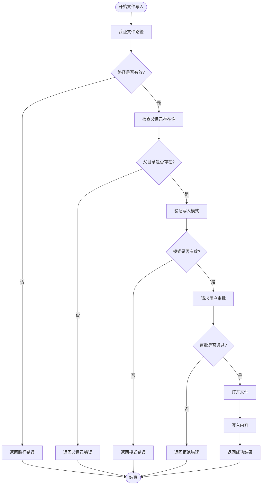
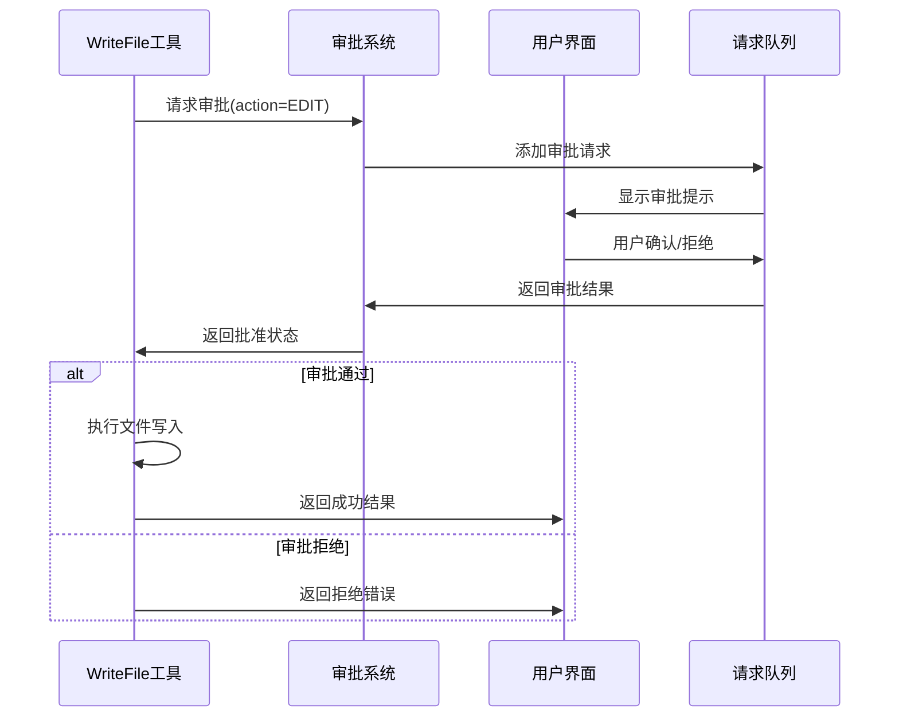
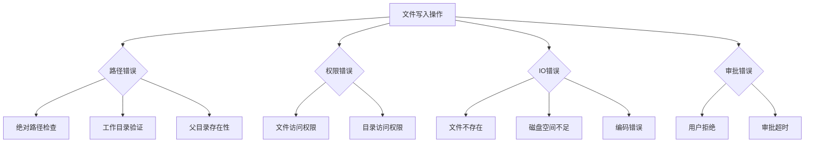
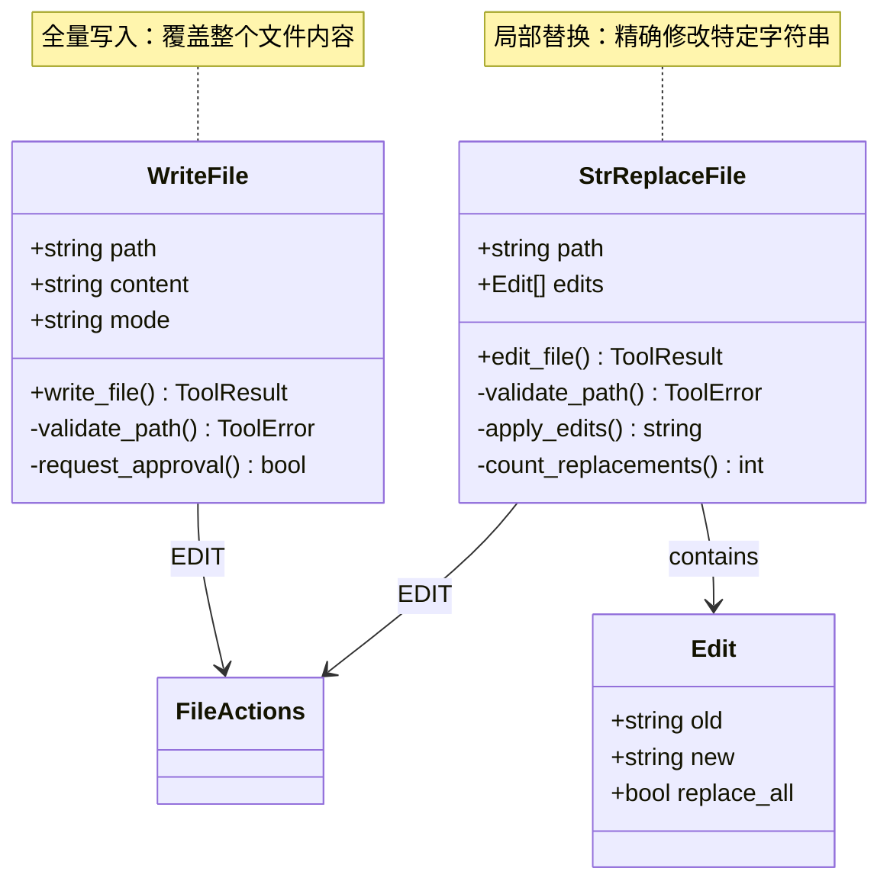
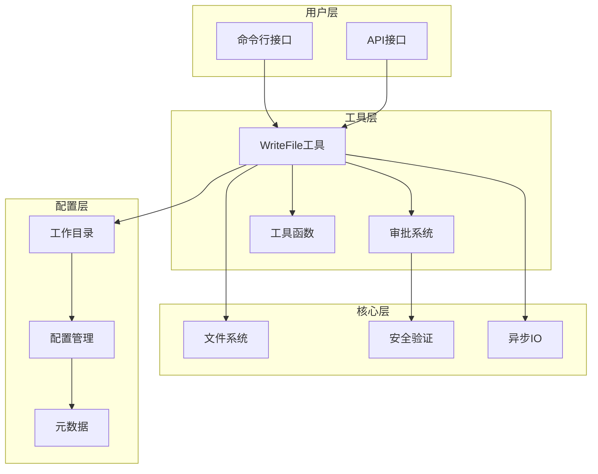

# WriteFile 工具详细文档

<cite>
**本文档中引用的文件**
- [write.py](file://src/kimi_cli/tools/file/write.py)
- [write.md](file://src/kimi_cli/tools/file/write.md)
- [approval.py](file://src/kimi_cli/soul/approval.py)
- [runtime.py](file://src/kimi_cli/soul/runtime.py)
- [utils.py](file://src/kimi_cli/tools/utils.py)
- [test_write_file.py](file://tests/test_write_file.py)
- [replace.py](file://src/kimi_cli/tools/file/replace.py)
- [replace.md](file://src/kimi_cli/tools/file/replace.md)
- [__init__.py](file://src/kimi_cli/tools/file/__init__.py)
</cite>

## 目录
1. [简介](#简介)
2. [核心功能](#核心功能)
3. [输入参数详解](#输入参数详解)
4. [安全审批机制](#安全审批机制)
5. [异常处理逻辑](#异常处理逻辑)
6. [使用示例](#使用示例)
7. [与StrReplaceFile的区别](#与strreplacefile的区别)
8. [使用限制](#使用限制)
9. [架构设计](#架构设计)
10. [故障排除指南](#故障排除指南)

## 简介

WriteFile工具是一个高风险的文件写入工具，专门用于在指定路径创建或覆盖文件内容。该工具实现了严格的安全控制机制，包括路径验证、工作目录限制和用户审批流程，确保文件操作的安全性。

### 主要特性
- **全量写入模式**：支持完全覆盖现有文件内容或向文件追加内容
- **双重安全验证**：路径安全检查和用户审批双重保障
- **异步操作**：基于aiofiles的异步文件写入
- **UTF-8编码支持**：完整的Unicode字符支持
- **详细的错误报告**：提供清晰的操作失败原因

## 核心功能

WriteFile工具提供了两种文件写入模式：

### 覆盖模式 (overwrite)
- 完全替换目标文件的现有内容
- 如果文件不存在，则创建新文件
- 默认模式，无需显式指定

### 追加模式 (append)
- 在现有文件末尾添加新内容
- 如果文件不存在，则创建新文件
- 支持多行内容追加



**图表来源**
- [write.py](file://src/kimi_cli/tools/file/write.py#L55-L120)

**章节来源**
- [write.py](file://src/kimi_cli/tools/file/write.py#L1-L120)
- [write.md](file://src/kimi_cli/tools/file/write.md#L1-L6)

## 输入参数详解

WriteFile工具接受以下参数：

### 参数结构

| 参数名 | 类型 | 必需 | 描述 |
|--------|------|------|------|
| path | str | 是 | 文件的绝对路径 |
| content | str | 是 | 要写入的内容 |
| mode | Literal["overwrite", "append"] | 否 | 写入模式，默认为"overwrite" |

### 参数详细说明

#### path (必需)
- **类型**: 字符串
- **格式**: 绝对路径
- **验证**: 必须以工作目录开头，防止路径遍历攻击
- **示例**: `/home/user/project/file.txt`

#### content (必需)
- **类型**: 字符串
- **大小**: 支持任意长度内容
- **编码**: UTF-8编码
- **特殊字符**: 支持所有Unicode字符

#### mode (可选)
- **默认值**: "overwrite"
- **选项**: 
  - `"overwrite"`: 完全覆盖文件内容
  - `"append"`: 在文件末尾追加内容

**章节来源**
- [write.py](file://src/kimi_cli/tools/file/write.py#L14-L25)

## 安全审批机制

WriteFile工具实现了严格的审批流程，确保每次文件写入操作都经过用户确认。

### 审批流程架构



**图表来源**
- [approval.py](file://src/kimi_cli/soul/approval.py#L20-L76)
- [write.py](file://src/kimi_cli/tools/file/write.py#L92-L98)

### 审批机制特点

1. **强制审批**: 每次文件写入都需要用户确认
2. **会话级自动批准**: 可配置特定操作的自动批准
3. **YOLO模式**: 开发调试时可禁用审批检查
4. **详细描述**: 提供清晰的操作描述帮助用户决策

**章节来源**
- [approval.py](file://src/kimi_cli/soul/approval.py#L1-L76)
- [write.py](file://src/kimi_cli/tools/file/write.py#L92-L98)

## 异常处理逻辑

WriteFile工具实现了全面的错误处理机制，涵盖各种可能的异常情况。

### 错误类型分类



**图表来源**
- [write.py](file://src/kimi_cli/tools/file/write.py#L60-L120)

### 具体错误处理

#### 路径相关错误
- **非绝对路径**: 路径必须是绝对路径
- **路径遍历**: 防止../等路径遍历攻击
- **工作目录外**: 只能操作工作目录内的文件

#### 权限相关错误
- **父目录不存在**: 自动创建父目录
- **文件只读**: 检查文件写入权限
- **磁盘空间**: 检查可用磁盘空间

#### 审批相关错误
- **用户拒绝**: 用户明确拒绝操作
- **审批超时**: 审批等待时间过长
- **系统错误**: 审批系统内部错误

**章节来源**
- [write.py](file://src/kimi_cli/tools/file/write.py#L37-L120)
- [utils.py](file://src/kimi_cli/tools/utils.py#L142-L151)

## 使用示例

以下是WriteFile工具的实际使用示例：

### 基本文件写入

```python
# 创建新文件
result = await write_file_tool(
    Params(
        path="/home/user/project/main.py",
        content="# This is a Python script\nprint('Hello, World!')"
    )
)
```

### 多行内容写入

```python
# 写入多行Python代码
content = '''#!/usr/bin/env python3
# -*- coding: utf-8 -*-

import os
import sys

def main():
    """Main function."""
    print("Hello from Python!")
    
if __name__ == "__main__":
    main()
'''
```

### Unicode内容写入

```python
# 写入包含特殊字符的内容
unicode_content = "Hello 世界 🌍\nUnicode: café, naïve, résumé\n测试中文字符"
```

### 追加模式使用

```python
# 追加内容到现有文件
result = await write_file_tool(
    Params(
        path="/home/user/project/log.txt",
        content="\n[2024-01-01] New log entry",
        mode="append"
    )
)
```

### 大文件分段写入

```python
# 对于大内容，建议分段写入
large_content = "Line 1\n" * 1000

# 第一次写入（覆盖）
await write_file_tool(
    Params(
        path="/home/user/project/large_file.txt",
        content=large_content
    )
)

# 后续追加
await write_file_tool(
    Params(
        path="/home/user/project/large_file.txt",
        content="\nAdditional content",
        mode="append"
    )
)
```

**章节来源**
- [test_write_file.py](file://tests/test_write_file.py#L14-L162)

## 与StrReplaceFile的区别

WriteFile和StrReplaceFile是两个互补的文件操作工具，各自有不同的使用场景和功能特点。

### 功能对比表

| 特性 | WriteFile | StrReplaceFile |
|------|-----------|----------------|
| **操作方式** | 全量写入 | 局部替换 |
| **适用场景** | 新建文件、完全重写 | 修改特定内容 |
| **性能特点** | 读取整个文件 | 只读取需要修改的部分 |
| **复杂度** | 简单直接 | 支持多个替换规则 |
| **推荐使用** | 首次写入、批量替换 | 精确修改、多处替换 |

### 架构差异



**图表来源**
- [write.py](file://src/kimi_cli/tools/file/write.py#L27-L120)
- [replace.py](file://src/kimi_cli/tools/file/replace.py#L30-L144)

### 使用场景建议

#### 选择WriteFile的情况：
- 首次创建文件
- 需要完全重写文件内容
- 内容结构简单明了
- 性能要求不高

#### 选择StrReplaceFile的情况：
- 需要修改现有文件的特定部分
- 需要应用多个替换规则
- 文件较大，不想读取整个文件
- 需要精确控制替换行为

**章节来源**
- [replace.py](file://src/kimi_cli/tools/file/replace.py#L1-L144)
- [replace.md](file://src/kimi_cli/tools/file/replace.md#L3-L8)

## 使用限制

WriteFile工具实施了多项安全限制，确保系统的安全性。

### 内容长度限制

| 限制类型 | 数值 | 说明 |
|----------|------|------|
| 单次写入最大字符数 | 50,000 | 默认字符限制 |
| 单行最大长度 | 2,000 | 默认行长度限制 |
| 内存使用 | 动态分配 | 根据内容大小动态调整 |

### 目录访问限制

#### 工作目录保护
- **范围**: 只能操作配置的工作目录及其子目录
- **验证**: 路径解析后必须以工作目录开头
- **目的**: 防止路径遍历攻击

#### 系统关键目录禁止
- **根目录**: `/` 和 `\`（Windows）
- **系统目录**: `/etc`, `/usr`, `/var` 等
- **用户目录**: `/home`, `/users` 等
- **配置文件**: `.env`, `.config` 等敏感文件

### 文件类型限制

#### 支持的文件类型
- 文本文件（.txt, .md, .py, .js等）
- 配置文件（.json, .yaml, .xml等）
- 日志文件
- 源代码文件

#### 不支持的文件类型
- 可执行文件
- 系统二进制文件
- 压缩文件
- 数据库文件

### 审批限制

#### 自动批准条件
- **会话内重复操作**: 同一操作在当前会话内可自动批准
- **预设白名单**: 配置特定操作的自动批准
- **YOLO模式**: 开发调试时禁用审批检查

#### 审批超时设置
- **默认超时**: 30秒
- **可配置**: 支持自定义超时时间
- **取消机制**: 用户可随时取消审批请求

**章节来源**
- [utils.py](file://src/kimi_cli/tools/utils.py#L32-L35)
- [write.py](file://src/kimi_cli/tools/file/write.py#L37-L52)

## 架构设计

WriteFile工具采用了模块化的架构设计，确保代码的可维护性和扩展性。

### 整体架构图



**图表来源**
- [write.py](file://src/kimi_cli/tools/file/write.py#L1-L120)
- [runtime.py](file://src/kimi_cli/soul/runtime.py#L66-L101)

### 核心组件说明

#### 1. 参数验证组件
- **Pydantic模型**: 提供类型检查和默认值设置
- **路径验证**: 确保路径安全性和有效性
- **模式验证**: 验证写入模式的有效性

#### 2. 安全验证组件
- **路径解析**: 防止路径遍历攻击
- **工作目录检查**: 确保操作在允许范围内
- **权限检查**: 验证文件访问权限

#### 3. 异步处理组件
- **aiofiles**: 异步文件操作
- **事件循环**: 非阻塞I/O处理
- **并发控制**: 支持同时进行多个操作

#### 4. 错误处理组件
- **ToolError**: 统一的错误处理接口
- **异常捕获**: 捕获并转换各种异常
- **错误报告**: 提供详细的错误信息

**章节来源**
- [write.py](file://src/kimi_cli/tools/file/write.py#L14-L25)
- [write.py](file://src/kimi_cli/tools/file/write.py#L37-L52)

## 故障排除指南

### 常见问题及解决方案

#### 1. 路径相关问题

**问题**: `Path outside working directory`
- **原因**: 尝试访问工作目录之外的文件
- **解决**: 使用工作目录内的绝对路径
- **示例**: 使用 `/home/user/project/file.txt` 而不是 `../file.txt`

**问题**: `Parent directory not found`
- **原因**: 父目录不存在且无法自动创建
- **解决**: 确保父目录存在或手动创建
- **预防**: 使用递归创建目录功能

#### 2. 审批相关问题

**问题**: `Rejected by user`
- **原因**: 用户拒绝了文件写入操作
- **解决**: 检查审批提示，确认操作必要性
- **替代**: 使用YOLO模式（仅限开发环境）

**问题**: 审批超时
- **原因**: 用户未及时响应审批请求
- **解决**: 设置合理的审批超时时间
- **预防**: 及时处理审批请求

#### 3. 文件操作问题

**问题**: `Failed to write file`
- **原因**: 文件系统错误或权限问题
- **解决**: 检查文件权限和磁盘空间
- **诊断**: 使用系统工具验证文件状态

**问题**: 编码错误
- **原因**: 内容包含不兼容的字符
- **解决**: 确保内容符合UTF-8编码规范
- **预防**: 使用文本编辑器检查特殊字符

#### 4. 性能相关问题

**问题**: 大文件写入缓慢
- **原因**: 单次写入内容过大
- **解决**: 分段写入，使用追加模式
- **优化**: 实现流式写入

**问题**: 内存占用过高
- **原因**: 处理超大文件内容
- **解决**: 实现分块处理机制
- **监控**: 监控内存使用情况

### 调试技巧

#### 启用详细日志
```python
# 设置调试级别
logger.setLevel(logging.DEBUG)
```

#### 验证路径安全性
```python
# 检查路径解析结果
resolved_path = Path(path).resolve()
print(f"Resolved path: {resolved_path}")
print(f"Within work directory: {str(resolved_path).startswith(str(work_dir))}")
```

#### 测试审批流程
```python
# 使用YOLO模式进行测试
approval = Approval(yolo=True)
```

**章节来源**
- [test_write_file.py](file://tests/test_write_file.py#L100-L162)
- [write.py](file://src/kimi_cli/tools/file/write.py#L115-L120)