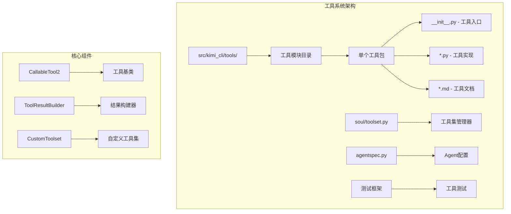
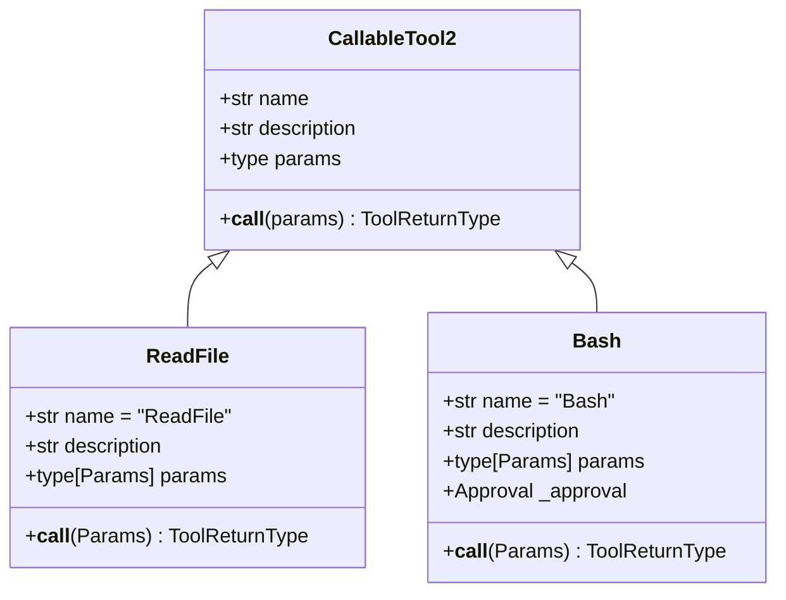
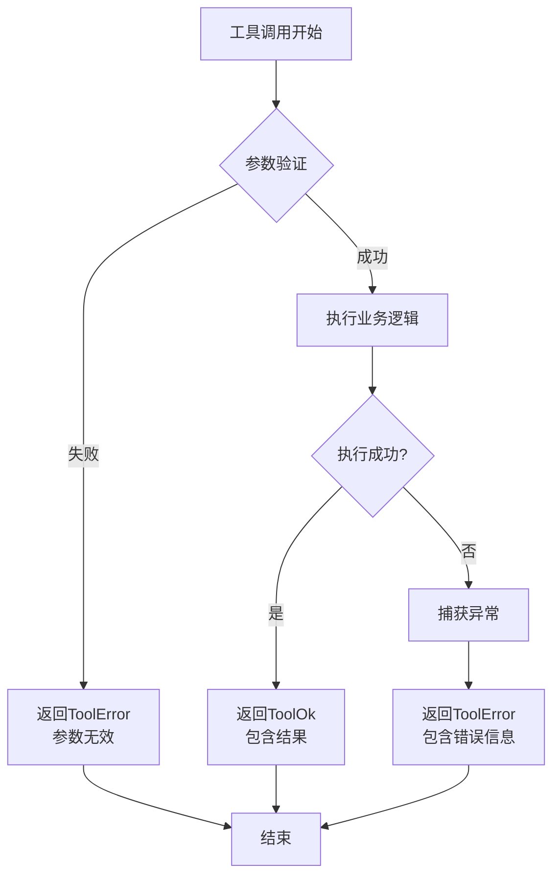
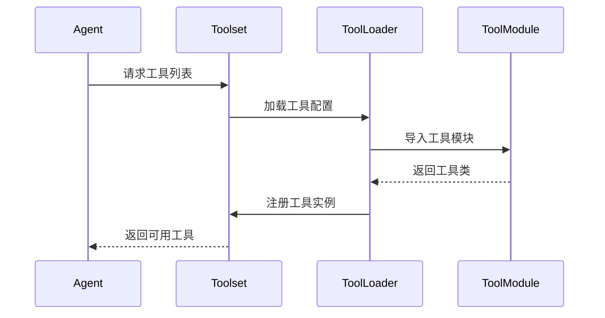

# 创建新工具

<cite>
**本文档中引用的文件**
- [src/kimi_cli/tools/__init__.py](file://src/kimi_cli/tools/__init__.py)
- [src/kimi_cli/tools/test.py](file://src/kimi_cli/tools/test.py)
- [src/kimi_cli/tools/utils.py](file://src/kimi_cli/tools/utils.py)
- [src/kimi_cli/soul/toolset.py](file://src/kimi_cli/soul/toolset.py)
- [src/kimi_cli/tools/bash/__init__.py](file://src/kimi_cli/tools/bash/__init__.py)
- [src/kimi_cli/tools/file/read.py](file://src/kimi_cli/tools/file/read.py)
- [src/kimi_cli/tools/web/fetch.py](file://src/kimi_cli/tools/web/fetch.py)
- [src/kimi_cli/tools/file/read.md](file://src/kimi_cli/tools/file/read.md)
- [src/kimi_cli/tools/web/fetch.md](file://src/kimi_cli/tools/web/fetch.md)
- [src/kimi_cli/tools/bash/bash.md](file://src/kimi_cli/tools/bash/bash.md)
- [tests/test_read_file.py](file://tests/test_read_file.py)
- [tests/test_bash.py](file://tests/test_bash.py)
- [src/kimi_cli/soul/agent.py](file://src/kimi_cli/soul/agent.py)
- [src/kimi_cli/agentspec.py](file://src/kimi_cli/agentspec.py)
</cite>

## 目录
1. [概述](#概述)
2. [项目结构分析](#项目结构分析)
3. [工具开发基础](#工具开发基础)
4. [创建新工具模块](#创建新工具模块)
5. [工具类设计](#工具类设计)
6. [参数验证与错误处理](#参数验证与错误处理)
7. [工具描述与文档](#工具描述与文档)
8. [Soul引擎集成](#soul引擎集成)
9. [测试框架](#测试框架)
10. [Agent配置注册](#agent配置注册)
11. [最佳实践](#最佳实践)
12. [完整示例](#完整示例)

## 概述

Kimi CLI采用模块化的工具架构，允许开发者轻松创建和集成新的功能工具。每个工具都是独立的Python模块，遵循统一的设计模式，通过Soul引擎进行管理和调用。

### 核心特性

- **模块化设计**: 每个工具独立封装，便于维护和扩展
- **类型安全**: 使用Pydantic进行参数验证和类型检查
- **异步支持**: 全面支持异步操作，提高性能
- **自动发现**: 工具通过模块导入自动注册
- **错误处理**: 统一的错误处理和结果格式化
- **文档集成**: 自动生成工具描述和使用指南

## 项目结构分析

Kimi CLI的工具系统采用分层架构，主要组件包括：



**图表来源**
- [src/kimi_cli/tools/__init__.py](file://src/kimi_cli/tools/__init__.py#L1-L90)
- [src/kimi_cli/soul/toolset.py](file://src/kimi_cli/soul/toolset.py#L1-L29)

**章节来源**
- [src/kimi_cli/tools/__init__.py](file://src/kimi_cli/tools/__init__.py#L1-L90)
- [src/kimi_cli/soul/toolset.py](file://src/kimi_cli/soul/toolset.py#L1-L29)

## 工具开发基础

### 工具基类

所有工具都继承自`CallableTool2`基类，该类提供了异步工具调用的标准接口：



**图表来源**
- [src/kimi_cli/tools/file/read.py](file://src/kimi_cli/tools/file/read.py#L38-L141)
- [src/kimi_cli/tools/bash/__init__.py](file://src/kimi_cli/tools/bash/__init__.py#L33-L114)

### 工具返回类型

工具必须返回统一的结果类型：`ToolOk` 或 `ToolError`，这些类型来自`kosong.tooling`模块。

**章节来源**
- [src/kimi_cli/tools/file/read.py](file://src/kimi_cli/tools/file/read.py#L38-L141)
- [src/kimi_cli/tools/bash/__init__.py](file://src/kimi_cli/tools/bash/__init__.py#L33-L114)

## 创建新工具模块

### 目录结构

在`src/kimi_cli/tools/`目录下创建新的工具模块：

```
src/kimi_cli/tools/
├── mytool/
│   ├── __init__.py          # 工具主入口
│   ├── mytool.md           # 工具描述文档
│   └── mytool.py           # 工具实现
```

### 步骤1: 创建工具包目录

```bash
mkdir -p src/kimi_cli/tools/mytool
```

### 步骤2: 实现工具类

创建`__init__.py`文件，定义工具类：

```python
# 示例: src/kimi_cli/tools/mytool/__init__.py
from typing import Any, override
from pydantic import BaseModel, Field
from kosong.tooling import CallableTool2, ToolReturnType

from kimi_cli.tools.utils import ToolResultBuilder, load_desc

class Params(BaseModel):
    """工具参数定义"""
    input_data: str = Field(description="输入数据")
    option: str = Field(default="default", description="可选参数")

class MyTool(CallableTool2[Params]):
    """我的自定义工具"""
    
    name: str = "MyTool"
    description: str = load_desc(Path(__file__).parent / "mytool.md", {})
    params: type[Params] = Params
    
    def __init__(self, **kwargs: Any) -> None:
        super().__init__(**kwargs)
    
    @override
    async def __call__(self, params: Params) -> ToolReturnType:
        """执行工具逻辑"""
        builder = ToolResultBuilder()
        
        try:
            # 工具业务逻辑
            result = f"处理了输入: {params.input_data}, 选项: {params.option}"
            
            builder.write(result)
            return builder.ok("工具执行成功")
            
        except Exception as e:
            return builder.error(f"工具执行失败: {e}", brief="执行错误")
```

**章节来源**
- [src/kimi_cli/tools/file/read.py](file://src/kimi_cli/tools/file/read.py#L38-L141)
- [src/kimi_cli/tools/test.py](file://src/kimi_cli/tools/test.py#L13-L56)

## 工具类设计

### 参数模型定义

使用Pydantic定义工具参数，提供类型验证和文档生成：

```python
class MyParams(BaseModel):
    """工具参数模型"""
    
    # 必需参数
    required_param: str = Field(
        description="必需参数描述"
    )
    
    # 可选参数带默认值
    optional_param: int = Field(
        default=42,
        description="可选参数描述",
        ge=0,  # 最小值约束
        le=100  # 最大值约束
    )
    
    # 枚举类型参数
    mode: Literal["fast", "accurate", "balanced"] = Field(
        default="balanced",
        description="处理模式"
    )
```

### 工具初始化

工具可以接受依赖注入，如`Runtime`、`Config`等：

```python
class AdvancedTool(CallableTool2[Params]):
    def __init__(self, runtime: Runtime, config: Config, **kwargs: Any):
        super().__init__(**kwargs)
        self._runtime = runtime
        self._config = config
```

**章节来源**
- [src/kimi_cli/tools/file/read.py](file://src/kimi_cli/tools/file/read.py#L16-L35)
- [src/kimi_cli/tools/bash/__init__.py](file://src/kimi_cli/tools/bash/__init__.py#L38-L41)

## 参数验证与错误处理

### 参数验证

Pydantic自动提供参数验证：

```python
class ValidationExample(BaseModel):
    # 数值范围验证
    age: int = Field(ge=0, le=120, description="年龄")
    
    # 字符串长度验证
    name: str = Field(min_length=1, max_length=50, description="姓名")
    
    # 正则表达式验证
    email: str = Field(pattern=r'^[^@]+@[^@]+\.[^@]+$', description="邮箱地址")
    
    # 枚举验证
    priority: Priority = Field(description="优先级")
```

### 错误处理模式



**图表来源**
- [src/kimi_cli/tools/file/read.py](file://src/kimi_cli/tools/file/read.py#L56-L141)
- [src/kimi_cli/tools/utils.py](file://src/kimi_cli/tools/utils.py#L142-L151)

### 结果构建器

使用`ToolResultBuilder`进行结果构建和输出控制：

```python
builder = ToolResultBuilder(
    max_chars=50000,      # 最大字符数
    max_line_length=2000  # 最大行长度
)

# 写入内容
builder.write("处理结果...\n")

# 返回成功结果
return builder.ok(
    message="操作完成",
    brief="成功"
)

# 返回错误结果
return builder.error(
    message="发生错误",
    brief="错误"
)
```

**章节来源**
- [src/kimi_cli/tools/utils.py](file://src/kimi_cli/tools/utils.py#L37-L151)
- [src/kimi_cli/tools/file/read.py](file://src/kimi_cli/tools/file/read.py#L56-L141)

## 工具描述与文档

### YAML格式描述

每个工具需要提供YAML格式的描述文件：

```yaml
# 工具名称
name: MyTool

# 工具描述
description: |
  我的自定义工具描述
  - 支持的功能1
  - 支持的功能2

# 输入参数
input_schema:
  type: object
  properties:
    input_data:
      type: string
      description: 输入数据描述
    option:
      type: string
      description: 可选参数描述
      default: default

# 输出格式
output_schema:
  type: object
  properties:
    result:
      type: string
      description: 处理结果
    status:
      type: string
      description: 执行状态

# 使用示例
examples:
  - input: '{"input_data": "测试数据"}'
    output: '{"result": "处理结果", "status": "success"}'

# 错误处理
error_handling:
  - code: INVALID_INPUT
    message: "输入参数无效"
  - code: EXECUTION_ERROR
    message: "执行过程中发生错误"
```

### Markdown文档

创建`mytool.md`文件提供详细使用说明：

```markdown
# MyTool - 我的自定义工具

这是一个强大的工具，用于执行特定任务。

## 功能特性
- ✅ 支持多种输入格式
- ✅ 异步处理
- ✅ 完整的错误处理
- ✅ 参数验证

## 使用方法

### 基本用法
```json
{
  "name": "MyTool",
  "arguments": {
    "input_data": "要处理的数据",
    "option": "可选参数"
  }
}
```

### 参数说明

| 参数名 | 类型 | 必需 | 描述 |
|--------|------|------|------|
| input_data | string | 是 | 要处理的输入数据 |
| option | string | 否 | 可选配置参数，默认为"default" |

### 输出格式
```json
{
  "result": "处理后的结果",
  "status": "success",
  "execution_time": "毫秒数"
}
```

## 注意事项
- 输入数据大小限制：1MB
- 执行超时时间：30秒
- 不支持并发调用
```

**章节来源**
- [src/kimi_cli/tools/file/read.md](file://src/kimi_cli/tools/file/read.md#L1-L15)
- [src/kimi_cli/tools/web/fetch.md](file://src/kimi_cli/tools/web/fetch.md#L1-L2)
- [src/kimi_cli/tools/bash/bash.md](file://src/kimi_cli/tools/bash/bash.md#L1-L32)

## Soul引擎集成

### 工具自动发现

Soul引擎通过模块导入自动发现和加载工具：



**图表来源**
- [src/kimi_cli/soul/agent.py](file://src/kimi_cli/soul/agent.py#L100-L141)

### 工具注册机制

工具通过以下方式注册：

1. **模块导入**: 工具模块自动导入
2. **类查找**: 查找模块中的工具类
3. **依赖注入**: 自动注入所需依赖
4. **实例化**: 创建工具实例

```python
# 工具路径格式: "模块路径:类名"
tool_path = "kimi_cli.tools.mytool:MyTool"

# 加载工具
tool = _load_tool(tool_path, dependencies)
if tool:
    toolset += tool
```

### 上下文传递

工具可以通过上下文访问运行时信息：

```python
class ContextAwareTool(CallableTool2[Params]):
    def __init__(self, runtime: Runtime, **kwargs: Any):
        super().__init__(**kwargs)
        self._runtime = runtime
        
    @override
    async def __call__(self, params: Params) -> ToolReturnType:
        # 访问工作目录
        work_dir = self._runtime.builtin_args.KIMI_WORK_DIR
        
        # 访问配置信息
        config = self._runtime.config
        
        # 执行业务逻辑...
```

**章节来源**
- [src/kimi_cli/soul/agent.py](file://src/kimi_cli/soul/agent.py#L100-L141)
- [src/kimi_cli/soul/toolset.py](file://src/kimi_cli/soul/toolset.py#L21-L29)

## 测试框架

### 测试结构

为新工具创建测试文件：

```
tests/
├── test_mytool.py           # 工具功能测试
└── test_mytool_integration.py  # 集成测试
```

### 单元测试示例

```python
import pytest
from kosong.tooling import ToolOk, ToolError
from kimi_cli.tools.mytool import MyTool, Params

@pytest.mark.asyncio
async def test_mytool_basic():
    """测试基本功能"""
    tool = MyTool()
    
    result = await tool(Params(input_data="测试"))
    
    assert isinstance(result, ToolOk)
    assert "处理了输入" in result.output
    assert result.message == "工具执行成功"

@pytest.mark.asyncio
async def test_mytool_with_option():
    """测试带选项的调用"""
    tool = MyTool()
    
    result = await tool(Params(input_data="测试", option="custom"))
    
    assert isinstance(result, ToolOk)
    assert "选项: custom" in result.output

@pytest.mark.asyncio
async def test_mytool_error_handling():
    """测试错误处理"""
    tool = MyTool()
    
    # 测试无效输入
    with pytest.raises(ValueError):
        await tool(Params(input_data=""))  # 空字符串可能无效
```

### 集成测试

```python
@pytest.mark.asyncio
async def test_mytool_integration(runtime: Runtime):
    """测试工具与Soul引擎的集成"""
    from kimi_cli.soul.agent import _load_tools
    
    # 加载工具
    toolset = CustomToolset()
    bad_tools = _load_tools(
        toolset,
        ["kimi_cli.tools.mytool:MyTool"],
        {
            Runtime: runtime,
            # 其他依赖...
        }
    )
    
    assert len(bad_tools) == 0
    assert len(toolset.tools) == 1
    
    # 测试工具调用
    tool = toolset.tools[0]
    result = await tool(Params(input_data="集成测试"))
    
    assert isinstance(result, ToolOk)
```

**章节来源**
- [tests/test_read_file.py](file://tests/test_read_file.py#L1-L315)
- [tests/test_bash.py](file://tests/test_bash.py#L1-L221)

## Agent配置注册

### Agent配置文件

在Agent配置中注册新工具：

```yaml
# agent.yaml
version: 1
agent:
  name: "我的专用Agent"
  system_prompt_path: ./system.md
  
  # 已启用的工具
  tools:
    - "kimi_cli.tools.mytool:MyTool"
    - "kimi_cli.tools.file:ReadFile"
    - "kimi_cli.tools.bash:Bash"
  
  # 排除的工具
  exclude_tools:
    - "kimi_cli.tools.unsafe:UnsafeTool"
```

### 工具路径格式

工具路径采用标准格式：`"模块路径:类名"`

- **模块路径**: Python模块的完整导入路径
- **类名**: 工具类的名称

示例：
- `"kimi_cli.tools.file:ReadFile"`
- `"kimi_cli.tools.bash:Bash"`
- `"kimi_cli.tools.mytool:MyTool"`

### 动态工具管理

Agent支持动态启用/禁用工具：

```yaml
# 启用特定工具
tools:
  - "kimi_cli.tools.mytool:MyTool"

# 排除某些工具
exclude_tools:
  - "kimi_cli.tools.unsafe:UnsafeTool"

# 继承基础配置
extend: "./base-agent.yaml"
```

**章节来源**
- [src/kimi_cli/agentspec.py](file://src/kimi_cli/agentspec.py#L43-L91)
- [src/kimi_cli/soul/agent.py](file://src/kimi_cli/soul/agent.py#L54-L93)

## 最佳实践

### 1. 错误处理策略

```python
@override
async def __call__(self, params: Params) -> ToolReturnType:
    builder = ToolResultBuilder()
    
    try:
        # 参数验证
        if not params.input_data:
            return builder.error("输入数据不能为空", brief="参数错误")
        
        # 业务逻辑
        result = self.process_data(params.input_data)
        
        # 返回结果
        builder.write(result)
        return builder.ok("处理完成")
        
    except ValidationError as e:
        return builder.error(f"参数验证失败: {e}", brief="参数错误")
    except Exception as e:
        return builder.error(f"处理失败: {e}", brief="内部错误")
```

### 2. 性能优化

```python
class OptimizedTool(CallableTool2[Params]):
    def __init__(self, **kwargs: Any):
        super().__init__(**kwargs)
        self._cache = {}
    
    @override
    async def __call__(self, params: Params) -> ToolReturnType:
        # 缓存机制
        cache_key = f"{params.input_data}:{params.option}"
        if cache_key in self._cache:
            return ToolOk(output=self._cache[cache_key], message="从缓存获取")
        
        # 执行计算
        result = await self.compute(params)
        self._cache[cache_key] = result
        
        return ToolOk(output=result, message="计算完成")
```

### 3. 日志记录

```python
import logging

logger = logging.getLogger(__name__)

class LoggedTool(CallableTool2[Params]):
    @override
    async def __call__(self, params: Params) -> ToolReturnType:
        logger.info(f"执行工具 {self.name}，参数: {params}")
        
        try:
            result = await self.process(params)
            logger.info(f"工具 {self.name} 执行成功，结果: {len(result)} 字符")
            return ToolOk(output=result, message="执行成功")
            
        except Exception as e:
            logger.error(f"工具 {self.name} 执行失败: {e}")
            return ToolError(message=f"执行失败: {e}", brief="执行错误")
```

### 4. 并发安全

```python
import asyncio

class ThreadSafeTool(CallableTool2[Params]):
    def __init__(self, **kwargs: Any):
        super().__init__(**kwargs)
        self._lock = asyncio.Lock()
    
    @override
    async def __call__(self, params: Params) -> ToolReturnType:
        async with self._lock:
            # 确保并发安全的操作
            return await self.process_concurrently_safe(params)
```

## 完整示例

### 示例工具：JSON处理器

以下是完整的JSON处理器工具示例：

```python
# src/kimi_cli/tools/json_processor/__init__.py
from typing import Any, Dict, List, Optional, override
from pathlib import Path
from pydantic import BaseModel, Field, validator
from kosong.tooling import CallableTool2, ToolReturnType

from kimi_cli.tools.utils import ToolResultBuilder, load_desc

class JSONProcessorParams(BaseModel):
    """JSON处理器参数"""
    
    input_json: str = Field(description="要处理的JSON字符串")
    
    operation: Literal["validate", "format", "extract", "transform"] = Field(
        description="操作类型: validate(验证), format(格式化), extract(提取), transform(转换)"
    )
    
    path: Optional[str] = Field(
        default=None,
        description="JSON路径(用于extract操作)"
    )
    
    transform_rules: Optional[Dict[str, Any]] = Field(
        default=None,
        description="转换规则(用于transform操作)"
    )
    
    @validator("input_json")
    def validate_json(cls, v):
        import json
        try:
            json.loads(v)
            return v
        except json.JSONDecodeError as e:
            raise ValueError(f"无效的JSON: {e}")

class JSONProcessor(CallableTool2[JSONProcessorParams]):
    """JSON处理器工具"""
    
    name: str = "JSONProcessor"
    description: str = load_desc(Path(__file__).parent / "json_processor.md", {})
    params: type[JSONProcessorParams] = JSONProcessorParams
    
    @override
    async def __call__(self, params: JSONProcessorParams) -> ToolReturnType:
        builder = ToolResultBuilder()
        
        try:
            import json
            
            # 解析JSON
            data = json.loads(params.input_json)
            
            # 执行操作
            if params.operation == "validate":
                result = self.validate(data)
            elif params.operation == "format":
                result = self.format(data)
            elif params.operation == "extract":
                result = self.extract(data, params.path)
            elif params.operation == "transform":
                result = self.transform(data, params.transform_rules)
            else:
                return builder.error(f"不支持的操作: {params.operation}", brief="操作错误")
            
            builder.write(json.dumps(result, ensure_ascii=False, indent=2))
            return builder.ok(f"{params.operation}操作完成")
            
        except json.JSONDecodeError as e:
            return builder.error(f"JSON解析失败: {e}", brief="JSON错误")
        except Exception as e:
            return builder.error(f"处理失败: {e}", brief="处理错误")
    
    def validate(self, data: Any) -> Dict[str, bool]:
        """验证JSON格式"""
        return {"valid": True, "message": "JSON格式正确"}
    
    def format(self, data: Any) -> Any:
        """格式化JSON"""
        return data
    
    def extract(self, data: Any, path: Optional[str]) -> Any:
        """提取JSON数据"""
        if not path:
            return data
        
        keys = path.strip('/').split('/')
        current = data
        
        for key in keys:
            if isinstance(current, dict) and key in current:
                current = current[key]
            elif isinstance(current, list) and key.isdigit():
                index = int(key)
                if 0 <= index < len(current):
                    current = current[index]
                else:
                    return {"error": f"索引 {index} 越界"}
            else:
                return {"error": f"路径 {path} 不存在"}
        
        return current
    
    def transform(self, data: Any, rules: Optional[Dict[str, Any]]) -> Any:
        """转换JSON数据"""
        if not rules:
            return data
        
        result = data.copy() if isinstance(data, dict) else data
        
        for field, action in rules.items():
            if field in result:
                if action == "uppercase":
                    if isinstance(result[field], str):
                        result[field] = result[field].upper()
                elif action == "lowercase":
                    if isinstance(result[field], str):
                        result[field] = result[field].lower()
                elif action == "remove":
                    del result[field]
        
        return result
```

### JSON处理器文档

```markdown
# JSONProcessor - JSON处理器

一个强大的JSON数据处理工具，支持验证、格式化、提取和转换操作。

## 功能特性
- ✅ JSON格式验证
- ✅ JSON格式化输出
- ✅ JSON路径提取
- ✅ JSON字段转换
- ✅ 异步处理
- ✅ 完整的错误处理

## 使用方法

### 基本验证
```json
{
  "name": "JSONProcessor",
  "arguments": {
    "input_json": "{\"key\": \"value\"}",
    "operation": "validate"
  }
}
```

### JSON格式化
```json
{
  "name": "JSONProcessor",
  "arguments": {
    "input_json": "{\"key\":\"value\",\"nested\":{\"a\":1}}",
    "operation": "format"
  }
}
```

### JSON路径提取
```json
{
  "name": "JSONProcessor",
  "arguments": {
    "input_json": "{\"users\":[{\"name\":\"Alice\",\"age\":25}]}", 
    "operation": "extract",
    "path": "/users/0/name"
  }
}
```

### JSON字段转换
```json
{
  "name": "JSONProcessor",
  "arguments": {
    "input_json": "{\"name\":\"john\",\"email\":\"john@example.com\"}",
    "operation": "transform",
    "transform_rules": {
      "name": "uppercase",
      "email": "remove"
    }
  }
}
```

## 参数说明

| 参数名 | 类型 | 必需 | 描述 |
|--------|------|------|------|
| input_json | string | 是 | 要处理的JSON字符串 |
| operation | string | 是 | 操作类型: validate/format/extract/transform |
| path | string | 否 | JSON路径(用于extract操作) |
| transform_rules | object | 否 | 转换规则(用于transform操作) |

## 输出格式

```json
{
  "result": "处理后的JSON数据",
  "status": "success",
  "operation": "操作类型",
  "execution_time": "毫秒数"
}
```

## 错误处理

- **JSON格式错误**: 输入不是有效的JSON格式
- **路径不存在**: 提取路径在JSON中不存在
- **操作不支持**: 指定的操作类型不受支持
- **转换规则错误**: 转换规则格式不正确

## 注意事项
- 输入JSON大小限制：1MB
- 支持嵌套对象和数组
- 路径语法: 使用"/"分隔层级
- 转换规则支持: uppercase/lowercase/remove
```

### JSON处理器测试

```python
import pytest
from kosong.tooling import ToolOk, ToolError
from kimi_cli.tools.json_processor import JSONProcessor, JSONProcessorParams

@pytest.mark.asyncio
async def test_json_processor_validate():
    """测试JSON验证"""
    tool = JSONProcessor()
    
    result = await tool(JSONProcessorParams(
        input_json='{"key": "value"}',
        operation="validate"
    ))
    
    assert isinstance(result, ToolOk)
    assert "valid" in result.output

@pytest.mark.asyncio
async def test_json_processor_extract():
    """测试JSON提取"""
    tool = JSONProcessor()
    
    result = await tool(JSONProcessorParams(
        input_json='{"users":[{"name":"Alice","age":25}]}',
        operation="extract",
        path="/users/0/name"
    ))
    
    assert isinstance(result, ToolOk)
    assert "Alice" in result.output

@pytest.mark.asyncio
async def test_json_processor_transform():
    """测试JSON转换"""
    tool = JSONProcessor()
    
    result = await tool(JSONProcessorParams(
        input_json='{"name":"john","email":"john@example.com"}',
        operation="transform",
        transform_rules={"name": "uppercase", "email": "remove"}
    ))
    
    assert isinstance(result, ToolOk)
    assert "JOHN" in result.output
    assert "email" not in result.output
```

这个完整的示例展示了如何创建一个功能丰富的工具，包括参数验证、多种操作类型、错误处理和测试覆盖。

**章节来源**
- [src/kimi_cli/tools/file/read.py](file://src/kimi_cli/tools/file/read.py#L38-L141)
- [src/kimi_cli/tools/bash/__init__.py](file://src/kimi_cli/tools/bash/__init__.py#L33-L114)
- [src/kimi_cli/tools/utils.py](file://src/kimi_cli/tools/utils.py#L37-L151)