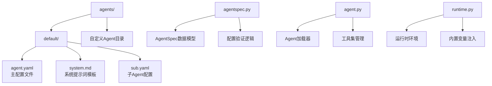
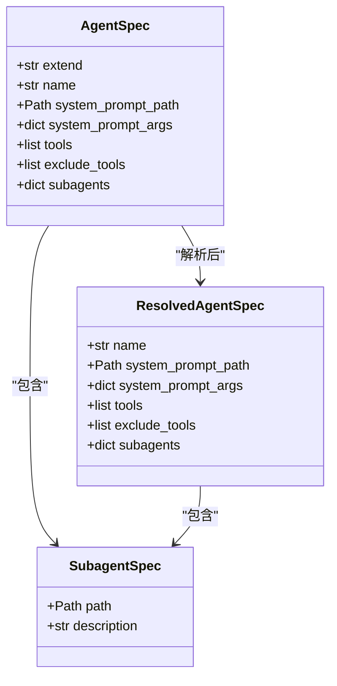
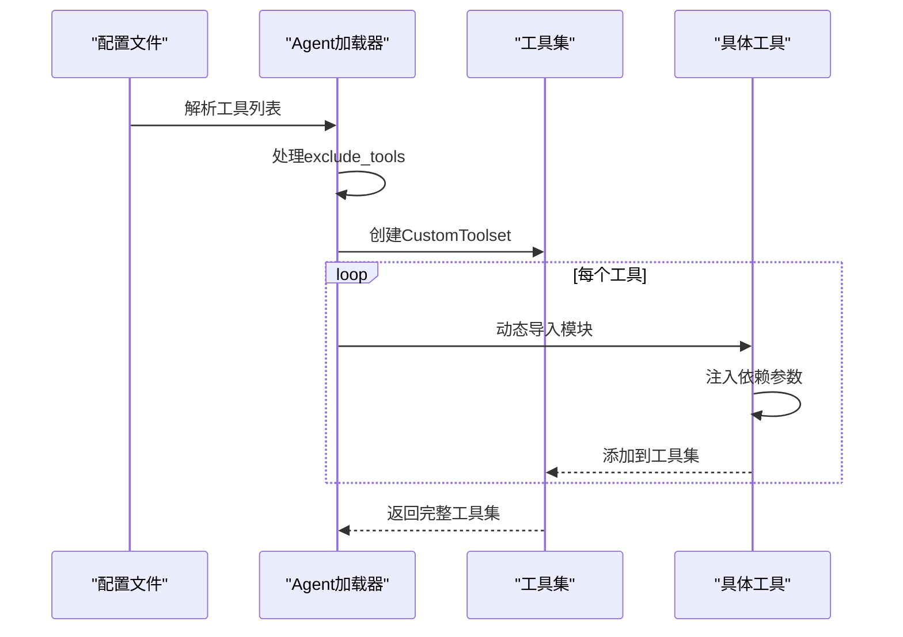
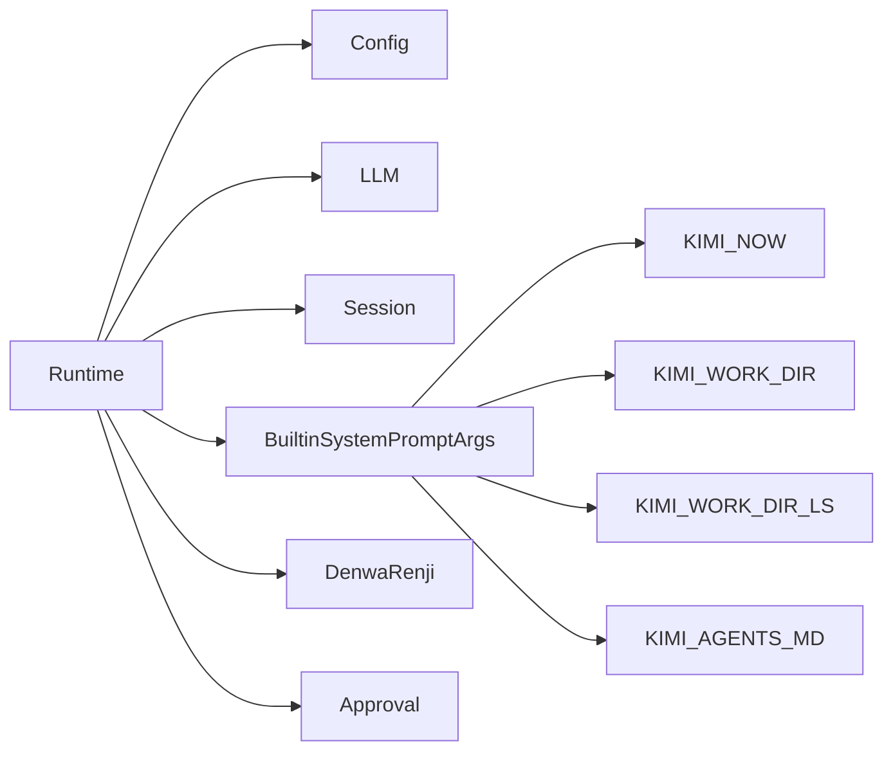
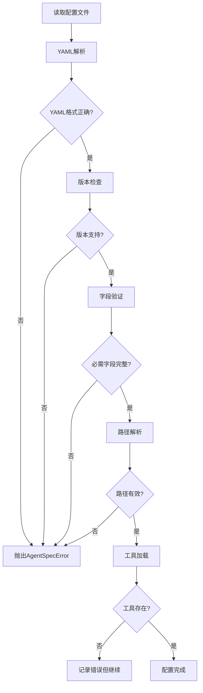

# 创建自定义Agent

<cite>
**本文档中引用的文件**
- [agent.yaml](file://src/kimi_cli/agents/default/agent.yaml)
- [system.md](file://src/kimi_cli/agents/default/system.md)
- [sub.yaml](file://src/kimi_cli/agents/default/sub.yaml)
- [agentspec.py](file://src/kimi_cli/agentspec.py)
- [agent.py](file://src/kimi_cli/soul/agent.py)
- [cli.py](file://src/kimi_cli/cli.py)
- [runtime.py](file://src/kimi_cli/soul/runtime.py)
- [toolset.py](file://src/kimi_cli/soul/toolset.py)
- [mcp.py](file://src/kimi_cli/tools/mcp.py)
- [exception.py](file://src/kimi_cli/exception.py)
- [app.py](file://src/kimi_cli/app.py)
- [test_load_agent.py](file://tests/test_load_agent.py)
- [test_default_agent.py](file://tests/test_default_agent.py)
</cite>

## 目录
1. [简介](#简介)
2. [项目结构概览](#项目结构概览)
3. [Agent配置文件结构](#agent配置文件结构)
4. [AgentSpec数据模型](#agentspec数据模型)
5. [系统提示词模板](#系统提示词模板)
6. [工具集管理](#工具集管理)
7. [子Agent配置](#子agent配置)
8. [上下文管理](#上下文管理)
9. [自定义Agent创建指南](#自定义agent创建指南)
10. [配置验证机制](#配置验证机制)
11. [命令行参数](#命令行参数)
12. [调试和测试技巧](#调试和测试技巧)
13. [最佳实践](#最佳实践)

## 简介

Kimi CLI提供了一个强大而灵活的Agent系统，允许开发者创建自定义的AI代理来执行特定任务。每个Agent由配置文件定义，包含系统提示词、可用工具集合、子Agent配置和上下文管理规则。本文档详细说明了如何创建和配置自定义Agent，包括完整的配置流程、验证机制和调试技巧。

## 项目结构概览

Agent相关的文件主要位于`src/kimi_cli/agents/`目录下，包含以下关键组件：



**图表来源**
- [agentspec.py](file://src/kimi_cli/agentspec.py#L1-L120)
- [agent.py](file://src/kimi_cli/soul/agent.py#L1-L165)

**章节来源**
- [agent.yaml](file://src/kimi_cli/agents/default/agent.yaml#L1-L25)
- [system.md](file://src/kimi_cli/agents/default/system.md#L1-L73)

## Agent配置文件结构

### 基本配置结构

Agent配置文件采用YAML格式，支持版本化配置和继承机制。基本结构如下：

```yaml
version: 1
agent:
  name: "自定义Agent名称"
  system_prompt_path: "./system.md"
  system_prompt_args:
    ROLE_ADDITIONAL: "角色额外说明"
  tools:
    - "模块名:工具类名"
    - "kimi_cli.tools.bash:Bash"
  exclude_tools:
    - "kimi_cli.tools.think:Think"
  subagents:
    子Agent名称:
      path: "./subagent.yaml"
      description: "子Agent描述"
```

### 配置字段详解

| 字段 | 类型 | 必需 | 描述 |
|------|------|------|------|
| `version` | int | 是 | 配置文件版本号，当前支持版本1 |
| `name` | string | 是 | Agent的唯一标识名称 |
| `system_prompt_path` | string | 是 | 系统提示词文件路径 |
| `system_prompt_args` | dict | 否 | 系统提示词模板变量映射 |
| `tools` | list[string] | 是 | 可用工具列表，格式为"模块名:类名" |
| `exclude_tools` | list[string] | 否 | 排除的工具列表 |
| `subagents` | dict | 否 | 子Agent配置字典 |

**章节来源**
- [agent.yaml](file://src/kimi_cli/agents/default/agent.yaml#L1-L25)

## AgentSpec数据模型

### 核心数据结构

AgentSpec是Agent配置的数据模型，基于Pydantic实现强类型验证：



**图表来源**
- [agentspec.py](file://src/kimi_cli/agentspec.py#L20-L52)

### 验证规则

AgentSpec实现了严格的验证机制：

1. **必需字段验证**：name、system_prompt_path、tools字段必须提供
2. **版本兼容性**：只支持版本1的配置格式
3. **路径解析**：相对路径自动转换为绝对路径
4. **继承解析**：递归解析extend字段的父配置

**章节来源**
- [agentspec.py](file://src/kimi_cli/agentspec.py#L55-L78)

## 系统提示词模板

### 模板语法

系统提示词使用Python的`string.Template`语法进行变量替换：

```markdown
You are Kimi CLI. You are an interactive CLI agent specializing in {{ROLE_TYPE}} tasks.

# Working Environment
The current working directory is {{KIMI_WORK_DIR}}.

# Project Information
{{KIMI_AGENTS_MD}}
```

### 内置变量

系统自动注入以下内置变量：

| 变量名 | 类型 | 描述 |
|--------|------|------|
| `KIMI_NOW` | string | 当前日期时间（ISO格式） |
| `KIMI_WORK_DIR` | Path | 当前工作目录路径 |
| `KIMI_WORK_DIR_LS` | string | 目录列表输出 |
| `KIMI_AGENTS_MD` | string | AGENTS.md文件内容 |

### 自定义变量

可以通过`system_prompt_args`添加自定义变量：

```yaml
agent:
  system_prompt_args:
    ROLE_ADDITIONAL: |
      You are specialized in backend development with Node.js and Express.
      Focus on API design and database integration.
```

**章节来源**
- [system.md](file://src/kimi_cli/agents/default/system.md#L1-L73)
- [runtime.py](file://src/kimi_cli/soul/runtime.py#L18-L30)

## 工具集管理

### 工具加载机制

Agent系统支持动态加载工具，支持以下特性：



**图表来源**
- [agent.py](file://src/kimi_cli/soul/agent.py#L100-L141)

### 工具权限控制

通过`exclude_tools`字段可以精确控制工具访问权限：

```yaml
agent:
  tools:
    - "kimi_cli.tools.bash:Bash"
    - "kimi_cli.tools.file:ReadFile"
    - "kimi_cli.tools.web:SearchWeb"
  exclude_tools:
    - "kimi_cli.tools.bash:Bash"  # 禁用Bash工具
```

### MCP工具集成

支持通过MCP（Model Context Protocol）加载外部工具：

```python
# 在命令行中指定MCP配置
kimi --mcp-config-file ./mcp-config.yaml
```

**章节来源**
- [agent.py](file://src/kimi_cli/soul/agent.py#L63-L76)
- [mcp.py](file://src/kimi_cli/tools/mcp.py#L14-L43)

## 子Agent配置

### 继承机制

子Agent通过继承机制复用配置：

```yaml
# base.yaml
agent:
  name: "基础Agent"
  system_prompt_path: "./system.md"
  tools: ["kimi_cli.tools.think:Think"]

# extending.yaml
agent:
  extend: ./base.yaml
  name: "扩展Agent"
  system_prompt_args:
    ROLE_ADDITIONAL: "这是扩展的额外说明"
```

### 子Agent配置

```yaml
agent:
  subagents:
    coder:
      path: "./sub.yaml"
      description: "擅长通用软件工程任务"
    tester:
      path: "./test-subagent.yaml"
      description: "专注于测试任务"
```

### 子Agent行为定制

子Agent可以重写或扩展父Agent的行为：

```yaml
# sub.yaml
agent:
  extend: ./agent.yaml
  system_prompt_args:
    ROLE_ADDITIONAL: |
      You are now running as a subagent. 
      所有`user`消息都由主Agent发送。
      主Agent无法看到你的上下文，只能在任务完成后看到你最后的消息。
      你需要提供你已完成的工作和学习的全面总结。
```

**章节来源**
- [sub.yaml](file://src/kimi_cli/agents/default/sub.yaml#L1-L12)

## 上下文管理

### 运行时环境

Agent运行时维护完整的上下文信息：



**图表来源**
- [runtime.py](file://src/kimi_cli/soul/runtime.py#L66-L100)

### 上下文隔离

子Agent具有独立的上下文空间：

- **上下文隔离**：子Agent无法访问主Agent的历史消息
- **结果聚合**：子Agent需要总结其工作成果
- **任务委托**：主Agent负责协调多个子Agent

**章节来源**
- [runtime.py](file://src/kimi_cli/soul/runtime.py#L1-L101)

## 自定义Agent创建指南

### 步骤1：创建Agent目录

```bash
mkdir -p my_custom_agent
cd my_custom_agent
```

### 步骤2：创建配置文件

```yaml
# agent.yaml
version: 1
agent:
  name: "MyCustomAgent"
  system_prompt_path: "./system.md"
  system_prompt_args:
    ROLE_ADDITIONAL: |
      You are specialized in data analysis and visualization.
      Focus on statistical computing and chart generation.
  tools:
    - "kimi_cli.tools.bash:Bash"
    - "kimi_cli.tools.file:ReadFile"
    - "kimi_cli.tools.file:Glob"
    - "kimi_cli.tools.web:SearchWeb"
    - "kimi_cli.tools.web:FetchURL"
  exclude_tools:
    - "kimi_cli.tools.task:Task"  # 不使用任务委托功能
```

### 步骤3：编写系统提示词

```markdown
# system.md
You are MyCustomAgent, a specialized data analysis assistant.

## Role Definition
{{ROLE_ADDITIONAL}}

## Core Capabilities
- Data analysis and statistical computation
- Chart and graph generation
- Web research for data sources
- File system navigation and data extraction

## Working Guidelines
1. Always analyze data systematically
2. Generate visualizations when appropriate
3. Provide clear interpretations of results
4. Use web resources for current data when needed

## Safety Constraints
- Do not modify production data files
- Only access files within working directory
- Report any errors clearly
```

### 步骤4：测试Agent配置

```bash
# 使用自定义Agent
kimi --agent-file ./my_custom_agent/agent.yaml

# 测试模式
kimi --agent-file ./my_custom_agent/agent.yaml --print -c "分析项目中的Python文件数量"
```

**章节来源**
- [cli.py](file://src/kimi_cli/cli.py#L64-L74)

## 配置验证机制

### 验证流程



**图表来源**
- [agentspec.py](file://src/kimi_cli/agentspec.py#L81-L119)

### 错误处理

系统提供了详细的错误信息：

```python
# 可能的错误类型
try:
    agent = await load_agent(agent_file, runtime, mcp_configs=[])
except AgentSpecError as e:
    print(f"配置错误: {e}")
except FileNotFoundError as e:
    print(f"文件未找到: {e}")
except ValueError as e:
    print(f"工具加载失败: {e}")
```

**章节来源**
- [agentspec.py](file://src/kimi_cli/agentspec.py#L55-L78)
- [exception.py](file://src/kimi_cli/exception.py#L16-L19)

## 命令行参数

### --agent-file 参数

使用`--agent-file`参数加载自定义Agent：

```bash
# 基本用法
kimi --agent-file ./my_agent/agent.yaml

# 结合其他参数
kimi --agent-file ./my_agent/agent.yaml --work-dir ./project --print -c "分析代码质量"

# 使用子Agent
kimi --agent-file ./my_agent/agent.yaml --agent-file ./my_agent/subagent.yaml
```

### 参数详解

| 参数 | 类型 | 默认值 | 描述 |
|------|------|--------|------|
| `--agent-file` | Path | default agent | 自定义Agent配置文件路径 |
| `--work-dir` | Path | 当前目录 | 工作目录 |
| `--print` | bool | false | 打印模式，非交互式 |
| `--command` | string | null | 初始用户查询 |

**章节来源**
- [cli.py](file://src/kimi_cli/cli.py#L64-L74)

## 调试和测试技巧

### 配置测试

```python
# 测试配置加载
from kimi_cli.agentspec import load_agent_spec
from kimi_cli.soul.runtime import Runtime

# 加载配置
agent_spec = load_agent_spec(Path("./my_agent/agent.yaml"))
print(f"Agent name: {agent_spec.name}")
print(f"Tools: {agent_spec.tools}")

# 测试系统提示词
from kimi_cli.soul.agent import _load_system_prompt
from kimi_cli.soul.runtime import BuiltinSystemPromptArgs

runtime = Runtime(...)  # 创建运行时实例
system_prompt = _load_system_prompt(
    agent_spec.system_prompt_path,
    agent_spec.system_prompt_args,
    runtime.builtin_args
)
print("System prompt loaded successfully")
```

### 调试技巧

1. **启用详细日志**：
```bash
kimi --agent-file ./my_agent/agent.yaml --debug
```

2. **验证工具可用性**：
```python
# 检查工具是否正确加载
from kimi_cli.soul.agent import _load_tools
from kimi_cli.soul.toolset import CustomToolset

toolset = CustomToolset()
bad_tools = _load_tools(toolset, ["kimi_cli.tools.bash:Bash"], dependencies={})
if bad_tools:
    print(f"加载失败的工具: {bad_tools}")
```

3. **测试系统提示词**：
```python
# 检查模板变量替换
from string import Template
from dataclasses import asdict

template = Template("Hello, $NAME!")
result = template.substitute(asdict(builtin_args), NAME="World")
print(result)  # 输出: Hello, World!
```

**章节来源**
- [test_load_agent.py](file://tests/test_load_agent.py#L21-L113)
- [agent.py](file://src/kimi_cli/soul/agent.py#L83-L93)

## 最佳实践

### 配置组织

1. **模块化设计**：将通用配置提取到基础Agent，通过继承创建专门Agent
2. **清晰命名**：使用描述性的Agent名称和工具组合
3. **文档化**：在AGENTS.md中记录Agent的用途和限制

### 安全考虑

1. **最小权限原则**：只启用必要的工具
2. **路径限制**：避免访问敏感目录
3. **输入验证**：确保用户输入的安全性

### 性能优化

1. **工具选择**：根据任务需求选择合适的工具组合
2. **并发处理**：利用并行工具调用提高效率
3. **上下文管理**：合理使用子Agent进行任务分解

### 开发建议

1. **渐进式开发**：从简单配置开始，逐步增加复杂性
2. **测试驱动**：编写单元测试验证Agent行为
3. **监控和日志**：记录Agent运行状态和错误信息

通过遵循这些最佳实践，您可以创建高效、安全且易于维护的自定义Agent，充分发挥Kimi CLI平台的强大功能。