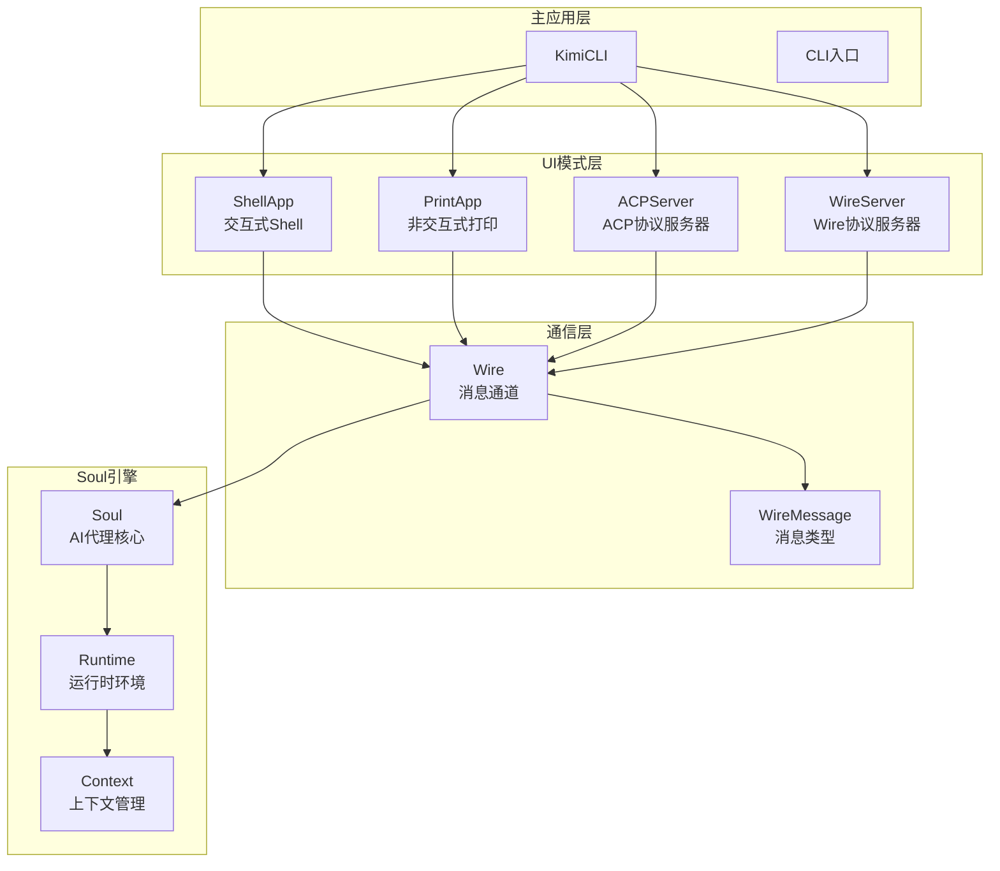
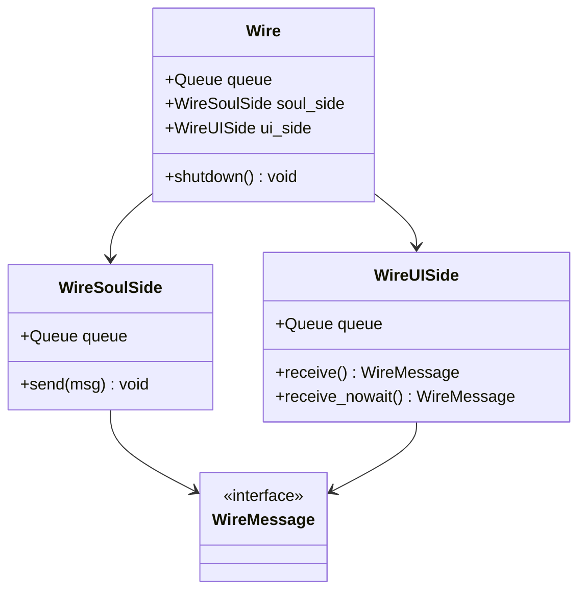
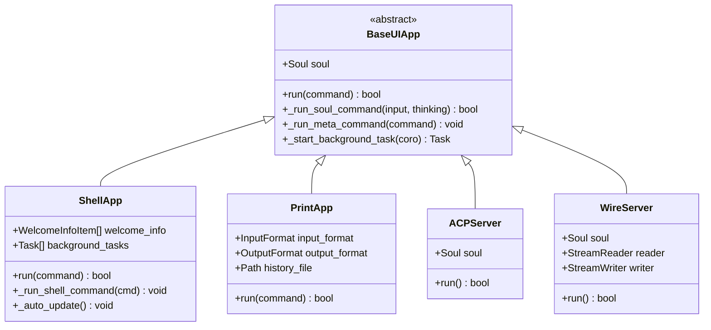
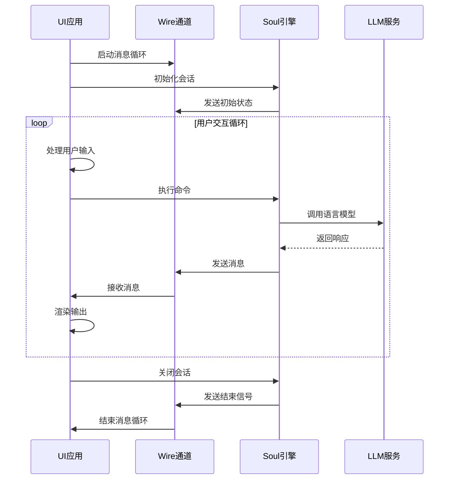

# 实现新的UI模式技术指南

<cite>
**本文档引用的文件**
- [app.py](file://src/kimi_cli/app.py)
- [cli.py](file://src/kimi_cli/cli.py)
- [console.py](file://src/kimi_cli/ui/shell/console.py)
- [shell/__init__.py](file://src/kimi_cli/ui/shell/__init__.py)
- [shell/setup.py](file://src/kimi_cli/ui/shell/setup.py)
- [shell/prompt.py](file://src/kimi_cli/ui/shell/prompt.py)
- [shell/update.py](file://src/kimi_cli/ui/shell/update.py)
- [shell/visualize.py](file://src/kimi_cli/ui/shell/visualize.py)
- [acp/__init__.py](file://src/kimi_cli/ui/acp/__init__.py)
- [print/visualize.py](file://src/kimi_cli/ui/print/visualize.py)
- [wire/__init__.py](file://src/kimi_cli/ui/wire/__init__.py)
- [wire/jsonrpc.py](file://src/kimi_cli/ui/wire/jsonrpc.py)
- [wire/message.py](file://src/kimi_cli/wire/message.py)
- [kimisoul.py](file://src/kimi_cli/soul/kimisoul.py)
</cite>

## 目录
1. [概述](#概述)
2. [UI模块架构](#ui模块架构)
3. [核心接口与基类](#核心接口与基类)
4. [现有UI模式分析](#现有ui模式分析)
5. [创建新UI模式](#创建新ui模式)
6. [事件循环集成](#事件循环集成)
7. [主应用注册](#主应用注册)
8. [调试与最佳实践](#调试与最佳实践)
9. [总结](#总结)

## 概述

kimi-cli采用模块化的UI架构，支持多种交互模式：Shell模式、Print模式、ACP模式和Wire模式。每种模式都实现了特定的用户交互方式，同时共享统一的Soul引擎和通信协议。本指南将详细说明如何实现新的UI模式，包括核心接口设计、事件循环集成和主应用注册等关键技术要点。

## UI模块架构

### 整体架构图



**图表来源**
- [app.py](file://src/kimi_cli/app.py#L25-L217)
- [cli.py](file://src/kimi_cli/cli.py#L27-L30)

### UI子模块组织

UI模块位于`src/kimi_cli/ui/`目录下，包含以下子模块：

- **shell/**: 交互式Shell界面
- **print/**: 非交互式打印输出
- **acp/**: ACP协议实现
- **wire/**: Wire协议实现

每个子模块都有独立的`__init__.py`文件，负责该模式的初始化和主要逻辑。

**章节来源**
- [app.py](file://src/kimi_cli/app.py#L136-L216)

## 核心接口与基类

### Wire通信接口

所有UI模式都通过Wire接口与Soul引擎进行通信：



**图表来源**
- [wire/__init__.py](file://src/kimi_cli/wire/__init__.py#L18-L82)

### UI模式基类设计

每个UI模式都应该继承或实现以下核心功能：



**图表来源**
- [shell/__init__.py](file://src/kimi_cli/ui/shell/__init__.py#L29-L320)
- [print/visualize.py](file://src/kimi_cli/ui/print/visualize.py#L15-L130)
- [acp/__init__.py](file://src/kimi_cli/ui/acp/__init__.py#L447-L473)
- [wire/__init__.py](file://src/kimi_cli/ui/wire/__init__.py#L114-L343)

**章节来源**
- [wire/__init__.py](file://src/kimi_cli/wire/__init__.py#L14-L82)

## 现有UI模式分析

### Shell模式（console.py）

Shell模式是最复杂的UI实现，提供了完整的交互式体验：

#### 核心特性
- 支持命令历史记录
- 实时状态显示
- 文件路径自动补全
- 图像粘贴支持
- 思考模式切换

#### 架构特点
- 使用`CustomPromptSession`管理用户输入
- 通过`visualize`函数处理消息流
- 支持元命令系统
- 内置自动更新检查

**章节来源**
- [shell/__init__.py](file://src/kimi_cli/ui/shell/__init__.py#L29-L320)
- [shell/prompt.py](file://src/kimi_cli/ui/shell/prompt.py#L466-L794)
- [shell/visualize.py](file://src/kimi_cli/ui/shell/visualize.py#L112-L130)

### Print模式（visualize.py）

Print模式专注于非交互式输出：

#### 核心特性
- 文本格式化输出
- JSON流式输出
- 工具调用结果处理
- 错误状态报告

#### 实现方式
- 通过`Printer`协议抽象输出处理
- 支持多种输出格式
- 自动缓冲和刷新机制

**章节来源**
- [print/visualize.py](file://src/kimi_cli/ui/print/visualize.py#L15-L130)

### ACP模式（acp/__init__.py）

ACP模式实现了标准的Agent Communication Protocol：

#### 核心特性
- JSON-RPC 2.0协议
- 异步工具调用审批
- 流式内容传输
- 会话管理

#### 协议实现
- 继承`acp.AgentSideConnection`接口
- 处理`InitializeRequest`、`PromptRequest`等标准请求
- 支持取消操作和错误处理

**章节来源**
- [acp/__init__.py](file://src/kimi_cli/ui/acp/__init__.py#L74-L473)

### Wire模式（wire/__init__.py）

Wire模式提供了通用的Wire协议实现：

#### 核心特性
- JSON-RPC 2.0消息格式
- 请求-响应模式
- 异步事件处理
- 审批请求管理

#### 协议细节
- 支持`run`和`interrupt`方法
- 错误码标准化
- 状态跟踪和日志记录

**章节来源**
- [wire/__init__.py](file://src/kimi_cli/ui/wire/__init__.py#L114-L343)
- [wire/jsonrpc.py](file://src/kimi_cli/ui/wire/jsonrpc.py#L10-L51)

## 创建新UI模式

### 步骤1：定义UI类

首先，在`src/kimi_cli/ui/your_ui_mode/`目录下创建新模块：

```python
# src/kimi_cli/ui/your_ui_mode/__init__.py
from __future__ import annotations
import asyncio
from typing import Any, Coroutine

from kimi_cli.soul import Soul
from kimi_cli.wire import Wire, WireUISide


class YourUIApp:
    """您的自定义UI应用程序"""
    
    def __init__(self, soul: Soul, **kwargs: Any):
        self.soul = soul
        self._background_tasks: set[asyncio.Task[Any]] = set()
    
    async def run(self, command: str | None = None) -> bool:
        """运行UI应用程序"""
        # 实现启动逻辑
        pass
    
    def _start_background_task(self, coro: Coroutine[Any, Any, Any]) -> asyncio.Task[Any]:
        """启动后台任务"""
        task = asyncio.create_task(coro)
        self._background_tasks.add(task)
        
        def _cleanup(t: asyncio.Task[Any]) -> None:
            self._background_tasks.discard(t)
            try:
                t.result()
            except asyncio.CancelledError:
                pass
            except Exception:
                # 记录错误但不中断主程序
                pass
        
        task.add_done_callback(_cleanup)
        return task
```

### 步骤2：实现核心接口

#### 输入处理接口

```python
async def process_user_input(self) -> UserInput | None:
    """处理用户输入"""
    # 实现输入捕获逻辑
    pass
```

#### 输出渲染接口

```python
async def render_output(self, wire: WireUISide) -> None:
    """渲染输出到UI"""
    # 实现消息接收和渲染逻辑
    pass
```

#### 异常处理接口

```python
async def handle_exceptions(self, exception: Exception) -> None:
    """处理异常情况"""
    # 实现错误处理逻辑
    pass
```

### 步骤3：消息处理流程



**图表来源**
- [wire/__init__.py](file://src/kimi_cli/wire/__init__.py#L66-L82)
- [kimisoul.py](file://src/kimi_cli/soul/kimisoul.py#L144-L360)

### 步骤4：状态管理

实现状态快照和恢复机制：

```python
@property
def status(self) -> StatusSnapshot:
    """获取当前状态"""
    return StatusSnapshot(
        context_usage=self._context_usage,
        # 其他状态字段
    )

@property
def _context_usage(self) -> float:
    """计算上下文使用率"""
    if self._runtime.llm is not None:
        return self._context.token_count / self._runtime.llm.max_context_size
    return 0.0
```

**章节来源**
- [kimisoul.py](file://src/kimi_cli/soul/kimisoul.py#L109-L120)

## 事件循环集成

### 消息循环实现

所有UI模式都需要实现事件循环来处理Soul引擎的消息：

```python
async def run(self, command: str | None = None) -> bool:
    """运行UI应用程序"""
    if command is not None:
        return await self._run_soul_command(command)
    
    # 启动后台任务
    self._start_background_task(self._auto_update())
    
    # 显示欢迎信息
    self._show_welcome_info()
    
    # 主事件循环
    while True:
        try:
            # 处理用户输入
            user_input = await self._get_user_input()
            
            if not user_input:
                continue
                
            # 处理命令
            if user_input.command.startswith("/"):
                await self._run_meta_command(user_input.command[1:])
                continue
                
            # 执行Soul命令
            await self._run_soul_command(user_input.content, user_input.thinking)
            
        except KeyboardInterrupt:
            self._handle_keyboard_interrupt()
            continue
        except EOFError:
            self._handle_eof()
            break
            
    return True
```

### 异步任务管理

```python
async def _run_soul_command(
    self,
    user_input: str | list[ContentPart],
    thinking: bool | None = None,
) -> bool:
    """运行Soul命令并处理异常"""
    cancel_event = asyncio.Event()
    
    def _handler():
        cancel_event.set()
    
    loop = asyncio.get_running_loop()
    remove_sigint = self._install_sigint_handler(loop, _handler)
    
    try:
        if thinking is not None:
            self.soul.set_thinking(thinking)
            
        await run_soul(
            self.soul,
            user_input,
            lambda wire: self._process_wire_messages(wire, cancel_event),
            cancel_event,
        )
        return True
    except Exception as e:
        await self._handle_exception(e)
        return False
    finally:
        remove_sigint()
```

**章节来源**
- [shell/__init__.py](file://src/kimi_cli/ui/shell/__init__.py#L35-L92)
- [shell/__init__.py](file://src/kimi_cli/ui/shell/__init__.py#L160-L289)

## 主应用注册

### CLI参数路由

在`cli.py`中添加新的UI模式选项：

```python
# 在cli.py中添加新的UI模式类型
UIMode = Literal["shell", "print", "acp", "wire", "your_ui"]

# 在typer选项中添加新UI模式
your_ui_mode: Annotated[
    bool,
    typer.Option(
        "--your-ui",
        help="Run as your custom UI mode.",
    ),
] = False,
```

### 应用实例创建

在`app.py`中添加新的UI模式处理：

```python
async def run_your_ui_mode(self, command: str | None = None) -> bool:
    """运行自定义UI模式"""
    from kimi_cli.ui.your_ui import YourUIApp
    
    with self._app_env():
        app = YourUIApp(self._soul)
        return await app.run(command)
```

### 参数解析和路由

```python
# 在cli.py的kimi函数中添加路由逻辑
special_flags = {
    "--print": print_mode,
    "--acp": acp_mode,
    "--wire": wire_mode,
    "--your-ui": your_ui_mode,  # 新增
}

active_specials = [flag for flag, active in special_flags.items() if active]
if len(active_specials) > 1:
    raise typer.BadParameter(
        f"Cannot combine {', '.join(active_specials)}.",
        param_hint=active_specials[0],
    )

ui: UIMode = "shell"
if print_mode:
    ui = "print"
elif acp_mode:
    ui = "acp"
elif wire_mode:
    ui = "wire"
elif your_ui_mode:  # 新增
    ui = "your_ui"

# 在匹配语句中添加新UI模式
match ui:
    case "shell":
        succeeded = await instance.run_shell_mode(command)
    case "print":
        succeeded = await instance.run_print_mode(
            input_format or "text",
            output_format or "text",
            command,
        )
    case "acp":
        if command is not None:
            logger.warning("ACP server ignores command argument")
        succeeded = await instance.run_acp_server()
    case "wire":
        if command is not None:
            logger.warning("Wire server ignores command argument")
        succeeded = await instance.run_wire_server()
    case "your_ui":  # 新增
        if command is not None:
            logger.warning("Your UI mode ignores command argument")
        succeeded = await instance.run_your_ui_mode()
```

**章节来源**
- [cli.py](file://src/kimi_cli/cli.py#L208-L316)
- [app.py](file://src/kimi_cli/app.py#L136-L216)

## 调试与最佳实践

### 调试建议

#### 日志配置
```python
from kimi_cli.utils.logging import logger

# 在UI模式中添加详细的日志记录
logger.info("Starting YourUIApp with command: {command}", command=command)
logger.debug("Processing user input: {input}", input=user_input)
logger.warning("Unsupported capability detected: {capability}", capability=capability)
```

#### 异常处理
```python
async def _safe_run(self, coro: Coroutine[Any, Any, Any]) -> None:
    """安全运行协程，捕获并记录异常"""
    try:
        await coro
    except Exception as e:
        logger.exception("Uncaught exception in UI mode:")
        # 向用户显示友好的错误信息
        await self._show_error_message(str(e))
```

### 与Soul引擎通信的最佳实践

#### 消息序列化
```python
# 使用标准的消息格式
from kimi_cli.wire.message import serialize_event

async def _send_event(self, event: Event) -> None:
    """发送事件到Wire通道"""
    serialized = serialize_event(event)
    await self._wire.send(serialized)
```

#### 超时处理
```python
async def _with_timeout(self, coro: Coroutine[Any, Any, T], timeout: float) -> T:
    """带超时的协程执行"""
    try:
        return await asyncio.wait_for(coro, timeout=timeout)
    except asyncio.TimeoutError:
        logger.warning("Operation timed out after {timeout}s", timeout=timeout)
        raise
```

#### 资源清理
```python
async def cleanup(self) -> None:
    """清理资源"""
    # 取消所有后台任务
    for task in self._background_tasks:
        task.cancel()
    
    # 关闭Wire连接
    if hasattr(self, '_wire'):
        self._wire.shutdown()
    
    # 清理临时文件
    self._cleanup_temp_files()
```

### 性能优化

#### 缓冲策略
```python
class BufferedRenderer:
    def __init__(self, flush_interval: float = 0.1):
        self._buffer: list[WireMessage] = []
        self._flush_interval = flush_interval
        self._flush_task: asyncio.Task | None = None
        
    async def render(self, message: WireMessage) -> None:
        self._buffer.append(message)
        
        if len(self._buffer) >= 10:  # 达到缓冲阈值
            await self._flush()
        elif not self._flush_task:
            # 启动延迟刷新任务
            self._flush_task = asyncio.create_task(self._delayed_flush())
    
    async def _flush(self) -> None:
        if self._buffer:
            # 批量处理消息
            await self._process_batch(self._buffer)
            self._buffer.clear()
        if self._flush_task:
            self._flush_task.cancel()
            self._flush_task = None
    
    async def _delayed_flush(self) -> None:
        await asyncio.sleep(self._flush_interval)
        await self._flush()
```

#### 内存管理
```python
class MemoryLimitedRenderer:
    def __init__(self, max_memory_mb: int = 100):
        self._max_memory = max_memory_mb * 1024 * 1024
        self._current_memory = 0
        
    async def render(self, message: WireMessage) -> None:
        memory_usage = self._estimate_memory_usage(message)
        
        if self._current_memory + memory_usage > self._max_memory:
            await self._force_gc()
            
        self._current_memory += memory_usage
        await self._actual_render(message)
        
    def _estimate_memory_usage(self, message: WireMessage) -> int:
        # 基于消息类型估算内存使用
        if isinstance(message, TextPart):
            return len(message.text) * 2  # UTF-8编码
        elif isinstance(message, ImageURLPart):
            return len(message.image_url.url) * 2
        return 100  # 默认估计
```

**章节来源**
- [shell/setup.py](file://src/kimi_cli/ui/shell/setup.py#L50-L85)
- [wire/message.py](file://src/kimi_cli/wire/message.py#L109-L201)

## 总结

实现新的UI模式需要遵循以下关键步骤：

1. **架构设计**: 基于现有的Wire通信协议设计UI架构
2. **核心接口**: 实现输入处理、状态更新、输出渲染和异常处理接口
3. **事件循环**: 集成Soul引擎的消息循环和状态管理
4. **主应用注册**: 在CLI和主应用中注册新的UI模式
5. **调试优化**: 实施完善的日志记录和性能优化策略

通过遵循这些指导原则，您可以创建出功能完善、性能优异的新UI模式，为用户提供多样化的交互体验。记住要充分利用现有的基础设施和最佳实践，确保新UI模式与现有系统的无缝集成。